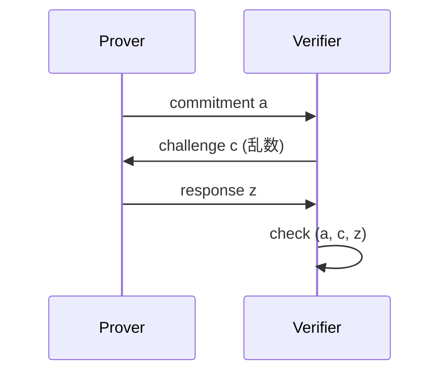

**日付**: 2026年4月22日
**学習内容**: **Fiat-Shamir 変換**は、対話型 ZKP を**非対話型**に変換する汎用手法。1986 年の Fiat-Shamir 論文で提案され、以来ほぼすべての現代 SNARK（Groth16, PLONK, STARK, Nova）が採用している。本記事では **(1) 動機と基本アイデア**、**(2) 基本構成: Verifier の乱数をハッシュに置き換え**、**(3) Random Oracle Model (ROM) の定義**、**(4) 健全性の証明（3 move public-coin 限定）**、**(5) 多ラウンドでのリスク（grinding attack）**、**(6) CI (Correlation Intractable) Hash による Fiat-Shamir**、**(7) 実装上の pitfall**、**(8) 実装における Transcript の役割** を扱う。「単純なトリックの裏に複雑な安全性議論がある」典型例。

## 0. 本記事の位置づけ

Article 3 で「CRS モデルと Random Oracle モデルの2つで非対話化できる」と触れた。本記事は後者の詳細。

Fiat-Shamir の素朴な説明は 1 文で済む:

> **「Verifier がランダムチャレンジを送る」ステップを、「Prover が過去のメッセージをハッシュして自分でチャレンジを作る」に置き換える**

これだけで対話型が非対話型に。ただし**健全性が保たれる条件**は非自明で、naive な適用は穴を生む。実際、2019 年以降の多くの ZKP バグが Fiat-Shamir 誤用に起因する。

構成:

- **第1章**: なぜ非対話化したいか（復習）
- **第2章**: 基本アイデア
- **第3章**: Random Oracle Model
- **第4章**: 3-move プロトコルでの健全性
- **第5章**: 多ラウンドでの grinding attack
- **第6章**: CI Hash
- **第7章**: 実装上の注意点
- **第8章**: Transcript の扱い
- **第9章**: Q&A とまとめ

## 1. なぜ非対話化したいか（復習）

### 1.1 ブロックチェーン適合

Ethereum などの L1 では、Prover と Verifier の双方向通信はコスト（ガス代・時間）が膨大。**1 トランザクションで完結する非対話型**が必須。

### 1.2 保存と再利用

対話型証明はその場限り。非対話化すれば:

- 証明を**ログとして記録**できる
- 監査で**後から検証**できる
- 複数の Verifier が**同じ証明を独立に検証**できる

### 1.3 UX とスケーラビリティ

対話型は Prover と Verifier が同時にオンラインである必要があり、実用が限定される。非対話型なら Prover だけがオンラインでよい。

## 2. 基本アイデア

### 2.1 Public-Coin プロトコル

Fiat-Shamir が使えるのは **Public-Coin** プロトコル。Verifier の乱数は公開で、特定の形式に従って生成される。

典型的な 3-move (Σ-protocol):



多くの ZKP (Schnorr, Sumcheck, PLONK) は基本的にこの構造の一般化。

### 2.2 Fiat-Shamir 変換の手順

対話型プロトコルに対して:

1. Verifier がランダムチャレンジ $c$ を送るステップを削除
2. Prover が代わりに $c := H(a, \ldots)$ でハッシュから生成
3. 他のステップは同じ

これで Prover が $(a, c, z)$ を一気に計算し、Verifier に送る:

$$
\pi = (a, z), \quad c := H(a)
$$

Verifier は $c$ を再計算して整合性確認。

### 2.3 例: Schnorr 署名

Schnorr 識別プロトコル（Discrete Log の知識証明）:

- Prover: $r \leftarrow \mathbb{F}_q$、$a = g^r$ を送る
- Verifier: $c \leftarrow \mathbb{F}_q$ を送る
- Prover: $z = r + c \cdot x$ を送る（$x$ は秘密鍵）
- Verifier: $g^z = a \cdot y^c$ を確認（$y = g^x$ は公開鍵）

Fiat-Shamir 後 (**Schnorr 署名**):

- Prover: $c := H(g, y, a, \text{message})$
- Prover: $z = r + c \cdot x$
- $\sigma = (c, z)$ を送信

Verifier: $c \stackrel{?}{=} H(g, y, g^z \cdot y^{-c}, \text{message})$ で検証。

これが EdDSA/Ed25519 等の現代署名の基礎。

## 3. Random Oracle Model (ROM)

### 3.1 理想化されたハッシュ

**Random Oracle** は「入力ごとに一様ランダムな出力を返す、仮想的なブラックボックス」:

$$
H: \{0, 1\}^* \to \{0, 1\}^\lambda, \quad H(x) \text{ は } x \text{ ごとに独立一様}
$$

- $H$ にクエリするたび、未知の入力なら新しい一様ランダムビットが返る
- 過去のクエリは一貫性を保つ

### 3.2 実装との乖離

現実のハッシュ関数 (SHA-3, Poseidon, Blake2) は:

- アルゴリズムで計算される（決定的）
- 十分ランダムに見えるが、Random Oracle ではない

**ROM は仮定**。現実の安全性は「選ばれたハッシュ関数が ROM として振る舞う」と信じる前提。

### 3.3 ROM の妥当性

- 実際に ROM ではない → 理論的には安全証明が崩れる
- しかし**暗号学的ハッシュ関数の設計**で ROM に近づける努力が続く

実用では十分信頼できる。

## 4. 3-move プロトコルでの健全性

### 4.1 対話型の健全性

3-move プロトコルで:

- $\Pr[V \text{ 受理 with } x \notin L] \leq \varepsilon$

### 4.2 Fiat-Shamir 後の健全性

**定理（直感）**: もとの対話型が健全性 $\varepsilon$ を持つなら、Fiat-Shamir 後は（ROM で）$\varepsilon$ + $q_H \cdot \varepsilon$、$q_H$ はハッシュクエリ数。

### 4.3 証明の直感

偽 Prover $P^\ast$ は $a$ を自由に選べ、$c := H(a)$ を計算する。これは**Verifier がランダム $c$ を送ったのと実質同じ**（$H$ が ROM なら $c$ は一様ランダム）。

ただし $P^\ast$ は**複数の $a$ を試せる**（grinding、後述）ので、毎回違う $c$ を引ける。$q_H$ 回試せば幸運を引く確率が $q_H$ 倍。

### 4.4 Schnorr の具体例

もとの対話型 Schnorr は健全性 $1/q$（$q$ は群位数）。Fiat-Shamir 後は $q_H / q$。$q_H = 2^{80}$、$q = 2^{256}$ なら $2^{-176}$ で十分安全。

## 5. 多ラウンドでの grinding attack

### 5.1 問題: 複数ラウンドでの劣化

3-move 以上、たとえば 10 ラウンドの対話型だと、Fiat-Shamir 後の健全性は単純に $q_H \cdot \varepsilon$ ではない。

### 5.2 Grinding (Attacking by trying multiple prefixes)

攻撃者が以下を試みる:

1. 最初の commit $a_1$ を選ぶ
2. チャレンジ $c_1 = H(a_1)$ を計算
3. もし $c_1$ が「自分にとって都合の良い」値なら、そのまま使う
4. さもなければ別の $a_1$ を試す
5. 繰り返し

攻撃者が $2^k$ 回試せば、**都合の良いチャレンジを $2^{-k}$ の確率から引く**。

### 5.3 健全性の劣化

$\lambda$ ラウンドのプロトコルで、ラウンドごとに grinding すると:

- 対話型での健全性 $2^{-\lambda}$
- Fiat-Shamir 後: 攻撃者が $2^k$ 回試して $2^{-(\lambda - k)}$ になる

$\lambda = 80$、攻撃者に $2^{60}$ の計算力があれば、健全性は $2^{-20}$ まで劣化。危険。

### 5.4 対策: セキュリティパラメータを上げる

- ラウンド数を増やす
- 各ラウンドの challenge space を大きくする
- Proof-of-Work を要求（Hash に対する grinding を難しくする）

### 5.5 FRI の場合

FRI (Article 23) は多ラウンドで grinding に弱い傾向。実装では:

- Challenge space を $2^{\sim 100}$ bit
- 必要ならさらにハッシュに PoW を加える

## 6. Correlation Intractable (CI) Hash

### 6.1 ROM を使わずに Fiat-Shamir

理論的に「ROM 仮定なし」で Fiat-Shamir を安全に使いたい。そのための道具が **Correlation Intractable (CI) Hash**。

### 6.2 CI の定義

ハッシュ関数 $H$ が**関係 $R$ に対して CI**: 攻撃者が $H(x) = f(x)$ かつ $(x, f(x)) \in R$ を満たす $x$ を見つけられない。

### 6.3 CI からの Fiat-Shamir

Canetti-Lombardi-Chen (2019) 等の結果で、**CI Hash があれば、ROM なしで Fiat-Shamir が安全**。

具体的には LWE (Learning With Errors) 仮定から CI Hash が作れる。

### 6.4 実用性

CI Hash は大きな関数で実用困難。**理論上 ROM を置き換えられることを示した**ことが価値。実装上は SHA-3 や Poseidon を ROM として扱う。

## 7. 実装上の注意点

### 7.1 Transcript の一貫性

**Pitfall 1**: Prover と Verifier がハッシュに入れるデータの順序・内容が一致しないと、challenge が食い違って健全性が崩れる。

- プロトコル仕様で**ハッシュに入れる全データの順序**を厳密に定義
- 実装でその順序を厳守

### 7.2 Domain Separation

**Pitfall 2**: 同じハッシュ関数を異なる用途で使うと、相互干渉する。

- Prefix でドメイン分離: $H(\text{"challenge\_c"} || a)$ vs $H(\text{"proof\_of\_opening"} || \ldots)$

### 7.3 Commitment の取り扱い

**Pitfall 3**: Commitment のシリアル化ミス。特に楕円曲線点は「圧縮 vs 非圧縮」「エンコーディング」で差が出やすい。

### 7.4 Challenge の形式

ハッシュ出力は $\{0, 1\}^\lambda$ のビット列。これを $\mathbb{F}_p$ に写すとき、**バイアス**が残ると攻撃される。

- **Rejection sampling**: $\mathbb{F}_p$ の範囲外なら再サンプル
- **Reduction mod $p$**: 簡単だがバイアスが発生

$p$ に非常に近い $2^\lambda$ を選べば、バイアスは無視可能。

### 7.5 過去事例

実際に起きた Fiat-Shamir 関連の脆弱性:

- **Frozen Heart attack (2022)**: PlonK などの実装で、Prover がハッシュ入力に公開入力を含めず、同じ proof が異なる public input で通る
- **zk-proof plonky2 bug**: Grinding attack による健全性低下

これらはプロトコル設計ではなく**実装ミス**に起因。

## 8. Transcript の扱い

### 8.1 Transcript の定義

**Transcript** は「Prover と Verifier の間で交わされたすべてのメッセージ」の累積記録。Fiat-Shamir では、新しい challenge を生成するたびに transcript を更新し、ハッシュで変換。

### 8.2 典型的な実装

```python
class Transcript:
    def __init__(self, label: bytes):
        self.state = b""
        self.absorb(b"domain", label)
    
    def absorb(self, label: bytes, data: bytes):
        self.state += label + len(data).to_bytes(4, 'big') + data
    
    def challenge(self, label: bytes) -> bytes:
        self.state += label
        return hash(self.state)
```

### 8.3 Merlin と STROBE

**Merlin** (ZCash) や **STROBE** は、Fiat-Shamir 用のトランスクリプト管理ライブラリ。SPONGE ベースのハッシュで効率的に扱える。

### 8.4 プロトコル仕様の重要性

- **入れる順序**を明示
- **ラベル (domain separation)** を明示
- **エンコーディング**を明示

これがないと**実装間の非互換**や**脆弱性**の温床に。

## 9. Q&A

### Q1: Fiat-Shamir 変換できないプロトコルは？

- **Private-coin protocols**: Verifier の乱数が Prover に見えないとダメ。Fiat-Shamir は公開可視な challenge 前提
- **Ex: quantum interactive proofs**: 量子状態のやりとり → 古典的にハッシュで代替できない

Public-coin なら原則 Fiat-Shamir 可能。

### Q2: Prover が Random Oracle を「事前に呼ぶ」ことは？

**ROM の性質でそれが困難**。$H$ の全ドメインを事前計算は不可能（$2^{256}$ 要素）。攻撃者が多項式時間で呼べるのは $q_H$ クエリだけ。

### Q3: ハッシュ関数が弱いと何が起きる？

- **衝突**があれば、Prover が同じ $a$ で異なる $c$ を得られる → 健全性崩壊
- **予測可能**なら、Prover に都合の良い $c$ を作れる

SHA-256, Blake2, SHA-3, Poseidon などが選ばれる。

### Q4: Fiat-Shamir と ZK 性の関係は？

- もと対話型が HVZK（Honest-Verifier ZK）なら、Fiat-Shamir 後 **ROM で ZK**
- 厳密には「Programmable Random Oracle」モデルが必要

### Q5: Fiat-Shamir のメモリコストは？

- Transcript を保持: $O(\text{プロトコル全体のメッセージサイズ})$
- SPONGE ベースのハッシュ (Poseidon 等) で**逐次更新**すれば、メモリは $O(1)$ の state だけ

### Q6: 量子 ROM (QROM) の話は？

量子攻撃者を考慮すると、Fiat-Shamir の健全性証明は ROM ではなく **QROM** で行う必要がある。最近の研究で多くの Σ-protocol は QROM でも Fiat-Shamir 安全と示されている。

## 10. まとめ

### 本記事の要点

1. **Fiat-Shamir**: Verifier の乱数を Prover 自身がハッシュで生成することで非対話化
2. **Random Oracle Model**: 理想ハッシュ関数の仮定。SHA-3 等で近似
3. **3-move** (Σ-protocol) では健全性が $\varepsilon + q_H \varepsilon$ 程度に保たれる
4. **多ラウンドは grinding attack に注意**。セキュリティパラメータを大きく
5. **CI Hash**: ROM なしで Fiat-Shamir を安全にする理論的ツール
6. **実装の pitfall**: transcript の一貫性、domain separation、challenge のバイアス
7. **Transcript**: Merlin/STROBE が実用的な管理ライブラリ

### 次の記事（Article 18）へ

次の記事は **Lookup Argument** と **Custom Gate**。Plonkish で「テーブル参照」と「特殊ゲート」を低コストで扱う技法。Poseidon ハッシュや range check が劇的に速くなる、現代 SNARK の必需品。

### 3行サマリ

- **Fiat-Shamir = Verifier 乱数をハッシュで置き換えて非対話化**
- **Random Oracle Model が前提**、実装は SHA-3/Poseidon などを仮定
- **多ラウンドは grinding attack** を考慮してセキュリティパラメータを大きく

---

## 参考文献

- Amos Fiat, Adi Shamir. *How to Prove Yourself: Practical Solutions to Identification and Signature Problems.* CRYPTO 1986.
- Ran Canetti, Alex Lombardi, Daniel Wichs. *Fiat-Shamir: From Practice to Theory.* STOC 2019.
- Alessandro Chiesa, Eylon Yogev. *Toward Non-Interactive Zero-Knowledge Proofs for NP from LWE.* CRYPTO 2021.
- Ariel Gabizon. *From AIRs to RAPs: How PlonK-style arithmetization works.* Blog, 2021.
- ZKP MOOC Lecture 8 (UC Berkeley, 2023).
