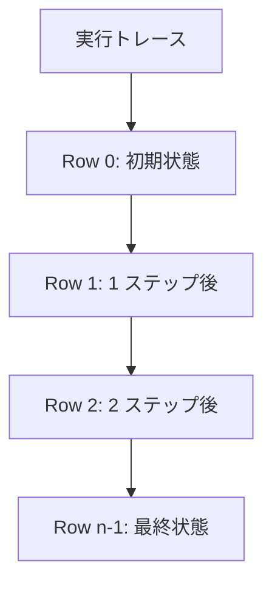
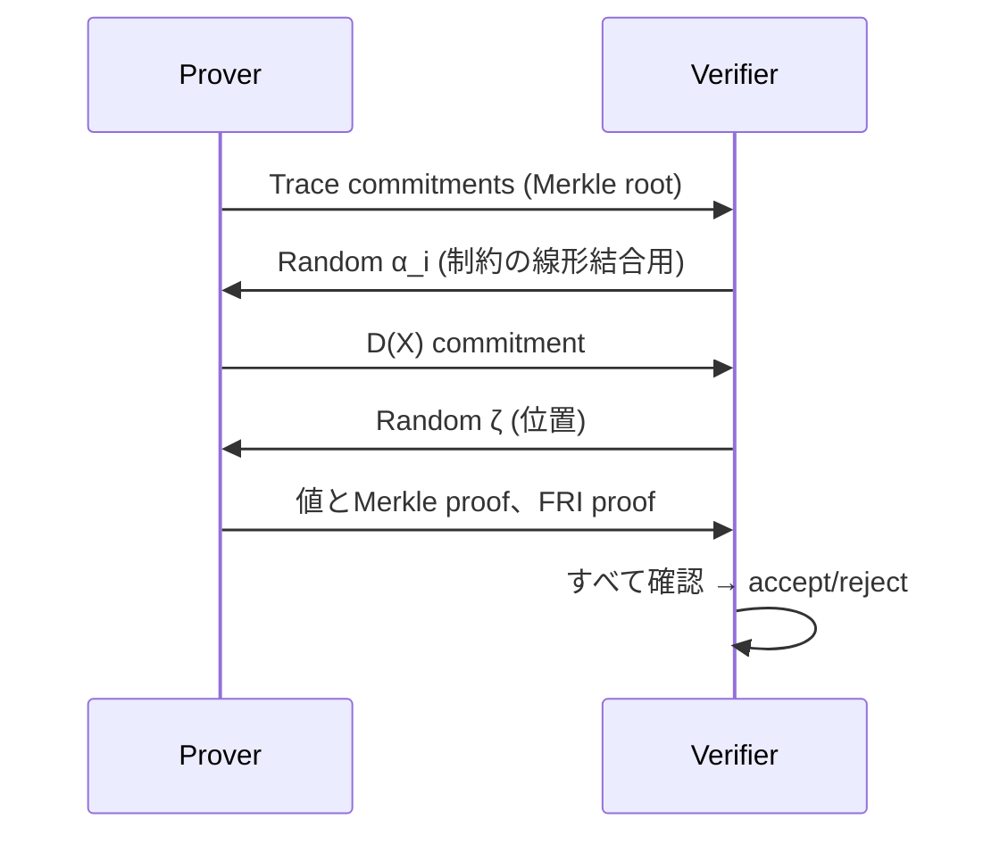

**日付**: 2026年4月22日
**学習内容**: **STARK (Scalable Transparent ARgument of Knowledge)** は Ben-Sasson らが 2018 年に提案した ZKP システムで、**(1) Trusted Setup が不要 (Transparent)**、**(2) 量子計算耐性 (Post-Quantum)**、**(3) Prover が非常に高速** という、SNARK にはない特徴を持つ。その反面**証明サイズは大きい**（数十〜数百 KB）。本記事では **(1) STARK vs SNARK**、**(2) AIR (Algebraic Intermediate Representation)**、**(3) 実行トレースと多項式化**、**(4) 境界制約と遷移制約**、**(5) 検証ステップの全体像**、**(6) FRI の役割（次記事への橋渡し）**、**(7) 代表的な STARK 実装（StarkNet / Cairo, Plonky2, Winterfell）** を扱う。

## 0. 本記事の位置づけ

ここから 3 記事（21〜23）は STARK 系。STARK は SNARK と並ぶもう 1 つの ZKP の柱で、特徴が大きく違う:

| 項目 | SNARK (KZG) | STARK (FRI) |
|---|---|---|
| Trusted Setup | 必要 | **不要** |
| 量子耐性 | ✗ | ✓ |
| 証明サイズ | ~200B | ~100KB |
| Prover 時間 | 中 | 速 |
| 応用 | zkRollup, 決済 | zkVM, StarkNet |

STARK の真価は「**Transparent + PQ**」。これを実現するために、楕円曲線やペアリングではなく**ハッシュ関数だけ**を使う。

構成:

- **第1章**: STARK の設計哲学
- **第2章**: AIR (Algebraic Intermediate Representation)
- **第3章**: 実行トレースと多項式化
- **第4章**: 制約の書き方
- **第5章**: プロトコル全体像
- **第6章**: FRI への橋渡し
- **第7章**: 実装
- **第8章**: Q&A とまとめ

## 1. STARK の設計哲学

### 1.1 Transparent Setup

Trusted Setup の問題:

- MPC Ceremony が必要
- 毒 $\tau$ が漏れると致命的
- 新規回路ごとに再実施 (Groth16)

STARK の立場:

> **ハッシュ関数だけで済むようにすれば、事前のセットアップは何も要らない**

公開ハッシュ関数（SHA-3, Blake3, Poseidon など）だけを「信頼」する。これで Transparent。

### 1.2 Post-Quantum

量子計算機による Shor アルゴリズムは **離散対数 / 素因数分解** を多項式時間で解く。しかし**ハッシュ関数** は量子に対しても指数時間（Grover で $\sqrt{N}$ 程度の加速はあるが抑えられる）。

したがって「ハッシュだけで構成」 = Post-Quantum。

### 1.3 Scalable

Prover 時間は $O(|T| \log |T|)$（$|T|$ は実行トレースの長さ）。大規模計算に強い。

### 1.4 証明サイズのトレードオフ

Transparent + PQ を得るかわり、証明サイズが大きい:

- SNARK Groth16: ~200 B
- STARK: ~100 KB（中規模回路）

L1 に乗せるとガス代が高い。そこで **STARK → SNARK recursion**（最後に SNARK で圧縮）が一般的。StarkNet では SHARP が Cairo STARK を最終的に Solidity 検証可能な形に圧縮。

## 2. AIR (Algebraic Intermediate Representation)

### 2.1 AIR の発想

SNARK は「回路のすべてのゲートを満たす witness」を扱う。STARK は視点を変えて、**CPU の実行トレースを扱う**:

- 各**行** = 1 ステップの CPU 状態
- 各**列** = 1 レジスタの値の時間変化
- **隣接行**の関係が「状態遷移関数」

### 2.2 AIR の構成要素

- **Trace**: $n$ 行 × $w$ 列 の表 $T \in \mathbb{F}^{n \times w}$
- **Transition constraints**: 隣接行の関係 $P(\vec T_i, \vec T_{i+1}) = 0$
- **Boundary constraints**: 初期値・最終値 $T_0 = \text{init}, T_{n-1} = \text{final}$

### 2.3 例: フィボナッチ数列

フィボナッチ $F_0 = 1, F_1 = 1, F_{i+2} = F_i + F_{i+1}$ を扱う。

Trace (2 列):

| $i$ | col0 ($F_i$) | col1 ($F_{i+1}$) |
|---|---|---|
| 0 | 1 | 1 |
| 1 | 1 | 2 |
| 2 | 2 | 3 |
| 3 | 3 | 5 |
| 4 | 5 | 8 |

**Transition constraint**:

- $T_{i+1, 0} = T_{i, 1}$（次の $F$ は前の $F_{i+1}$）
- $T_{i+1, 1} = T_{i, 0} + T_{i, 1}$（和）

**Boundary constraint**: $T_{0, 0} = 1, T_{0, 1} = 1$

### 2.4 より複雑な例: 2 の 1000 乗

「$2^{1000}$ を計算」の AIR:

- Trace: 1 列
- $T_0 = 1$（初期）
- $T_{i+1} = 2 T_i$（遷移）
- $T_{1000} = ?$（出力）

100 行 × 1 列 = 100 セルで完結。

### 2.5 EVM / CPU の AIR

zkEVM や Cairo は CPU 命令セットを AIR で表現。各 opcode ごとに遷移制約を定義、レジスタ数 = 列数。

## 3. 実行トレースと多項式化

### 3.1 トレースを多項式に

各列 $j$ のトレース $\{T_{0, j}, T_{1, j}, \ldots, T_{n-1, j}\}$ を補間して多項式 $P_j(X)$ を作る。

$n$ 点を補間 → 次数 $n - 1$ 以下の多項式。

### 3.2 評価ドメイン

Trace 評価ドメイン:

$$
H = \{\omega^0, \omega^1, \ldots, \omega^{n-1}\}
$$

$\omega$ は 1 の $n$ 乗根。

### 3.3 拡張ドメイン

STARK は**拡張ドメイン** $L$ で評価する。$|L| = \rho^{-1} \cdot n$（$\rho$ はブローアップ、通常 $1/2, 1/4, 1/8$）。

ブローアップの目的: **誤り訂正符号として余裕を持たせる**。詳細は次の Article 22 で。

### 3.4 トレース多項式の評価

$P_j(X)$ を評価ドメイン $L$ 上で評価し、Merkle ツリーでコミット。

## 4. 制約の書き方

### 4.1 Transition constraint の多項式化

$P(\vec T_i, \vec T_{i+1}) = 0$ を多項式等式に:

$$
C(X) := P(P_1(X), P_2(X), \ldots, P_w(X), P_1(X \omega), \ldots, P_w(X \omega))
$$

ここで $X \omega$ は「次の行」に対応。

$C(X)$ が $H$ 上でゼロになる必要 → 消滅多項式 $Z_H(X) = X^n - 1$ で割り切れる。

### 4.2 Boundary constraint の多項式化

$T_0 = \text{init}$ なら $P(1) - \text{init} = 0$ → $(P(X) - \text{init}) / (X - 1)$ が多項式。

### 4.3 Composition Polynomial

すべての制約を線形結合（ランダムチャレンジ $\alpha_i$ で）:

$$
D(X) = \sum_i \alpha_i \cdot C_i(X) / Z_i(X)
$$

$D(X)$ が次数 $\leq d_{\text{target}}$ であれば、全制約が成立。

### 4.4 低次数テストの必要性

$D(X)$ が本当に低次なのかは、STARK の Prover 主張。これを確認する仕組みが FRI。

## 5. プロトコル全体像

### 5.1 Prover の手順

1. 計算を実行して trace を構築
2. trace を補間して $P_1, \ldots, P_w$ を得る
3. 拡張ドメイン $L$ 上で評価、Merkle コミット
4. Verifier からのランダムチャレンジ $\alpha_i$ を受けて $D(X)$ を作成
5. $D(X)$ も拡張ドメインで評価、Merkle コミット
6. FRI で $D(X)$ が低次であることを証明
7. ランダム位置での評価を提示

### 5.2 Verifier の手順

1. Prover のコミットメントを受け取る
2. ランダム位置でチェック:
   - 各トレース値と Merkle proof
   - 制約が該当行で成立するか
   - $D(X)$ が $C_i(X)$ と整合的か
3. FRI の検証
4. すべて合格なら受理

### 5.3 Fiat-Shamir 非対話化

上は対話型の描写だが、Fiat-Shamir で非対話化。Prover が transcript をハッシュして $\alpha_i, \zeta$ を自己生成。

## 6. FRI への橋渡し

### 6.1 FRI が解く問題

STARK の健全性の鍵は:

- **$D(X)$ が低次か** を Verifier が確認できる

ナイーブには「$D$ の全係数を送ってもらう」だが、それだと証明サイズが $O(n)$ で Succinct 性が崩れる。

**FRI** は $O(\log^2 n)$ サイズで「$D$ が低次（または低次から近い）」を確率的に示す。

### 6.2 FRI の基本イメージ

多項式を「半分に折る」操作を $\log n$ 回繰り返し、最後に定数になることを確認。各折り返しを Merkle commit + ランダム位置チェック。

詳細は Article 23。

### 6.3 FRI の性能

- 証明サイズ: $O(\log^2 n)$、実用で 100 KB 程度
- Verifier 時間: $O(\log^2 n)$、数 ms
- Prover 時間: $O(n \log n)$

## 7. 実装

### 7.1 StarkNet / Cairo

**Cairo** は STARK-friendly な CPU アーキテクチャ + 言語。StarkNet は Cairo ベースの L2。

- Cairo プログラムを書く
- StarkNet ノードが STARK 証明を生成
- SHARP (Shared Prover) が複数プログラムを集約
- 最終証明を Ethereum L1 に送信

### 7.2 Plonky2

**PLONK-ish arithmetization + FRI** のハイブリッド。Polygon Zero が開発。

- 64-bit Goldilocks field で高速
- 再帰 SNARK 対応
- 証明サイズ ~100KB

### 7.3 Winterfell

Facebook (Meta) 開発の Rust STARK ライブラリ。教育的に分かりやすい。

### 7.4 RISC Zero

**汎用 RISC-V VM** の STARK 実装。任意の Rust / C プログラムを zk で実行。

### 7.5 SP1 (Succinct Labs)

2024 年の高速 STARK-based zkVM。RISC-V ベース、Plonky3 と連動。

## 8. Q&A

### Q1: STARK は SNARK より遅い？

**Prover は STARK の方が速い**ことが多い。FFT 主体で並列化しやすい。Verifier は SNARK の方が速い（ペアリング数回 vs 大量の Merkle proof 検証）。

### Q2: Binius との関係は？

Binius は GF(2) ベースで STARK の発展形。さらに高速・軽量だが、まだ研究段階。

### Q3: STARK で BN254 は使える？

使わない。STARK はハッシュベースで、楕円曲線は不要。Goldilocks, BabyBear, Mersenne31 のような小さい素数を使う。

### Q4: STARK 証明を Ethereum L1 に載せるコストは？

~500K gas 程度（EIP-2537 の BLS precompile で PLONK ベースに圧縮した場合）。素のまま載せると数 M gas 以上。

### Q5: AIR vs R1CS / Plonkish どれが良い？

- **AIR**: CPU 的な反復計算、zkVM に最適
- **R1CS**: 単発の数学的関数
- **Plonkish**: 柔軟、custom gate + lookup

zkVM には AIR、DeFi 系回路には Plonkish、単純なサンプル証明には R1CS が多い。

### Q6: STARK の量子耐性はどこまで安全？

Grover のアルゴリズムでハッシュの衝突を $2^{n/2}$ 時間で見つけられる。そこで $n \geq 256$ のハッシュ出力を使う。128 bit 量子安全。

## 9. まとめ

### 本記事の要点

1. **STARK** = Scalable, Transparent, ARgument of Knowledge
2. **Transparent**: Trusted Setup 不要
3. **Post-Quantum**: ハッシュベースで量子耐性
4. **AIR**: 実行トレースを多項式化、隣接行の遷移制約
5. **Boundary + Transition constraints** を多項式で表現
6. **Composition Polynomial** $D(X)$ が低次 ⟺ 全制約成立
7. **FRI** で低次性を $O(\log^2 n)$ サイズで証明
8. **実装**: StarkNet/Cairo, Plonky2, Winterfell, RISC Zero, SP1

### 次の記事（Article 22）へ

次の記事は **Reed-Solomon 符号と FFT**。STARK / FRI の土台となる誤り訂正符号の理論と、高速多項式変換を扱う。

### 3行サマリ

- **STARK = Transparent + PQ + Scalable、FRI ベースの ZKP**
- **AIR** で実行トレースを多項式化
- **証明サイズ大きめ (100KB) だが、Prover 高速・信頼仮定なし**

---

## 参考文献

- Eli Ben-Sasson et al. *Scalable, Transparent, and Post-Quantum Secure Computational Integrity.* ePrint 2018/046.
- StarkWare. *Cairo: A Turing-complete STARK-friendly CPU architecture.* 2021.
- Polygon Zero. *Plonky2: Fast Recursive Arguments with PLONK and FRI.* 2022.
- Justin Thaler. *Proofs, Arguments, and Zero-Knowledge.* Chapter 9.
- ZKTokyo Week 4 資料.
