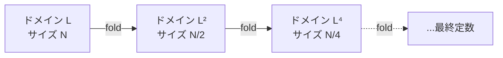
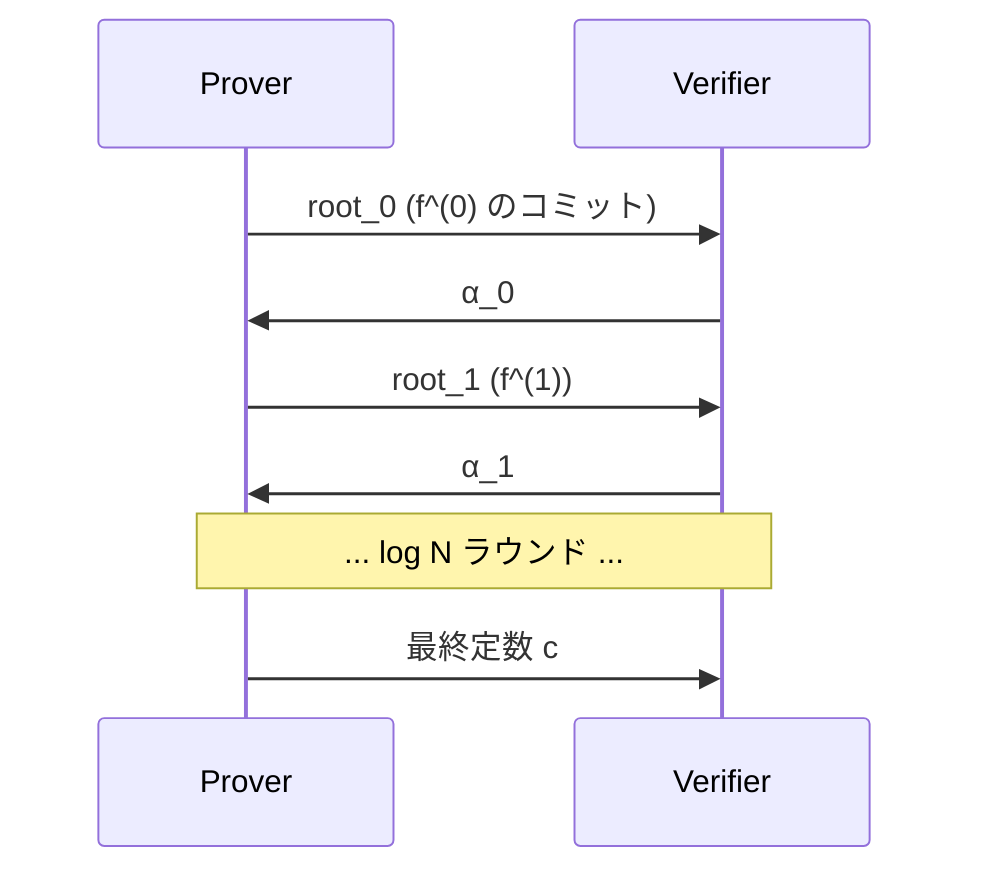

**日付**: 2026年4月22日
**学習内容**: **FRI (Fast Reed-Solomon IOP of Proximity)** は STARK の核心。**「ある値の列が低次多項式の評価に近い」**ことを $O(\log^2 n)$ の通信量で示す対話型プロトコル。本記事では **(1) FRI の問題設定**、**(2) 低次数テストの素朴な方法**、**(3) FRI の基本アイデア (folding)**、**(4) 各ラウンドの数式展開**、**(5) Commit / Query phases**、**(6) 健全性誤差の解析**、**(7) Grinding 攻撃への対策**、**(8) DEEP-FRI や IOPP の発展** を扱う。式の展開を丁寧に追う。

## 0. 本記事の位置づけ

Article 22 で「ある値の列が低次多項式の評価と近いか」を検証する**低次数テスト**が必要と述べた。FRI はその解答。

FRI のキモ:

- 多項式を **半分に折る** という操作を $\log n$ 回繰り返す
- 最後に定数になったら OK
- 各折り返しで Merkle commit + ランダム位置チェック

これで $O(\log n)$ ラウンド、各ラウンド $O(\log n)$ 通信 → 合計 $O(\log^2 n)$。

構成:

- **第1章**: FRI の問題設定
- **第2章**: 素朴な低次数テスト
- **第3章**: FRI の基本アイデア
- **第4章**: 各ラウンドの数式
- **第5章**: Commit / Query phases
- **第6章**: 健全性誤差
- **第7章**: Grinding 対策
- **第8章**: 発展
- **第9章**: Q&A とまとめ

## 1. FRI の問題設定

### 1.1 問題

Prover と Verifier がある。Prover は:

- 値の列 $u = (u_0, u_1, \ldots, u_{N-1}) \in \mathbb{F}^N$ にコミット
- これが「**次数 $d$ 以下の多項式の評価**」だと主張

Verifier は Merkle コミットメントと少数の開示値だけを見て、主張を確率的に検証する。

### 1.2 評価ドメイン

評価点は**1 の累乗**:

$$
L = \{\omega^0, \omega^1, \ldots, \omega^{N-1}\}
$$

$\omega^N = 1$、$\omega^k \neq 1$ for $0 < k < N$。

### 1.3 ブローアップ

$d + 1 < N$（ブローアップ）なので、符号化レート $\rho = (d+1)/N < 1$。典型: $\rho = 1/2, 1/4, 1/8$。

### 1.4 目標

- 通信量 $O(\log^2 N)$
- 健全性 $\leq (1 - \delta)^s + \text{negl}(\lambda)$（$\delta$: 近接性閾値、$s$: query 数）

## 2. 素朴な低次数テスト

### 2.1 素朴な方法1: 全係数送信

Prover が多項式 $f$ の $d+1$ 個の係数を送れば、Verifier は自分で $f$ を評価可能。

- 通信量: $O(d)$
- **Succinct 性が壊れる**

### 2.2 素朴な方法2: 多項式補間

Verifier が $d+1$ 個のランダム位置で値を要求し、補間して多項式を復元。

- 通信量: $O(d)$
- やはり Succinct ではない

### 2.3 求めたい性能

$O(\log^2 d)$ の通信量で、確率的に近接性を検証したい。**FRI** がこれを実現する。

## 3. FRI の基本アイデア

### 3.1 多項式の偶奇分解

多項式 $f(X)$ を偶次と奇次に分割:

$$
f(X) = f_e(X^2) + X \cdot f_o(X^2)
$$

- $f_e$: 偶次係数からなる多項式
- $f_o$: 奇次係数からなる多項式
- **次数は両方とも** $\lfloor d/2 \rfloor$ 以下

つまり次数がほぼ半分になる。

### 3.2 Folding

ランダムチャレンジ $\alpha$ を使って、**1 つの新しい多項式**に折り畳む:

$$
f_{\text{fold}}(Y) := f_e(Y) + \alpha \cdot f_o(Y)
$$

次数は $\lfloor d/2 \rfloor$ 以下。**多項式のサイズが半減**した！

### 3.3 評価点の対応

折り畳み前の $f$ は $L = \{\omega^i\}$ で評価、折り畳み後の $f_{\text{fold}}$ は $L^2 = \{(\omega^i)^2\}$ で評価。

$L^2 = \{\omega^0, \omega^2, \omega^4, \ldots\}$ のサイズは $N/2$。

### 3.4 $\log N$ ラウンドで定数に

ドメインサイズが半減していくので、$\log N$ ラウンドで 1 要素まで縮む。その値が**定数多項式**（1 係数）に対応。

## 4. 各ラウンドの数式

### 4.1 評価値間の関係

Prover は $f$ の評価値 $\{f(\omega^i)\}$ を Merkle commit している。フォールド後の値は:

$$
f_{\text{fold}}(\omega^{2i}) = f_e(\omega^{2i}) + \alpha f_o(\omega^{2i})
$$

### 4.2 $f_e, f_o$ を $f$ の評価値から計算

$f(X) = f_e(X^2) + X f_o(X^2)$ だから、$X$ と $-X$ で評価すると:

$$
f(X) = f_e(X^2) + X f_o(X^2)
$$

$$
f(-X) = f_e(X^2) - X f_o(X^2)
$$

和と差で分離:

$$
f_e(X^2) = \frac{f(X) + f(-X)}{2}
$$

$$
f_o(X^2) = \frac{f(X) - f(-X)}{2X}
$$

### 4.3 Folded 値

$f(\omega^i)$ と $f(-\omega^i) = f(\omega^{i + N/2})$ から folded 値を計算:

$$
f_{\text{fold}}(\omega^{2i}) = \frac{f(\omega^i) + f(\omega^{i + N/2})}{2} + \alpha \cdot \frac{f(\omega^i) - f(\omega^{i + N/2})}{2 \omega^i}
$$

### 4.4 整理

$$
f_{\text{fold}}(\omega^{2i}) = \frac{1}{2}\left[\left(1 + \frac{\alpha}{\omega^i}\right) f(\omega^i) + \left(1 - \frac{\alpha}{\omega^i}\right) f(\omega^{i + N/2})\right]
$$

この式から、Verifier は **$f$ の 2 点** を知れば **$f_{\text{fold}}$ の 1 点** を計算できる。

### 4.5 Prover の作業

Prover は各ラウンドで:

1. 新しい $f^{(k+1)} = f_e^{(k)} + \alpha_k f_o^{(k)}$ を計算
2. $f^{(k+1)}$ の評価値を Merkle コミット

## 5. Commit / Query phases

### 5.1 Commit Phase

Prover が以下を行う:

1. **Round 0**: $f^{(0)} = f$ を評価・Merkle commit → $\text{root}_0$
2. **Challenge $\alpha_0$** を受信（Fiat-Shamir）
3. **Round 1**: $f^{(1)} = f_{\text{fold}}$ を計算・Merkle commit → $\text{root}_1$
4. **Challenge $\alpha_1$**
5. ... $\log N$ ラウンド繰り返し
6. 最終: 定数値 $c$ を送信

### 5.2 Query Phase

$s$ 回（典型的に $s = 30$〜80）繰り返し:

1. Verifier がランダム位置 $i$ を選ぶ
2. 各ラウンド $k$ で:
   - Prover が $f^{(k)}(\omega^{i_k}), f^{(k)}(\omega^{i_k + N_k/2})$ を開示
   - Prover が Merkle proof を送る
3. Verifier は各ラウンドで folded 値の整合性を確認:

$$
f^{(k+1)}(\omega^{2 i_k}) \stackrel{?}{=} \text{folded\_value}(\alpha_k, f^{(k)}(\omega^{i_k}), f^{(k)}(\omega^{i_k + N_k/2}))
$$

4. 最終ラウンドの値が送られてきた定数 $c$ と一致するか

### 5.3 Merkle proof

各開示値には Merkle proof（$O(\log N)$ ハッシュ）が付く。これが証明サイズの主成分。

### 5.4 証明サイズ

- $\log N$ ラウンド
- 各ラウンド $s$ query
- 各 query $O(\log N)$ Merkle proof

合計 $O(s \cdot \log^2 N)$。$N = 2^{20}$, $s = 40$ で ~100 KB。

## 6. 健全性誤差

### 6.1 近接性ギャップ

**$u$ が符号 $C$ に $\delta$-close**: $u$ を変えて符号語にするのに $\delta \cdot N$ 位置の変更が必要。

### 6.2 主な主張

**定理 (大まかな形)**: Prover が $\delta$-far な列 $u$ を渡しても、Verifier が受理する確率 $\leq (1 - \delta)^s + \text{negl}$。

- $\delta = 1/2, s = 40$ なら $2^{-40}$ 程度
- $s$ を大きくすれば指数的に減る

### 6.3 $\delta$ の範囲

- **Unique decoding**: $\delta < (1-\rho)/2$
- **Johnson bound**: $\delta < 1 - \sqrt{\rho}$
- **STARK 実用**: Johnson bound まで

$\rho = 1/4$ なら $\delta < 1 - 1/2 = 1/2$。

### 6.4 Soundness Error の正確な式

$$
\varepsilon_{\text{FRI}} \leq \frac{d}{|\mathbb{F}|} + (1 - \delta)^s
$$

- 第1項: Schwartz-Zippel 的な誤差
- 第2項: query ごとの検出失敗

## 7. Grinding 対策

### 7.1 Grinding 攻撃

Prover が commit phase で**多数の候補**を試し、都合の良いチャレンジ $\alpha_k$ を引く。Fiat-Shamir 下で問題。

### 7.2 Proof of Work を追加

チャレンジ生成時に PoW を要求:

$$
\alpha_k := H(\text{transcript} || \text{nonce}), \quad H(\cdot) \text{ が特定パターン (先頭 } b \text{ bit 0)}
$$

これで Prover は $2^b$ 回の試行を強制される。攻撃コストが指数的に増加。

### 7.3 セキュリティパラメータ

- 実用: $b = 20 \sim 30$ bit PoW
- セキュリティ劣化を **$2^b$ 倍**補償

### 7.4 StarkWare / Plonky2 での採用

すべての実用 STARK システムは grinding 対策を実装。

## 8. 発展

### 8.1 DEEP-FRI

DEEP (Domain Extending for Eliminating Pretenders) 技法で、FRI の健全性を Johnson bound を超えて改善する。

### 8.2 FRI-based Aggregation

複数の FRI 証明を 1 つに集約:

- 各証明をチャレンジの線形結合
- 最終 1 つの FRI

### 8.3 IOPP (Interactive Oracle Proof of Proximity)

FRI は IOPP の具体例。他にも:

- Ligero
- Brakedown
- RedShift

各々レート・証明サイズ・Prover 時間に特徴。

### 8.4 Recursion with FRI

FRI 検証を別の STARK の回路として書き、**再帰 STARK** を作る。Plonky2 はこれで無限再帰を実現。

## 9. Q&A

### Q1: FRI の「fast」って何に対して？

Reed-Solomon の復号は $O(n \log n)$、FRI は**検証** $O(\log^2 n)$。こちらの方が速いという意味で fast。

### Q2: $\alpha$ のサンプル空間は？

$\mathbb{F}$ のどこから取ってもよい。小さい体 (Goldilocks 64-bit) なら**拡大体** $\mathbb{F}_{p^2}$ からサンプルする（エントロピー確保）。

### Q3: 最終の定数はなぜ必要？

定数多項式は係数 1 個なので直接送信可能。わざわざ FRI しなくて良い。だから FRI は「定数になるまで」折り畳む。

### Q4: Query 数 $s$ はどう決める？

セキュリティパラメータ $\lambda = 128$ なら、$\delta$ と $\rho$ から $s$ を計算:

$$
s = \lceil \lambda / \log(1/(1-\delta)) \rceil
$$

典型的に $s = 30 \sim 80$。

### Q5: Prover の時間計算量は？

- Commit: $O(N \log N)$ (NTT ベース)
- 各ラウンドの fold: $O(N_k)$、合計 $O(N)$
- Merkle tree 構築: $O(N)$

合計 $O(N \log N)$。

### Q6: FRI と KZG、どちらが良い？

- **証明サイズ**: KZG 圧勝 (48B vs 100KB)
- **Setup**: FRI が Transparent
- **PQ**: FRI が耐性あり
- **検証時間**: KZG が速い

**用途で選ぶ**。L1 に乗せるなら KZG、Transparent 重視なら FRI。

## 10. まとめ

### 本記事の要点

1. **FRI** は Reed-Solomon 符号への近接性を $O(\log^2 N)$ で検証
2. **Folding**: 多項式を偶奇分解 + チャレンジで 1 つに折る、次数が半減
3. **Commit phase**: $\log N$ ラウンドで Merkle commit
4. **Query phase**: ランダム位置 $s$ 回で整合性確認
5. **健全性**: $(1 - \delta)^s$ で指数減衰
6. **Grinding 対策**: PoW チャレンジ生成
7. 発展: DEEP-FRI, IOPP, FRI 再帰

### 次の記事（Article 24）へ

次の記事から **第6部: 実装とセキュリティ**。最初は **Circom** で実際に ZKP 回路を書く。HDL 的な記法で R1CS を生成し、snarkjs で証明生成する実践的な記事。

### 3行サマリ

- **FRI = Reed-Solomon 低次数テスト**、対話型 IOPP
- **Folding で次数を半減、$\log N$ ラウンドで定数に**
- **STARK の心臓部**、Transparent + PQ の源泉

---

## 参考文献

- Eli Ben-Sasson et al. *Fast Reed-Solomon Interactive Oracle Proofs of Proximity.* ICALP 2018.
- Eli Ben-Sasson et al. *DEEP-FRI: Sampling Outside the Box Improves Soundness.* ITCS 2020.
- StarkWare. *ethSTARK Documentation.* 2021.
- Polygon Zero. *Plonky2: FRI with Grinding.* 2022.
- Justin Thaler. *Proofs, Arguments, and Zero-Knowledge.* Chapter 9-10.
