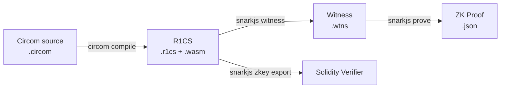

**日付**: 2026年4月22日
**学習内容**: **Circom** は ZKP 回路を記述するための**ドメイン特化言語 (DSL)**。Iden3 が開発し、Tornado Cash, Zcash の一部、多くの Ethereum L2 で使われる事実上の標準。本記事では **(1) Circom の言語仕様**、**(2) テンプレート (template) とコンポーネント**、**(3) signal と constraint**、**(4) ライブラリ circomlib**、**(5) 完全実装例（Poseidonハッシュ入力のプライバシー）**、**(6) snarkjs で証明生成・検証**、**(7) Solidity verifier の自動生成**、**(8) よくあるバグパターン** を扱う。読み終えれば自分で簡単な ZKP を組めるようになる。

## 0. 本記事の位置づけ

Article 10-18 で SNARK の理論を学んだ。本記事からは**実装編**。最初の題材は Circom。

Circom の立ち位置:

- R1CS を生成する **HDL (Hardware Description Language) 的言語**
- 出力: R1CS + witness 生成スクリプト
- 後段: **snarkjs** または **rapidsnark** で Groth16 / PLONK 証明を生成



構成:

- **第1章**: 環境構築
- **第2章**: 基本構文
- **第3章**: Template とコンポーネント
- **第4章**: circomlib
- **第5章**: 完全実装例
- **第6章**: snarkjs ワークフロー
- **第7章**: Solidity verifier
- **第8章**: よくあるバグ
- **第9章**: Q&A とまとめ

## 1. 環境構築

### 1.1 インストール

Rust (Circom 2 系):

```bash
git clone https://github.com/iden3/circom.git
cd circom
cargo build --release
cargo install --path circom
```

snarkjs:

```bash
npm install -g snarkjs
```

### 1.2 バージョン

- **Circom 2**: 現行、型が強い
- **Circom 1**: レガシー、新規プロジェクトは使わない

### 1.3 開発環境

- **VS Code** + Circom 拡張
- **Hardhat** + circom-integration プラグイン (Solidity 連携)
- **Foundry** + snarkjs スクリプト

## 2. 基本構文

### 2.1 最小例: $x^2 = y$

```circom
pragma circom 2.0.0;

template Square() {
    signal input x;
    signal output y;

    y <== x * x;
}

component main = Square();
```

- `signal input x`: 公開または私的入力
- `signal output y`: 出力
- `<==` 左辺 = 右辺（制約 + witness 代入）

### 2.2 Signal の種類

| 種類 | 意味 |
|---|---|
| `signal input x;` | 入力 |
| `signal output y;` | 出力 |
| `signal t;` | 中間信号 |

### 2.3 演算子

- `<==`: **制約 + 代入** （R1CS 制約を追加）
- `<--`: **代入のみ** （witness 計算、制約なし）
- `===`: **制約のみ**

例:

```circom
signal a, b, c;

a <== b + c;   // c = b + c の制約も追加
a <-- b + c;   // witness で a = b + c を代入、制約なし
a === b + c;   // 制約だけ
```

### 2.4 プログラムの制限

- **ループ**: 静的な for ループのみ (`for (var i = 0; i < 10; i++)`)
- **分岐**: 静的な if のみ
- **再帰**: 不可
- **浮動小数点**: 不可（$\mathbb{F}_p$ のみ）

## 3. Template とコンポーネント

### 3.1 Template

再利用可能な回路の定義:

```circom
template Multiplier() {
    signal input a;
    signal input b;
    signal output c;

    c <== a * b;
}
```

### 3.2 Component

Template のインスタンス:

```circom
template Main() {
    signal input x;
    signal input y;
    signal output z;

    component mul = Multiplier();
    mul.a <== x;
    mul.b <== y;
    z <== mul.c;
}
```

### 3.3 パラメータ化された Template

```circom
template NAryAdder(n) {
    signal input in[n];
    signal output out;

    signal sum[n];
    sum[0] <== in[0];
    for (var i = 1; i < n; i++) {
        sum[i] <== sum[i-1] + in[i];
    }
    out <== sum[n-1];
}

component main = NAryAdder(4);
```

### 3.4 配列と多次元

```circom
template MatrixMultiplier(n) {
    signal input A[n][n];
    signal input B[n][n];
    signal output C[n][n];

    for (var i = 0; i < n; i++) {
        for (var j = 0; j < n; j++) {
            signal sum[n];
            sum[0] <== A[i][0] * B[0][j];
            for (var k = 1; k < n; k++) {
                sum[k] <== sum[k-1] + A[i][k] * B[k][j];
            }
            C[i][j] <== sum[n-1];
        }
    }
}
```

### 3.5 Public Input

`component main = ...` の後に:

```circom
component main { public [x, y] } = Main();
```

Verifier は `x, y` の値を知る必要がある。それ以外は private。

## 4. circomlib

### 4.1 circomlib とは

Circom 標準ライブラリ。頻出回路を提供:

- **Poseidon hash** (`poseidon.circom`)
- **Pedersen hash** (`pedersen.circom`)
- **Merkle tree** (`smt/` など)
- **EdDSA 署名検証** (`eddsaposeidon.circom`)
- **Comparators** (`comparators.circom`: `IsEqual`, `LessThan`)
- **Bit operations** (`gates.circom`: `AND`, `OR`, `XOR`)

### 4.2 インストール

```bash
npm install circomlib
```

### 4.3 使用例: Poseidon

```circom
pragma circom 2.0.0;
include "node_modules/circomlib/circuits/poseidon.circom";

template HashPair() {
    signal input left;
    signal input right;
    signal output out;

    component h = Poseidon(2);
    h.inputs[0] <== left;
    h.inputs[1] <== right;
    out <== h.out;
}

component main = HashPair();
```

### 4.4 比較器 (LessThan)

```circom
include "node_modules/circomlib/circuits/comparators.circom";

template AgeVerify() {
    signal input age;
    signal output isAdult;

    component lt = LessThan(8);  // 8 bit
    lt.in[0] <== 18;
    lt.in[1] <== age;
    isAdult <== lt.out;  // age > 18 なら 1
}
```

## 5. 完全実装例

### 5.1 目的

「私は秘密 $s$ を知っていて、`Poseidon(s)` が公開されたハッシュ $h$ と一致する」を証明する回路。

### 5.2 Circom コード

```circom
pragma circom 2.0.0;
include "node_modules/circomlib/circuits/poseidon.circom";

template SecretKnowledge() {
    signal input secret;           // private
    signal input expectedHash;     // public
    signal output valid;

    component h = Poseidon(1);
    h.inputs[0] <== secret;

    // ハッシュが一致することを制約
    expectedHash === h.out;
    valid <== 1;
}

component main { public [expectedHash] } = SecretKnowledge();
```

### 5.3 コンパイル

```bash
circom SecretKnowledge.circom --r1cs --wasm --sym
```

出力:
- `SecretKnowledge.r1cs`: R1CS ファイル
- `SecretKnowledge_js/SecretKnowledge.wasm`: witness 計算用
- `SecretKnowledge.sym`: デバッグ用シンボル

### 5.4 入力 JSON

`input.json`:

```json
{
  "secret": "12345",
  "expectedHash": "<Poseidon(12345) の計算結果>"
}
```

`expectedHash` は事前に Node.js で計算:

```javascript
const { buildPoseidon } = require("circomlibjs");
const poseidon = await buildPoseidon();
const hash = poseidon.F.toString(poseidon([12345]));
console.log(hash);
```

### 5.5 Witness 生成

```bash
cd SecretKnowledge_js
node generate_witness.js SecretKnowledge.wasm ../input.json ../witness.wtns
```

## 6. snarkjs ワークフロー

### 6.1 Trusted Setup (Groth16)

**Phase 1**: Universal ceremony (Powers of Tau)

```bash
snarkjs powersoftau new bn128 14 pot14_0000.ptau
snarkjs powersoftau contribute pot14_0000.ptau pot14_0001.ptau --name="First" -v
snarkjs powersoftau prepare phase2 pot14_0001.ptau pot14_final.ptau
```

**Phase 2**: 回路固有 setup

```bash
snarkjs groth16 setup SecretKnowledge.r1cs pot14_final.ptau SK_0000.zkey
snarkjs zkey contribute SK_0000.zkey SK_0001.zkey --name="Mine" -v
snarkjs zkey export verificationkey SK_0001.zkey verification_key.json
```

### 6.2 証明生成

```bash
snarkjs groth16 prove SK_0001.zkey witness.wtns proof.json public.json
```

### 6.3 検証

```bash
snarkjs groth16 verify verification_key.json public.json proof.json
```

出力: `[INFO] snarkJS: OK!` なら合格。

### 6.4 PLONK モード

PLONK は universal setup だけで済む:

```bash
snarkjs plonk setup SecretKnowledge.r1cs pot14_final.ptau SK_plonk.zkey
snarkjs plonk prove SK_plonk.zkey witness.wtns proof.json public.json
snarkjs plonk verify verification_key.json public.json proof.json
```

## 7. Solidity Verifier

### 7.1 自動生成

```bash
snarkjs zkey export solidityverifier SK_0001.zkey Verifier.sol
```

生成される `Verifier.sol` は、Groth16 証明を Solidity から検証するコントラクト。

### 7.2 Verifier.sol の構造

```solidity
pragma solidity ^0.8.0;

contract Verifier {
    // BN254 precompile を使う
    function verifyProof(
        uint[2] memory a,
        uint[2][2] memory b,
        uint[2] memory c,
        uint[1] memory input  // public input
    ) public view returns (bool) {
        // ペアリング等式をチェック
        // ...
    }
}
```

### 7.3 フロントエンド連携

1. ユーザがブラウザで witness を生成
2. フロントエンドが `proof.json, public.json` を Solidity に送信
3. コントラクトが `verifyProof` で検証
4. 合格なら状態更新（Tornado Cash 送金、Rollup 更新など）

### 7.4 ガスコスト

Groth16 検証は**約 230K gas**（Ethereum L1）。EIP-196, EIP-197 precompile で効率化済み。

## 8. よくあるバグ

### 8.1 Under-constrained signals

**例: ブール制約忘れ**

```circom
signal x;
// x が 0 か 1 か制約していない
```

正しくは:

```circom
x * (x - 1) === 0;
```

さもないと、Prover は $x = 7$ などでも通せる。

### 8.2 Wrong operator

```circom
signal y;
y <-- x * x;  // 間違い: 代入のみ、制約なし
```

正しくは:

```circom
y <== x * x;  // 代入 + 制約
```

### 8.3 Public input の順序

`component main { public [a, b] }` で書いた順序が、`public.json` の配列順序と一致しないと verify が失敗。

### 8.4 Signed integer を負の数として扱う

```circom
signal x;
x <== -5;  // 実は p - 5 になる
```

$\mathbb{F}_p$ では負の数は $p - 5$ として表現される。比較などで意図しない動作。

### 8.5 Modular reduction 忘れ

```circom
signal x;
x <== a * b;  // a, b が 2^128 程度でも、a*b は p で折り返す
```

overflow を意識する必要。

### 8.6 Buggy library

過去に **circomlib の Poseidon に微妙なバグ** があり、本番で悪用された例がある。**常に最新版を使う**。

## 9. Q&A

### Q1: Circom 以外の選択肢は？

- **Noir** (Aztec): Rust 風、Plonkish
- **Leo** (Aleo): Rust 風、独自 SNARK
- **Cairo** (StarkNet): STARK 専用
- **Arkworks** (Rust library): R1CS を Rust で直接構築
- **Halo2** (Rust): Plonkish 直接

### Q2: Circom は PLONK / Halo2 に対応？

PLONK 対応は snarkjs の PLONK モード。Halo2 は別言語（Rust + halo2-proofs）。

### Q3: 回路の最適化は？

- 乗算数を減らす
- 同じ値を複数使うなら signal で共有
- circomlib を積極活用（最適化済み）
- `--O2` フラグで最適化コンパイル

### Q4: Test はどう書く？

- `snarkjs` でのコマンドライン test
- **circom_tester** (npm): JavaScript 的にテスト記述

```javascript
const tester = await wasm_tester("SecretKnowledge.circom");
await tester.calculateWitness({ secret: 12345, expectedHash: "..." });
await tester.checkConstraints(witness);
```

### Q5: 本番デプロイで注意点は？

- **Trusted Setup ceremony の透明性**
- **Solidity Verifier のバージョン固定**
- **入力の範囲検証**（range check 付けないと overflow 攻撃）

### Q6: 大規模回路（百万制約以上）でどう？

- Circom コンパイルに数分〜数十分
- Witness 生成も重い
- **rapidsnark** (C++ 実装の Prover) で高速化

## 10. まとめ

### 本記事の要点

1. **Circom** は ZKP 回路のデファクト標準 DSL
2. Template と Component で再利用可能な回路設計
3. `<==, <--, ===` の違いが**制約の有無**を決める
4. **circomlib** で Poseidon, EdDSA, Merkle tree が使える
5. **snarkjs** で R1CS → zkey → proof → verify の一貫ワークフロー
6. **Solidity Verifier** が自動生成され、~230K gas で L1 検証
7. Under-constrained バグ・代入と制約の混同がバグの主因

### 次の記事（Article 25）へ

次の記事は **Poseidon ハッシュ** を詳細に。ZK-friendly ハッシュの代表で、SHA-256 より 100 倍効率的に回路で計算できる。その仕組みと設計哲学を追う。

### 3行サマリ

- **Circom = ZKP 回路のデファクト標準言語**、Iden3 製
- **`<==` で制約付き代入**、circomlib で頻出部品を再利用
- **snarkjs** で Groth16/PLONK 証明、Solidity Verifier 自動生成

---

## 参考文献

- Iden3. *Circom 2 Language Reference.* https://docs.circom.io/
- Iden3. *circomlib.* GitHub, 2024.
- 0xPolygonID. *snarkjs.* GitHub, 2024.
- Tornado Cash. *Open source circuits and Solidity verifier.* 2020.
- ZKTokyo Week 5 資料.
