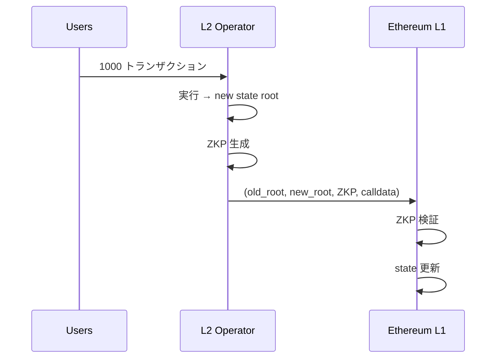
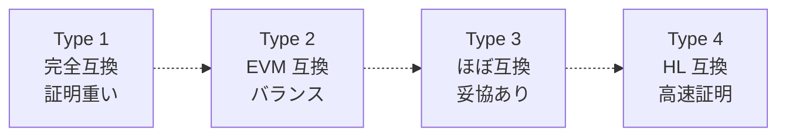

**日付**: 2026年4月22日
**学習内容**: **zkRollup** は Ethereum L1 の計算処理能力を数千倍に拡大する L2 スケーリング技術。その中核が **zkEVM** で、**Ethereum Virtual Machine の任意実行を ZKP で証明**できる仕組み。本記事では **(1) Rollup の基本**、**(2) Optimistic vs zkRollup**、**(3) zkEVM の型分類 (Type 1-4)**、**(4) EVM 命令の回路化**、**(5) Scroll / zkSync / Polygon zkEVM / Linea の設計比較**、**(6) Data Availability と Validity Proof**、**(7) 証明集約とガスコスト**、**(8) zkVM (RISC Zero, SP1) との違い** を扱う。

## 0. 本記事の位置づけ

Ethereum L1 は 15〜30 TPS と遅い。これを **L2** で解決するのが Rollup。

Rollup の種類:
- **Optimistic Rollup**: 「正しく実行された」と仮定し、不正があればチャレンジ
- **zkRollup**: 「正しく実行された」を ZKP で証明

zkRollup はセキュリティと最終性で優位。しかし**任意の EVM 計算を証明**するのは技術的に困難で、そのための特化実装が **zkEVM**。

構成:

- **第1章**: Rollup の基本
- **第2章**: Optimistic vs zkRollup
- **第3章**: zkEVM の型分類
- **第4章**: EVM 命令の回路化
- **第5章**: 主要 zkEVM プロジェクト
- **第6章**: Data Availability
- **第7章**: 証明集約とガスコスト
- **第8章**: zkVM との比較
- **第9章**: Q&A とまとめ

## 1. Rollup の基本

### 1.1 仕組みの全体像

1. **L2 operator**: 大量のトランザクションをオフチェーンで処理
2. **State transition**: 新しい state root を計算
3. **Commit**: old_root, new_root, tx data を L1 に送信
4. **Proof**: ZKP で state transition の正当性を証明
5. **L1 contract**: 証明を検証、受理



### 1.2 コスト構造

- **L2 operator のコスト**: ZKP 生成（高価）
- **L1 のコスト**: ZKP 検証（1 回数 ms）+ calldata 保存

1000 トランザクションを 1 証明にまとめれば、**L1 コスト / tx は大幅減**。

### 1.3 Finality

zkRollup の最終性は「ZKP が受理された瞬間」。Optimistic Rollup と違い、**challenge period なし** (典型的に 7 日)。

## 2. Optimistic vs zkRollup

### 2.1 比較表

| 項目 | Optimistic | zkRollup |
|---|---|---|
| 仮定 | 正直な operator がいる | ZKP が破れない |
| Finality | 7 日（Challenge period） | 即時（L1 受理時） |
| Fraud proof | 必要 | 不要 |
| Validity proof | 不要 | **必要** |
| EVM 互換 | 容易 | 難しい（zkEVM が必要） |
| Proof cost | 低（通常は proof 不要） | 高 |
| L1 cost | 低（calldata のみ） | 中（ZKP 含む） |
| 代表 | Optimism, Arbitrum | zkSync, Scroll, StarkNet |

### 2.2 Optimistic の弱点

- 7 日の withdrawal 待ち
- Fraud proof が複雑
- Game-theoretic 前提に依存

### 2.3 zkRollup の弱点

- Prover コストが高い
- EVM 互換が難しい
- L1 ガス代が高い（証明込みで）

### 2.4 Hybrid

Arbitrum Nitro は部分的に ZK を取り入れる計画。両者の利点を融合。

## 3. zkEVM の型分類

Vitalik Buterin (2022) による **zkEVM の Type 1-4** 分類。EVM 互換性 vs 証明効率のトレードオフ。

### 3.1 Type 1: Fully Ethereum-equivalent

- Ethereum L1 と**完全互換**
- 同じ state tree, 同じ Keccak, 同じ RLP
- L1 ブロックをそのまま zkProof 化可能

**例**: 現在開発中。Taiko が目指している。

**コスト**: 証明が重い（Keccak などが非 ZK-friendly）

### 3.2 Type 2: EVM-equivalent (state tree 除く)

- EVM 命令セットレベルで完全互換
- State tree などの内部データ構造は ZK 最適化

**例**: Scroll, Polygon zkEVM

**コスト**: 中程度

### 3.3 Type 3: Almost EVM-equivalent

- ほぼ EVM と同じだが、**一部の opcode や precompile** が違う
- たとえば Keccak256 を Poseidon で置換

**例**: 早期の Polygon zkEVM, Scroll

### 3.4 Type 4: High-level-language-equivalent

- Solidity コードを別の VM バイトコードにコンパイル
- EVM 命令レベルの互換性なし

**例**: zkSync Era（LLVM バックエンド）、StarkNet（Cairo）

**メリット**: ZK-friendly な VM で高速証明
**デメリット**: 既存のバイトコードはそのまま動かない

### 3.5 比較



## 4. EVM 命令の回路化

### 4.1 EVM の構成

EVM は stack-based VM:

- **Stack**: 1024 要素、各 256 bit
- **Memory**: バイト配列
- **Storage**: 永続化ストレージ（Merkle Patricia Trie）
- **Opcodes**: ADD, MUL, SSTORE, CALL, SHA3, など

### 4.2 Stack 操作の回路化

ADD の制約:

```
stack[top] = stack[top-1] + stack[top-2]
stack_pointer -= 1
```

これを ZK 回路で:

- Stack を多項式で表現
- 各 ADD 命令で合法性を制約
- スタック overflow/underflow の check

### 4.3 Memory の回路化

Memory は可変長。各書き込み・読み込みを**memory table** にログ。Lookup argument で「memory read が過去の write と一致」を示す。

### 4.4 Storage の回路化

Storage は Merkle Patricia Trie。各 SSTORE / SLOAD で:

- 旧 state の Merkle proof
- 新 state の Merkle root 計算
- 差分を証明

**Keccak256** が重い → Scroll は Keccak を ZK-friendly にする工夫を多用。

### 4.5 Precompile

EVM には precompile（効率化された組み込み関数）:

- ECRECOVER (署名検証)
- SHA256
- RIPEMD160
- MODEXP
- ECADD, ECMUL, ECPAIRING

これらを**独自 subcircuit** で実装。

### 4.6 255 bit vs 256 bit

EVM の word は 256 bit。しかし BN254 の scalar field は 254 bit。**RLC (Random Linear Combination)** で 256 bit を 2 要素に分解して扱う。

## 5. 主要 zkEVM プロジェクト

### 5.1 Scroll

- **Type**: Type 2
- **SNARK**: Halo2 + KZG
- **曲線**: BN254
- **特徴**: EVM bytecode レベル互換、オープンソース重視
- **ステータス**: 2023 年メインネット

### 5.2 Polygon zkEVM

- **Type**: Type 2 (以前 Type 3)
- **SNARK**: PLONK + FFLONK (Halo2 派生)
- **特徴**: 強力な EVM 互換性、Polygon の資金力
- **ステータス**: 2023 年メインネット

### 5.3 zkSync Era

- **Type**: Type 4
- **SNARK**: 独自 (Boojum, Plonky2 ベース)
- **特徴**: LLVM で Solidity → zkSync bytecode
- **ステータス**: 2023 年メインネット
- **注意**: 一部の EVM 機能が使えない

### 5.4 Linea

- **Type**: Type 2-3
- **SNARK**: PLONK
- **運営**: ConsenSys
- **特徴**: MetaMask 連携が強力
- **ステータス**: 2023 年メインネット

### 5.5 Taiko

- **Type**: Type 1 (目標)
- **SNARK**: 複数 (SGX, ZK)
- **特徴**: Type 1 を目指す数少ないプロジェクト
- **ステータス**: 2024 年メインネット

### 5.6 StarkNet

- **Type**: Type 4 (non-EVM)
- **VM**: Cairo (独自)
- **STARK**: FRI ベース
- **特徴**: PQ 耐性、Transparent

## 6. Data Availability

### 6.1 DA 問題

zkRollup が state root を L1 に送るだけでは、**他の人が state を再構築できない**。したがって L1 に tx data も送る必要。

### 6.2 Calldata vs Blob

- **Calldata**: Ethereum L1 に永続保存、高価
- **Blob (EIP-4844)**: 30 日保存、安い

EIP-4844 (Proto-Danksharding) で Rollup のコストが**大幅減**。

### 6.3 DA Layer

別途 DA 専用チェーンを使う方式:

- **Celestia**: Tendermint-based DA
- **Avail** (Polygon): DA 専用
- **EigenDA**: Restaking ベース

これらを使うと L1 コストがさらに下がるが、**セキュリティが少し落ちる** (Ethereum 外を信頼)。

### 6.4 Validium

**DA を L1 外部で保存** する zkRollup の変種。セキュリティ低下、コスト激減。StarkEx, zkPorter など。

## 7. 証明集約とガスコスト

### 7.1 Aggregation

複数の rollup ブロックの証明を 1 つに集約:

- **Plonky2**: FRI + 再帰
- **Groth16 再帰**: Pasta 曲線サイクル
- **SNARK of SNARKs**: 最終的に小さい証明

### 7.2 L1 gas cost

典型的な zkRollup 1 batch:

- calldata: ~$1-10 / 100 tx
- proof verification: ~230K gas (~$10)
- blob (EIP-4844): ~$0.1 / 100 tx

**1 tx あたり**数セント〜数ドル。L1 直接の 1/10〜1/100。

### 7.3 Prover Economics

Prover の運営コストが高い。大手 rollup は:

- 自社で prover サーバー運用
- GPU/FPGA 投資
- Prover market（第三者が入札）

### 7.4 Shared Sequencer / Prover

- **Shared Sequencer**: 複数 rollup でシーケンサー共有
- **Shared Prover**: 複数 rollup で prover 共有

コスト削減と中央集権のトレードオフ。

## 8. zkVM との比較

### 8.1 zkVM の思想

zkEVM は「EVM を証明」、zkVM は「**任意の VM (RISC-V) を証明**」。

- **RISC Zero**: RISC-V ベース zkVM
- **SP1**: 同じく RISC-V、高速
- **Cairo**: StarkNet 用 non-RISC VM

### 8.2 zkVM の利点

- **汎用**: 任意の Rust/C/Go プログラム
- **Move / Sui / Aptos 系**との親和性
- **Off-chain 計算の証明**: ML 推論、ゲーム、AI

### 8.3 zkVM の欠点

- EVM 直接実行には不向き（zkEVM を RISC-V 上に載せる形になる）
- Prover コストが高め

### 8.4 合流点

最近は「zkVM の上に EVM emulator を載せる」設計が増えている:

- RISC Zero + REVM (Rust EVM)
- SP1 + EVM

これで zkEVM と zkVM の境界が曖昧に。

## 9. Q&A

### Q1: zkRollup と Optimistic、どっちが勝つ？

**併存**が現状。zkRollup は長期的に有利（即時 finality、暗号学的保証）だが、Optimistic の実装成熟度と低 prover コストは今も強い。

### Q2: Type 1 zkEVM はいつ実現する？

Ethereum PoS 後に L1 自体を ZK 化する「Beam Chain」計画がある。数年単位の話。Taiko などが先行。

### Q3: Keccak を回路で計算すると何制約？

**約 150,000 制約 / block**。Merkle Patricia Trie で大量の Keccak が必要で、zkEVM の証明時間の主因。Scroll は Plonkish + Lookup で削減。

### Q4: ユーザーは zkEVM と zkVM のどちらを選ぶ？

- **Solidity を書く人**: zkEVM (既存のツール)
- **Rust を書く人**: zkVM
- **新規プロジェクト**: 両方を試して比較

### Q5: Sequencer の中央集権問題は？

現在、ほとんどの rollup の Sequencer は**中央集権**。検閲リスクあり。分散化計画:

- Shared Sequencer (Espresso, Astria)
- PBS ベース
- Based Rollup (L1 validators が sequence)

### Q6: zkRollup の将来は？

- **L2 → L3** (rollup 上の rollup)
- **多言語 VM 統合**
- **AI × ZKP** (zkML + rollup)
- **Privacy-preserving rollup** (Aztec 的)

ロードマップは活発。

## 10. まとめ

### 本記事の要点

1. **zkRollup** = L2 で大量 tx を処理、L1 に ZKP で集約
2. **zkEVM** は EVM を回路化する特化 SNARK
3. **Type 1-4** で互換性 vs 効率のトレードオフ
4. **Scroll, Polygon zkEVM, zkSync, Linea, Taiko** の設計比較
5. **Data Availability**: calldata / blob / 外部 DA
6. **Proof aggregation** で L1 コスト削減、**EIP-4844 blob** で激減
7. **zkVM** (RISC Zero, SP1) と zkEVM は収束傾向

### 次の記事（Article 30）へ

最終回は **zkBridge と未来の ZKP**。クロスチェーンブリッジの ZKP 化、そして zkML / zkID など ZKP の次のフロンティアを展望する。

### 3行サマリ

- **zkRollup = L2 で ZKP によるスケーリング**
- **zkEVM** は Type 1 (完全互換) ~ Type 4 (HL 互換) で進化
- **EIP-4844 と proof aggregation** でコスト激減、zkEVM と zkVM が収束

---

## 参考文献

- Vitalik Buterin. *The different types of ZK-EVMs.* Blog, 2022.
- Scroll. *Scroll Documentation.* 2024.
- Matter Labs. *zkSync Era Documentation.* 2024.
- Polygon. *Polygon zkEVM Documentation.* 2024.
- Ethereum Foundation. *EIP-4844: Proto-Danksharding.* 2023.
- ZKP MOOC Lecture 12 (UC Berkeley, 2023).
