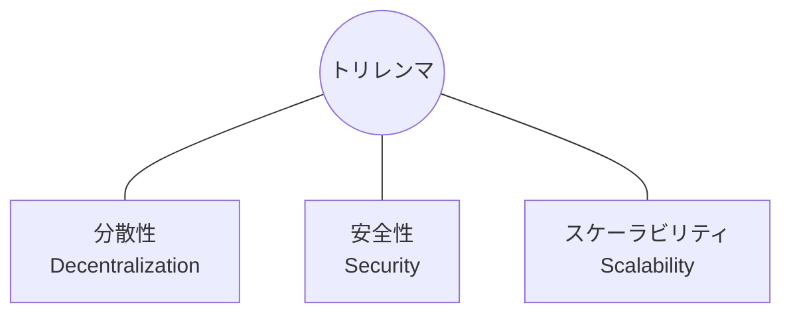
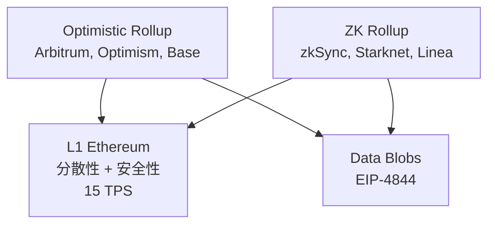

**日付**: 2026年4月24日
**学習内容**: 本記事は「Ethereum vs Solana 徹底比較」シリーズ第1回。*Mastering Ethereum* を読んだ後に Solana を学び始めると、**そもそも前提が違う**ことに気づく。Ethereum は「**分散性・検閲耐性ファースト**」、Solana は「**パフォーマンス・UXファースト**」。両者はブロックチェーンのトリレンマ（分散性・安全性・スケーラビリティ）への向き合い方が根本から異なり、**同じL1でもまったく別のものを作ろうとしている**。本記事では **(1) ブロックチェーンの三本柱と創設者の思想**、**(2) トリレンマへのアプローチの違い**、**(3) Nakamoto係数とバリデータ経済性**、**(4) 設計思想が生む開発者体験の差**、**(5) 両チェーンが共存する必然性** を扱う。このシリーズの土台となる記事。

## 0. 本記事の位置づけ

このシリーズの目的は、「Ethereum と Solana の違いを、**表層の TPS 比較ではなく、設計思想の根底まで** 遡って理解すること」。

*Mastering Ethereum* (Antonopoulos & Wood) を読むと、「**ワールドコンピュータ**」「**検閲耐性**」「**パーミッションレス**」といった言葉が繰り返される。一方、Solana のドキュメントを読むと「**ハードウェアを最大限使い倒す**」「**グローバルな高速ステートマシン**」「**Web2 級の UX**」という言葉が並ぶ。

両者は単に「性能」の違いではない。**目的関数そのものが違う**。本記事ではその根底を押さえる。

本シリーズの構成:

- **Part 1**（本記事）: 哲学と設計思想
- **Part 2**: コンセンサス（PoS vs PoH+PoS）
- **Part 3**: トランザクション処理とブロック構造
- **Part 4**: アカウントモデルと VM (EVM vs SVM/Sealevel)
- **Part 5**: ネットワーク障害耐性
- **Part 6**: DeFi エコシステム
- **Part 7**: L2・スケーリング戦略
- **Part 8**: DeIn 視点でどちらが向くか

## 1. ブロックチェーン三本柱と創設者の思想

### 1.1 Ethereum: Vitalik Buterin の世界観

Vitalik Buterin (当時 19 歳) が 2013 年に書いた Ethereum White Paper は、**「ビットコインでプログラムが書けない」** ことへの不満から始まった。目標は:

- **ワールドコンピュータ**: 誰でもアクセスできる分散計算資源
- **検閲耐性 (censorship resistance)**: 誰も止められない
- **パーミッションレス**: 許可なく誰でも参加・開発可能
- **クレジビリィ・ニュートラリティ (credible neutrality)**: 特定の主体が得しない

**重要な優先順位**:

1. **分散性**（多数のノード、低いハードウェア要件）
2. **安全性**（ファイナリティ、経済的合理性）
3. **スケーラビリティ**（最後に工夫する）

この順序が Ethereum のすべてを決めている。**「家庭の Raspberry Pi でもフルノードが動く」** ことが設計の北極星。

### 1.2 Solana: Anatoly Yakovenko の世界観

Anatoly Yakovenko は Qualcomm で **Wireless modem** を設計していたエンジニア。2017 年に執筆した Solana White Paper の動機は:

- **Nasdaq 級の金融インフラをオンチェーンに**
- **ハードウェアのムーアの法則に乗れ**
- **遅延はすべて敵**（数百ms のファイナリティを目指す）
- **Web2 の UX を超える**

**重要な優先順位**:

1. **パフォーマンス**（高 TPS、低レイテンシ）
2. **スケーラビリティ**（シャーディングせず単一チェーンで）
3. **分散性**（バリデータは数千規模で OK、数万は目指さない）

「**モノリシックなシングルグローバルステートマシン**」が Solana の北極星。Ethereum のようなシャーディングや L2 に頼らず、**単体で世界中のすべてのトランザクションを処理**することを目指す。

### 1.3 並べて見ると

| 観点 | Ethereum | Solana |
|---|---|---|
| 創設者の背景 | 暗号思想家、経済学 | ハードウェア・通信エンジニア |
| 比喩 | ワールドコンピュータ | 分散 Nasdaq |
| 重視する UX | 検閲耐性・中立性 | 速度・低遅延 |
| 優先順位 1 | 分散性 | パフォーマンス |
| 重要指標 | Nakamoto係数、クライアント多様性 | TPS、Block time |

両者は **別のアプリケーションを想定している**。デザインの是非ではなく、**目的が違う**。

## 2. トリレンマへのアプローチの違い

### 2.1 ブロックチェーンのトリレンマ

Vitalik 自身が定式化した有名な三すくみ:

「**3つすべてを同時には満たせない、どれか2つまで**」という経験則。

### 2.2 Ethereum のアプローチ: L1 を軽く、L2 でスケールする

Ethereum は **L1 では分散性と安全性を最大化**し、**スケーラビリティは L2 (Rollup) に委譲**する。

> **補足**: Ethereum は当初「**シャーディング (台帳を 64 本に分割)**」で L1 をスケールする計画だったが、2020 年にこの計画を **廃止** し Rollup に転換した。現在は「**データだけシャーディング** (EIP-4844 / Danksharding)」という部分的採用に落ち着いている。シャーディングの基礎から廃止の経緯までは **Part 7 第2章** でゼロから解説している。

**Rollup-Centric Roadmap** (2020年〜):
- L1 は **セキュリティベースレイヤ** に特化
- L2 が実行を担い、L1 にはデータだけ送る
- EIP-4844 の blob で L2 コストを激減させる

これを Vitalik は「**モジュラー・ブロックチェーン**」と呼ぶ。機能を層に分けて、それぞれを最適化する。

### 2.3 Solana のアプローチ: L1 単体でスケールする

Solana は **L1 単体で 1 秒未満のファイナリティと 5,000 TPS 以上** を目指す。**シャーディングは一切しない**。代わりに Sealevel 並列実行 + ハードウェア性能で勝負する（詳細は Part 7 第2章）。

実現手段:
- **Proof of History**: 時刻同期のオーバーヘッドを排除
- **Sealevel**: 並列実行エンジン
- **Turbine**: ブロック伝播を BitTorrent 風に
- **Gulf Stream**: メモプール不要
- **Pipelining**: ブロック検証のパイプライン化
- **Cloudbreak**: 並列ストレージ

これを Solana は「**モノリシック・ブロックチェーン**」と呼ぶ。**一体化した設計で極限までチューニング**する。

### 2.4 両者の選択の代償

**Ethereum の代償**:
- L1 が遅い (12 sec/block)
- UX が複雑（L1 / L2 の選択、橋渡し）
- L2 間の断片化（流動性・ユーザーが分散）

**Solana の代償**:
- **バリデータのハードウェア要件が高い** (64-128 GB RAM、NVMe SSD)
- 個人がフルノードを運用しにくい
- クライアント多様性が低い（一時的に Solana Labs の 1 クライアントのみ）
- 過去に **ネットワーク障害** （後述 Part 5）

## 3. Nakamoto係数とバリデータ経済性

### 3.1 Nakamoto係数とは

**Nakamoto係数 (Nakamoto Coefficient)** = 「**チェーンを停止させるのに必要な最小のバリデータ数**」

例えば PoS で 2/3 の stake があれば finality を決められるので:
- 上位 N バリデータの stake 合計が全体の 1/3 を超える最小の N → 「1/3 攻撃の Nakamoto係数」

### 3.2 両チェーンの Nakamoto係数

**Ethereum**: 約 **3-4**（Lido、Coinbase、Binance など大口ステーキングプールに集中）
- ただしそれぞれは内部で分散されている
- ノード数: **100万超** (アクティブバリデータ)

**Solana**: 約 **22-30**
- バリデータ数: **約 1,400**
- 個人運用は少ない（ハードウェア要件）

意外にも **Solana の方が Nakamoto係数は高い**。ただしこれは「stake の集中」と「ノードの集中」を区別する必要がある。

### 3.3 バリデータの参入障壁

**Ethereum**:
- ソロステーキング: **32 ETH** + 家庭用 PC（16GB RAM）
- 分散バリデーションで 0.01 ETH から可能
- **誰でもノード運用可能** が思想の中核

**Solana**:
- ステーキング: 技術的には少額 OK だが、**vote transaction コスト** で月 $200-500 必要
- ハードウェア: **64 GB RAM、NVMe 2TB、10 Gbps 回線**
- 個人参入は難しい → **機関・データセンター中心**

### 3.4 経済モデルの違い

**Ethereum**: 
- ステーカーの利回り: 約 3-4%
- **家計でも参加できる** → 分散性の源泉
- EIP-1559 で base fee は焼却 → デフレ傾向

**Solana**:
- バリデータ利回り: 約 6-8%
- **運用コストが高い** → プロフェッショナル中心
- SOL インフレ: 年 4.6%（2024）から徐々に低下予定
- priority fee の半分は焼却（2024 Agave 2.0）

## 4. 設計思想が生む開発者体験の差

### 4.1 Ethereum の開発者体験

- **言語**: Solidity (JavaScript風)、Vyper
- **ツール**: Hardhat、Foundry、Truffle
- **ABI 規格**: ERC-20、ERC-721、ERC-1155 など
- **互換性**: EVM chain が大量（Polygon、BNB、Arbitrum、Optimism）

**長所**:
- 膨大な学習リソース
- コード再利用性（OpenZeppelin などのライブラリ）
- 15年近いセキュリティの知見

**短所**:
- **ガス代**
- 並列性なし（直列実行）

### 4.2 Solana の開発者体験

- **言語**: **Rust** + Anchor フレームワーク（C, C++ も可）
- **ツール**: Anchor, Foundry-solana, Trident
- **規格**: Token Program、Metaplex (NFT)
- **互換性**: SVM 派生（Eclipse、Soon、MagicBlock）

**長所**:
- 並列実行が自然
- 低ガス代（$0.00025/tx 程度）
- 強い型安全性（Rust）

**短所**:
- **学習曲線が急**（Rust + アカウントモデル）
- ライブラリ量は Ethereum より少ない
- デバッグが難しい (Program / Account 分離)

### 4.3 典型的な開発時間比較

簡単な NFT コントラクト:
- **Solidity (Ethereum)**: 数時間で書ける（OpenZeppelin テンプレ）
- **Rust + Anchor (Solana)**: 数日〜1週間（アカウント設計が必要）

複雑な DeFi:
- 差はさらに拡大。**Solana は慣れれば高効率だが、最初の学習コストが重い**

### 4.4 Wallet・UX の違い

- **Ethereum**: MetaMask 中心、seed phrase、gas 見積もり画面
- **Solana**: Phantom・Solflare・Backpack、**gasless トランザクション**、**署名ポップアップが一瞬**

Solana の UX は一般消費者向けに **より滑らか**。これは設計思想の表れ。

## 5. なぜ両チェーンが共存するのか

### 5.1 異なるニーズに応える

両者が「正解」を争っているのではなく、**別のユースケースを担う**。

| ユースケース | Ethereum 向き | Solana 向き |
|---|---|---|
| 高額 DeFi (stablecoin 送金、貸付) | ◎ | △ |
| NFT 発行 (高付加価値) | ◎ | ○ |
| NFT 発行 (大量・低価格) | × | ◎ |
| 高頻度取引 (HFT / DEX aggregator) | × | ◎ |
| DePIN (分散 IoT) | △ | ◎ |
| ゲーム (リアルタイム) | × | ◎ |
| 社会インフラ (検閲耐性重視) | ◎ | △ |
| CBDC | ○ | ? |

### 5.2 分散 vs 性能の評価軸

**Ethereum 的評価軸**:
- 何百万人のノード運用
- 国家検閲からの自由
- 100年単位の存続性

**Solana 的評価軸**:
- Web2 ユーザーと同じ体験
- 1 秒未満のファイナリティ
- クラウドサービスと同じ信頼性

**どちらの評価軸に立つか**で「優秀なチェーン」の答えが変わる。

### 5.3 相互乗り入れの流れ

2024-2026 のトレンド:
- **Solana ネイティブ DeFi** が Ethereum を **DEX volume で上回る** 月も
- **Wormhole、deBridge、LayerZero** でクロスチェーン流動性が成熟
- **Eclipse** のような「**Solana VM を Ethereum L2 に**」移植する動き
- **Monad、Sei** など「**EVM + 並列実行**」のハイブリッド登場

**両者の良いところを取ろうとする動き** が加速している。

### 5.4 未来: 競争か共存か

筆者の立場: **共存**。

理由:
- Ethereum は「**社会インフラ・国家規制の代替**」に特化
- Solana は「**消費者向け高速アプリ**」に特化
- 両者は別の需要を満たす → どちらが消える必要はない

DeIn のような実プロジェクトが選択するときは、「**そのプロジェクトの性質に合う方**」を選ぶ。Part 8 で具体的に議論する。

## 6. Q&A

### Q1: Vitalik と Anatoly は仲が悪い？

**悪くない、建設的なライバル関係**。互いの設計を公の場で批判しつつ、技術的対話をしている。双方が「もう片方の哲学も一定正しい」と認めている。

### Q2: 「分散性」を捨てた Solana は「Web3」と呼べる？

**論争中**。Ethereum 陣営は「**Solana は分散型に見えて中央集権的**」と批判する。一方、Solana 陣営は「**Ethereum の L2 も結局中央集権的 sequencer に依存**」と反論する。両方に一理ある。

### Q3: どちらが将来勝つか？

**両方生き残る可能性が高い**。TCP と UDP の関係に似ている（信頼性優先 vs 速度優先）。しかしマインドシェアでは Solana が 2024-2026 で追い上げ中。

### Q4: 勉強コストが高いのはどっち？

**Solana の方が学習曲線は急**。ただし一度マスターすれば両方使えるようになる。Ethereum のエコシステムは広大だが、個々の概念は Solana より単純。

### Q5: DeIn は Ethereum で正解？

**現時点では正解**（既に実装済み、規制対応・オラクル統合も Ethereum 前提）。ただし V2 以降で **Solana 版** を検討する価値はある（Part 8 で詳述）。

### Q6: 「Web2 UX を超える」ってどういうこと？

Solana の主張:
- 決済で「暗号資産」と意識させない
- Visa の TPS (65,000) を単一 L1 で超える
- Web2 SaaS と同じレイテンシ (< 1 sec)

これが「**デフォルトで Solana**」を実現する戦略。

## 7. まとめ

### 本記事で学んだこと

- **Ethereum** は「分散性・検閲耐性ファースト」、**Solana** は「パフォーマンス・UXファースト」
- トリレンマへのアプローチ:
  - Ethereum: **L1 軽量 + L2 でスケール** (Rollup-centric, modular)
  - Solana: **L1 単体でスケール** (monolithic)
- **Nakamoto係数**: Ethereum は stake 集中で 3-4、Solana はハードウェア壁で 22-30
- **開発者体験**: Solidity (EVM) vs Rust/Anchor (SVM)
- **両者は別のユースケースを担うため共存する**

### 次の記事（Part 2）へ

次回は **コンセンサス** に踏み込む。Ethereum の **Gasper (Casper FFG + LMD-GHOST)** と Solana の **Proof of History + Tower BFT** (および新アップグレード Alpenglow)。「**時間の扱い方が根本から違う**」ことを見ていく。

### 3行サマリ

- Ethereum: **分散性・検閲耐性ファースト、L1 軽量 + L2 でスケール**
- Solana: **パフォーマンス・UXファースト、L1 単体でスケール**
- 両者は **別のユースケースを担う共存関係**。優劣ではなく目的関数の違い

---

## 参考文献

- Vitalik Buterin. *Ethereum Whitepaper.* 2013. [https://ethereum.org/en/whitepaper/](https://ethereum.org/en/whitepaper/)
- Anatoly Yakovenko. *Solana: A new architecture for a high performance blockchain v0.8.13.* 2017. [https://solana.com/solana-whitepaper.pdf](https://solana.com/solana-whitepaper.pdf)
- Andreas Antonopoulos, Gavin Wood. *Mastering Ethereum.* O'Reilly, 2018.
- Solana Docs. *EVM to SVM: Introduction.* [https://solana.com/developers/evm-to-svm](https://solana.com/developers/evm-to-svm)
- Messari. *State of Solana 2024-2025.* [https://messari.io/](https://messari.io/)
- Nakamoto Coefficient. *Crosschain Risk Framework.* [https://nakaflow.io/](https://nakaflow.io/)
