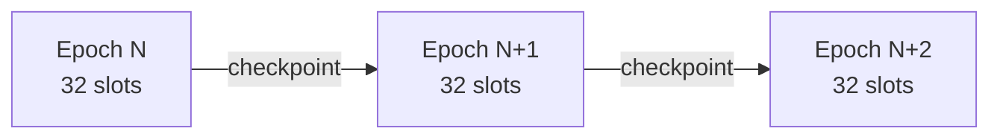
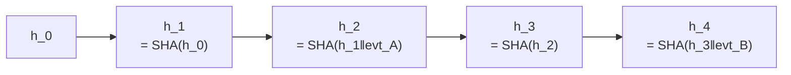
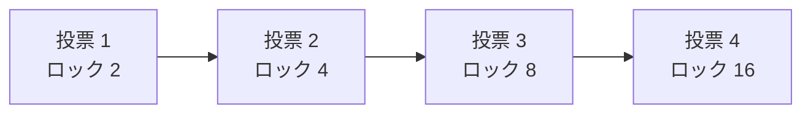

**日付**: 2026年4月24日
**学習内容**: Ethereum と Solana の最も本質的な違いの一つが **コンセンサスメカニズム**。Ethereum は **Gasper** (**Casper FFG** + **LMD-GHOST**) で「投票によるファイナリティ」を確定する。Solana は **Proof of History (PoH)** で先に「時刻の証明」を作り、その上に **Tower BFT** で投票を重ねる。両者は **時間の扱い方** がまったく違う。Ethereum は「**合意の後に時刻が決まる**」、Solana は「**時刻の後に合意する**」。本記事では **(1) PoS の基礎**、**(2) Ethereum Gasper の仕組み**、**(3) Solana PoH の仕組み**、**(4) Tower BFT**、**(5) ファイナリティ速度と代償**、**(6) Alpenglow アップグレード (2025-2026)**、**(7) セキュリティ比較** を扱う。

## 0. 本記事の位置づけ

Part 1 で「両チェーンの哲学が違う」ことを押さえた。では具体的に **何が違う** のか？ コンセンサスメカニズムが最も象徴的。

> **Ethereum**: 投票で合意 → 合意したブロックに時刻が付く
> **Solana**: 時刻を先に決める → その時刻順に投票

この「**時間の先後**」が両者のすべてを決める。速度・ファイナリティ・攻撃耐性、すべて。

構成:

- **第1章**: PoS の基礎
- **第2章**: Ethereum Gasper
- **第3章**: Solana Proof of History
- **第4章**: Tower BFT
- **第5章**: ファイナリティの速度
- **第6章**: Alpenglow
- **第7章**: セキュリティ比較
- **第8章**: Q&A と まとめ

## 1. PoS の基礎

### 1.1 Proof of Stake とは

PoS (Proof of Stake) は:
- **ノードが「ステーク (stake)」** として暗号資産を預ける
- ステーク量に比例して **ブロック提案・投票権** を得る
- **不正をすると没収** (slashing)

vs **PoW (Proof of Work)**:
- 計算力（電力）で securing
- PoS は電力を **stake** に置き換えた

両チェーン（現 Ethereum、Solana）は PoS を採用。ただし **使い方が違う**。

### 1.2 2 つの基本問題

PoS が解決すべき:
1. **誰が次のブロックを作るか** (Block proposer selection)
2. **どのブロックが正しいか** (Fork choice + finality)

Ethereum と Solana は両方を別の方法で解く。

## 2. Ethereum Gasper

### 2.1 Gasper = Casper FFG + LMD-GHOST

**Gasper** は 2 つの独立したコンポーネント:

- **Casper FFG** (Friendly Finality Gadget): **ファイナリティ** を提供
- **LMD-GHOST**: **フォークチョイスルール**

### 2.2 エポック・スロット構造

- **Slot**: 12 秒（ブロック生成単位）
- **Epoch**: 32 slot = 6 分 24 秒

各スロットごとに 1 つのブロック提案者が選ばれる。エポック境界で **check point** が作られる。

### 2.3 Attestation（投票）

各スロットで、**委員会 (committee)** がブロックに **attestation (投票)** する:
- 「このブロックが正しい」を表明
- 現在、1 epoch あたり **ほぼ全バリデータ** が投票

### 2.4 ファイナリティの確定

**2 エポック連続** で 2/3 の stake が同じ checkpoint を justified と認識すると、その checkpoint は **finalized** になる。

**finalized** = **完全に不可逆**（逆転には stake の 1/3 スラッシュが必要）

→ **ファイナリティは約 12.8 分（2 エポック）**

### 2.5 LMD-GHOST

フォーク（分岐）が起きたら、どちらを選ぶ？
- **LMD** (Latest Message Driven): 各バリデータの最新の投票だけ見る
- **GHOST** (Greedy Heaviest Observed SubTree): **最も重い subtree** を選ぶ

この組み合わせで、バリデータの最新投票に基づいて **最も投票が集まっているチェーン** を確定的に選ぶ。

### 2.6 Gasper の強みと弱み

**強み**:
- **数学的に証明された safety** (Casper FFG)
- **1,000,000+ のバリデータ** が参加可能（超分散）
- **long-range attack** に耐性（slashing）

**弱み**:
- **ファイナリティが遅い** (12.8 分)
- 一時的な reorg が起きうる（数スロット内）
- **中央集権化リスク** (MEV + Liquid Staking Derivatives)

## 3. Solana Proof of History

### 3.1 問題意識: 時刻同期のコスト

分散システムで最も難しいのは **時刻の合意**。既存の PoS では:
- 各ノードが NTP で時刻同期
- ブロックが「いつ」生成されたか合意するのに **通信ラウンド** が必要

Anatoly はこれを無駄だと考えた:
> **「時刻を事前に証明できれば、合意のオーバーヘッドが激減する」**

### 3.2 PoH = VDF 的なハッシュチェーン

Proof of History は **Verifiable Delay Function (VDF) に似た** 連鎖ハッシュ:

$$
h_{i+1} = \text{SHA256}(h_i)
$$

各ハッシュは前のハッシュに依存し、**計算せずには進めない**（並列化不可）。

結果として「**$N$ 回のハッシュ = 一定時間が経過した証拠**」になる。

### 3.3 PoH のタイムスタンプ

各ハッシュに **イベント** を埋め込める:

$$
h_{i+1} = \text{SHA256}(h_i \,\|\, \text{event})
$$

これにより「**このイベントは少なくとも $i$ 回のハッシュ後に発生した**」という **暗号学的タイムスタンプ** になる。

イベント A は h_1 と h_2 の間、イベント B は h_3 と h_4 の間に起きた、と確定できる。

### 3.4 PoH の意義

- **バリデータ間の時刻同期が不要**
- **並列検証可能**（ハッシュの検証は並列できる）
- **メモプール不要**: リーダーに直接 tx を送る (Gulf Stream)

これで Solana は **400 ms/slot** という高速 slot を実現。

### 3.5 PoH はコンセンサスではない

注意: **PoH 単体はコンセンサスではない**。「時刻の証明」にすぎない。実際のブロック決定は **Tower BFT** が行う。

PoH + Tower BFT = **Solana のコンセンサス**

## 4. Tower BFT

### 4.1 PBFT 系の合意

Tower BFT は **Practical Byzantine Fault Tolerance (PBFT)** の変種。ただし PoH を前提にすることで大幅に簡略化。

### 4.2 投票ロックアウト

バリデータがブロック $B$ に投票すると、**ロックアウト期間** が始まる:
- $B$ に投票 → 2 slot 間は他のブロックに投票できない
- 2 slot 後に次の投票 → 4 slot ロックアウト
- 4 slot 後 → 8 slot ロックアウト
- …… **指数的に増加**

このため、**いったん投票したブロックを覆す** には巨大な機会費用がかかる → 裏切りインセンティブが消える。

### 4.3 ファイナリティ

- **confirmed**: 2/3 の stake が投票 (約 400 ms × 数 slot)
- **finalized**: 32 slot (12.8 秒) 以上投票が続く、または 2/3 supermajority

**実効ファイナリティは 12.8 秒**。Ethereum (12.8 分) の 60 倍速い。

### 4.4 Tower BFT の強みと弱み

**強み**:
- **超高速ファイナリティ** (12.8 sec)
- **PoH でメッセージ量が激減** (n² → n)
- 実装がシンプル

**弱み**:
- **バリデータ数が限定**（約 1,400、Ethereum 100万の 0.1%）
- **PoH 生成がシングルスレッド** → リーダーが強力な CPU 必要
- **リーダー交代のオーバーヘッド** (過去に障害の原因に)

## 5. ファイナリティの速度

### 5.1 ファイナリティの種類

| 種類 | 意味 |
|---|---|
| **確率的ファイナリティ** | 逆転確率が徐々に下がる |
| **経済的ファイナリティ** | 逆転には大きな経済損失 |
| **絶対的ファイナリティ** | プロトコル的に逆転不可能 |

### 5.2 両チェーンの数字

| チェーン | 確率的 | 経済的 | 絶対的 |
|---|---|---|---|
| **Ethereum** | 数秒 (single slot) | 分単位 (1-2 epoch) | **12.8 分** (2 epoch) |
| **Solana** | 数百 ms (optimistic confirmation) | 秒単位 | **12.8 秒** (32 slot) |

### 5.3 UX への影響

**取引所での入金認識**:
- **Ethereum**: 12-20 block (2-4 分)、大口で 1 エポック以上
- **Solana**: 1 確認でも実質安全、大口で 32 slot (12.8 秒)

**Solana の方が圧倒的に速い**。DeFi でも同様：Solana の DEX スワップは「ほぼ即時」の感覚で使える。

### 5.4 代償

Solana の速度は:
- **リーダーが悪意だとブロック提案を止められる**
- **ネットワーク分断時のフォーク処理が複雑**
- **Tower BFT の投票メッセージがネットワーク帯域の相当を占める**

Ethereum の遅さは:
- **バリデータ超多数** でも動く
- **ネットワーク分断でも安全**（投票がなければ finalize しないだけ）

## 6. Alpenglow — Solana の次世代コンセンサス

### 6.1 Alpenglow とは

**Anza (旧 Solana Labs)** が 2025 年前半に発表した次世代コンセンサス。**PoH と Tower BFT を置き換える**。

### 6.2 主な変更点

- **Votor**: 新しい投票システム（Tower BFT 置換）
- **Rotor**: ブロック伝播の改善
- **ファイナリティ目標**: **100-150 ms**

PoH を捨てて、**もっと直接的な BFT** に回帰する。

### 6.3 なぜ PoH を捨てる？

- PoH は **CPU 集約的**（リーダーが重いハードウェア）
- PoH の「時刻証明」機能は、もっと単純な方法でも代替可能
- **Alpenglow は現代の BFT 文献に沿う** よりシンプルな設計

### 6.4 展開スケジュール

- 2025 年後半: testnet
- 2026 年: mainnet 展開予定
- 完全移行: 数年がかり

本記事執筆時点 (2026 年 4 月) では **まだ移行中**。「Solana のコンセンサスは過渡期」。

### 6.5 Ethereum の次世代

Ethereum も **Single Slot Finality (SSF)** を目指している:
- 現状 12.8 分 → **12 秒 (1 slot)** に短縮
- 実現は 2027-2028 の見込み

両チェーンとも「**より速いファイナリティ**」に向かっている。

## 7. セキュリティ比較

### 7.1 攻撃耐性

**51% 攻撃**（PoW でよく言及される）は PoS では **33% 攻撃** に変わる:

| 攻撃 | Ethereum | Solana |
|---|---|---|
| ファイナリティ停止 (1/3) | $50B+ stake 必要 | $5B+ stake 必要 |
| フォーク攻撃 (2/3) | $100B+ | $10B+ |
| 個別 tx 検閲 | 困難（多数の relayer） | 可能性あり（リーダー悪意） |

数字は変動しますが、**Ethereum の方が経済的セキュリティが高い**。

### 7.2 Slashing

両方とも slashing 条件を持つ:

**Ethereum**:
- 相反する attestation
- 相反するブロック提案
- 最大 stake の **全額 slash** (悪意の場合)

**Solana**:
- **Tower BFT の duality violation** で slash
- しかし **実装がまだ未完**（slashing は限定的）

### 7.3 MEV と検閲

**Ethereum**: 
- **PBS (Proposer-Builder Separation)** で MEV を分離
- Flashbots、MEV-Boost
- **OFAC 制裁ブロック問題**（2022 Tornado Cash 以降）

**Solana**: 
- **Jito** が MEV エコシステムを構築
- 直接 auction → proposer
- 検閲耐性はやや弱い

### 7.4 Long-range attack

**Ethereum**: **weak subjectivity** で対策（数ヶ月経つと逆転不可能）
**Solana**: 同様に weak subjectivity + **snapshot-based sync**

両方とも長期攻撃には実用的に耐性あり。

## 8. Q&A

### Q1: PoH は VDF？

**VDF に触発されたが、本物の VDF ではない**。真の VDF は「並列化不可能であることを形式的に証明」できるが、PoH はそこまで強くない。**実用上は十分** という割り切り。

### Q2: Ethereum のファイナリティが 12 分って遅すぎないか？

**ユースケース次第**。DeFi の大口取引では 12 分待つのが常識。消費者向けアプリには遅いので → **L2 (Rollup) で数秒** の体験を提供。

### Q3: Solana の 1,400 バリデータは少なすぎない？

**設計思想による**。Solana 側は「**バリデータ数 > 分散性** ではない」と主張。地理的分散、Stake 分散の Nakamoto係数で見ると、意外に多様性はある。

### Q4: Alpenglow 移行で破壊的変更は？

**API レベルでは互換** を保つ予定。ただしバリデータ運用手順は変わる。DApp 開発者への影響は小さいはず。

### Q5: Single Slot Finality (SSF) はいつ？

Ethereum: 2027-2028 見込み。**Vitalik の Roadmap** に含まれる最重要項目の一つ。ただし実装難易度が高く遅延可能性あり。

### Q6: DeIn のようなプロトコルではファイナリティどれくらい必要？

DeIn は:
- **保険契約発行**: 数分のファイナリティで十分（急がない）
- **支払い判定**: 数時間-数日のオラクル取込なので、ファイナリティ速度は律速しない
- **Ethereum で問題ない**

Part 8 で詳述。

## 9. まとめ

### 本記事で学んだこと

- **Ethereum Gasper**: Casper FFG + LMD-GHOST。**2 エポック (12.8 分) で finality**
- **Solana PoH + Tower BFT**: 時刻証明の後に BFT 投票。**32 slot (12.8 秒) で finality**
- 両者は「**時間の扱い方**」が根本的に違う:
  - Ethereum: 合意 → 時刻
  - Solana: 時刻 → 合意
- **Nakamoto 経済セキュリティ** は Ethereum が上、**速度** は Solana が 60 倍
- **Alpenglow** で Solana は PoH を捨てる方向、**SSF** で Ethereum は 1 slot finality を目指す

### 次の記事（Part 3）へ

次回は **トランザクション処理とブロック構造**。EIP-1559、EIP-4844 blob、Solana のアカウントモデル、**並列実行 Sealevel** を扱う。「1 ブロックに何 tx 入るか」の裏側を見ていく。

### 3行サマリ

- **Ethereum Gasper** は投票で合意して 12.8 分で finality。**Solana PoH + Tower BFT** は時刻を先に決めて 12.8 秒
- 両者は **時間の扱いが根本的に違う**: 合意→時刻 (Eth) vs 時刻→合意 (Sol)
- **Alpenglow (Sol)** と **SSF (Eth)** で両チェーンとも次世代コンセンサスへ移行中

---

## 参考文献

- Buterin, Griffith. *Casper the Friendly Finality Gadget.* 2017. [arxiv.org/abs/1710.09437](https://arxiv.org/abs/1710.09437)
- Zamfir, Rush, Asgaonkar, Piliouras. *LMD-GHOST.* 2020.
- Anatoly Yakovenko. *Proof of History: A Clock for Blockchain.* Solana Whitepaper, 2017.
- Victor Shoup. *Proof of History: What Is It Good For?* 2022. [https://www.shoup.net/papers/poh.pdf](https://www.shoup.net/papers/poh.pdf)
- Helius. *Consensus on Solana.* [https://www.helius.dev/blog/consensus-on-solana](https://www.helius.dev/blog/consensus-on-solana)
- Anza / Solana. *Alpenglow Consensus.* 2025. [https://blog.quicknode.com/solana-alpenglow-upgrade/](https://blog.quicknode.com/solana-alpenglow-upgrade/)
- Solana Docs. *EVM to SVM: Consensus.* [https://solana.com/developers/evm-to-svm/consensus](https://solana.com/developers/evm-to-svm/consensus)
