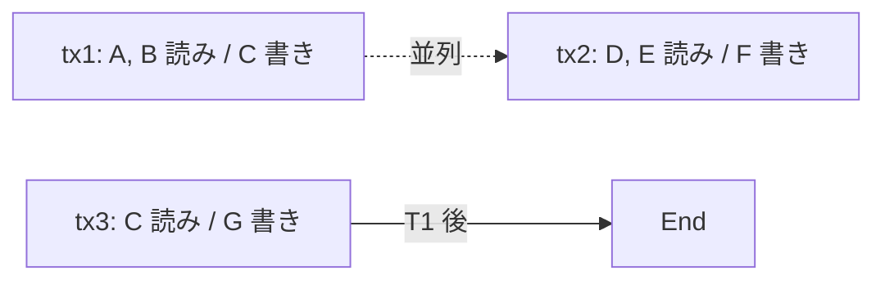

**日付**: 2026年4月24日
**学習内容**: 本記事は両チェーンの **トランザクション処理とブロック構造** を比較する。Ethereum は **EIP-1559 (base fee + priority fee)**、**EIP-4844 (blob)**、**Merkle Patricia Trie (MPT)** + **RLP** という伝統的構造。Solana は **まったく異なるアカウントモデル**、**Sealevel 並列実行**、**Gulf Stream** によるメモプール廃止。「1 ブロックに何 tx 入るか」の裏側にある構造を追う。本記事では **(1) Ethereum のトランザクション構造 (EIP-1559)**、**(2) EIP-4844 blob と L2 連携**、**(3) MPT と RLP**、**(4) Solana のアカウントモデル**、**(5) Sealevel 並列実行**、**(6) 理論値 vs 実測値**、**(7) ガス代の実態** を扱う。

## 0. 本記事の位置づけ

Part 1-2 でチェーン全体の哲学とコンセンサスを見た。本記事では **具体的な 1 トランザクションの処理** に踏み込む。

両者の違いは:
- **Ethereum**: 「**共通ストレージ（MPT）を順次変更**」する直列モデル
- **Solana**: 「**各アカウントが独立、並列実行**」するモデル

この違いが、**ブロック時間、tps、ガス代、UX** すべてを決める。

構成:

- **第1章**: Ethereum のトランザクション (EIP-1559)
- **第2章**: EIP-4844 blob と L2
- **第3章**: Merkle Patricia Trie と RLP
- **第4章**: Solana のアカウントモデル
- **第5章**: Sealevel 並列実行
- **第6章**: TPS 理論値 vs 実測値
- **第7章**: ガス代の実態
- **第8章**: Q&A とまとめ

## 1. Ethereum トランザクション (EIP-1559)

### 1.1 トランザクションの構造

Ethereum のトランザクション:

```
Transaction:
  nonce:               アカウントの送信回数
  max_priority_fee:    チップ (validator へ)
  max_fee_per_gas:     gas あたり上限 (base + tip)
  gas_limit:           最大消費 gas
  to:                  送信先アドレス
  value:               送金額
  data:                コントラクト呼び出し data
  access_list:         事前宣言アクセス (EIP-2930)
  signature:           (v, r, s)
```

### 1.2 EIP-1559: Base Fee + Priority Fee

2021 年の London ハードフォークで導入。

**Base fee**:
- **プロトコルが決定** するガス単価
- ブロックが満員 (15M gas) を超えると **自動上昇**
- 空くと下降
- **焼却 (burn)** される → ETH デフレ化

**Priority fee (tip)**:
- ユーザが validator に払うチップ
- 高いほど早く取り込まれる

**Max fee per gas**: ユーザが払う上限 = base + tip

### 1.3 ブロックサイズ

- **Gas limit**: 30M gas (2024 時点、投票で変動)
- **Target**: 15M gas
- 満員 (30M) を超えると base fee が急上昇

1 tx ≈ 21,000 gas (単純送金)、NFT mint ≈ 100,000-500,000 gas、Uniswap swap ≈ 150,000 gas。

→ 1 block に入る tx は **100-300 個** くらい。

### 1.4 12 秒ブロックなので

**15 TPS 前後** が L1 Ethereum の実効スループット。2024 年実測値もこれに近い。

## 2. EIP-4844: Blob と L2 連携

### 2.1 Proto-Danksharding

2024 年 3 月の Dencun アップグレードで導入された **EIP-4844**。L2 のコストを劇的に下げる仕組み。

### 2.2 Blob とは

**Blob** = **最大 128 KB のデータ**:
- トランザクションに **blob** を添付できる
- Blob は **18 日後に自動削除**（ブロック履歴に残らない）
- Blob には **専用 fee market** がある

### 2.3 L2 での使い方

Optimism、Arbitrum、Base などの Optimistic Rollup:
- 以前: tx calldata として L1 に書き込み → **高コスト**
- 現在: blob として L1 に送る → **95% コスト削減**

結果として:
- **L2 tx コスト**: $0.50 → $0.01
- **Ethereum L2 が実用的** になった決定打

### 2.4 Blob fee market

EIP-1559 と同様に動的価格:
- base fee (blob)
- 最大 6 blob / block
- ターゲット 3 blob

満員だと急上昇、空くと下降。

### 2.5 Danksharding への道

EIP-4844 は **Proto**-Danksharding = **完全版の前哨戦**。

完全な Danksharding（2026-2027 見込み）:
- **数十倍の blob スループット**
- **Data Availability Sampling (DAS)**: 軽量ノードでも一部だけ保持

これで Ethereum L2 のスループットは **100,000 TPS 級** へ。

## 3. Merkle Patricia Trie と RLP

### 3.1 MPT の役割

Ethereum のステート（全アカウントの残高、コントラクト変数）は **Merkle Patricia Trie (MPT)** に格納:

- **Merkle**: ハッシュツリー構造で改ざん検出
- **Patricia**: 経路圧縮 trie
- **Trie**: key-value 木構造

各ブロックの「**state root**」は全世界の状態のハッシュ。全ノードがこれを保持。

### 3.2 MPT の利点

- **軽量クライアント**: state root と Merkle proof で特定 key の状態を検証可能
- **履歴が追える**: 各ブロックの state root で過去のスナップショットを作れる

### 3.3 MPT の欠点

- **書き込みが遅い** (ツリーの再構築)
- **ストレージサイズが大きい**（ノード 1 つで 2 TB+）
- **並列書き込み不可能**（単一の MPT）

これが Ethereum が並列処理に苦労する根本原因。

### 3.4 RLP (Recursive Length Prefix)

Ethereum の **シリアライゼーション** フォーマット。トランザクション、ブロック、アカウントすべてが RLP エンコード。

```
RLP(42)            = 0x2a
RLP([42, "hello"]) = 0xc8 0x2a 0x85 "hello"
```

シンプルだが冗長。Protocol Buffers の方が効率的だが、歴史的経緯で RLP を使い続けている。

### 3.5 Verkle Tree への移行

Ethereum 次期: **Verkle Tree** で MPT を置き換え。
- 証明サイズが劇的に小さい
- Stateless client が実現可能
- 2026-2027 実装予定

## 4. Solana のアカウントモデル

### 4.1 根本的に異なる設計

Ethereum: **アカウント内にストレージが埋まる** (`mapping(address => uint256)` など)

Solana: **プログラムとストレージが分離**:
- **Program Account (executable)**: コード本体、不変
- **Data Account**: 状態（ユーザーごと、ポジションごとなど）

### 4.2 アカウント構造

```
Account:
    lamports: u64       // SOL 残高 (lamport = 10^-9 SOL)
    owner: Pubkey       // このアカウントを "所有" するプログラム
    executable: bool    // コードかデータか
    rent_epoch: u64     // rent 関連
    data: Vec<u8>       // ストレージ (任意バイナリ)
```

### 4.3 "Owner" の概念

各アカウントには **owner program** がある:
- owner のみが `data` を書き換えられる
- ユーザーの SOL アカウントの owner = System Program
- USDC トークンアカウントの owner = Token Program

これにより **任意のプログラムが任意のアカウントを書き換える** ことを防ぐ。

### 4.4 Rent

アカウントを存続させるには **rent** (ストレージ料金) が必要:
- データサイズに応じて lamport を保持
- 一定額以上保持すれば **rent-exempt** (永続)

これで「**使われていないアカウントで state が膨張する**」問題を防ぐ（Ethereum で積年の課題）。

### 4.5 トランザクションでのアカウント宣言

Solana の tx は:

```
Transaction:
    signatures: [署名]
    message:
        header:     (read-only, signer などの数)
        accounts:   [tx が触るすべてのアカウントのリスト]  ← 重要!
        recent_blockhash: ...
        instructions: [プログラム呼び出し]
```

**ポイント**: **「触るすべてのアカウント」を事前に宣言する必要がある**。

これが Sealevel 並列実行の鍵。

## 5. Sealevel 並列実行

### 5.1 並列化の原理

**Sealevel**: Solana の並列実行エンジン。

原理:
- tx は触るアカウントを **事前宣言**
- 触るアカウントが **重ならない** tx 同士は **並列実行可能**



tx1 と tx2 は **完全独立** → 並列実行。tx3 は C を読むので tx1 を待つ。

### 5.2 Ethereum では並列困難

Ethereum の EVM は:
- ストレージが **MPT 全体**
- tx が **どのキーを触るか事前にわからない**
- 条件分岐で実行パスが変わる
- → **直列実行のみ**

EIP-2930 (access list) で部分的に事前宣言できるが、強制ではない。**Reth や Erigon** などのクライアントが実験的に並列実行を試みているが、本格採用されていない。

### 5.3 Solana の並列実行器

**Scheduler** が tx を依存関係で並べて、GPU や multi-core CPU で並列実行:
- 独立 tx はすべて並列
- アカウントで競合する tx は順番待ち
- 競合があまりに多いと性能が落ちる

### 5.4 並列の限界

DEX の同じプールにアクセスする多数の tx:
- すべて同じ pool account を書き換える
- → **直列実行**
- Solana の強みを活かせない

対策:
- **Priority fee** で順番を競争
- AMM の **Just-in-Time (JIT) liquidity** などで回避
- **State sharding** の研究

### 5.5 Monad, Sei, Movement: EVM + 並列

2024-2026 の新興 L1:
- **Monad**: EVM 互換 + 並列実行（optimistic parallel execution）
- **Sei**: EVM + 並列
- **Movement**: Move VM (Aptos 系) + 並列

これらは「**Ethereum のエコシステム + Solana の並列性**」を狙う。

## 6. TPS 理論値 vs 実測値

### 6.1 Ethereum L1

- **理論値**: 30M gas / 12 sec ÷ 21,000 gas = **119 TPS** (単純送金のみ)
- **実測値**: **15-20 TPS** (複雑な DeFi 混在)
- 通常時: Gas 使用率 50-70%

### 6.2 Solana L1

- **理論値**: **65,000 TPS** (block 400ms × 65M compute unit)
- **実測値**: **2,000-5,000 TPS** (通常時、DEX 混在)
- 過去最高: 2024 年に **7,200 TPS** (実負荷)

実測値が理論値の 10% に届かないのは:
- **vote transaction** が大量（コンセンサスのオーバーヘッド）
- **MEV bot の無駄 tx** (失敗 tx も計上)
- アカウント競合

### 6.3 Ethereum L2 合計

- **Arbitrum**: 40-250 TPS
- **Optimism**: 10-200 TPS
- **Base**: 30-200 TPS
- **合計**: **500-1,000 TPS 級**

EIP-4844 後、L2 合計で Solana に匹敵する TPS を達成する日も。

### 6.4 表: 2026 年実測 TPS

| チェーン | 理論 TPS | 実測平均 TPS |
|---|---|---|
| Ethereum L1 | 119 | 15-20 |
| Ethereum L2s 合計 | 2,000+ | 500-1,000 |
| **Solana** | **65,000** | **2,000-5,000** |
| Aptos | 160,000 | 50-100 |
| Sui | 120,000 | 30-80 |

**Solana が単一 L1 で圧倒的**、ただし Ethereum 全体 (L1+L2) が追い上げ中。

## 7. ガス代の実態

### 7.1 Ethereum L1

- **単純送金**: $1-5
- **Uniswap swap**: $5-30
- **NFT mint**: $20-100
- **混雑時**: 10 倍

### 7.2 Ethereum L2s (EIP-4844 後)

- **単純送金**: $0.001-0.01
- **Uniswap swap**: $0.05-0.5
- **NFT mint**: $0.1-1

### 7.3 Solana

- **単純送金**: $0.00025
- **DEX swap**: $0.0005-0.005
- **NFT mint**: $0.001-0.01
- **Priority fee ある時**: 10-100 倍

### 7.4 比較

普通の NFT mint:

| | Ethereum L1 | Ethereum L2 | Solana |
|---|---|---|---|
| 通常時 | $30 | $0.3 | $0.003 |
| 混雑時 | $300 | $3 | $0.3 |

**大量・低価格** のユースケース（ゲーム、ソーシャル、Micro-payment）は Solana に向く。

### 7.5 DeIn への示唆

DeIn の想定:
- **NFT 保険証書発行**: 1 契約 $30 の gas は **致命的**（保険料が数千円）
- **L2 (Base など)** なら $0.3 で実用的
- **Solana** なら $0.003 でほぼ無料

**低ガス代チェーンが圧倒的に向く**。Part 8 で詳述。

## 8. Q&A

### Q1: EIP-1559 は本当に値段を下げた？

**下げてはいないが予測しやすくした**。混雑時はむしろ高騰する。ただし fee の透明性が上がり、Flashbots のような MEV 経由の「Gas auction」が減った。

### Q2: なぜ Ethereum は並列実行できない？

**EVM の設計が直列前提**だから。後付けで並列化しようとすると、既存コントラクトの挙動が変わる恐れがあり互換性が崩れる。新規 L2 で少しずつ導入されている。

### Q3: Solana の 65,000 TPS は本物？

**理論値として正しいが、実測は 10% 以下**。vote tx、失敗 tx、アカウント競合で低下。それでも Ethereum L1 の 100-300 倍は速い。

### Q4: L2 と Solana、どっちが将来勝つ？

**両方生き残る可能性大**。L2 は Ethereum のセキュリティを継承する、Solana は単一 L1 の体験に優れる。ユースケース次第。

### Q5: Blob データが 18 日で消えるのは問題では？

**完全に消えるわけではない**。L2 は blob から再構成した state を別途保存するので、トランザクション履歴は L2 側で保持される。完全性は保たれる。

### Q6: アカウント宣言を忘れるとどうなる？

**tx が失敗**する。ランタイムが「この tx は X を触ったが宣言にない」とエラー。Anchor フレームワークが自動で宣言してくれるので、通常は意識しない。

## 9. まとめ

### 本記事で学んだこと

- **Ethereum**: EIP-1559 で **base fee + priority fee**、MPT で全世界状態を管理、**直列実行**
- **EIP-4844**: L2 が blob を使って **95% コスト削減**、L2 エコシステム開花の決定打
- **Solana**: **アカウントモデル** (Program vs Data account) で状態とコードを分離
- **Sealevel**: tx が触るアカウントを事前宣言 → **並列実行可能**
- **TPS 実測**: Ethereum L1 15-20、Ethereum L2s 合計 500-1000、**Solana 2,000-5,000**
- **ガス代**: 同じ NFT mint で Ethereum L1 $30、L2 $0.3、**Solana $0.003**

### 次の記事（Part 4）へ

次回は **EVM vs Sealevel / SVM**。スマートコントラクトの考え方が根本から違うことを掘る。**コード・ストレージ一体型の Ethereum** vs **Program・Account 分離型の Solana**。**Solidity vs Rust/Anchor** の開発者体験も詳述。

### 3行サマリ

- **Ethereum**: EIP-1559 + MPT で **直列実行、15-20 TPS**。EIP-4844 で L2 コスト 95% 削減
- **Solana**: アカウント事前宣言 + Sealevel で **並列実行、2000-5000 TPS**
- **ガス代差**: 同じ処理で **Ethereum L1 は Solana の 10,000 倍**。UX・ユースケースを決める決定的要素

---

## 参考文献

- Ethereum. *EIP-1559.* [https://eips.ethereum.org/EIPS/eip-1559](https://eips.ethereum.org/EIPS/eip-1559)
- Ethereum. *EIP-4844: Shard Blob Transactions.* [https://eips.ethereum.org/EIPS/eip-4844](https://eips.ethereum.org/EIPS/eip-4844)
- Solana Docs. *Sealevel: Parallel Processing.* [https://medium.com/solana-labs/sealevel-parallel-processing-thousands-of-smart-contracts-d814b378192](https://medium.com/solana-labs/sealevel-parallel-processing-thousands-of-smart-contracts-d814b378192)
- Solana Docs. *Accounts Model.* [https://solana.com/developers/evm-to-svm/accounts](https://solana.com/developers/evm-to-svm/accounts)
- L2Beat. *Layer 2 TPS Dashboard.* [https://l2beat.com/](https://l2beat.com/)
- Solana Beach. *Network Stats.* [https://solanabeach.io/](https://solanabeach.io/)
