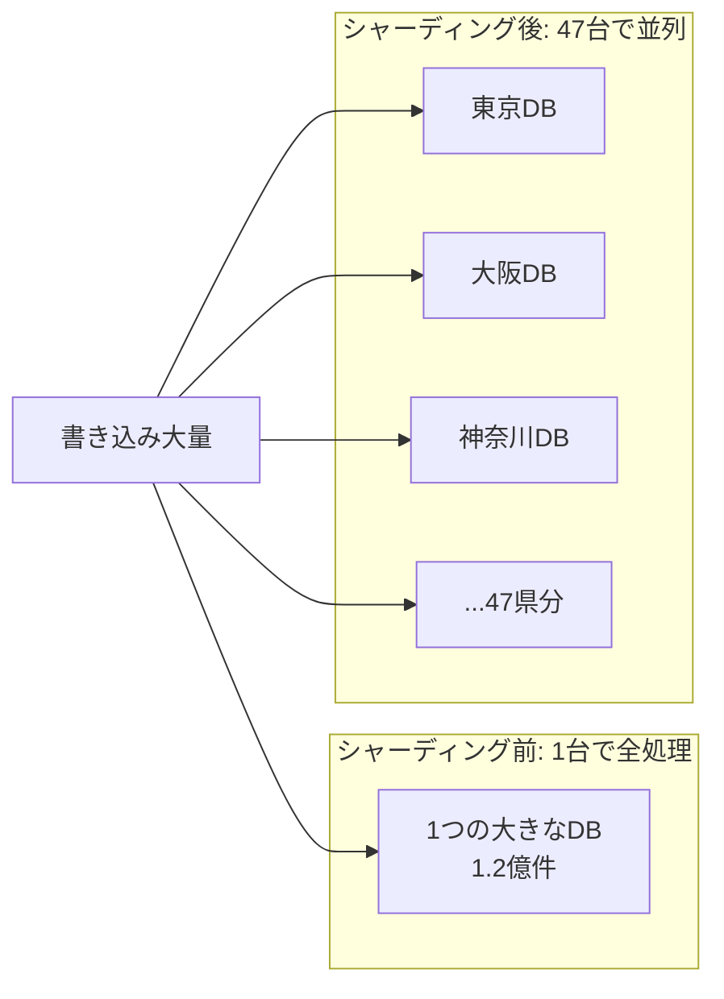

**日付**: 2026年4月24日
**学習内容**: 本記事は両チェーンの **スケーリング戦略** を比較する。Ethereum は **Rollup-Centric Roadmap** を 2020 年に公式採択。L1 を軽く保ち、**Optimistic Rollup (Arbitrum、Optimism、Base)** と **ZK Rollup (zkSync、Starknet、Linea、Scroll)** でスケール。Solana は **L1 で完結** することを掲げ、**Firedancer** で性能向上、**SVM 互換 L2 (Eclipse, Soon, MagicBlock)** で横展開。両者の戦略は全く異なり、それぞれに強みと弱みがある。本記事では **(1) Rollup-Centric Roadmap の意図**、**(2) シャーディング完全理解**、**(3) Optimistic vs ZK Rollup**、**(4) EIP-4844 以降の L2 経済性**、**(5) Solana の L1 スケーリング**、**(6) Firedancer とアルペングロウ**、**(7) SVM 互換 L2 の登場**、**(8) Modular vs Monolithic 論争** を扱う。

## 0. 本記事の位置づけ

Part 1 で「**Ethereum はモジュラー、Solana はモノリシック**」と触れた。本記事はそれをスケーリング視点で深掘りする。

**Ethereum の論理**: 
> 「**L1 は基盤インフラ**として不変・信頼される存在、スケーリングは **L2** で」

**Solana の論理**:
> 「**単一チェーン**でスケールするのが UX の最適解、L1 こそが実行場所」

どちらが正しいか？ 実は **両方のユースケースがある**。

構成:

- **第1章**: Rollup-Centric Roadmap
- **第2章**: シャーディング完全理解 — 素人向け解説
- **第3章**: Optimistic Rollup
- **第4章**: ZK Rollup
- **第5章**: EIP-4844 後の L2
- **第6章**: Solana の L1 スケーリング
- **第7章**: Firedancer と Alpenglow
- **第8章**: SVM L2 (Eclipse, Soon, MagicBlock)
- **第9章**: Modular vs Monolithic
- **第10章**: Q&A
- **第11章**: まとめ

## 1. Rollup-Centric Roadmap

### 1.1 2020 年の方針転換

2020 年、Vitalik が **"A Rollup-Centric Ethereum Roadmap"** を投稿:

> 「**Ethereum L1 を 100,000 TPS にする代わりに、L1 を 100 TPS のまま保ち、L2 (Rollup) で 100,000 TPS を実現しよう**」

これは革命的。従来の「シャーディング」から **「Rollup + Data Sharding」** へ方針転換（シャーディングとは何か、なぜ廃止されたかは **第2章で詳述**）。

### 1.2 なぜ Rollup か

- **セキュリティの継承**: L2 の状態を L1 に **証明** or **データ** として記録
- **互換性**: EVM 互換 L2 なら既存 DApp がそのまま動く
- **柔軟性**: L2 は自由にイノベーションできる

### 1.3 Ethereum の役割分担

```
L1 Ethereum:
  - データ可用性 (DA)
  - 決済ファイナリティ
  - セキュリティ

L2 Rollups:
  - 実行
  - ユーザー体験
  - 独自機能
```

**L1 はインフラ、L2 は実行層**。Bitcoin → Lightning の関係に似る。

### 1.4 Rollup の現状

**Total L2 TVL** (2026): $30-50B

| Rollup | 種類 | TVL |
|---|---|---|
| **Arbitrum** | Optimistic | $15B+ |
| **Base** | Optimistic | $10B+ |
| **Optimism** | Optimistic | $5B+ |
| **Blast** | Optimistic | $3B |
| **zkSync Era** | ZK | $2B |
| **Starknet** | ZK | $1B |
| **Linea** | ZK | $1B |
| **Scroll** | ZK | $0.5B |

Optimistic Rollup が TVL では圧倒的。ZK Rollup は技術的優位だが後発で成長中。

## 2. シャーディング完全理解 — 素人向け解説

本記事の残りを理解するには「**シャーディング (sharding)**」という言葉を押さえる必要がある。ブロックチェーンの文脈で何度も出てきて、かつ **Ethereum では旧計画、現行計画、Solana の拒否** とそれぞれ違う意味で使われるので混乱しやすい。本章でゼロから解説する。

### 2.1 データベースの例えで理解する

シャーディングは元々データベースの技術。

**例: 日本全国の住民データベース (1.2 億件)**

- **シャーディングしない**: 1 つの巨大な DB サーバ。1.2 億件すべてが 1 台に。書き込みが集中すると混雑。
- **シャーディングする**: **47 都道府県別** に 47 個の DB サーバ。各 DB は 1 県分 (約 250 万件) だけ扱う。書き込みが並列に処理される → 全体で **47 倍のスループット**



これがシャーディングの基本発想: **「分割して並列化する」**。

### 2.2 ブロックチェーンでのシャーディング

同じ発想をブロックチェーンに適用:

- 「**1 本の台帳**」 を **N 本の並列台帳 (シャード)** に分割
- 各シャードが独立に tx を処理
- 理論的に TPS が **N 倍**

たとえば 64 シャードにすれば、単純計算で TPS が 64 倍になる（はず）。

### 2.3 シャーディングの 3 つの落とし穴

実装すると簡単ではないことが分かる。

**落とし穴 1: クロスシャード tx (合体問題)**

- シャード A のユーザーがシャード B のユーザーに送金したら？
- シャード A のコントラクトがシャード B のデータを参照したら？
- **別々の台帳を同期する**仕組みが必要 → 遅い、複雑

DeFi の世界観は「**コンポーザビリティ (組み合わせ可能性)**」。Uniswap、Aave、Lido を同じ tx で呼び出せることが大前提。シャーディングすると **これが壊れる**。例えば Uniswap がシャード 3、Aave がシャード 7 にあったら、両方使う tx は「シャード間メッセージを往復」する必要があり、**同じブロックで完結しない**。

**落とし穴 2: セキュリティの希薄化 (薄く伸ばし問題)**

- バリデータも N 個のシャードに分散される
- 1 シャードあたりのバリデータ数 = **全体の 1/N**
- **1 シャードを乗っ取るコスト = 全体の 1/N** に低下
- → 攻撃が **N 倍簡単** に

対策として「**ランダムシャッフル**」でバリデータを定期的に入れ替える設計があるが、これ自体がまた複雑。

**落とし穴 3: 実装複雑性の爆発**

- 単一チェーンでさえ数年かけて実装してきたのに、その N 倍複雑になる
- バグの可能性も N 倍
- クライアント開発者の負担が膨大

### 2.4 Ethereum の旧シャーディング計画 (2015-2020)

Ethereum は当初「**Eth2 = シャーディング**」と謳っていた。

**計画内容**:
- **64 個のシャード** (各が小さな EVM チェーン)
- **Beacon Chain** がコーディネーターとして全シャードを束ねる
- シャード間 tx は **非同期メッセージ** で渡す
- 目標: L1 で **100,000 TPS**

5 年間の研究開発を経て、**理論は固まったが実装が難航**。特にクロスシャード tx の UX が悪すぎて、DeFi エコシステムへの影響が深刻だった。

### 2.5 なぜ廃止したか — Rollup の台頭

2019-2020 にかけて **Rollup 技術** が急速に進展。研究者・開発者が気づいた:

> **「Rollup を複数走らせれば、シャーディングとほぼ同じ効果が得られる。しかも実装が遥かにシンプル」**

| | 旧シャーディング | Rollup-Centric |
|---|---|---|
| 実行場所 | 64 シャード (対等に並列) | 複数 L2 (独立した実行環境) |
| L1 の役割 | コーディネーター | **データ可用性 + セキュリティベース** |
| 相互運用 | シャード間非同期メッセージ (複雑) | L2 間ブリッジ (既存技術) |
| EVM 互換 | 困難 | **容易** (既存 DApp がそのまま動く) |
| 実装状況 | 数年遅延、複雑化の一途 | **既に動いている** |
| セキュリティ | 1/64 に希薄化 | **L1 のセキュリティをフルに継承** |

2020 年に Vitalik は公式に「**シャーディングより Rollup**」を宣言。これが第1章で触れた **Rollup-Centric Roadmap**。

### 2.6 Ethereum の現在: "Data Sharding" だけ残した

ただし、シャーディングのアイデア **全体を捨てたわけではない**。「**データ** の部分だけ」はシャーディング的発想が活きると分かった。

**現行の方針**:
- **ステート (残高・コントラクト状態) は 1 本のまま** ← 単一チェーン
- **データ (blob) だけ複数レーンに分割** ← これがデータシャーディング

**2024-03 の EIP-4844 (Proto-Danksharding)**:
- 新しい **blob** という専用データレーンを追加
- L2 はここにデータを書く → **95% 安い**
- 最大 **6 blobs / block** (現行)

**将来の Danksharding (2026-2027 見込み)**:
- blobs を数十倍に増加
- **Data Availability Sampling (DAS)**: 軽量ノードでも一部データだけ検証すればOKに

つまり Ethereum は「**ステートはモノリシック (1 本)、データだけシャーディング**」というハイブリッドに落ち着いた。

### 2.7 Solana: "シャーディングしない" 選択

Solana は真逆のスタンス。

**モノリシック原理主義**:
- **全世界を 1 本のチェーン** で処理
- シャード間問題を発生させない
- 流動性・ユーザーが分散しない
- コンポーザビリティを保つ

代わりの武器:
- **Sealevel 並列実行** (Part 3): 「1 本のチェーン内で tx を並列処理」— シャーディングではなく **実行の並列化** で同等の効果を狙う
- **Firedancer**: 1 ノードの性能を極限まで
- **ハードウェアの進化** に乗る（ムーアの法則を活用）

「**シャーディングの代わりに、1 ノードの性能を上げ続ける**」戦略。

### 2.8 3 つのアプローチを一言で

**例えで整理**:

| | アプローチ | 例え |
|---|---|---|
| **旧 Ethereum 計画 (廃止)** | 64 シャードに分割 | 都内を 64 本の地下鉄に分ける、**乗り換え地獄で廃止** |
| **現 Ethereum** | 1 本の L1 + 無数の L2 + データレーン | **1 本の新幹線 + 複数の私鉄** + 貨物専用線 (blob) |
| **Solana** | 1 本を極限までチューニング | **1 本の超高速道路**、全てここを通る |

「シャーディング」という言葉を聞いたら:
- **昔の Eth2 の話**(フルシャーディング、廃止) なのか
- **現行の EIP-4844 / Danksharding**(データだけシャーディング) なのか
- **Solana の拒否**(一切シャーディングしない) の文脈なのか

を区別して読み取ると混乱しない。

### 2.9 他のチェーンは？

参考までに:

- **NEAR**: Nightshade と呼ぶ動的シャーディング、実装済み
- **Polkadot**: パラチェーン (事実上のシャード)
- **Avalanche**: サブネット (シャードに近い)
- **Aptos / Sui**: モノリシック + 並列実行 (Solana 路線)
- **Monad**: モノリシック + 並列 (Solana 路線 + EVM 互換)

フルシャーディングを **実際に成功させた** 大規模チェーンは **NEAR** くらい。多くは「**Rollup** か **モノリシック + 並列**」のどちらかに収束しつつある。

## 3. Optimistic Rollup

### 3.1 仕組み

- L2 で tx を実行
- 定期的に **state root** と **tx データ** を L1 に送る
- 誰かが「この実行は不正」と主張できる **challenge 期間** (7 日)
- 不正なら **Fraud Proof** で state を巻き戻し

### 3.2 長所と短所

**長所**:
- **EVM 互換が簡単**（Ethereum クライアントをほぼそのまま使える）
- ガス安
- 既存 DApp がすぐ動く

**短所**:
- **引き出しに 7 日**（challenge 期間）
- 実際には **bridge aggregator** が 1 時間で引き出し可能にするが、前払い fee が必要

### 3.3 代表: Arbitrum

- **TVL $15B+**、L2 最大
- **Nitro** エンジン（カスタム geth fork）
- 完全な EVM 互換 + WASM 相当の Stylus
- 開発者が MetaMask と Solidity でそのまま開発

### 3.4 代表: Base (Coinbase)

- **2023 年 8 月 ローンチ**
- Coinbase が運営
- Optimism Superchain 参加
- **Consumer app の主戦場** (friend.tech, farcaster)
- **低ガス、高速**

### 3.5 Superchain (Optimism)

OP Stack で作られた L2 同士が相互運用:
- Base、World Chain、Celo (移行予定)、Zora
- **メッセージング、共有 sequencer** で密連携
- 「**複数 L2 をつなげて 1 つのメガチェーン**」

## 4. ZK Rollup

### 4.1 仕組み

- L2 で tx を実行
- 実行の **正しさをゼロ知識証明 (ZKP)** で生成
- L1 に state root + ZK proof を送る
- L1 で proof を verify → 正しければ即確定

### 4.2 長所と短所

**長所**:
- **即時ファイナリティ**（L1 に proof が届いた瞬間）
- **Fraud proof 期間なし**
- **コンパクトな証明**（数 KB）

**短所**:
- **Prover が重い**（1 tx あたり ZK proof 生成に秒-分）
- **EVM 互換が難しい**（ZK 回路化が複雑）
- **コスト**: prover run cost が重い

### 4.3 代表: zkSync Era

- **Matter Labs** 開発
- LLVM ベースの compiler で Solidity/Vyper 対応
- EVM 互換は **不完全** (Era VM は独自仕様)
- **Custom signature、paymaster、AA** のサポート

### 4.4 代表: Starknet

- **StarkWare** 開発
- **Cairo** 言語（ZK-friendly）
- **EVM 非互換**（独自の VM）
- **最も革新的** な ZK Rollup、生態系が若い

### 4.5 代表: Linea, Scroll, Polygon zkEVM

- より **EVM 互換** を重視した ZK Rollup
- Linea: ConsenSys
- Scroll: 研究寄り、Ethereum Foundation 系
- Polygon zkEVM: Polygon Labs

### 4.6 ZK vs Optimistic

**将来的には ZK が主流になる** と Vitalik は予測:
- **Optimistic は 7 日遅延** が本質的
- **ZK は暗号的に即確定**
- ただし **ZK の prover コスト** が下がるまで 5-10 年

現状は両方が発展中。

## 5. EIP-4844 後の L2

### 5.1 Blob の衝撃

2024-03 Dencun アップグレードの EIP-4844 で:
- L2 のコストが **95% 削減**
- **Base チェーンで 1 swap $0.01** が実現
- **Arbitrum で NFT mint $0.05**

「**Ethereum L2 が本格的に使える**」ラインを超えた。

### 5.2 Blob fee market

Blob 用の fee market が独立:
- 初期: **ほぼ 0 gwei** (激安)
- 2024-06: **dynamic pricing 発動**、混雑時は数 gwei
- 2025-2026: **1-30 gwei の範囲**

### 5.3 L2 間での棲み分け

**Arbitrum, Optimism**: 既存 DeFi の受け皿（Uniswap、Aave、GMX など native 展開）
**Base**: Coinbase → 新規ユーザー取り込み、ミームコイン、Social
**Blast**: yield-bearing、Native-yield（USDB が yield 自動付与）
**zkSync, Starknet**: 長期技術、AA、固定ユーザー

### 5.4 TPS と capacity

EIP-4844 後の L2 合計スループット:
- **Optimistic Rollups**: 最大 1,000+ TPS (理論値)
- **ZK Rollups**: 500 TPS 級 (prover 限界)
- **合計 L2**: **2,000-5,000 TPS** (実測)

**これは Solana と同等**。Ethereum エコシステム全体で Solana に並ぶ。

## 6. Solana の L1 スケーリング

### 6.1 「**L1 で全部やる**」

Solana の公式スタンス: **シャーディングせず、L1 を高速化し続ける**（第2章参照）。

### 6.2 既存の最適化

Solana が既に導入している性能策:

- **Proof of History**: 時刻同期省略
- **Sealevel**: 並列実行
- **Turbine**: BitTorrent 風ブロック伝播
- **Gulf Stream**: メモプール廃止
- **Pipelining**: ブロック検証の流し
- **Cloudbreak**: 並列ストレージ

これらすべてが **フル L1 で動く**。

### 6.3 次の改善

- **Firedancer**: 新しいバリデータ実装 (Part 5 で言及)
- **Alpenglow**: PoH/Tower BFT 置き換え、100ms ファイナリティ
- **Stake-weighted QoS**: スパム耐性
- **Compression**: NFT を大量・低コスト発行 (cNFT)

### 6.4 目標

- **Firedancer フル**: 1M TPS 理論値
- **Alpenglow**: 100-150ms ファイナリティ
- **DA 拡張**: ブロックサイズ増

**2030 年には Solana L1 単体で Visa スケール (65,000 TPS)** が現実目標。

### 6.5 L2 なしで足りるか

Solana 側の主張:
- L2 は **複雑性とコスト**（bridge、断片化）を生む
- L1 を高速化する方が **開発者・ユーザーにシンプル**

批判:
- **バリデータのハードウェア要件が上がる**
- **分散性が犠牲**
- **ある時点で物理限界**

## 7. Firedancer と Alpenglow

### 7.1 Firedancer 再訪

Part 5 で触れた **Firedancer** (Jump Crypto 作の Solana クライアント):
- **C++ で書き直し**
- **1M TPS 級** のネットワーク処理能力
- **クライアント多様性** の達成

2025 年時点 **Frankendancer (部分導入)** で stake の 20% をカバー。Full Firedancer は 2025-2026 中。

### 7.2 Alpenglow (再訪)

Anza の **Alpenglow**:
- PoH + Tower BFT を置き換え
- **100-150ms ファイナリティ**
- より単純で高速な BFT

これで Solana は **「確認が一瞬」** のチェーンに。

### 7.3 両者で何が起きる？

```
現在 (2026):
  Solana: 400ms slot, 12.8s finality, 3000 TPS 実測
     ↓
Alpenglow + Full Firedancer (2027 見込):
  Solana: 150ms finality, 10,000+ TPS 実測
```

2027 年以降、Solana は **新たな性能レベル** に到達。

### 7.4 Ethereum との比較

Ethereum の同じ時期の予想:
- **SSF (Single Slot Finality)**: 12 秒 finality
- **Verkle Tree**: stateless client
- **L2 強化**: 全体で 10,000+ TPS

**両者とも 10 倍スケールアップ**。競争継続。

## 8. SVM L2 (Eclipse, Soon, MagicBlock)

### 8.1 「Solana VM を他で使う」

面白い現象: **Solana VM (SVM) を Ethereum L2 として使う**。

### 8.2 Eclipse

- **SVM を Ethereum L2 として展開**
- **Data Availability は Celestia**
- Solana のスループット + Ethereum のセキュリティ
- 2024 年 mainnet

### 8.3 Soon

- **SVM-based L2 framework**
- 複数のチェーンで SVM を展開
- まだ実証段階

### 8.4 MagicBlock

- **Ephemeral rollup** (短寿命 rollup)
- Solana 上でゲーム向け超低遅延 rollup
- 「**60 Hz**」の tick rate

### 8.5 意味するところ

**SVM が魅力** だが、**Solana L1 の信頼性を不安視する** プロジェクトが L2 化する動き。

一方で Ethereum は "**EVM + 並列実行**" の新 L1 (Monad、Sei、Movement) を生んでいる。

= **両チェーンの良いとこ取り** が業界トレンド。

## 9. Modular vs Monolithic

### 9.1 両者のスタンス

**Modular (Ethereum 派)**:
- L1 = DA + セキュリティ
- L2 = 実行
- Celestia = 外部 DA
- 各層を **最適化**

**Monolithic (Solana 派)**:
- L1 = すべて
- **一体化で効率** + **無駄な橋渡しなし**

### 9.2 Modular の主要プレイヤー

- **Ethereum**: データ可用性 + ファイナリティ
- **Celestia**: DA-specialized L1
- **EigenDA**: Ethereum 上の DA market
- **Avail**: DA-specialized L1 (Polygon 系)
- **Arbitrum Orbit, OP Stack**: L3 / L2 フレームワーク

### 9.3 Monolithic の主要プレイヤー

- **Solana**
- **Aptos / Sui**: Move 言語、並列実行
- **Monad**: EVM 互換 + 並列
- **Sei**: 同上 + CLOB ネイティブ

### 9.4 論争

**Modular 支持**:
- 各コンポーネントが **最適化しやすい**
- **競争原理** が働く
- **検閲耐性** が層で守られる

**Monolithic 支持**:
- **UX がシンプル**
- **ブリッジ不要**
- **流動性分散しない**

どちらも一理ある。**用途で分かれる**。

### 9.5 未来の予想

**Ethereum**: Modular で進化、1000+ L2 が花咲く
**Solana**: Monolithic で L1 極限化
**Aptos/Sui**: Monolithic + Move 言語で追随
**L1 合戦**: まだ終わっていない

2030 年には **複数の成功チェーン** が共存しているはず。

## 10. Q&A

### Q1: L2 の「セキュリティ継承」って具体的に何？

L1 に **データ（Optimistic）** or **証明 (ZK)** を送ることで、L1 のコンセンサスを信頼すれば L2 の状態が正しいと検証できる。L1 が止まらない限り、L2 の過去状態は復元可能。

### Q2: Rollup の運営者は中央集権的では？

**現状はそう**。Sequencer（tx 順序を決める人）は単一運営が多い:
- Arbitrum: Offchain Labs
- Optimism: Optimism Foundation
- Base: Coinbase

Sequencer **検閲** は技術的可能。しかし L1 への force inclusion 機能があれば、ユーザーは強制的に tx 取り込みを要求できる。

### Q3: ZK Rollup でも本当に「即時ファイナリティ」？

L1 に proof が取り込まれた時点で確定。しかし **L1 ファイナリティが 12.8 分** なので、実質は L1 に従う。即時性は **soft finality** のレベル。

### Q4: Solana の「L2 不要」は本当？

**ほぼ不要だが、完全ではない**。Compression や Ephemeral rollup（MagicBlock）が出ているのは、用途によって L2 的構造が有用だからでもある。

### Q5: Eclipse のような SVM L2 は Solana を殺すか？

**補完関係になる可能性が高い**。L1 Solana は L2 と違うユースケースを持つ（L1 DEX、stake、bridge hub）。Eclipse は Ethereum 経済圏で SVM を楽しみたい人向け。

### Q6: DeIn のスケーリングは？

DeIn は:
- **47 都道府県 × 複数契約者** 数千〜数万件規模
- 地震発生時の **バッチ支払い**
- Ethereum L2 (Arbitrum, Base) で十分。L1 は高価すぎる

Part 8 で深掘り。

### Q7: 「シャーディング」と聞くと混乱する

当然の混乱。**文脈で意味が違う**:

- **Eth2 時代 (旧)**: フルシャーディング (64 シャード) → **廃止された計画**
- **Ethereum 現行**: Data Sharding (EIP-4844 / Danksharding) = **blob データのみシャード**
- **Solana**: 「**シャーディングしない**」と明言
- **NEAR**: 実装済みの動的シャーディング (Nightshade)

同じ言葉が正反対の意味になるので要注意。

### Q8: Rollup とシャーディングって結局何が違う？

**本質的な違い**:

| | シャーディング | Rollup |
|---|---|---|
| 各チェーンの位置づけ | L1 の平等な部分 (対等) | L1 の下の L2 (階層) |
| セキュリティ | 各シャードに分散 | 全 Rollup が L1 を共有 |
| EVM 互換 | 困難 (プロトコル書き換え) | 容易 (L2 が選べる) |
| 独立開発 | 難しい (仕様が固定) | 柔軟 (各 L2 が自由) |

Rollup は「**シャーディングと同じ効果を、階層化で実現**」したイノベーション。

## 11. まとめ

### 本記事で学んだこと

- **Ethereum**: **Rollup-Centric Roadmap**。L1 軽く、L2 (Arbitrum, Base, zkSync, Starknet) でスケール
- **シャーディング**: **旧 Ethereum 計画 (廃止)** vs **現行 Data Sharding (残った)** vs **Solana (拒否)** の 3 態
- Rollup は「**シャーディングの代わりに L2 を階層化**」するアプローチ
- **EIP-4844** で L2 コスト 95% 削減 → 2024 以降本格実用化
- **Optimistic Rollup**: 7 日 challenge、EVM 互換が簡単
- **ZK Rollup**: 即時ファイナリティ、prover コスト重い
- **Solana**: **L1 単体でスケール**。Firedancer、Alpenglow で性能向上
- **SVM L2 (Eclipse, Soon, MagicBlock)**: Solana VM を Ethereum 経済圏に持ち込む動き
- **Modular vs Monolithic** の論争は継続、両方のアプローチが共存

### 次の記事（Part 8）へ

最終回は **DeIn 視点**。分散型地震保険プロトコル DeIn で、Ethereum と Solana のどちらが適切か。オラクル、ガス代、規制対応、多言語の観点で具体的に比較する。Kenichi 自身の結論を書く。

### 3行サマリ

- **Ethereum**: **Rollup-Centric**、L1 軽量 + L2 (Arbitrum, Base, zkSync) でスケール。EIP-4844 後に本格実用化
- **シャーディング**: Ethereum は旧計画を **廃止**、データ (blob) だけ残した。**Solana は一切せず** Sealevel 並列で代用
- **SVM L2 の登場** で「Solana VM × Ethereum セキュリティ」のハイブリッドも選択肢に

---

## 参考文献

- Vitalik Buterin. *A Rollup-Centric Ethereum Roadmap.* 2020. [https://ethereum-magicians.org/t/a-rollup-centric-ethereum-roadmap/4698](https://ethereum-magicians.org/t/a-rollup-centric-ethereum-roadmap/4698)
- Vitalik Buterin. *Endgame.* 2021. [https://vitalik.eth.limo/general/2021/12/06/endgame.html](https://vitalik.eth.limo/general/2021/12/06/endgame.html)
- Dankrad Feist. *Data Availability Sampling and Danksharding.* 2022.
- L2Beat. *L2 Dashboard.* [https://l2beat.com/](https://l2beat.com/)
- Arbitrum Docs. [https://docs.arbitrum.io/](https://docs.arbitrum.io/)
- zkSync Docs. [https://docs.zksync.io/](https://docs.zksync.io/)
- Starknet Docs. [https://docs.starknet.io/](https://docs.starknet.io/)
- Eclipse. [https://www.eclipse.xyz/](https://www.eclipse.xyz/)
- Celestia. *Modular Blockchains.* [https://celestia.org/](https://celestia.org/)
- Monad. [https://www.monad.xyz/](https://www.monad.xyz/)
- NEAR Nightshade. [https://near.org/papers/nightshade](https://near.org/papers/nightshade)
