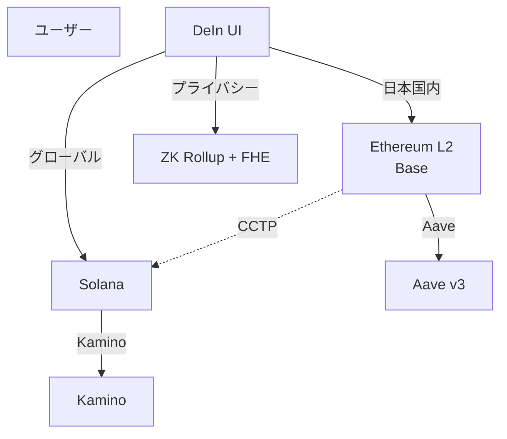

**日付**: 2026年4月24日
**学習内容**: シリーズ最終回。**DeIn（分散型地震保険プロトコル）** の視点で、Ethereum と Solana のどちらが最適かを検討する。DeIn は:
- **NFT 保険証書** (ERC721)、**47 都道府県別** 契約
- **Chainlink Oracle** で気象庁地震データ取り込み
- **3 プール Treasury** (GLOBAL / STAKING / INVESTMENT)
- **Aave でステーキング運用**、**Ethereum ベース**

このシステムを **Solana に移植するか**、それとも **Ethereum + L2** で継続するか。本記事では **(1) DeIn の技術要件**、**(2) オラクル統合 (Chainlink vs Switchboard/Pyth)**、**(3) ガス代の実際**、**(4) 規制対応・KYC**、**(5) 開発・運用コスト**、**(6) 両プラットフォームでの実装スケッチ**、**(7) Kenichi 自身の結論**、**(8) シリーズ総括** を扱う。

## 0. 本記事の位置づけ

Part 1-7 で Ethereum と Solana を技術的・経済的に比較してきた。本記事は **DeIn という具体プロジェクト** でそれを適用する。

**前提**: DeIn は既に Ethereum (Solidity) で実装済み。Solana 移行 or ハイブリッド化の価値があるか？

結論を先に:
> **「MVP フェーズは Ethereum 継続が妥当。将来の UX 向上フェーズで Solana 版または L2 移行を検討」**

以下、この結論に至る論拠を見ていく。

構成:

- **第1章**: DeIn の技術要件
- **第2章**: オラクル統合の比較
- **第3章**: ガス代の実際
- **第4章**: 規制対応・KYC
- **第5章**: 開発・運用コスト
- **第6章**: 実装スケッチ
- **第7章**: Kenichi の結論
- **第8章**: シリーズ総括

## 1. DeIn の技術要件

### 1.1 DeIn のコアコンポーネント

コード構造（[DeIn-team リポジトリ](/home/kenichiuejo/src/DeIn-team) 参照）:

- **IssuerManager.sol**: NFT 発行、47 都道府県別管理、有効期限 365 日
- **CertificateNFT.sol**: ERC721 発行・失効
- **PaymentEngine.sol**: 保険金支払い実行（prepareForPayment → processPayment）
- **Treasury.sol**: 3 プール管理、Reentrancy Guard
- **FundForPayment.sol**: バッチ支払い（最大 500 件/tx）
- **EarthquakeDataAdapter.sol**: Chainlink Functions 統合
- **DAOCore.sol**: 権限管理、2 段階 ownership、緊急停止
- **SignatureVerifier.sol**: EIP-712 署名検証

### 1.2 機能フローのサイズ感

想定する規模:
- **契約者**: 数百〜数万（日本の世帯 5,400 万に対し MVP は〜数万）
- **年間 tx**: 契約購入 + 地震発生時バッチ支払い
- **データ**: 都道府県別震度 47 項目/日

### 1.3 技術的要件

DeIn が「**ブロックチェーンに求める性質**」:

| 要件 | 重要度 |
|---|---|
| 低ガス代 (契約 $30 以下) | ★★★★ |
| ファイナリティ速度 | ★★ (数分 OK) |
| オラクル統合 | ★★★★★ |
| 規制遵守 | ★★★★ |
| 開発者エコシステム | ★★★ |
| 既存 DeFi 統合 (Aave など) | ★★★★ |
| バッチ処理能力 | ★★★ |
| 長期安定性 | ★★★★★ |

**最重要**: オラクル、規制、長期安定性、低ガス代。

## 2. オラクル統合の比較

### 2.1 DeIn にとってオラクルは生命線

DeIn は **気象庁地震データを取り込む** ことでしか機能しない:
- 震源、震度、震度の47都道府県分布
- 発生時刻
- **信頼できるデータソース** が必須

DeIn の現状:
- **Chainlink Functions** (Sepolia/mainnet)
- **P2P地震情報API** (オフチェーンソース)
- Cloudflare D1 で永続化

### 2.2 Ethereum のオラクル: Chainlink

**Chainlink**:
- **業界標準**、最大の信頼実績
- **Functions**: オンチェーン trigger で任意の API 呼び出し
- **Data Feeds**: 価格データの標準
- **VRF**: 乱数
- **CCIP**: クロスチェーン メッセージング

**DeIn の EarthquakeDataAdapter** が Chainlink Functions を使用:

```solidity
// DeIn のオラクル統合
function sendRequest(...) external {
    // Chainlink Functions で P2P地震情報 API を呼ぶ
    FunctionsRequest.Request memory req;
    req.initializeRequestForInlineJavaScript(source);
    // ...
    _sendRequest(req.encodeCBOR(), subscriptionId, gasLimit, donID);
}
```

### 2.3 Solana のオラクル: Switchboard と Pyth

**Pyth Network**:
- **低レイテンシ** (400ms 更新)
- **Wormhole 経由で Ethereum / Arbitrum にも配信**
- 価格・rate データ主体
- **Pull-based オラクル** (ユーザーが必要時に署名付きデータ取得)
- **外部地震データの対応は限定的**

**Switchboard**:
- **オンデマンドオラクル**
- **任意の API** を呼べる (Chainlink Functions 風)
- Solana ネイティブ、Sui にも展開
- **カスタムジョブ設計** が柔軟

### 2.4 地震データ取り込みの可能性

DeIn を Solana に持っていく場合:

**選択肢 1: Switchboard Function**
- 任意 API 呼び出しが可能 → P2P地震情報API 取り込み可
- Chainlink Functions に近い設計

**選択肢 2: 気象庁 API を直接**
- オフチェーンバックエンドから直接取得 → 署名して Solana にポスト
- DeIn 既存の **署名付きスナップショット** パターンを活用可能
- **SignatureVerifier** 相当は `ed25519_program` でネイティブサポート

**選択肢 3: カスタムオラクル**
- 自前で複数のノード運用 → 中央集権化リスク

### 2.5 結論

- **Chainlink は業界標準、Ethereum で DeIn 既存実装**
- **Switchboard は有力選択肢、Solana 版は十分構築可能**
- Pyth は価格データ寄りで、地震データでは Switchboard の方が適切

**移植可能性: ◯**。ただし再実装コストが数ヶ月。

## 3. ガス代の実際

### 3.1 DeIn の主要 tx のガス見積もり

Solidity 実装の実測（Foundry gas-report 相当）:

| Tx | Gas | L1 cost (20 gwei) | L2 cost (EIP-4844) |
|---|---|---|---|
| NFT 購入 (mint) | 約 200,000 | $0.80 | $0.008 |
| バッチ支払 (500 件) | 約 5,000,000 | $20 | $0.20 |
| DAO 投票 | 約 100,000 | $0.40 | $0.004 |
| Treasury 入金 | 約 80,000 | $0.32 | $0.003 |

(ETH price $2,000 想定)

### 3.2 L1 Ethereum では厳しい

- **1 契約 $0.80** は許容範囲だが、混雑時は $5-20 に跳ね上がる
- 日本の地震保険料は年額数千円 → **gas が 10-20% を占める**
- 実用性は **L2 が必須**

### 3.3 Ethereum L2 (Arbitrum, Base, Optimism)

EIP-4844 後:
- **1 契約 $0.01 未満** → 実用範囲
- バッチ支払 $0.20 → 500 人一括で問題なし

**L2 で DeIn を動かすのが現実解**。

### 3.4 Solana

- **1 契約 $0.001-0.005** → **L2 より更に安い**
- **バッチ支払 500 件** も数セント
- ミームコイン並みの手軽さ

**コスト面では Solana > L2 Ethereum > L1 Ethereum**

### 3.5 しかしコストだけで決まらない

Ethereum L2 にも Solana にも **移行コスト** がある:
- コード書き換え (Solidity → Rust/Anchor)
- オラクル再統合
- DeFi 連携再設計
- 監査やり直し

**数百万円 〜 数千万円のエンジニアリングコスト**。数年分のガス代を上回る可能性。

## 4. 規制対応・KYC

### 4.1 日本の保険業法

DeIn のような **保険商品** は日本の金融規制下:
- **保険業法**: 免許制、資本要件
- **金融商品取引法**: 金融商品の販売規制
- **資金決済法**: 暗号資産・ステーブルコイン

MVP は「**保険ではない**」形（例: 贈与やトークン型デリバティブ）で設計される可能性が高いが、いずれにせよ **規制対応** は避けられない。

### 4.2 KYC/AML

日本の事業者として行うなら:
- **個人特定** が必須
- **マネロン対策**
- **旅行規則 (Travel Rule)**: 暗号資産取引で相手情報を取得

これらは **オンチェーン完結では実現困難**。KYC サーバ + ZKP などハイブリッドが現実解。

### 4.3 Ethereum での KYC 統合

- **Circle's KYC'd USDC**: 一部の L2 で実装
- **Polygon ID**: DID + ZKP for KYC
- **WorldCoin / Worldchain**: 生体認証ベース
- **Japan 固有**: ペイメント事業者の統合が進んでいる

### 4.4 Solana での KYC

- **civic.me**: Solana ネイティブの ID ソリューション
- **Solana ID**: 新興
- 選択肢は **Ethereum より少ない**
- 日本向け事業者 API との統合事例がまだ少ない

### 4.5 規制当局の認知度

金融庁・財務省・個人情報保護委員会の認識:
- **Ethereum**: 海外規制で先行事例、認知度高い
- **Solana**: 認知度はあるが、事例少ない

**規制対応の進めやすさは Ethereum が優位**。特に日本市場では。

## 5. 開発・運用コスト

### 5.1 既存のコードベース

DeIn は既に Solidity で **8 コントラクト、数千行** 書かれている。

- Foundry テスト済
- Cloudflare D1 バックエンド
- React + wagmi フロントエンド
- Chainlink Functions 統合
- DAO ガバナンス実装

これを Solana に全書き換えは **巨大プロジェクト**。

### 5.2 開発者の採用

日本で:
- **Solidity 開発者**: 数百〜千人レベル、比較的探しやすい
- **Rust + Anchor 開発者**: 数十人レベル、採用困難

**チーム拡大時のリスク** が Solana は高い。

### 5.3 セキュリティ監査

- **Ethereum の監査会社**: OpenZeppelin, ConsenSys, Trail of Bits などが日本語対応拡大中
- **Solana の監査会社**: OtterSec, Zellic, Halborn など、主に英語

監査費用はどちらも $50K-500K 規模。

### 5.4 運用コスト

- **Ethereum**: Infura, Alchemy 等の RPC 従量課金
- **Solana**: Helius, Triton, QuickNode 等

運用コストはほぼ同等。Solana の方が RPC スループットが高いので **重いバックエンドにはコスト有利**。

## 6. 両プラットフォームでの実装スケッチ

### 6.1 Ethereum L2 実装 (推奨 MVP)

**技術スタック**:
- **L2**: **Base** (Coinbase) or **Arbitrum One**
- **言語**: Solidity (既存コード流用)
- **オラクル**: **Chainlink Functions** (既存)
- **フロントエンド**: React + wagmi + viem (既存)
- **ステーキング運用**: **Aave on Arbitrum/Base** (既存 Aave v3)

**最小限の変更**:
- Chain ID 変更
- ガス最適化調整
- Chainlink Functions の L2 対応確認
- ブリッジ戦略（Mainnet ETH → L2 ETH）

**移行コスト**: **小** (数週間)

**メリット**:
- 既存コード流用
- ガス代激減 ($0.01 級)
- Ethereum のセキュリティ継承
- Aave などの DeFi がネイティブ

### 6.2 Solana 実装 (V2/V3 検討)

**技術スタック**:
- **言語**: Rust + Anchor
- **オラクル**: **Switchboard Function**（P2P API 呼び出し）or **カスタム signed oracle**
- **NFT**: Metaplex Core / SPL Token
- **フロントエンド**: React + Solana Wallet Adapter + Anchor client
- **ステーキング運用**: **JitoSOL + Kamino Lending**

**実装のイメージ**:

```rust
// IssuerManager 相当 (Anchor)
#[program]
pub mod dein_issuer {
    pub fn mint_certificate(
        ctx: Context<MintCertificate>,
        prefecture_id: u8,
        coverage_amount: u64,
        expiry_timestamp: i64,
    ) -> Result<()> {
        // NFT account 作成
        let cert = &mut ctx.accounts.certificate;
        cert.prefecture_id = prefecture_id;
        cert.coverage = coverage_amount;
        cert.expiry = expiry_timestamp;
        cert.owner = ctx.accounts.user.key();
        
        // Treasury に SOL/USDC 送金
        // ...
        
        Ok(())
    }
    
    pub fn batch_payment(
        ctx: Context<BatchPayment>,
        cert_ids: Vec<u64>,
        amounts: Vec<u64>,
    ) -> Result<()> {
        // 並列実行を活かした一括支払い
        // 各 cert account を事前宣言しておく
    }
}
```

**移行コスト**: **大** (3-6 ヶ月)

**メリット**:
- ガス代 $0.001 級（L2 の 1/10）
- 並列処理でバッチ支払いが超高速
- MEV 対策も Jupiter 等で成熟
- **ユーザー体験が滑らか** (gasless 風、確認一瞬)

**デメリット**:
- Rust + Anchor の学習コスト
- オラクル再統合
- DeFi エコシステムが Ethereum より浅い
- 規制対応がやや不透明
- 過去の障害歴

### 6.3 Ethereum + ZKP ハイブリッド（長期）

2026 以降のトレンド:
- **ZK Rollup** で L2 コストさらに削減
- **FHE** で物件住所などをプライバシー保護（FHE シリーズ参照）
- **ZK-KYC** で個人情報を漏らさず規制準拠
- **AA (Account Abstraction)** で gasless 風 UX

これらを Ethereum 側で **順次導入** するのが現実的。

## 7. Kenichi の結論

### 7.1 フェーズ別の推奨

**Phase 1 (MVP、2025-2026)**: **Ethereum L2 (Base or Arbitrum)**

理由:
- 既存 Solidity コードをほぼそのまま流用
- ガス代 $0.01 級で実用レベル
- Chainlink Functions 継続使用
- Aave 運用がネイティブ
- 日本市場で規制対応が進めやすい

**Phase 2 (V2、2026-2027)**: **Ethereum L2 継続 + プライバシー強化**

- **ZK Rollup (Linea, Scroll, zkSync)** への移行検討
- **FHE + ZKP** で物件住所の匿名化
- **ZK-KYC** で規制準拠

**Phase 3 (V3、2027+)**: **マルチチェーン展開の検討**

- **Solana 版** をセカンドとしてローンチ
- 日本国外のユーザー向け
- **Pyth/Switchboard** で独自オラクル
- Ethereum 版と **CCTP で USDC 流動性共有**

### 7.2 なぜ最初から Solana ではないか

1. **規制対応**: 日本市場で Ethereum の方が進めやすい
2. **既存コード**: Solidity 資産を捨てるコストが高い
3. **保険業法対応**: Ethereum の ZKP エコシステムが成熟
4. **Aave 依存**: DeFi 統合は Ethereum 側が深い
5. **リスク管理**: Solana の過去障害歴への慎重姿勢

### 7.3 Solana を検討するタイミング

- **Firedancer フル導入** (2026-2027 見込み) で障害リスクが下がる
- **Alpenglow** で UX が本当に Web2 級になる
- 日本で **Solana 事業者の規制対応事例** が増える
- DeIn のユーザーベースが **日常利用** を求めるフェーズ

このいずれかが起きれば、Solana 版の検討を本格化する価値がある。

### 7.4 最悪のシナリオ回避

**Ethereum 側の懸念**:
- ZK Rollup が普及しないと **L1 gas が高止まり**
- ステーキング集中化 (Lido の寡占)

**Solana 側の懸念**:
- Firedancer で改善しても **単一仕様** は残る
- 障害再発
- 規制不確実性

どちらも保険商品として「**最悪のシナリオ**」があり得る。**Ethereum の方が金融インフラとして保守的** なので、MVP 〜 規制対応フェーズでは Ethereum が安全牌。

### 7.5 ハイブリッド運用の未来

長期的には:



**マルチチェーン展開** で、ユーザーは意識せず、内部で最適なチェーンを使う。これが 2028-2030 の姿と予想。

## 8. シリーズ総括

### 8.1 シリーズ 8 回で学んだこと

| Part | トピック | キーメッセージ |
|---|---|---|
| 1 | 哲学と設計思想 | Ethereum=分散ファースト、Solana=パフォーマンスファースト |
| 2 | コンセンサス | Gasper vs PoH+Tower BFT (→Alpenglow)、時間の扱いが根本から違う |
| 3 | Tx 処理 | EIP-1559/4844 vs Sealevel 並列実行、TPS 実測 15 vs 3000 |
| 4 | EVM vs SVM | コード+ストレージ一体 vs Program/Account 分離、Solidity vs Rust/Anchor |
| 5 | 障害耐性 | Solana 過去 8 回停止、Ethereum 基本ゼロ。Firedancer で改善中 |
| 6 | DeFi | Ethereum は AMM 文化、Solana は CLOB + AMM ハイブリッド |
| 7 | スケーリング | Modular (L2 中心) vs Monolithic (L1 完結) |
| 8 (本記事) | DeIn | MVP は Ethereum L2、V2 で Solana 検討 |

### 8.2 両者が共存する必然性

- **Ethereum**: 社会インフラ・規制対応・長期安定性
- **Solana**: 消費者向け UX・高頻度用途・低コスト

「どっちが勝つか」ではなく「**どっちを選ぶか**」。用途で決まる。

### 8.3 DeIn 以外のプロジェクトへの示唆

- **DEX、マーケットプレイス**: Solana が向く
- **保険、金融サービス**: Ethereum (L2) が向く
- **ゲーム、ソーシャル**: Solana
- **DAO、インフラ**: Ethereum
- **NFT (大量)**: Solana
- **NFT (高付加価値)**: Ethereum
- **ステーブルコイン発行**: Ethereum 圧倒的

**プロジェクトの性質に合わせる**。盲目的にトレンドに乗らない。

### 8.4 個人的な学習の示唆

*Mastering Ethereum* を読み終えた読者に:
- **Solana 公式ドキュメント** (<https://solana.com/developers>)
- **Solana Cookbook**
- **Anchor Book**
- **The Rust Book** (並行して読む)

を勧める。Ethereum と Solana の **両方を理解する** のが 2026 年の Web3 エンジニアの標準装備。

### 8.5 最後に

DeIn のような **実用プロジェクト** は、技術選択が極めて具体的になる。教科書の「TPS 比較」や「分散性論争」ではなく、**実装コスト・規制対応・エコシステム成熟度・運用安定性** で決まる。

筆者の結論:

> **「MVP は Ethereum L2、将来 Solana も視野に」**

しかしこれは **「Solana を否定する」** ではない。両者は共存し、最終的には **ユーザーがチェーンを意識しない** 時代になる。その時には、今日の議論は遺物になっているだろう。

それまで、両方を **手を動かして学ぶ** のが最善。

---

## シリーズ全体の参考文献

### 基礎
- Andreas Antonopoulos, Gavin Wood. *Mastering Ethereum.* O'Reilly, 2018.
- Anatoly Yakovenko. *Solana Whitepaper.* 2017.

### Ethereum
- Ethereum Foundation. *Ethereum Docs.* [https://ethereum.org/developers](https://ethereum.org/developers)
- Vitalik Buterin. *Roadmap, Year in Review posts.* [https://vitalik.eth.limo/](https://vitalik.eth.limo/)
- EIP-1559, EIP-4844. [https://eips.ethereum.org/](https://eips.ethereum.org/)

### Solana
- Solana Docs. [https://solana.com/docs](https://solana.com/docs)
- Solana Cookbook. [https://solanacookbook.com/](https://solanacookbook.com/)
- Anchor Book. [https://book.anchor-lang.com/](https://book.anchor-lang.com/)
- Helius. *Solana Resources.* [https://www.helius.dev/](https://www.helius.dev/)

### 比較記事
- Solana. *EVM to SVM.* [https://solana.com/developers/evm-to-svm](https://solana.com/developers/evm-to-svm)
- Messari. *State of Solana 2024-2025.* [https://messari.io/](https://messari.io/)
- Coinbase. *Base Docs.* [https://docs.base.org/](https://docs.base.org/)

### DeIn
- DeIn TechSpec (内部リポジトリ): `/home/kenichiuejo/src/DeIn-team/doc/`

### ZKP / FHE（姉妹シリーズ）
- ZKP 入門シリーズ (articles/zkp-*.md)
- FHE 入門シリーズ (articles/fhe-*.md)
- MPC 入門シリーズ (articles/mpc-*.md)

---

**お疲れ様でした。Ethereum と Solana の旅は、ここからが本番です。**
