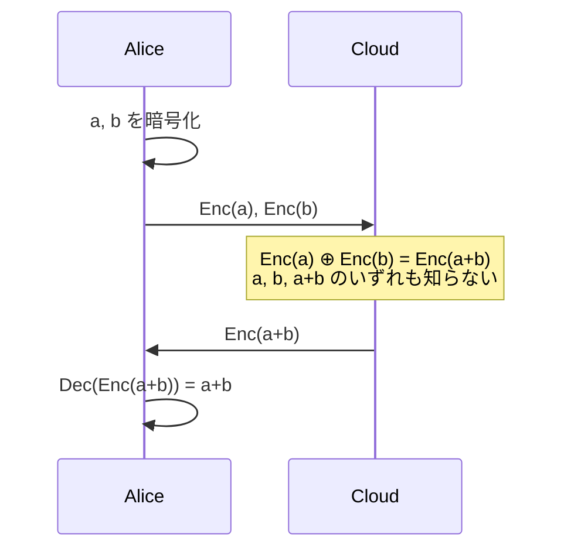
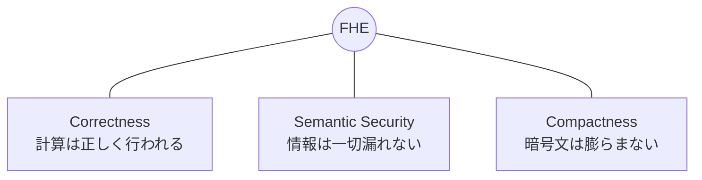

**日付**: 2026年4月24日
**学習内容**: 本記事は「**完全準同型暗号（Fully Homomorphic Encryption, FHE）**」入門シリーズの第1回である。FHEとは、**暗号化したデータを復号せずに計算し、その結果を暗号化したまま返す**という、一見不可能な技術である。1978年に Rivest・Adleman・Dertouzos が「**プライバシー準同型（privacy homomorphism）**」として問題を提起してから30年以上、未解決問題だった。2009年に Craig Gentry が解決して以来、世界は急速にFHEの実用化へ向かっている。本記事ではまず「なぜ暗号化したまま計算したいのか」という動機、**準同型（homomorphism）という代数的概念**、そしてFHEを支える3つの性質を押さえる。数式はほぼ使わず、まずは「気持ち」をつかむことに集中する。

## 0. 本記事の位置づけ

この15記事シリーズの目的は、「**FHE = 暗号化したまま計算できる魔法**」という漠然としたイメージを、**LWE問題・格子暗号・ブートストラッピング**という具体的な仕組みのレベルで理解できる状態に引き上げることだ。

一足飛びに **Ring-LWE** や **モジュラス切り替え** の話に入っても、なぜそんなことをするのかが掴めないままになる。そこで本記事では、**数式をほぼ使わず、FHEの「気持ち」を直感でつかむ**ことに集中する。

本記事の構成:

- **第1〜2章**: なぜ暗号化したまま計算したいのか、古典的暗号の限界
- **第3章**: 「準同型」という代数の概念
- **第4〜5章**: FHEの3つの性質と、ZKPとの対比
- **第6〜7章**: 歴史と応用の俯瞰
- **第8〜9章**: Q&Aとまとめ

## 1. クラウド時代の根本的ジレンマ

### 1.1 「預けると読まれる」という当たり前

スマートフォンの写真はiCloudに、メールはGmailに、病院のカルテは電子カルテサーバに、保険の契約は保険会社のDBに預けている。これらは **「預ける」こと自体が前提のサービス**だ。

ここでよく考えると、妙なことに気づく。**預けた先は、そのデータを平文で読めてしまう**。もちろん通信路は TLS で暗号化され、ディスクは AES で暗号化されているが、**サーバが計算するときは必ず復号されている**。

- Google が Gmail の内容を広告のために解析する
- 保険会社が契約者の病歴データベースを分析する
- 銀行のAIモデルが顧客の口座残高を学習に使う

これらは **「平文にアクセスできる」前提で動いている**。データ主権・プライバシー・規制（GDPR・個人情報保護法・HIPAA）の観点で、これは本質的に脆い。

### 1.2 従来の暗号の限界

現代暗号は主に次の2つの機能を提供してきた:

- **機密性（Confidentiality）**: TLS、AES、RSA
- **完全性・認証（Integrity / Authentication）**: MAC、署名

しかしどちらも、**「誰かが計算するときは必ず復号する」**ことが前提。言い換えれば:

> **「保管と通信は暗号で守れる。しかし計算は守れない」**

これが2008年までの現代暗号の限界だった。

### 1.3 発想の転換 — 「暗号化したまま」の計算

もし次のようなことが可能だったら、世界はどう変わるだろうか。

> **クラウドに暗号化したデータを預けるだけでなく、クラウドに「復号せずに計算してくれ」と頼める**

たとえば:

- 病院が患者のゲノム情報を暗号化したままクラウドに置き、**復号せずに疾患リスクをAIで予測**させる
- 保険会社が複数の会員の健康データを暗号化したまま集計し、**生データは一度も見ずにリスク係数を算出**する
- 銀行が顧客の取引履歴を暗号化したままクラウドで機械学習し、**モデルだけを受け取って不正検知に使う**

これを可能にする技術が **完全準同型暗号（FHE）** である。

## 2. 暗号化したまま計算する — 具体的イメージ

### 2.1 「暗号の中でも足し算ができる」

たとえば、暗号化関数を $\text{Enc}$、復号関数を $\text{Dec}$ とする。FHEではこんな性質が成り立つ:

$$
\text{Dec}(\text{Enc}(a) \oplus \text{Enc}(b)) = a + b
$$

ここで $\oplus$ は暗号文の上で定義された特別な演算（暗号文+暗号文を計算して新しい暗号文を返す）だ。

直感的には:

- Alice は $a$ と $b$ を暗号化して Cloud に送る
- Cloud は暗号文 $\text{Enc}(a)$ と $\text{Enc}(b)$ を足して $\text{Enc}(a+b)$ を作る
- Cloud は $a, b, a+b$ のいずれも知らない（見えるのは乱数のような暗号文だけ）
- Alice は返ってきた暗号文を復号して $a+b$ を得る

### 2.2 「掛け算もできる」「関数全般ができる」

もし **加算と乗算** の両方を暗号化したまま実行できれば、**任意の計算** が理屈上できる（有限体上の任意の関数は加算と乗算の組み合わせで書ける）。これが **Fully（完全）** の意味。

- **PHE（部分準同型）**: 加算のみ、または乗算のみ（例: Paillier暗号、ElGamal暗号）
- **SHE（一部準同型）**: 加算と乗算だが、回数に制限あり
- **LHE（レベル準同型）**: 事前に決めた回数の演算だけ実行できる
- **FHE（完全準同型）**: 回数無制限の加算・乗算 → **任意の関数**

次の記事（Article 2）で、この分類を詳しく見る。

### 2.3 身近な例: 秘匿ゲノム解析

FHE の典型的な応用例を挙げよう。

> 患者が自分のゲノムデータ（30億塩基）を暗号化して研究機関に送る。研究機関は暗号化されたまま「このゲノムに特定の疾患リスクがあるか」を判定するAIモデルを実行し、**暗号化された判定結果**を返す。患者は自分の鍵で復号して「リスク高」「リスク低」を知る。

この過程で、**研究機関はゲノムデータを一度も見ていない**。それでいて、ゲノムデータに対するAI推論が正しく実行されている。これがFHEの威力だ。

## 3. 「準同型」とは何か — 代数的視点

### 3.1 集合間の構造保存写像

暗号学の「準同型」は、代数から来ている。代数における準同型（homomorphism）とは:

> **演算を保つ写像**

つまり、2つの代数構造 $(A, +_A)$ と $(B, +_B)$ があって、写像 $f: A \to B$ が

$$
f(a_1 +_A a_2) = f(a_1) +_B f(a_2)
$$

を満たすとき、$f$ は **(加法)準同型写像** と呼ばれる。

たとえば:
- **指数関数**: $\exp(a + b) = \exp(a) \cdot \exp(b)$ → 加法群から乗法群への準同型
- **対数関数**: $\log(a \cdot b) = \log(a) + \log(b)$ → 乗法群から加法群への準同型

### 3.2 暗号における準同型

暗号化関数 $\text{Enc}$ を写像 $f$ と見たとき、もし:

$$
\text{Enc}(a + b) = \text{Enc}(a) \oplus \text{Enc}(b)
$$

が成り立てば、$\text{Enc}$ は **加法準同型暗号** と呼ばれる。ここで左辺の $+$ は **平文空間** での加算、右辺の $\oplus$ は **暗号文空間** での加算に相当する演算。

乗法についても同様:

$$
\text{Enc}(a \cdot b) = \text{Enc}(a) \otimes \text{Enc}(b)
$$

**加算と乗算の両方** について準同型なら、有限体の任意の多項式が暗号文空間で計算できる → **完全準同型**。

### 3.3 既存の準同型暗号の例

実は、準同型暗号そのものは古くから存在する。

| 暗号 | 準同型演算 | 発表年 |
|---|---|---|
| RSA | 乗算（$\text{Enc}(a) \cdot \text{Enc}(b) = \text{Enc}(a \cdot b)$） | 1977 |
| ElGamal | 乗算 | 1985 |
| Paillier | 加算 | 1999 |
| Goldwasser-Micali | XOR（1ビット加算） | 1982 |

しかし **これらはすべて PHE**（加算 or 乗算の片方のみ）。**加算と乗算の両方を無制限に** できるスキームは、2009年の Gentry まで存在しなかった。

## 4. FHEが満たすべき3つの性質

FHEが「FHE」と呼べるためには、次の3つの性質を同時に満たす必要がある:

### 4.1 正当性（Correctness）

**どんな暗号文の組み合わせで計算しても、復号すれば平文の計算結果が得られる**

$$
\text{Dec}(\text{Eval}(f, \text{Enc}(a_1), \ldots, \text{Enc}(a_n))) = f(a_1, \ldots, a_n)
$$

ここで $\text{Eval}$ は「暗号化されたデータに関数 $f$ を適用する」操作。

### 4.2 意味的安全性（Semantic Security, IND-CPA）

**暗号文を見ても、元の平文について何一つ情報が漏れない**

より形式的には、攻撃者が任意に選んだ2つの平文 $m_0, m_1$ に対応する暗号文 $\text{Enc}(m_0), \text{Enc}(m_1)$ を区別できない（識別不可能性）。

### 4.3 コンパクト性（Compactness）

**暗号文のサイズが、関数 $f$ の計算コストに依存して無制限に膨らまない**

これがないと、「計算するたびに暗号文が100倍になる」スキームも「FHE」と呼べてしまうが、それでは実用性がない。関数 $f$ の入力サイズ $n$ と秘密鍵のサイズだけに依存する多項式サイズに抑えられねばならない。

### 4.4 3つのバランス

この3つを同時に満たすのが難しい。特にコンパクト性が曲者で、**ノイズ管理** や **ブートストラッピング** という仕組みが必要になる（Article 9, 10で扱う）。

## 5. ZKPとFHEの対比

このシリーズと姉妹シリーズである ZKP を比較すると、両者の違いが鮮明になる。

| 観点 | ZKP | FHE |
|---|---|---|
| **目的** | 事実の真偽を漏らさず証明 | データを漏らさず計算 |
| **秘密は誰のものか** | Prover（証明者）が持つ | User（クライアント）が持つ |
| **計算はどこで** | Prover | サーバ（Cloud） |
| **出力** | 証明（小さい） | 暗号化された結果 |
| **検証者の負担** | 軽い | 計算自体は重いが、結果を復号するだけ |
| **代表スキーム** | Groth16、PLONK、STARK | BGV、BFV、CKKS、TFHE |

どちらも **「情報を漏らさず何かを達成する」** 暗号技術だが、達成したいものが違う。

- **ZKP**: 「私は18歳以上だ」を生年月日を見せずに証明する
- **FHE**: 「私の年齢に10を足すと」という計算を、年齢を見せずに実行してもらう

実用では両者を **組み合わせる** ことも多い。たとえば「FHEで暗号化された計算結果が正しいことを、ZKPで証明する」といった使い方（**verifiable FHE**）。

## 6. FHEの歴史 — 30年の未解決問題

### 6.1 1978年の問題提起

FHEの起源は、RSA暗号の論文が発表された翌年の1978年。RSAの発明者の1人 Ronald Rivest と、Len Adleman、Michael Dertouzos が発表した論文:

> **Rivest, Adleman, Dertouzos (1978).** *On Data Banks and Privacy Homomorphisms.*

この論文で彼らは、次のような「銀行の暗号計算」を夢想した:

> 銀行は顧客の残高を暗号化した状態で預かり、**復号せずに**送金・残高計算・利息計算を行いたい。残高データが盗まれてもそれは暗号文なので問題ない。

彼らはこれを **privacy homomorphism** と呼び、「大きな演算セットを持つ安全な準同型暗号が存在するかは未解決」と書いた。

### 6.2 30年間の暗中模索

1978年の問題提起から、解決まで **31年** かかった。その間:

- RSA, ElGamal, Paillier などの PHE は順次発見された
- しかし **加算と乗算の両方を持つ** スキームは発見されなかった
- 多くの研究者が「FHEは存在しないのでは」と疑っていた

### 6.3 2009年のブレークスルー — Gentryの博士論文

2009年、スタンフォード大学の博士課程学生 **Craig Gentry** が、IBMのインターン中に革命的な論文を発表した:

> **Gentry (2009).** *Fully Homomorphic Encryption Using Ideal Lattices.* STOC 2009.

Gentryのアイデアは2段構成:

1. **限定的（somewhat）なFHE** を格子暗号（ideal lattice）で構築
2. そのスキーム自身の**復号回路を暗号化された状態で実行**することで、ノイズが溜まった暗号文を「リフレッシュ」する仕組み（**bootstrapping**）を考案

この **bootstrapping** が決定打だった。Article 10 で詳しく見る。

### 6.4 第2世代・第3世代・第4世代

Gentry以降、FHE は急速に進化した:

| 世代 | 代表スキーム | 年 | 特徴 |
|---|---|---|---|
| 第1世代 | Gentry09 | 2009 | Ideal lattice、遅い |
| 第2世代 | BGV, BFV | 2011-2012 | (R)LWE ベース、バッチング |
| 第3世代 | GSW | 2013 | 非対称ノイズ、シンプル |
| 第4世代 | CKKS, TFHE, FHEW | 2016-2017 | 実用速度、特定用途最適化 |

2020年代に入ると、`1 bootstrap / 10ms` オーダーの TFHE が登場し、**実用段階** に入った。Articles 11〜13 で各世代を深掘りする。

### 6.5 標準化と実装

- **HomomorphicEncryption.org**: IBM・Microsoft・Duality の研究者が主導するコミュニティ標準
- **ISO/IEC 18033-8**: FHEの国際標準化が進行中
- **OSS ライブラリ**: Microsoft SEAL、OpenFHE、HElib、TFHE-rs、Concrete、Lattigo など

Article 14 で実装を扱う。

## 7. FHEは何に使われるのか — 応用の俯瞰

詳細は Article 3 で扱うが、ここで主な応用領域を俯瞰しておく。

### 7.1 プライバシー保護機械学習（PPML）

**暗号化されたデータにそのままAIモデルを推論させる**。医療画像・ゲノム・金融モデルなど、「データを第三者に渡したくないが計算は頼みたい」ケースで威力を発揮する。

### 7.2 秘匿データベース検索（PIR）

**自分が何を検索したかをサーバに知らせずに、DBから該当データを取得する**。Google検索に「私はこの病気について調べている」と知らせたくない、などの場面。

### 7.3 クロス機関での安全な集計

**複数の病院・銀行・保険会社が、互いに生データを見せずに統計・モデルを共有**できる。FHEは生データを漏らさないので、HIPAA・GDPRに準拠した分析が可能。

### 7.4 ブロックチェーンのプライバシー保護

**スマートコントラクトの状態や計算を暗号化したまま実行**する。ZKPが「計算結果の正当性」を保証するのに対し、FHEは「計算過程でのデータ隠蔽」を保証する。Zama や Inco のような FHE blockchain が近年登場している。

### 7.5 電子投票・オークション

**誰が何に投票したかを誰にも知られず、集計結果だけが公開される**。FHEベースの e-voting は理論的には理想に最も近い。

## 8. Q&A: よくある疑問

### Q1: FHEとZKPは何が違うのか？

**目的が違う**:
- ZKP: 「事実が真であること」だけを漏らさず伝える
- FHE: 「データを暗号化したまま計算する」

ZKPでは計算は Prover がやって「証明」を出す。FHEでは計算自体を第三者がやる。

### Q2: FHEがあればTLSも不要では？

**不要ではない**。FHEは **計算時** のプライバシーを守るが、通信路の認証・完全性はTLSが担う。両者は補完関係。

### Q3: なぜFHEは遅いのか？

**暗号文が巨大で、1演算に多数の多項式演算が必要**だから。平文1ビットを暗号化すると、暗号文は数KB〜数MBになる。平文の加算は「整数の加算」だが、暗号文の加算は「巨大な多項式同士の加算 mod 大きな素数」になる。Article 8, 9 で詳しく扱う。

### Q4: FHEは量子コンピュータでも破れないのか？

**現時点で破られない**と予想されている。主流のFHE（BGV/BFV/CKKS/TFHE）はすべて **格子問題** をベースにしており、量子計算機でも効率的な解法が知られていない。したがって **ポスト量子暗号（PQC）** としても位置づけられている。

### Q5: いつから実用化されているのか？

**2020年以降、段階的に実用化が進んでいる**。

- Microsoft Edge がパスワード侵害チェックに PIR（一部FHE要素）
- Meta が広告効果測定で Private Lift を使用
- Duality / Zama / Inco が企業向け SaaS を提供
- 金融・医療の実証実験が多数進行中

ただし「汎用的に任意の計算を高速で」はまだ研究フェーズ。

### Q6: 「完全」準同型と「部分」準同型の違いは？

- **部分（Partially）準同型**: 加算 or 乗算の片方のみ。または回数に制限あり
- **完全（Fully）準同型**: 加算と乗算の両方を任意回数。つまり **任意の関数** が計算できる

次の記事 (Article 2) でこの分類を厳密に定義する。

## 9. まとめ

### 本記事で学んだこと

- **FHE（完全準同型暗号）** は、**暗号化したまま加算と乗算を任意回数行える**暗号スキーム。これにより**任意の関数**を暗号文空間で計算できる
- 1978年に Rivest・Adleman・Dertouzos が問題提起し、**31年間未解決**だった
- 2009年に **Craig Gentry** が初めて解決。鍵は **bootstrapping**（暗号文自身の復号回路を暗号化したまま実行）
- FHEは **正当性・意味的安全性・コンパクト性** の3つの性質を同時に満たす必要がある
- ZKP は「事実の真偽を漏らさず伝える」、FHE は「データを漏らさず計算する」。目的が異なる
- 主な応用: **PPML・秘匿DB検索・クロス機関集計・FHEブロックチェーン・e-voting**

### 次の記事（Article 2）へ

次の記事では、準同型暗号を **PHE / SHE / LHE / FHE** の4階層で厳密に分類する。RSAやPaillierがなぜ **P**HE に留まるのか、そして Gentry が越えた「SHE と FHE の壁」が何だったのかを具体的に見ていく。

### 3行サマリ

- **FHE = 暗号化したまま任意の計算ができる**。1978年問題提起、2009年 Gentry が初解決
- 鍵は **bootstrapping**（暗号文のノイズをリフレッシュする仕組み）
- 応用: **医療・金融・ML・ブロックチェーン** など、データ主権とクラウド計算を両立したい場面全般

---

## 参考文献

- Rivest, Adleman, Dertouzos. *On Data Banks and Privacy Homomorphisms.* 1978.
- Craig Gentry. *Fully Homomorphic Encryption Using Ideal Lattices.* STOC 2009.
- Shai Halevi. *Homomorphic Encryption.* IBM Research, 2017. [https://shaih.github.io/pubs/he-chapter.pdf](https://shaih.github.io/pubs/he-chapter.pdf)
- Jeremy Kun. *A High-Level Technical Overview of Fully Homomorphic Encryption.* 2024. [https://www.jeremykun.com/2024/05/04/fhe-overview/](https://www.jeremykun.com/2024/05/04/fhe-overview/)
- FHE.org. *History of FHE.* [https://fhe.org/history/](https://fhe.org/history/)
