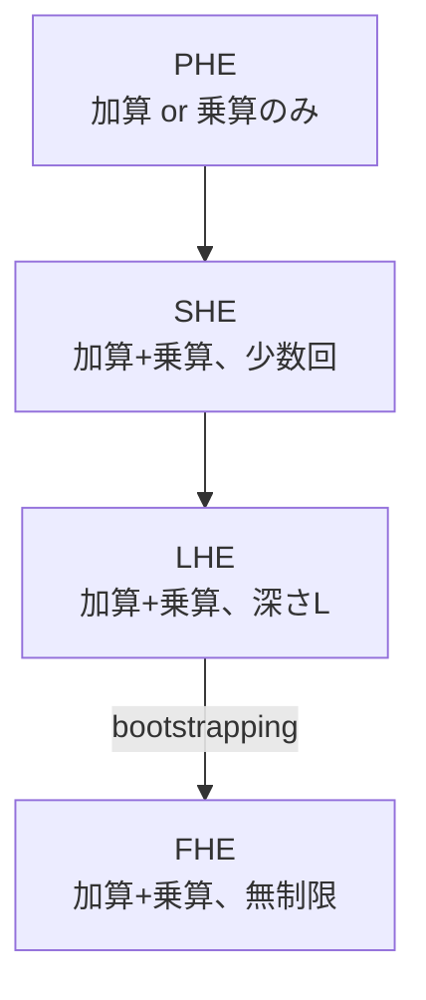
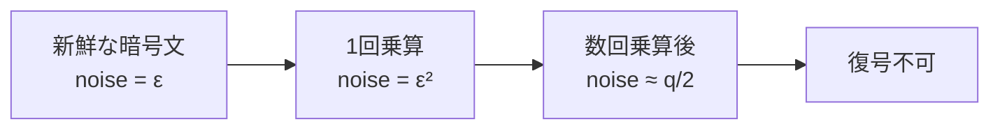
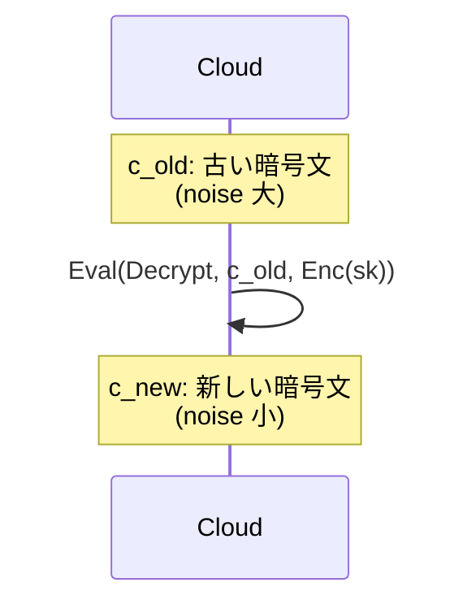

**日付**: 2026年4月24日
**学習内容**: Article 1 で「FHE = 暗号化したまま任意の計算ができる」という全体像を掴んだ。本記事ではその「任意の計算」が何を意味するのかを厳密にし、**PHE（Partially HE）→ SHE（Somewhat HE）→ LHE（Leveled HE）→ FHE（Fully HE）** という4階層を定義する。RSA や ElGamal、Paillier といった実在する準同型暗号がそれぞれどこに位置し、なぜ **完全に** なれないのか。そして、SHE と FHE を分ける「**ノイズ** と **ブートストラッピング**」という壁が何なのかを明確にする。数式はやや増えるが、Article 4以降の数学の舞台を理解する前提となる。

## 0. 本記事の位置づけ

Article 1 では「FHEは暗号化したまま計算できる魔法」という直感を得た。しかし実は、**一部の計算だけ** できる暗号は古くから存在する（RSAやPaillier）。にもかかわらず **完全** な準同型暗号が2009年まで存在しなかったのはなぜか？

その答えを理解するには、準同型暗号を **できる演算の種類と回数** で階層化する必要がある。本記事の構成:

- **第1章**: 準同型暗号を4階層で分類
- **第2章**: PHE の実例（RSA・ElGamal・Paillier・GM）
- **第3章**: SHE と「ノイズ」の問題
- **第4章**: LHE と「レベル」という概念
- **第5章**: FHE と bootstrapping の位置づけ
- **第6章**: 比較表と演算コスト
- **第7章**: Q&A とまとめ

## 1. 準同型暗号の4階層

### 1.1 階層の基準

準同型暗号は、**どんな演算を、何回実行できるか** で分類される:

| 階層 | できる演算 | 演算回数 | 任意関数 |
|---|---|---|---|
| **PHE** (Partially) | 加算 **or** 乗算のみ | 無制限 | できない |
| **SHE** (Somewhat) | 加算 **and** 乗算 | 限定的（数回〜数十回） | 低次多項式のみ |
| **LHE** (Leveled) | 加算 and 乗算 | 事前設定した**深さ $L$** まで | 深さ $L$ 以下の関数 |
| **FHE** (Fully) | 加算 and 乗算 | **無制限** | **任意** |

### 1.2 「任意関数」の意味

**任意の関数** を計算できる、とはどういうことか。

任意の多変数関数 $f: \{0,1\}^n \to \{0,1\}$ は、**NANDゲートの組み合わせ**で表現できる。NANDは $\text{NAND}(a, b) = 1 - ab$ と書けるので、**加算（mod 2）と乗算（mod 2）** があれば NAND が作れる。

つまり:

> **加算と乗算が無制限にできる = 任意の関数が計算できる**

これが **Fully** の本質。

### 1.3 階層の関係

**下に行くほど強力**。特に LHE → FHE への飛躍が **bootstrapping** という仕組みで実現される（Article 10で詳説）。

## 2. PHE — 部分準同型暗号の実例

PHE は「加算のみ」または「乗算のみ」の準同型を持つ。実はこれらは **既に実用で広く使われている**。

### 2.1 RSA — 乗法準同型

公開鍵 $(N, e)$ で暗号化:

$$
\text{Enc}(m) = m^e \mod N
$$

2つの暗号文を掛けると:

$$
\text{Enc}(m_1) \cdot \text{Enc}(m_2) = m_1^e \cdot m_2^e = (m_1 m_2)^e = \text{Enc}(m_1 m_2) \mod N
$$

したがって **乗算** について準同型。ただし加算は不可能（$m_1^e + m_2^e \neq (m_1 + m_2)^e$）。

### 2.2 ElGamal — 乗法準同型

ElGamal も同様に乗法準同型。暗号文は $(c_1, c_2) = (g^r, m \cdot h^r)$ で、2つの暗号文 $(c_1, c_2), (c_1', c_2')$ を:

$$
(c_1 \cdot c_1',\ c_2 \cdot c_2') = (g^{r+r'},\ (m m') h^{r+r'}) = \text{Enc}(m m')
$$

これで $m m'$ の暗号文が得られる。

### 2.3 Paillier — 加法準同型

Paillier 暗号は、現代で最も使われている **加法** PHE。公開鍵 $(N, g)$ で:

$$
\text{Enc}(m) = g^m \cdot r^N \mod N^2
$$

2つの暗号文を **掛ける** と、平文の **和** の暗号文になる:

$$
\text{Enc}(m_1) \cdot \text{Enc}(m_2) = g^{m_1 + m_2} \cdot (r_1 r_2)^N = \text{Enc}(m_1 + m_2) \mod N^2
$$

「暗号文の掛け算」が「平文の足し算」になるという指数・対数的な関係（ElGamal乗法準同型を加法側に反転させた構造）。**電子投票** や **秘匿集計** で広く使われる。

### 2.4 Goldwasser-Micali — XOR準同型

最古のPHEの一つ。**1ビット暗号化**で、暗号文の積が平文の XOR になる（mod 2 の加算）。

### 2.5 なぜ PHE で止まるのか

これらはすべて **片方の演算にしか対応できない**。RSAで足し算をしようとすると、$m_1^e + m_2^e$ の形になり、どうやっても $(m_1 + m_2)^e$ には等しくならない。

**両方できない = 任意の関数を作れない**。ここが越えられない壁だった。

## 3. SHE — 一部準同型暗号と「ノイズ」

### 3.1 SHE の定義

**SHE（Somewhat Homomorphic Encryption）** は、加算と乗算の **両方** を限定的に許す方式。Gentry09 の第1段階もSHE。

限定的とは:
- **低次多項式のみ**（たとえば次数2〜3くらい）
- **決まった回数以上の乗算**をすると復号できなくなる

### 3.2 なぜ回数制限があるのか — ノイズの蓄積

現代のFHEスキーム（BGV/BFV/CKKS/TFHE）は、格子暗号（LWE/RLWE）をベースにしている。これらの暗号文には **わざと小さなノイズ（誤差）** が乗せられている:

$$
\text{Ciphertext} \approx m + (\text{small noise})
$$

このノイズは **安全性のため** に必要（ノイズがないと方程式として解かれてしまう）。しかし:

- **加算**: ノイズは足し算的に増える（線形）
- **乗算**: ノイズは掛け算的に増える（指数的）

乗算を数回繰り返すと、ノイズが **平文と見分けられなくなる** レベルに達し、復号できなくなる。

これが SHE の本質的な制約。**「計算すればするほどノイズが増え、いずれ破綻する」**

### 3.3 SHE の例

Gentry09 の「第1段階」の SHE は次のような形:

- 平文 $m \in \{0, 1\}$
- 暗号文 $c = m + 2 \cdot (\text{noise}) + p \cdot q$（$p$ は秘密鍵、$q$ は公開乱数）
- 加算: $c_1 + c_2$
- 乗算: $c_1 \cdot c_2$
- 復号: $c \mod p \mod 2$

加算と乗算を数回までなら正しく動く。しかし何度もやるとノイズがあふれる。

## 4. LHE — レベル準同型暗号

### 4.1 LHE の考え方

**LHE（Leveled HE）** は、事前に「**最大深さ $L$**」を設定し、その範囲内での計算は保証する方式。

- 最大 $L$ 回の乗算を想定したパラメータを選ぶ
- $L$ 回以内の乗算（と任意回の加算）は正しく動く
- $L$ を超える計算は想定外

### 4.2 具体例: 深さ 3 の LHE

たとえば $L = 3$ に設定すると、次のような関数は計算できる:

$$
f(x, y, z) = x \cdot y \cdot z + x + y \quad (\text{乗算深さ } 2)
$$

しかし乗算深さ 4 の関数 $(x_1 x_2)(x_3 x_4)(x_5 x_6)(x_7 x_8)$ は計算できない。

### 4.3 なぜ LHE が重要か

LHE は **実用上 FHE に代わる** ケースが多い。

- **PPML**: ニューラルネットワークの **乗算深さは有限**（たとえば10層のCNNなら深さ30くらい）。LHE で十分
- **秘匿集計**: 加算が主、乗算は少数回
- **評価は事前に固定**: バッチジョブなら深さを見積もれる

LHE は **bootstrapping を避けて** 高速化できる。実際、Microsoft SEAL や OpenFHE の多くのアプリは LHE モードで動く。

### 4.4 パラメータのトレードオフ

$L$ を大きくすると:

- **メリット**: 深い計算が可能
- **デメリット**: モジュラス $q$ を大きくする必要 → 暗号文サイズ・計算時間が増える

典型的には:
- $L = 5$: 軽量（実用向け）
- $L = 15$: 中程度
- $L = 30$: 重い（深いNNなど）
- $L = \infty$: FHE（bootstrapping必要）

## 5. FHE — bootstrapping による無制限化

### 5.1 SHE から FHE への飛躍

SHE は限定回数、LHE は事前設定の深さまで。では **無制限** にするにはどうするか。

Gentry の天才的アイデア:

> **ノイズが増えてきた暗号文を、暗号化された状態のまま「復号してから再暗号化」することで、新鮮な暗号文にリセットする**

この操作が **bootstrapping**。

### 5.2 Bootstrapping のイメージ

通常の復号は:

$$
\text{Dec}(c, sk) = m
$$

で、$sk$ は秘密鍵。**復号アルゴリズム自体**を関数 $D(c, sk)$ とみなし、この関数を **FHEで評価** する。

1. $sk$ を暗号化したもの $\text{Enc}(sk)$ を公開鍵と一緒に配布しておく（**評価鍵**）
2. ノイズが溜まった暗号文 $c$ に対し、$\text{Eval}(D, c, \text{Enc}(sk))$ を実行
3. 結果は **$m$ の新しい暗号文**（かつノイズが小さい！）

これにより **ノイズがリセット** される。以後、さらに計算を重ねられる → **任意の回数の計算が可能**。

### 5.3 なぜ「暗号の中で暗号を復号」できるのか

復号回路 $D(c, sk)$ はそれ自体、加算と乗算の組み合わせで書ける関数。**SHE が評価できる深さ** より復号回路の深さが **浅ければ**、SHE がそれを評価できる。

この条件を **「復号回路が自分自身の評価能力より浅い」** と呼び、これを満たすスキームを **bootstrappable** と言う。

### 5.4 Bootstrapping のコスト

bootstrapping は **1回あたり数秒〜数ミリ秒** かかる。

- Gentry09: 数分〜数十分
- BGV (2011): 数秒
- TFHE (2016): **13ms**（1ゲートあたり）
- 近年: より高速化進行中

実用のFHEスキームは「どれだけ bootstrapping を速くできるか」で性能が決まる。

### 5.5 Bootstrapping は必須ではない

実は **すべての計算で bootstrapping が必要** というわけではない。

- 浅い計算しかしない → **LHE で十分、bootstrapping 不要**
- 深い計算が必要 → **bootstrapping が必要**

実用ではLHEを採用し、必要な場合だけ bootstrapping を挟む **hybrid** アプローチが一般的。

## 6. 比較表

### 6.1 4階層の比較

| 階層 | 加算 | 乗算 | 例 | ノイズ管理 | Bootstrap |
|---|---|---|---|---|---|
| PHE (加法) | 無制限 | × | Paillier, GM | 不要 | 不要 |
| PHE (乗法) | × | 無制限 | RSA, ElGamal | 不要 | 不要 |
| SHE | 少数回 | 少数回 | Gentry09 第1段階 | 手動 | 未 |
| LHE | 無制限 | 固定深さ $L$ | BFV/BGV (bootstrap無効時) | パラメータで吸収 | 不要 |
| FHE | 無制限 | 無制限 | Gentry09, BFV/BGV (bootstrap付), CKKS, TFHE | bootstrapping | **必要** |

### 6.2 PHE は実用で十分なケースも

注意: **FHE が常に必要なわけではない**。計算が「単純な集計」「単純なスカラー積」などに収まるなら、**PHE の方が遥かに速く安全**。

- **電子投票の票集計**: Paillier (加算のみ) で十分
- **秘匿オークション**: Paillier か 専用プロトコル
- **プライバシー保護統計**: Paillier + DP (Differential Privacy)

FHE はオーバーキルになりがち。「何を計算したいか」で選ぶ。

### 6.3 計算コストのオーダー

| 種類 | 暗号文サイズ | 加算 | 乗算 | 任意関数 |
|---|---|---|---|---|
| 平文 | 数バイト | ns | ns | OK |
| RSA | 数百バイト | — | μs | 乗算のみ |
| Paillier | 数KB | μs | — | 加算のみ |
| BFV | 数十KB〜数MB | ms | ms | OK (bootstrap付) |
| TFHE | 数KB/bit | μs | ms+bootstrap | OK |

FHE は平文計算より **1000〜100万倍遅い** のが現状（2026年時点）。

## 7. Q&A

### Q1: 「任意の関数」と言うが、具体的にどんな関数まで？

**多項式時間で表現可能なすべての関数**。つまり、通常のプログラムで書ける関数はすべて対象。ただし実用速度では深いNNは厳しい。

### Q2: PHE と FHE はどうやって選べばいい？

原則:
- 計算が **加算のみ** or **乗算のみ** → PHE
- 計算が **加算と乗算の両方** で、かつ **浅い** → LHE
- **深い計算**（任意関数）が必要 → FHE（bootstrapping付）

速度優先なら上ほど速い。

### Q3: SHE と LHE の違いがわかりにくい

**SHE**: 「**どのくらい計算できるか保証できない**」方式（動かしてみないとノイズが溢れるか不明）。

**LHE**: 「**事前に $L$ を決めて、その範囲内では正しく動くよう設計された**」方式。

実用では SHE はあまり単独で使わず、LHE か FHE。

### Q4: bootstrapping が遅いなら、なぜ FHE を目指すのか？

**理論的な表現力が全く違う**ため。LHE は「事前に深さを固定」する必要があるが、FHE は **動的に無制限** の計算ができる。長時間動くサービスや、分析内容が事前に決まらない場面で FHE でないと困る。

### Q5: RSA を工夫すれば加算もできるのでは？

**できない**。これは RSA の数学的性質（指数関数は乗算的）に由来する本質的な制約。加算を加えるには **異なる構造の暗号**（Paillier や 格子暗号）が必要。

### Q6: FHE を使えば ZKP は不要？

**不要にならない**。FHE は「計算するサーバから平文を隠す」ための技術だが、**計算が正しく行われたか** は保証しない。悪意あるサーバが嘘の結果を返しても、ユーザーは復号して「変な値」を受け取るだけ。

**正当性保証** が必要なら、FHE + ZKP の組み合わせ（**verifiable FHE**）が必要。

## 8. まとめ

### 本記事で学んだこと

- 準同型暗号は **PHE → SHE → LHE → FHE** の4階層で整理される
- **PHE**: RSA (乗法)、Paillier (加法) などは **片方の演算のみ** 無制限
- **SHE**: 加算+乗算の両方あるが **ノイズの蓄積** で数回まで
- **LHE**: 事前に深さ $L$ を固定し、その範囲で **bootstrapping なし** に動く。実用的
- **FHE**: **bootstrapping** によりノイズをリセットし、**無制限回数の計算** が可能
- 「任意関数」= 加算と乗算の組み合わせで書ける関数すべて → **加算と乗算が無制限 = 任意関数が計算可能**

### 次の記事（Article 3）へ

次の記事では、FHE の **応用俯瞰** を扱う。PPML・PIR・FHEブロックチェーン・秘匿オークションなど、どの領域で FHE が使われ、どの領域では PHE/ZKP の方が良いかの棲み分けを明確にする。

### 3行サマリ

- 準同型暗号は **PHE (片方だけ) → SHE (両方だが少数回) → LHE (事前深さ固定) → FHE (無制限)** の4階層
- FHE の鍵は **bootstrapping**: 暗号化されたままノイズをリセットする操作
- 「任意関数」を計算したいなら FHE、用途限定なら PHE や LHE の方が遥かに速い

---

## 参考文献

- Craig Gentry. *A Fully Homomorphic Encryption Scheme.* PhD Thesis, Stanford, 2009.
- Brakerski, Vaikuntanathan. *Efficient Fully Homomorphic Encryption from (Standard) LWE.* FOCS 2011.
- Pascal Paillier. *Public-Key Cryptosystems Based on Composite Degree Residuosity Classes.* EUROCRYPT 1999.
- Homomorphic Encryption Standardization Consortium. [https://homomorphicencryption.org/](https://homomorphicencryption.org/)
- Wikipedia. *Homomorphic Encryption.* [https://en.wikipedia.org/wiki/Homomorphic_encryption](https://en.wikipedia.org/wiki/Homomorphic_encryption)
