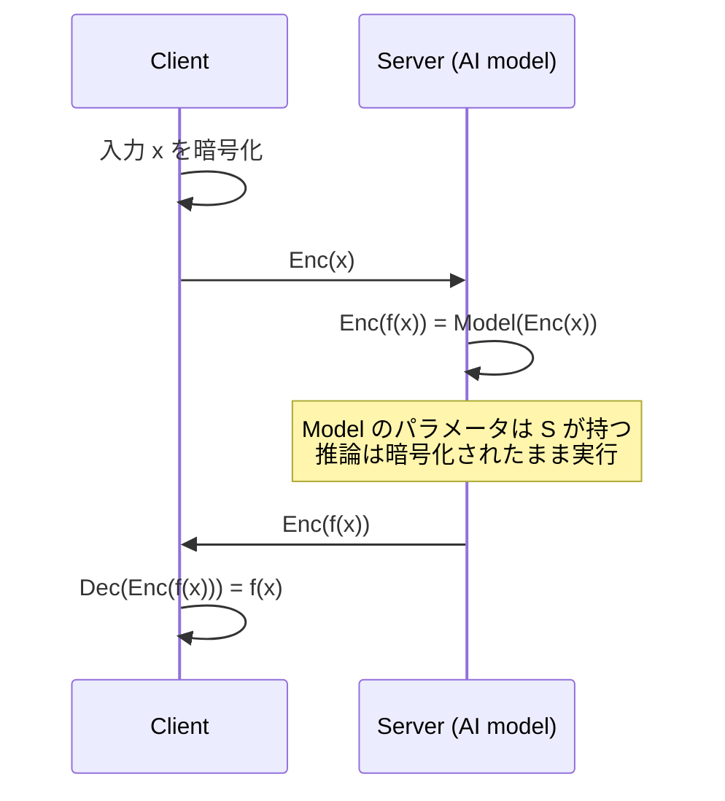

**日付**: 2026年4月24日
**学習内容**: Article 1〜2 で FHE の概念と4階層の分類を学んだ。本記事では **FHE が実際にどこで使われ、どこで使われないのか** を俯瞰する。具体的には **(1) プライバシー保護機械学習 (PPML)**、**(2) プライベート情報検索 (PIR)**、**(3) 秘匿ゲノム解析・医療**、**(4) 金融・保険・クロス機関分析**、**(5) FHE ブロックチェーン (Zama fhEVM, Inco, Fhenix)**、**(6) 電子投票・秘匿オークション**、**(7) 広告効果測定**、そして **(8) ZKP/MPC と FHE の棲み分け** を扱う。各ユースケースで「**どのスキームを使うか (PHE/LHE/FHE)**」と「**なぜ FHE が適しているか**」を明らかにする。Article 4 からは数学の中身に入るが、その前に「何のためにそれを学ぶのか」を押さえておく。

## 0. 本記事の位置づけ

Article 4 以降では格子・剰余環・LWE・ブートストラッピング...と急に難しい数学に入る。その前に「**何のために学ぶのか**」を押さえておくと、モチベーションが保てる。

本記事の構成:

- **第1章**: プライバシー保護機械学習 (PPML)
- **第2章**: プライベート情報検索 (PIR) と秘匿データベース
- **第3章**: ゲノム・医療・保険
- **第4章**: 金融・クロス機関集計
- **第5章**: FHE ブロックチェーン
- **第6章**: 電子投票・秘匿オークション・広告測定
- **第7章**: ZKP・MPC との比較と組み合わせ
- **第8章**: 成功例と失敗例
- **第9章**: Q&A とまとめ

## 1. プライバシー保護機械学習 (PPML)

### 1.1 問題設定

AI サービスを使うには、**推論したいデータを送る** 必要がある。しかし:

- 医療画像 → 診断AI（病院のデータを第三者に渡したくない）
- ゲノム → 疾患リスク予測（極めてプライベート）
- 顧客の購買履歴 → レコメンド（企業秘密）

データを送らずに推論してもらえないか？

### 1.2 FHE-PPML の構造



サーバは **モデルパラメータ** を持ち、クライアントは **入力** を暗号化して送る。サーバは復号せずに推論し、結果（も暗号化されたまま）返す。

### 1.3 対応スキーム

- **CKKS**: 実数演算に最適 → **画像分類・回帰**に最適
- **BFV/BGV**: 整数演算 → **決定木・ロジスティック回帰**
- **TFHE**: ビット演算に強い → **XOR/AND が多いNNの非線形層**

### 1.4 実例: Microsoft SEAL + CryptoNets

2016年 Microsoft の **CryptoNets** は CKKS 前身の FHE で MNIST 画像分類を実証（精度 98.95%、推論 300秒/画像）。2025年現在は **数秒/画像** まで高速化。

### 1.5 非線形活性化関数の壁

NN の活性化関数（ReLU、sigmoid）は **非多項式**。FHE は多項式しか計算できないので、**多項式近似** が必要:

$$
\text{ReLU}(x) \approx a_0 + a_1 x + a_2 x^2 + \cdots
$$

これが **精度と速度のトレードオフ** を生む。精度を上げると乗算深さ $L$ が増え、計算が重くなる。

代替案: **TFHE の programmable bootstrapping** で任意の1変数関数を bootstrap と同じコストで評価できる。近年これが注目されている。

## 2. プライベート情報検索 (PIR)

### 2.1 問題設定

> **ユーザが「インデックス $i$ のデータ」を DB に問い合わせるとき、DB 側に「どの $i$ を要求したか」を知られずに $D[i]$ を得たい**

例:
- **特許調査**: 「この技術領域の特許を調べている」ことを調査対象企業に知られたくない
- **疾患検索**: 「このHIV検査結果の意味を調べている」ことを医療DB運営に知られたくない
- **金融ニュース**: 「この銘柄の情報を調べている」ことを金融情報ベンダーに知られたくない

### 2.2 FHE による PIR

基本アイデア:

1. ユーザが「ベクトル $e_i = (0, 0, \ldots, 1, \ldots, 0)$（$i$ 番目だけ1）」を **FHE で暗号化** して送る
2. DB は $\sum_j \text{Enc}(e_i[j]) \cdot D[j] = \text{Enc}(D[i])$ を計算（暗号化された内積）
3. 結果を暗号文のまま返す

DB にとって見えるのは **乱数のような暗号文** だけ。どの $i$ を要求したか全く分からない。

### 2.3 実用化

Google・Apple などが **プライベートクエリ機能** を実装:
- **Safe Browsing (Apple/Google)**: 訪問URLを漏らさずマルウェア判定
- **Password Checkup (Microsoft Edge)**: パスワード漏洩チェック
- **SimplePIR (2022)**: FHEベースの効率的なPIR

Article 33 の PlinkoPIR もこの系統。

## 3. ゲノム・医療・保険

### 3.1 ゲノムの特殊性

ゲノムデータは:
- **極めて個人を特定する**（再識別リスク）
- **30億塩基 ≈ 大きすぎる**
- **一度漏れたら一生取り返せない**

研究機関に渡すのは躊躇われる。FHE で暗号化したまま研究に協力できたら理想。

### 3.2 FHE-ゲノム解析の例

- **iDASH Secure Genome Analysis Competition** (2014年〜): 毎年 FHE/MPC/Intel SGX で同じタスクを競う
- **疾患リスク予測 (GWAS)**: 暗号化されたゲノム上で統計解析
- **アレル頻度計算**: 秘匿したまま母集団の特徴を調べる

### 3.3 医療画像

Duality Technologies、Zama などが **暗号化された医療画像の AI 診断** を商用化。

### 3.4 保険でのユースケース

- **引受審査**: 契約希望者の健康情報を暗号化したまま判定
- **リスク算定**: 複数のデータソース（病院・薬局）を暗号化したまま組み合わせて保険料計算
- **DeIn のようなパラメトリック保険**: 原理的には、被保険者の物件情報を暗号化したまま支払い判定できる

## 4. 金融・クロス機関集計

### 4.1 クロス機関の課題

複数の銀行・保険会社が **共通の詐欺検知モデル** を作りたい。しかし:

- 顧客データを他社に渡せない（個人情報保護・競争上の機密）
- しかし各社単独ではデータ量が足りない

これを解決するのが **FHE-based 秘匿集計** や **Federated Learning + FHE**。

### 4.2 Meta の Private Lift Measurement

Facebook/Meta は **広告効果測定** に MPC+FHE ハイブリッドを実装:

- 広告主のコンバージョンデータと Facebook の露出データを突合
- **どちらも生データを相手に渡さずに** 広告効果を測定

### 4.3 金融犯罪対策

SWIFT や銀行間の **マネーロンダリング検知** で、各銀行の取引パターンを暗号化したまま集約する試みが進行中。

### 4.4 中央銀行デジタル通貨 (CBDC)

CBDC で「取引プライバシーと規制遵守の両立」が大きな課題。FHE で「普段は誰も見えないが、警察の裁判所命令で復号する」仕組みが検討されている。

## 5. FHE ブロックチェーン

### 5.1 問題設定

通常のブロックチェーンは **全トランザクションが公開**。DeFi・送金・投票など、プライバシーが必要な用途に向かない。

従来のアプローチ:
- **ZKP (Zcash, Tornado Cash)**: ゼロ知識で「誰が何を」を隠す
- **MPC**: マルチパーティ計算
- **TEE (Secret Network)**: Intel SGX などの信頼実行環境

FHE アプローチは:
- **暗号化された状態のコントラクト状態** を全ノードが保持
- **スマートコントラクトの実行も暗号化したまま**

### 5.2 Zama fhEVM

**Zama** は TFHE ベースの FHE で **EVM 互換** の仮想マシンを実装。Solidity で書かれたコントラクトの状態変数を暗号化したまま実行できる。

```solidity
// fhEVM の例（Solidity 拡張）
euint32 balance;  // 暗号化された32bit整数
balance = TFHE.add(balance, amount);  // 暗号化加算
```

### 5.3 Inco・Fhenix

- **Inco Network**: L1 で FHE 実行環境を提供
- **Fhenix**: Ethereum L2 として FHE を提供

### 5.4 DeIn への示唆

DeIn のような **分散型地震保険** で FHE を検討する場合:

- 被保険者の物件住所を暗号化したまま、地震発生時の支払い判定
- 複数保険者間でリスク分散しつつ、契約者情報を漏らさない
- ZKP で「支払い条件を満たす」を証明し、FHE で「具体的な住所」を隠す組み合わせも

ただし、FHE のオンチェーン計算は **極めてガス代が高い**。DeIn のような実用プロトコルでは ZKP の方がコスト効率が良い可能性が高い。

## 6. 電子投票・秘匿オークション・広告測定

### 6.1 電子投票

FHE-based e-voting の理想:

1. 各投票者が票を暗号化して投稿
2. 集計サーバが暗号化されたまま集計（単純な加算）
3. 最後に **集計結果のみ** を復号
4. 誰が誰に投票したかは **誰にも分からない**

実用化は限定的だが、**Helios Voting** など研究段階で実装あり。本格的な選挙には未だ使われない（耐改ざん性・検証可能性の要件が厳しい）。

### 6.2 秘匿オークション

オークションで「**入札額を伏せたまま最高入札者を決定**」する仕組み。FHE の比較演算で実現。TFHE が得意。

### 6.3 広告効果測定

Meta の Private Lift、Google の Privacy Sandbox など、**ユーザーを追跡せずに広告効果を測定** する仕組みで FHE 利用が進んでいる。

## 7. ZKP・MPC との比較と組み合わせ

### 7.1 3つの技術の役割分担

| 技術 | 守るもの | 苦手なこと |
|---|---|---|
| **ZKP** | 計算の正当性を漏らさず証明 | データを計算中に隠す |
| **FHE** | 計算中のデータを隠す | 計算が正しい保証 |
| **MPC** | 複数者間の入力を分散的に隠す | 単一計算者では使えない |

### 7.2 組み合わせ

**Verifiable FHE** (FHE + ZKP):
- FHE で秘匿計算
- 結果にZKPを付けて「正しく計算した」と証明
- クライアントは復号せずに結果の正当性を確認

**Threshold FHE** (FHE + MPC):
- 秘密鍵を複数者で分散保持
- 単一者では復号不可能
- 過半数の合意で復号

**ZK-rollup + FHE**:
- ZK rollup でスケーリング
- FHE でステートを秘匿

## 8. 成功例と失敗例

### 8.1 成功例

- **Microsoft Edge の Password Checkup**: PIRで侵害パスワードチェック
- **Meta の Private Lift**: 広告効果測定
- **Duality の Medical Analytics**: 医療データの暗号化解析
- **Zama の fhEVM**: FHEベースのスマートコントラクト

### 8.2 失敗・限界の例

- **汎用FHE機械学習**: 深いNN はまだ現実的ではない（推論に数分〜数時間）
- **FHE ブロックチェーンの汎用化**: ガス代が高すぎて、単純な送金でも $10〜$100 規模
- **量子安全性への過剰期待**: 「FHE = ポスト量子」は正しいが、それだけで量子対策になるわけではない（署名・KEM も必要）

### 8.3 採用決定の基準

FHE を採用すべきか判断する基準:

1. **計算が単純 (加算のみ or 乗算のみ)** → PHE (Paillier/ElGamal) で十分
2. **計算が複雑だが固定** → LHE (BGV/BFV)
3. **計算が動的で深い、任意関数** → FHE (CKKS/TFHE)
4. **正当性も重要** → FHE + ZKP
5. **複数者が入力** → MPC か Threshold FHE

## 9. Q&A

### Q1: FHEは本当に実用段階に入ったのか？

**部分的に実用化されている**。Microsoft、Google、Meta、Apple がプロダクションで使うケースがある。ただし「任意計算の高速実行」はまだ研究段階。

### Q2: FHE を使うとクラウドは不要になる？

**逆に重要になる**。FHE 計算は極めて重いので、**暗号化前より多くの計算資源** を必要とする。「クラウドに計算を丸投げするが、データは漏らさない」ユースケースでこそ FHE は価値を発揮する。

### Q3: FHE より簡単なプライバシー技術は？

状況による:
- **データを暗号化せずにサーバに置く** + アクセス制御
- **Differential Privacy**: 統計結果にノイズを乗せて個人を特定されなくする
- **Federated Learning**: データを各端末に置いたまま協調学習
- **TEE (Intel SGX, AMD SEV)**: ハードウェア信頼実行環境

FHE は「**サーバを全く信頼しない**」場合の最後の砦。

### Q4: PPML で FHE と Federated Learning はどう違う？

- **Federated Learning**: データは各端末に置き、**勾配のみ** を中央サーバに送る。サーバは勾配から推測する余地あり
- **FHE-PPML**: データを **暗号化して中央サーバに送る**。サーバは何も推測できない

セキュリティは FHE > FL、計算コストは FL < FHE。

### Q5: FHE を使えば GDPR の pseudonymization になる？

**やや議論があるが、多くの法域で「匿名化」と認められる方向**。EU DPB は FHE を仮名化（pseudonymization）の一手段として扱う。日本の個人情報保護法でも暗号化情報の扱いは研究中。

### Q6: DeIn でFHE を使うならどこ？

候補（Article 1 の user memory から）:
- **契約時**: 物件住所を暗号化して契約
- **支払い判定**: 暗号化された住所と地震震源・震度マップを突合
- **統計**: 契約者分布を暗号化したまま集計

ただし **ZKP の方が総じてコスト効率が良い**（FHE ブロックチェーンは高価）。FHE は **オフチェーン計算** に限定する設計が現実的。

## 10. まとめ

### 本記事で学んだこと

- FHE の主要な応用領域は:
  - **PPML**: 暗号化データでAI推論
  - **PIR**: クエリ内容を漏らさずDB検索
  - **ゲノム・医療**: 極めて秘匿性の高いデータの分析
  - **金融・クロス機関**: 複数組織での秘匿集計
  - **FHEブロックチェーン**: 暗号化されたスマートコントラクト
  - **e-voting・オークション**: 完全秘匿の集計
- **スキーム選択**: PHE (加算/乗算のみ) / LHE (浅い任意計算) / FHE (深い任意計算) を用途で使い分ける
- ZKP・MPC と **組み合わせて使う** ことが多い
- DeIn のような実用プロトコルでは **ZKP + FHE ハイブリッド** が現実的

### 次の記事（Article 4）へ

次の記事からは **数学の中身** に入る。Article 4 では、FHE の舞台となる **格子 (lattice)、剰余環、多項式環** の3つの代数構造を押さえる。ここが Article 5 以降の **LWE・Ring-LWE** を理解する前提となる。

### 3行サマリ

- FHE の実用は **PPML・PIR・ゲノム・金融・ブロックチェーン** などクラウドにデータを渡したくない場面で進んでいる
- PHE / LHE / FHE は **用途に応じて使い分ける**。FHE は「汎用だが重い」、PHE は「単純だが速い」
- **ZKP + FHE + MPC** の組み合わせが、実用プライバシー技術の主流

---

## 参考文献

- Dowlin et al. *CryptoNets: Applying Neural Networks to Encrypted Data.* ICML 2016.
- Juvekar et al. *GAZELLE: A Low Latency Framework for Secure Neural Network Inference.* USENIX Security 2018.
- Zama. *fhEVM Documentation.* [https://docs.zama.ai/fhevm](https://docs.zama.ai/fhevm)
- Microsoft SEAL. [https://www.microsoft.com/en-us/research/project/microsoft-seal/](https://www.microsoft.com/en-us/research/project/microsoft-seal/)
- Meta. *Private Lift Measurement.* [https://engineering.fb.com/2022/12/14/data-infrastructure/private-lift/](https://engineering.fb.com/2022/12/14/data-infrastructure/private-lift/)
