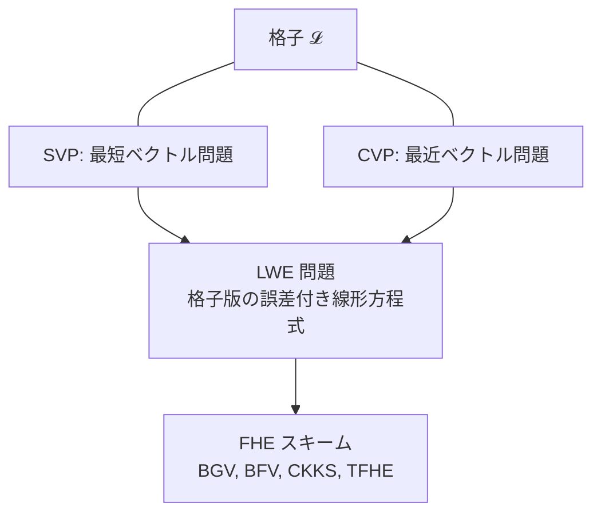
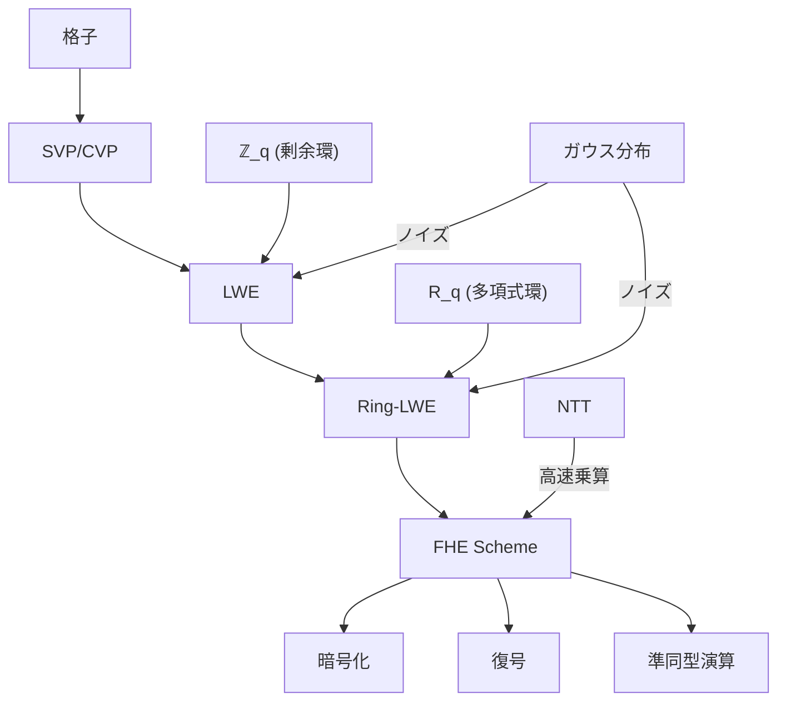

**日付**: 2026年4月24日
**学習内容**: Article 5 以降で扱う **LWE** と **Ring-LWE** を理解するには、3つの数学的道具が必要になる: **(1) 格子 (lattice)**、**(2) 剰余環 $\mathbb{Z}_q$**、**(3) 多項式環 $\mathbb{Z}_q[X]/(X^n+1)$**。本記事ではこれらを一から構築する。さらにFHEで頻繁に登場する **ガウス分布（離散ガウス）** と **NTT（数論変換）** の概念も導入する。すべての暗号計算はこの3つの環境の組み合わせで行われる。ZKPシリーズを読んだ読者なら、有限体 $\mathbb{F}_p$ の話と重なる部分があるが、FHE では **$q$ が合成数** だったり、**多項式環** を使う点が異なる。そこが FHE の特異点なので丁寧に押さえていく。

## 0. 本記事の位置づけ

Article 1-3 で「何のためにFHEを学ぶか」を押さえた。本記事からは **数学の中身** に入る。最初の関門が本記事の3つの代数構造:

- **格子（lattice）**: FHE の安全性の基盤
- **剰余環 $\mathbb{Z}_q$**: 基本の計算舞台
- **多項式環 $R_q = \mathbb{Z}_q[X]/(X^n+1)$**: 効率化のための舞台

ZKPシリーズ Article 6（有限体 $\mathbb{F}_p$）を読んだ読者には既知の部分も多いが、**FHE では素数 $p$ ではなく合成数 $q$ を使う点**、**多項式環を使う点**が決定的に異なる。

構成:

- **第1章**: 格子の定義と SVP・CVP
- **第2章**: 剰余環 $\mathbb{Z}_q$ と $\bmod q$ の扱い
- **第3章**: 多項式環 $\mathbb{Z}_q[X]/(X^n+1)$
- **第4章**: ガウス分布と離散ガウス
- **第5章**: NTT（数論変換）による高速化
- **第6章**: FHE における各数学道具の役割
- **第7章**: Q&A とまとめ

## 1. 格子 (Lattice) — FHE の安全性の基盤

### 1.1 格子の定義

**格子（lattice）** とは、$n$ 次元ユークリッド空間 $\mathbb{R}^n$ 内で、$n$ 個の線形独立なベクトル $b_1, \ldots, b_n$ の整数係数線形結合で生成される集合:

$$
\mathcal{L} = \left\{ \sum_{i=1}^n z_i \cdot b_i \mid z_i \in \mathbb{Z} \right\}
$$

$\{b_1, \ldots, b_n\}$ を **基底（basis）** と呼ぶ。

### 1.2 2次元の例

2次元格子の例:

$b_1 = (1, 0)$, $b_2 = (0, 1)$ の場合、格子 $\mathcal{L} = \mathbb{Z}^2$（整数格子）。これは **規則的な碁盤目**。

$b_1 = (2, 1)$, $b_2 = (1, 3)$ の場合、$\mathcal{L}$ は斜めに傾いた格子になる。

```
. . . . . . .
. . . . . . .
. . .*. . . .    * は格子点
. . . .*. . .
. . . . .*. .
. . . . . .*.
```

### 1.3 同じ格子でも基底はいろいろ

重要な事実: **同じ格子 $\mathcal{L}$ でも、それを生成する基底は無数にある**。

- **良い基底**: 短くて直交に近い → 幾何学的に使いやすい
- **悪い基底**: 長くて歪んだ → 格子の構造を把握しにくい

攻撃者に「悪い基底」だけを見せて、ユーザーは「良い基底」を秘匿する。これが格子暗号の基本戦略。

### 1.4 格子上の難しい問題

格子暗号の安全性は、次の2つの計算困難問題に基づく:

**最短ベクトル問題 (SVP, Shortest Vector Problem)**:

> 格子 $\mathcal{L}$ の中で、**原点に最も近い非ゼロ点** を見つけよ

次元 $n$ が高い（$n = 500$ 以上）ほど難しく、量子計算機でも効率的に解けない。

**最近ベクトル問題 (CVP, Closest Vector Problem)**:

> 格子 $\mathcal{L}$ と任意の点 $t$ が与えられたとき、$t$ に**最も近い格子点**を見つけよ

SVP・CVP の近似版は、**多項式時間で解けない** と信じられている（少なくとも現在の技術では）。

### 1.5 なぜFHEで格子？

- **量子耐性**: SVP/CVP は量子コンピュータでも破れない（Shor のアルゴリズムは格子問題に効かない）
- **加法構造**: 格子点 $+$ 格子点 $=$ 格子点。準同型暗号と相性がよい
- **ノイズを乗せられる**: 「格子点 + 小さな誤差」で平文をエンコードできる（LWE の発想）



SVP/CVP を直接使う暗号もあるが、FHE では次の Article 5 で扱う **LWE** という派生問題を使う。

## 2. 剰余環 $\mathbb{Z}_q$

### 2.1 $\mathbb{Z}_q$ の定義

整数 $q \geq 2$ に対し、**$\mathbb{Z}_q = \mathbb{Z} / q\mathbb{Z} = \{0, 1, 2, \ldots, q-1\}$**。演算はすべて $\bmod q$ で行う:

$$
a +_q b = (a + b) \bmod q, \quad a \cdot_q b = (a \cdot b) \bmod q
$$

### 2.2 $q$ は合成数でもよい

ZKP では $q = p$（素数）を使うことが多いが、FHE では **合成数 $q$** も使う:

- **BGV/BFV**: $q$ は数個の大きな素数の積（RNS 分解のため）
- **CKKS**: 同様に合成数
- **TFHE**: 単純な $q = 2^{32}$ や $q = 2^{64}$（機械語幅と一致）

合成数を使う理由:
1. **剰余数系 (RNS)**: CRT で効率的に計算できる
2. **モジュラス切り替え**: 計算進行とともに $q$ を小さくしていく操作がしやすい
3. **機械語幅との一致**: $q = 2^{32}$ なら C 言語の `uint32_t` がそのまま使える

### 2.3 符号付き表現

FHE では **「絶対値が小さな整数」** を扱うことが多い。そのため $\mathbb{Z}_q$ の表現を:

- $\{0, 1, \ldots, q-1\}$（非負）
- $\{-q/2, -q/2+1, \ldots, q/2-1\}$（符号付き）

のどちらでも使える。どちらも「$\bmod q$ で同じ」。**暗号文の平文部分は符号付きの小さな値、全体としては $[0, q)$ に分布** というのが典型。

### 2.4 $\mathbb{Z}_q$ での「小さな」ノイズ

ガウス分布から生成した「小さな」整数 $e$ は、$\mathbb{Z}_q$ に埋め込むと:

- $e$ が正で小さい → $e$ がそのまま
- $e$ が負で小さい → $q + e$（$q$ に近い大きな数）

LWE の安全性は、この「小さな誤差 vs 大きなランダム数」の区別困難性に基づく。

## 3. 多項式環 $\mathbb{Z}_q[X]/(X^n+1)$

### 3.1 効率化の動機

LWE だけで FHE を作ると、**1回の演算ごとに $n \times n$ の行列演算**が必要になる。$n = 1024$ くらいでも**遅すぎる**。

そこで **Ring-LWE** では、$n$ 次元ベクトルを **多項式** に置き換える:

$$
(a_0, a_1, \ldots, a_{n-1}) \leftrightarrow a_0 + a_1 X + a_2 X^2 + \cdots + a_{n-1} X^{n-1}
$$

多項式同士の **乗算** が行列演算に対応しつつ、NTTで**高速に計算**できる。

### 3.2 多項式環の定義

**多項式環 $R = \mathbb{Z}[X] / (X^n + 1)$** は、$\mathbb{Z}[X]$（整数係数多項式環）を $X^n + 1$ で割った剰余類:

$$
R = \{a_0 + a_1 X + \cdots + a_{n-1} X^{n-1} \mid a_i \in \mathbb{Z}\}
$$

加算は係数ごと、乗算は **$X^n = -1$** を代入しながら行う。

さらに係数を $\mathbb{Z}_q$ に取れば:

$$
R_q = \mathbb{Z}_q[X] / (X^n + 1)
$$

### 3.3 $X^n + 1$ を選ぶ理由

$X^n + 1$ は $n$ が 2 のべきのとき既約（$n = 2, 4, 8, \ldots, 1024, \ldots$）。これにより:

1. **体や整域** に近い性質を持つ
2. **NTT** で高速に乗算できる
3. **幾何的にも扱いやすい**（$\mathbb{Z}[X]/(X^n+1)$ は $\mathbb{Z}^n$ に同型）

### 3.4 多項式乗算の例

$n = 4$、$R = \mathbb{Z}[X]/(X^4+1)$ とする。

$a = 1 + 2X + 3X^2$
$b = X + X^3$

$a \cdot b = X + X^3 + 2X^2 + 2X^4 + 3X^3 + 3X^5$

ここで **$X^4 = -1$**、**$X^5 = -X$** を使って:

$= X + X^3 + 2X^2 + 2 \cdot (-1) + 3X^3 + 3 \cdot (-X)$
$= X + X^3 + 2X^2 - 2 + 3X^3 - 3X$
$= -2 + (1 - 3)X + 2X^2 + (1 + 3)X^3$
$= -2 - 2X + 2X^2 + 4X^3$

これが **多項式畳み込み**（$X^n = -1$ で符号を反転させながら折り返す）。

### 3.5 なぜ「ねじれ畳み込み」なのか

$X^n - 1$ の剰余だと「通常の畳み込み」、$X^n + 1$ の剰余だと「**負巡回畳み込み (negacyclic convolution)**」になる。$X^n + 1$ を使うほうが:

- 安全性解析がシンプル
- $\mathbb{Z}[X]/(X^n+1)$ は **円分体** の整数環と同型になり、数論的に扱いやすい

## 4. ガウス分布と離散ガウス

### 4.1 連続ガウス分布

ノイズは **平均 $0$、標準偏差 $\sigma$** の正規分布から生成されることが多い:

$$
\mathcal{N}(0, \sigma^2): \quad f(x) = \frac{1}{\sqrt{2\pi}\sigma} \exp\left(-\frac{x^2}{2\sigma^2}\right)
$$

### 4.2 離散ガウス分布

$\mathbb{Z}_q$ 上で値を取るので、連続ガウスを整数に「離散化」する:

$$
D_{\mathbb{Z}, \sigma}(x) \propto \exp\left(-\frac{x^2}{2\sigma^2}\right), \quad x \in \mathbb{Z}
$$

実装上は「連続ガウスをサンプリングして四捨五入」でも十分近似できる（正確な離散ガウスサンプラーは暗号ライブラリで提供される）。

### 4.3 パラメータの典型値

- **$\sigma = 3.2$**: 標準的なFHEパラメータ
- **$\sigma = 3.19$**: HE Standard で推奨される値
- **範囲**: $3\sigma \approx \pm 10$ 程度に収まる

この「**ノイズは小さい（$\pm 10$ 程度）が、$q$ は大きい（$2^{60}$ 程度）**」という非対称が、LWEの安全性の要。

### 4.4 一様分布との違い

LWE の安全性証明では、**「ノイズ付き線形方程式」 と 「完全にランダムな値」 が区別できない** ことを示す。「ノイズが小さい」ことが正当な復号と効率性を与え、「十分に大きい」ことが安全性を与える。

## 5. NTT — 数論変換による高速化

### 5.1 FFT との類似

通常の多項式乗算は $O(n^2)$。**FFT (Fast Fourier Transform)** を使うと $O(n \log n)$ に高速化できる。

しかし FFT は複素数を使うので、整数環 $\mathbb{Z}_q$ では使えない。そこで **NTT (Number Theoretic Transform)** を使う。

### 5.2 NTT の要件

$\mathbb{Z}_q$ に **$2n$ 次の原始根 $\omega$** が存在する必要がある。つまり:

$$
\omega^{2n} = 1 \pmod{q}, \quad \omega^k \neq 1 \text{ for } k < 2n
$$

これは $q \equiv 1 \pmod{2n}$ を満たす素数 $q$ があれば成立する。FHEで使う $q$ は、この性質を満たすよう設計される（**NTT-friendly prime**）。

### 5.3 NTT による多項式乗算

1. $a, b \in R_q$ を NTT で変換: $\hat{a}, \hat{b}$
2. **点ごとに掛け算**: $\hat{c}_i = \hat{a}_i \cdot \hat{b}_i$
3. 逆NTTで戻す: $c = \text{NTT}^{-1}(\hat{c})$

これで乗算が $O(n \log n)$。FHE の実装では **NTT がボトルネック** になるので、ハードウェアアクセラレータ（FPGA、GPU、ASIC）の研究が盛ん。

### 5.4 NTT 対応の $q$ 選び

- $n = 1024$, $q = 2^{60} - 2^{14} + 1$（NTT-friendly）
- $n = 2048$, $q$ はさらに大きく

実装ライブラリ（SEAL、OpenFHE）は、自動で適切な $q$ を選ぶ。

## 6. FHE における各数学道具の役割

これらの数学道具は、FHE 内でこう使われる:



- **格子の SVP**: 攻撃者が鍵を復元する問題 → 困難性の根拠
- **$\mathbb{Z}_q$**: 暗号文の係数の住処
- **$R_q$**: Ring-LWE ベースのスキームの計算舞台
- **ガウス分布**: ノイズ生成
- **NTT**: 多項式乗算の高速化

## 7. Q&A

### Q1: なぜ $q$ が合成数で大丈夫なのか？ZKPでは素数だったが

$\mathbb{Z}_q$ が **体** であるためには $q$ は素数が必要。しかし FHE では **環** で十分（逆元が必ずしもなくてよい）。CRT (中国剰余定理) で合成数 $q = q_1 q_2 \cdots q_L$ を素数の積に分解して効率化する。

### Q2: $X^n + 1$ を使う代わりに $X^n - 1$ ではだめ？

$X^n - 1$ は因数分解できてしまう（$X - 1$ で割り切れる）。結果、環 $\mathbb{Z}[X]/(X^n-1)$ には **ゼロ因子** があり、暗号的に扱いにくい。$X^n + 1$ は $n = 2^k$ で既約なので、**整域** に近い性質を持つ。

### Q3: LWE と Ring-LWE はどう違うのか？

次の Articles 5, 6 で詳述するが、ざっくり:

- **LWE**: ベクトルの世界。シンプルだが遅い
- **Ring-LWE**: 多項式の世界。NTT で速いが、代数的構造が余分にある分、安全性が少し違う

### Q4: NTT と FFT は何が違う？

- **FFT**: 複素数を使う（$\omega = e^{2\pi i/n}$）
- **NTT**: 整数のみ（$\omega \in \mathbb{Z}_q$、原始根）

両方同じ構造の変換で、計算量も同じ $O(n \log n)$。FHEでは整数しか扱えないので NTT を使う。

### Q5: ガウス分布はなぜ使う？ 一様分布ではダメ？

理論的には、**他の分布（三角分布など）** も使える。しかし:
1. **Smoothing Lemma**: ガウス分布は「格子の上で十分に拡散する」
2. **安全性証明**: LWE の worst-case to average-case 還元がガウス分布で示されている
3. **実装**: ガウス分布は効率的にサンプル可能

これらの理由でガウス（または離散ガウス）がデファクト。

### Q6: 次数 $n$ の典型値は？

安全性と性能のバランスで:

- $n = 1024$: 80bit 安全性（古い）
- $n = 2048$: 128bit 安全性
- $n = 4096$: 128bit 安全性、バッチ数多い
- $n = 16384$: 256bit 安全性、深い計算

「128bit 安全性」が標準で、$n = 2048 \sim 8192$ あたりがよく使われる。

## 8. まとめ

### 本記事で学んだこと

- **格子 $\mathcal{L}$**: $n$ 個の基底ベクトルの整数線形結合で生成される離散集合。SVP/CVP が困難
- **剰余環 $\mathbb{Z}_q$**: $\bmod q$ の整数集合。FHE では $q$ は合成数でもよい（BGV/BFV/CKKS ではそう）
- **多項式環 $R_q = \mathbb{Z}_q[X]/(X^n+1)$**: FHE の計算舞台。$n = 2^k$ で $X^n + 1$ は既約
- **ガウス分布**: ノイズ生成。$\sigma \approx 3.2$ が標準
- **NTT**: 多項式乗算を $O(n \log n)$ に高速化。FHE 実装の要
- これらが組み合わさって **LWE・Ring-LWE** を定義し、FHE の安全性と効率の両方を支える

### 次の記事（Article 5）へ

次の記事では、本記事で準備した道具を使って **LWE 問題** を厳密に定義する。なぜ LWE が困難なのか、Regev の還元定理（LWE は格子問題と同じくらい難しい）、そして LWE がどう暗号構築に使われるかを見ていく。

### 3行サマリ

- FHE は **格子の世界で動く**。SVP/CVP の困難性が安全性の根拠
- 計算舞台は **$\mathbb{Z}_q$（剰余環）** と **$R_q = \mathbb{Z}_q[X]/(X^n+1)$（多項式環）**
- 高速化の鍵は **NTT**、ノイズは **離散ガウス $\sigma \approx 3.2$**

---

## 参考文献

- Oded Regev. *On Lattices, Learning with Errors, Random Linear Codes, and Cryptography.* STOC 2005.
- Daniele Micciancio, Oded Regev. *Lattice-based Cryptography.* Post-Quantum Cryptography, Springer 2009.
- Chris Peikert. *A Decade of Lattice Cryptography.* Foundations and Trends in Theoretical Computer Science, 2016.
- Homomorphic Encryption Standard. *Parameter Recommendations.* [https://homomorphicencryption.org/standard/](https://homomorphicencryption.org/standard/)
