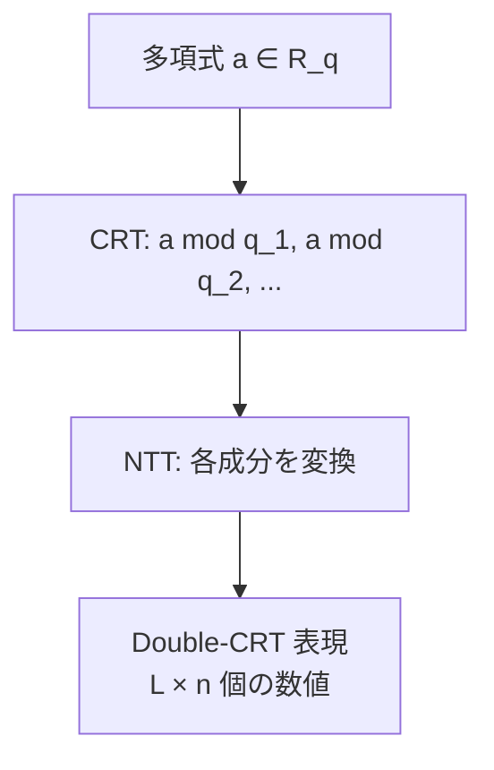

**日付**: 2026年4月24日
**学習内容**: Article 5 で見た **LWE** は、暗号理論的には美しいが、**実用には遅すぎる**。鍵サイズが $O(n^2)$、暗号文が $O(n)$、乗算が $O(n^2)$ と、どれも巨大化する。そこで Lyubashevsky・Peikert・Regev (LPR) が 2010 年に提唱したのが **Ring-LWE (RLWE)**。ベクトルの代わりに **多項式環 $R_q = \mathbb{Z}_q[X]/(X^n+1)$** を使うことで、**$n$ 次元の演算を 1 つの多項式演算に圧縮**し、さらに NTT で高速化できる。本記事では **(1) Ring-LWE の定義**、**(2) LWE との違い（サイズと速度）**、**(3) 安全性（Ring 構造の代償）**、**(4) Module-LWE の立ち位置**、**(5) 具体例と実装**、**(6) NTT 最適化**、**(7) RLWE を使った公開鍵暗号** を扱う。BGV/BFV/CKKS はすべて RLWE ベース、TFHE も類似の構造を使う。

## 0. 本記事の位置づけ

Article 5 で LWE を学んだ。LWE は格子問題として美しいが、実用 FHE では **Ring-LWE** がほぼ必ず使われる。その理由を本記事で理解する。

LWE の課題:
- 公開鍵サイズ $O(n^2 \log q)$ ビット → $n = 1024$, $\log q = 30$ で **3 MB** 以上
- 計算量 $O(n^2)$ → $n = 1024$ で $10^6$ オペレーション
- とても実用にならない

Ring-LWE の救済策:
- 公開鍵 $O(n \log q)$ → **3 KB** 程度
- 計算量 $O(n \log n)$ → NTT で高速化
- 実用速度（ms ~ μs オーダー）

構成:

- **第1章**: Ring-LWE の定義
- **第2章**: LWE → Ring-LWE の「幾何学的視点」
- **第3章**: サイズ・速度の比較
- **第4章**: 安全性の違い
- **第5章**: Module-LWE
- **第6章**: Ring-LWE ベースの公開鍵暗号
- **第7章**: NTT 最適化
- **第8章**: Q&A とまとめ

## 1. Ring-LWE の定義

### 1.1 舞台: 多項式環 $R_q$

Article 4 で定義した:

$$
R = \mathbb{Z}[X] / (X^n + 1), \quad R_q = R / qR = \mathbb{Z}_q[X] / (X^n + 1)
$$

ここで $n$ は 2 のべき（例: $n = 1024$）。$R_q$ の要素は、係数が $\mathbb{Z}_q$ の高々 $n-1$ 次多項式。

### 1.2 Ring-LWE サンプル

次のプロセスで生成されるペア $(a, b) \in R_q \times R_q$ を **RLWE サンプル** と呼ぶ:

1. $a \leftarrow R_q$ を **一様ランダム** に選ぶ（係数を一様ランダム）
2. $e \leftarrow \chi_R$ を **誤差分布** から選ぶ（各係数が離散ガウス）
3. $b = a \cdot s + e \pmod{q, X^n+1}$ を計算

ここで $s \in R_q$ は **秘密多項式**。

### 1.3 Search/Decision-RLWE

**Search-RLWE**: サンプル列 $(a_1, b_1), (a_2, b_2), \ldots$ から $s$ を求めよ。

**Decision-RLWE**: 与えられたサンプル列が **RLWE** か **一様ランダム** かを判定せよ。

両者は多項式時間で同値（LPR 2010で示された）。

### 1.4 LWE との比較

- **LWE**: $\mathbf{a} \in \mathbb{Z}_q^n$、$\mathbf{s} \in \mathbb{Z}_q^n$、$b = \langle \mathbf{a}, \mathbf{s}\rangle + e$（**1 つのスカラー**）
- **RLWE**: $a, s \in R_q$（**係数 $n$ 個の多項式**）、$b = a \cdot s + e$（**$n$ 個の係数をもつ多項式**）

つまり、**RLWE 1 サンプルは LWE $n$ サンプル分** の情報を1度に扱う。

## 2. LWE → Ring-LWE の「幾何学的視点」

### 2.1 多項式を行列化

RLWE の乗算 $a \cdot s \in R_q$ は、係数ベクトル $\mathbf{s} = (s_0, s_1, \ldots, s_{n-1})$ に対して:

$$
a \cdot s = M_a \cdot \mathbf{s}
$$

となる $n \times n$ 行列 $M_a$ を取ることができる。$M_a$ は $a$ の係数から定まる **negacyclic matrix**（負巡回行列、$X^n = -1$ を反映した特殊形）:

$$
M_a = \begin{pmatrix}
a_0 & -a_{n-1} & -a_{n-2} & \cdots & -a_1 \\
a_1 & a_0 & -a_{n-1} & \cdots & -a_2 \\
a_2 & a_1 & a_0 & \cdots & -a_3 \\
\vdots & \vdots & \vdots & \ddots & \vdots \\
a_{n-1} & a_{n-2} & a_{n-3} & \cdots & a_0
\end{pmatrix}
$$

### 2.2 RLWE は「構造化された LWE」

したがって **RLWE は LWE の特殊ケース**:

- 行列 $A \in \mathbb{Z}_q^{n \times n}$ が **一様ランダム** → 通常の LWE
- 行列 $A = M_a$ が **negacyclic 構造** を持つ → Ring-LWE

構造を持つぶん攻撃者にヒントを与える（安全性が少し弱まる可能性）が、表現効率は大きく向上。

### 2.3 イデアル格子

RLWE に対応する格子は **イデアル格子 (ideal lattice)** と呼ばれる。多項式環 $R_q$ のイデアルに対応する、構造化された格子。

SVP をイデアル格子上に限定した **Ideal-SVP** は、通常の SVP よりも（理論的には）解きやすい可能性がある。現在のところ、実用パラメータでは差が見えていない。

## 3. サイズ・速度の比較

### 3.1 サイズ比較

$n = 1024$、$\log q = 30$ での比較:

| 項目 | LWE | Ring-LWE |
|---|---|---|
| 公開鍵サイズ | $O(n^2 \log q)$ ≈ 3.7 MB | $O(n \log q)$ ≈ 3.7 KB |
| 暗号文サイズ (1 ビット) | $O(n \log q)$ ≈ 3.7 KB | $O(n \log q)$ ≈ 3.7 KB (ただし $n$ ビット暗号化) |
| 秘密鍵 | $O(n \log q)$ ≈ 3.7 KB | $O(n \log q)$ ≈ 3.7 KB |

**Ring-LWE は暗号文 1 個で $n$ ビットを並列暗号化できる** ため、1ビットあたりのサイズは $1/n$ に圧縮。

### 3.2 速度比較

暗号化、復号、準同型演算は:

- **LWE**: 行列ベクトル積 $A\mathbf{s}$ → $O(n^2)$
- **Ring-LWE (naive)**: 多項式乗算 $a \cdot s$ → $O(n^2)$
- **Ring-LWE (NTT)**: NTT 乗算 → $O(n \log n)$

$n = 1024$ で **10〜50倍の速度差**。

### 3.3 なぜ並列暗号化できるか

RLWE の暗号文は 1 つの多項式だが、**SIMD バッチング** により、$n$ 個の独立な平文を同時に暗号化できる（Article 11 の BGV で詳説）。

これにより $n$ 個の同時計算が可能 → **AI の行列演算** 等で威力を発揮。

## 4. 安全性の違い

### 4.1 Ring 構造の代償

LWE は完全にランダムな行列 $A$ を使う。Ring-LWE は **構造化された行列 $M_a$** を使う。この構造が攻撃者に情報を与える可能性がある。

### 4.2 具体的な攻撃

- **Subfield attack**: 円分体の部分体を使った攻撃
- **Decoding attack on ideal lattices**: イデアル格子特有の構造を利用

これらは **特定パラメータ** で有効だが、**主流のパラメータ (n = 2048, 4096, ...)** では LWE と実質同等の安全性を持つとされる。

### 4.3 安全性の証明

LPR 2010 は **Ring-LWE の平均ケース困難性が Ideal-SVP の最悪ケース困難性に還元される** ことを示した。ただし Ideal-SVP が通常の SVP と同等かは未解決。

実用上は「**経験的に十分安全**」という立場。

### 4.4 保守的に使うなら

懸念を避けたければ:
- **LWE を直接使う**: 遅いが理論的に安心
- **Module-LWE**: LWE と RLWE の中間。柔軟

実装現場では Ring-LWE が主流。BGV/BFV/CKKS/TFHE すべて Ring-LWE ベース。

## 5. Module-LWE

### 5.1 LWE と RLWE の中間

**Module-LWE** は $k$ 個の多項式ベクトル $\mathbf{s} \in R_q^k$ を秘密に持つ:

- $\mathbf{a} \in R_q^k$ (一様)
- $b = \langle \mathbf{a}, \mathbf{s} \rangle + e \in R_q$

つまり「**多項式のベクトル**」を扱う。

### 5.2 $k$ の意味

- $k = 1$: **Ring-LWE**（1 つの多項式）
- $k = n$: **LWE と同等**（1 次多項式 = スカラー、がn 個）
- $k$ 中間: 柔軟なトレードオフ

### 5.3 NIST PQC での採用

- **CRYSTALS-Kyber** (鍵カプセル化): Module-LWE
- **CRYSTALS-Dilithium** (署名): Module-LWE

NIST 標準は RLWE ではなく Module-LWE を選んだ。パラメータ調整の柔軟性と安全性への慎重さから。

### 5.4 FHE と Module-LWE

FHE は実用速度重視で Ring-LWE が主流だが、一部の研究で Module-LWE も使われている。将来的にはハイブリッド実装があるかも。

## 6. Ring-LWE ベースの公開鍵暗号

### 6.1 基本スキーム (LPR スタイル)

**鍵生成**:
- 秘密鍵: $s \leftarrow R_q$（係数が三元 $\{-1, 0, 1\}$ のスパース多項式がよく使われる）
- ノイズ: $e \leftarrow \chi_R$
- $a \leftarrow R_q$ 一様
- 公開鍵: $pk = (a, b = -a \cdot s + e)$

**暗号化（平文 $m \in R_t$、$t \ll q$）**:
- $u, e_1, e_2 \leftarrow \chi_R$ 
- $c_0 = b \cdot u + e_1 + \lfloor q/t \rfloor \cdot m$
- $c_1 = a \cdot u + e_2$
- 暗号文: $(c_0, c_1) \in R_q \times R_q$

**復号**:
- $v = c_0 + c_1 \cdot s = \lfloor q/t \rfloor \cdot m + (\text{small noise})$
- $m = \lfloor v \cdot t / q \rceil \mod t$

### 6.2 なぜ復号できるか

$c_0 + c_1 \cdot s$ を展開:

$$
(b u + e_1 + \lfloor q/t \rfloor m) + (au + e_2) s = (b + as) u + e_1 + e_2 s + \lfloor q/t \rfloor m
$$

ここで $b = -as + e$ なので $b + as = e$ (ノイズ項):

$$
= eu + e_1 + e_2 s + \lfloor q/t \rfloor m
$$

第1〜3項はすべて **小さい × 小さい = 小さい** ($\sigma$ オーダー)。したがって全体は $\lfloor q/t \rfloor \cdot m$ の近傍。

最上位ビット（$\lfloor q/t \rfloor$ のスケール）を取り出せば $m$ が得られる。

### 6.3 安全性

$pk = (a, b)$ は RLWE サンプル $(a, -as + e)$ と同じ構造。 Decision-RLWE 仮定で、攻撃者は $b$ を一様ランダムと区別できない → $pk$ から $s$ を復元できない。

暗号文 $(c_0, c_1)$ も RLWE 様の構造。**IND-CPA 安全** であることが証明される。

### 6.4 パラメータ例

BFV の典型例:
- $n = 4096$
- $q \approx 2^{109}$
- $t = 2^{20}$ (平文モジュラス)
- $\sigma = 3.19$

これで 128bit 安全性、乗算深さ $L \approx 5$ 程度。

## 7. NTT 最適化

### 7.1 多項式乗算のボトルネック

$c = a \cdot b \in R_q$ の計算は、素朴には $O(n^2)$:

$$
c_k = \sum_{i+j=k} a_i b_j - \sum_{i+j=k+n} a_i b_j
$$

（第2項が $X^n = -1$ の折り返し）

### 7.2 NTT による高速化

Article 4 で触れたように:

1. $a, b$ を NTT 領域に変換: $\hat{a} = \text{NTT}(a)$、$\hat{b} = \text{NTT}(b)$
2. 点ごと乗算: $\hat{c}_i = \hat{a}_i \cdot \hat{b}_i$
3. 逆変換: $c = \text{NTT}^{-1}(\hat{c})$

これで $O(n \log n)$。$n = 4096$ で **64倍** 速い。

### 7.3 NTT-friendly な $q$

NTT が使えるには $q \equiv 1 \pmod{2n}$ が必要。BFV/CKKS の実装では:
- $q = q_1 \cdot q_2 \cdot \cdots \cdot q_L$
- 各 $q_i$ は **NTT-friendly prime**（$q_i \equiv 1 \pmod{2n}$ を満たす素数）

これにより **RNS (Residue Number System)** 分解で並列計算できる。

### 7.4 Double-CRT 表現

FHE の実装では暗号文を **Double-CRT** 形式で保持:

1. 係数を $(q_1, q_2, \ldots, q_L)$ で CRT 分解
2. 各素数ごとに NTT 変換

この形式だと **加算・乗算が成分ごとの単純計算** になり、高速。

実装ライブラリ（SEAL、OpenFHE）ではデフォルトでこの形式を使う。

## 8. Q&A

### Q1: Ring-LWE と LWE、どちらが安全？

**LWE の方が理論的には安心**。RLWE は構造を持つぶん、特定の攻撃が存在する可能性がある。ただし実用パラメータで RLWE が破られた事例はない。

### Q2: FHE で LWE を使うスキームはある？

**TFHE の内部** では LWE ベースの暗号文と Ring-LWE ベースの暗号文が両方使われる。Gate-bootstrapping は LWE 暗号文に対して、Blind-rotation は Ring-LWE 暗号文に対して行う。

### Q3: なぜ $R = \mathbb{Z}[X]/(X^n+1)$ で $n$ は 2 べきなのか？

$X^n + 1$ が **既約多項式** になるため。$n = 2^k$ なら既約で、多項式環が **整域** になる（ゼロ因子がない）。また NTT が効く $q$ を選びやすい。

### Q4: Ring-LWE は何次元の格子に対応？

$R_q = \mathbb{Z}_q[X]/(X^n+1)$ の要素は $n$ 個の係数を持つ → **$n$ 次元の格子**。たとえば $n = 4096$ なら **4096次元** の格子。

### Q5: NTT は GPU で高速化できる？

**できる**。FFT と同様、NTT も並列性が高い。多くのFHEライブラリが GPU/FPGA 実装を持つ。HEXL（Intel）は CPU の AVX-512 命令でNTTを高速化するライブラリ。

### Q6: Ring-LWE で平文空間は何になる？

スキームによる:
- **BGV/BFV**: $\mathbb{Z}_t[X]/(X^n+1)$（整数ベクトルを多項式として扱う）
- **CKKS**: $\mathbb{C}^{n/2}$（複素数ベクトル、canonical embedding 経由）
- **TFHE**: $\mathbb{T} = \mathbb{R}/\mathbb{Z}$（torus）

## 9. まとめ

### 本記事で学んだこと

- **Ring-LWE (RLWE)** は LWE の多項式環版。$R_q = \mathbb{Z}_q[X]/(X^n+1)$ を舞台とする
- サイズは $O(n^2) \to O(n)$、計算量は $O(n^2) \to O(n \log n)$（NTT）
- **LWE → RLWE** はベクトルを $n$ 次元の多項式に置き換える変形
- **安全性**: LWE より構造があるぶん若干弱いが、実用パラメータでは問題視されていない
- **Module-LWE**: LWE と RLWE の中間。NIST PQC (Kyber/Dilithium) で採用
- 実装の心臓部は **NTT + Double-CRT 表現**

### 次の記事（Article 7）へ

次の記事では、LWE/RLWE の公開鍵暗号を発展させて、**Regev 暗号方式** を厳密にトレースする。鍵生成から暗号化・復号、そしてそこに **準同型性をどう加えるか** までの具体的な数式を追う。Article 8 以降の「準同型演算」「ノイズ管理」「ブートストラッピング」の出発点となる。

### 3行サマリ

- **Ring-LWE** は LWE を多項式環 $R_q = \mathbb{Z}_q[X]/(X^n+1)$ に持ち上げたもの
- サイズ・速度が劇的に改善される（**NTT で $O(n \log n)$**）
- 実用FHE (BGV/BFV/CKKS/TFHE) はすべて Ring-LWE ベース。NIST PQC は Module-LWE

---

## 参考文献

- Lyubashevsky, Peikert, Regev. *On Ideal Lattices and Learning with Errors Over Rings.* EUROCRYPT 2010.
- Lyubashevsky, Peikert, Regev. *A Toolkit for Ring-LWE Cryptography.* EUROCRYPT 2013.
- Brakerski, Langlois, Peikert, Regev, Stehlé. *Classical Hardness of Learning with Errors.* STOC 2013.
- NIST. *CRYSTALS-Kyber Specification.* 2022.
