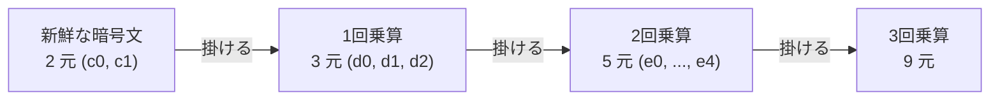

**日付**: 2026年4月24日
**学習内容**: Article 7 で Regev スキームの加法準同型を確認した。しかし加算だけでは **任意関数** に届かない。本記事では **準同型乗算** をどう実現するか、そしてそれが引き起こす課題と解決策を扱う。具体的には **(1) 素朴な乗算とテンソル化**、**(2) 暗号文次数の膨張問題**、**(3) 再線形化 (relinearization) と評価鍵 (evk)**、**(4) 鍵スイッチ (key switching)**、**(5) ノイズ増加のオーダー解析**、**(6) 乗算深さ $L$ とパラメータ選択**、**(7) Python 擬似コード**、**(8) BGV・BFV での具体実装** を扱う。乗算こそFHEの真の難所であり、ここを越えれば **任意の多項式が暗号文空間で計算できる** ようになる。

## 0. 本記事の位置づけ

Article 7 で見た Regev 暗号は **加算準同型** のみ。加算だけでは、1次式 $f(x) = ax + b$ しか計算できない。任意関数を作るには **乗算** が必要不可欠。

ところが乗算は一筋縄ではいかない:

1. **素朴な乗算** は暗号文を **膨張させる**
2. **ノイズが爆発的に増える**
3. この2つを同時に解決する必要がある

そのための道具が **再線形化 (relinearization)** と **鍵スイッチ (key switching)**。これらは BGV/BFV/CKKS すべてに共通する中核技術。

構成:

- **第1章**: 加算準同型の復習
- **第2章**: 素朴な乗算とテンソル化
- **第3章**: 暗号文次数の膨張
- **第4章**: 再線形化の原理
- **第5章**: 鍵スイッチ
- **第6章**: ノイズの増加
- **第7章**: 乗算深さ $L$
- **第8章**: Python 擬似コード
- **第9章**: Q&A とまとめ

## 1. 加算準同型の復習

### 1.1 Ring-LWE 暗号文の形

Ring-LWE 版 Regev の暗号文は多項式のペア:

$$
\text{ct} = (c_0, c_1), \quad c_0, c_1 \in R_q
$$

復号:

$$
c_0 + c_1 \cdot s = \Delta \cdot m + \text{(small noise)}, \quad \Delta = \lfloor q/t \rfloor
$$

ここで $t$ は平文モジュラス、$m \in R_t$ は平文多項式、$s$ は秘密鍵。

### 1.2 加算

2 つの暗号文 $\text{ct} = (c_0, c_1)$, $\text{ct}' = (c_0', c_1')$ があるとき:

$$
\text{ct} + \text{ct}' = (c_0 + c_0', c_1 + c_1')
$$

復号すると:

$$
(c_0 + c_0') + (c_1 + c_1') s = \Delta (m + m') + (\text{noise}_1 + \text{noise}_2)
$$

$m + m'$ の暗号文になる。**ノイズは加算的に増える**（$\sqrt{2}$倍 程度）。

### 1.3 スカラー乗算

平文スカラー $\alpha$ を暗号文に掛ける:

$$
\alpha \cdot \text{ct} = (\alpha c_0, \alpha c_1)
$$

復号で $\alpha m$ になる。ノイズも $\alpha$ 倍されるので、$\alpha$ は小さい必要がある。

## 2. 素朴な乗算とテンソル化

### 2.1 どう掛ければよいか

$\text{ct} = (c_0, c_1)$ の復号式は $c_0 + c_1 s$。したがって:

$$
(\text{ct}) \cdot (\text{ct}') = (c_0 + c_1 s)(c_0' + c_1' s) = c_0 c_0' + (c_0 c_1' + c_1 c_0') s + c_1 c_1' s^2
$$

つまり **$s, s^2$ の 2 次式** になる。

### 2.2 新しい「暗号文」

素朴な乗算結果は **3 つ組**:

$$
\text{ct}_{\text{mul}} = (d_0, d_1, d_2) = (c_0 c_0',\ c_0 c_1' + c_1 c_0',\ c_1 c_1')
$$

復号式:

$$
d_0 + d_1 \cdot s + d_2 \cdot s^2 = \Delta^2 m m' + (\text{noise})
$$

これは **$s^2$ も秘密鍵の一部にする**と復号できる暗号文。でも秘密鍵のサイズが $|s^2|$ だけ増えた。

### 2.3 暗号文次数の「膨張」

もう一度乗算すると:

$$
\text{ct}_{\text{mul}} \cdot \text{ct}_{\text{mul}}' \Rightarrow (e_0, e_1, e_2, e_3, e_4)
$$

**5 つ組**、復号には $s^3, s^4$ が必要。

一般に $L$ 回乗算すると暗号文サイズは **$2L+1$** 個。これでは「コンパクト性」が破綻する（FHEの定義に反する）。



## 3. 暗号文次数の膨張問題

### 3.1 問題の核心

- 計算ごとに暗号文サイズが倍増 → **メモリ爆発**
- 復号に必要な $s^k$ も公開しないといけない？ → **安全性崩壊**

どちらも実用的でない。

### 3.2 解決の道筋

**再線形化 (relinearization)**: 乗算後の 3 元暗号文 $(d_0, d_1, d_2)$ を、**2 元の暗号文** $(c_0^{\text{new}}, c_1^{\text{new}})$ に戻す。ただし:

- **同じ平文を暗号化している**
- **ノイズが増えすぎない**
- **$s$ で復号できる**（$s^2$ 不要）

これができれば、暗号文次数が常に 2 に保たれ、コンパクト性が維持される。

## 4. 再線形化の原理

### 4.1 核心アイデア

$d_2 \cdot s^2$ の項を、$s^2$ を直接使わずに **「$s^2$ の暗号文」** を使って $s$ の暗号文に変換する。

### 4.2 評価鍵 (evaluation key)

鍵生成時に **評価鍵 (evk)** を追加で作成:

$$
\text{evk} = \text{Enc}_s(s^2) = (\text{rlk}_0, \text{rlk}_1) \text{ where } \text{rlk}_0 + \text{rlk}_1 \cdot s \approx s^2
$$

つまり **$s^2$ を $s$ で暗号化したもの**。

ただし「大きな $s^2$」を一度に暗号化するとノイズが爆発するので、**ビット分解 (decomposition)** や **gadget decomposition** を使う。

### 4.3 gadget decomposition

$s^2$ を $B$ 進数で分解（$B$ は decomposition base、例: $2^8$）:

$$
s^2 = \sum_{j=0}^{\ell-1} B^j \cdot s^{(j)}_2
$$

各 $s^{(j)}_2$ は「小さい」多項式。それぞれを暗号化:

$$
\text{rlk}_j = \text{Enc}_s(B^j \cdot s^2)
$$

### 4.4 再線形化アルゴリズム

3 元暗号文 $(d_0, d_1, d_2)$ を再線形化:

1. $d_2$ を gadget decomposition: $d_2 = \sum_j B^j d_2^{(j)}$
2. 各 $d_2^{(j)}$ を $\text{rlk}_j$ で対応:
   $$
   \text{ct}_{\text{new}} = (d_0, d_1) + \sum_j d_2^{(j)} \cdot \text{rlk}_j
   $$
3. これが **2 元暗号文** で、同じ平文を暗号化

### 4.5 正当性の直感

$\sum_j d_2^{(j)} \cdot \text{rlk}_j$ を復号すると:

$$
\sum_j d_2^{(j)} \cdot B^j \cdot s^2 = d_2 \cdot s^2
$$

なので、元の 3 元復号と同じ平文が得られる。ノイズは少し増えるが、分解 base $B$ を適切に選べば管理可能。

### 4.6 公開情報としての evk

$\text{evk}$ は **公開鍵の一部** として配布される。計算したい第三者はこれを使って再線形化を実行。

- evk は大きい（数 MB〜数十 MB）
- 秘密鍵と一緒には使えない（"one-way" にしかノイズを増やせない）

## 5. 鍵スイッチ (Key Switching)

### 5.1 再線形化との関係

**鍵スイッチ** は再線形化の一般化。「暗号文を異なる秘密鍵 $s'$ で復号できる形に変える」操作。

- 再線形化: $s^2 \to s$ の鍵スイッチ
- ガロア自動化: $s(X) \to s(X^k)$ の鍵スイッチ（SIMD 回転用）
- モジュラス切り替え後: 異なる $q$ 上での鍵スイッチ

### 5.2 鍵スイッチ鍵 (key-switch key)

$s'$ で復号される暗号文を $s$ で復号可能にするには:

$$
\text{ksk}_{s' \to s} = \text{Enc}_s(s')
$$

これも gadget decomposition で「ビットごと」に暗号化。

### 5.3 使いどころ

- **再線形化**: 乗算後
- **SIMD 回転**: 平文スロット間のシフト（Article 11 で詳述）
- **異なるパラメータ間**: CKKS の bootstrapping で使う

鍵スイッチは FHE ライブラリの中核機能。

## 6. ノイズの増加

### 6.1 加算時のノイズ

新鮮な暗号文のノイズを $\nu$ とする。加算後:

$$
\nu_{\text{add}} = \nu_1 + \nu_2 \approx 2\nu
$$

**線形に増える**（確率的には $\sqrt{2}\nu$ だが保守的に $2\nu$）。

### 6.2 乗算時のノイズ

乗算後の 3 元暗号文のノイズ:

$$
\nu_{\text{mul}} \approx (\nu_1 + \Delta m_1)(\nu_2 + \Delta m_2) / \Delta = \Delta \nu_1 m_2 + \Delta \nu_2 m_1 + \nu_1 \nu_2 / \Delta
$$

主要項は $\Delta \nu m$ のオーダー。

再線形化後はさらに大きくなる:

$$
\nu_{\text{relin}} \approx \nu_{\text{mul}} + B \cdot \sqrt{\ell} \cdot \sigma
$$

ここで $B$ は decomposition base、$\ell$ は decomposition level。

### 6.3 乗算深さのノイズ

$L$ 回乗算のノイズ:

$$
\nu_L \approx \nu_0 \cdot (\Delta m)^L \approx (\text{exponential in } L)
$$

**指数的に増える**。$L$ が大きいと $q$ も膨大に必要。

### 6.4 Noise budget

FHE ライブラリは **noise budget** という概念で管理:

$$
\text{budget} = \log_2(q/4) - \log_2(\nu)
$$

budget が 0 になると復号失敗。各演算で budget が減る。

- 加算: budget -1 ビット程度
- 乗算: budget -数十ビット
- Bootstrap: budget リセット

SEAL や OpenFHE は実装でこの budget を自動追跡。

## 7. 乗算深さ $L$ とパラメータ選択

### 7.1 $L$ を決める

暗号化したい計算の **乗算深さ** $L$ を事前に見積もる:

- 2次多項式: $L = 1$
- $n$ 次多項式: $L = \log_2 n$
- 平均計算: $L = 1$（1回の乗算で十分）
- ReLU 多項式近似: $L = 3 \sim 5$
- 深い NN: $L = 20+$

### 7.2 パラメータ $q$ と $L$ の関係

$L$ 乗算をサポートするには、おおよそ:

$$
\log_2 q \approx L \cdot (\log_2 B + \log_2 \sigma) + \log_2 t
$$

具体例（BFV）:

| $L$ | $\log_2 q$ | $n$ | サイズ |
|---|---|---|---|
| 2 | 50 | 2048 | 50 KB |
| 5 | 110 | 4096 | 500 KB |
| 10 | 200 | 8192 | 2 MB |
| 20 | 400 | 16384 | 10 MB |
| $\infty$ | — | — | bootstrap必要 |

### 7.3 LHE vs FHE

- **LHE**: $L$ を事前固定、bootstrap なし
- **FHE**: $L$ が尽きたら bootstrap で復活 → 実質無制限

Article 10 で bootstrap を詳述。

## 8. Python 擬似コード

### 8.1 Ring-LWE での乗算と再線形化

```python
# 簡略版: 多項式は係数リストで表現
import numpy as np

n = 512
q = 2**32
t = 2**16  # 平文モジュラス
Delta = q // t
sigma = 3.19
B = 2**16  # decomposition base
L = int(np.ceil(np.log2(q) / np.log2(B)))

def poly_mul_mod(a, b, n, q):
    """R_q での多項式乗算 (X^n = -1 を反映)"""
    c = np.zeros(2 * n - 1, dtype=np.int64)
    for i in range(n):
        for j in range(n):
            c[i + j] += a[i] * b[j]
    # 折り返し
    c_out = np.zeros(n, dtype=np.int64)
    for i in range(2 * n - 1):
        if i < n:
            c_out[i] += c[i]
        else:
            c_out[i - n] -= c[i]
    return c_out % q

def keygen():
    s = np.random.choice([-1, 0, 1], size=n)   # sparse secret
    a = np.random.randint(0, q, size=n)
    e = np.round(np.random.normal(0, sigma, n)).astype(np.int64)
    b = (-poly_mul_mod(a, s, n, q) + e) % q
    
    # 再線形化鍵 rlk[j] = Enc_s(B^j * s^2)
    s2 = poly_mul_mod(s, s, n, q)
    rlk = []
    for j in range(L):
        a_j = np.random.randint(0, q, size=n)
        e_j = np.round(np.random.normal(0, sigma, n)).astype(np.int64)
        b_j = (-poly_mul_mod(a_j, s, n, q) + e_j + (B ** j) * s2) % q
        rlk.append((a_j, b_j))
    
    return (a, b, rlk), s

def encrypt(pk, m):
    a, b, _ = pk
    u = np.random.choice([-1, 0, 1], size=n)
    e1 = np.round(np.random.normal(0, sigma, n)).astype(np.int64)
    e2 = np.round(np.random.normal(0, sigma, n)).astype(np.int64)
    c0 = (poly_mul_mod(b, u, n, q) + e2 + Delta * m) % q
    c1 = (poly_mul_mod(a, u, n, q) + e1) % q
    return c0, c1

def decrypt(sk, ct):
    c0, c1 = ct
    v = (c0 + poly_mul_mod(c1, sk, n, q)) % q
    # 中心化: (-q/2, q/2]
    v_signed = ((v + q // 2) % q) - q // 2
    m = np.round(v_signed * t / q).astype(np.int64) % t
    return m

def add(ct1, ct2):
    return ((ct1[0] + ct2[0]) % q, (ct1[1] + ct2[1]) % q)

def mul_no_relin(ct1, ct2):
    """素朴な乗算: 3 元暗号文を返す"""
    c0, c1 = ct1
    c0p, c1p = ct2
    d0 = poly_mul_mod(c0, c0p, n, q)
    d1 = (poly_mul_mod(c0, c1p, n, q) + poly_mul_mod(c1, c0p, n, q)) % q
    d2 = poly_mul_mod(c1, c1p, n, q)
    return d0, d1, d2

def relinearize(d0, d1, d2, rlk):
    """3 元 → 2 元に戻す"""
    # d2 を gadget decomposition
    d2_decomp = []
    d2_current = d2.copy()
    for j in range(L):
        d2_decomp.append(d2_current % B)
        d2_current = d2_current // B
    
    # Σ_j d2^(j) * rlk[j]
    c0_new = d0.copy()
    c1_new = d1.copy()
    for j in range(L):
        a_j, b_j = rlk[j]
        c0_new = (c0_new + poly_mul_mod(d2_decomp[j], b_j, n, q)) % q
        c1_new = (c1_new + poly_mul_mod(d2_decomp[j], a_j, n, q)) % q
    return c0_new, c1_new
```

### 8.2 実行例

```python
pk, sk = keygen()
m1 = np.array([3] + [0] * (n - 1))  # 定数多項式 3
m2 = np.array([5] + [0] * (n - 1))  # 定数多項式 5

ct1 = encrypt(pk, m1)
ct2 = encrypt(pk, m2)

# 加算
ct_add = add(ct1, ct2)
print(decrypt(sk, ct_add)[0])   # → 8

# 乗算
d0, d1, d2 = mul_no_relin(ct1, ct2)
rlk = pk[2]
ct_mul = relinearize(d0, d1, d2, rlk)
print(decrypt(sk, ct_mul)[0])   # → 15
```

### 8.3 注意

これは教育用実装。本物の BFV は Double-CRT、NTT、モジュラス切り替えを含みもっと複雑。Article 11 で詳説。

## 9. Q&A

### Q1: なぜ暗号文次数が 3 になるだけで騒ぐのか？

$L$ 回乗算で暗号文が $2^L$ 次まで膨らむ。$L = 20$ で **100 万 × 多項式** → 到底実用にならない。

### Q2: 再線形化でノイズが増えすぎない？

**小さく抑えられる**。decomposition base $B$ を $\sqrt{q}$ 程度に選ぶと、**平方根のノイズ増加** で済む。$B$ を大きくすると rlk が小さくなるがノイズが増える、というトレードオフ。

### Q3: 評価鍵は誰が作る？

**秘密鍵保持者**（クライアント）が作って公開する。作成には $s$ が必要だが、作った後の evk は $s$ を漏らさない（LWE 仮定で保証）。

### Q4: 評価鍵を知ると何ができる？

**準同型演算** ができる。クライアントが evk を公開することで、任意のサーバが暗号文同士で加減乗を実行できる。しかし **復号には秘密鍵 $s$** が必要。

### Q5: 乗算の結果は誰が見る？

**復号できるのは秘密鍵保持者だけ**。サーバは暗号文のまま計算し、結果（暗号文）をクライアントに返す。クライアントが復号する。

### Q6: 加算と乗算のどちらが重い？

**乗算が遥かに重い**。加算は $O(n)$ 係数加算。乗算は NTT ベースで $O(n \log n)$ + 再線形化で $O(n \log n \cdot L)$。乗算ノイズも大きいので、**できるだけ乗算を減らす最適化**（加算木化、多項式評価の工夫）が重要。

## 10. まとめ

### 本記事で学んだこと

- 加算: 素朴に成分ごとに足すだけ
- 素朴な乗算: 暗号文が **3 元** に膨らみ、復号に $s^2$ が必要
- **再線形化**: 評価鍵 $\text{evk} = \text{Enc}_s(s^2)$ を使って 3 元 → 2 元に戻す
- **鍵スイッチ**: 再線形化の一般化。SIMD 回転や異なるパラメータ間移動にも使う
- **ノイズ**: 加算で線形、乗算で指数的に増加 → 乗算深さ $L$ がパラメータを決める
- **gadget decomposition**: ノイズを管理するための基数分解
- Python 擬似コードで乗算+再線形化の一連を追える

### 次の記事（Article 9）へ

次の記事では **ノイズ管理** に踏み込む。**モジュラス切り替え (modulus switching)** という技術で、ノイズが溜まる前にモジュラス $q$ を小さくしていく手法、そして **scaling** と **平文スケール** の概念を扱う。これが BGV・CKKS・BFV のスキームの決定的な違いにつながる。

### 3行サマリ

- 準同型加算は自明、乗算は **3 元暗号文** を生み、そのままでは膨張する
- **再線形化 (relinearization)** で $s^2$ を評価鍵 $\text{Enc}_s(s^2)$ を使って 2 元に戻す
- 乗算のたびに **ノイズが指数的に増える**。$L$ 回までしか計算できないのは本質的な制約

---

## 参考文献

- Brakerski, Vaikuntanathan. *Efficient Fully Homomorphic Encryption from (Standard) LWE.* FOCS 2011.
- Fan, Vercauteren. *Somewhat Practical Fully Homomorphic Encryption.* IACR ePrint 2012.
- Brakerski, Gentry, Vaikuntanathan. *Fully Homomorphic Encryption without Bootstrapping.* ITCS 2012.
- SEAL API documentation. [https://github.com/microsoft/SEAL](https://github.com/microsoft/SEAL)
