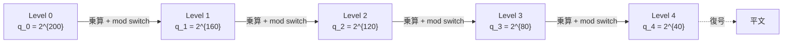

**日付**: 2026年4月24日
**学習内容**: Article 8 で見たように、乗算のたびにノイズは **指数的** に増える。このノイズを放置すると復号が失敗する。FHE の実用化に必要だった決定的技術が **モジュラス切り替え (modulus switching)** と **スケーリング (rescaling)**。乗算直後にモジュラス $q$ を **小さく** することで、ノイズを相対的に小さく保つ巧妙な仕組みだ。本記事では **(1) ノイズの解析**、**(2) モジュラス切り替えの原理**、**(3) モジュラス切り替えのアルゴリズム**、**(4) BGV / BFV / CKKS でのノイズ取り扱いの違い**、**(5) Leveled FHE の構成**、**(6) Q と P の概念（モジュラスチェーン）**、**(7) Python 擬似コード**、**(8) Noise budget の計算** を扱う。これで Bootstrapping に行く前の準備が整う。

## 0. 本記事の位置づけ

Article 8 で再線形化により暗号文次数は固定できたが、**ノイズはなお指数的に増える**。このまま放置すると、乗算深さ $L$ が数回で破綻する。

Brakerski-Gentry-Vaikuntanathan (BGV, 2011) が導入した **モジュラス切り替え** は、この問題をエレガントに解決する。

アイデア:

> **「ノイズが大きくなったら、ノイズ自体を小さくする代わりに、モジュラスを小さくして ノイズの相対的大きさ を保つ」**

この単純なトリックで、**Bootstrapping なしで** 深さ $L$ までの計算が可能になる（Leveled FHE）。

構成:

- **第1章**: ノイズの解析
- **第2章**: モジュラス切り替えの原理
- **第3章**: モジュラスチェーン
- **第4章**: BGV の扱い
- **第5章**: BFV の扱い
- **第6章**: CKKS の rescaling
- **第7章**: Leveled FHE
- **第8章**: Python 擬似コード
- **第9章**: Q&A とまとめ

## 1. ノイズの解析

### 1.1 乗算後のノイズ

Article 8 で見たように、乗算後のノイズは:

$$
\nu_{\text{mul}} \approx \frac{\nu_1 \cdot \Delta m_2 + \nu_2 \cdot \Delta m_1 + \nu_1 \nu_2 / \Delta}{\text{(relin contribution)}}
$$

主要項は $\Delta \nu m$ で、**$\Delta = q/t$ のぶんノイズが拡大** する。

### 1.2 ノイズの「絶対値」と「相対値」

ノイズの大きさを考えるとき、2 つの見方がある:

- **絶対値**: $\nu$ そのもの
- **相対値**: $\nu / q$ (モジュラスに対する比率)

復号成功条件は $\nu < q/(4t)$、つまり:

$$
\nu / q < 1/(4t)
$$

**相対値が閾値を超えないこと** が復号成功の本質。

### 1.3 発想の転換

乗算で $\nu$ が $\Delta \nu$ に増えたとする。このとき:

$$
\nu / q \to \Delta \nu / q = \nu / t
$$

**相対値が $t$ 倍に悪化**。

もし同時に **$q$ も $\Delta = q/t$ で割れば**:

$$
\nu / q \to (\nu / \Delta) / (q / \Delta) = \nu / q
$$

**相対値が保たれる**。これが modulus switching の核心。

## 2. モジュラス切り替えの原理

### 2.1 アルゴリズム（BGV 版）

暗号文 $\text{ct} = (c_0, c_1) \in R_q^2$ を、より小さい $q' < q$ 上の暗号文 $\text{ct}' \in R_{q'}^2$ に変換:

$$
c_i' = \text{round}\left(\frac{q'}{q} \cdot c_i\right) \pmod{q'}
$$

各係数を $q'/q$ 倍して四捨五入。

### 2.2 ノイズの変化

変換前の復号式: $c_0 + c_1 s = \Delta m + \nu$

変換後:

$$
c_0' + c_1' s = \frac{q'}{q}(c_0 + c_1 s) + \text{(rounding error)} = \frac{q'}{q}(\Delta m + \nu) + \epsilon
$$

$\Delta' = q'/t$ となるよう新しいスケールで:

$$
= \Delta' m + \frac{q'}{q} \nu + \epsilon
$$

新ノイズ $\nu' = (q'/q) \nu + \epsilon$。

- $\nu$ は $q'/q$ 倍に縮小（$q' < q$ だから）
- ただし丸め誤差 $\epsilon$ が追加（$\epsilon \sim \sqrt{n} \sigma$ オーダー）

**$q'$ を適切に選べば、ノイズが小さく保てる**。

### 2.3 具体例

- 初期: $q = 2^{60}$、$\nu_0 = 100$
- 1 回乗算後: $\nu_1 \approx \Delta \nu_0 \approx 2^{40} \cdot 100$
- モジュラス切り替えで $q \to q' = 2^{40}$:
  $\nu_1' \approx (2^{40}/2^{60}) \cdot \Delta \nu_0 + \epsilon \approx 100 + \sqrt{n} \sigma$

**ノイズが元のレベルに戻る**！（わずかな丸め誤差追加のみ）

これで次の乗算に耐えられる。

## 3. モジュラスチェーン

### 3.1 複数の $q$ を連鎖

FHE スキームは **モジュラスチェーン** を用意:

$$
q_0 > q_1 > q_2 > \cdots > q_L
$$

各レベルで乗算 → 次のモジュラスに切り替え、を繰り返す。



- Level 0 → 1: 乗算 1 回目、切り替え
- Level $L$ で計算終了、復号

### 3.2 $q_i$ の設計

典型的には:

$$
q_L = \text{小さい基底 (e.g. } 2^{40})
$$

$$
q_{i-1} = q_i \cdot p_i
$$

ここで $p_i$ は乗算で増えるぶんの大きさ（ビット数換算で BFV なら数十ビット、CKKS なら $\Delta$ 相当）。

### 3.3 RNS 表現

Article 4 で触れた合成数モジュラス $q = q_0 \cdot q_1 \cdots q_L$ と、**各 $q_i$ が NTT-friendly prime** という設計が、モジュラス切り替えと相性抜群:

- モジュラス切り替え = 一番外側の $q_L$ を **捨てる** だけ
- 実装が速い・シンプル

これを **RNS Form** または **Double-CRT Form** と呼ぶ。

### 3.4 モジュラスチェーン長と $L$

モジュラスチェーン長 $L$ がそのまま **乗算深さ** に対応:

- $L = 5$: 5 回乗算
- $L = 20$: 20 回乗算
- $L$ 固定の設計 = **Leveled FHE**

Bootstrapping は「Level $L$ → Level 0 に戻す」操作（Article 10）。

## 4. BGV の扱い

### 4.1 BGV の特徴

BGV では **平文がモジュラス $t$ の整数**:

$$
m \in R_t, \quad \text{平文空間} = \mathbb{Z}_t[X]/(X^n+1)
$$

暗号文: $c_0 + c_1 s \equiv m \pmod{t}$、$\bmod q$ 上で。

### 4.2 BGV の mod switch

BGV では mod switch 後も平文モジュラス $t$ が保たれる必要がある:

$$
c_i' = \text{round}\left(\frac{q'}{q} \cdot c_i\right) \pmod{q'}
$$

ただし $q'$ を $t \mid q'$ となるよう選ぶ。

### 4.3 BGV の乗算

乗算後、モジュラスを切り替えると **ノイズが管理可能**。

BGV の利点:
- モジュラス切り替えが自然に機能
- ノイズが見通しよく管理できる

BGVの欠点:
- 実装が BFV より複雑
- 平文モジュラス $t$ が小さい必要がある（多項式近似に不利）

## 5. BFV の扱い

### 5.1 BFV の特徴

BFV (Fan-Vercauteren) は BGV の簡略版で、**スケーリング** を使う:

$$
c_0 + c_1 s \equiv \lfloor q/t \rfloor \cdot m + \nu \pmod q
$$

**平文が $\Delta = \lfloor q/t \rfloor$ の「最上位ビット」側にある**。

### 5.2 BFV の乗算

BFV の乗算は **スケーリング付き**:

$$
(c_0 + c_1 s) \cdot (c_0' + c_1' s) = \Delta^2 m m' + \Delta (\text{noise}) + \text{(noise)}^2
$$

両辺を $\Delta$ で割る必要があるが、除算はできないので **$t/q$ を掛けて四捨五入**:

$$
\text{round}\left(\frac{t}{q} (c_0 c_0' + \cdots)\right)
$$

これで $\Delta m m' + \text{(smaller noise)}$ の暗号文。

### 5.3 BFV は mod switch 不要？

**不要**。BFV はスケーリングで自動的にノイズを管理する。初期から $q$ は大きく、乗算ごとに noise budget を消費するだけ。

BGV vs BFV:
- **BGV**: モジュラスチェーンで明示的にノイズ管理
- **BFV**: スケーリング型で単一 $q$ のまま（内部でスケーリング）

どちらも Leveled FHE の主要スキーム。

## 6. CKKS の rescaling

### 6.1 CKKS の特徴

CKKS (Cheon-Kim-Kim-Song, 2017) は **実数/複素数** を扱う FHE。平文を係数ではなく **CKKS encoding** で埋め込む:

$$
\text{encode}: \mathbb{C}^{n/2} \to R_q, \quad z \mapsto \text{poly}
$$

係数には **固定小数点** の実数が乗る。

### 6.2 スケーリングによる精度

CKKS では平文を **スケール $\Delta_c$** で掛けて整数化:

$$
c_0 + c_1 s \approx \Delta_c \cdot m + \nu, \quad m \in \mathbb{C}^{n/2}
$$

ここで $\Delta_c \approx 2^{40}$ 程度（精度 40 bit）。

### 6.3 CKKS の乗算と rescale

CKKS の乗算:

$$
(\Delta_c m)(\Delta_c m') = \Delta_c^2 m m' + \Delta_c (\text{noise})
$$

乗算するとスケールが $\Delta_c^2$ になってしまう。そこで **rescale**:

$$
\text{rescale}(ct) = \text{round}(ct / p), \quad p = q_L / q_{L-1}
$$

これで $\Delta_c^2 \to \Delta_c$ に戻す。**同時にノイズも 1/p に縮小** → 一石二鳥。

### 6.4 CKKS = モジュラス切り替え + スケーリング管理

CKKS の rescale は **モジュラス切り替えそのもの**。違いは:

- BGV/BFV: 平文は整数、精度は完全
- CKKS: 平文は **近似**（丸め誤差あり）、代わりに実数演算ができる

ML 推論など「近似で良い」アプリでは CKKS が圧倒的に速い。

## 7. Leveled FHE

### 7.1 Leveled の設計

「事前に $L$ を決めて、$L$ レベルのモジュラスチェーンを用意する FHE」= Leveled FHE。

- **Bootstrapping 不要** → 高速
- **深い計算** は $L$ を大きくして対応
- **事前に計算深さが分かる場合** に最適

### 7.2 限界

- 一度使った Level は戻せない（Bootstrap なしでは）
- $L$ が大きいと $q$ が巨大 → サイズ増大

### 7.3 実用

**ほとんどの実用 FHE は Leveled モード**で動作。Bootstrapping は必要なときだけ挟む。

例:
- **PPML 推論**: NN の深さ $L = 10 \sim 20$ 程度 → Leveled で十分
- **長時間動くサービス**: 動的に深くなる → Bootstrap 必要

## 8. Python 擬似コード

### 8.1 モジュラスチェーンの設定

```python
# モジュラスチェーンを配列で管理
qs = [2**40, 2**30, 2**25, 2**20]   # q_0, q_1, q_2, q_3
# 累積モジュラス
Q = [qs[0]]
for i in range(1, len(qs)):
    Q.append(Q[-1] * qs[i] // qs[0])   # 簡略化。実際は素数の積

def mod_switch(ct, q_from, q_to, t):
    """暗号文をより小さいモジュラスに切り替え"""
    c0, c1 = ct
    c0_new = np.round(c0 * q_to / q_from).astype(np.int64) % q_to
    c1_new = np.round(c1 * q_to / q_from).astype(np.int64) % q_to
    # 平文モジュラス t を保つための調整は BGV 固有なのでここでは簡略化
    return c0_new, c1_new
```

### 8.2 Leveled 乗算の流れ

```python
# ct1, ct2 が Level 0 (q_0)
def multiply_and_rescale(ct1, ct2, level):
    q_current = Q[level]
    q_next = Q[level + 1]
    
    # 素朴な乗算 + 再線形化
    d0, d1, d2 = mul_no_relin(ct1, ct2, q_current)
    ct_mul = relinearize(d0, d1, d2, rlk, q_current)
    
    # モジュラス切り替えで Level を 1 下げる
    ct_next = mod_switch(ct_mul, q_current, q_next, t)
    return ct_next, level + 1
```

### 8.3 Noise budget の追跡

```python
def noise_budget(ct, sk, q, t):
    c0, c1 = ct
    v = (c0 + poly_mul_mod(c1, sk, n, q)) % q
    # 中心化
    v_signed = ((v + q // 2) % q) - q // 2
    # 平文部分を除いたノイズ
    Delta = q // t
    m_est = np.round(v_signed / Delta).astype(np.int64)
    noise = v_signed - Delta * m_est
    max_noise = np.max(np.abs(noise))
    budget = np.log2(q / (4 * t)) - np.log2(max_noise + 1)
    return budget
```

### 8.4 実行例

```python
# Level 0
ct1 = encrypt(pk, m1)
ct2 = encrypt(pk, m2)
print(f"Initial budget: {noise_budget(ct1, sk, qs[0], t):.1f} bits")

# 乗算 → Level 1
ct_mul, level = multiply_and_rescale(ct1, ct2, 0)
print(f"After mul+rescale: {noise_budget(ct_mul, sk, qs[1], t):.1f} bits")
```

想定される出力:
```
Initial budget: 35.0 bits
After mul+rescale: 28.0 bits
```

1 回乗算で 7 bit 消費。これは **モジュラス切り替えなしの BGV なら数十 bit 消費**、CKKS の rescale なら 数 bit。

## 9. Q&A

### Q1: なぜモジュラスを小さくするとノイズが管理できる？

**ノイズの絶対値が縮んでも、モジュラスも縮めば相対値は変わらない**。しかし「乗算で絶対値が拡大」→「モジュラスを縮めて元に戻す」という組み合わせで、相対値を **保つ** ことができる。

### Q2: モジュラスを何度も切り替えられる？

**モジュラスチェーンの長さまで**。チェーンが尽きたら Bootstrapping が必要。

### Q3: BGV vs BFV、どちらが速い？

**BFV が実装上はシンプル**。BGV はモジュラスチェーンの管理が複雑だが、**高い $t$** を選ぶとBGVの方が効率が良いこともある。SEAL は両方実装している。

### Q4: CKKS の rescale は mod switch と同じ？

**本質的に同じ**。違いは「平文スケールを合わせて整える」処理が入ること。CKKS は毎乗算で必ず rescale する。

### Q5: Noise budget が 0 になるとどうなる？

**復号失敗**。ノイズが $q/(4t)$ を越えると、平文抽出の閾値を越える確率が高くなり、ランダムな値になる。

### Q6: モジュラス切り替えは鍵スイッチを必要とする？

**一部のスキーム（BGV）では必要**。$q$ が変わると、同じ秘密鍵でも「係数の表現」が変わる場合があり、鍵スイッチで調整する必要がある。BFV/CKKS は不要。

## 10. まとめ

### 本記事で学んだこと

- ノイズは乗算で **指数的に増える** が、**相対値** （$\nu/q$）を保てば復号は成功
- **モジュラス切り替え**: 乗算後に $q \to q' < q$ と縮小し、ノイズ絶対値を縮める
- **モジュラスチェーン**: $q_0 > q_1 > \cdots > q_L$ の列を用意し、乗算ごとに Level を下げる
- **BGV**: 明示的モジュラス切り替え
- **BFV**: スケーリング型、内部で自動管理
- **CKKS**: rescale で平文スケールと同時にモジュラスも下げる
- **Leveled FHE**: Bootstrap なしで $L$ レベルまで計算可能

### 次の記事（Article 10）へ

次の記事では、ついに **Bootstrapping** を扱う。$L$ レベルを使い切った暗号文を「リフレッシュ」して、再び新鮮な暗号文に戻す魔法的な操作。Gentry の 2009 年のブレークスルーの核心。その原理、アルゴリズム、そしてなぜ「復号回路を暗号化された状態で実行」が可能なのかを追う。

### 3行サマリ

- 乗算でノイズは増えるが、同時に **モジュラスを縮める** ことで相対値を保つ
- **モジュラスチェーン** $q_0 > q_1 > \cdots > q_L$ を用意 → **Leveled FHE**
- BGV/BFV/CKKS は扱いが違うが、本質は同じ。実用 FHE はほぼ Leveled で動く

---

## 参考文献

- Brakerski, Gentry, Vaikuntanathan. *Fully Homomorphic Encryption without Bootstrapping.* ITCS 2012.
- Fan, Vercauteren. *Somewhat Practical Fully Homomorphic Encryption.* IACR ePrint 2012.
- Cheon, Kim, Kim, Song. *Homomorphic Encryption for Arithmetic of Approximate Numbers.* ASIACRYPT 2017.
- Halevi, Polyakov, Shoup. *An Improved RNS Variant of the BFV Homomorphic Encryption Scheme.* CT-RSA 2019.
