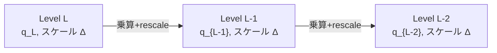

**日付**: 2026年4月24日
**学習内容**: **CKKS (Cheon-Kim-Kim-Song, 2017)** は **実数・複素数の「近似」演算** を可能にした画期的な FHE スキーム。BGV/BFV が整数演算なのに対し、CKKS は浮動小数点計算のように「ある程度の精度」で実数を扱う。代わりに **計算が高速** で、**機械学習の行列演算** に最適。現代 PPML (Privacy-Preserving Machine Learning) で最も使われる FHE スキームである。本記事では **(1) CKKS の発想（"noise = error"）**、**(2) Canonical Embedding によるエンコーディング**、**(3) スケーリング $\Delta$ と精度**、**(4) 加算・乗算・rescale**、**(5) Bootstrapping**、**(6) 実装例 (OpenFHE)**、**(7) 近似誤差と精度の扱い**、**(8) ML 推論への応用** を扱う。

## 0. 本記事の位置づけ

BGV/BFV は整数演算、完全正確。しかし ML の重みや画像ピクセルは **連続値**。これを整数に丸めると精度が落ちる。

CKKS のブレークスルー:

> **「ノイズは誤差だ。ならばノイズそのものを、計算の**近似誤差**として受け入れよう」**

FHE では避けられないノイズを、**浮動小数点の丸め誤差** と同等に見なす。すると:

- 整数しか扱えなかった → **実数・複素数が扱える**
- 精密だった → **近似（数十 bit の精度）**
- 遅かった → **数倍〜数十倍速い**

ML のような「**±0.01 くらいの誤差は OK**」な用途に圧倒的に向く。

構成:

- **第1章**: CKKS の発想と位置づけ
- **第2章**: Canonical Embedding
- **第3章**: スケーリングとエンコーディング
- **第4章**: 暗号化・復号
- **第5章**: 加算・乗算・rescale
- **第6章**: Bootstrapping
- **第7章**: 精度管理
- **第8章**: ML 推論での使用例
- **第9章**: Q&A とまとめ

## 1. CKKS の発想と位置づけ

### 1.1 ノイズを「誤差」と見なす

BGV/BFV では:

$$
c_0 + c_1 s \equiv \Delta m + \nu \pmod{q}, \quad m \text{ は整数}
$$

復号時に $\nu$ を **除去** する（$\Delta m$ だけ残す）。これは「完全に正確な整数計算」。

CKKS では:

$$
c_0 + c_1 s \approx \Delta \cdot m + \nu
$$

ここで **$m$ は実数/複素数**。復号時に $\nu$ を「除去しない」で、代わりに **$\Delta m + \nu$** として読み取る。

### 1.2 精度

もし $\nu$ が小さければ $\Delta m + \nu \approx \Delta m$。**$\nu$ が数 bit 分のノイズなら、$m$ を数十 bit 精度で復元**できる。

典型的には:
- $\Delta = 2^{40}$
- $\nu \sim 2^{10}$
- 精度: $\approx 30$ bit（= 小数点以下 9 桁）

浮動小数点の float (24 bit 精度) や double (52 bit 精度) と同じオーダー。

### 1.3 位置づけ

| スキーム | 平文 | 正確性 | 速度 |
|---|---|---|---|
| BGV/BFV | 整数 | 完全 | 中 |
| **CKKS** | **実数/複素数** | **近似 (30-50 bit)** | **速い** |
| TFHE | ビット | 完全（1bit） | 速い (gate-wise) |

CKKS は ML・統計・信号処理に最適。金融計算のような「1 円もずれてはいけない」用途には不向き。

## 2. Canonical Embedding

### 2.1 エンコーディングの必要性

平文は **$\mathbb{C}^{n/2}$** のベクトル（$n/2$ 個の複素数）。これを多項式 $m(X) \in R$ に埋め込む必要がある。

### 2.2 Canonical Embedding の定義

$\Phi_m(X) = X^n + 1$ の根は $\omega^{2j+1}$（$\omega = \exp(\pi i / n)$、$j = 0, 1, \ldots, n-1$）。$X^n + 1$ の根は **共役ペア** なので、$n/2$ 個の独立な「スロット」に対応。

**Canonical Embedding**:

$$
\tau: R \to \mathbb{C}^{n/2}, \quad m(X) \mapsto (m(\omega_1), m(\omega_2), \ldots, m(\omega_{n/2}))
$$

ここで $\omega_1, \ldots, \omega_{n/2}$ は $X^n + 1$ の根の代表元。

### 2.3 逆変換 (encoding)

逆向き:

$$
\tau^{-1}: \mathbb{C}^{n/2} \to R, \quad (z_1, \ldots, z_{n/2}) \mapsto m(X)
$$

これは FFT 型の変換で計算できる。

### 2.4 SIMD バッチング

結果として、**1 つの暗号文に $n/2$ 個の複素数スロット** が入る。BGV/BFV の SIMD バッチング ($n$ スロット) の半分だが、複素数を扱える利点がある。

実数ベクトル $[a_1, a_2, \ldots, a_{n/2}]$ を扱う場合は、複素数部分を $0$ に。

## 3. スケーリングとエンコーディング

### 3.1 スケーリング因子 $\Delta$

実数 $z \in \mathbb{C}^{n/2}$ をそのまま多項式にすると、係数も実数になる。しかし $R_q$ は整数係数なので、**スケーリング因子 $\Delta$ を掛けて整数化**:

$$
m(X) = \text{round}(\Delta \cdot \tau^{-1}(z))
$$

$\Delta = 2^{40}$ なら、**40 bit 精度** で $z$ を表現。

### 3.2 エンコード/デコード

```
Encode(z, Δ):
    m(X) = round(Δ · τ^(-1)(z))   # integer polynomial
    return m(X) mod q

Decode(m, Δ):
    z' = τ(m) / Δ
    return z'    # 約 z
```

デコード誤差 = **スケーリング + FFT の丸め + ノイズ** で、$\Delta$ が大きいほど精度が高い。

### 3.3 $\Delta$ のサイズ選び

- $\Delta = 2^{40}$: 精度 30-40 bit（ML 推論に十分）
- $\Delta = 2^{55}$: 精度 50 bit（高精度）
- $\Delta$ 大きすぎ: $q$ も大きくする必要、遅い

## 4. CKKS の暗号化・復号

### 4.1 鍵生成

```
s ← R_q (スパース秘密鍵)
(a, b) = (a, -a·s + e)  (公開鍵)
rlk, galois keys  (評価鍵)
```

BFV とほぼ同じ。

### 4.2 暗号化

```
平文: z ∈ C^(n/2)
m(X) = Encode(z, Δ) ∈ R_q
u, e_1, e_2 ← χ
c_0 = b · u + e_1 + m    (mod q)
c_1 = a · u + e_2          (mod q)
ct = (c_0, c_1)
```

ポイント: **$m = \Delta \cdot (\text{真の平文})$** がすでにスケーリング済み。

### 4.3 復号

```
v = c_0 + c_1 · s  (mod q)
     = m + (small noise)
     = Δ · z + ν

z_recovered = Decode(v, Δ) = τ(v) / Δ
```

ここで ν は復号後の「誤差」として混入するが、$\Delta$ で割ると相対的に小さい。

## 5. 加算・乗算・rescale

### 5.1 加算

BFV と同じ:

$$
\text{ct}_1 + \text{ct}_2 = \text{Enc}(\Delta \cdot (z_1 + z_2))
$$

ノイズも足し算 ($\sqrt{2}$ 倍程度)。

### 5.2 乗算

乗算後:

$$
\text{ct}_1 \cdot \text{ct}_2 \to (c_0 c_0', c_0 c_1' + c_1 c_0', c_1 c_1')
$$

再線形化で 2 元に戻す。平文は:

$$
\Delta^2 \cdot z_1 z_2 + \text{(noise)}
$$

**スケールが $\Delta^2$** に。これを放置すると:
- 次の乗算で $\Delta^4$、その次 $\Delta^8$... と指数増加
- モジュラス $q$ が足りなくなる

### 5.3 Rescale

乗算後に **rescale** してスケールを $\Delta^2 \to \Delta$ に戻す:

$$
\text{rescale}(\text{ct}) = \text{round}(\text{ct} / p)
$$

ここで $p$ は mod switch で捨てる素数（$\approx \Delta$）。

Mod switch + scale down を同時に実行。ノイズも $1/p$ 倍に縮小 → **一石二鳥**。

### 5.4 モジュラスチェーン

CKKS では:

$$
q_L = p_L \cdot p_{L-1} \cdots p_1 \cdot q_0
$$

各 $p_i \approx \Delta$。乗算ごとに $p_i$ を捨てて Level を 1 下げる。



### 5.5 深さと精度のトレードオフ

$L$ 回乗算したい場合:

- $q_0 = L \cdot \log_2\Delta$ bit 以上の $q$ が必要
- 例: $\Delta = 2^{40}$、$L = 10$ → $q \geq 2^{400}$
- 当然 $n$ も大きく（16384 以上）

## 6. CKKS の Bootstrapping

### 6.1 Bootstrap の必要性

$L$ レベルを使い切ったら bootstrap が必要。ただし CKKS の bootstrap は **非自明**:

- 平文が実数（整数ではない）
- 「復号回路」を浅く書くのが難しい

### 6.2 CKKS Bootstrap の構造

Cheon-Han-Kim-Kim-Song (2018) の手法:

1. **ModRaise**: モジュラスを $q_{\text{small}} \to q_{\text{large}}$ にブローアップ
2. **SlotToCoeff**: スロット表現を係数表現に変換（FFT 的）
3. **EvalMod**: $\bmod q_{\text{small}}$ 操作を多項式近似（sine 近似）
4. **CoeffToSlot**: 係数表現をスロット表現に戻す

各ステップが多項式評価の深い計算で、合計で **数十 Level 消費**。したがって $L$ はもともと大きく取る必要。

### 6.3 精度の問題

Bootstrap は **数 bit の精度を消耗** する。

- Bootstrap 前: 精度 40 bit
- Bootstrap 後: 精度 35 bit 程度

繰り返し bootstrap すると精度が徐々に落ちる。

### 6.4 実用での速度

OpenFHE (2024) での CKKS bootstrap: **数秒** / バッチ。

ただし **バッチ内** には数千スロットあるので、1 スロットあたりは **ms** オーダー。

## 7. 精度管理

### 7.1 精度ビットの計算

CKKS 計算後の期待精度:

$$
\text{precision} = \log_2(\Delta) - \log_2(\nu) - \log_2(|z|)
$$

ここで $|z|$ は平文の大きさ。**平文が大きい = スケーリングヘッドルームが小さい** ので要注意。

### 7.2 ML での典型設定

NN 推論:

- 入力: 正規化（$|z| < 10$）
- $\Delta = 2^{40}$
- 1 層あたり乗算 1-2 回、加算多数
- 10 層 NN → 乗算深さ $\approx 20$
- 期待精度: 30 bit 以上

### 7.3 数値計算の落とし穴

- **累積誤差**: 数千回の和を取ると誤差が累積
- **異常値**: 平文が大きくなるとノイズとの比率悪化
- **非線形関数**: 多項式近似の誤差が追加

対策:
- 重要な演算ごとに精度チェック
- 必要なら $\Delta$ を動的に増やす

## 8. ML 推論での使用例

### 8.1 線形層 (行列ベクトル積)

暗号化されたベクトル $\text{Enc}(\vec{x})$ と平文重み $W$:

```
ct_x = Encrypt([x_1, x_2, ..., x_n])

# 行列ベクトル積 W x を暗号化のまま計算
# W は平文、x は暗号
for j in range(m):   # 出力の各次元
    y_j = Σ_i W[j, i] * x_i
    # これを全 j について実行 → Enc([y_1, ..., y_m])
```

SIMD バッチングと rotation を駆使すると、$n \times m$ 行列積が **$O(m \log n)$ 乗算** で実行できる。

### 8.2 畳み込み層

画像畳み込みも同様に **ベクトル化** して CKKS で実行。

### 8.3 活性化関数

ReLU, sigmoid を **多項式近似**:

$$
\text{ReLU}(x) \approx a_0 + a_1 x + a_2 x^2 + a_3 x^3
$$

**深い NN** ほど近似誤差が累積するので工夫が必要。

### 8.4 実例: CryptoNets, EVA, MicroCrypto

- **CryptoNets (2016)**: MNIST 分類、推論 300 秒 (CKKS 前身)
- **LoLa (2019)**: MNIST 推論 **0.3 秒**
- **MicroCrypto (2024)**: CIFAR-10 上 ResNet-20 推論 **数十秒**

**ここ5年で 100 倍以上の高速化**。実用段階へ。

## 9. Q&A

### Q1: CKKS は BFV より遅い？速い？

**速い**。CKKS の乗算コストは BFV とほぼ同じだが、**rescale が自動的に noise と scale を管理する** ので、全体計算が効率的。

### Q2: CKKS の精度不足で問題になる？

**アプリ次第**:
- ML 推論: 30 bit で十分（画像分類など）
- 金融計算: 不十分（正確性が必要）

BFV を使えば正確だが遅い。ハイブリッド（CKKS で推論 → BFV で検証）も可能。

### Q3: 複素数を使うメリットは？

**FFT 系の計算** で直接扱える。画像・信号処理の周波数変換、フィルタリングなど。

### Q4: CKKS で除算はできる？

**直接はできない**。ただし:
- **平文定数の除算**: 平文除数を逆数にかけるだけ
- **暗号同士の除算**: 除数の**逆数**を多項式近似（Newton 法などで）

### Q5: CKKS と BFV、どちらを勉強すべき？

**CKKS が現代の主流**。PPML、金融 ML、ヘルスケアなどのほぼすべての新規 FHE 応用が CKKS。

### Q6: CKKS の安全性に特殊な懸念はある？

**あった**。2020 年に Li-Micciancio が「CKKS は IND-CPA だが実際には弱い」という脆弱性指摘。しかしこれは **復号結果を攻撃者に渡す** 特殊設定での話で、通常の運用では問題ない。以降、パラメータ調整で回避されている。

## 10. まとめ

### 本記事で学んだこと

- **CKKS** = 実数・複素数の近似演算 FHE。ML に最適
- **ノイズを丸め誤差として受け入れる** のが発想の転換
- **Canonical Embedding**: 平文 $\mathbb{C}^{n/2}$ → 多項式 $R$
- **スケーリング $\Delta$**: 整数化のための因子。精度を決める
- **Rescale**: 乗算後にスケールを戻す + モジュラス切り替え
- **精度**: 典型 30-40 bit（浮動小数点と同程度）
- **Bootstrapping**: 可能だが重い（数秒）
- **ML 応用**: 画像分類・推論が実用段階に

### 次の記事（Article 13）へ

次の記事では **TFHE** を扱う。BGV/BFV/CKKS が「ベクトル単位で計算」なのに対し、TFHE は「**1 ゲート単位で bootstrap**」。高速 bootstrap (13 ms/gate) と programmable bootstrapping (PBS) で、非線形関数を得意とする。ML の **活性化関数** や **ビット演算中心の計算** に最適。

### 3行サマリ

- **CKKS** は実数・複素数の近似 FHE。**ノイズ = 丸め誤差** と割り切る
- Canonical Embedding + スケーリングで浮動小数点を多項式に埋め込み
- **ML 推論の主役スキーム**。精度 30-40 bit で画像分類など実用段階

---

## 参考文献

- Cheon, Kim, Kim, Song. *Homomorphic Encryption for Arithmetic of Approximate Numbers.* ASIACRYPT 2017.
- Cheon, Han, Kim, Kim, Song. *Bootstrapping for Approximate Homomorphic Encryption.* EUROCRYPT 2018.
- Han, Ki, Kim. *Better Bootstrapping for Approximate Homomorphic Encryption.* CT-RSA 2020.
- Li, Micciancio. *On the Security of Homomorphic Encryption on Approximate Numbers.* EUROCRYPT 2021.
- Lee et al. *Privacy-Preserving Machine Learning with Fully Homomorphic Encryption for Deep Neural Network.* IEEE Access, 2022.
