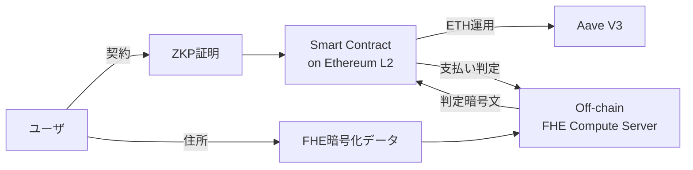

**日付**: 2026年4月24日
**学習内容**: シリーズ最終回。**実運用中の FHE 応用**、**FHE ブロックチェーン (Zama fhEVM, Inco, Fhenix)**、**ZKP・MPC とのハイブリッド**、**ハードウェア加速（FPGA, ASIC, DPRIVE）**、**標準化 (NIST PQC, ISO)**、そして **DeIn のような分散型保険プロトコルへの応用**を総括する。具体的には **(1) 実運用中の FHE 事例**、**(2) FHE ブロックチェーンの現状**、**(3) FHE + ZKP/MPC ハイブリッド**、**(4) ハードウェア加速の現状**、**(5) 規制・標準化**、**(6) DeIn 応用の検討**、**(7) FHE を学ぶ次のステップ**、そして **(8) 15 記事全体のまとめ** を扱う。

## 0. 本記事の位置づけ

Articles 1-14 で FHE の **理論と実装** を学んだ。最終回は:

- 現在どこで使われているか
- これからどこへ向かうか
- 自分のプロジェクト (DeIn など) にどう応用するか

を扱う。

構成:

- **第1章**: 実運用中の FHE 事例
- **第2章**: FHE ブロックチェーン
- **第3章**: FHE + ZKP / MPC ハイブリッド
- **第4章**: ハードウェア加速
- **第5章**: 規制・標準化
- **第6章**: DeIn への応用
- **第7章**: 学び続けるための次のステップ
- **第8章**: 15 記事全体の振り返り

## 1. 実運用中の FHE 事例

### 1.1 Microsoft Edge Password Monitor

ユーザーのパスワードが漏洩したか確認する機能。ユーザーパスワードをサーバに **暗号化したまま** 送り、漏洩 DB と照合。

- 技術: **PSI (Private Set Intersection)**、FHE 要素を含む
- 規模: 億単位のユーザー

### 1.2 Meta Private Lift Measurement

広告効果を測定するため、広告主とFacebookのデータを **クロス集計**。生データを相手に渡さない。

- 技術: **MPC + FHE ハイブリッド**
- 規模: 日次数千万件の広告データ

### 1.3 Apple Secure Routing

iCloud Private Relay で、ユーザーの訪問先 URL を Apple にも中継サーバにも見せない仕組みに **PIR 的技術**。

### 1.4 Duality Technologies

医療データ・金融データの **プライベート解析 SaaS**。

- PPML 推論（暗号化されたまま）
- クロス機関での統計分析
- 銀行・病院・研究機関が顧客

### 1.5 Zama

**fhEVM** と **Concrete ML** を提供する FHE 専業企業。2024 年後半に大型資金調達。

### 1.6 IBM HCV (Homomorphic Encryption Services)

**HElib** をベースにした商用 FHE サービス。金融・ヘルスケア向け。

### 1.7 データポイント

- 2023 年: 世界の FHE 市場規模 $120M
- 2028 年予測: $500M+
- 金融・ヘルスケア・政府で採用が急増

## 2. FHE ブロックチェーン

### 2.1 Zama fhEVM

**Ethereum Virtual Machine 互換** の FHE 環境。Solidity で書いたスマコンの状態変数を暗号化したまま実行。

```solidity
// fhEVM の Solidity 拡張
euint32 secretBalance;   // 暗号化された uint32
euint32 transferAmount;

// 暗号化されたまま算術
secretBalance = TFHE.sub(secretBalance, transferAmount);

// 暗号化された比較
ebool isPositive = TFHE.gt(secretBalance, 0);
```

**採用チェーン**: Inco Network（L1）、Fhenix（Ethereum L2）。

### 2.2 Inco Network

FHE ネイティブな L1 ブロックチェーン。

- **CosmWasm 互換**
- EVM サポート
- 2024 年メインネットローンチ

### 2.3 Fhenix

Ethereum L2（Optimism rollup + FHE）。

- **Solidity ネイティブ**
- テストネット稼働中（2024 時点）
- メインネット 2025 年予定

### 2.4 FHE ブロックチェーンの課題

- **ガス代**: FHE 演算は高コスト。単純な送金で $1〜$10 規模
- **スループット**: TPS は通常のチェーンの 1/100〜1/1000
- **エンジニア体験**: TFHE の制約を理解する必要

**短期的には限定的なユースケース**（プライベート投票、秘匿 DEX、オンチェーン機密オークション）から始まりそう。

## 3. FHE + ZKP / MPC ハイブリッド

### 3.1 Verifiable FHE

**問題**: FHE だけでは「計算結果が正しい」保証がない。悪意あるサーバが嘘の結果を返すかも。

**解決**: FHE 計算に ZKP を付ける。「この暗号文は f(x) を正しく評価した結果です」を証明。

- 研究段階: Rohloff 2022 が先駆的
- 実用化はまだ遠い（ZKP のオーバーヘッドが大きい）

### 3.2 Threshold FHE (FHE + MPC)

**問題**: FHE の秘密鍵を 1 人が持つと、単一故障点。

**解決**: 秘密鍵を **複数者で分散**。過半数の合意で復号。

- 実装: OpenFHE が対応
- 応用: **DAO ガバナンス**, 分散型保険（DeIn のような）

### 3.3 ZK-Rollup + FHE

L2 での **スケーラビリティ + プライバシー** の両立。

- ZK rollup で スケーリング
- FHE でステート秘匿
- 例: Aztec Network (ZK のみ)、Inco (FHE のみ) がそれぞれ部分実装

### 3.4 使い分け

| 技術 | 得意 | 苦手 |
|---|---|---|
| ZKP | 計算の正当性検証、証明のサイズが小さい | データ自体を隠して計算 |
| FHE | データを隠して計算 | 結果の正当性保証 |
| MPC | 複数者入力、応答性が良い | 単一計算者、オフライン計算 |
| TEE | 高速、汎用 | ハードウェア信頼 |

**現実のアプリ**: 多くは 2-3 技術の組み合わせ。

## 4. ハードウェア加速

### 4.1 現状の遅さ

FHE は平文計算比 **1000〜100万倍遅い**（2026 時点）。これを埋めるためのハードウェア開発が活発。

### 4.2 CPU (AVX-512)

**Intel HEXL** ライブラリで、SEAL/OpenFHE のNTTを AVX-512 で加速。**2-5 倍**高速化。

### 4.3 GPU

- **NVIDIA cuHE**, **CryptoPolyBench**
- 巨大な NTT 計算を CUDA で並列化
- 10-30 倍加速

### 4.4 FPGA

- **FPT (Chillotti et al., 2023)**: TFHE bootstrap を FPGA で 20 倍加速
- 電力効率が GPU より良い

### 4.5 ASIC (専用チップ)

**DARPA DPRIVE プログラム** (2020-2025):
- Intel, Duality, Niobium などが開発中
- 目標: **FHE 100〜1000 倍加速**
- 2026 以降に商用化見込み

### 4.6 未来: FHE コプロセッサ

サーバ CPU の横に FHE チップがあり、**FHE 演算だけ出荷** する時代が来る（GPU と AI の関係のように）。

## 5. 規制・標準化

### 5.1 HomomorphicEncryption.org

**標準化コンソーシアム**:
- IBM, Microsoft, Intel, Duality, 学術研究者が参加
- **HE Standard** (2018〜): パラメータ推奨、API 設計

### 5.2 ISO/IEC 18033-8

国際標準化。FHE を含む準同型暗号の標準。現在進行中。

### 5.3 NIST PQC との関係

NIST の Post-Quantum 標準化では **KEM** (Kyber) と **署名** (Dilithium) が先行。FHE は別途。しかし **共通の基盤（格子暗号）** を使うため、将来 FHE も NIST 標準候補に。

### 5.4 EU の GDPR と FHE

**EDPB (欧州データ保護委員会)** は FHE を「**仮名化 (pseudonymization)** の一手段」として認める方向。これにより GDPR 準拠で「暗号化されたデータを第三者に処理させる」法的根拠が明確になる。

### 5.5 日本の個人情報保護法

同様に、**FHE で処理されたデータは「匿名加工情報」に近い扱い** という解釈が研究されている。金融庁・個人情報保護委員会の議論中。

### 5.6 Common Criteria (CC) 認証

FHE 実装の **セキュリティ認証**。SEAL と OpenFHE が取得に動いている。

## 6. DeIn への応用

### 6.1 DeIn の前提

（ユーザー memory より）
- **分散型地震保険**（ETH → Aave → 保険金）
- **ZKP 匿名化** を検討中（物件住所、受取アドレス）

### 6.2 FHE 適用可能性

DeIn で FHE が有効そうな場面:

**（1）契約時の物件住所秘匿**
- ユーザが物件住所を暗号化して契約
- スマコンは暗号化された住所を保持
- 地震発生時に、暗号化された震源マップと突合

**（2）クロス保険者間のリスク集計**
- 複数の保険会社が加入者分布を共有する際
- 各社のデータを暗号化したまま、**地域別リスク係数**を計算
- 個別契約情報は漏れない

**（3）無事故ボーナスの計算**
- 被保険者の過去の自主申告データ（例: 免震工事済み）を暗号化
- 暗号化されたまま割引率を算出
- 保険会社は個別状況を知らない

### 6.3 推奨アーキテクチャ



- **オンチェーン**: ZKP で「契約条件を満たす」を証明、ガス効率重視
- **オフチェーン**: FHE で秘密データの重い計算
- **結果のみオンチェーン**: 暗号化された判定結果をオンチェーン記録

### 6.4 コスト比較

- **フル FHE オンチェーン (fhEVM)**: 契約 1 件あたり $10〜$100 ガス代
- **ZKP + オフチェーン FHE ハイブリッド**: $0.1 〜 $1
- **ZKP のみ**: $0.01 〜 $0.1

**現実解は ZKP メイン + 必要箇所だけ FHE**。FHE を全面採用するのは 2026-2028 に ASIC が普及してから。

### 6.5 規制対応

日本の保険業法は「**被保険者情報の匿名化**」に厳しい。FHE による匿名化は:

- **現時点**: 法的解釈が未確定
- **将来**: 個情法の「匿名加工情報」レベルで扱われる可能性

DeIn の MVP は「**ZKP で匿名化、FHE は V2/V3 で検討**」が現実的。

### 6.6 具体的な次のステップ

DeIn で FHE 実装を始めるなら:

1. **Concrete ML** で簡単な ML 推論（リスクスコアリング）を試す
2. **TFHE-rs** で整数の秘匿集計 POC
3. **fhEVM** で Solidity 拡張の試験
4. 規制・ガス代・速度を総合判定

## 7. 学び続けるための次のステップ

### 7.1 深堀りするリソース

**教科書**:
- Craig Gentry. *Computing Arbitrary Functions of Encrypted Data.* CACM 2010.
- Shai Halevi. *Homomorphic Encryption.* 2017 book chapter.
- Boneh & Shoup. *A Graduate Course in Applied Cryptography.* 第15章

**実装**:
- SEAL / OpenFHE の公式サンプルを全部走らせる
- TFHE-rs のサンプルで暗号化 CPU を作る
- Concrete ML で実際の ML タスク

**論文追跡**:
- IACR ePrint (<https://eprint.iacr.org/>)
- Crypto/Eurocrypt/Asiacrypt 会議
- FHE.org コミュニティ

### 7.2 関連分野との接続

- **ZKP**: 姉妹シリーズで網羅（`zkp-01-introduction.md` 〜 `zkp-33-plinko-pir.md`）
- **MPC**: `mpc-01-introduction.md` 〜 `mpc-15-applications-conclusion.md`
- **格子暗号の基礎**: Regev、Peikert の survey
- **ポスト量子暗号**: NIST PQC、Kyber、Dilithium

### 7.3 コミュニティ

- **FHE.org**: コミュニティの中心
- **Homomorphic Encryption Community Meeting**: 年次
- **Private AI Collaborative Research Institute** (Zama 主催)

### 7.4 ハンズオン体験

- **OpenFHE tutorial** (OpenMined partnership)
- **Zama Concrete ML tutorials**: 実用 ML タスク
- **Awesome Homomorphic Encryption** (GitHub)

## 8. 15 記事全体の振り返り

### 8.1 学習の軌跡

| Article | トピック | 重要ポイント |
|---|---|---|
| 1 | FHE入門 | 「暗号化したまま計算」の夢 |
| 2 | 分類 | PHE / SHE / LHE / FHE |
| 3 | 応用 | PPML, PIR, ブロックチェーン |
| 4 | 数学準備 | 格子・剰余環・多項式環・NTT |
| 5 | LWE | 誤差付き線形方程式、格子問題への還元 |
| 6 | Ring-LWE | 多項式環で効率化 |
| 7 | Regev方式 | 最初の LWE 公開鍵暗号 |
| 8 | 準同型演算 | 加算・乗算・再線形化 |
| 9 | ノイズ管理 | モジュラス切り替え |
| 10 | Bootstrapping | Gentry の決定打 |
| 11 | BGV/BFV | 整数演算 FHE |
| 12 | CKKS | 近似実数演算 FHE、PPMLの主役 |
| 13 | TFHE | Gate bootstrap、PBS |
| 14 | ライブラリ | SEAL, OpenFHE, TFHE-rs, Concrete |
| 15 | 応用・展望 | 実運用・未来 |

### 8.2 3行で FHE を説明するなら

- **完全準同型暗号 = 暗号化したまま加算と乗算ができる暗号**
- **Ring-LWE ベースの暗号文のノイズを Bootstrapping で周期的にリセットすることで任意回の計算を可能にする**
- **BGV/BFV (整数)、CKKS (実数近似)、TFHE (ビット / 高速 bootstrap) の 3 系統があり、用途で使い分ける**

### 8.3 これからの FHE

**短期 (2026-2028)**:
- ハードウェア加速 (ASIC) で **10-100 倍** 高速化
- ブロックチェーン採用が拡大（fhEVM の成熟）
- 金融・医療での商用実装が本格化

**中期 (2028-2033)**:
- クラウド標準機能化（AWS・Azure・GCP がネイティブ対応）
- 規制フレームワーク整備（GDPR、個人情報保護法での位置づけ確定）
- AI モデル推論の事実上の主流に

**長期 (2033+)**:
- 量子計算機実用化 → 格子暗号のさらなる重要性
- **FHE による分散コンピューティング** が常識に
- プライバシー保護が「デフォルト」の世界

### 8.4 最後に

FHE は、**暗号学が「できる」と信じていなかった問題を、30 年かけて解いた**。その結果、**データ主権・クラウド計算・プライバシー保護 AI** という、情報社会の根本的な緊張関係を解消する道が開いた。

現在はまだ「**遅くて重い**」が、ハードウェアの進化とアルゴリズムの改善で、あと 10 年で多くの場面で意識せずに使われる技術になる。

この 15 記事で、その未来を理解する基礎が身についたはずだ。**次のステップは実装**。SEAL か OpenFHE か Concrete を、今日のうちにインストールして、1 行でも動かしてみてほしい。

---

## シリーズ全体の参考文献

### 教科書
- Craig Gentry. *A Fully Homomorphic Encryption Scheme.* PhD Thesis, Stanford, 2009.
- Oded Regev. *The Learning with Errors Problem (Survey).* CCC 2010.
- Shai Halevi. *Homomorphic Encryption.* IBM Research, 2017.
- Daniele Micciancio, Oded Regev. *Lattice-based Cryptography.* In Post-Quantum Cryptography, Springer 2009.

### 主要論文
- Rivest, Adleman, Dertouzos. *On Data Banks and Privacy Homomorphisms.* 1978.
- Gentry. *Fully Homomorphic Encryption Using Ideal Lattices.* STOC 2009.
- Brakerski, Vaikuntanathan. *Efficient FHE from (Standard) LWE.* FOCS 2011.
- Fan, Vercauteren. *Somewhat Practical FHE.* ePrint 2012.
- Cheon, Kim, Kim, Song. *Homomorphic Encryption for Approximate Numbers.* ASIACRYPT 2017.
- Chillotti, Gama, Georgieva, Izabachène. *TFHE: Fast FHE over the Torus.* J. Cryptology 2020.

### 実装・ツール
- Microsoft SEAL: <https://github.com/microsoft/SEAL>
- OpenFHE: <https://github.com/openfheorg/openfhe-development>
- TFHE-rs: <https://github.com/zama-ai/tfhe-rs>
- Concrete: <https://github.com/zama-ai/concrete>
- HElib: <https://github.com/homenc/HElib>
- Lattigo: <https://github.com/tuneinsight/lattigo>

### コミュニティ・リソース
- FHE.org: <https://fhe.org/>
- HomomorphicEncryption.org (Standards): <https://homomorphicencryption.org/>
- Awesome Homomorphic Encryption: <https://github.com/jonaschn/awesome-he>
- Jeremy Kun's FHE blog: <https://www.jeremykun.com/tags/fully-homomorphic-encryption/>
- Daniel Lowengrub. *FHE from Scratch.* <https://www.daniellowengrub.com/blog/2024/01/03/fully-homomorphic-encryption>

### 姉妹シリーズ (articles/ フォルダ内)
- **ZKP 入門シリーズ** (33 記事): `zkp-01-introduction.md` から
- **MPC 入門シリーズ** (15 記事): `mpc-01-introduction.md` から

---

**お疲れ様でした。FHE の旅はここから始まります。**
