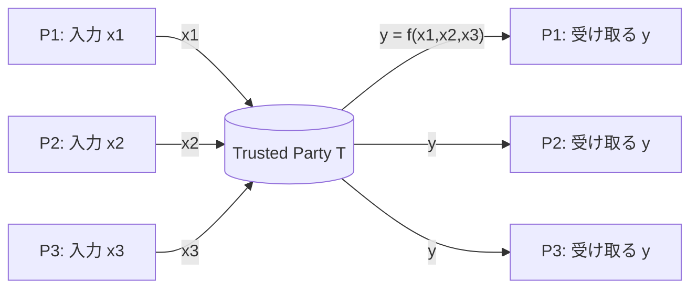
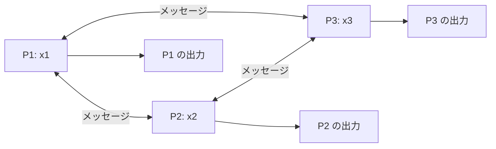
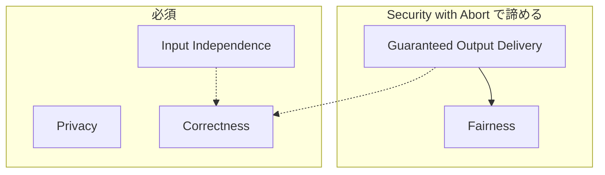
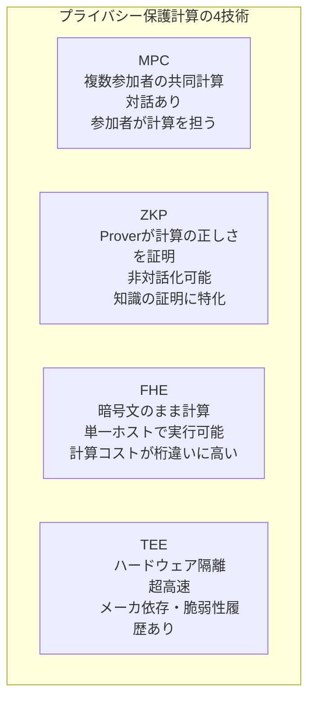
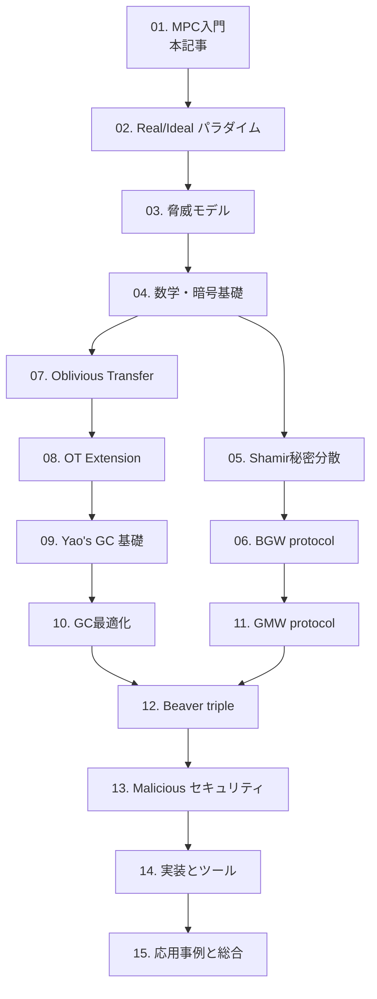

**日付**: 2026年4月24日
**学習内容**: 本記事は「Secure Multi-Party Computation（MPC、秘密計算）」入門シリーズの第1回である。MPCとは、**複数の参加者が、それぞれの秘密入力を他人に一切見せずに、合意した関数の出力だけを共同で計算する**暗号技術のことだ。本記事ではまず Yao の **「百万長者問題（Millionaires' Problem）」** という古典的な例から出発して、MPC が何を実現するのかを直感的につかむ。そのうえで、MPC が満たすべき**プライバシー・正当性・入力独立性**などの性質を概観し、**Danish Sugar Beet Auction、Boston 男女賃金格差調査、Estonian 学生調査**といった実世界デプロイ事例を紹介する。最後に ZKP / FHE / TEE との住み分けと、全15記事のロードマップを示す。

## 0. 本記事の位置づけ

このシリーズの目的は、「**MPCを使えば秘密のまま共同計算ができる**」という漠然としたイメージを、**プロトコルの具体的な数式と構成要素のレベルで理解できる**状態に引き上げることだ。

MPC は 1980 年代に Yao と Goldreich–Micali–Wigderson によって提案されて以来、長らく理論の玩具だったが、2010 年代に入ってから実装が飛躍的に効率化し、**今や産業的に数兆円規模の資産を守るインフラ**として運用されている（Unbound や Sepior、Curv などの閾値暗号プロダクト）。

しかし MPC の文献はしばしば重厚で、最初の1歩を踏み出すのが難しい。本シリーズでは、**15回という限られた回数**で、次の3つを達成することを目標にする:

1. **基礎理論**: Secret Sharing、Oblivious Transfer、Garbled Circuits の3大ビルディングブロックを数式で理解する
2. **セキュリティ定義**: Real/Ideal パラダイムとシミュレーション証明の「気持ち」をつかむ
3. **実装感覚**: Shamir SS や簡易な GC を自分で書けるレベルになる

本記事の構成:

- **第1〜2章**: 百万長者問題と MPC の定義
- **第3〜4章**: MPC が守るべき性質と攻撃のモデル
- **第5〜6章**: 実世界デプロイ事例
- **第7〜8章**: 他技術(ZKP/FHE/TEE)との住み分けと15記事のロードマップ

## 1. 百万長者問題 — Yaoが1982年に投げかけた謎

### 1.1 問題設定

Yao が 1982 年の論文 *"Protocols for Secure Computations"* で提示した例は、いまや MPC の「Hello World」になっている。

> **2人の百万長者 Alice と Bob がいる。どちらの方が資産が多いかを知りたいが、具体的な資産額は絶対に相手に漏らしたくない。しかも信頼できる第三者はいない。どうするか？**

Alice の資産を $x_1$、Bob の資産を $x_2$ とすると、2人が共同で計算したいのは次の関数だ:

$$
f(x_1, x_2) = \begin{cases} 1 & \text{if } x_1 \geq x_2 \\ 0 & \text{otherwise} \end{cases}
$$

直感的には「各自の金額を見せ合って比較すればいい」だが、それでは金額がバレる。「誰かに預けて比較してもらう」は、その「誰か」を信頼する必要がある。**MPCは「信頼できる仲介者を使わずに、仲介者がいたのと同じ結果を得る」技術**だ。

### 1.2 これは単なる玩具ではない

百万長者問題は見かけは些細だが、背後にある構造は豊富だ:

| 応用 | 関数 $f$ | 秘密 |
|---|---|---|
| **封筒入札オークション** | 最高入札額と勝者 | 各人の入札額 |
| **DNA比較** | 類似度スコア | 各人のゲノム |
| **プライベート集合交差(PSI)** | 共通要素 | 各自の集合 |
| **閾値署名** | デジタル署名 | 秘密鍵のシェア |
| **機械学習推論** | 予測結果 | モデル / 入力 |
| **選挙** | 得票集計 | 各人の投票 |

どれも「秘密の入力に対して、ある関数の出力だけを共有したい」という構造を持つ。百万長者問題はその最小例にすぎない。

### 1.3 Yaoの革命的発想

Yao はこの問題に対して、**Garbled Circuits (GC)** という答えを出した。ざっくり言えば:

1. Alice が比較回路 $f$ を **暗号化した形で組み立て** (ガーブル) Bob に送る
2. Bob は暗号化されたまま回路を評価する
3. 最後に出力だけが平文で復号される

この方法では、Alice は自分の $x_1$ を暗号化回路の入力として埋め込み、Bob は **Oblivious Transfer** という仕組みで自分の $x_2$ に対応する「暗号化入力ラベル」だけを取得する。結果、**双方とも相手の入力は一切見ずに、$f(x_1, x_2)$ だけを得られる**。

この3ステップに登場する **Boolean 回路 / Garbled Tables / Oblivious Transfer** こそが、本シリーズの中核技術だ。詳細は第9記事（Yao's GC 基礎）で展開する。

## 2. MPC の定義 — 何を実現する技術か

### 2.1 定義(ゆるい版)

**Secure Multi-Party Computation (MPC)** とは:

> **$n$ 人の参加者 $P_1, \ldots, P_n$ が、それぞれ秘密入力 $x_1, \ldots, x_n$ を持つ。彼らは合意した関数 $f$ を共同で計算し、出力 $y = f(x_1, \ldots, x_n)$ のみを得る。他のプレイヤーの入力については、$y$ から論理的に推論できること以外、何も学んではならない。**

ポイント:

- **参加者は相互に信頼していない**
- **信頼できる第三者(Trusted Third Party、TTP)はいない**
- **各人は自分の入力を他人に見せない**
- **全員が出力 $y$ を得る(または一部のみ)**
- **入力から $y$ を通じて漏れる情報は許容される**(これは MPC の限界でもある)

### 2.2 Ideal World との比較

MPC のセキュリティを定義する基本的な道具が **Ideal World** という思考実験だ。

**Ideal World(理想世界)**: 完全に信頼できる仲介者 $T$ がいる世界。各プレイヤーは入力を $T$ に送り、$T$ が $f$ を計算して出力を返す。

この世界では明らかに何も漏れない。しかし実世界ではこんな $T$ は存在しないから、プレイヤーたちは **プロトコル** を走らせて同等の結果を得る必要がある。

**Real World(現実世界)**: TTPはいない。プレイヤーたちはメッセージをやりとりするだけ。

**MPC が安全である** = **「Real World で攻撃者ができることは、Ideal World で攻撃者ができることと本質的に同じ」**。この定式化を **Real/Ideal パラダイム** と呼び、次回(Article 2)で詳細に扱う。

### 2.3 Functionalityという抽象

MPC では、計算したい関数を **Functionality(機能)** $\mathcal{F}$ と呼ぶ。これは単なる関数ではなく、「TTPのように振る舞う理想的プロセス」と考えると分かりやすい。

例:

- $\mathcal{F}_{\text{compare}}$: 2つの入力を受け取り、大小を返す
- $\mathcal{F}_{\text{sum}}$: $n$ 個の入力を受け取り、合計を返す
- $\mathcal{F}_{\text{PSI}}$: 2つの集合を受け取り、共通要素を返す
- $\mathcal{F}_{\text{OT}}$: 「1-out-of-2 Oblivious Transfer」自身も MPC の一つ

**MPC の究極目標は、「任意の $\mathcal{F}$ を効率的に実現するプロトコル」**であり、これは理論的には可能であることが 1987 年に Goldreich-Micali-Wigderson によって示されている(GMW Completeness Theorem)。

## 3. MPC が守るべき性質

MPC プロトコルには、守るべき5つの性質がある。すべて満たすのが理想だが、**効率や不可能性定理の制約でトレードオフが発生する**。

### 3.1 Privacy(プライバシー)

**「各プレイヤーは、自分の出力以外何も学ばない」**

オークションなら、「勝者と落札額」だけが分かり、**負けた入札者の具体的な入札額**は漏れない。DNAマッチングなら、「適合度スコア」だけが分かり、相手のDNA配列は分からない。

### 3.2 Correctness(正当性)

**「各プレイヤーが受け取る出力は、必ず $f$ の正しい計算結果である」**

悪意あるプレイヤーがプロトコルを捻じ曲げても、正直なプレイヤーが受け取る出力は正しくなければならない。

### 3.3 Input Independence(入力独立性)

**「悪意ある攻撃者は、正直な参加者の入力に依存する形で自分の入力を選べない」**

意外に見落とされる性質だ。たとえばオークションで、攻撃者が「正直な参加者の入札に $+1 \text{ドル}$ する」という入札を作れてしまうと、システムは破綻する。暗号化だけでは防げないこともある(例: 加法準同型暗号だと暗号文のまま $+1$ できる)。

### 3.4 Guaranteed Output Delivery(保証された出力配送)

**「悪意あるプレイヤーが途中で抜けても、正直なプレイヤーは必ず出力を得る」**

これは強い性質で、常に実現できるわけではない。

### 3.5 Fairness(公平性)

**「悪意あるプレイヤーが出力を得るなら、正直なプレイヤーも必ず出力を得る」**

Guaranteed Output Delivery → Fairness(逆は不成立)。

**重要な不可能性**: Cleve (1986) によれば、**過半数が悪意ある場合(dishonest majority)、完全な Fairness を持つプロトコルは存在しない関数がある**(例: 2者間の公平なコイン投げ)。だから 2PC や dishonest majority MPC ではしばしば **Security with Abort**(攻撃者は出力を得られるが、正直者は `⊥` を得るかもしれない) で妥協する。

### 3.6 5つの性質の関係

## 4. 攻撃モデル — 誰が、どれだけ悪さをするか

MPC のセキュリティは、**攻撃者(adversary)のモデル** に強く依存する。

### 4.1 敵対行動のタイプ

**Semi-Honest(半正直、Honest-but-Curious)**:
プロトコルは忠実に従うが、受信したメッセージを解析して秘密を盗もうとする。
→ 弱い敵対モデルだが、内部犯やログ漏洩への防御に有効。

**Malicious(悪意、Active)**:
プロトコルから任意に逸脱できる。偽のメッセージを送り、結託し、何でもする。
→ 強い敵対モデル。現実のブロックチェーンや金融システムで必要。

**Covert(隠密)**:
悪意があるが、**検出されると評判を失うため、確率的に抑止される**。
→ Semi-Honest と Malicious の中間。Aumann-Lindell (2007)。

### 4.2 腐敗戦略

**Static(静的)**: プロトコル開始前に、どのプレイヤーが悪意あるか決まっている。

**Adaptive(適応)**: 攻撃者はプロトコル実行中に、情報を見ながら新たなプレイヤーを腐敗させられる。

**Proactive(プロアクティブ)**: プレイヤーは時間とともに腐敗したり、クリーンになったりする。鍵管理で使われる。

### 4.3 腐敗の量

- **$t < n/3$**: 情報理論的に完全なMPCが可能(Ben-Or–Goldwasser–Wigderson 1988)
- **$t < n/2$(honest majority)**: 公平性と出力保証を含む完全なMPCが可能
- **$t \geq n/2$(dishonest majority、含 2PC)**: Security with Abort で妥協。現実のほとんどのデプロイはここ

この階層は第3記事で詳しく扱う。

## 5. 実世界デプロイ事例 — MPCは既に動いている

MPC は理論だけでなく、既に大規模な実世界システムで稼働している。代表例を5つ挙げる。

### 5.1 Danish Sugar Beet Auction(2008)

デンマークのビート生産契約を、**3者間MPC**で競売した世界初の商用MPCデプロイ。

- 参加者: 生産者協会 DKS、製糖会社 Danisco、SIMAPプロジェクト(研究者)
- 関数: 二重オークションの市場価格決定
- プレイヤー数: 1200 農家の入札
- 使用技術: Shamir Secret Sharing ベースの BGW プロトコル(第6記事で扱う)

農家は自分のコスト情報を製糖会社に知られたくなかった。製糖会社も市場操作を疑われたくなかった。**MPC がなければ成立しなかった市場**だ。この成功が Partisia 社の創業につながった。

### 5.2 Boston 男女賃金格差調査(2017)

ボストン市と Boston Women's Workforce Council が、166,705 人の従業員・114 社の給与データを **MPCで集計**。

- 参加企業は個別の給与情報を公開したくない
- 市は男女/人種別賃金格差の統計を知りたい
- Boston 大学の研究者が Web-based MPC 集計ツールを開発

結果、**ボストンの賃金格差は米国労働統計局の推定より大きい**ことが判明。MPC が社会的課題の解決に使われた好例。

### 5.3 Estonian 学生調査(2015)

エストニア政府が、**IT学生の43%が卒業できない問題**の原因を調べた。「働きながらの学生は中退しやすいか？」という仮説を、**税務データと教育データをMPCでクロス分析**。

- データ所有者: 教育省、税務委員会
- プライバシー法制で直接のデータ共有は禁止
- 3者間 MPC(Cybernetica 社の Sharemind フレームワーク)

結果、**「働きながらの学生でも中退率は変わらない」「より多く学ぶほど高収入」**という、従来の仮説を覆す知見が得られた。

### 5.4 暗号鍵の管理 — Threshold Cryptography

Unbound、Sepior、Curv(現 PayPal 傘下)、Fireblocks などの企業が、**MPCで秘密鍵を分散管理する**プロダクトを展開。

- 典型例: ECDSA秘密鍵を $n$ 個のサーバに分散
- **どの単一サーバも鍵を保持しない**
- 署名は MPC プロトコルで実行される
- 暗号資産カストディで数十億ドル規模の資産を守る

この用途では、**Proactive Security** モデル(定期的に鍵シェアをリフレッシュ)が重要になる。

### 5.5 Google の広告コンバージョン計測 (2019〜)

Google は **Private Intersection-Sum** という MPC を使って、「広告を見た人と購買した人の交差人数」を計算している。広告主の顧客リストも、Google の閲覧者リストも、相手に渡さずに交差数だけを得る(Ion et al. 2017)。

これは次の第3の柱、**Private Set Intersection(PSI)** の代表的応用だ。

## 6. 少し形式化する

直感を数式で書くと、MPC の 2 者版は次のようになる。正直な Prover / Verifier の類推で、正直な $P_1, P_2$ と敵対者 $\mathcal{A}$ を定義する。

- **正しさ**: 正直な $P_1, P_2$ が入力 $x_1, x_2$ で実行すると、両者は $f(x_1, x_2)$ を得る。

$$
\Pr[\mathsf{Real}_{\pi}(x_1, x_2) = (y, y)] = 1 \quad \text{where } y = f(x_1, x_2)
$$

- **プライバシー(Semi-Honest版)**: 腐敗した $P_i$ の「視点」$\mathsf{View}_i$ は、$(x_i, y)$ だけから多項式時間で**シミュレート**できる。

$$
\mathsf{View}_i^{\pi}(x_1, x_2) \approx_c \mathsf{Sim}_i(x_i, f(x_1, x_2))
$$

- **正当性(Malicious版)**: 任意の攻撃者 $\mathcal{A}^*$ が $P_i$ を乗っ取って Real World で実行した結果は、Ideal World でなんらかの入力 $x_i^*$ を選んで実行した結果と区別不能。

$$
\{\mathsf{Real}_{\pi, \mathcal{A}^*}(x_1, x_2)\} \approx_c \{\mathsf{Ideal}_{\mathcal{F}, \mathsf{Sim}}(x_1, x_2)\}
$$

この定式化が **シミュレーションパラダイム** だ。詳細は次の記事(Article 2)で扱う。

## 7. ZKP / FHE / TEE との住み分け

MPC はプライバシー保護計算の選択肢の1つであり、ZKP(ゼロ知識証明)、FHE(完全準同型暗号)、TEE(信頼実行環境、Intel SGX等)と並ぶ。違いを整理しよう。

| 側面 | MPC | ZKP | FHE | TEE |
|---|---|---|---|---|
| **参加者** | $n \geq 2$ | 1対1(Prover-Verifier) | 1(アウトソース) | 1(ホスト+エンクレーブ) |
| **対話** | 多い | 非対話化可 | 非対話 | なし |
| **計算コスト** | 中 | 高(Prover側) | 超高 | 低 |
| **通信コスト** | 高 | 低 | 中 | 極低 |
| **信頼の根拠** | 暗号+非結託仮定 | 暗号 | 暗号 | ハードウェア+ベンダ |
| **典型応用** | 閾値署名、共同分析 | zkRollup、KYC | アウトソースDB | 機密コンピューティング |

### 7.1 ZKP と MPC の関係

興味深いことに、**ZKPはMPCの特殊ケース**として定義できる。ZKPの「Prover が秘密 $w$ で $C(w)=1$ を示す」というタスクは、2者間MPCで $f(w, \bot) = C(w)$ を計算する問題と同型だ。実際、**JKO プロトコル**(Jawurek-Kerschbaum-Orlandi 2013)は、Yao's GC を使って効率的な ZKP を構築する。

逆に、**MPC の中で ZKP を部品として使う**こともある。Malicious セキュリティを達成するために、各プレイヤーに「自分は正しく動いた」ことを ZKP で証明させる(GMW Compiler)。

### 7.2 FHE + MPC

**マルチキーFHE** を使えば、$n$ 者でも FHE の恩恵を受けられる(López-Alt et al. 2012)。ただし FHE は現時点で実用的には MPC より 3〜4 桁遅い。**帯域が高価だが計算が安い環境**(広域通信等)では FHE が優位になる可能性があり、研究は進行中。

## 8. 15記事のロードマップ

本シリーズは以下の流れで進む:

大まかに:

- **Phase 1 (Article 1-4)**: 基盤 — MPC とは何か、セキュリティ定義、数学の準備
- **Phase 2a (Article 5-6)**: 秘密分散系 — Shamir, BGW
- **Phase 2b (Article 7-8)**: OT — 1-out-of-2 から OT Extension まで
- **Phase 3 (Article 9-12)**: 汎用プロトコル — GC, GMW, Beaver triple
- **Phase 4 (Article 13)**: Malicious への強化
- **Phase 5 (Article 14-15)**: 実装と応用

各記事で扱うトピックは、必ず直前までの記事で導入された道具で説明できるよう設計している。

## 9. Q&A — よくある疑問

### Q1: MPC と暗号化はどう違うの？

**暗号化**は「データを他人に読まれないようにする」技術。**MPC**は「データを暗号化したまま、あるいは分散したまま、計算を実行する」技術。MPCは内部で暗号化を使うが、ゴールが違う。

### Q2: 全員が悪意なら守れないのでは？

**その通り**。MPCが守るのは**正直な少なくとも1人**の利益。全員が結託したら守るべき秘密がそもそも存在しないので、問題にならない。

### Q3: 出力から入力が推測できるなら意味ないのでは？

**これはMPCの限界**として明示的に認められている(Lindell 2020: "MPC secures the process, but not the output")。2人が平均給与を計算すると、一方の給与が自分の給与と平均から逆算できる。**「何を計算すべきか」の判断は MPC の外側の問題**で、必要に応じて**差分プライバシー**などと組み合わせる。

### Q4: ブロックチェーンで MPC は使えるの？

**使える**。代表例は**閾値署名**(ECDSA, EdDSA, BLS)で、ウォレットの秘密鍵を複数ノードに分散する。Coinbase、PayPal (Curv)、Fireblocks などが採用している。dark pool 取引、DAO ガバナンス、非公開投票など、公開台帳上のプライバシー拡張としても研究されている。

### Q5: MPC のコストはどのくらい？

**関数と脅威モデル次第**。2024年時点で、Semi-Honest 2PC(LAN)なら**数百万ゲート/秒**、Malicious 3PC (honest majority, LAN)なら**10億ゲート/秒**も可能(Araki et al. 2017)。プレーンテキスト計算よりは数倍〜数桁遅いが、**実用システムで十分動く**レベル。Article 14 で数値比較する。

### Q6: Semi-Honest で運用していいの？

**状況次第**。内部の信頼があるコンソーシアム(例: 同じクラウド内の部署間)や、一時的なデータ共有なら Semi-Honest で十分な場合が多い。ただし**金融・医療・ブロックチェーンでは Malicious モデルが事実上必須**。本シリーズは両方を扱う。

### Q7: MPC vs TEE はどちらが安全？

**脅威モデルが違う**。MPC は非結託を仮定するが暗号的に完全。TEE は単一ホストで動くが、ベンダ(Intel等)とハードウェアを信頼する必要がある。2018年以降の Meltdown、Foreshadow などの攻撃で SGX には多くの脆弱性が発見されており、**高価値資産にはMPCが好まれる**傾向にある。

## 10. まとめ

### 本記事で学んだこと

- **MPC** は、$n$ 人の参加者がそれぞれの秘密入力を保ったまま、合意した関数の出力を共同計算する技術
- **百万長者問題**が最小例。Yao は 1982 年に **Garbled Circuits** という答えを出した
- MPC が守るべき性質: **Privacy, Correctness, Input Independence, Guaranteed Output Delivery, Fairness**
- 脅威モデル: **Semi-Honest, Malicious, Covert** × **Honest/Dishonest Majority**
- 実世界デプロイ: Danish Sugar Beet、Boston 賃金格差、Estonian 学生調査、閾値暗号(PayPal/Fireblocks)、Google 広告コンバージョン
- 他技術との住み分け: **MPC vs ZKP vs FHE vs TEE**

### 次の記事(Article 2)へ

次の記事では、MPC の**セキュリティ定義**を掘り下げる。中心は **Real/Ideal パラダイム** と **シミュレーション証明**。

- Ideal World とは何か、なぜ「理想」なのか
- Real World との区別不能性で安全性を定義する流儀
- シミュレータ $\mathsf{Sim}$ の役割と構築方法
- Semi-Honest と Malicious での証明の違い
- Sequential Composition と Universal Composability (UC) の一歩手前まで

### 3行サマリ

- **MPC = 複数者が秘密入力のまま合意関数を計算する技術**
- **守るべきはプライバシー、正当性、入力独立性(+公平性)**
- **2024年時点で実世界デプロイ多数 — 閾値署名、賃金格差調査、オークション、広告分析**

---

## 参考文献

- Andrew C. Yao. *Protocols for Secure Computations*. FOCS 1982.
- Oded Goldreich, Silvio Micali, Avi Wigderson. *How to Play any Mental Game*. STOC 1987.
- Yehuda Lindell. *Secure Multiparty Computation (MPC)*. IACR Cryptology ePrint 2020/300.
- David Evans, Vladimir Kolesnikov, Mike Rosulek. *A Pragmatic Introduction to Secure Multi-Party Computation*. NOW Publishers, 2018.
- Peter Bogetoft et al. *Secure Multiparty Computation Goes Live* (Danish sugar beet). FC 2009.
- Azer Bestavros, Andrei Lapets, Mayank Varia. *User-centric Distributed Solutions for Privacy-preserving Analytics*. CACM 60(2), 2017.
- Mihai Ion et al. *Private Intersection-Sum Protocol with Applications to Attributing Aggregate Ad Conversions*. IACR ePrint 2017/738.
