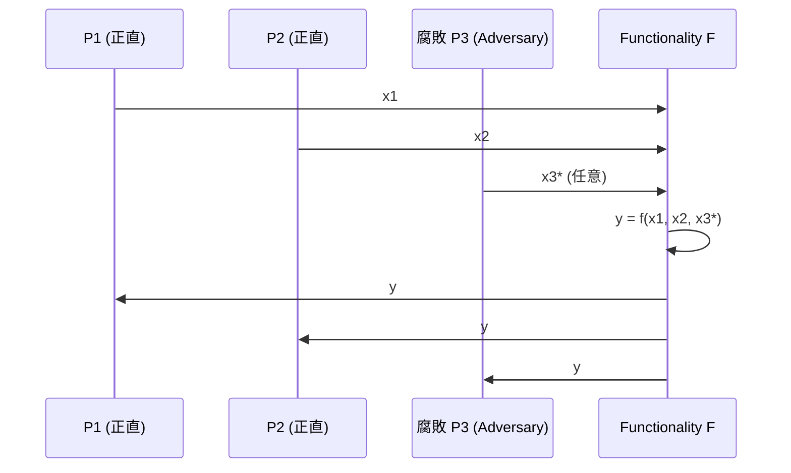
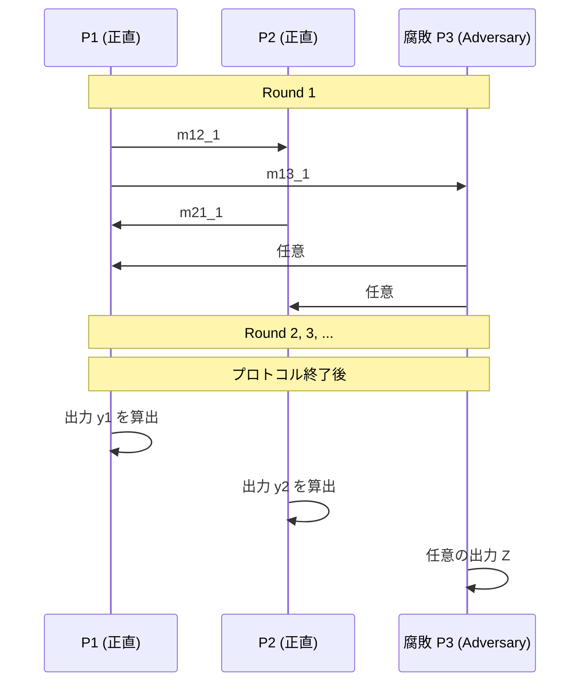
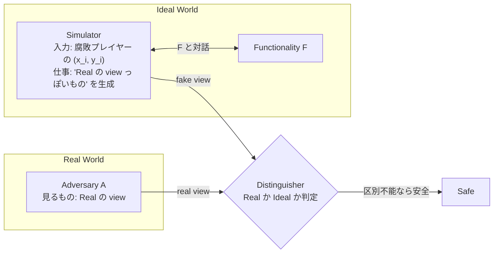
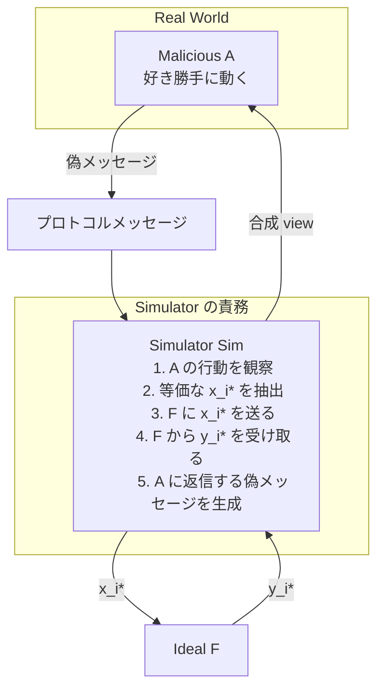

**日付**: 2026年4月24日
**学習内容**: MPC の安全性は、**「実プロトコル(Real World)は、信頼できる仲介者がいる世界(Ideal World)と区別がつかない」** という形で定義される。本記事では、この **Real/Ideal パラダイム** を丁寧に解きほぐす。具体的には (1) 関数とファンクショナリティ $\mathcal{F}$ の違い、(2) Ideal World での理想的実行、(3) Real World での実プロトコル実行、(4) **シミュレータ $\mathsf{Sim}$** という架け橋の役割、(5) Semi-Honest と Malicious の定義の違い、(6) **View と Output** という2つの確率変数、(7) Computational vs Statistical Indistinguishability、の順に扱う。最後に「なぜこのやり方が『laundry list(要件羅列)』よりも優れているか」を議論する。

## 0. 本記事の位置づけ

Article 1 で、MPC は「信頼できる仲介者なしに仲介者と同じ結果を得る」技術だと述べた。本記事はその「同じ結果」を数学的に厳密に定義する回だ。

安全性の定義は、**プロトコルが安全かどうかを判定する基準**を与えるものだから、定義を誤るとプロトコル全体が無意味になる。たとえば「秘密を漏らさない」を「相手が秘密の値を当てる確率が低い」と定義してしまうと、「秘密の上位 $k$ ビットは漏れるが下位 $n-k$ ビットで守られる」ような不完全な定義になってしまう。

**Real/Ideal パラダイム**は、こうした定義漏れを起こしづらい、**包括的で頑健**な定義の流儀だ。ZKP の「ゼロ知識性」と本質的に同じ発想で、MPC ではさらに一般化された形で使われる。

本記事の構成:

- **第1〜2章**: laundry list アプローチの限界と Real/Ideal の発想
- **第3〜4章**: Ideal World と Real World の定義
- **第5〜6章**: シミュレータと Semi-Honest の定義
- **第7〜8章**: Malicious の定義と composition
- **第9章**: Q&A

## 1. なぜ「要件を列挙する」だけではダメなのか

### 1.1 Laundry list の誘惑

Article 1 で挙げた MPC の5性質(Privacy, Correctness, Input Independence, Guaranteed Output Delivery, Fairness)を見て、「これらを満たせば安全」と素朴に定義したくなる。これを **laundry list(洗濯リスト)** アプローチという。

しかし、laundry list には2つの致命的な弱点がある:

**弱点1**: 列挙漏れが常に起きる。新しい攻撃が見つかれば、リストを更新しなければならない。たとえば 1986 年時点では Coercion Resistance(投票で他人から強制されない性質)は知られていなかった。

**弱点2**: 各要件を厳密に形式化するのが難しい。「Privacy」は具体的に何を意味するのか? 「攻撃者が秘密を当てる確率が $1/2^n$ 以下」? でも攻撃者が秘密の偶奇だけを当てたらどうする?

**簡単な例**:
2者間 MPC で「$f(x_1, x_2) = x_1 + x_2$」を計算するとする。プロトコルAは $P_2$ に $x_1$ を直接送ってから $P_2$ が計算する。プロトコルBは、$P_1$ と $P_2$ が Shamir SS で協調計算する。どちらも出力は同じ $x_1 + x_2$ だが、**A はプライバシーを破っている**。

Laundry list なら「A は $P_2$ が $x_1$ を見るからNG」と言えるが、**どんな情報でも、出力から論理的に逆算できる情報は漏らしてよい**というケースではどうか? たとえば $f(x_1, x_2) = x_1$(片方の入力そのもの)を計算する関数では、「$P_2$ が $x_1$ を知る」ことは不可避だ。

**「漏れていい情報」と「漏れてはいけない情報」を関数ごとに正確に区別する**には、違うアプローチが必要だ。

### 1.2 Real/Ideal の発想

Real/Ideal パラダイムの核心は次の一文だ:

> **実プロトコル(Real)を走らせて攻撃者が手に入れる情報は、理想的な仲介者を使った実行(Ideal)で攻撃者が手に入れる情報と本質的に同じでなければならない**

Ideal World では攻撃者は「入力を送り、出力を受け取る」しかできない。だから **Ideal World の攻撃者が手に入れる情報は、出力 $y$ と自分の入力だけ**。これが「漏れてよい情報の上限」を自動的に定義してくれる。

あとは「Real で攻撃者が見たもの」と「Ideal で攻撃者が見たもの」が **区別不能** であることを示せば、プロトコルは安全だ。

この定義は:

- **完全性**: 列挙漏れがない(Ideal World で不可能な攻撃は、そもそも定義上不可能)
- **一般性**: 任意の関数 $f$ に対して、一貫した基準を与える
- **構成性**: 後述するように、複数のプロトコルを合成しても安全性が保たれる(Composition theorem)

この発想を最初に MPC に持ち込んだのは Goldreich-Micali-Wigderson (1987)。その前身は ZKP のシミュレーション定義(Goldwasser-Micali-Rackoff 1985)だ。

## 2. 前提の整理 — 関数 vs ファンクショナリティ

### 2.1 関数 $f$

単純な場合、MPC が計算したいのは関数 $f: X_1 \times \cdots \times X_n \to Y_1 \times \cdots \times Y_n$ で、各入力 $x_i$ に対して出力 $y_i = f_i(x_1, \ldots, x_n)$ を返す。

例:
- $f(x_1, x_2) = (x_1 + x_2, x_1 + x_2)$: 両者に合計を返す
- $f(x_1, x_2) = (x_1 \geq x_2, x_1 \geq x_2)$: 百万長者問題
- $f_{\mathsf{PSI}}(S_1, S_2) = (S_1 \cap S_2, S_1 \cap S_2)$: Private Set Intersection

### 2.2 ファンクショナリティ $\mathcal{F}$

より一般には、状態を持つ **ファンクショナリティ** を考える。これはラウンドを重ねて入力を受け付け、内部状態を持ち、段階的に出力を返す **理想的なプロセス** だ。

例:
- $\mathcal{F}_{\mathsf{commit}}$: Alice から値 $v$ を受け取り内部に保存。後で Alice が "open" と送ると Bob に $v$ を送る
- $\mathcal{F}_{\mathsf{OT}}$: Sender から $(m_0, m_1)$、Receiver から $b$ を受け取り、Receiver に $m_b$ を送る
- $\mathcal{F}_{\mathsf{ZK}}$: Prover から $(x, w)$ を受け取り、$R(x, w) = 1$ なら "proven" を Verifier に送る

ファンクショナリティは **MPC の設計目標**を表現する言語だ。「このプロトコルは $\mathcal{F}$ を安全に実現する」という形で安全性を主張する。

## 3. Ideal World — 理想的実行の定義

### 3.1 登場人物

Ideal World には以下の3種類のエンティティがある:

- **正直な参加者** $P_i$: 自分の入力 $x_i$ を正直に $\mathcal{F}$ に送る
- **腐敗した参加者**(Adversary $\mathcal{A}$ が乗っ取り): $\mathcal{A}$ が代わって行動する
- **ファンクショナリティ $\mathcal{F}$**: 全入力を受け取り、$y = f(x_1, \ldots, x_n)$ を計算し、各プレイヤーに $y_i$ を返す

### 3.2 実行フロー

ここで $\mathcal{A}$ は:

1. 腐敗した参加者の入力 $x_3^*$ を**自由に選べる**(正直な参加者の入力には依存せずに)
2. $\mathcal{F}$ から自分の出力 $y$ を受け取る
3. 任意の**最終出力** $Z$ を生成する(自分の view を分析した結果など)

### 3.3 Ideal World 実行の定義

形式的に、Ideal World での実行を確率変数として:

$$
\mathsf{IDEAL}_{\mathcal{F}, \mathcal{A}, I}(\vec{x}) := (\text{honest parties' outputs}, \mathcal{A}\text{'s output})
$$

- $I \subseteq \{1, \ldots, n\}$ は腐敗したプレイヤー集合
- $\vec{x} = (x_1, \ldots, x_n)$ は全入力
- 右辺は $n + 1$ 個の確率変数の tuple

この Ideal World では **5性質がすべて自動的に満たされる**(Article 1 の §3 参照)。したがって、Real World プロトコルがこれを「模倣」できれば、そのプロトコルも同じ性質を持つ。

### 3.4 Security with Abort の Ideal World

2者間 MPC(や dishonest majority)では Fairness が不可能なので、Ideal World を少し弱める。具体的には:

1. 全員が入力を $\mathcal{F}$ に送る
2. $\mathcal{F}$ が $y$ を計算し、**先に腐敗プレイヤーに** $y$ を返す
3. $\mathcal{A}$ は "deliver" または "abort" を $\mathcal{F}$ に送る
4. "deliver" なら正直な参加者も $y$ を受け取る。"abort" なら正直な参加者は $\bot$ を受け取る

この修正版 Ideal World を使うのが **Security with Abort** の定義だ。Article 1 の最後の例「悪意あるプレイヤーだけが出力を得る」ケースを明示的に許容する。

## 4. Real World — 実プロトコルの定義

### 4.1 プロトコル $\pi$

$n$ 者間プロトコル $\pi$ は、各プレイヤー $P_i$ の **next-message function** $\pi_i$ の組で定義される:

$$
\pi_i: \text{(入力 } x_i, \text{乱数 } r_i, \text{これまで受信したメッセージ} ) \to \text{次に送るメッセージ(と宛先)または出力}
$$

つまり各プレイヤーは決定論的な関数(乱数 $r_i$ を固定すれば)で、次に何を送るかを決める。

### 4.2 実行フロー

Semi-Honest の場合、$\mathcal{A}$ は腐敗したプレイヤーのプログラムを忠実に実行するが、受け取ったメッセージを保存・解析する。Malicious の場合、$\mathcal{A}$ は任意のメッセージを送りうる。

### 4.3 Real World 実行の定義

$$
\mathsf{REAL}_{\pi, \mathcal{A}, I}(\vec{x}) := (\text{honest parties' outputs}, \mathcal{A}\text{'s output})
$$

記法は Ideal World と対称。同じ $n+1$ 個の確率変数。

### 4.4 キモは確率変数の同時分布

ここで注意したいのは、$\mathsf{IDEAL}$ も $\mathsf{REAL}$ も **tuple 全体の同時分布** を考えること。正直な参加者の出力だけ、あるいは $\mathcal{A}$ の出力だけを見るのではなく、**両者の相関を含めて** 比較する。

たとえば「攻撃者が正直な参加者の出力と逆の値を得る」ような場合、個別の分布は正常でも、同時分布で初めて不整合が検出される。

## 5. シミュレータ — Real と Ideal の橋渡し

### 5.1 なぜシミュレータか

Real と Ideal は、そもそも別の世界だ。Ideal には TTP がいて、Real にはいない。じゃあ「Real が Ideal と同じ」とはどういう意味か?

答えは **シミュレータ** $\mathsf{Sim}$ という概念でつなぐ:

> **Real World の攻撃者 $\mathcal{A}$ が見るもの(view)を、Ideal World だけにアクセスできる $\mathsf{Sim}$ が作り出せる**

つまり、$\mathsf{Sim}$ は Ideal World で $\mathcal{F}$ を呼び出すだけで、$\mathcal{A}$ が Real World で見たようなメッセージ列を合成できる。

もしそんな $\mathsf{Sim}$ が存在するなら、Real で $\mathcal{A}$ が学べることは、Ideal でも学べる(= Ideal の時点で認められた情報しか学べていない)。したがって Real は安全。

### 5.2 シミュレータの役割

### 5.3 シミュレータの型(Semi-Honest版)

Semi-Honest の定義では、$\mathsf{Sim}$ は次の情報だけで動く:

- 腐敗した参加者 $i \in I$ の入力 $x_i$
- 腐敗した参加者 $i$ の正しい出力 $y_i = f_i(\vec{x})$

そして $\mathsf{Sim}$ が生成するのは、**Real World で $\mathcal{A}$ が見たはずの view**(受信メッセージ列と自分の乱数)。

シミュレータの入出力:

$$
\mathsf{Sim}(1^\kappa, I, \{x_i\}_{i \in I}, \{y_i\}_{i \in I}) \to \{\mathsf{view}_i\}_{i \in I}
$$

### 5.4 具体例 — $\mathcal{F}_{\mathsf{OT}}$ のシミュレータ

1-out-of-2 OT で、Sender が $(m_0, m_1)$、Receiver が $b$ を持ち、Receiver が $m_b$ を得る。

**Sender が腐敗**した場合のシミュレーション:
- Ideal: Sender は $(m_0, m_1)$ を $\mathcal{F}$ に送り、何も受け取らない
- Real: Sender は Receiver からランダムに見える公開鍵を受け取り、2つの暗号文を送る
- $\mathsf{Sim}$: $(m_0, m_1)$ を受け取り、2つの「ランダムに見える公開鍵」を自分で生成すれば Real の view を合成できる

**Receiver が腐敗**した場合のシミュレーション:
- Ideal: Receiver は $b$ を送って $m_b$ を受け取る
- Real: Receiver は自分で鍵対を生成し、ダミー公開鍵と混ぜて Sender に送り、2つの暗号文のうち1つを復号する
- $\mathsf{Sim}$: $m_b$ だけ知っている。復号できない方の暗号文として**ランダム文字列**を送れば Real と区別不能

両方向のシミュレーションが成り立てば、OT は Semi-Honest 安全。

## 6. Semi-Honest 安全性の正式定義

### 6.1 定義

**プロトコル $\pi$ は $\mathcal{F}$ を Semi-Honest 敵に対して安全に計算する**とは:

- 任意の腐敗集合 $I \subset \{1, \ldots, n\}$ に対して、多項式時間シミュレータ $\mathsf{Sim}$ が存在して、
- 任意の入力 $\vec{x}$ に対して、次が**計算量的に区別不能**である:

$$
\mathsf{REAL}_{\pi, \mathcal{A}, I}(\vec{x}) \approx_c \mathsf{IDEAL}_{\mathcal{F}, \mathsf{Sim}, I}(\vec{x})
$$

### 6.2 何を $\approx_c$ が意味するか

2つの確率変数の列 $\{X_\kappa\}$ と $\{Y_\kappa\}$ が **計算量的に区別不能** とは:

$$
\forall \text{PPT } D, \exists \text{ negligible } \nu : \left| \Pr[D(X_\kappa) = 1] - \Pr[D(Y_\kappa) = 1] \right| \leq \nu(\kappa)
$$

PPT(Probabilistic Polynomial Time)の攻撃者がどれだけ頑張っても、2つの分布を見分けられる確率の差は無視できるほど小さい。

**Statistical Indistinguishability** はさらに強く、計算量制限のない $D$ に対しても区別不能。情報理論的セキュリティの舞台で使う。

### 6.3 証明の書き方

実際の証明は次の手順を踏む:

1. シミュレータ $\mathsf{Sim}$ を構成する(具体的なアルゴリズム)
2. $\mathsf{Sim}$ が Real World の view を正しく合成できることを示す
3. 区別不能性を仮定(DDH、LWE、RO など)に帰着する

**例: Yao's GC の Semi-Honest 証明**:
- Evaluator 腐敗: $\mathsf{Sim}$ はランダム garbled table を送り、出力 wire label だけ本物と一致させる。区別不能性は PRG(擬似乱数生成器)の安全性から従う
- Generator 腐敗: $\mathsf{Sim}$ は Generator の入力と出力を知っているので、正直な Evaluator の行動を完全に再生できる

詳細は Article 9 で扱う。

## 7. Malicious 安全性の正式定義

### 7.1 何が変わるか

Malicious では $\mathcal{A}$ が任意の行動をとる。特に:

- **偽のメッセージ**を送る
- 自分の**入力を恣意的に選ぶ**(プロトコル開始後でも)
- 途中で**プロトコルを中断**する

Ideal World でも、攻撃者は自由に入力を選べるのだから、これ自体は問題ない。しかし「どの入力を選んだか」を**追跡**する必要がある。

### 7.2 Input Extraction

Malicious シミュレータは、腐敗プレイヤーの行動から **等価な ideal 入力** $x_i^*$ を抽出し、それを $\mathcal{F}$ に送らなければならない。これを **Input Extraction(入力抽出)** という。

### 7.3 定義

**プロトコル $\pi$ は $\mathcal{F}$ を Malicious 敵に対して安全に実現する**とは:

- 任意の Real World 攻撃者 $\mathcal{A}$ に対して、多項式時間シミュレータ $\mathsf{Sim}$ が存在し、$\mathsf{Sim}$ は $\mathcal{A}$ をブラックボックスで使い、
- 任意の honest party の入力 $\{x_i\}_{i \notin I}$ に対して、

$$
\mathsf{REAL}_{\pi, \mathcal{A}}(\{x_i\}) \approx_c \mathsf{IDEAL}_{\mathcal{F}, \mathsf{Sim}}(\{x_i\})
$$

Semi-Honest と違い、**腐敗プレイヤーの入力** は明示的に与えない(Sim が抽出する)。

### 7.4 Output Fairness と Security with Abort

Malicious 定義にはさらに細分がある。攻撃者がプロトコル途中で中断した場合:

- **Security with Identifiable Abort**: 正直な参加者は「誰が中断したか」を知る
- **Security with Abort (標準)**: 正直な参加者は $\bot$ を受け取るだけ
- **Full Security(Fairness付き)**: 攻撃者が出力を得るなら正直者も必ず得る

2 者 MPC と dishonest majority では **Security with Abort** が標準。第13記事で扱う。

## 8. Composition — プロトコルの合成

### 8.1 なぜ合成性が問題か

大きな MPC プロトコルは、しばしば小さなプロトコルの部品として実装される:

- Yao's GC は内部で **OT** を呼ぶ
- Malicious GC は **コミットメント**を使う
- 分散鍵生成は **閾値 VSS** を使う

小さなプロトコルが安全でも、大きなプロトコルに埋め込んだときに安全性が壊れることがある。特に**並列実行**では注意が必要。

### 8.2 Sequential vs Concurrent Composition

**Sequential Composition**: プロトコルは順番に実行される。直感的には安全性が保たれる(Canetti 2000 の古典的定理)。

**Concurrent Composition**: 同時に複数のセッションが走る。ここでは Sequential で安全でも壊れることがある。**Universal Composability (UC)** フレームワーク(Canetti 2001) がこれに対応する最強の定義。

### 8.3 UC framework(1分概説)

UC では Real と Ideal に **Environment $Z$** という第3の実体を追加する。$Z$ はプロトコルの「外側」で任意の入力を生成し、出力を観察する。

- UC-安全: 「$Z$ が Real と Ideal を区別できない」ことを要求
- 並列実行でも壊れない(UC composition theorem)
- ただし **Straight-line simulator**(巻き戻しなし)を要求するため、設計が難しい

本シリーズでは UC の詳細には踏み込まないが、Malicious の文献を読むときに「UC secure」と書いてあったら、このフレームワークでの安全性のことだ。

## 9. Q&A — よくある疑問

### Q1: 区別不能性は「確率が近い」というだけでは?

**本質的にはそう**。ただし「誰が」区別しようとするかで強度が変わる:

- **Perfect**: 同じ分布(誰も区別できない)
- **Statistical**: 計算量無限の敵でも高確率で区別できない
- **Computational**: PPT 敵には区別できない

暗号の標準は Computational。

### Q2: シミュレータは効率的でなければならないの?

**はい**。もし $\mathsf{Sim}$ が超多項式時間で何でもできるなら、たとえば秘密鍵を総当たりで求められて、証明の意味がなくなる。

### Q3: Real と Ideal が完全に同じ分布ならプロトコルは完璧?

**はい、Perfect Security**。ただし 2 者 MPC で汎用関数を Perfect に計算するのは**不可能**(Chor-Kushilevitz 1991など)。妥協として Computational で満足する。

### Q4: シミュレータは「巻き戻し(rewinding)」を使えるの?

**標準の Semi-Honest / Malicious 定義では使える**。$\mathsf{Sim}$ は $\mathcal{A}$ をブラックボックスで呼び出し、不都合なメッセージが来たら内部状態を保存して巻き戻せる。ただし UC では使えない(環境が観察しているから)。

### Q5: View と Output の違いは?

- **View**: 攻撃者が受信したメッセージ列と自分の乱数
- **Output**: プロトコル終了後に計算された最終値

Semi-Honest ではプロトコルを正直に動かすので、View が決まれば Output も決まる。Malicious では攻撃者が任意の Output を生成できる。

### Q6: なぜ Ideal World には Fairness があるのに Real では諦めるの?

**Ideal ではTTPが一括で出力を配るから Fair は自動**。Real では誰かが最後のメッセージを握るので、Fairness は構造上保証できない(Cleve 1986)。Bitcoin のようなインセンティブ機構を使う別研究はあるが、純粋な暗号では限界がある。

### Q7: GMW Compiler って何? シミュレーション証明と関係?

GMW Compiler は、**Semi-Honest プロトコルを Malicious プロトコルに変換する汎用的な手法**。各メッセージに「自分は正しく動いた」の ZKP を付ける。詳細は第13記事。

### Q8: 実際の論文を読むとき、シミュレータの議論をどう追う?

**典型的な読み方**:

1. プロトコルを概観し、どこに「効率のトリック」があるか見る
2. シミュレータのアルゴリズムを書き下している箇所を探す
3. ハイブリッド議論(hybrid argument)で段階的に区別不能を示している
4. 各段階で使われている暗号仮定(DDH、LWE、RO)を特定

慣れれば読むスピードが上がる。Lindell の *How to Simulate It* (2017) が教材として最適。

## 10. まとめ

### 本記事で学んだこと

- **Laundry list アプローチ**(要件列挙)は限界がある。定義漏れと厳密化の困難
- **Real/Ideal パラダイム**: 実プロトコル(Real)と理想実行(Ideal)が区別不能であることを安全性とする
- **シミュレータ $\mathsf{Sim}$**: Ideal World だけにアクセスして、Real の view を合成できる多項式時間機械
- **Semi-Honest**: $\mathsf{Sim}$ は腐敗プレイヤーの $(x_i, y_i)$ を入力に取る
- **Malicious**: $\mathsf{Sim}$ は攻撃者の行動から等価な入力を **抽出(Input Extraction)** し $\mathcal{F}$ に送る
- **Composition**: Sequential は Canetti 2000 で保証、Concurrent は UC (Canetti 2001) 必要
- **区別不能性**: Perfect < Statistical < Computational

### 次の記事(Article 3)へ

次は **脅威モデル** を掘り下げる。Semi-Honest / Malicious / Covert の3類型、Static / Adaptive / Proactive 腐敗、Honest Majority と Dishonest Majority の本質的差、そして **Feasibility の階層**(どの脅威モデルで何ができて何ができないか)を、Ben-Or-Goldwasser-Wigderson (1988) や Rabin-Ben-Or (1989) の結果を参照しつつ俯瞰する。

### 3行サマリ

- **MPCの安全性 = 「Real と Ideal が区別不能」(Real/Ideal パラダイム)**
- **シミュレータ $\mathsf{Sim}$ が Ideal World の情報だけから Real の view を作れれば OK**
- **Malicious では $\mathsf{Sim}$ が攻撃者の行動から等価入力を抽出する必要がある(Input Extraction)**

---

## 参考文献

- Oded Goldreich. *Foundations of Cryptography: Volume 2*. Cambridge University Press, 2004. (特に第7章)
- Yehuda Lindell. *How to Simulate It — A Tutorial on the Simulation Proof Technique*. Tutorials on the Foundations of Cryptography, 2017.
- Ran Canetti. *Security and Composition of Multiparty Cryptographic Protocols*. Journal of Cryptology 13(1), 2000.
- Ran Canetti. *Universally Composable Security: A New Paradigm for Cryptographic Protocols*. FOCS 2001.
- Shafi Goldwasser, Silvio Micali, Charles Rackoff. *The Knowledge Complexity of Interactive Proof-Systems*. STOC 1985.
- Richard Cleve. *Limits on the Security of Coin Flips when Half the Processors Are Faulty*. STOC 1986.
