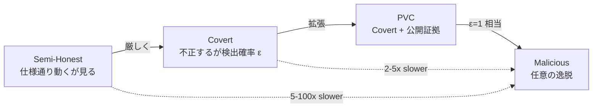
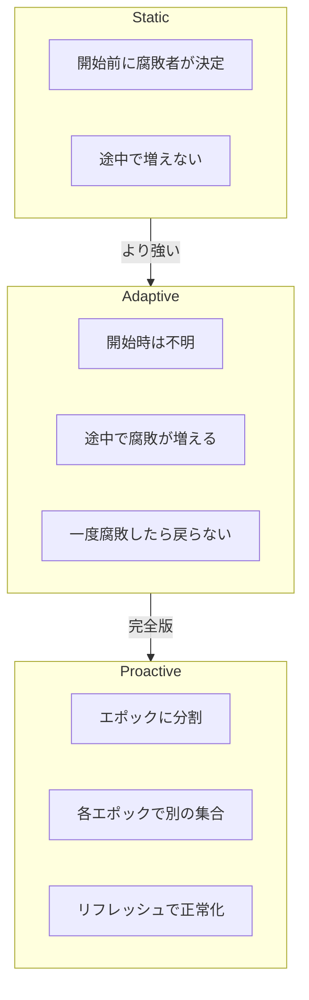
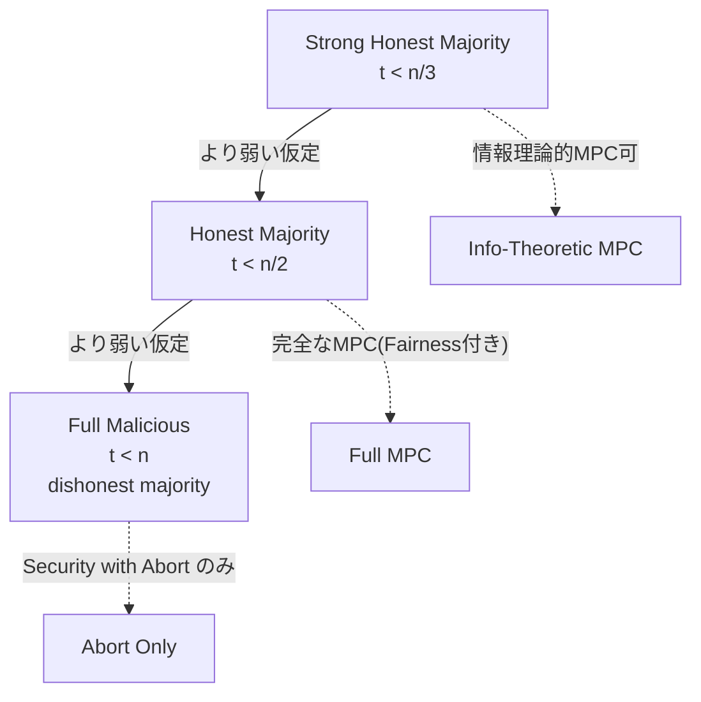
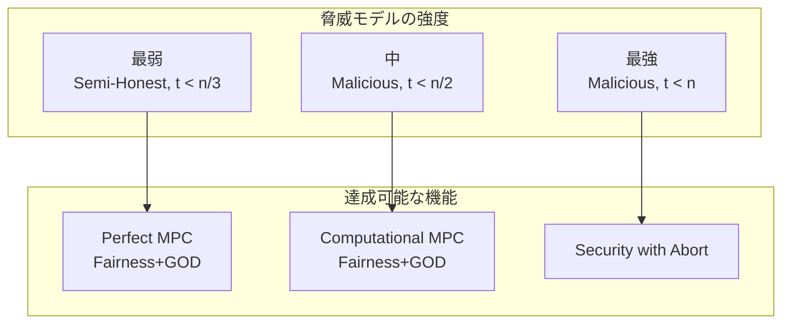
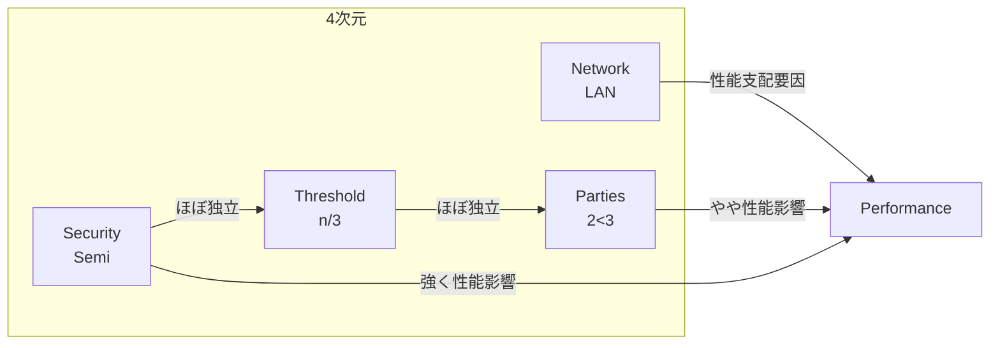

**日付**: 2026年4月24日
**学習内容**: MPC プロトコルの安全性は、**攻撃者(adversary)のモデル**に強く依存する。同じプロトコルでも Semi-Honest で安全なものと Malicious で安全なものは設計が大きく異なり、コストも10倍以上違うことがある。本記事では (1) 行動モデル(Semi-Honest, Malicious, Covert, Publicly Verifiable Covert)、(2) 腐敗戦略(Static, Adaptive, Proactive)、(3) 腐敗の量(Honest Majority vs Dishonest Majority, 特に $t < n/3$ vs $t < n/2$ vs $t < n$)、(4) 通信モデル(同期/非同期、認証/機密)、(5) Feasibility の階層を整理する。最後に **どの脅威モデルを選ぶべきかのガイドライン**を示す。

## 0. 本記事の位置づけ

Article 2 で、MPC の安全性は「Real が Ideal と区別不能」で定義されることを見た。しかし「Real World の攻撃者」にはさまざまなバリエーションがあり、**どの攻撃者に対して区別不能か** を明示しないと定義として不完全だ。

たとえば、Yao's GC は **Semi-Honest Evaluator に対しては素直に安全**だが、**Malicious Generator に対しては脆弱**(生成者が偽の garbled circuit を送れば好きな値を出力させられる)。プロトコルがどの脅威モデルで安全か、設計者もユーザも正確に理解しておく必要がある。

本記事の構成:

- **第1章**: 行動モデルの3類型
- **第2章**: 腐敗戦略の3類型
- **第3章**: 腐敗の量と閾値
- **第4章**: 通信・ネットワークモデル
- **第5章**: Feasibility の階層
- **第6章**: 実運用での選び方
- **第7章**: Q&A

## 1. 行動モデル — 攻撃者はどれだけ悪くなれるか

### 1.1 Semi-Honest (半正直 / Honest-but-Curious / Passive)

**定義**: 腐敗したプレイヤーは**プロトコルのコードを忠実に実行**する。しかし受信したメッセージ、自分の乱数、内部状態を**後で解析して秘密を推論**しようとする。

**形式的には**:

- 攻撃者 $\mathcal{A}$ は腐敗プレイヤーの view(入力、乱数、受信メッセージ)を記録する
- プロトコル実行は仕様通り
- プロトコル終了後、$\mathcal{A}$ はこの view を入力にして任意のアルゴリズムを走らせる

**典型的な現実シナリオ**:

- **内部犯**: 正規の従業員がプロトコルには従うが、ログを盗み見る
- **前向きな機密性**: 今は正直でも、鍵が漏洩したときに過去の通信から秘密が推論されないように
- **政府要求によるログ提出**: サーバ事業者が正規の手順で動いていても、後で政府にデータを提出

**長所**:

- プロトコル設計が単純(正しい動作だけ考慮すればいい)
- 効率的(Malicious より5〜100倍速い)

**短所**:

- 現実の敵は往々にして Malicious
- **「内部犯が正規の手順しか取らない」は楽観的すぎる**

### 1.2 Malicious (悪意 / Active / Byzantine)

**定義**: 腐敗したプレイヤーは**プロトコルから任意に逸脱**できる。偽のメッセージを送り、他のプレイヤーと結託し、タイミングを操作し、中断もする。

**攻撃者が行使できる能力**:

1. **偽造メッセージ**: 仕様と異なる値を送信
2. **中断**: 途中でプロトコルを止めて正直者を困らせる
3. **入力操作**: 仕様上の「入力」を恣意的に選ぶ
4. **結託**: 複数の腐敗プレイヤーが共同で攻撃を計画
5. **タイミング操作**: メッセージの送信タイミングを操る(非同期モデル下)

**典型的な現実シナリオ**:

- **ブロックチェーン**: 金銭的インセンティブのある攻撃者が総当たりで悪さをする
- **金融システム**: 不正利得を狙う内部・外部の敵
- **敵対国家間の通信**: 相手が任意の攻撃を仕掛けてくる

**設計のコスト**:

Semi-Honest プロトコルを Malicious に昇格させる典型的なコストは **5〜50倍**:

- **GC + Cut-and-Choose**: GC を $s$ 個作り、一部をチェック、残りを評価。$s = 40$ 程度が必要
- **SPDZ 方式**: 事前計算された MAC 付き乗算三つ組で各操作を認証
- **Authenticated Garbling**: 最新の手法で、わずか 3〜10 倍程度に抑えられる(Wang-Ranellucci-Katz 2017)

Article 13 で詳細を扱う。

### 1.3 Covert (隠密)

**定義** (Aumann-Lindell 2007): 腐敗プレイヤーは Malicious 的に行動しようとするが、**確率 $\varepsilon$(例: $1/2$)で検出される**。検出されたら「カンニングがバレた」状態になり、評判や法的ペナルティを失う。

**形式的には**:

- 正直者は不正検出の **公開可能な証拠(receipt)** を得られるかどうかで細分
- **Explicit Cheat**: 攻撃者は「チート」コマンドを発動でき、$\varepsilon$ で検出、$(1-\varepsilon)$ で成功
- **Strong Explicit Cheat**: 検出されたら攻撃者は**正直者の入力も得られない**(より強い)

**利点**:

- Semi-Honest に近いコストで、Malicious 的な攻撃を確率的に抑止
- 合理的な経済主体(銀行、企業)には十分な抑止力

**欠点**:

- ブロックチェーンの匿名攻撃者など、評判リスクを気にしない相手には効かない
- 検出された不正が「本当に相手のせいか」を第三者に示しづらい

### 1.4 Publicly Verifiable Covert (PVC)

**定義** (Asharov-Orlandi 2012): Covert の拡張で、**正直者が「この相手が不正をした」という第三者検証可能な証拠**を出力できる。

**用途**:

- 政府間データ共有で「相手が不正をした」を公にして外交圧力に使う
- 企業間コンソーシアムで不正者を契約違反として排除

**コスト**:

Covert と比べてわずかに増える程度。Kolesnikov-Malozemoff (2015) は Yao's GC ベースの PVC プロトコルを提案し、Semi-Honest とほぼ同コストを達成。

### 1.5 4類型の比較

| モデル | 攻撃力 | コスト目安 | 典型例 |
|---|---|---|---|
| Semi-Honest | 弱 | 1x | 内部犯、ログ漏洩 |
| Covert | 中 | 2〜5x | 銀行間取引 |
| PVC | 中+ | 2〜5x | 政府・企業コンソーシアム |
| Malicious | 強 | 5〜50x | ブロックチェーン、敵対国家 |

## 2. 腐敗戦略 — 誰がいつ腐敗するか

### 2.1 Static Corruption (静的腐敗)

**定義**: プロトコル開始**前に**、どのプレイヤーが腐敗しているかが既に決まっている。攻撃者は途中で追加のプレイヤーを腐敗させられない。

**利点**:

- 定義・証明がシンプル
- ほとんどのプロトコルがこれを仮定

**シナリオ**:

- プロトコル参加者の構成が固定
- 攻撃者は事前に標的を決めている

### 2.2 Adaptive Corruption (適応的腐敗)

**定義**: 攻撃者はプロトコル**実行中**に、見た情報をもとに新たなプレイヤーを腐敗させられる。一度腐敗したら元に戻らない(単調増加)。

**難しさ**:

Adaptive での安全性証明は Static より格段に難しい。シミュレータは**プレイヤーが腐敗した瞬間に**、過去のメッセージを「なぜその乱数だったか」と整合的に説明できなければならない。

特に **Equivocation**(嘘をつき通す)という技術が必要で、しばしばコミットメント、乱数、暗号文を全部 **equivocable** にしないといけない。

**シナリオ**:

- ハッカーがプロトコル進行中に新しいノードを乗っ取っていく
- 内部犯が状況を見て寝返る

### 2.3 Proactive Corruption (プロアクティブ腐敗)

**定義** (Ostrovsky-Yung 1991): プレイヤーは腐敗したり、浄化されたりを繰り返す。具体的には**エポック**に分割し、各エポックで一定数が腐敗、次のエポックで別の集合が腐敗する。

**鍵管理への応用**:

Proactive MPC は **秘密鍵の長期保管** に理想的。定期的に鍵シェアを**リフレッシュ**(VSS share を再分散)すれば、攻撃者はあるエポックで全シェアを集めないと鍵を復元できない。

Unbound Tech (現 Coinbase Custody) や Fireblocks の採用する **Threshold Cryptography** はこのモデルに基づく。

### 2.4 3戦略の比較

本シリーズでは主に **Static** を扱う。Adaptive / Proactive は発展研究領域。

## 3. 腐敗の量 — 閾値は何を決めるか

### 3.1 $t$ と $n$

$n$ 人参加者のうち、最大 $t$ 人が腐敗する状況を **$t$-threshold** と呼ぶ。$t$ の大きさで何が可能かが劇的に変わる。

### 3.2 $t < n/3$: Strong Honest Majority

**Feasibility**:

**Ben-Or-Goldwasser-Wigderson (BGW, 1988)** と **Chaum-Crepeau-Damgard (CCD, 1988)** が示したのは、$t < n/3$ なら:

- **情報理論的に安全**な MPC が存在する(暗号仮定不要)
- **完全(Perfect)なFairness とGuaranteed Output Delivery** が可能
- ブロードキャストチャネル不要

**なぜ $n/3$ か**:

悪意あるプレイヤーが $n/3$ 以下なら、Byzantine Agreement がブロードキャスト無しで達成できる。$n/3$ を超えると、Byzantine Generals Problem (Lamport-Shostak-Pease 1982) により同期ネットワークでは合意が不可能。

**実用例**:

- 高セキュリティ環境(国防、医療データ統合)で**情報理論的に永続的な秘密**を守る
- 将来の量子コンピュータにも耐える

### 3.3 $t < n/2$: Honest Majority

**Feasibility**:

**Rabin-Ben-Or (1989)** が拡張: ブロードキャストチャネルがあれば $t < n/2$ でも完全なMPCが可能。

**3者プロトコル (3PC)** はこの特別ケースで、$t \leq 1$ なら Honest Majority。

**実用例**:

- **Sharemind** (Cybernetica): 3PCベース、Estonian 学生調査で使用
- **Araki et al. (2017)**: 3PC Malicious で10億ゲート/秒を達成
- **MP-SPDZ の一部プロトコル**: 3PC や 4PC モード

Article 14 で触れる。

### 3.4 $t < n$: Dishonest Majority

**Feasibility**:

$t < n$(つまり少なくとも1人だけが正直)でも **Security with Abort** なら MPC 可能(GMW 1987)。ただし:

- **Fairness は不可能** (Cleve 1986)
- **Guaranteed Output Delivery は不可能**
- **暗号仮定(OT、DDH、LWE等)が必要**

特別ケース:

- **2PC (2者間)**: $t = 1 < 2 = n$。Yao's GC や BMR の本拠地
- **Dishonest Majority MPC**: SPDZ、BDOZ、Authenticated Garbling

**実用例**:

- Coinbase Custody の閾値署名(2-out-of-3 モード)
- 最も一般的な産業デプロイ

### 3.5 閾値とプロトコルの対応

| 閾値 | 代表プロトコル | 年 | セキュリティ | ファンクショナリティ保証 |
|---|---|---|---|---|
| $t < n/3$ | BGW, CCD | 1988 | 情報理論的 | Full (Fairness+GOD) |
| $t < n/2$ | Rabin-Ben-Or, Sharemind | 1989/2008 | 情報理論的 or 計算量的 | Full |
| $t < n$ | GMW, Yao's GC, SPDZ | 1987〜 | 計算量的(要暗号仮定) | Security with Abort |

## 4. 通信モデル — ネットワークの性質

### 4.1 同期 vs 非同期

**同期ネットワーク (Synchronous)**: ラウンドが明確に区切られている。各ラウンドで全員がメッセージを送り、次のラウンドで全員が受け取る。遅延に上限がある。

**非同期ネットワーク (Asynchronous)**: メッセージの配送順序も遅延も予測できない。攻撃者はメッセージを任意にリオーダーできる。

**影響**:

- 非同期での Byzantine Agreement は $t < n/3$ でも不可能(Fischer-Lynch-Paterson 1985)
- 確率的な非同期プロトコルは可能だが、複雑で低速

本シリーズでは主に **同期ネットワーク** を仮定する。

### 4.2 認証 vs 非認証

**認証チャネル (Authenticated)**: 受信者は送信者の身元を信頼できる(署名や PKI で保証)。

**非認証チャネル (Unauthenticated)**: メッセージの送信者が偽装されうる。攻撃者が中間者 (MitM) として介在できる。

**セットアップの差**:

- 非認証の場合、MPC の前に **認証フェーズ**(PKI立ち上げ、CRS共有など)が必要
- UC framework では `F_auth`, `F_CRS` などのセットアップが前提

### 4.3 Secure Channel vs Public Channel

**Secure Channel**: 盗聴も改ざんもされない(例: TLS + 共有秘密鍵)。

**Public Channel**: 全員に見える(放送型ブロードキャスト)。

MPC では **Pairwise Secure Channel** を前提にすることが多い。これは認証+機密のチャネル。Broadcast は Byzantine Agreement で実装する。

## 5. Feasibility の階層 — 何ができて何ができないか

### 5.1 Feasibility チャート

### 5.2 不可能性結果

**Cleve (1986)**: 2 者 MPC で完全な Fairness を持つコイン投げは不可能。

**Chor-Kushilevitz (1991)**: 2 者 MPC で Perfect Security を持つ汎用計算は不可能(XOR しか安全に計算できない)。

**Fischer-Lynch-Paterson (1985)**: 非同期ネットワークで1つでもクラッシュする可能性がある場合、決定論的な合意は不可能。

これらの制約は MPC の設計を強く制約する。

### 5.3 Feasibility と選択

実用上、次の表が目安になる:

| ニーズ | 選ぶべきモデル |
|---|---|
| 超高速、同一組織内 | Semi-Honest, 3PC |
| 金融、規制産業 | Malicious, 2PC or 3PC |
| ブロックチェーン | Malicious, Dishonest Majority |
| 長期鍵保管 | Malicious + Proactive, $t < n/2$ |
| 量子耐性要求 | Information-Theoretic, $t < n/3$ |
| 監査可能性重要 | PVC |

## 6. 脅威モデル選択のガイドライン

### 6.1 チェックリスト

MPC をデプロイする前に、以下を明確化する:

1. **誰が参加者か**(人数、組織、信頼関係)
2. **攻撃者は誰か、動機は何か**(内部/外部、金銭/政治)
3. **攻撃者の能力は**(Semi-Honest で十分? Malicious 必要?)
4. **どのくらい腐敗する可能性があるか**($t < n/3$? $t < n$?)
5. **何を守りたいか**(データ機密性、計算正当性、可用性)
6. **どのくらいの性能が必要か**(毎秒何ゲート?遅延何ms?)
7. **失敗時の挙動は**(中断でいいか、保証が必要か)
8. **法的・監査要件は**(GDPR、HIPAA、PCI-DSS)

### 6.2 典型的な選択例

**例1: 銀行間の反マネーロンダリング解析**

- 参加者: 銀行A、銀行B、銀行C(互いに不信)
- 攻撃者: 内部の不正従業員、外部ハッカー
- 脅威: Malicious(金銭的インセンティブ大)
- 閾値: $t < n$(どこも腐敗しうる)
- 選択: **Malicious 2PC/3PC with Abort**、SPDZ系

**例2: 政府統計局の共同解析**

- 参加者: 複数省庁
- 攻撃者: 限定的(組織内規律あり)
- 脅威: Semi-Honest か Covert
- 閾値: $t < n/2$
- 選択: **Sharemind 3PC Semi-Honest + Covert**

**例3: 暗号資産ウォレットの鍵管理**

- 参加者: 複数サーバ、ユーザ端末
- 攻撃者: 世界中のハッカー(強力)
- 脅威: Malicious + Adaptive(長期的攻撃)
- 閾値: $t < n$ または $t < n/2$
- 選択: **Malicious Threshold Signature + Proactive**

**例4: 病院間の希少疾患症例共同解析**

- 参加者: 複数病院
- 攻撃者: 低リスク
- 脅威: Semi-Honest(HIPAA対応で規律あり)
- 閾値: $t < n/2$
- 選択: **Semi-Honest Secret Sharing (Sharemind等)**

### 6.3 性能とセキュリティのトレードオフ

## 7. Q&A — よくある疑問

### Q1: Semi-Honest プロトコルを Malicious 環境で使うとどうなる?

**破綻する可能性が高い**。たとえば Yao's GC の Generator が Malicious なら、偽の garbled circuit を送って任意の出力を作れる。**「Semi-Honest で十分」と判断するときは、本当に全員が正規手順に縛られているかを慎重に確認**すること。

### Q2: 3PC と 2PC でそんなに違うの?

**大きく違う**。3PC は Honest Majority($t < 2$)を前提に、情報理論的に安全で超高速なプロトコルがある(Sharemind, Araki et al.)。2PC は必然的に Dishonest Majority で、OT など計算量的仮定が必要。**性能差は10倍以上**。

### Q3: Covert は Malicious の近似として本当に使える?

**使える場面と使えない場面がある**。合理的経済主体(銀行、政府、企業)は評判を失うと大損害なので、Covert の確率的抑止が十分効く。匿名攻撃者が主体のブロックチェーンでは効きにくい。**PVCで公開証拠を付ければ、より強力**。

### Q4: Honest Majority の $n/2$ vs $n/3$ の違いは本質的?

**本質的**。$t < n/3$ では情報理論的に完全な MPC が存在するが、$t < n/2$ ではブロードキャストチャネルなどの追加仮定が必要。実用では両方使われる。

### Q5: Adaptive 腐敗への耐性はなぜ証明が難しい?

**Equivocation が必要だから**。Static では過去のメッセージはそのままでいいが、Adaptive では「このプレイヤーは実はこの入力を持っていた」と辻褄を合わせ続けなければならない。コミットメント、乱数、暗号文を **equivocable** にする必要がある(Double Trapdoor など)。

### Q6: 非同期 MPC はどのくらい実用的?

**研究段階**。HoneyBadger BFT (Miller et al. 2016) などブロックチェーン系で実装例があるが、同期プロトコルより格段に複雑で遅い。インターネット上の地理分散システムで使い道がある。

### Q7: Dishonest Majority でも Guaranteed Output Delivery できないの?

**できない**。Cleve (1986) の不可能性により、少なくとも1人が悪意あるなら、そのプレイヤーが最後のメッセージを握っていれば、他人への出力配送を阻止できる。**Fairness なしで妥協するのが標準**。

### Q8: Information-Theoretic MPC は現実で意義がある?

**ある**。量子耐性と永続的秘密保持の2点で重要。情報理論的に安全なら、**将来量子コンピュータが実用化されても過去のデータは守られる**。Long-term confidentiality が求められる政府・医療データで重要性増加中。

## 8. まとめ

### 本記事で学んだこと

- **行動モデル**: Semi-Honest / Covert / PVC / Malicious の4段階。コストは最大50倍差
- **腐敗戦略**: Static(最も単純)/ Adaptive / Proactive(鍵管理に重要)
- **腐敗の量**: $t < n/3$(情報理論、完全)/ $t < n/2$(Honest Majority)/ $t < n$(Security with Abort)
- **通信モデル**: 同期が主流。Pairwise Secure Channel + Broadcast が標準前提
- **Feasibility**: Cleve (1986) により 2PC の Fairness は不可能。Security with Abort で妥協
- **選択のガイドライン**: 組織間信頼、攻撃者の動機、性能要求、法的要件で決める

### 次の記事(Article 4)へ

次は本シリーズの**数学・暗号基礎**を固める回。具体的には:

- **有限体 $\mathbb{F}_p$** の復習(ZKP シリーズ Article 6 の短縮版)
- **多項式とラグランジュ補間**(Shamir SS で必須)
- **Pseudorandom Function/Generator (PRF/PRG)**(GC と OT で必須)
- **コミットメントスキーム**(Malicious プロトコルで必須)
- **Random Oracle モデル**(GC の証明で使う)

これらを押さえれば、第5記事以降の Shamir SS、BGW、GC、OT の内部機構を追えるようになる。

### 3行サマリ

- **MPCの安全性は「攻撃者モデル」次第 — Semi-Honest / Covert / Malicious で設計が激変**
- **閾値 $t$ が $n/3, n/2, n$ の境界を超えるたび、達成可能な機能が変わる(情報理論→完全→Abortのみ)**
- **実用選択は、組織間信頼・攻撃者動機・性能要求・法的要件を総合して決める**

---

## 参考文献

- Yonatan Aumann, Yehuda Lindell. *Security Against Covert Adversaries*. Journal of Cryptology 23(2), 2010.
- Gilad Asharov, Claudio Orlandi. *Calling Out Cheaters: Covert Security with Public Verifiability*. ASIACRYPT 2012.
- Michael Ben-Or, Shafi Goldwasser, Avi Wigderson. *Completeness Theorems for Non-Cryptographic Fault-Tolerant Distributed Computation*. STOC 1988.
- David Chaum, Claude Crépeau, Ivan Damgård. *Multiparty Unconditionally Secure Protocols*. STOC 1988.
- Tal Rabin, Michael Ben-Or. *Verifiable Secret Sharing and Multiparty Protocols with Honest Majority*. STOC 1989.
- Leslie Lamport, Robert Shostak, Marshall Pease. *The Byzantine Generals Problem*. ACM TOPLAS 4(3), 1982.
- Rafail Ostrovsky, Moti Yung. *How to Withstand Mobile Virus Attacks*. PODC 1991.
