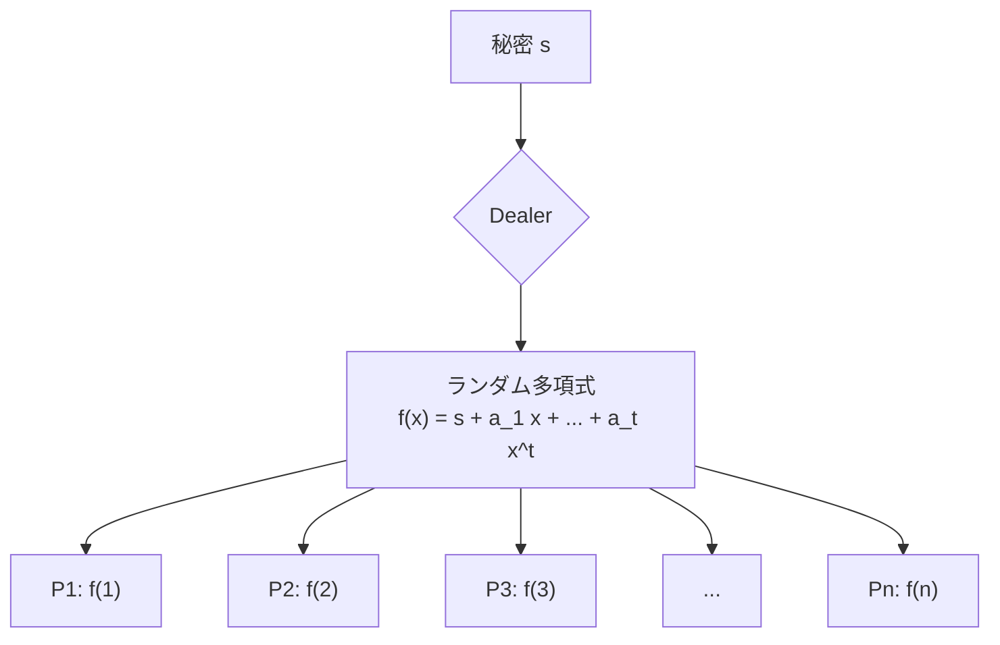

**日付**: 2026年4月24日
**学習内容**: 本記事では、**MPC の中核ビルディングブロック**である Shamir 秘密分散 (Shamir Secret Sharing, SSS) を一から構築する。1979 年に Adi Shamir が提案した本方式は、**「$t$ 次多項式は $t+1$ 点で一意決定、$t$ 点以下では何も分からない」**というラグランジュ補間の性質を使って、秘密 $s$ を $n$ 個のシェアに分割し、任意の $t+1$ 個のシェアだけで復元できる仕組みだ。具体的には (1) $(t+1, n)$-閾値秘密分散の定義、(2) Shamir 方式の構成、(3) 情報理論的安全性の証明、(4) **Python による実装**、(5) 加法的秘密分散との比較、(6) VSS や閾値暗号への橋渡しを扱う。

## 0. 本記事の位置づけ

MPC において秘密分散は、**秘密を複数プレイヤー間で「安全に運ぶ」ための最も基礎的な道具**だ。プレイヤーたちは自分のシェアを持ち寄ることで、秘密そのものを**再構成せずに**演算できる — これが BGW や SPDZ 等の秘密分散ベース MPC の大前提になる。

Shamir 秘密分散は 1979 年の発明以来、MPC の構成要素として広く使われてきた。Danish Sugar Beet Auction、Estonian 学生調査、閾値署名のすべてで本質的に Shamir SS(あるいはその親戚)が使われている。

本記事の構成:

- **第1章**: 秘密分散の一般的な定義
- **第2章**: Shamir 方式の構成
- **第3章**: 情報理論的安全性の証明
- **第4章**: Python 実装
- **第5章**: 加法的秘密分散との比較
- **第6章**: VSS と閾値暗号への応用
- **第7章**: Q&A

## 1. 秘密分散とは — 一般的な定義

### 1.1 問題設定

**秘密** $s$ を、$n$ 人のプレイヤー $P_1, \ldots, P_n$ に分散したい。要求:

- **回復可能性**: 一定数以上のプレイヤーが集まれば $s$ を完全に復元できる
- **秘匿性**: 一定数未満のプレイヤーでは $s$ について何も分からない

この「一定数」を **閾値(threshold)** と呼ぶ。

### 1.2 $(k, n)$-閾値秘密分散

$k$ 人で復元、$k-1$ 人以下では何も分からないものを $(k, n)$-threshold secret sharing scheme と呼ぶ。本シリーズでは後述の慣習に従い、**$(t+1, n)$** と表記する($t$ = 許される腐敗数)。

### 1.3 定義(フォーマル)

秘密分散スキームは、2 つのアルゴリズムの組 $(\mathsf{Shr}, \mathsf{Rec})$:

- $\mathsf{Shr}(s) \to (s_1, \ldots, s_n)$: 秘密 $s$ を $n$ 個のシェアに分ける
- $\mathsf{Rec}(\{s_i\}_{i \in I}) \to s$: $|I| \geq t+1$ なら $s$ を正しく復元

性質:

- **Correctness**: 任意の $|I| \geq t+1$ に対して $\mathsf{Rec}(\{s_i\}_{i \in I}) = s$
- **Perfect Privacy**: 任意の $|I| \leq t$ と任意の2つの秘密 $a, b$ に対して、

$$
\Pr[\mathsf{Shr}(a)|_I = v] = \Pr[\mathsf{Shr}(b)|_I = v]
$$

(シェアの部分集合を見ても、どの秘密から生成されたか区別できない)

## 2. Shamir 方式の構成

### 2.1 アイデア

多項式の性質を使う:

> **$t$ 次多項式は $t+1$ 個の点で一意に決まり、$t$ 個以下では自由度が残る**

具体的には:

- 秘密 $s$ を多項式の**定数項** $f(0)$ に埋め込む
- 各プレイヤー $P_i$ には $f(i)$ をシェアとして渡す
- $t+1$ 人が集まれば、ラグランジュ補間で $f$ を復元し $s = f(0)$ が得られる
- $t$ 人以下では、残り1点の自由度で $s$ が任意の値になりうるので、**何も分からない**

### 2.2 プロトコル

$\mathbb{F}_p$ を有限体($p > n$ の素数)、$t$ を閾値とする。

**Share(秘密 $s$ を分ける)**:

1. 係数 $a_1, a_2, \ldots, a_t \in \mathbb{F}_p$ を**一様ランダム**に選ぶ
2. 多項式を構成:
$$
f(x) = s + a_1 x + a_2 x^2 + \cdots + a_t x^t
$$
3. 各プレイヤー $P_i$ のシェアを $s_i = f(i)$ とする($i = 1, \ldots, n$)

**Reconstruct(復元)**:

1. $t+1$ 個のシェア $\{(i, s_i)\}_{i \in I}$ を集める
2. ラグランジュ補間で $f(0)$ を計算:

$$
s = f(0) = \sum_{i \in I} s_i \cdot \lambda_i
$$

ここで **ラグランジュ係数**:

$$
\lambda_i = \prod_{j \in I, j \neq i} \frac{-j}{i - j} = \prod_{j \in I, j \neq i} \frac{j}{j - i}
$$

($x = 0$ でのラグランジュ基底の値)

### 2.3 図解



### 2.4 具体例

$p = 11$、秘密 $s = 5$、$t = 1$($(2, 3)$ スキーム)とする。

1. ランダムに $a_1 = 3$ を選ぶ → $f(x) = 5 + 3x$
2. シェア:
   - $P_1: f(1) = 5 + 3 = 8$
   - $P_2: f(2) = 5 + 6 = 11 \equiv 0 \pmod{11}$
   - $P_3: f(3) = 5 + 9 = 14 \equiv 3 \pmod{11}$

**復元** $P_1, P_2$ のシェア $(1, 8), (2, 0)$ から:

$$
\lambda_1 = \frac{-2}{1 - 2} = 2, \quad \lambda_2 = \frac{-1}{2 - 1} = -1
$$

$$
f(0) = 8 \cdot 2 + 0 \cdot (-1) = 16 \equiv 5 \pmod{11} \checkmark
$$

**秘匿性の例**: $P_1$ のシェア $(1, 8)$ だけを知っても、$a_1$ を $0$ から $10$ まで動かすと $s$ も変動し、どの値も等確率で可能。つまり**完全に秘密が隠れる**。

## 3. 情報理論的安全性の証明

### 3.1 Perfect Privacy の主張

**Claim**: 任意の $t$ 個以下のシェア集合 $\{s_i\}_{i \in I}$ の分布は、**秘密 $s$ に依存しない**。

### 3.2 証明スケッチ

$|I| = t$ とする(より少ない場合はもっと簡単)。

2つの異なる秘密 $a, b$ が与えられたとき、以下を示せばよい:

- $\mathsf{Shr}(a)$ から得られる $\{s_i\}_{i \in I}$ の分布
- $\mathsf{Shr}(b)$ から得られる $\{s_i\}_{i \in I}$ の分布

が等しい。

$\mathsf{Shr}(a)$ は係数 $(a_1, \ldots, a_t)$ を一様ランダムに選んで $f_a(x) = a + a_1 x + \cdots + a_t x^t$ を構成する。シェアは $(f_a(i))_{i \in I}$。

**キー観察**: 任意の $(s_i)_{i \in I}$ と任意の $s$ に対して、$f(0) = s$ かつ $f(i) = s_i$ for $i \in I$ を満たす $t$ 次多項式 $f$ が**ちょうど1つ**存在する(計 $t+1$ 点で補間)。

つまり係数 $(a_1, \ldots, a_t)$ は $(s, \{s_i\}_{i \in I})$ で一意に決まり、$(a_1, \ldots, a_t)$ が一様 ⇔ $\{s_i\}_{i \in I}$ が一様(秘密 $s$ を固定しても、他のシェアはランダム一様)。

したがって $\mathsf{Shr}(a)|_I$ と $\mathsf{Shr}(b)|_I$ は**どちらも $\mathbb{F}_p^t$ 上の一様分布**で等しい。$\square$

### 3.3 直感

$t$ 個の点だけ見ても「$t+1$ 番目の点」にあたる $f(0) = s$ は**どの値にもなりうる**。係数の自由度がちょうど $s$ を隠す役割を果たす。

## 4. Python による実装

### 4.1 完全な実装

```python
import random
from typing import List, Tuple

def eval_poly(coeffs: List[int], x: int, p: int) -> int:
    """多項式 f(x) = coeffs[0] + coeffs[1]*x + ... を mod p で評価"""
    result = 0
    power = 1
    for c in coeffs:
        result = (result + c * power) % p
        power = (power * x) % p
    return result

def share(secret: int, n: int, t: int, p: int) -> List[Tuple[int, int]]:
    """
    Shamir Secret Sharing: Share
    secret: 秘密 s
    n: シェア数
    t: 閾値(t+1 人で復元可能)
    p: 素数
    return: [(i, f(i))] のリスト(i = 1..n)
    """
    assert n < p, "n must be less than p"
    # ランダムな t 次多項式を作る。定数項は secret
    coeffs = [secret] + [random.randint(0, p - 1) for _ in range(t)]
    shares = [(i, eval_poly(coeffs, i, p)) for i in range(1, n + 1)]
    return shares

def reconstruct(shares: List[Tuple[int, int]], p: int) -> int:
    """
    Shamir Secret Sharing: Reconstruct
    shares: [(i, s_i)] のリスト(t+1 個以上)
    p: 素数
    return: 秘密 s = f(0)
    """
    secret = 0
    k = len(shares)
    for i in range(k):
        xi, yi = shares[i]
        # ラグランジュ係数 λ_i at x = 0
        num, den = 1, 1
        for j in range(k):
            if i == j:
                continue
            xj, _ = shares[j]
            num = (num * (-xj)) % p
            den = (den * (xi - xj)) % p
        # den の逆元(フェルマーの小定理)
        den_inv = pow(den, p - 2, p)
        lam = (num * den_inv) % p
        secret = (secret + yi * lam) % p
    return secret
```

### 4.2 テスト

```python
if __name__ == "__main__":
    p = 2**31 - 1  # Mersenne prime
    secret = 12345
    n, t = 5, 2  # (3, 5) scheme

    # Share
    shares = share(secret, n, t, p)
    print(f"Secret: {secret}")
    print(f"Shares: {shares}")

    # Reconstruct with t+1 = 3 shares
    subset = shares[:3]
    recovered = reconstruct(subset, p)
    print(f"Recovered from 3 shares: {recovered}")
    assert recovered == secret

    # Reconstruct with different subset
    subset = [shares[0], shares[2], shares[4]]
    recovered = reconstruct(subset, p)
    print(f"Recovered from shares 1, 3, 5: {recovered}")
    assert recovered == secret

    # With only t = 2 shares, reconstruction gives a "random" value
    subset = shares[:2]
    # Note: reconstruct() expects t+1 shares minimum, but we can see
    # what happens with fewer — it simply gives a wrong value
    wrong = reconstruct(subset, p)
    print(f"'Reconstructed' from 2 shares (WRONG): {wrong}")
```

### 4.3 出力例

```
Secret: 12345
Shares: [(1, 634523112), (2, 1268710879), (3, 1902898646), (4, 389602765), (5, 1023790532)]
Recovered from 3 shares: 12345
Recovered from shares 1, 3, 5: 12345
'Reconstructed' from 2 shares (WRONG): 634511123
```

2 シェアからは全く関係ない値が出てくる。これが情報理論的安全性の「見た目」だ。

### 4.4 演習

以下を試してみると理解が深まる:

1. **異なる subset での復元**が必ず同じ秘密を返すことを確認
2. **t+1 シェアから $f(x)$ 全体を復元**し、プロットする(多項式のグラフ)
3. **秘密を変えて2回シェア化**し、片方の $t$ シェアから他方を区別できないことを確認(Perfect Privacy の実感)

## 5. 加法的秘密分散(Additive Secret Sharing)との比較

### 5.1 加法的秘密分散

もう1つの代表的な SS が **加法的(Additive)秘密分散**。これは $(n, n)$-threshold の特殊ケース(全員集まらないと復元できない)。

**Share**: ランダムに $s_1, \ldots, s_{n-1} \in \mathbb{F}_p$ を選び、$s_n = s - (s_1 + \cdots + s_{n-1})$ とする。

**Reconstruct**: $s = s_1 + s_2 + \cdots + s_n$。

### 5.2 Shamir vs Additive の違い

| 性質 | Shamir | Additive |
|---|---|---|
| 閾値 | $(t+1, n)$ 任意 | $(n, n)$ のみ |
| シェア1つのサイズ | $\log p$ bit | $\log p$ bit |
| 加算(シェアの)| 局所的 | 局所的 |
| 乗算(シェアの)| 次数上昇→要再sharing | 局所的には不可 |
| 使用プロトコル | BGW, Sharemind | GMW, SPDZ, BDOZ |

**加法性(homomorphism)**: 両方ともシェア上の加算は**局所的に実行可能**。

- Shamir: $s_i + s_i' = (f + g)(i)$。合流せずに和が取れる。
- Additive: $s_i + s_i'$ は $s + s'$ のシェア。合流せずに和が取れる。

**乗算の難しさ**: どちらも局所的な乗算はできない(Shamir は次数 $2t$ に上がる、Additive は $\sum s_i \cdot \sum s_i'$ にクロスタームが出る)。これが BGW / GMW で工夫する点(Article 6, 11)。

### 5.3 どちらを使うか

- **Honest Majority MPC**: Shamir($(t+1, n)$ で $t < n/2$ や $t < n/3$)
- **Dishonest Majority MPC**: Additive($(n, n)$ なので全員で一致しないと復元不可)
- **複数者数を想定**: Shamir(柔軟)

## 6. VSS と閾値暗号への応用

### 6.1 Verifiable Secret Sharing (VSS)

Shamir SS には**Dealer を信頼する**という仮定がある。Dealer が悪意なら、各プレイヤーに異なる多項式のシェアを配って、復元時にプレイヤーを対立させられる。

**VSS** はこれを防ぐ: Dealer はシェアとともに**検証情報**を送り、各プレイヤーが「自分のシェアは正しい多項式から来ている」ことを検証できる。

代表的な構成:

- **Feldman VSS** (1987): 離散対数ベースのコミットメント
- **Pedersen VSS** (1991): 完全秘匿性付き(情報理論)

Malicious MPC、閾値署名、分散鍵生成(DKG)で必須。

### 6.2 閾値暗号・閾値署名

Shamir SS は **Threshold Cryptography** の基盤。

例: **Threshold RSA**:

- $n$ 人に $d$(秘密指数)を分散
- $t+1$ 人の協力で署名生成・復号可能
- どの単一プレイヤーも $d$ を知らない

例: **Threshold ECDSA** (GG18, Doerner et al. 2019, Lindell 2017):

- Bitcoin, Ethereum のウォレットを複数サーバで分散管理
- Coinbase Custody、Fireblocks、PayPal Crypto などで商用運用

### 6.3 分散鍵生成(Distributed Key Generation, DKG)

鍵そのものを**Dealer 無しで**分散して生成する。各プレイヤーが部分的な鍵を選び、VSS で分散しあって合成する。

Cryptocurrency、Blockchain Oracles、Tor 匿名通信で使われる。

## 7. Q&A — よくある疑問

### Q1: なぜ多項式なのか? 他の方法は?

**多項式は自然に「自由度」を与える**道具。$t$ 次多項式は $t+1$ 点で一意決定だが、$t$ 点では1つの自由度が残る。これが秘密を隠す仕組み。

別の方法として、**CRT ベース (Mignotte, Asmuth-Bloom)** などもあるが、柔軟性と効率で Shamir が主流。

### Q2: $n$ が多いと効率が悪い?

**シェア1つのサイズは常に $\log p$**。ただし復元時に $t+1$ 点でラグランジュ補間するので、$O(t^2)$ の乗算が必要。大規模では工夫する(FFTベースの補間など)。

### Q3: シェアを失くしたら復元できる?

**$t$ 個以下の欠損なら復元可能**。Shamir SS は **Reed-Solomon エラー訂正符号**と等価で、消失誤り(erasure)に強い。

### Q4: シェアが改ざんされていたら検出できる?

**単純な Shamir では検出できない**。VSS(Feldman / Pedersen)を使う。あるいは **Robust Secret Sharing**(情報理論的に誤り訂正つき)を使う。

### Q5: Shamir SS は量子安全?

**情報理論的に安全なので量子コンピュータでも破れない**。ただし実装で使う乱数生成器が暗号学的に安全でないと、そこから漏れる。

### Q6: $(1, n)$-scheme って意味ある?

**自明**。「1 人のシェアで復元可能」= 全員がコピーを持つ。情報理論的秘匿性なし。

### Q7: $p$ は巨大でなくてもいい?

**理論的には $p > n$ で十分だが、実用上は $p \geq 2^{64}$ 以上が無難**。小さすぎると攻撃者が秘密を総当たりできる(秘密空間が小さい場合)。

### Q8: 実装で気をつけることは?

**主に3つ**:

1. **乱数生成**: 暗号学的に安全な乱数(`secrets` モジュールなど)を使う。`random` モジュールは予測可能
2. **有限体演算**: モジュロ演算で負の数処理や逆元計算を正しく書く
3. **シェアのサイズ**: 秘密が $\mathbb{F}_p$ より大きい場合、分割してシェア化

### Q9: 実装のライブラリはある?

**Python**: `secretsharing`, `shamirs` パッケージ
**Rust**: `sharks`
**Go**: `hashicorp/vault` の内部実装
**本格的な MPC フレームワーク**: MP-SPDZ、ABY、libscapi(Article 14 で詳述)

## 8. まとめ

### 本記事で学んだこと

- **Shamir SS** は $(t+1, n)$-threshold secret sharing の代表格
- **Share**: ランダム $t$ 次多項式で秘密を定数項に埋める
- **Reconstruct**: ラグランジュ補間で $f(0)$ を計算
- **Perfect Privacy**: $t$ 個以下のシェアからは秘密に関する情報がゼロ
- **加法的秘密分散**との使い分け: $(t+1, n)$ 閾値は Shamir、$(n, n)$ は Additive
- **応用**: 閾値暗号、分散鍵生成、ブロックチェーン鍵管理

### 次の記事(Article 6)へ

次は **BGW プロトコル**。Shamir SS 上で**加算と乗算**をどう実行するか、Honest Majority($t < n/2$)で完全な MPC を構築する古典を詳しく見る。加算は自明だが、乗算は多項式の次数が上がる問題があり、**Degree Reduction** という工夫が必要になる。情報理論的に完全に安全な MPC の本丸だ。

### 3行サマリ

- **Shamir SS = $t$ 次多項式で秘密を $n$ 人に分け、任意 $t+1$ 点で復元する方式**
- **Perfect Privacy: $t$ 人以下のシェアは完全にランダムに見え、秘密がゼロ漏洩**
- **BGW/Sharemind/閾値暗号/DKG の基盤 — MPC の土台そのもの**

---

## 参考文献

- Adi Shamir. *How to Share a Secret*. Communications of the ACM 22(11), 1979.
- Michael Ben-Or, Shafi Goldwasser, Avi Wigderson. *Completeness Theorems for Non-Cryptographic Fault-Tolerant Distributed Computation*. STOC 1988.
- Paul Feldman. *A Practical Scheme for Non-Interactive Verifiable Secret Sharing*. FOCS 1987.
- Torben Pedersen. *Non-Interactive and Information-Theoretic Secure Verifiable Secret Sharing*. CRYPTO 1991.
- Yehuda Lindell. *Fast Secure Two-Party ECDSA Signing*. CRYPTO 2017.
- Rosario Gennaro, Stanisław Jarecki, Hugo Krawczyk, Tal Rabin. *Secure Distributed Key Generation for Discrete-Log Based Cryptosystems*. Journal of Cryptology 20(1), 2007.
