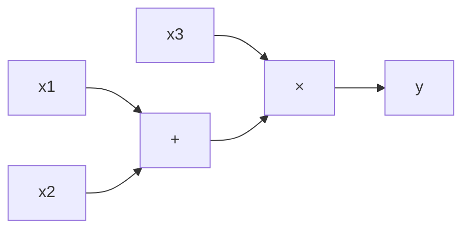
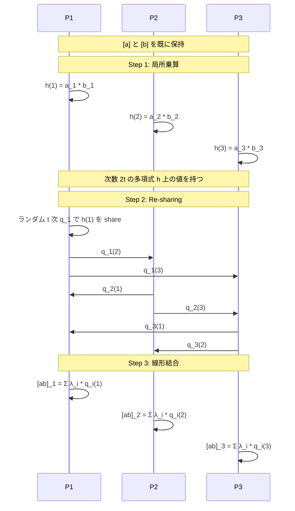

**日付**: 2026年4月24日
**学習内容**: 本記事では、**Shamir 秘密分散**上で任意の算術回路を安全に計算するプロトコル、**BGW (Ben-Or-Goldwasser-Wigderson, 1988)** を詳しく見る。BGW は **Honest Majority($t < n/2$)**で**情報理論的に完全に安全**な MPC を実現する古典であり、現在の Sharemind や honest-majority プロトコルの原型だ。具体的には (1) 入力の sharing、(2) 加算ゲート(局所計算)、(3) 乗算ゲート(次数が倍になる問題と **Degree Reduction**)、(4) 出力の復元、(5) 情報理論的な安全性の直感、(6) 実装と性能を扱う。最後に、(7) $t < n/3$ vs $t < n/2$ の違いと、Malicious 拡張への橋渡しを議論する。

## 0. 本記事の位置づけ

Article 5 で Shamir 秘密分散を学んだ。シェアを持ったまま**和は局所的に計算できる**ことを見たが、**積は難しい**ことにも気づいた。BGW プロトコルはこの問題を解決し、**任意の関数を算術回路として表現し、秘密分散上で共同計算する**方法を提供する。

BGW は 1988 年発表以来、MPC の理論的マイルストーンだ。同年発表の CCD (Chaum-Crepeau-Damgard) と並んで「情報理論的 MPC の完成形」と呼ばれ、**$t < n/3$ で完全な公平性を持つ MPC が存在する**ことを証明した。

本記事の構成:

- **第1〜2章**: 算術回路表現と BGW の全体像
- **第3章**: 入力 sharing
- **第4章**: 加算ゲート(自明)
- **第5章**: 乗算ゲートと Degree Reduction(核心)
- **第6章**: 出力の復元
- **第7章**: 安全性の直感と $t < n/2$ の必要性
- **第8章**: 実装と Q&A

## 1. 算術回路による関数表現

### 1.1 算術回路とは

**算術回路 (Arithmetic Circuit)** は、有限体 $\mathbb{F}_p$ 上の演算で関数を表現する形式:

- **入力ワイヤ**: $x_1, \ldots, x_n \in \mathbb{F}_p$
- **加算ゲート**: 2つのワイヤ値を加算
- **乗算ゲート**: 2つのワイヤ値を乗算
- **定数倍ゲート**: ワイヤ値に公開定数を乗じる
- **出力ワイヤ**: 最終結果を出力



例: $y = (x_1 + x_2) \cdot x_3$ は上のような1つの加算と1つの乗算で表現できる。

### 1.2 任意関数の表現

**定理**: 有限体上の任意の関数は算術回路で表現可能(多項式表現)。

Boolean 関数は $\mathbb{F}_2$(あるいは必要に応じて $\mathbb{F}_p$)の算術回路として表せる。したがって BGW は **MPC Complete** — 任意の関数を計算できる。

## 2. BGW プロトコルの全体像

### 2.1 流れ

1. **入力共有フェーズ**: 各プレイヤー $P_i$ が自分の入力 $x_i$ を Shamir SS で他プレイヤーに配る
2. **回路評価フェーズ**: 算術回路をゲートごとに評価
   - 加算ゲート: 各プレイヤーが自分のシェアを局所計算
   - 乗算ゲート: 局所計算 + Degree Reduction(協調必要)
3. **出力復元フェーズ**: 最後のゲートのシェアを全員で持ち寄り、ラグランジュ補間で復元

**不変条件**: 回路の各ワイヤについて、その値 $v$ の **$(t+1, n)$-Shamir シェア**を全プレイヤーが保持する。

### 2.2 記法

本章では $[v]$ と書いて「プレイヤー $P_1, \ldots, P_n$ が値 $v$ の Shamir シェアを保持している状態」を表す。$P_i$ のシェアは $[v]_i = f(i)$(ここで $f(0) = v$)。

## 3. 入力共有フェーズ

各プレイヤー $P_i$ は自分の入力 $x_i$ を共有する:

1. $P_i$ はランダムな $t$ 次多項式 $f_i(x)$ を作る:
$$
f_i(x) = x_i + a_{i,1} x + a_{i,2} x^2 + \cdots + a_{i,t} x^t
$$
2. 各プレイヤー $P_j$ に $f_i(j)$ を**秘密チャネル**で送る
3. 全員のシェアが揃うと、$[x_i]$ が成立

このフェーズは単に Shamir SS の Share を $n$ 回実行しているだけ。

## 4. 加算ゲート — 局所計算だけで完結

### 4.1 アイデア

2つの入力 $[a]$ と $[b]$ のシェアから、$[a + b]$ のシェアを作りたい。

**素晴らしい事実**: 各プレイヤーが**自分のシェア同士を足す**だけで OK。

### 4.2 証明

$[a]_i = f_a(i)$、$[b]_i = f_b(i)$ とする。$P_i$ が計算する:

$$
[a+b]_i := f_a(i) + f_b(i)
$$

これは多項式 $f_{a+b}(x) := f_a(x) + f_b(x)$ の $x = i$ での値。$f_{a+b}$ は:

- 次数: $\max(\deg f_a, \deg f_b) \leq t$(次数は上がらない)
- 定数項: $f_a(0) + f_b(0) = a + b$

よって $\{f_a(i) + f_b(i)\}_{i=1}^n$ は $a + b$ の正しい $(t+1, n)$-Shamir シェア。$\square$

### 4.3 定数倍・定数加算

- **定数倍** $[c \cdot a]$: 各 $P_i$ が $c \cdot [a]_i$ を計算(自明)
- **定数加算** $[a + c]$: $P_i$ が $[a]_i + c$ ではダメ(多項式にならない)。正しくは「$P_1$ だけが $c$ を足し、他は何もしない」... のような非対称処理が必要。実装では暗黙の「定数シェア $[c]$」を使うのが普通

### 4.4 何がうれしいか

**加算は通信ゼロ**。各プレイヤーがローカル計算を1回するだけ。**超高速**。

## 5. 乗算ゲート — BGW の核心

### 5.1 問題: 局所乗算で次数が倍になる

$[a]_i = f_a(i)$、$[b]_i = f_b(i)$ で、各 $P_i$ が単純に乗算:

$$
h(i) := f_a(i) \cdot f_b(i)
$$

定義される多項式 $h(x) = f_a(x) \cdot f_b(x)$ は:

- **次数**: $\deg f_a + \deg f_b \leq 2t$
- 定数項: $f_a(0) \cdot f_b(0) = a \cdot b$

定数項は正しい! しかし **次数が $2t$ に上がっている**。これが問題。

### 5.2 なぜ次数の上昇が問題か

Shamir SS の不変条件は「**$t$ 次多項式**でシェアされている」こと。次数が $2t$ に上がると:

1. **復元には $2t + 1$ 点**必要(通常は $t + 1$ で済む)
2. **新たな乗算を続ける**と次数が指数的に増える

したがって次数を **$2t$ から $t$ に戻す** 操作が必要。これを **Degree Reduction** と呼ぶ。

### 5.3 Degree Reduction の直感

$h(x)$ は $2t$ 次だが、**定数項 $h(0) = a \cdot b$ だけ**が欲しい。この値を保存したまま、**同じ $h(0)$ をもつ $t$ 次多項式** $\tilde{h}(x)$ のシェアを作りたい。

アイデア: $h(0)$ は $h$ の $n$ 個の値から**線形結合**で計算できる(ラグランジュ補間の式から):

$$
h(0) = \sum_{i=1}^{n} \lambda_i \cdot h(i)
$$

ここで $\lambda_i$ は $x = 0$ でのラグランジュ係数。$2t + 1 \leq n$ なら、$n$ 点から $h(0)$ が計算できる(honest majority の条件)。

### 5.4 Damgard-Nielsen 方式の Degree Reduction

BGW 原論文の方法は複雑なので、現代的な **Damgard-Nielsen (2007)** 流を紹介する。

各プレイヤー $P_i$ は自分の積 $h(i) = f_a(i) \cdot f_b(i)$ を持つ。次のステップを踏む:

1. **$P_i$ は $h(i)$ を新たに $t$ 次多項式でシェアし直す**。つまり Shamir Share を呼び、ランダム $t$ 次多項式 $q_i(x)$ を構成($q_i(0) = h(i)$)
2. **全 $P_j$ は $q_i(j)$ を $P_i$ から受け取る**(秘密チャネル)
3. **各 $P_j$ は線形結合を計算**:
$$
\tilde{h}(j) := \sum_{i=1}^{n} \lambda_i \cdot q_i(j)
$$
これが新しい $t$ 次多項式 $\tilde{h}$ の $x = j$ での値になる
4. 定数項の確認:
$$
\tilde{h}(0) = \sum_i \lambda_i \cdot q_i(0) = \sum_i \lambda_i \cdot h(i) = h(0) = a \cdot b
$$
5. $\tilde{h}$ の次数: 各 $q_i$ が $t$ 次なので、線形結合 $\tilde{h}$ も $t$ 次 $\square$

結果: $[a \cdot b]$ が新しい $t$ 次 Shamir シェアとして成立。

### 5.5 図解



### 5.6 通信コスト

- 各プレイヤーが他の全員に $t$ 次多項式のシェアを送る: $O(n^2)$ メッセージ(1回の乗算あたり)
- 各ゲートで 1 ラウンドの通信が必要

**対比**:
- 加算: 通信ゼロ
- 乗算: $O(n^2)$ 通信 + 1 ラウンド

これが秘密分散ベース MPC の典型的なコストプロファイルだ。

## 6. 出力の復元

### 6.1 シンプルなケース

回路の出力ワイヤ $[y]$ の値をプレイヤー $P_k$ だけが得るとする:

1. 各 $P_i$ が自分のシェア $[y]_i$ を $P_k$ に送る
2. $P_k$ はラグランジュ補間で $y = f_y(0)$ を計算

$t+1$ シェア以上あれば正しく復元。

### 6.2 全員が出力を得るケース

各プレイヤーが全員にシェアを送り、各自が独立に補間する。通信は $O(n^2)$ だが 1 ラウンド。

## 7. 安全性の直感と $t < n/2$ の必要性

### 7.1 Semi-Honest 安全性の直感

**Claim**: BGW は $t < n/2$ の Semi-Honest 敵に対して情報理論的に完全に安全。

**直感**:

- 入力共有: 腐敗した $t$ プレイヤーは正直な $x_i$ のシェアを $t$ 個見るが、Shamir SS の Perfect Privacy で $x_i$ がゼロ漏洩
- 加算: 局所計算、通信ゼロ、情報漏洩なし
- 乗算(Degree Reduction): 中間値 $h(i) = f_a(i) \cdot f_b(i)$ も**独立なランダム性**で再 share される。$t$ 人が見るシェアは一様ランダム

### 7.2 なぜ $t < n/2$?

**復元には $2t + 1$ 個のシェアが必要**(乗算後の次数 $2t$ の多項式を復元するため)。

- $2t + 1 \leq n$ でなければならない
- $\Rightarrow t < n/2$

つまり**正直な参加者が過半数**でなければ、乗算後の中間値を正しく復元できない。

### 7.3 Malicious への拡張

Malicious 敵(任意の嘘シェアを送る)を扱うには、追加の仕組みが必要:

- **VSS (Verifiable Secret Sharing)** で sharing 時の嘘を検出
- **Error Correction** で $2t + 1$ までの誤りシェアを訂正(Reed-Solomon decoding)
- Ben-Or-Goldwasser-Wigderson の Malicious 版は $t < n/3$ を要求

Article 13 で詳細を議論する。

### 7.4 情報理論的 vs 計算量的

BGW は暗号仮定なしで安全(**Perfect Security**)。これは:

- **量子耐性**: 量子コンピュータでも破れない
- **永続的秘密**: 50 年後でも安全
- **シンプル**: 複雑な公開鍵演算不要

反面、**Honest Majority** が必要。2者間では使えない。

## 8. 実装スケッチと性能

### 8.1 Python 擬似コード

```python
from typing import List, Callable

# Article 5 の関数を使う
# eval_poly, share, reconstruct

def bgw_add(shares_a, shares_b, p):
    """加算: 局所"""
    return [(i, (a_i + b_i) % p) for (i, a_i), (_, b_i) in zip(shares_a, shares_b)]

def bgw_mul_local(shares_a, shares_b, p):
    """Step 1: 局所乗算(次数 2t の中間値)"""
    return [(i, (a_i * b_i) % p) for (i, a_i), (_, b_i) in zip(shares_a, shares_b)]

def bgw_degree_reduction(h_shares, n, t, p):
    """
    Step 2-3: h_shares (次数 2t のシェア) から t 次のシェアを作る
    各プレイヤー i は h_shares[i] を新たに t 次多項式で share-re する
    """
    # 各 i について q_i を作り、(j) を P_j に送る
    # ここでは全体をシミュレート
    re_shares = []
    for i, (idx, hi) in enumerate(h_shares):
        # q_i: t 次ランダム多項式で h_i を share
        qi = share(hi, n, t, p)  # [(1, q_i(1)), ..., (n, q_i(n))]
        re_shares.append(qi)
    # ラグランジュ係数 λ_i at x = 0
    # (これは公開情報: 全員のシェア位置 1..n に基づく)
    lambdas = compute_lagrange_coeffs(n, p)
    # 各プレイヤー j の新シェア: Σ λ_i * q_i(j)
    new_shares = []
    for j in range(1, n + 1):
        val = 0
        for i in range(n):
            _, qij = re_shares[i][j - 1]  # q_i(j)
            val = (val + lambdas[i] * qij) % p
        new_shares.append((j, val))
    return new_shares

def compute_lagrange_coeffs(n, p):
    """points (1..n) での x=0 でのラグランジュ係数"""
    lambdas = []
    for i in range(1, n + 1):
        num, den = 1, 1
        for j in range(1, n + 1):
            if i == j:
                continue
            num = (num * (-j)) % p
            den = (den * (i - j)) % p
        den_inv = pow(den, p - 2, p)
        lambdas.append((num * den_inv) % p)
    return lambdas
```

### 8.2 性能の目安

- **2008 年 Danish Sugar Beet**: 3 プレイヤー、数万ゲート、数分で完了
- **2017 年 Araki et al.**: 3 プレイヤー、**10 億ゲート/秒**(10 Gbps LAN、Malicious 3PC)
- **Sharemind**: 実用商用プラットフォーム、エストニア政府統計で運用

Honest Majority の性能は、Dishonest Majority より格段に優れている。

### 8.3 なぜ高速か

- 情報理論的なので、公開鍵暗号不要(OT なし)
- 加算が通信ゼロ
- 乗算も PRF 1回未満のコスト
- シェアが小さい(1 field element、$\sim 128$ bit)

## 9. Q&A

### Q1: Shamir SS ベースの MPC は本当に「情報理論的」?

**完全に情報理論的**(暗号仮定なし)。ただし前提として**秘密チャネル**(秘密保持・認証付き通信路)を仮定する。これは TLS などで実装するので、実運用では**通信レイヤの暗号仮定**に依存する。

### Q2: 乗算のコストが高いのはなぜ?

次数上昇を防ぐために Re-sharing が必要で、$O(n^2)$ の通信が発生する。加算は局所なので通信ゼロ、この非対称性が BGW 設計の特徴。

### Q3: Beaver 三つ組は使える?

**使える**。事前に $[a], [b], [c]$($c = a \cdot b$)の Shamir シェアを生成しておけば、オンライン乗算は加算と public openings だけで済む。Article 12 で詳細。

### Q4: $t < n/3$ vs $t < n/2$ の違いは?

- $t < n/3$: **Malicious でも情報理論的** MPC が可能。Byzantine Agreement 含む
- $t < n/2$: Semi-Honest なら $t < n/2$ で情報理論的。Malicious ではブロードキャストチャネルが追加必要(Rabin-Ben-Or 1989)

### Q5: ブール回路 MPC との関係は?

BGW は算術回路向け。ブール回路で評価するには:

1. 各ブール値を $\mathbb{F}_p$ の $\{0, 1\}$ として扱う
2. AND $= \times$、XOR $= +$、NOT $= 1 - \cdot$

実用的には、$\mathbb{F}_2$(ビット)で小さな回路を扱うと効率が悪いので、$\mathbb{F}_{2^k}$ で**バッチ処理**する工夫(Araki et al.)。

### Q6: BGW でメモリ効率は?

各プレイヤーは自分のシェア($n$ 個ではなく1個)を保持するだけ。$n$ が巨大でもメモリは $O(\text{回路サイズ})$。比較的軽い。

### Q7: Sharemind はどう BGW を使う?

Sharemind は 3 プレイヤー固定で、$t = 1$ の Honest Majority を仮定。加算は局所、乗算は `replicated secret sharing`(各プレイヤーが 2 シェア持つ)で 1 ラウンド通信。Araki et al. の最新プロトコルも同系統。

### Q8: 量子耐性はあるの?

**本当に情報理論的**なので、量子コンピュータでも破れない。ただし基盤の秘密チャネル(TLS)が量子耐性でないと、全体として安全ではない。

### Q9: Verifiable Secret Sharing (VSS) と BGW の関係は?

Malicious な dealer や プレイヤーに対処するには VSS が必須。BGW の Malicious 版は VSS を内部で使って sharing の正しさを保証する。Feldman VSS や Pedersen VSS が典型的。

### Q10: GPU や並列化で加速できる?

**できる**。各ゲートが局所計算で並列化しやすく、Shamir 補間のラグランジュ係数は前計算可能。GPU実装で数倍〜数十倍の高速化が報告されている(Sharemind の商用版など)。

## 10. まとめ

### 本記事で学んだこと

- **BGW は Shamir SS 上で算術回路を評価する古典的 MPC**
- **加算**: 局所計算、通信ゼロ
- **乗算**: 局所積で次数が $2t$ に上がるので **Degree Reduction** で $t$ に戻す
- **Degree Reduction**: 各プレイヤーが中間値を Shamir で re-share し、ラグランジュ線形結合で $t$ 次に戻す
- **$t < n/2$ Honest Majority** が本質的要件(Malicious 版は $t < n/3$)
- **情報理論的に安全**: 量子耐性、永続的秘密
- **Sharemind、Danish Sugar Beet、Estonian 学生調査の基盤技術**

### 次の記事(Article 7)へ

次は MPC のもう1つの核心、**Oblivious Transfer (OT)** を扱う。OT は「Sender が2つの秘密を持ち、Receiver が片方だけを選んで受け取る」プリミティブで、**2者間 MPC の万能建材**だ。Kilian (1988) は「OT があれば任意の MPC が作れる」と証明した。

- 1-out-of-2 OT の定義と Naor-Pinkas 構成
- なぜ OT は MPC Complete なのか
- 公開鍵ベース OT の実装

### 3行サマリ

- **BGW = Shamir SS 上で算術回路を評価。加算はタダ、乗算は Degree Reduction が必要**
- **Honest Majority ($t < n/2$) で情報理論的に完全安全 — 量子耐性あり**
- **Sharemind、Araki et al. の10億ゲート/秒プロトコルの基盤**

---

## 参考文献

- Michael Ben-Or, Shafi Goldwasser, Avi Wigderson. *Completeness Theorems for Non-Cryptographic Fault-Tolerant Distributed Computation*. STOC 1988.
- David Chaum, Claude Crépeau, Ivan Damgård. *Multiparty Unconditionally Secure Protocols*. STOC 1988.
- Tal Rabin, Michael Ben-Or. *Verifiable Secret Sharing and Multiparty Protocols with Honest Majority*. STOC 1989.
- Ivan Damgård, Jesper Buus Nielsen. *Scalable and Unconditionally Secure Multiparty Computation*. CRYPTO 2007.
- Toshinori Araki, Jun Furukawa, Yehuda Lindell, Ariel Nof, Kazuma Ohara. *High-Throughput Semi-Honest Secure Three-Party Computation with an Honest Majority*. ACM CCS 2016.
- Dan Bogdanov, Sven Laur, Jan Willemson. *Sharemind: A Framework for Fast Privacy-Preserving Computations*. ESORICS 2008.
