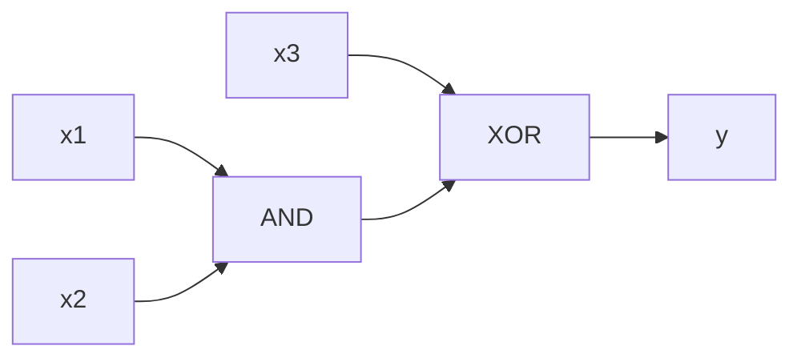
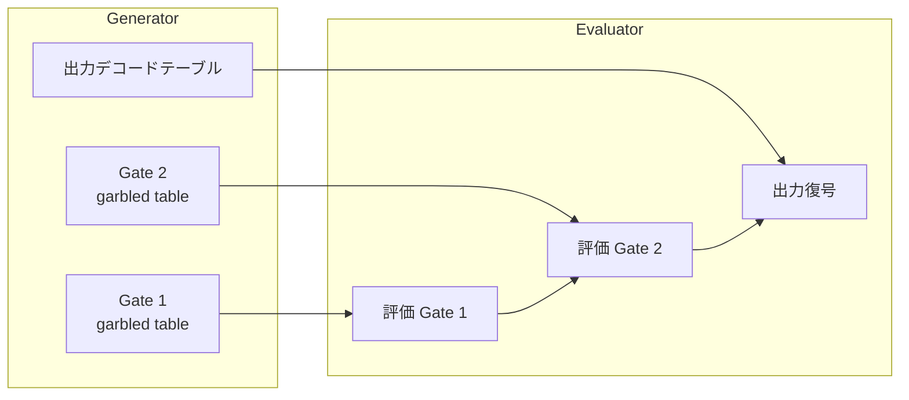
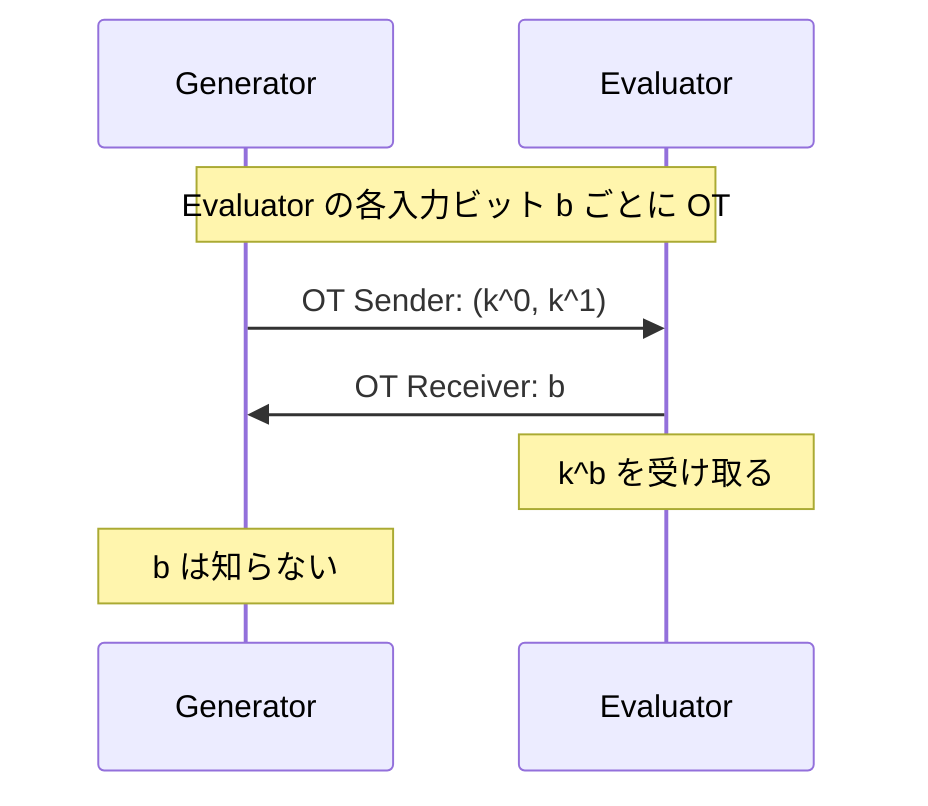

**日付**: 2026年4月24日
**学習内容**: 本記事では、MPC の最も有名で最も使われているプロトコル、**Yao's Garbled Circuits (GC)** を一から構築する。1986 年に Andrew Yao が提案し(公表は不明瞭だが複数の講演)、**2者間 (2PC) 汎用 MPC の事実上の標準**となった。具体的には (1) Boolean 回路表現、(2) **Wire Labels と Garbled Tables**、(3) 1 ゲート版の構築、(4) 全回路への拡張、(5) **Point-and-Permute** による効率化、(6) OT による入力配送、(7) Semi-Honest 安全性の証明の直感、(8) シンプルな Python 実装例、を扱う。本記事は Yao's GC の **基礎編**で、FreeXOR や Half-Gates などの最適化は次回(Article 10)に譲る。

## 0. 本記事の位置づけ

ここまで、秘密分散(Shamir + BGW)と OT(+ OT Extension)の2本柱を見てきた。秘密分散は **Honest Majority** で情報理論的に強力だが、2者間では使えない。**Dishonest Majority、特に 2 者間 MPC の決定版**が Yao's Garbled Circuits だ。

Yao's GC は単純で美しく、実装可能で、**現代の実用 MPC の 80% 以上**はこれかその派生。Authenticated Garbling(Article 13)、LEGO cut-and-choose、SCALE-MAMBA、Obliv-C、すべての 2PC ライブラリが GC を持つ。

本記事の構成:

- **第1章**: Boolean 回路として関数を表す
- **第2章**: 1ゲートの GC 構成
- **第3章**: 複数ゲートへの拡張
- **第4章**: Point-and-Permute
- **第5章**: 入力配送と OT
- **第6章**: 完全プロトコル
- **第7章**: Semi-Honest 安全性の直感
- **第8章**: 実装スケッチ
- **第9章**: Q&A

## 1. Boolean 回路としての関数表現

### 1.1 回路とは

**Boolean 回路**は、AND・OR・NOT・XOR などのゲートを DAG(非巡回有向グラフ)として繋いだ構造。



- **入力ワイヤ**: 各参加者の入力ビット
- **内部ワイヤ**: 中間値(ゲートの出力)
- **出力ワイヤ**: 最終結果

### 1.2 本シリーズの簡略化

本記事では、ゲートは**2入力1出力の Boolean ゲート**($\mathsf{AND}, \mathsf{XOR}, \mathsf{OR}$ など)のみ扱う。

### 1.3 百万長者の例

$x_1, x_2$ が $n$-bit の整数とする。比較器 $x_1 \geq x_2$ の Boolean 回路は、各ビット位置で XOR と OR を組み合わせて作れる(詳細省略)。ゲート数は $O(n)$。

### 1.4 MPC-Complete

**任意の関数を Boolean 回路で表せる**(計算可能関数の場合)。したがって Boolean 回路に対する MPC は **汎用 MPC**。

## 2. 1 ゲート版 GC の構築

### 2.1 基本アイデア

関数全体の代わりに、まず**1つの AND ゲート**を考える。

入力 $a, b \in \{0,1\}$、出力 $c = a \wedge b$。

素朴な **真理値表**:

| $a$ | $b$ | $c = a \wedge b$ |
|---|---|---|
| 0 | 0 | 0 |
| 0 | 1 | 0 |
| 1 | 0 | 0 |
| 1 | 1 | 1 |

この表を「**暗号化した形で Evaluator に渡す**」のが Yao's GC のアイデア。

### 2.2 Wire Labels

各ワイヤ(入力・出力)に対し、Generator は **2 つのラベル** を生成する:

- ワイヤ $a$ について: $k_a^0, k_a^1 \in \{0, 1\}^\kappa$($\kappa$ = 128 が標準)
- ワイヤ $b$ について: $k_b^0, k_b^1$
- ワイヤ $c$ について: $k_c^0, k_c^1$

**$k_a^0$ は「$a = 0$」を表し、$k_a^1$ は「$a = 1$」を表す**。ただしラベル自体はランダム文字列で、見ただけでは 0 か 1 か分からない。

### 2.3 Garbled Table

各真理値表エントリを、**入力ラベルのペアで暗号化**した「出力ラベル」に置き換える。

| $a$ | $b$ | ガーブルエントリ |
|---|---|---|
| 0 | 0 | $\mathsf{Enc}_{k_a^0, k_b^0}(k_c^0)$ |
| 0 | 1 | $\mathsf{Enc}_{k_a^0, k_b^1}(k_c^0)$ |
| 1 | 0 | $\mathsf{Enc}_{k_a^1, k_b^0}(k_c^0)$ |
| 1 | 1 | $\mathsf{Enc}_{k_a^1, k_b^1}(k_c^1)$ |

ここで $\mathsf{Enc}_{k_1, k_2}$ は**2鍵暗号**。具体的には:

$$
\mathsf{Enc}_{k_1, k_2}(m) = H(k_1 \| k_2) \oplus m
$$

($H$ は擬似ランダムハッシュ / Random Oracle)

### 2.4 シャッフル

Generator は 4 つのエントリを**ランダムに並べ替え**、Evaluator に送る。これで「何行目が $a = 0, b = 0$ か」の情報が隠れる。

### 2.5 評価

Evaluator は自分の入力に対応するラベルを**2つ持っている**(OTで取得した分、後述):

- ワイヤ $a$: $k_a^a$(自分の $a$ の値に対応)
- ワイヤ $b$: $k_b^b$

4 つのエントリを順に復号しようとする。**鍵ペア $(k_a^a, k_b^b)$ で暗号化されたエントリだけ正しく復号**でき、出力ラベル $k_c^{a \wedge b}$ を得る。

他の 3 エントリは**別のラベルで暗号化**されているので、復号してもランダムに見えるはず。

### 2.6 問題と解決

**問題**: 他の 3 エントリも「ランダムに見えるデータ」が出てくるので、Evaluator はどれが正しい復号か分からない。

**素朴な解**: 各出力ラベルに既知のマーカ(例: 末尾 $\sigma$ ビット = 0)を仕込む。復号結果がマーカを含むものが正解。

**より良い解**: **Point-and-Permute**(次章)で 1 行だけ復号すればいいようにする。

## 3. 複数ゲートへの拡張

1 ゲートの GC が分かれば、**回路全体**への拡張は直接的:

1. Generator が全ゲートについて wire labels を生成
2. 各ゲートについて garbled table を作成
3. 全 garbled tables を Evaluator に送る
4. Evaluator は**入力ラベル**を使って、回路をトポロジカル順にゲートを評価
5. 各ゲートの出力ラベルが、次のゲートの入力ラベルとなる
6. 最後に出力ワイヤのラベルを元のビット値にデコード



**出力デコード**: Generator が、最後の出力ワイヤのラベル $k_{\mathsf{out}}^0, k_{\mathsf{out}}^1$ を「0 のラベル」「1 のラベル」としてペアで開示する。Evaluator はどちらが来たかで 0/1 を判定。

## 4. Point-and-Permute — 効率化の第一歩

### 4.1 問題再掲

素朴な構成では、Evaluator は 4 エントリを全部復号試行する必要があり、**マーカで判別**することになる。4 倍のコスト + マーカ分のラベル肥大。

### 4.2 アイデア(Beaver-Micali-Rogaway 1990)

各 wire label に **ポインタビット** $p \in \{0, 1\}$ を付ける:

- $k_a^0$ は label に続けて pointer bit $p_a^0 = 0$(あるいは 1、ランダム)
- $k_a^1$ は label に続けて pointer bit $p_a^1 = 1 - p_a^0$

つまり **「0 のラベル」と「1 のラベル」で pointer bit が必ず異なる**ようにする。

### 4.3 ガーブル表の順序

Garbled table のエントリを、**pointer bits で決まる位置**に配置する:

- 行 $(p_a, p_b)$ に対応するエントリを、2-bit index $(p_a, p_b) \in \{00, 01, 10, 11\}$ の位置に置く

### 4.4 評価

Evaluator は自分の label $k_a^a$ の pointer bit $p_a^a$、$k_b^b$ の $p_b^b$ を直接読める(ランダムなので情報漏洩なし)。この 2 bits でどの行を復号するかが決まる。

**復号 1 回 + 追加マーカ不要**。4 倍の speedup + ラベルサイズ削減。

### 4.5 安全性

Pointer bits はランダムなので、Evaluator は bits から実際の 0/1 値を推論できない。**セキュリティは保たれる**。

## 5. 入力配送と OT

### 5.1 Generator の入力

Generator は自分の入力 $x_{\mathsf{gen}}$ に対応する wire labels $k_{x_{\mathsf{gen}}}$ を**そのまま送る**だけ。Evaluator は bits の真値は知らないが、有効な label として使える。

### 5.2 Evaluator の入力 — ここで OT が必要

Evaluator の入力 $x_{\mathsf{eval}}$ については、**Generator が 2 つの labels を持ち、Evaluator が片方を選ぶ**必要がある:

- Generator の入力: $(k_{\text{wire}}^0, k_{\text{wire}}^1)$
- Evaluator の選択: $x_{\mathsf{eval}}$ の各ビット $b$
- Evaluator の出力: $k_{\text{wire}}^b$

これは **1-out-of-2 OT** の教科書例! Article 7・8 で見た OT Extension を使って、Evaluator の全入力ビットを一括配送する。

### 5.3 OT の役割



**Crucial**: Generator は $b$ を知らないので、Evaluator のプライバシーが守られる。

## 6. 完全な Yao's GC プロトコル

### 6.1 プロトコル

**Setup**:
- 両者が関数 $f$ を決め、Boolean 回路 $C$ に変換
- セキュリティパラメータ $\kappa$ と hash function $H$ を合意

**Generation (Generator)**:

1. 各 wire $w$ について、ランダム labels $k_w^0, k_w^1$ と pointer bit を生成
2. 各ゲート $g$(入力 $a, b$、出力 $c$)について、真理値表から garbled table を作成(Point-and-Permute順)
3. 出力 wire のラベルを bit 値にマップする**デコード表**を作成
4. 全 garbled tables + デコード表 + Generator 自身の入力 labels を Evaluator に送信

**Input Transfer**:

5. Evaluator の各入力ビット $b$ について、OT を実行:
   - Sender: $(k_w^0, k_w^1)$
   - Receiver: $b$
   - Output: $k_w^b$

**Evaluation (Evaluator)**:

6. 回路をトポロジカル順に評価:
   - 各ゲート $g$ で、入力 labels の pointer bits から garbled table の行を決定
   - その行を復号して出力 label を得る
7. 最終 output labels をデコード表で bit に変換
8. 必要に応じて Generator に出力を送る(両者が出力を受け取る場合)

### 6.2 コストの目安

1 AND / XOR ゲートあたり:
- **通信**: $4 \kappa = 512$ bit(素朴、Point-and-Permute込み)
- **計算**: Generator 4 回暗号化、Evaluator 1 回復号

**最適化なしの場合**、回路サイズ $|C|$ に対して:
- Generator: $4 |C| \kappa$ bits の通信
- Evaluator: $|C|$ 回の復号

実用例: AES-128 の回路は $\sim 6800$ ゲート、素朴 GC で通信 $\sim 430$ KB。

## 7. Semi-Honest 安全性の直感

### 7.1 主張

Yao's GC は **Semi-Honest 敵に対して 2PC を安全に計算**する(OT が安全なら)。

### 7.2 Generator 腐敗のシミュレーション

Generator は受信メッセージを持たないので、**Generator は何も学ばない**(自分の入力と出力のみ)。シミュレーションは自明。

### 7.3 Evaluator 腐敗のシミュレーション

Evaluator は:
- Generator の wire labels(1 ゲート 4 エントリ × $|C|$ ゲート)
- Generator の入力 labels(Generator の入力に対応)
- OT で得た自分の input labels
- デコード表

を見る。**シミュレータ** $\mathsf{Sim}_E$ は:

- Evaluator の入力と出力 $y$ を知っている
- **active path**(実際に評価される道筋)のラベルを本物に、**inactive** はランダムに生成
- Point-and-Permute ビットはランダムに選ぶ
- デコード表は、最終 active label を $y$ に、他を ランダムにデコード

**重要な観察**: Evaluator は**1ゲートにつき1つの label しか知らない**(他はランダムに見えるハッシュ出力)。active path 以外の label は PRG/Hash の出力から区別不能 → **Computational Simulation**。

これを階層的に(hybrid argument で)示すのが標準の証明。詳細は Lindell-Pinkas (2009) の論文が読みやすい。

### 7.4 安全性を壊すもの

- **Malicious Generator**: 偽の garbled table を作れば任意の出力を誘導可能 → Cut-and-Choose 等で対処(Article 13)
- **Malicious Evaluator**: OT の Receiver が Malicious な場合 → Malicious-secure OT を使う

## 8. 実装スケッチ

### 8.1 Python 擬似コード

```python
import hashlib, os
from typing import Dict, Tuple

KAPPA = 16  # bytes, 128 bit

def H(k1: bytes, k2: bytes, gid: int, row: int) -> bytes:
    """2鍵ハッシュ"""
    return hashlib.sha256(k1 + k2 + gid.to_bytes(4, 'big') + row.to_bytes(1, 'big')).digest()[:KAPPA]

def new_label() -> Tuple[bytes, int]:
    """ラベルとポインタビット"""
    return os.urandom(KAPPA), int.from_bytes(os.urandom(1), 'big') & 1

def garble_and_gate(labels_a, labels_b, gid):
    """
    AND ゲートを garble
    labels_a = ((k0, p0), (k1, p1))
    return: (garbled_table, labels_c)
    """
    k0_a, p0_a = labels_a[0]
    k1_a, p1_a = labels_a[1]
    k0_b, p0_b = labels_b[0]
    k1_b, p1_b = labels_b[1]
    # 出力ラベル
    k0_c, p0_c = new_label()
    k1_c, p1_c = new_label()
    labels_c = ((k0_c, p0_c), (k1_c, p1_c))

    # 4 エントリ。(p_a, p_b) を index とする
    table = [None] * 4
    for va in [0, 1]:
        for vb in [0, 1]:
            ka = k0_a if va == 0 else k1_a
            pa = p0_a if va == 0 else p1_a
            kb = k0_b if vb == 0 else k1_b
            pb = p0_b if vb == 0 else p1_b
            vc = va & vb  # AND
            kc = k0_c if vc == 0 else k1_c
            pc = p0_c if vc == 0 else p1_c
            row = pa * 2 + pb
            # encrypt (kc, pc) as single blob
            ciphertext = xor_bytes(H(ka, kb, gid, row), kc + bytes([pc]))
            table[row] = ciphertext
    return table, labels_c

def eval_and_gate(table, la, lb, gid):
    """ゲート評価"""
    ka, pa = la
    kb, pb = lb
    row = pa * 2 + pb
    ciphertext = table[row]
    plaintext = xor_bytes(H(ka, kb, gid, row), ciphertext)
    kc, pc = plaintext[:KAPPA], plaintext[KAPPA]
    return (kc, pc)

def xor_bytes(a, b):
    return bytes(x ^ y for x, y in zip(a, b))
```

### 8.2 テスト

```python
if __name__ == "__main__":
    # ラベル生成
    labels_a = (new_label(), new_label())
    labels_b = (new_label(), new_label())

    # AND(1, 1) = 1 を検証
    table, labels_c = garble_and_gate(labels_a, labels_b, gid=0)
    la = labels_a[1]  # a = 1
    lb = labels_b[1]  # b = 1
    lc = eval_and_gate(table, la, lb, gid=0)
    assert lc == labels_c[1]  # 出力は c = 1 のラベル
    print("AND(1, 1) = 1 ✓")

    # AND(1, 0) = 0
    la = labels_a[1]; lb = labels_b[0]
    lc = eval_and_gate(table, la, lb, gid=0)
    assert lc == labels_c[0]
    print("AND(1, 0) = 0 ✓")
```

### 8.3 注意点

- **ラベル生成は暗号学的に安全な乱数**で
- **OT の統合**: 別途実装(`pyOT` などのライブラリで済ます)
- **回路パーサ**: SHDL や Bristol Fashion などのフォーマットを解析

本格的な実装を試したいなら、**EMP-toolkit や ABY**(Article 14)を推奨。

## 9. Q&A

### Q1: なぜ Boolean 回路? Arithmetic 回路は?

Yao's GC は Boolean 回路向けに設計された。**Arithmetic GC** も研究されているが($\mathbb{F}_p$ 上のゲート、Article 10 で少し触れる)、Boolean 版が圧倒的にメジャー。

### Q2: GC の最大の弱点は?

**通信量**。1 ゲート 4 ciphertexts = 512 bit(素朴)。$10^6$ ゲートで 60 MB。Article 10 の最適化(FreeXOR、Half-Gates)で削減。

### Q3: なぜ PRG でなく Random Oracle?

**Correlation Robust Hash** が必要(Article 8 で触れた)。RO で代用するのが実装的に安全。

### Q4: 両者が出力を得る場合は?

Evaluator が自分で出力を復号した後、**Generator に bit を送る**。ただし Malicious だと Evaluator が嘘を言える。Article 13 の Cut-and-Choose や Authenticated Garbling で対処。

### Q5: AND と XOR で同じコスト?

素朴な構成では同じ(4 ciphertexts)。しかし **FreeXOR (Kolesnikov-Schneider 2008)** で XOR を通信ゼロにできる(Article 10)。これが GC の最適化の花形。

### Q6: Yao's GC は Malicious で使える?

**素朴には使えない**。Generator が不正な garbled table を送ると任意の出力を作れる。Cut-and-Choose や Authenticated Garbling で**構造的に拡張**が必要(Article 13)。

### Q7: 回路評価は並列化できる?

**できる**。Evaluator は入力が揃ったゲートから並列評価可能。実装では topological sort で層ごとに並列処理。

### Q8: GC と GMW、どちらが速い?

**回路の深さと帯域次第**:
- **GC**: 深い回路、低帯域ネットワークで有利(1 ラウンド)
- **GMW**: 浅い回路、高帯域ネットワークで有利(深さに比例するラウンド数)

Article 11 で GMW と比較する。

### Q9: Evaluator の不正はなぜ問題にならない?

Evaluator は garbled table を復号するだけで、**自発的な不正メッセージを出す機会がない**。唯一不正できるのは OT の Receiver として Malicious に動くことだが、Malicious-secure OT を使えば防げる。

### Q10: 実装ライブラリは?

- **EMP-toolkit**: C++、最速クラス、research grade
- **Obliv-C**: C 拡張、高レベル DSL
- **TinyGarble**: ハードウェア合成ツールを流用
- **MP-SPDZ**: Python-like DSL
- **ABY**: C++、GC と他プロトコルを混在

Article 14 で詳細比較。

## 10. まとめ

### 本記事で学んだこと

- **Yao's GC = 2PC の定番**。Boolean 回路を暗号化したまま評価
- **Wire labels**: 各ワイヤに 2 つのランダム文字列。0 と 1 を隠す
- **Garbled table**: 真理値表を 2 鍵暗号で暗号化し、出力 label を取り出す
- **Point-and-Permute**: ポインタビットで復号を 1 回に削減
- **入力配送**: Generator 側はそのまま送る、Evaluator 側は OT で取得
- **Semi-Honest 安全**: Generator は何も見ない、Evaluator は active label 以外 Random にしか見えない
- **Malicious には別途工夫が必要**(Article 13)

### 次の記事(Article 10)へ

次回は **GC の最適化**。

- **Point-and-Permute**(本記事で紹介)
- **GRR3**: 4 エントリを 3 に削減
- **FreeXOR**: XOR ゲートを通信・計算ゼロに
- **Half-Gates**: AND を 2 エントリに削減(FreeXOR 併用可)
- **Fixed-key AES** garbling

これらを組み合わせると、**1 AND ゲート = 2 $\kappa$-bit の通信、XOR ゲート = 0**。AES 回路($\sim 6000$ AND)で通信 $\sim 200$ KB まで圧縮できる。

### 3行サマリ

- **Yao's GC = wire labels と garbled tables で Boolean 回路を暗号化評価**
- **Point-and-Permute で 4 復号 → 1 復号に削減、OT で Evaluator 入力を配送**
- **2PC Semi-Honest の事実上の標準。Malicious 化には Article 13 の工夫が必要**

---

## 参考文献

- Andrew C. Yao. *How to Generate and Exchange Secrets*. FOCS 1986.
- Donald Beaver, Silvio Micali, Phillip Rogaway. *The Round Complexity of Secure Protocols*. STOC 1990.
- Yehuda Lindell, Benny Pinkas. *A Proof of Security of Yao's Protocol for Two-Party Computation*. Journal of Cryptology 22(2), 2009.
- Moni Naor, Benny Pinkas, Reuban Sumner. *Privacy Preserving Auctions and Mechanism Design*. EC 1999.
- David Evans, Vladimir Kolesnikov, Mike Rosulek. *A Pragmatic Introduction to Secure Multi-Party Computation*. NOW Publishers, 2018.
