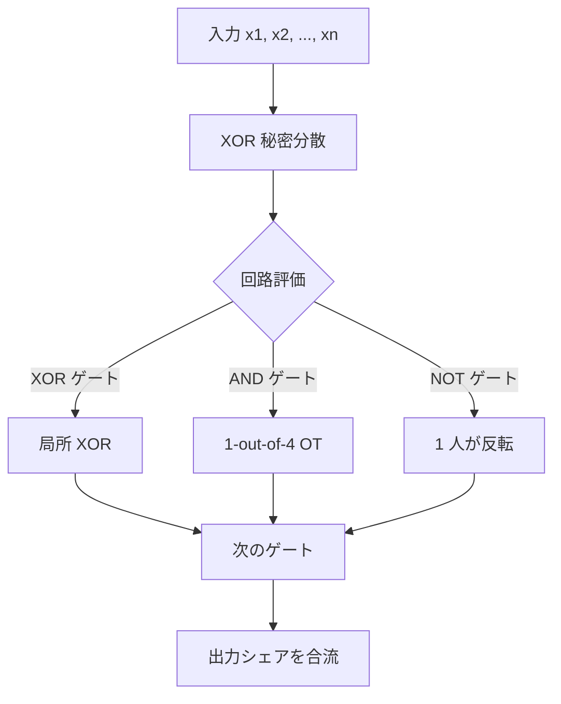

**日付**: 2026年4月24日
**学習内容**: 本記事では、Goldreich-Micali-Wigderson (GMW, 1987) プロトコルを扱う。GMW は **Boolean 回路を多者 ($n \geq 2$) で安全計算**する古典で、「XOR ベースの秘密分散 + AND ゲートで OT を呼ぶ」という単純で美しい構造を持つ。Yao's GC と並ぶ 2 大プロトコルだが、**$n$ 人に自然に拡張可能** かつ **回路の深さに比例するラウンド数** という特徴的なプロファイルを持つ。具体的には (1) XOR 秘密分散による回路評価、(2) 局所的な XOR、(3) **AND ゲート = 1-out-of-4 OT**、(4) 多者拡張、(5) Yao's GC との比較、(6) Arithmetic GMW、(7) 実装の概観を扱う。

## 0. 本記事の位置づけ

Yao's GC(Article 9–10)は 2 者に特化した効率的プロトコルだが、多者への拡張(BMR, 1990)は少し複雑。一方 **GMW (1987) は自然に多者に拡張**できる。両者はしばしば併用され、回路の構造(深さ、ゲート数、参加者数)で選択される。

GMW は現代の実用 MPC フレームワーク(ABY、MP-SPDZ、libscapi)でも標準的に実装されており、**混在プロトコル(hybrid MPC)** の重要な部分を担う。

本記事の構成:

- **第1章**: GMW の全体像
- **第2章**: 入力共有(XOR secret sharing)
- **第3章**: XOR ゲートの評価(局所計算)
- **第4章**: AND ゲートの評価(1-out-of-4 OT)
- **第5章**: 多者への拡張
- **第6章**: Yao's GC との比較
- **第7章**: Arithmetic GMW
- **第8章**: 実装と性能
- **第9章**: Q&A

## 1. GMW プロトコルの全体像

### 1.1 設定

$n$ 人のプレイヤー $P_1, \ldots, P_n$ が、各自 Boolean 入力 $x_i$ を持つ。Boolean 回路 $C$ で関数 $y = f(x_1, \ldots, x_n)$ を安全計算したい。

**前提**: Dishonest majority($t < n$)を想定。2PC の場合 $n = 2, t = 1$。

### 1.2 不変条件

回路の各ワイヤ $w$ の値 $v_w \in \{0, 1\}$ に対して、プレイヤーたちは **XOR 秘密分散**を保持する:

$$
v_w = s_w^{(1)} \oplus s_w^{(2)} \oplus \cdots \oplus s_w^{(n)}
$$

各 $P_i$ はシェア $s_w^{(i)}$ のみ保持。単独では $v_w$ について何も分からない。

### 1.3 流れ

1. **入力共有**: 各 $P_i$ が自分の入力 $x_i$ を XOR 秘密分散
2. **回路評価**:
   - **XOR ゲート**: 局所計算のみ(通信ゼロ)
   - **AND ゲート**: 1-out-of-4 OT で協調計算(1 ラウンド通信)
   - **NOT ゲート**: 1 人だけがシェアを反転(局所)
3. **出力復元**: 出力ワイヤのシェアを持ち寄り、XOR で値復元

## 2. 入力共有 — XOR Secret Sharing

### 2.1 方法

$P_i$ が自分の入力ビット $x_i$ を XOR 秘密分散する:

1. ランダムな $s^{(1)}, s^{(2)}, \ldots, s^{(n-1)} \in \{0, 1\}$ を選ぶ
2. $s^{(n)} = x_i \oplus s^{(1)} \oplus \cdots \oplus s^{(n-1)}$ を計算
3. $s^{(j)}$ を $P_j$ に秘密チャネルで送る($j = 1, \ldots, n$、ただし $j = i$ は自分用)

**確認**: $s^{(1)} \oplus \cdots \oplus s^{(n)} = x_i$ が成立。

### 2.2 Perfect Privacy

どの $n-1$ 個のシェアも**独立な一様乱数**。$x_i$ について何も漏れない(情報理論的)。Shamir SS の特殊ケース($k = n$)と見ることもできる。

## 3. XOR ゲート — 局所計算だけ

### 3.1 なぜ局所計算で済むか

XOR ゲート $c = a \oplus b$。シェア:

$$
a = \bigoplus_{i} s_a^{(i)}, \quad b = \bigoplus_{i} s_b^{(i)}
$$

それぞれの $P_i$ が **自分のシェア同士を XOR**:

$$
s_c^{(i)} := s_a^{(i)} \oplus s_b^{(i)}
$$

合計:

$$
\bigoplus_{i} s_c^{(i)} = \bigoplus_{i} (s_a^{(i)} \oplus s_b^{(i)}) = a \oplus b = c
$$

**通信ゼロ、計算はビット XOR 1 回だけ**。

### 3.2 NOT ゲートも局所

$c = \neg a$ の場合、$P_1$ だけが $s_c^{(1)} = \neg s_a^{(1)}$ とし、他は $s_c^{(i)} = s_a^{(i)}$。XOR で確認:

$$
\bigoplus_{i} s_c^{(i)} = \neg s_a^{(1)} \oplus s_a^{(2)} \oplus \cdots = 1 \oplus a = \neg a \checkmark
$$

### 3.3 NAND への拡張

NAND = NOT $\circ$ AND。AND さえ解決できれば、あとは XOR/NOT で任意の Boolean 関数が作れる(NAND は機能完全)。

## 4. AND ゲート — 1-out-of-4 OT

### 4.1 難しさ

AND ゲート $c = a \wedge b$。シェアの積 $s_a^{(i)} \wedge s_b^{(i)}$ は **$c$ のシェアではない**:

$$
\bigoplus_i (s_a^{(i)} \wedge s_b^{(i)}) \neq a \wedge b
$$

(クロス項 $s_a^{(i)} \wedge s_b^{(j)}$ が必要)

この問題を**対話プロトコル**で解決する。

### 4.2 2 者版 ($n = 2$) の構成

$P_1$ のシェア: $s_a^{(1)}, s_b^{(1)}$。$P_2$ のシェア: $s_a^{(2)}, s_b^{(2)}$。

目標: $c = (s_a^{(1)} \oplus s_a^{(2)}) \wedge (s_b^{(1)} \oplus s_b^{(2)})$ を展開:

$$
c = (s_a^{(1)} \wedge s_b^{(1)}) \oplus (s_a^{(1)} \wedge s_b^{(2)}) \oplus (s_a^{(2)} \wedge s_b^{(1)}) \oplus (s_a^{(2)} \wedge s_b^{(2)})
$$

- 第 1, 4 項は各プレイヤーが**局所計算**できる
- 第 2, 3 項は**クロス項**で、2 者の協力が必要

### 4.3 クロス項の扱い

**クロス項 $s_a^{(1)} \wedge s_b^{(2)}$ を秘密分散**したい。$P_1$ が関数 $f_1(x) = s_a^{(1)} \wedge x$ を、$P_2$ が $x = s_b^{(2)}$ を持つ。目標は両者がシェア $r_1, r_2$($r_1 \oplus r_2 = f_1(x)$)を得ること。

**1-out-of-4 OT で実現**:

$P_1$ がランダムな $r_1 \in \{0, 1\}$ を選ぶ。$P_1$ の入力は $(s_a^{(1)}, s_b^{(1)})$ に依存した 4 つの「仕上げ値」:

4 通りの $(v_a, v_b) \in \{0, 1\}^2$ に対し、**もし $P_1$ が $(v_a, v_b)$ を真の値だと思い込む**なら、$c$ のシェアとして $r_1$、$P_2$ に渡すべきシェアが:

$$
r_2 = (v_a \oplus s_a^{(1)}) \cdot (v_b \oplus s_b^{(1)}) \oplus r_1
$$

(詳細の展開は文献参照)

$P_2$ は **自分の本当の $(s_a^{(2)}, s_b^{(2)})$** を選択ビット 2 ビットとして 1-out-of-4 OT に渡し、対応する $r_2$ を得る。

結果: $r_1 \oplus r_2 = c$ のクロス項と局所項の和、つまり $c$ の正しい XOR 秘密分散が得られる。

### 4.4 1 ラウンド通信

**1 AND ゲート = 1 回の 1-out-of-4 OT = 1 ラウンド通信**。Yao's GC が **1 回の通信で全回路送信** だったのに対し、GMW は**回路の深さ $d$ に対して $d$ ラウンド**必要。

## 5. 多者への拡張

### 5.1 $n$ 者 AND ゲート

$n$ 人の場合、AND ゲートの展開は $n^2$ 個のクロス項を持つ:

$$
c = \bigoplus_{i, j} (s_a^{(i)} \wedge s_b^{(j)})
$$

**同じ $i$ の項** は局所計算、**異なる $i \neq j$ の項** は 2 者ペア間の OT で処理。

結果、**1 AND ゲートに $\binom{n}{2}$ 個の 2-way OT**。$n$ が大きいと通信コストが爆発。

### 5.2 実用的な範囲

$n = 3, 4, 5$ くらいまでは GMW が実用。それ以上では **BMR (Beaver-Micali-Rogaway 1990)** という定数ラウンド多者プロトコルが優位。

### 5.3 BMR: 定数ラウンド多者 MPC

BMR は「Yao's GC を $n$ 者に拡張」した定数ラウンドプロトコル。各 wire の label を $n$ プレイヤーで**部分的に生成**し、garbled table の構築を MPC で協調。実装は複雑だが、大規模な $n$ で有利。

Authenticated BMR (Wang-Ranellucci-Katz 2017) は現代の多者 Malicious MPC の決定版の1つ。

## 6. Yao's GC との比較

### 6.1 比較表

| 側面 | Yao's GC (2PC) | GMW (2PC) |
|---|---|---|
| 多者対応 | BMR 拡張要 | 自然に拡張 |
| ラウンド数 | 1 | 回路深さ $d$ |
| 1 AND の通信 | $2\kappa$ (Half-Gates) | $4 \kappa$ (1-out-of-4 OT) |
| 1 XOR の通信 | 0 (FreeXOR) | 0 (局所) |
| 主要コスト | 帯域 | レイテンシ(ラウンド) |
| Best for | WAN、深い回路 | LAN、浅い回路 |

### 6.2 選び方

- **WAN(低帯域、高レイテンシ)**: Yao's GC(1 ラウンドなので RTT 影響小)
- **LAN(高帯域、低レイテンシ)**: GMW(帯域に余裕がありラウンド数も気にならない)
- **深い回路(例: AES)**: Yao's GC(GMW は深さ分だけ遅延)
- **浅い回路(例: 統計集計)**: GMW 有利

ABY (Article 14) はこれらを **混在** して使える、研究用の標準フレームワーク。

### 6.3 併用

Kolesnikov-Schneider-Zohner (2013) などの研究で、**回路の部分ごとに Yao と GMW を切り替える**方式が提案されている。ABY、ABY3 で実装。

## 7. Arithmetic GMW

### 7.1 Arithmetic 版

$\mathbb{F}_p$ 上の算術回路でも GMW 風のプロトコルが作れる:

- 加算: 局所(Additive SS)
- 乗算: **Beaver triple** を事前に用意(Article 12)

**Arithmetic GMW** は現代の dishonest majority MPC の基盤。SPDZ、BDOZ、MASCOT などがこの延長。

### 7.2 なぜ直接 OT でできない?

Arithmetic 乗算は 1-out-of-$p$ OT(or OLE: Oblivious Linear Evaluation)が必要。$p$ が大きいと非効率。Beaver triple を事前計算してオンラインで利用する方が一般的。

## 8. 実装と性能

### 8.1 ライブラリ

- **ABY**: C++、Yao と GMW 両方、切り替え可能
- **MP-SPDZ**: Python-like、複数プロトコル対応
- **libscapi**: Java/C++
- **EMP-toolkit**: C++、GMW あり

### 8.2 性能例(2024)

3PC Semi-Honest Boolean GMW:

- 小〜中規模回路(AES など): 数 ms
- 通信: 数 MB
- 大規模($10^7$ ゲート): 数秒

BGW / Sharemind(Honest Majority)と比較すると数倍遅いが、**Dishonest Majority が許される**利点。

### 8.3 OT Extension の活用

GMW は AND ゲートごとに OT が必要なため、**大量の OT** を消費。IKNP OT Extension(Article 8)で Base OT は $\kappa$ 回に抑え、あとは対称鍵演算でスケール。

## 9. Q&A

### Q1: GMW はなぜ Yao's GC より無名なの?

2PC で Yao's GC が実装・最適化の研究で先行したため。Article 10 の Half-Gates は 2PC 特化。GMW は $n$ 者への自然さが魅力だが、2 者なら GC の帯域が有利。

### Q2: GMW の Malicious 版は?

**GMW Compiler (1987)** が自然な拡張。各メッセージに ZK 証明を添付して、正しく動いていることを示す。現代では Authenticated Garbling や SPDZ の方が効率的。

### Q3: 1-out-of-4 OT は 1-out-of-2 で実装できる?

**できる**(2 回の 1-out-of-2 で 1 回の 1-out-of-4)。あるいは KK13(Article 8)で直接 1-out-of-$n$。

### Q4: 並列化は?

**同じ深さのゲートは並列化可能**。Depth $d$ の回路なら、各 depth 層で並列に全 AND ゲートを処理。**バッチ OT Extension** で大量同時 OT を効率処理。

### Q5: 深さ 1000 の回路は現実的?

**LAN なら OK**。1 ラウンド RTT $\sim 1$ ms、1000 ラウンドで $\sim 1$ 秒。WAN では RTT 100 ms なので、100 秒。深さの低減が重要。

### Q6: Circuit Depth を減らす方法は?

- **Balanced trees**: 加算木を深さ $\log n$ に
- **Carry-save adders**: 深さ節約した算術回路
- **Schneider-Zohner (2013)**: GMW 向けの depth 最適化

### Q7: GMW と BGW の違いは?

- **GMW**: Boolean、Dishonest Majority、OT 必要
- **BGW**: Arithmetic、Honest Majority、OT 不要

両方「秘密分散 + ゲート評価」だが、ゲート構造と閾値が異なる。

### Q8: Arithmetic GMW と SPDZ は?

- **Arithmetic GMW (Semi-Honest)**: Beaver triple で乗算、軽量
- **SPDZ (Malicious)**: MAC 付き Beaver triple、認証強化

両方 Article 12 で詳述。

### Q9: GMW は PSI に使える?

**使えるが最適ではない**。GMW は汎用プロトコル。PSI にはカスタム構成(KKRT16 など)がより高速。GMW は**汎用的な回路評価**に向く。

### Q10: 量子耐性は?

**OT 次第**。GMW の構造は情報理論的だが、内部の OT が公開鍵ベースなので DDH 破りで崩れる。Lattice-based OT と組み合わせれば量子耐性。

## 10. まとめ

### 本記事で学んだこと

- **GMW = Boolean 回路を XOR 秘密分散 + AND で OT を使って評価する多者 MPC**
- **入力共有**: XOR 秘密分散。Perfect Privacy
- **XOR ゲート**: 局所計算、通信ゼロ
- **AND ゲート**: 1-out-of-4 OT で 1 ラウンド通信
- **回路の深さ $d$ に比例するラウンド数**(対比: Yao's GC は 1 ラウンド)
- **多者拡張**: $n^2$ 個のクロス項で AND ゲートが膨らむ。$n > 5$ では BMR の方が良い
- **混在プロトコル (ABY)**: Yao と GMW を回路の部分ごとに切り替え

### 次の記事(Article 12)へ

次は **Beaver triple** — 「事前計算されたランダム三つ組 $(a, b, c)$ with $c = a \cdot b$」で乗算を局所化する魔法。SPDZ、BDOZ、GMW Arithmetic、MASCOT、すべての主要 dishonest majority MPC で中核的。

- Beaver (1992) の原論文
- Offline/Online 分離
- Malicious への拡張(MAC 付き)
- 抽象化としての "[x]" 記法

### 3行サマリ

- **GMW = Boolean 回路を XOR SS + AND の OT で多者評価。Yao's GC と双璧**
- **XOR は局所、AND は 1 ラウンド OT。回路深さ $d$ ラウンド**
- **2PC で WAN なら Yao、LAN 浅い回路や多者なら GMW が有利**

---

## 参考文献

- Oded Goldreich, Silvio Micali, Avi Wigderson. *How to Play any Mental Game*. STOC 1987.
- Donald Beaver, Silvio Micali, Phillip Rogaway. *The Round Complexity of Secure Protocols*. STOC 1990. (BMR)
- Daniel Demmler, Thomas Schneider, Michael Zohner. *ABY — A Framework for Efficient Mixed-Protocol Secure Two-Party Computation*. NDSS 2015.
- Vladimir Kolesnikov, Thomas Schneider, Michael Zohner. *GMW vs. Yao? Efficient Secure Two-Party Computation with Low Depth Circuits*. FC 2013.
- Xiao Wang, Samuel Ranellucci, Jonathan Katz. *Global-Scale Secure Multiparty Computation*. ACM CCS 2017. (Authenticated BMR)
- Payman Mohassel, Mike Rosulek, Yupeng Zhang. *Fast and Secure Three-party Computation: The Garbled Circuit Approach*. ACM CCS 2015.
