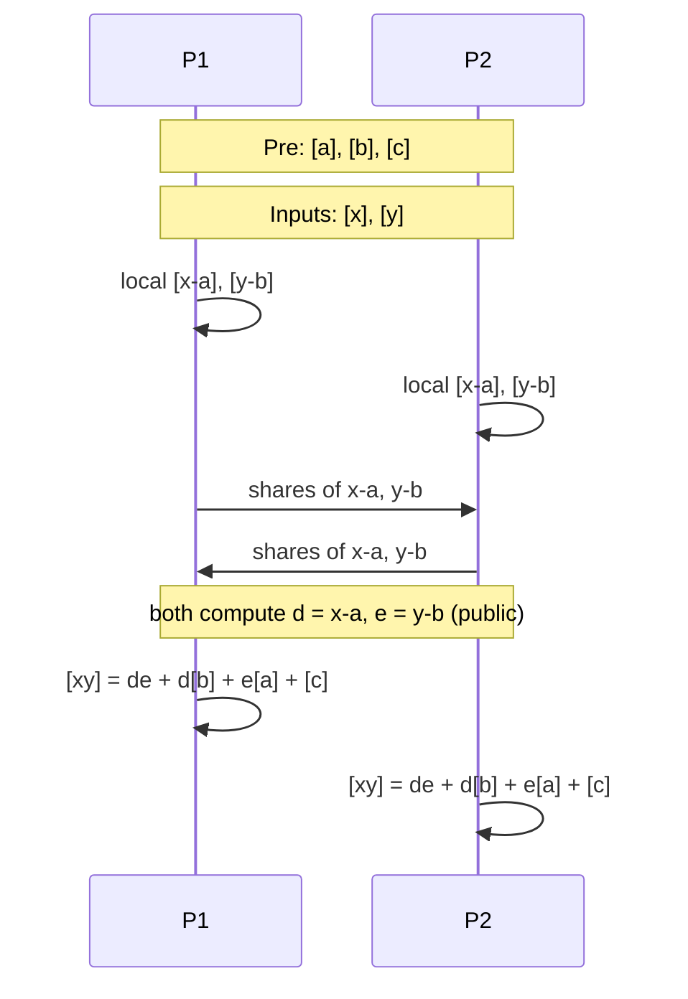

**日付**: 2026年4月24日
**学習内容**: 本記事では、Dishonest Majority MPC の要となる **Beaver triples(乗算三つ組)** を扱う。Donald Beaver (1992) の小さなアイデアだが、効果は絶大: **事前計算したランダム三つ組 $(a, b, c)$ with $c = a \cdot b$ を消費することで、オンライン乗算を 2 回の shares opening だけに圧縮**する。これにより MPC は **オフライン(重い準備) + オンライン(軽い実行)** という2相モデルに分かれ、実運用で圧倒的に高速化する。具体的には (1) Beaver の観察、(2) オンライン乗算の具体的な計算、(3) オフラインでの triple 生成(OT, OLE, HE ベース)、(4) GMW・SPDZ・BDOZ との統合、(5) Malicious 版での MAC 付き triples、(6) 実装と性能を扱う。

## 0. 本記事の位置づけ

Article 11 で見た Arithmetic GMW(あるいは BGW の乗算)は、**オンライン乗算ごとに通信が必要**で、回路が大きいと帯域と時間がかさむ。

**Beaver (1992)** が提案したのは、「**乗算に必要な『乱数の積の準備』だけを事前に済ませ**、本番は軽い処理で済ませる」という設計。これが **Offline/Online 分離** という MPC 実運用の黄金律になった。

SPDZ (Damgard-Pastro-Smart-Zakarias 2012)、BDOZ (Bendlin-Damgard-Orlandi-Zakarias 2011)、MASCOT (Keller-Orsini-Scholl 2016) のすべてがこのパラダイムに基づく。

本記事の構成:

- **第1章**: なぜ乗算がコスト高か
- **第2章**: Beaver の観察 — 準備された積で乗算を置換
- **第3章**: オンライン乗算プロトコル
- **第4章**: Beaver triple の性質
- **第5章**: オフライン triple 生成の方法
- **第6章**: Malicious 対応(Authenticated Triples)
- **第7章**: SPDZ / BDOZ の抽象化
- **第8章**: Q&A

## 1. なぜ乗算がコスト高か

### 1.1 秘密分散上の演算

Article 5-6 と 11 で見たように、MPC では値 $v$ を $[v]$(シェア)として扱う。

**加法的秘密分散** $[v] = (v^{(1)}, \ldots, v^{(n)})$ with $v = \sum v^{(i)}$。加算は局所:

$$
[a] + [b] = [a + b]
$$

### 1.2 乗算の難しさ

$[a] \cdot [b]$ を計算したい。プレイヤー $P_i$ のシェアは $a^{(i)}, b^{(i)}$。単純に $a^{(i)} \cdot b^{(i)}$ を計算しても:

$$
\sum_i (a^{(i)} \cdot b^{(i)}) \neq a \cdot b
$$

クロス項 $a^{(i)} \cdot b^{(j)}$ が必要。これが Article 11 で AND ゲートに OT を呼んだ理由だ。

### 1.3 オンライン通信のコスト

従来の Arithmetic MPC では、1 乗算ごとに:

- OT または OLE で $O(n^2)$ 通信
- 1 ラウンドのレイテンシ

回路が深く、乗算ゲートが多いと**ボトルネック**になる。

## 2. Beaver の観察

### 2.1 アイデア

> 乗算が難しいのは「オンラインで」秘密値の積を計算するから。**事前に「ランダムな値の積」を準備**しておけば、本番はただの引き算と openings で済む。

具体的に、以下の **Beaver triple** を事前に用意する:

$$
[a], [b], [c] \quad \text{where} \quad c = a \cdot b
$$

$a, b$ はランダム、$c$ はその積。全プレイヤーは**シェア**だけを持ち、真の値 $a, b, c$ は誰も知らない。

### 2.2 直感

$a \approx x$、$b \approx y$ に「近い」ランダム値と見立てて、差分 $d = x - a$, $e = y - b$ を計算する。$d, e$ はランダムな $a, b$ でマスクされているので**公開しても何も漏れない**。

この公開された $d, e$ を使って、実際の積 $xy$ を $[a], [b], [c]$ と $d, e$ の線形結合で表現する — これが Beaver トリック。

## 3. オンライン乗算プロトコル

### 3.1 展開

$x \cdot y$ を計算したい。Beaver triple $(a, b, c)$ を使う。$a, b$ はランダムで、$c = a b$。

展開:

$$
x \cdot y = (x - a + a)(y - b + b) = (d + a)(e + b)
$$

where $d := x - a$, $e := y - b$。展開すると:

$$
x y = d e + d b + a e + a b = d e + d b + a e + c
$$

### 3.2 シェア上の計算

各項を見る:

- **$de$**: **両方公開**された値、**定数**。全員が知る
- **$db$**: $d$ は公開、$[b]$ はシェア。$d \cdot [b]$ は局所計算可能(定数倍)
- **$ae$**: 同様に $e \cdot [a]$
- **$c$**: $[c]$ のシェアをそのまま使う

全てが**局所計算 + 事前シェア**で済む:

$$
[xy] = d e + d [b] + e [a] + [c]
$$

### 3.3 プロトコル

**Inputs**: $[x], [y]$、Beaver triple $[a], [b], [c]$。

1. 各プレイヤーが **$[x] - [a]$ と $[y] - [b]$** を計算(局所)
2. これらのシェアを全員で持ち寄り、**$d = x - a$ と $e = y - b$ を公開**
3. 各プレイヤーがローカルに $[xy] := de + d[b] + e[a] + [c]$ を計算

**通信**: 2 つの値 $d, e$ を open するだけ。1 ラウンド、$O(n)$ 通信($n$ プレイヤー間で broadcast)。

### 3.4 図解



### 3.5 コスト比較

| 方式 | オンライン通信 | ラウンド |
|---|---|---|
| 素朴 Arithmetic GMW | $O(n^2)$(OT/OLE) | 1 |
| **Beaver triples** | $O(n)$(2 つの open) | 1 |

**定数倍の改善**だが、オフラインに重い処理を押し付けられるのが実用上大きい。

## 4. Beaver triple の性質

### 4.1 特徴

- **ランダム**: $a, b$ はどのプレイヤーにも未知のランダム値
- **使い切り**: 1 triple は 1 回の乗算で消費(再利用不可、情報が漏れる)
- **汎用**: どの乗算にも使える(値 $x, y$ に依存しない)

### 4.2 情報理論的プライバシー

$d = x - a$ と $e = y - b$ は公開されるが、$a, b$ は一様ランダムなので、$x, y$ について**完全に何も漏れない**:

$$
\Pr[d = v \mid x] = \Pr[a = x - v] = \frac{1}{|\mathbb{F}|}
$$

独立な一様分布。

### 4.3 大量消費

実用 MPC では **回路の乗算ゲート数だけ triples が必要**。AES 1 回で数千、ML 1 推論で数百万。大量生成が課題。

## 5. オフライン Triple 生成

どうやってランダム $(a, b, c = ab)$ のシェアを生成するか? 3 つの主要アプローチ。

### 5.1 OT ベース(MASCOT, etc.)

**Keller-Orsini-Scholl (MASCOT, 2016)** は OT Extension(Article 8)を使って triples を生成。

**概略**:
- 各プレイヤーがランダム $a^{(i)}, b^{(i)}$ を持つ
- 全プレイヤーペアが OT でクロス項 $a^{(i)} b^{(j)}$ のシェアを計算
- 合計して $c = ab$ のシェアを得る

1 triple あたり $\sim O(\kappa)$ bit の通信。OT Extension で大量生成可能。

### 5.2 OLE / Vector-OLE

**Oblivious Linear Evaluation (OLE)**: Sender が $(a, b)$、Receiver が $x$ を持ち、Receiver が $ax + b$ を得る。OT の Arithmetic 版。

最近の Vector-OLE 構成(Boyle-Couteau-Gilboa-Ishai-Kohl-Scholl, 2019)は triple 生成で最速クラス。

### 5.3 準同型暗号(Somewhat Homomorphic Encryption, SHE)

**SPDZ 原論文 (Damgard et al. 2012)** は BGV/BFV ベースの SHE で triple を生成。

- 各プレイヤーが暗号文 $\mathsf{Enc}(a)$, $\mathsf{Enc}(b)$ を作る
- SHE で $\mathsf{Enc}(ab)$ を計算
- 復号して triple の shares に

計算は重いが、並列化で割に合う。

### 5.4 Preprocessing と Online 分離

```mermaid
flowchart TB
    subgraph Offline["Offline Phase(重い)"]
        O1[triple 生成<br/>OT/OLE/SHE]
        O2[MAC 生成(Malicious)]
        O3[大量のランダム値]
    end

    subgraph Online["Online Phase(軽い)"]
        N1[回路評価]
        N2[各乗算で triple 消費]
        N3[局所計算 + open]
    end

    Offline -->|triples を保存| Online
```

オフラインは**入力が来る前に実行可能**。夜間バッチで済ませておけば、本番は高速。

## 6. Malicious 対応 — Authenticated Triples

### 6.1 Malicious の脅威

Malicious プレイヤーが triple や中間値に**偽のシェア**を送ると、検出できない。

### 6.2 MAC 付きシェア

SPDZ / BDOZ では、各シェアに **情報理論的 MAC** を付ける:

$$
\text{Share of } v \text{ by } P_i : (v^{(i)}, m^{(i)}) \quad \text{where } m^{(i)} = \alpha \cdot v^{(i)} + \text{(random offset)}
$$

ここで $\alpha$ は**全プレイヤーに秘密分散**された global MAC key。

- **BDOZ**: 各プレイヤーが他プレイヤーの MAC key を持つ(pairwise)
- **SPDZ**: 共通の $\alpha$ をシェア

### 6.3 Authenticated Triples

MAC 付き triple $([a], [b], [c])$ は、**値 $a, b, c$ に加えて $\alpha a, \alpha b, \alpha c$ もシェア**する。

オンラインで open する際に、「open された値の MAC も期待通りか」を確認。MAC が合わないプレイヤーがいれば、**中止(abort)**。

### 6.4 BDOZ vs SPDZ

| 側面 | BDOZ | SPDZ |
|---|---|---|
| MAC key | Pairwise | Global (shared) |
| Shares サイズ | $O(n)$/share | $O(1)$/share |
| 通信 | $O(n^2)$ | $O(n)$ |
| 多者対応 | ややコスト高 | スケールしやすい |

SPDZ が現代の多者 Malicious MPC の事実上の標準。

## 7. SPDZ / BDOZ の抽象化

### 7.1 $[\cdot]$ 記法の使い方

Beaver triple を使うプロトコルは、**抽象的な "shared value" 記法** $[v]$ で記述できる:

- **加算**: $[a] + [b] = [a+b]$(局所)
- **定数倍**: $c \cdot [a] = [ca]$(局所)
- **乗算**: $[a] \cdot [b] = [ab]$(triple 1 個消費、2 opens)
- **open**: $[a] \to a$(全員合意)

これにより、**プロトコル設計は「普通の算術」に見える**。実装も統一的。

### 7.2 SPDZ のオンラインフェーズ

```python
def spdz_online(circuit, triples, shares_inputs):
    shares = {wire: s for wire, s in shares_inputs.items()}
    for gate in circuit:
        if gate.op == 'add':
            shares[gate.out] = add_shares(shares[gate.a], shares[gate.b])
        elif gate.op == 'mul':
            a, b = shares[gate.a], shares[gate.b]
            triple = triples.pop()  # Beaver triple
            d = open_share(a - triple.a)
            e = open_share(b - triple.b)
            c_share = d * e + d * triple.b + e * triple.a + triple.c
            shares[gate.out] = c_share
    return [open_share(shares[out]) for out in circuit.outputs]
```

実際の SPDZ 実装はもっと複雑(MAC 確認、error handling)だが、骨子はこの通り。

### 7.3 実装ライブラリ

- **MP-SPDZ**: Python-like DSL、SPDZ ベースの最も実用的なフレームワーク
- **SCALE-MAMBA**: 商用志向、Python 類似 DSL
- **SPDZ-2k**: 整数環 $\mathbb{Z}_{2^k}$ 版

## 8. Q&A

### Q1: 1 triple が 1 乗算で消費されるのはなぜ?

$d = x - a$ を open した時点で $a$ についての情報が漏れる。再利用すると**他の乗算で** $a$ が露出し、秘密が崩れる。

### Q2: Triple 生成は何回に 1 回?

**毎回**(乗算 1 つにつき triple 1 つ)。ただしオフラインで大量に準備できる。

### Q3: Offline で何を保存する?

- 各プレイヤーが **自分のシェア $(a^{(i)}, b^{(i)}, c^{(i)})$** と MAC
- メモリ/ディスクに保存
- セッション開始時にロード

### Q4: 加算だけなら triple 要らない?

**要らない**。加算・定数倍・定数加算は局所で triple 不要。**乗算ゲートのみ**が triple を消費。

### Q5: Division や Comparison は?

直接は難しい。Taylor 近似や bit decomposition で**複数の乗算に分解**する。結果、多数の triples を消費するが、プロトコル設計としては統一的。

### Q6: 浮動小数点は?

**Fixed-point** が標準(例: 16.16 fixed)。浮動小数点は**仮数・指数を別々に計算**する構成(例: SecFloat)。MPC は Fixed-point が圧倒的に効率的。

### Q7: MAC 確認はいつする?

**大きな単位(batch)で一括確認**。毎回確認するとコスト高。ただし**値を reveal する前に必ず確認**。MAC が合わないなら abort。

### Q8: Malicious 安全性の代償は?

- Triple 生成が $2\times$ 遅い(MAC も生成)
- オンライン通信 $2\times$(値と MAC)
- 全体で $3\sim 5 \times$ 遅い(実測)

### Q9: GPU/専用 HW で triple 生成は加速できる?

**できる**。OT Extension、SHE どれも並列性が高い。GPU で $10\sim 100 \times$ 高速化の報告あり。

### Q10: Triple を前もって大量に生成する問題は?

- **ストレージ**: 1 triple $\sim 100$ bit、$10^9$ triples で $\sim 12$ GB
- **セキュリティ**: 鍵リーク時に影響範囲が広い
- **有効期限**: セッションを超えて使う設計上の注意

実運用では **1 日分とか 1 週間分** を事前生成し、消費した分だけ定期補充するのが普通。

## 9. まとめ

### 本記事で学んだこと

- **Beaver triple** は ランダム $(a, b, c)$ with $c = ab$ のシェア
- **オンライン乗算**: 2 つの値 $d, e$ を open するだけで $[xy]$ が得られる
- **Offline/Online 分離**: 重い triple 生成を事前に、軽い計算を本番で
- **Triple 生成**: OT (MASCOT)、OLE、SHE (SPDZ) の 3 アプローチ
- **Malicious**: MAC 付き triples で改ざん検出
- **BDOZ**(pairwise MAC)と **SPDZ**(global MAC)の 2 系譜
- 現代の dishonest majority MPC(SPDZ、MASCOT、BDOZ)の**共通インフラ**

### 次の記事(Article 13)へ

次は **Malicious セキュリティ** の本丸。Beaver triples の MAC は1つの道具だが、GC ベースの 2PC では別の手法が必要:

- **Cut-and-Choose**: 複数の GC を生成、一部をチェック
- **Input consistency** の保証
- **Selective failure attack**
- **SPDZ / BDOZ / MASCOT** の全体像
- **Authenticated Garbling**(Wang-Ranellucci-Katz 2017)

これで Malicious 2PC と多者 MPC の全景が見える。

### 3行サマリ

- **Beaver triple = 事前計算のランダム $(a, b, c=ab)$ で、乗算を 2 opens に圧縮**
- **Offline/Online 分離でオンラインが激速。回路の乗算数だけ triple を消費**
- **SPDZ / BDOZ / MASCOT の共通インフラ — 現代の Dishonest Majority MPC の心臓**

---

## 参考文献

- Donald Beaver. *Efficient Multiparty Protocols Using Circuit Randomization*. CRYPTO 1991.
- Ivan Damgård, Valerio Pastro, Nigel Smart, Sarah Zakarias. *Multiparty Computation from Somewhat Homomorphic Encryption*. CRYPTO 2012. (SPDZ)
- Rikke Bendlin, Ivan Damgård, Claudio Orlandi, Sarah Zakarias. *Semi-Homomorphic Encryption and Multiparty Computation*. EUROCRYPT 2011. (BDOZ)
- Marcel Keller, Emmanuela Orsini, Peter Scholl. *MASCOT: Faster Malicious Arithmetic Secure Computation with Oblivious Transfer*. ACM CCS 2016.
- Marcel Keller. *MP-SPDZ: A Versatile Framework for Multi-Party Computation*. ACM CCS 2020.
- Elette Boyle, Geoffroy Couteau, Niv Gilboa, Yuval Ishai, Lisa Kohl, Peter Scholl. *Efficient Pseudorandom Correlation Generators: Silent OT Extension and More*. CRYPTO 2019.
