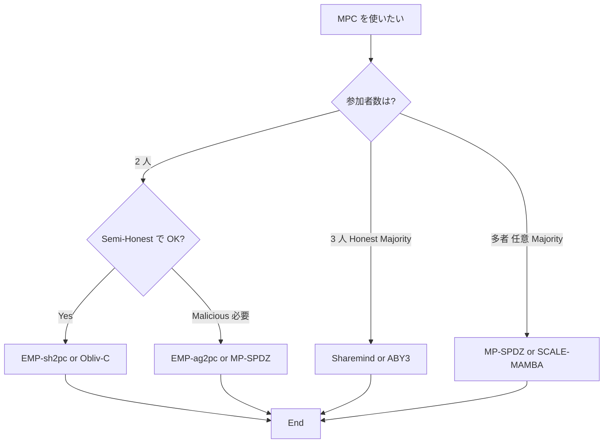

**日付**: 2026年4月24日
**学習内容**: ここまで 13 回で理論を学んだ。本記事では、それを**実際に動かす**ツールを概観する。具体的には (1) **MP-SPDZ** — Python-like DSL で多プロトコル切替、(2) **ABY / ABY3** — GC + GMW + Arithmetic の混在、(3) **EMP-toolkit** — C++ 最速クラス、(4) **Obliv-C** — C 拡張の DSL、(5) **Frigate** — コンパイラ研究、(6) **Sharemind** — 商用 3PC、(7) **SCALE-MAMBA** — SPDZ 産業実装、(8) 選び方のガイドライン、(9) 簡易なハンズオン例を扱う。理論的深さより、**どれをいつ使うか**を理解することが本記事の目標。

## 0. 本記事の位置づけ

本シリーズの最終実装回。Article 1–13 で「MPC とはなにか」と「どう動くか」を学んだ読者が、**自分で簡易な MPC を動かせる**状態に到達することを目指す。

実際の MPC 実装はライブラリを使うのが標準。ゼロから書く必要はない(し、書くべきでもない ― 暗号実装は細部で落とし穴が多い)。

本記事の構成:

- **第1〜7章**: 代表的な 7 つのツールを概観
- **第8章**: 選び方のガイドライン
- **第9章**: MP-SPDZ の hands-on 例
- **第10章**: Q&A

## 1. MP-SPDZ — 多プロトコル DSL

### 1.1 概要

**MP-SPDZ** (Keller 2020) は、Python-like な高級言語 **MAMBA** で MPC プログラムを書けるフレームワーク。CMU の Marcel Keller が主開発。

特徴:

- **複数プロトコル**: Semi-Honest 〜 Malicious、2 〜 多者、Arithmetic / Boolean すべて対応
- **Python-like DSL**: 機械学習ライクな記法で安全計算を書ける
- **バイトコードコンパイル**: 高級コードを MPC 専用 VM のバイトコードに変換
- **豊富な例**: MNIST、ロジスティック回帰、AES などサンプル多数

### 1.2 コード例

```python
# MAMBA (MP-SPDZ) の擬似例: 平均の計算
n = 3  # 参加者数
X = [sint.get_input_from(i) for i in range(n)]  # 各参加者からの秘密入力
mean = sum(X) / n
print_ln("Mean is %s", mean.reveal())
```

これだけで、$n$ 者間の平均計算 MPC が書ける。裏では SPDZ / MASCOT / Yao など選んだプロトコルで実行。

### 1.3 対応プロトコル

- **SPDZ (MASCOT, LowGear, HighGear)**: Arithmetic, Malicious, Dishonest Majority
- **Semi-Honest SPDZ**: 高速版
- **Replicated SS (3PC)**: Araki et al. 系
- **Yao's GC**: 2PC Semi-Honest / Malicious
- **BMR**: 多者 GC

### 1.4 性能

LAN 3PC Semi-Honest で数百万 gate/sec。Malicious 3PC でも Honest Majority なら 10 億 gate/sec(Araki et al. 2017)。

### 1.5 ハンズオン入門

GitHub: `https://github.com/data61/MP-SPDZ`

```bash
# セットアップ(Ubuntu)
git clone https://github.com/data61/MP-SPDZ.git
cd MP-SPDZ
make -j 8 mascot-party.x

# サンプル実行
echo "1 2 3" | ./Scripts/setup-ssl.sh 3
./mascot-party.x -N 3 -I -p 0 tutorial &
./mascot-party.x -N 3 -I -p 1 tutorial &
./mascot-party.x -N 3 -I -p 2 tutorial
```

## 2. ABY / ABY3 — 混在プロトコル

### 2.1 概要

**ABY** (Demmler-Schneider-Zohner 2015) は「**Arithmetic + Boolean + Yao**」の**混在プロトコル**フレームワーク。TU Darmstadt。

- **Arithmetic**: Beaver triple ベース(加算・乗算高速)
- **Boolean**: GMW ベース(論理演算)
- **Yao**: Yao's GC(深い回路)

**回路の部分ごとに最適なプロトコルを切り替え**。境界では変換(share conversion)。

### 2.2 コード例

```cpp
// ABY C++ 擬似例
auto x = bc->PutINGate(my_input, 32, SERVER);  // Boolean input
auto y = bc->PutINGate(other_input, 32, CLIENT);
auto sum = bc->PutADDGate(x, y);  // Boolean でなく Arithmetic に変換して高速加算
auto result = bc->PutOUTGate(sum, ALL);
party->ExecCircuit();
```

### 2.3 ABY3

**ABY3** (Mohassel-Rindal 2018) は **3PC Honest Majority 版**。ML 系タスクに特化。Araki et al. の超高速プロトコルを取り込んでいる。

### 2.4 適する用途

- **機械学習**: Mixed Boolean/Arithmetic circuit に自然
- **複雑な関数**: 部分ごとに最適化

## 3. EMP-toolkit — C++ 最速クラス

### 3.1 概要

**EMP-toolkit** (Wang et al.) は、Authenticated Garbling の著者陣が開発する **C++ MPC ライブラリ**。

- **emp-sh2pc**: Semi-Honest 2PC (Yao's GC)
- **emp-ag2pc**: Authenticated Garbling 2PC
- **emp-agmpc**: Authenticated BMR 多者

### 3.2 特徴

- 最適化された Yao's GC(Half-Gates、Fixed-key AES、Correlation Robust Hash)
- Authenticated Garbling のリファレンス実装
- 研究論文のベンチマーク用に頻出

### 3.3 コード例

```cpp
// emp-sh2pc 擬似例
using namespace emp;
// サーバ側
NetIO* io = new NetIO(nullptr, port);
setup_semi_honest(io, ALICE);
Integer a(32, my_input, ALICE);
Integer b(32, 0, BOB);  // BOB の入力
Integer sum = a + b;
cout << sum.reveal<int>() << endl;
delete io;
```

### 3.4 性能

AES 1 回の 2PC Semi-Honest: $\sim 1.5$ ms(LAN)。Malicious Authenticated: $\sim 10$ ms。

## 4. Obliv-C — C 拡張の DSL

### 4.1 概要

**Obliv-C** (Zahur-Evans 2015) は **C 言語の拡張**で、`obliv` 型修飾子とプロトコル原始で安全計算を書ける。

```c
void compare(void* args) {
    protocolIO *io = args;
    obliv int a, b, result;
    a = feedOblivInt(io->a, 1);  // ALICE の入力
    b = feedOblivInt(io->b, 2);  // BOB の入力
    obliv if (a < b) {
        result = a;
    } else {
        result = b;
    }
    revealOblivInt(&io->result, result, 0);  // 両者に公開
}
```

### 4.2 特徴

- **C プログラマに親しみやすい**
- **Yao's GC Semi-Honest** に特化
- **条件分岐**、ループ、関数呼び出しが自然

### 4.3 使い道

**研究・教育用**。実運用では MP-SPDZ や EMP がより活発。

## 5. Frigate — 高速 MPC コンパイラ

### 5.1 概要

**Frigate** (Mood et al. 2016) は C-like な言語から **超高速に MPC 回路** をコンパイル。

- Bristol Fashion 形式の Boolean 回路を出力
- **大規模回路**($10^8$ gate)でも現実的な時間でコンパイル

### 5.2 特徴

既存の compiler(Wysteria, CBMC-GC 等)より桁違いに速いコンパイルで、巨大な MPC 回路の実験を可能にした。

## 6. Sharemind — 商用 3PC

### 6.1 概要

**Cybernetica** 社(エストニア)の商用プラットフォーム。**3PC Honest Majority** 専用。

### 6.2 実績

- **Estonian 学生調査** (2015): 税務 × 教育データのクロス分析
- **政府統計**: 複数省庁のデータ統合
- **金融**: 多銀行の反不正検査

### 6.3 特徴

- **超高速**: Araki et al. 系の最適化
- **製品サポート**: ドキュメント、API、SLA
- **DSL: SecreC**: 高級言語

企業採用で実績豊富。アカデミア比でスケーラビリティが高い。

## 7. SCALE-MAMBA — SPDZ の産業実装

### 7.1 概要

**SCALE-MAMBA** (Aly et al. 2018) は Nigel Smart の University of Bristol / KU Leuven チームによる SPDZ 系実装。

- **MAMBA**: Python-like 言語
- **SCALE**: 実行エンジン
- SPDZ、MASCOT、BDOZ 系プロトコル

### 7.2 用途

- **産業向け**: 多者 Malicious MPC が必要な銀行・政府など
- **オフライン / オンライン分離**の実運用パターンに最適

## 8. 選び方のガイドライン

### 8.1 決定フローチャート



### 8.2 ユースケース別推奨

| 目的 | 推奨ツール |
|---|---|
| 学習・教育 | Obliv-C, MP-SPDZ |
| 研究ベンチマーク | EMP-toolkit |
| 機械学習 | ABY3, MP-SPDZ |
| 本番運用(政府・企業) | Sharemind, SCALE-MAMBA |
| 閾値署名 | Unbound, Fireblocks (商用) |
| ブロックチェーン | SCALE-MAMBA, カスタム |
| PSI 特化 | libOTe + カスタム |

### 8.3 性能の目安

AES 1 回の MPC 評価(LAN、2024):

| プロトコル | Semi-Honest | Malicious |
|---|---|---|
| EMP Yao's GC | 2 ms | — |
| EMP Authenticated Garbling | — | 10 ms |
| MP-SPDZ MASCOT | — | 50 ms |
| Sharemind 3PC | 0.5 ms | 2 ms |
| ABY | 5 ms | — |

## 9. MP-SPDZ ハンズオン — 最小例

### 9.1 インストール

```bash
# Ubuntu 22.04
sudo apt install automake build-essential git libboost-dev libgmp-dev \
    libntl-dev libsodium-dev libssl-dev libtool m4 python3 texinfo yasm

git clone https://github.com/data61/MP-SPDZ.git
cd MP-SPDZ
./Scripts/tldr.sh  # 自動セットアップ
```

### 9.2 第一歩: 平均計算

`Programs/Source/mean.mpc`:

```python
# 3 者の平均
n = 3
X = [sint.get_input_from(i) for i in range(n)]
mean = sum(X) / n
print_ln("Mean is %s", mean.reveal())
```

### 9.3 実行

```bash
# Compile
./compile.py mean

# 3 つの端末で実行(各参加者)
./replicated-ring-party.x -p 0 mean
./replicated-ring-party.x -p 1 mean
./replicated-ring-party.x -p 2 mean
```

入力は `Player-Data/Input-P0-0`, `Player-Data/Input-P1-0`, `Player-Data/Input-P2-0` から読む。

### 9.4 より本格的な例: 比較

```python
# 百万長者問題
a = sint.get_input_from(0)
b = sint.get_input_from(1)
richer = a > b
print_ln("A is richer: %s", richer.reveal())
```

### 9.5 機械学習の例

MP-SPDZ には **MNIST ロジスティック回帰**、**ニューラルネットワーク推論**のサンプルあり。100 MB 以内のモデルで動作。

## 10. Q&A

### Q1: 初心者におすすめは?

**MP-SPDZ**。ドキュメントが豊富、活発なコミュニティ、Python ライクな文法。チュートリアル(`tldr.sh`)で 10 分で動く。

### Q2: 本番環境で使えるのは?

**Sharemind, SCALE-MAMBA, Unbound/Fireblocks (商用)**。研究用フレームワークは性能や保守面で不十分なことが多い。

### Q3: Rust 実装はある?

- **swanky** (Galois): OT, GC, ZK proof
- **fancy-garbling**: OSU 実装
- **zkCrypto 系**: ZKP 主体だが一部 MPC

Rust で本格 MPC を書くのはまだ少数派。

### Q4: 量子耐性実装は?

**研究段階**。MP-SPDZ で SPDZ-2k は LWE ベースに拡張中。実装として確立しているのは非常に少ない。

### Q5: GPU 対応は?

**部分的**。Araki et al. の 3PC 実装や Sharemind 商用版で GPU 加速。一般フレームワークでは限定的。

### Q6: 自分で実装すべき?

**基本はしない**。暗号実装はサイドチャネル、タイミング攻撃、乱数の質など細部で致命的。教育・研究目的なら OK だが、本番は既存ライブラリを使う。

### Q7: Docker で気軽に試せる?

**MP-SPDZ にはある**。`docker pull mpspdz/mpspdz:latest` で始められる。

### Q8: 出力の真正性は?

ライブラリに依存。MP-SPDZ MASCOT などは MAC 検証で自動。Yao's GC の Semi-Honest は検証なし(Malicious 化必要)。

### Q9: デバッグは?

**難しい**。暗号化されたままでデバッグできない。Semi-Honest モードでログを出すか、plaintext モードでロジック確認後 MPC 化。

### Q10: 次に学ぶべきは?

- **論文読解**: 最新の MPC プロトコル(Silent OT、VOLE など)
- **自分の応用**: 実データで MPC を動かす
- **他技術との統合**: ZKP、FHE、TEE との併用

## 11. まとめ

### 本記事で学んだこと

- **MP-SPDZ**: Python-like DSL、多プロトコル、学習・研究に最適
- **ABY / ABY3**: Boolean + Arithmetic + Yao 混在
- **EMP-toolkit**: C++、最速、Authenticated Garbling の参照実装
- **Obliv-C**: C 拡張、教育用
- **Frigate**: 大規模回路の高速コンパイル
- **Sharemind**: 商用 3PC、政府・企業運用
- **SCALE-MAMBA**: SPDZ 産業実装
- **選び方**: 参加者数 × 脅威モデル × 用途で決まる
- **ハンズオン**: MP-SPDZ で 10 分で MPC を動かせる

### 次の記事(Article 15、最終回)へ

最終回は **応用事例と総合**:

- **Danish Sugar Beet Auction** の舞台裏
- **Estonian 学生調査** の詳細
- **閾値ECDSA / 暗号資産カストディ**
- **Google PSI / 広告コンバージョン**
- **機械学習プライバシー (SecureML, CrypTen)**
- **ZKP vs FHE vs TEE との比較総括**
- **MPC の研究フロンティア**(2024〜)
- **これから MPC を学ぶ人へのメッセージ**

### 3行サマリ

- **学習・研究には MP-SPDZ、性能には EMP-toolkit、商用には Sharemind/SCALE-MAMBA**
- **選び方は 参加者数 × 脅威モデル × 帯域(LAN/WAN) × 用途で決まる**
- **MPC は既に実運用段階 — 暗号実装は自分で書くのではなくライブラリを使う**

---

## 参考文献

- Marcel Keller. *MP-SPDZ: A Versatile Framework for Multi-Party Computation*. ACM CCS 2020. (MP-SPDZ)
- Daniel Demmler, Thomas Schneider, Michael Zohner. *ABY*. NDSS 2015.
- Payman Mohassel, Peter Rindal. *ABY3: A Mixed Protocol Framework for Machine Learning*. ACM CCS 2018.
- Xiao Wang, Alex Malozemoff, Jonathan Katz. *EMP-toolkit: Efficient MultiParty computation toolkit*. [https://github.com/emp-toolkit](https://github.com/emp-toolkit)
- Samee Zahur, David Evans. *Obliv-C: A Language for Extensible Data-Oblivious Computation*. eprint 2015/1153.
- Benjamin Mood et al. *Frigate: A Validated, Extensible, and Efficient Compiler and Interpreter for Secure Computation*. EuroS&P 2016.
- Dan Bogdanov, Sven Laur, Jan Willemson. *Sharemind: A Framework for Fast Privacy-Preserving Computations*. ESORICS 2008.
- Abdelrahaman Aly, Emmanuela Orsini, Dragos Rotaru, Nigel Smart. *SCALE-MAMBA v1.14 documentation*. 2020.
