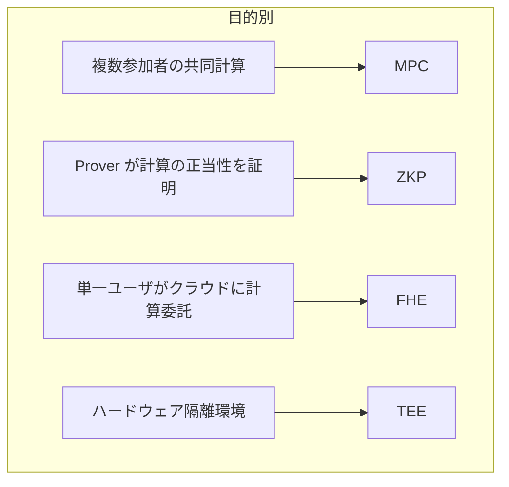

**日付**: 2026年4月24日
**学習内容**: 15 回にわたる本シリーズの最終回。**実世界で動いている MPC**を深掘りし、全体を総括する。具体的には (1) **Danish Sugar Beet Auction** の詳細、(2) **Estonian 学生調査**、(3) **Boston 男女賃金格差**、(4) **暗号資産カストディ / 閾値 ECDSA**、(5) **Google 広告コンバージョン(PSI)**、(6) **秘密計算機械学習(SecureML、CrypTen、MiniONN)**、(7) **ZKP / FHE / TEE との比較総括**、(8) **研究フロンティア**(2024〜)、(9) **15 記事の振り返り**と**次の学習ステップ**を扱う。理論と実装を学んだ読者が、**自分の課題に MPC を適用する**ための最後の橋渡し。

## 0. 本記事の位置づけ

Article 1 で、MPC は「Yao の百万長者問題から始まり、40 年の研究と実装を経て実世界に到達した」と述べた。本記事はその実世界の姿を 5 つの代表例で描き、**ZKP / FHE / TEE との住み分け**を整理し、**読者の次の一歩**を示す。

本記事の構成:

- **第1〜5章**: 5 つの実世界デプロイ事例
- **第6章**: プライバシー保護機械学習
- **第7章**: プライバシー保護計算 4 技術の比較総括
- **第8章**: 研究フロンティア
- **第9章**: 15 記事の振り返り
- **第10章**: 次の一歩
- **第11章**: Q&A

## 1. Danish Sugar Beet Auction(2008)

### 1.1 背景

デンマーク唯一の製糖会社 **Danisco** が、ビート生産契約を 1200 の農家から買い取る市場。従来は Danisco が農家個別に契約していたが、**効率的な市場メカニズム**(double auction)に移行したい。

問題:

- **農家の生産コスト**を Danisco に見せると、将来の交渉で不利に
- **Danisco の買取上限**を農家に見せると、談合の種
- 独立した市場運営者は存在しない

### 1.2 解決策

**SIMAP プロジェクト**(Aarhus 大学 Damgård ら)が **3 者間 MPC** を設計:

- **Party 1**: 農家協会 DKS
- **Party 2**: Danisco
- **Party 3**: SIMAP 研究者

各農家が DKS に入札を提出(暗号化)。Danisco が市場容量を提出。MPC で均衡価格を計算し、落札者を決定。

### 1.3 技術

- **BGW-based 3PC**(Article 6)
- **Shamir Secret Sharing**
- Semi-Honest(3 者の結託なしと仮定)

### 1.4 結果

- 2008 年 1 月、世界初の商用 MPC デプロイ
- 1200 農家、数万ゲートの回路を数分で実行
- 全参加者が納得する均衡価格を決定
- **現在も毎年実施**

### 1.5 教訓

- **3PC Honest Majority** は商用で十分実用
- **情報理論的 MPC** の堅牢性が信頼獲得に重要
- **法的・組織的な結託防止**が technical な MPC を補強

この成功が **Partisia 社**(SIMAP プロジェクトから spin-off)を生み、その後のオークション・市場運営プラットフォームに発展。

## 2. Estonian 学生調査(2015)

### 2.1 背景

エストニアで **IT 学生の 43% が卒業できない問題**。仮説: 「在学中に働く学生は中退率が高い」。検証には **税務データ(収入)× 教育データ(成績)** を統合する必要がある。

しかし:

- **GDPR 類似の法令**で省庁間のデータ直接共有は禁止
- **k-匿名化**だと粒度が粗すぎて有意な結果が出ない

### 2.2 解決策

**Cybernetica 社の Sharemind** による 3PC Honest Majority MPC。

- **Party 1**: 教育省
- **Party 2**: 税務委員会(EMTA)
- **Party 3**: Cybernetica(独立)

各省庁が自分のデータを 2 つ(Shamir SS)に分割して 2 つのサーバに送信。3 つのサーバが協力して相関分析を実行。

### 2.3 技術

- **Sharemind 3PC**(Article 14)
- **SecreC DSL** で分析ロジックを記述
- Semi-Honest(政府の組織的規律を前提)

### 2.4 結果

- 「働きながらの学生でも中退率は変わらない」
- 「より多く学ぶほど収入が高い」
- 従来仮説を覆す発見

### 2.5 教訓

- **MPC は実験的な研究だけでなく、実際の政策決定の材料になる**
- **データの直接共有ができない場合の重要な武器**
- **Semi-Honest + 組織的統制**が実用バランスとして有効

## 3. Boston 男女賃金格差調査(2017)

### 3.1 背景

Boston 市と **Boston Women's Workforce Council** が 114 社・166,705 人の給与データから **男女・人種別の賃金格差** を統計的に分析したい。

しかし:

- 個別企業の給与データは**絶対に開示したくない**(労働市場、競合情報)
- 従来は **業界横断アンケート** で粗い集計しかできなかった

### 3.2 解決策

**Boston 大学の研究者** が **Web ベース MPC 集計ツール**を開発:

- 各企業がブラウザで給与データを入力
- クライアント側で **XOR 秘密分散** して 2 つのサーバに送信
- 2 サーバが MPC で集計

### 3.3 技術

- **2PC Additive SS**(Article 11 の XOR SS と類似)
- Web ブラウザで JavaScript 実行(参加障壁を下げる)
- Semi-Honest 前提

### 3.4 結果

- ボストン地域の **男女賃金格差は米国労働統計局の推定より大きい**
- 業界別・職級別の詳細が初めて判明
- **米国上院の法案**(Wyden 2017)で「MPC を学生データ分析の要件」に明記される契機に

### 3.5 教訓

- **MPC は社会的課題に直接貢献できる**
- **参加の容易さ(Web ベース)** が企業採用の鍵
- **社会的な意義付け**が技術採用を加速

## 4. 閾値 ECDSA / 暗号資産カストディ

### 4.1 背景

暗号資産(Bitcoin、Ethereum)の秘密鍵は**単一障害点**。鍵を盗まれれば資産が無に帰す。

従来の解決:
- **ハードウェアセキュリティモジュール(HSM)**: 物理的に鍵を保護。だが内部犯・メーカ依存
- **マルチシグ**: 複数の鍵で承認。だがチェーン上で見え、プライバシーなし

### 4.2 MPC 解決策

**閾値 ECDSA**: 秘密鍵 $d$ を $n$ 個のサーバに分散。$t+1$ 台の協力で署名を生成。**単一の鍵はどこにも存在しない**。

### 4.3 技術(Lindell 2017, Doerner et al. 2019, Gennaro-Goldfeder 2020)

- **Shamir SS** で $d$ を分散
- ECDSA 署名の中間計算($k^{-1}, r$ など)を MPC
- Malicious-secure(資産狙いの強力な攻撃者想定)
- **Proactive**(定期的にシェアをリフレッシュ)

### 4.4 商用プロダクト

- **Unbound Tech** → **Coinbase 買収 (2021)**
- **Fireblocks**: エンタープライズカストディ
- **Curv** → **PayPal 買収 (2021)**
- **Sepior**: 銀行向け鍵管理

数百億ドル規模の資産を MPC で保護。

### 4.5 教訓

- **金融で MPC が商用化**
- **Malicious + Proactive** が必須
- **ブロックチェーンとの親和性**: オンチェーン署名、オフチェーン鍵管理

## 5. Google 広告コンバージョン(PSI)

### 5.1 背景

広告主 A と Google が、**広告を見た人(Google)と実際に購買した人(A)の共通集合**を知りたい。ROI 評価のため。

問題:

- **個人の購買履歴**は A の機密
- **広告閲覧者リスト**は Google の機密
- **共通要素数(または合計)**だけを計算したい

### 5.2 解決策

**Private Intersection-Sum (PIS)** — Private Set Intersection の拡張版。

- 各社が自分のリスト(顧客 ID + 購買額)を暗号化
- MPC で共通 ID を特定
- 共通 ID の**購買額合計**のみを出力(個別の情報は漏れない)

### 5.3 技術(Ion et al. 2017, 2019 論文)

- **DDH-based PSI** + **加法準同型暗号**
- 数千万〜数億エントリのスケール
- Semi-Honest(両社が合意)

### 5.4 実装

Google が社内フレームワーク (Private Join and Compute) として公開。広告コンバージョン計測に運用。

### 5.5 教訓

- **MPC が巨大テック企業で商用運用中**
- **特化プロトコル(PSI)** が汎用 MPC より圧倒的に高速な場合あり
- Article 7-8 で学んだ OT の**直接応用**

## 6. プライバシー保護機械学習

### 6.1 概要

近年最も活発な応用領域。モデル学習・推論を MPC で行う。

### 6.2 代表システム

**SecureML** (Mohassel-Zhang 2017):
- 2PC、Semi-Honest
- ロジスティック回帰、ニューラルネット
- Arithmetic + Boolean 混在

**CrypTen** (Facebook AI 2019):
- PyTorch 拡張
- 4PC、Semi-Honest
- 教育・研究用

**ABY3** (Mohassel-Rindal 2018):
- 3PC Honest Majority
- 高速訓練

**MiniONN** (Liu et al. 2017):
- 準同型暗号 + MPC
- モデル推論特化

**DELPHI** (Mishra et al. 2020):
- CNN 推論
- Pre-processing で高速化

### 6.3 用途

- **医療画像診断**: 病院のモデル × 患者の画像、両者のプライバシー保護
- **金融モデル**: 銀行のクレジットスコアモデル × 顧客の個人データ
- **広告**: パーソナライゼーションモデルの推論

### 6.4 課題

- **計算コスト**: MPC 推論は plaintext の 10〜1000 倍遅い
- **モデルサイズ**: 大規模 LLM はまだ厳しい
- **精度**: 固定小数点演算で精度劣化

活発な研究で急速に改善中。

## 7. 4 技術の総合比較 — MPC vs ZKP vs FHE vs TEE

### 7.1 比較表

| 側面 | MPC | ZKP | FHE | TEE |
|---|---|---|---|---|
| **参加者** | 2〜$n$ | 2(Prover/Verifier) | 1(アウトソース) | 1 |
| **対話** | 多い | 非対話化可能 | 非対話 | なし |
| **計算コスト** | 中 | 高(Prover) | 超高 | 低 |
| **通信コスト** | 高 | 低 | 中 | 極低 |
| **量子耐性** | Lattice OT なら Yes | Hash-based なら Yes | Lattice で Yes | No |
| **信頼モデル** | 非結託+暗号 | 暗号のみ | 暗号のみ | ハードウェア |
| **成熟度** | 商用運用 | 商用運用(zkRollup) | 研究+商用初期 | 商用運用 |

### 7.2 住み分け

### 7.3 組み合わせ

**MPC + ZKP**: MPC の各プレイヤーが「自分は正しく動いた」を ZKP で証明(GMW Compiler の現代版)

**MPC + FHE**: 大量データを FHE で圧縮し、複雑な部分だけ MPC で処理(Article 1 で触れたマルチキー FHE)

**MPC + TEE**: TEE で一部計算を高速化しつつ、鍵管理を MPC で分散(Oblix, Oasis Labs 等)

**ZKP + MPC + FHE + TEE**: 究極のプライバシースタック。研究段階だが可能性豊か。

## 8. 研究フロンティア(2024〜)

### 8.1 MPC for LLM

**ChatGPT 規模の LLM を MPC 推論**する研究。現状は 1 推論に数分〜数時間。以下で改善中:

- Puma (Dong et al. 2023)
- MPCFormer (Li et al. 2023)
- SIGMA (Gupta et al. 2023)

### 8.2 Silent OT / PCG

**Pseudorandom Correlation Generator (PCG)**: オフライン triple 生成をほぼ**通信なし**に。

- Boyle-Couteau-Gilboa-Ishai-Kohl-Scholl (CRYPTO 2019)
- Silent OT Extension: 超低通信で大量 OT

### 8.3 Post-Quantum MPC

NIST Post-Quantum 移行に向けて、Lattice-based MPC / OT。まだ性能が古典の 10〜100 倍遅い。

### 8.4 MPC for Blockchain

- **MPC-as-a-Service**: ブロックチェーンと統合した MPC
- **Fairblock, Partisia Blockchain**: MPC を基盤とするパブリックチェーン
- **DeFi への応用**: プライベート取引、MEV 対策

### 8.5 Differential Privacy との統合

MPC で集計 + DP でノイズ付加。Google / Apple の Privacy Sandbox に近い設計。

## 9. 15 記事の振り返り

### 9.1 Phase ごとのハイライト

**Phase 1(Article 1–4): 基盤**
- Yao の百万長者から始める MPC の思想
- Real/Ideal パラダイムでの安全性定義
- 脅威モデルの階層(Semi-Honest, Malicious, 腐敗閾値)
- 暗号ツールキット(有限体、多項式、PRF、コミットメント)

**Phase 2(Article 5–6): 秘密分散**
- Shamir SS の美しさ(ラグランジュ補間)
- BGW の次数削減

**Phase 3(Article 7–8): OT**
- OT の MPC Complete 性
- IKNP OT Extension の魔法

**Phase 4(Article 9–12): 汎用プロトコル**
- Yao's GC と Half-Gates 最適化
- GMW の多者自然性
- Beaver triple のオフライン/オンライン

**Phase 5(Article 13–15): Malicious と実装**
- Cut-and-Choose、SPDZ、Authenticated Garbling
- 実装ツールと実世界応用

### 9.2 キーテクニック

**シミュレーション**、**秘密分散**、**OT**、**ガーブリング**、**MAC**、**Cut-and-Choose** — これらを組み合わせることで、MPC は構築される。

### 9.3 キー論文

- Yao 1986 (GC)
- GMW 1987 (Completeness)
- BGW 1988 (Information-Theoretic)
- Beaver 1992 (Triples)
- IKNP 2003 (OT Extension)
- FreeXOR 2008
- SPDZ 2012
- Half-Gates 2015
- Authenticated Garbling 2017

この 9 本で MPC の骨格が見える。

## 10. 次の一歩

### 10.1 深化したい読者へ

**教科書・チュートリアル**:

- **Evans-Kolesnikov-Rosulek: *A Pragmatic Introduction to Secure Multi-Party Computation***(無料)
- **Lindell: *How to Simulate It***(証明技術)
- **Boneh-Shoup: *A Graduate Course in Applied Cryptography***(基礎)

**コース**:
- **Berkeley CS294-152 (Secure Computation)**
- **TU Graz / Bristol の MPC コース**
- **MIT 6.5610 (Applied Cryptography)**

### 10.2 実装したい読者へ

- **MP-SPDZ** を git clone して動かす(Article 14)
- **EMP-toolkit** で Authenticated Garbling
- **Swanky (Rust)** で Vector OLE

自分の小さな問題(平均、標準偏差、集合交差)を MPC で実装するのが最高の学習。

### 10.3 研究したい読者へ

**学会**:
- Crypto, EUROCRYPT, ASIACRYPT(暗号理論)
- CCS, S&P, USENIX Security(応用)
- TCC(理論)
- PKC, PoPETs(プライバシー関連)

**著者をフォロー**:
- Yehuda Lindell (Coinbase, Bar-Ilan)
- Mike Rosulek (OSU)
- Vladimir Kolesnikov (Georgia Tech)
- Abhi Shelat (Northeastern)
- Nigel Smart (KU Leuven)
- Marcel Keller (CSIRO)

### 10.4 コミュニティ

- **Real World Crypto**(毎年の応用暗号カンファレンス)
- **IACR ePrint** で最新論文チェック
- **MPC Alliance**(業界団体)

## 11. Q&A

### Q1: MPC を勉強する価値は?

**大いにある**。2024 年時点で MPC は実運用段階。暗号資産、プライバシー分析、AI プライバシーで需要急増。暗号の基礎力としても非常に強力。

### Q2: 数学が苦手でも学べる?

**学べる**。有限体・多項式・確率論の基本があれば OK。深い代数幾何や数論は不要(ZKP より低ハードル)。

### Q3: プログラマとして MPC を使うには?

**MP-SPDZ や EMP を使う**。ゼロから暗号実装する必要はない。Python 書ける人なら MP-SPDZ で 1 週間でサンプル動かせる。

### Q4: 「MPC エンジニア」というキャリアはある?

**ある**。Coinbase、Fireblocks、Google、Meta、Apple などが採用中。暗号バックグラウンド + 実装力で希少人材。

### Q5: 研究者として MPC に入るには?

**修士〜博士でのテーマ選択**:
- プロトコル最適化(より速い GC、OT)
- 新応用領域(AI、ブロックチェーン)
- 理論(不可能性、閾値)

論文を読み、手を動かし、発表する。

### Q6: MPC の「次」はあるか?

**常に次はある**。

- Post-Quantum MPC
- MPC + AI
- 大規模スケーリング(1000+ 参加者)
- UC-secure PoQ composable
- Hardware acceleration

### Q7: 本シリーズの次に読むべき?

優先順:

1. **Evans-Kolesnikov-Rosulek 教科書**(本シリーズの底本の1つ)
2. **MP-SPDZ のチュートリアル**(実装)
3. **IACR ePrint の新刊**(研究)

### Q8: MPC は ZKP ほどバズってないのは?

ブロックチェーンで ZKP が目立つため。だが MPC は**ウォレット、カストディ、プライベート分析**で静かに運用されている。派手さはないが確実に動く。

### Q9: 日本語のリソースは?

少ないが増えつつある。**IACR 日本支部**、**CSS(暗号学シンポジウム)**、**SCIS** で発表あり。本シリーズも日本語リソースの1つになれば幸い。

### Q10: 最後に一言?

**手を動かしてください**。MPC は抽象的ですが、実装してみると驚くほど具体的で美しい。MP-SPDZ で "Hello World" を動かす瞬間、**理論が生きた姿**で目の前に現れます。

## 12. まとめ

### 本記事で学んだこと

- **5 つの実世界デプロイ**: Danish Sugar Beet、Estonian 学生、Boston 賃金格差、閾値ECDSA、Google PSI
- **機械学習 MPC**: SecureML、CrypTen、MiniONN など活発な研究領域
- **4 技術比較**: MPC vs ZKP vs FHE vs TEE の住み分け
- **研究フロンティア**: LLM MPC、Silent OT、Post-Quantum、Blockchain 統合
- **15 記事の全体像**: 理論から実装、実世界までの一貫した学習パス
- **次の一歩**: 教科書、実装、研究、コミュニティへの招待

### シリーズ全体の3行サマリ

- **MPC = 複数参加者が秘密入力のまま合意関数を計算する技術。40 年の研究と実装を経て実世界に到達**
- **3 大ビルディングブロックは Secret Sharing、Oblivious Transfer、Garbled Circuits。これらから GMW、BGW、SPDZ、Yao's GC が組み立てられる**
- **2024 年時点で Google、PayPal、Coinbase、政府統計などで実運用中。ZKP/FHE/TEE と並ぶプライバシー保護計算の 4 技術の1つ**

### 謝辞と展望

本シリーズを最後まで読んでくださり、ありがとうございました。**MPC は「プライバシーと計算を両立する」という人類の古い夢**を、40 年かけて少しずつ現実に近づけてきました。

皆さんがこれから MPC を使って、**新しい共同計算の形**を世に生み出すことを願っています。暗号は単なる道具ではなく、**信頼のインフラを再設計する**力です。MPC はその中でも特に、**「互いを信頼しなくても協力できる世界」**を技術的に支える存在です。

これからの旅路が、実り多いものでありますように。

---

## 参考文献

- Peter Bogetoft et al. *Secure Multiparty Computation Goes Live*. FC 2009. (Danish)
- Dan Bogdanov. *Smarter decisions with no privacy breaches*. Real World Crypto 2015. (Estonian)
- Azer Bestavros, Andrei Lapets, Mayank Varia. *User-centric Distributed Solutions for Privacy-preserving Analytics*. CACM 60(2), 2017. (Boston)
- Yehuda Lindell. *Fast Secure Two-Party ECDSA Signing*. CRYPTO 2017.
- Jack Doerner, Yashvanth Kondi, Eysa Lee, Abhi Shelat. *Threshold ECDSA from ECDSA Assumptions*. IEEE S&P 2018.
- Mihaela Ion et al. *Private Intersection-Sum Protocol with Applications to Attributing Aggregate Ad Conversions*. IACR ePrint 2017/738. (Google PSI)
- Payman Mohassel, Yupeng Zhang. *SecureML: A System for Scalable Privacy-Preserving Machine Learning*. IEEE S&P 2017.
- David Evans, Vladimir Kolesnikov, Mike Rosulek. *A Pragmatic Introduction to Secure Multi-Party Computation*. NOW Publishers, 2018.
- Yehuda Lindell. *Secure Multiparty Computation (MPC)*. IACR ePrint 2020/300.
- Elette Boyle et al. *Efficient Pseudorandom Correlation Generators*. CRYPTO 2019. (PCG)
- Ye Dong et al. *Puma: Secure Inference of LLaMA-7B in Five Minutes*. 2023. (MPC for LLM)
