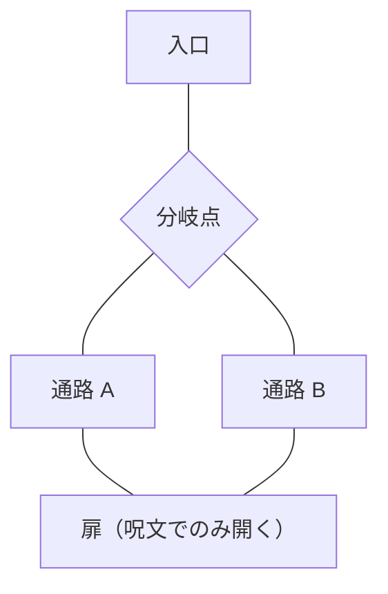
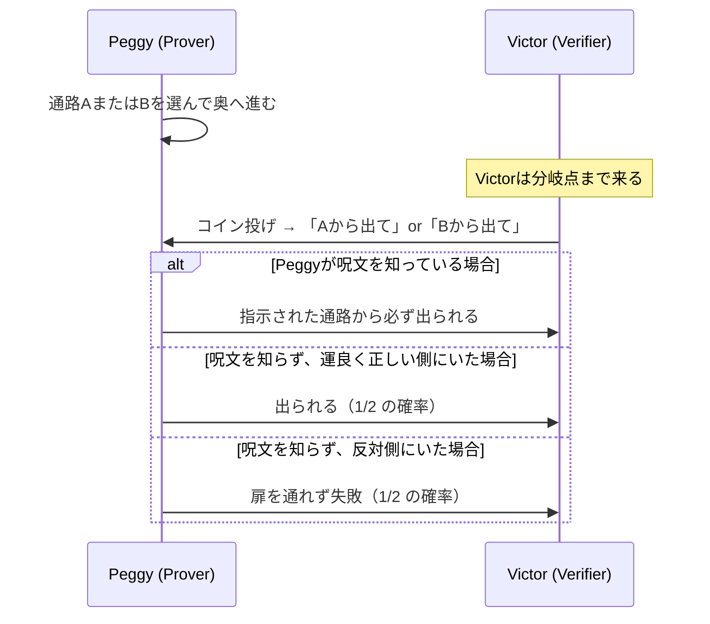
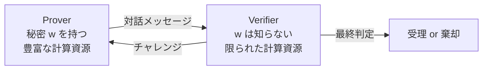
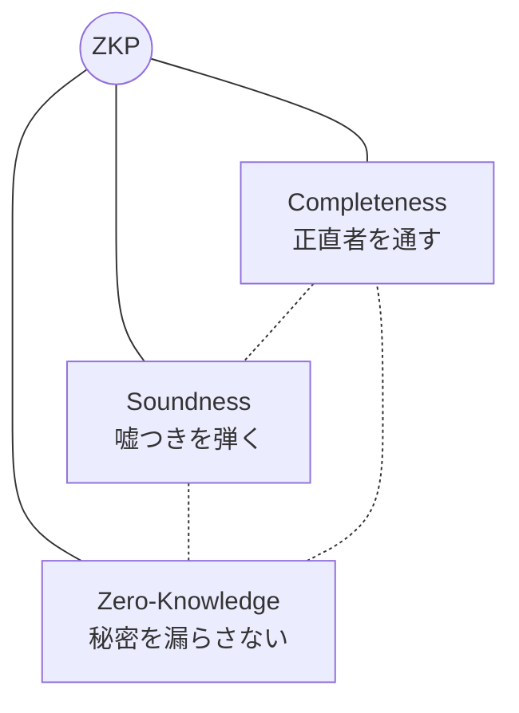
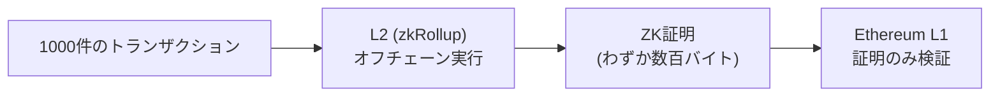

**日付**: 2026年4月22日
**学習内容**: 本記事は「ゼロ知識証明（Zero-Knowledge Proof, ZKP）」の入門記事である。ZKPとは、**ある事実が真であることだけを相手に納得させ、それ以外の一切の情報を漏らさない**という、一見矛盾した魔法のような証明技術である。本記事ではまず「証明」という営みを再定義するところから始め、**アリババの洞窟**という古典的な例えを使ってZKPの直感をつかむ。そのうえで登場人物である **Prover（証明者）と Verifier（検証者）** の役割、そしてZKPが満たすべき **3つの性質（完全性・健全性・ゼロ知識性）** を概観する。

## 0. 本記事の位置づけ

この30記事連載の目的は、「**ZKPを使えばプライバシーを保ったまま何でも証明できる**」という漠然としたイメージを、**具体的な数式と仕組みのレベルで理解できる**状態に引き上げることだ。

しかし一足飛びに有限体や楕円曲線の話に入っても、そもそも「なぜそんなことをするのか」の感覚が掴めないままになる。そこで本記事（Article 1）では、**数式をほぼ使わず、ZKPの「気持ち」を直感でつかむ**ことに集中する。次の記事（Article 2）以降で、その直感を数学的に厳密化していく。

本記事の構成:

- **第1〜2章**: 「証明」という行為の再定義と、ZKPがなぜ必要か
- **第3〜4章**: アリババの洞窟の例え
- **第5〜6章**: 登場人物（Prover・Verifier）と3つの性質
- **第7〜8章**: 歴史と応用の俯瞰

## 1. 「証明」とは何か — 古典的な証明の限界

### 1.1 古典的な証明は「静的な文書」

数学の世界で「証明」と言えば、たとえばピタゴラスの定理の証明のように、**紙に書かれた論理の連なり**を指す。読み手は黙々とそれを読み、「なるほど、確かに $a^2 + b^2 = c^2$ は成立する」と納得する。

この種の証明の特徴は:

- **証明者は一方的に証明を書く**
- **検証者は受動的に読むだけ**
- **証明は「静的な文書」として完結する**

### 1.2 古典的な証明の問題点

ところが、この「静的な証明」には次のような**本質的な弱点**がある。

**問題1: 証明そのものが「秘密」を漏らしてしまう**

たとえば「**あるパスワード $w$ を知っている**」ことを証明したいとき、古典的な方法では $w$ そのものを見せるしかない。しかしそれでは「秘密」がバレてしまうので、本末転倒だ。

**問題2: 検証者に巨大な計算コストを押し付ける**

ある巨大な計算（たとえば100万件のブロックチェーントランザクションが正当か）が正しく実行されたことを検証したいとき、古典的には**同じ計算を検証者も全部やり直す**しかない。これではスケールしない。

### 1.3 発想の転換 — インタラクティブで確率的な証明

1985年、Goldwasser・Micali・Rackoff の3人は、この2つの問題を同時に解決する、途方もないアイデアを提案した。それが**対話的・確率的な証明**である。

- **対話的（Interactive）**: 証明者と検証者が何回かメッセージをやりとりする
- **確率的（Probabilistic）**: 証明者を100%ではなく「99.999...%」の確率で信じる

「100%じゃないの？」と思うかもしれない。しかし**騙される確率を $2^{-128}$ 程度まで下げられる**なら、実用的には100%と同じだ。そして**この「確率的に許す」という譲歩が、プライバシー保護と効率性の両方を一気に可能にする**。

## 2. ゼロ知識証明 — 「知っていることを、知らせずに示す」

### 2.1 ZKPの定義（ゆるい版）

ゼロ知識証明（Zero-Knowledge Proof）とは、ざっくり言えば次のような証明のことだ:

> **ある主張 $x$ が真であることを、検証者に納得させる。ただし「$x$ が真である」という事実そのもの以外、何の情報も漏らさない。**

これを実現するのが ZKP である。たとえば:

| 証明したいこと | 漏らしたくない情報 |
|---|---|
| 「私は18歳以上である」 | 正確な年齢・誕生日 |
| 「私は口座に$1000以上持っている」 | 正確な残高 |
| 「私は正解を知っている（パスワードでも数独でも）」 | 正解そのもの |
| 「このブロックチェーンの状態遷移は正当だ」 | トランザクションの詳細 |
| 「ある画像は未改変の元画像から撮られた」 | 元画像そのもの |

### 2.2 なぜ「矛盾しない」のか — 直感の壁

「事実を納得させるには事実を見せるしかないのでは？」という感覚を持つのは自然だ。実際、ZKPが1985年に提案されたとき、数学者たちの多くが「そんなものは不可能だ」と拒絶した。

だが、**「対話」と「確率」を持ち込むと、この不可能が可能になる**。直感をつかむために、有名なアリババの洞窟の例えを見てみよう。

## 3. アリババの洞窟 — ZKPの古典的例え

### 3.1 舞台設定

Peggy（Prover＝証明者）は、**魔法の呪文**を知っている。彼女はその呪文を使って、洞窟の奥にある扉を開けられる。

Victor（Verifier＝検証者）はPeggyに「本当に呪文を知っているのか？」と疑っている。

洞窟の形は下の図のようなループ状になっていて、**入口は1つ**だが奥が**左右2本の通路（AとB）に分岐**し、そのどん底で**扉が塞いでいる**。扉は呪文でしか開かない。

Peggyの主張:

> **「私は呪文を知っている。だから通路Aから入っても通路Bから出られるし、その逆もできる」**

しかしPeggyは呪文そのものは絶対に教えたくない。一方Victorは、本当にPeggyが呪文を知っていることを納得したい。

### 3.2 プロトコル（やりとりの手順）

2人は次のような手順を繰り返す。

1. **Peggyが先に洞窟に入る**。Victorからは見えない位置で、PeggyはAかBのどちらかの通路を**自由に選んで**奥まで進む
2. **Victorが分岐点まで来て、コインを投げる**。表なら「Aから出てきて」、裏なら「Bから出てきて」と指示する
3. **Peggyは指示された通路から出てくる**

### 3.3 なぜこれが証明になるのか

ここがポイントだ。Peggyが**本当に呪文を知っていれば**、どちらから入ったかに関係なく、Victorの指示通りに出られる。つまり **100% 成功する**。

一方、**呪文を知らないのにハッタリをかましている**なら、Peggyは最初にAかBのどちらかを選んで入っているはず。もしVictorの指示がたまたま同じ側なら何食わぬ顔で出てこられるが、反対側を指示されたら**扉を通れないので失敗**する。成功確率は **50%**。

### 3.4 「騙される確率」を限りなくゼロに

1回だけの試行では、運の悪いPeggy（実は呪文を知らない）でも50%の確率で成功してしまう。だが**同じ手順を $n$ 回繰り返せば**、毎回運良く当てる確率は:

$$
\left(\frac{1}{2}\right)^n
$$

- $n = 10$ 回: $\frac{1}{1024} \approx 0.1\%$
- $n = 40$ 回: $\frac{1}{10^{12}}$（1兆分の1）
- $n = 128$ 回: $\frac{1}{2^{128}}$（宇宙の原子の数より小さい）

つまり**十分に回数を重ねれば、Victorは「Peggyは本当に呪文を知っている」と実質的に確信できる**。

### 3.5 なぜ「ゼロ知識」なのか

ここが本当に不思議なところだ。**Victorは「Peggyが呪文を知っている」という事実以外、何の情報も得られない**。

- Victorは呪文そのものを聞いていない
- VictorがPeggyの行動を見ていても、それは「Peggyが指示通りに出てきた」という光景だけ
- この光景は**呪文を知らない人でも再現できる**（たとえば偶然Aを選んで、偶然Aを指示されれば、呪文なしでも成功したように見える）

この「後から再現できる」という性質が、**ゼロ知識性**の本質だ。この点は次の記事で厳密に定義する「**シミュレーション**」という概念につながる。

### 3.6 Note: 洞窟の例えの限界

この例えは直感に優れているが、厳密には完璧ではない。たとえば:

- **「Peggyは実際にはランダムに選ばなくてもよいのでは？」**: 毎回同じ通路から入っていれば、Victorが偶然毎回同じ側を指示する確率は $(1/2)^n$ なので結局同じ
- **「Victor が複数人いたら？」**: 実は**複数のVictorに同時に実演を見せると、ゼロ知識性が壊れる**という話がある。これは後の記事で触れる「Honest-Verifier ZK」の話

これらの細部は、次の記事以降で扱う。

## 4. 登場人物 — Prover と Verifier

ZKPを理解するうえで、以下の2つの役割を常に意識しておきたい。

### 4.1 Prover（証明者）

ある主張が真であることを**示したい側**。一般に以下の資源を持つ:

- 証明したい主張 $x$（例: 「私は年齢18以上である」）
- その根拠となる**秘密情報 $w$**（Witnessと呼ぶ。例: 生年月日）
- 計算資源は基本的に豊富（複雑な暗号計算を実行できる）

### 4.2 Verifier（検証者）

その主張が本当に真かどうかを**確認したい側**。以下の制約を持つ:

- 計算資源は**限定的**（多項式時間しか使えない）
- $w$ を知ってはならない（知ってしまうとプライバシー保護の意味がなくなる）
- 決定は **受理（accept）** または **棄却（reject）**

### 4.3 両者の関係

通常の証明では Prover が一方的に文書を送るが、ZKP（対話型）では **Verifier が何度かチャレンジを送り、Prover が応答する** というやりとりを繰り返す。これにより、Proverが本当に $w$ を知っているかを「試す」ことができる。

## 5. ZKPの3つの性質（プレビュー）

ZKPが「証明」と呼べるためには、次の3つの性質を満たす必要がある。これは次の記事（Article 2）で詳しく扱うが、ここで直感だけ掴んでおく。

### 5.1 完全性（Completeness）

**「Proverが本当に事実を知っているなら、必ずVerifierを納得させられる」**

数式的には:

$$
\Pr[V \text{ が受理する} \mid \text{主張が真}] = 1
$$

洞窟の例なら、「呪文を知っているPeggyは、何回試されても指示通りに出てこられる」ということ。

### 5.2 健全性（Soundness）

**「Proverが事実を知らないなら、Verifierを（ほぼ）騙せない」**

$$
\Pr[V \text{ が受理する} \mid \text{主張が偽}] \leq \varepsilon
$$

ここで $\varepsilon$ は**ソロ健全性誤差**と呼ばれ、十分小さい値（たとえば $2^{-128}$）。洞窟の例なら、「呪文を知らないハッタリPeggyは、$n$ 回繰り返されたら $(1/2)^n$ の確率でしか騙せない」ということ。

### 5.3 ゼロ知識性（Zero-Knowledge）

**「Verifierは、事実が真であるということ以外、何も学ばない」**

これは次の「シミュレーション」という概念で厳密化される:

> **Verifierが対話の結果から得る情報は、$w$ を知らない人でもシミュレートできる情報と区別がつかない**

つまり「対話の記録」を見せられても、それは**何の新情報ももたらさない**。

### 5.4 三角形のバランス

この3つの性質は、しばしば「三すくみ」の関係にある:

たとえば「すべて受理する Verifier」は完全性100%だが健全性はゼロ。「すべて棄却する Verifier」は健全性100%だが完全性はゼロ。**3つすべてを同時に満たす** ように設計するのが、ZKPプロトコル設計の醍醐味だ。

## 6. 少しだけ形式化する — 数式で書くとどうなるか

直感を数式で書くと次のようになる。詳細は次の記事で扱うので、まずは「こういう形になるのか」と眺めるだけで十分。

ある言語 $L$（例: 「解のある数独の集合」「ハミルトンパスを持つグラフの集合」）があり、Proverは「$x \in L$」であることを証明したい。

- **Completeness**: $\forall x \in L$ について、正直なProverは Verifier を受理させられる
- **Soundness**: $\forall x \notin L$ と任意の（悪意ある）Prover $P^\ast$ について、

$$
\Pr[V \text{ が受理する}] \leq \varepsilon
$$

- **Zero-Knowledge**: 任意のVerifier $V^\ast$ について、多項式時間のシミュレータ $S$ が存在して、

$$
\text{View}_{V^\ast}(P, V^\ast)(x) \approx S(x)
$$

つまり「実際のやりとりで $V^\ast$ が見たもの」と「シミュレータが $x$ だけから生成したもの」が計算量的に区別できない。

## 7. ZKPの歴史 — 1985年の革命

ZKPの物理的な誕生は、1985年の以下の論文だ:

> Shafi Goldwasser, Silvio Micali, Charles Rackoff.  
> *"The Knowledge Complexity of Interactive Proof-Systems."*  
> STOC 1985.

この論文は当初、複数の一流会議で**拒絶**された。「そんな証明は意味がない」「直感に反する」というのが主な理由だった。だがその後、以下のような怒涛の発展を経て、**現代暗号の基礎の一部**となった。

| 年 | 出来事 |
|---|---|
| 1985 | Goldwasser-Micali-Rackoff: ZKPの概念を提案 |
| 1986 | Fiat-Shamir: 対話を非対話に変換する方法（Fiat-Shamir変換） |
| 1988 | Ben-Or et al.: NP全体がゼロ知識証明を持つことを証明 |
| 1992 | Kilian: SNARK（succinct argument）の原型 |
| 2012 | Pinocchio（Parno et al.）: 実用的なSNARK |
| 2013 | Zcash の前身 Zerocash: ZKPによる完全秘匿トランザクション |
| 2016 | Groth16: 最小サイズのSNARK |
| 2019 | PLONK: ユニバーサルSetup |
| 2020〜 | zkEVM・zkRollup の実用化 |
| 2022 | Goldwasser・Micali がチューリング賞受賞 |

**40年近くの地道な発展が、現在のブロックチェーンスケーリング・プライバシー技術の土台になっている**。次の記事以降で、これらの詳細を一つずつ追っていく。

## 8. なぜいまZKPなのか — 応用の俯瞰

ZKPは長らく理論の世界の話だったが、2020年代に入ってから急速に実用化が進んでいる。主な応用領域を俯瞰しておこう。

### 8.1 ブロックチェーンのスケーリング — zkRollup

Ethereum はセキュリティと分散性を保つために、1秒あたりのトランザクション処理数を低めに保っている。これをスケールさせる鍵がZKPだ。

**アイデア**: 大量のトランザクションを**オフチェーン**で処理し、その結果が正しいという**ZKPだけを本チェーンに送る**。本チェーンは1つの証明を検証するだけで、数千件のトランザクションを信頼できる。

### 8.2 プライバシー保護トランザクション — Zcash, Tornado Cash

**「誰が・いくら送ったか」を隠したまま、送金が正当であることだけを証明する**。Zcash の `zk-SNARK` が典型例。

### 8.3 アイデンティティ証明 — ZK-KYC

「18歳以上である」「特定の国籍ではない」などを、**生年月日・国籍そのものを見せずに証明**できる。政府や金融機関のKYCで注目されている。

### 8.4 計算の委託 — Verifiable Computing

「GPU で巨大なAIモデルの推論を走らせた。その結果が正しい」という証明を、**再計算せずに**検証できる。ZKML（Zero-Knowledge Machine Learning）として研究が進む。

### 8.5 写真の真正性 — C2PA

生成AIの普及で「この写真は本物か合成か」の判別が重要に。**カメラのセンサーで撮影された画像が、許可された編集（切り抜き・縮小）だけを経ている**ことをZKPで証明する試みがある。

このようにZKPは「プライバシー」「スケーリング」「信頼性」の3方向で現代のインフラを変えつつある。

## 9. Q&A: よくある疑問

### Q1: 「ゼロ知識」と言っても、「真である」という情報は伝わるのでは？

**伝わる**。正確には「**事実が真であるという1ビットの情報以外は漏らさない**」という意味。その1ビットの情報は証明の目的そのものなので、漏らさないと意味がない。

### Q2: 確率的証明で「99.999%の確信」って、100%にならないと証明と呼べないのでは？

**数学的厳密性と実用性は別**。暗号の世界では「$2^{-128}$ の確率で失敗する」と「絶対に失敗しない」は実質的に同値と扱う（宇宙の寿命を超えて試しても失敗例が出ない確率）。なおFiat-Shamir変換などで非対話化したZKPは、実用上「1回送って1回検証する」で十分な信頼性を得られる。

### Q3: ZKPと暗号化（encryption）はどう違うのか？

**目的が違う**:
- **暗号化**: 情報を他人に読まれないようにする（情報の保護）
- **ZKP**: 情報を開示せずに、その情報の性質だけを証明する（情報の「性質」の保護）

ZKPでは暗号化技術を内部で使うが、ゴールが違う。

### Q4: Proverが不正しようとしたら？

**それを防ぐのが Soundness の役割**。プロトコルが健全であれば、たとえProverが悪意を持って振る舞っても、偽の主張を通せる確率は $2^{-128}$ 程度まで抑えられる。「Proverを信頼する必要はない」のが ZKP の強み。

### Q5: 洞窟の例えだと物理的に動いているが、実際のZKPはどう動くのか？

**通信プロトコル**として動く。PeggyとVictorは物理的に動くのではなく、**数式（多項式・楕円曲線点・ハッシュ値など）をメッセージとしてやりとりする**。次の記事以降で具体的な数式を見ていく。

### Q6: 「呪文」に対応するのは実際には何？

**Witness（証人）$w$** と呼ばれる秘密情報。例:

| 主張 | Witness $w$ |
|---|---|
| 「私は特定のパスワードを知っている」 | パスワードそのもの |
| 「この数独は解ける」 | 解の盤面 |
| 「私は18歳以上」 | 生年月日 |
| 「このブロックは正当」 | すべてのトランザクションと中間状態 |

## 10. まとめ

### 本記事で学んだこと

- **ゼロ知識証明（ZKP）** は、「ある主張が真であることだけを相手に納得させ、それ以外の情報を一切漏らさない」証明技術
- ZKPは **対話的（Interactive）かつ確率的（Probabilistic）** な証明として1985年に誕生した
- **アリババの洞窟**の例えで、ZKPの直感を掴める:
  - Peggy（Prover）が呪文を知っていれば100%成功
  - 知らなければ50%の確率で失敗 → 繰り返せば $(1/2)^n$ まで健全性が上がる
  - Victor（Verifier）は「呪文を知っている」という事実以外、何の情報も得ない
- ZKPは **完全性・健全性・ゼロ知識性** の3つの性質を同時に満たす
- 応用は **zkRollup、プライバシートランザクション、ZK-KYC、検証可能計算** などに広がっている

### 次の記事（Article 2）へ

次の記事では、この3つの性質（**完全性・健全性・ゼロ知識性**）を数式で厳密に定義する。特に「ゼロ知識性」を定義するために必要な **シミュレーションパラダイム** と **計算量的識別不可能性** という2つの道具立てを導入する。

また、**知識の証明（Proof of Knowledge）** と **巻き戻し法（Rewinding）** という、Proverが「本当に」Witnessを持っていることを検証する仕組みも紹介する。

### 3行サマリ

- **ZKP = 事実の真偽だけを伝え、根拠となる秘密情報は漏らさない証明**
- **対話 + 確率** という発想が鍵。100% ではなく $1 - 2^{-128}$ の信頼で十分
- 3つの性質（**Completeness / Soundness / Zero-Knowledge**）を同時に満たす設計が ZKPの本質

---

## 参考文献

- Shafi Goldwasser, Silvio Micali, Charles Rackoff. *The Knowledge Complexity of Interactive Proof-Systems.* STOC 1985.
- Jean-Jacques Quisquater et al. *How to Explain Zero-Knowledge Protocols to Your Children.* CRYPTO 1989.（アリババの洞窟の例えの原典）
- Dan Boneh, Shafi Goldwasser, Dawn Song, Justin Thaler, Yupeng Zhang. *ZKP MOOC*. UC Berkeley / Stanford, 2023.
- Justin Thaler. *Proofs, Arguments, and Zero-Knowledge.* 2022. [https://people.cs.georgetown.edu/jthaler/ProofsArgsAndZK.pdf](https://people.cs.georgetown.edu/jthaler/ProofsArgsAndZK.pdf)
