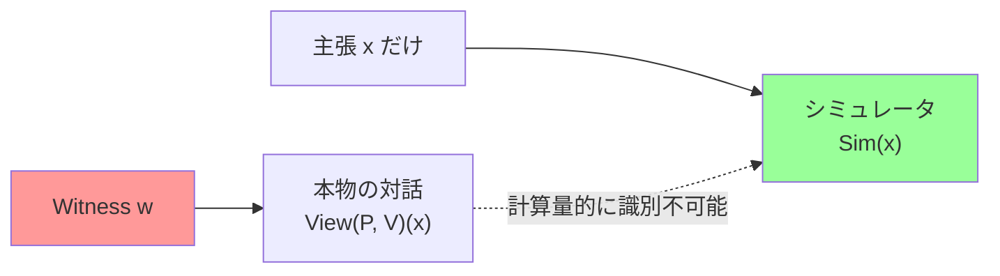
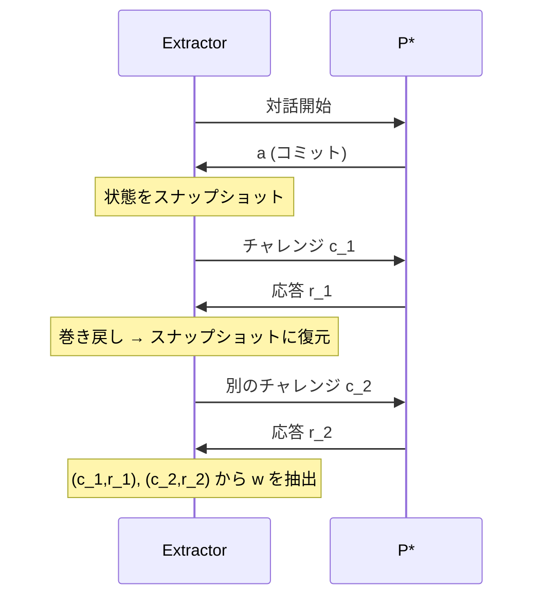
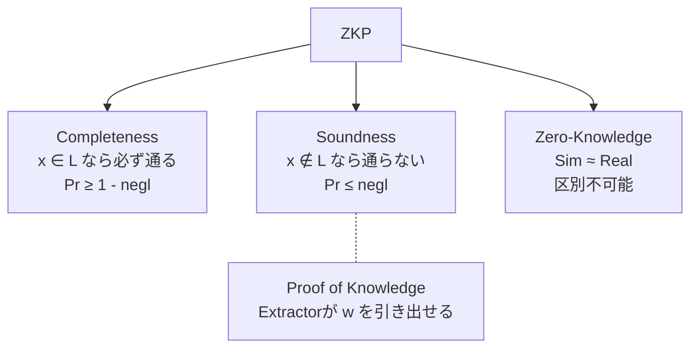

**日付**: 2026年4月24日
**学習内容**: Article 1 では「ZKPとは何か」を洞窟の例えで直感的に掴んだ。本記事ではその直感を **数式で厳密に定義する**。具体的には、対話型証明の形式的なモデルを置いたうえで、ZKPが満たすべき **完全性（Completeness）・健全性（Soundness）・ゼロ知識性（Zero-Knowledge）** の3つの性質を、一つずつ定義と例で押さえる。特にゼロ知識性は **シミュレーションパラダイム** と **計算量的識別不可能性** という道具立てが必要で、ここが初学者にとって最大の山場。最後に、**知識の証明（Proof of Knowledge）** と **巻き戻し（Rewinding）** という、Proverが「本当に」秘密を持っていることを検証する仕組みを導入する。

## 0. 本記事の位置づけ

Article 1 では、洞窟の例えで次のような直感を得た。

- 「Peggyが呪文を知っていれば100%成功する」 → 完全性
- 「呪文を知らなければ、たくさん試されたら必ずバレる」 → 健全性
- 「Victorは呪文以外何も知らないまま納得する」 → ゼロ知識性

しかしこの3つを「数式」として書かないと、プロトコルが本当にこれを満たしているかを**証明**できない。つまり ZKP そのものが「数学的な証明」として成立しない。本記事の目的は、この3つの性質を**形式的な確率の式として定義し直す**ことだ。

構成:

- **第1章**: 対話型証明の形式モデル（IP）
- **第2〜4章**: 完全性・健全性・ゼロ知識性の厳密定義
- **第5章**: ゼロ知識の3つの強さ（Perfect / Statistical / Computational）
- **第6章**: 知識の証明と巻き戻し
- **第7章**: 具体例（二次剰余ZK）
- **第8章**: Q&A とまとめ

## 1. 対話型証明の形式モデル

### 1.1 登場キャスト

まず、使う記号を揃える。

| 記号 | 意味 |
|---|---|
| $L$ | 「真の主張」の集合（言語）。例: 「解のある数独の集合」 |
| $x$ | ある主張（インスタンス）。$x \in L$ か $x \notin L$ かを判定したい |
| $w$ | $x \in L$ の根拠となる秘密情報（Witness / 証人） |
| $R$ | 関係 $R = \{(x, w) : x \in L \text{ の証人が } w\}$ |
| $P$ | Prover（証明者）— アルゴリズム |
| $V$ | Verifier（検証者）— 多項式時間アルゴリズム |
| $\lambda$ | セキュリティパラメータ（例: 128） |
| $\text{negl}(\lambda)$ | 無視可能関数。$\lambda$ について超多項式的に速く0に近づく |

**言語 $L$ の例**:

- $L_{\text{Sudoku}} = \{\text{解のある数独パズル}\}$
- $L_{\text{3COL}} = \{\text{3色塗り分け可能なグラフ}\}$
- $L_{\text{DLOG}} = \{(g, h) : \exists w,\ h = g^w\}$（離散対数）

### 1.2 対話のモデル

Prover $P$ と Verifier $V$ が $k$ 回メッセージを交換する。これを記号で書くと:

$$
\begin{aligned}
m_1 &= P(x, w) \\
m_2 &= V(x, m_1; r_V) \\
m_3 &= P(x, w, m_2) \\
&\vdots \\
\text{出力} &= V(x, m_1, m_2, \ldots, m_k; r_V) \in \{0, 1\}
\end{aligned}
$$

ここで:

- $r_V$ は $V$ が内部で使うランダムコイン（乱数）
- 最後の出力が $1$ なら「受理（accept）」、$0$ なら「棄却（reject）」

```mermaid
sequenceDiagram
    participant P as Prover P(x, w)
    participant V as Verifier V(x; r_V)
    P->>V: m_1
    V->>P: m_2 (乱数 r_V に依存)
    P->>V: m_3
    V->>P: m_4
    Note over P,V: ... k ラウンド続く ...
    V->>V: 最終判定 0 or 1
```

### 1.3 対話型証明（IP）の定義

一般に「**言語 $L$ に対する対話型証明**」とは、上のような2者間プロトコル $\langle P, V \rangle$ のことをいう。

## 2. 完全性（Completeness）— 正直者は必ず通る

### 2.1 定義

**完全性（Completeness）**: もし $x \in L$ なら、正直なProver $P$ は高い確率で $V$ に受理される。

形式的には:

$$
\forall x \in L,\ \forall w \text{ (with } (x,w) \in R), \quad
\Pr_{r_V}\left[ \langle P, V \rangle(x) = 1 \right] \geq 1 - \text{negl}(\lambda)
$$

つまり:

- Proverが本物のWitness $w$ を持っている
- Verifierのランダムコイン $r_V$ について確率を取る
- その確率で受理される

多くのプロトコルでは完全性は **完璧（確率1）**、つまり:

$$
\Pr_{r_V}\left[ \langle P, V \rangle(x) = 1 \right] = 1
$$

を満たす。これを **Perfect Completeness** という。

### 2.2 直感

完全性とは「**本物を嘘と誤認するな**」という要請だ。洞窟の例なら:

- Peggyが呪文を知っている
- どちらの通路を指定されても、扉を開けて出られる
- よって**100%成功**する

もし完全性が崩れる（正直者が稀に棄却される）と、そのプロトコルは使い物にならない。たとえば銀行認証で「正しいパスワードなのに10%の確率で拒否される」なら困る。

### 2.3 なぜ $1 - \text{negl}(\lambda)$ という書き方なのか

プロトコルによっては、数値誤差やハッシュ衝突などで**ごく稀に**失敗することがある。その失敗確率が **$\lambda$ を大きくすれば指数的に0に近づく**なら、実用上は問題ない。この「指数的に0に近づく関数」を **無視可能（negligible）** と呼ぶ:

$$
\text{negl}(\lambda) \text{ とは}: \quad \forall c > 0,\ \exists \lambda_0,\ \forall \lambda > \lambda_0, \quad \text{negl}(\lambda) < \frac{1}{\lambda^c}
$$

たとえば $2^{-\lambda}$、$\lambda^{-\log\lambda}$ は無視可能関数。一方 $\frac{1}{\lambda^{100}}$ は多項式なので **無視可能ではない**（多項式より遅く0に近づくから）。

## 3. 健全性（Soundness）— 嘘つきは（ほぼ）通らない

### 3.1 定義

**健全性（Soundness）**: $x \notin L$ のとき、**どんな悪意あるProver $P^\ast$** をもってきても、$V$ を騙せる確率は小さい。

形式的には:

$$
\forall x \notin L,\ \forall P^\ast, \quad
\Pr_{r_V}\left[ \langle P^\ast, V \rangle(x) = 1 \right] \leq \varepsilon(\lambda)
$$

ここで $\varepsilon(\lambda)$ は **健全性誤差（soundness error）**。無視可能関数であれば十分。

### 3.2 なぜ「任意の $P^\ast$」と書くのか

Proverは悪意を持ちうるので、**正直な戦略に限定してはいけない**。Proverはどんなアルゴリズム、どんなズルい戦略を使ってもよい。それでも騙せる確率が $\varepsilon(\lambda)$ を超えない、というのが健全性。

### 3.3 直感

洞窟の例で言えば:

- Peggyが呪文を知らない
- 1ラウンドで騙せる確率 = $\frac{1}{2}$
- $n$ ラウンド繰り返すと、$n$ 回とも運良く当てる必要があるので、騙せる確率は $\left(\frac{1}{2}\right)^n$

### 3.4 「議論（Argument）」と「証明（Proof）」の区別

健全性の $P^\ast$ に「**任意**」と書いたが、実は2種類ある:

| 名前 | $P^\ast$ の制限 | 強さ |
|---|---|---|
| **Statistical Soundness（統計的健全性）** | 計算能力は無制限 | 強い |
| **Computational Soundness（計算量的健全性）** | $P^\ast$ は多項式時間 | 弱い |

前者を満たすシステムを **Proof**、後者のみ満たすシステムを **Argument** と呼ぶ。現代の多くの SNARK は「**Succinct Non-interactive Argument of Knowledge**」つまり Argument である（Proof ではない）ため、計算能力に制限のない攻撃者には破れる可能性がある。しかし実用上は量子計算機でない限り安全。

## 4. ゼロ知識性（Zero-Knowledge）— 秘密は漏れない

### 4.1 「情報が漏れない」とはどういう意味か

まず、「Verifier が対話中に見たもの」を集めた記録を **View** と呼ぶ:

$$
\text{View}_{V}(P, V)(x) := \big( x, r_V, m_1, m_2, \ldots, m_k \big)
$$

- $x$: 主張
- $r_V$: Verifierのランダムコイン
- $m_i$: 対話メッセージ

Verifierは対話後、このViewを持っている。**このViewから何か新しい情報を抽出できないか？** というのが問題だ。

### 4.2 シミュレーションパラダイム

Goldwasser-Micali-Rackoffの天才的アイデアは、「**$x$ だけを知っている人（Witness $w$ を持たない人）が、Viewを偽造できるなら、Viewには新情報がない**」というものだ。

これを **シミュレーションパラダイム** という:

> **多項式時間アルゴリズム $\text{Sim}$（シミュレータ）が存在し、$x$ だけを入力として、本物のViewと区別できない偽Viewを作れる**

### 4.3 形式的定義

**Zero-Knowledge**: 任意の（悪意ある）Verifier $V^\ast$ について、多項式時間のシミュレータ $\text{Sim}_{V^\ast}$ が存在し、

$$
\big\{ \text{View}_{V^\ast}(P, V^\ast)(x) \big\}_{x \in L}
\quad \approx \quad
\big\{ \text{Sim}_{V^\ast}(x) \big\}_{x \in L}
$$

ここで $\approx$ は **計算量的識別不可能性（computational indistinguishability）** を表す。

### 4.4 計算量的識別不可能性とは

2つの確率分布 $D_1, D_2$ が計算量的に識別不可能とは、**多項式時間の任意の識別器（distinguisher）** $D$ に対して:

$$
\Big| \Pr_{z \sim D_1}[D(z) = 1] - \Pr_{z \sim D_2}[D(z) = 1] \Big| \leq \text{negl}(\lambda)
$$

つまり「$D_1$ からサンプルされたか $D_2$ からサンプルされたかを、多項式時間の観察者は無視可能な誤差でしか当てられない」。これは **暗号理論における「情報がない」** の定義である。

### 4.5 なぜこれで「情報が漏れていない」と言えるのか

論理はこうだ:

1. Verifier が対話から情報を得る
2. → その情報はViewの中にある
3. → だが Sim が $x$ だけから偽Viewを作れる
4. → 偽Viewには $w$ の情報がない
5. → 偽View ≈ 本物View なので、本物Viewにも $w$ の情報は（実効的に）ない



Simの側には $w$ が入力されていないのに、出力は本物と区別できない。これが「$w$ の情報は漏れていない」の数学的意味だ。

### 4.6 **Honest-Verifier ZK** と **（Malicious）ZK**

ここで微妙だが重要な区別:

- **HVZK（Honest-Verifier Zero-Knowledge）**: Verifier がプロトコル通りに動く場合だけ、ゼロ知識性を保証
- **ZK（Malicious-Verifier ZK）**: Verifier が任意にプロトコルを逸脱しても、ゼロ知識性を保証

洞窟の例だと、もしVictorが「左右どちらから出て来い」ではなく、スマホで写真を撮りながら両方の通路を見張ったら？ それはプロトコル逸脱なので、HVZKの保証は破れるかもしれない。本当の意味でのZKは、この種の逸脱にも強くあることを要求する。

実用ZKPの多くは **Fiat-Shamir 変換**（後の記事で詳述）により HVZK から ZK に格上げできる。

## 5. ゼロ知識性の3段階

「計算量的識別不可能性」と書いたが、実は**どれくらい識別不可能か**でさらに3段階ある。

| 名前 | 分布の関係 | 強さ |
|---|---|---|
| **Perfect ZK** | View と Sim の分布が **完全に一致** | 最強 |
| **Statistical ZK** | 統計的距離 $\leq \text{negl}(\lambda)$ | 中 |
| **Computational ZK** | 多項式時間識別器で $\text{negl}(\lambda)$ しか違いを検出できない | 弱い（実用で十分） |

### 5.1 統計的距離の定義

2つの分布 $D_1, D_2$ の統計的距離は:

$$
\Delta(D_1, D_2) := \frac{1}{2} \sum_{z} \Big| \Pr_{D_1}[z] - \Pr_{D_2}[z] \Big|
$$

これが無視可能なら **Statistical ZK**。

### 5.2 なぜ Computational ZK で十分か

Perfect ZK は暗号学的に最も美しいが、構成が難しく、また「計算量的にしか安全でない」暗号プリミティブ（たとえば離散対数ベースの暗号）の上には載せられない。

実用では **Computational ZK で十分**。なぜなら「多項式時間で区別できない」なら、現実世界の攻撃者（も多項式時間しか持たない）には情報が漏れないからだ。

## 6. 知識の証明（Proof of Knowledge）と巻き戻し

### 6.1 単なる「真」ではなく「知っている」の証明

ここまでの議論は、「$x \in L$ である」ことの証明だった。しかし実用では、もう一歩強い要求がある。

> **Prover は Witness $w$ を「知っている」ことを証明したい**

たとえば「このパスワードのハッシュに合う元パスワードが存在する」と証明するだけでは弱い。**Prover 自身がその元パスワードを知っている** ことを示せないと、ズルの余地がある。

### 6.2 Knowledge Extractor の定義

これを形式化するには **抽出器（Extractor）** を導入する。

**Proof of Knowledge**: $P^\ast$ が $V$ を十分な確率で受理させるなら、**多項式時間の Extractor $E$** が $P^\ast$ から $w$ を抽出できる:

$$
\Pr\big[E^{P^\ast}(x) = w \text{ s.t. } (x,w) \in R\big] \geq \Pr\big[\langle P^\ast, V \rangle(x) = 1\big] - \text{negl}(\lambda)
$$

$E^{P^\ast}$ は「$E$ が $P^\ast$ を**ブラックボックス的に**呼び出せる」ことを意味する。

### 6.3 巻き戻し（Rewinding）とは

Extractor がどうやって $w$ を取り出すのか。その代表的なテクニックが **巻き戻し（Rewinding）** だ。

1. Extractor は $V$ として $P^\ast$ とプロトコルを走らせる
2. ある時点でランダムチャレンジ $c_1$ を送り、応答 $r_1$ を得る
3. **同じ時点に戻り（= 巻き戻し）**、別のチャレンジ $c_2$ を送り、応答 $r_2$ を得る
4. $(c_1, r_1), (c_2, r_2)$ の2つの応答から $w$ を代数的に解く



この「同じ内部状態に戻せる」という特権は、**現実の Verifier にはない**（現実の Prover は巻き戻されない）。しかし Extractor は**数学的な存在**なので、この特権を使ってよい。

### 6.4 なぜこれで「知っている」が示せるか

もし $P^\ast$ が本当に $w$ を知らずに、ただ運で通していたなら、巻き戻して別のチャレンジを試しても応答できないはずだ。

もし2つの応答がどちらも正しいなら、$P^\ast$ は $(c_1, r_1, c_2, r_2)$ から計算できる何らかの情報 — つまり**実質的に $w$** — を持っていることになる。これが抽出可能性（extractability）の直感。

## 7. 具体例 — 二次剰余（QR）の対話型ZKP

抽象的な定義を見たので、具体的な例を一つ動かしてみよう。

### 7.1 問題設定

整数 $N = pq$（$p, q$ は大きな素数）が与えられる。ある整数 $y \in \mathbb{Z}_N^\ast$ について、

> **$y$ は $\mathbb{Z}_N$ における二次剰余（Quadratic Residue）である**

を証明したい。つまり $\exists w,\ y \equiv w^2 \pmod{N}$。

Witnessは**平方根 $w$** だが、これを漏らしたくない。

### 7.2 プロトコル

1. **Prover**: ランダムに $r \in \mathbb{Z}_N^\ast$ を選び、$s = r^2 \bmod N$ を送る
2. **Verifier**: ランダムに $b \in \{0, 1\}$ を選び、$b$ を送る
3. **Prover**: 
   - $b = 0$ なら $z = r$ を返す
   - $b = 1$ なら $z = r \cdot w \bmod N$ を返す
4. **Verifier**: 
   - $b = 0$ のとき、$z^2 \equiv s \pmod N$ を確認
   - $b = 1$ のとき、$z^2 \equiv s \cdot y \pmod N$ を確認

### 7.3 完全性の検証

**$b = 0$ のケース**:

$$
z^2 = r^2 = s \pmod N
$$

これは $s$ の定義そのもの。OK。

**$b = 1$ のケース**:

$$
z^2 = (r \cdot w)^2 = r^2 \cdot w^2 = s \cdot y \pmod N
$$

最後のステップで $w^2 = y$ を使った。OK。

したがって Prover が正しい $w$ を持つなら**必ず**通る（Perfect Completeness）。

### 7.4 健全性の検証

もし $y$ が二次剰余ではない（= $w$ が存在しない）とする。悪意あるProver $P^\ast$ はどうしたら $V$ を騙せるか？

$P^\ast$ は先に $s$ を送るので、その時点で $b=0$ と $b=1$ のどちらで検証されるかわからない。

- **$b = 0$ で通る $s$ の選び方**: 任意の $r$ を選んで $s = r^2$ と置く。応答は $z = r$
- **$b = 1$ で通る $s$ の選び方**: 任意の $r$ を選んで $s = r^2 / y$ と置く。応答は $z = r$

これらは**両立しない**（$y$ が非二次剰余なので、$s$ は2つの意味を同時に持てない）。したがって $P^\ast$ は**どちらか一方の $b$ にしか答えられない** → 騙せる確率は $\frac{1}{2}$。

$n$ ラウンド繰り返せば騙せる確率は $2^{-n}$。十分大きい $n$ で健全性誤差は無視可能。

### 7.5 ゼロ知識性の検証（Sim の構成）

**シミュレータの構成**:

$\text{Sim}$ は $w$ を持たずに、本物と区別できないViewを作る。

1. $b' \in \{0, 1\}$ をランダムに選ぶ（先読み）
2. $z' \in \mathbb{Z}_N^\ast$ をランダムに選ぶ
3. 
   - $b' = 0$ なら $s' = z'^2 \bmod N$ と置く
   - $b' = 1$ なら $s' = z'^2 / y \bmod N$ と置く
4. Verifier に $(s', b', z')$ を提出する

**このSimが生成する View の分布**:

- $s'$ は「ランダムな $z'$ を2乗したもの」なので、$\mathbb{Z}_N$ の二次剰余上の一様分布（$b'=0$ のケース）、あるいは $y$ をかけた分布（$b'=1$ のケース）
- **本物の Prover**も、$s = r^2$（$r$ 一様）なので同じ分布を生成する
- $z'$ も $r$ または $rw$ と同じ分布

つまり本物の View と Sim の View は**完全に同一**の分布 → **Perfect ZK**。

### 7.6 ただし問題点

上の Sim は「先読みで $b'$ を選ぶ」が、実際の対話では Verifier が $b$ を後から送る。**巻き戻し**を使えば、Sim は Verifier に $b'$ を送り、もし Verifier が $b = b'$ なら採用、違えば巻き戻してやり直す。期待試行回数は2回（Verifierが $b$ を $\{0,1\}$ から均等に選ぶ場合）。よって多項式時間でSim可能。

## 8. 3つの性質の関係図

最後に、この記事で定義した3つの性質を俯瞰する:



健全性はさらに **Proof of Knowledge** に強化でき、「通る ⇒ Witness を実際に知っている」まで言える。これが SNARK の「K」が Knowledge の K である所以。

## 9. Q&A

### Q1: Soundness Error $\varepsilon$ と Negligible Function の関係は？

$\varepsilon(\lambda) = 1/2$ のように一定の値でも、プロトコルを $n$ 回繰り返せば $\varepsilon^n$ になる。$n = \lambda$ と置けば $(1/2)^\lambda$ で無視可能関数になる。つまり**1ラウンドでの健全性誤差が $1/2$ でも、$\lambda$ 回繰り返せば実用上問題ない**。

### Q2: Perfect ZK / Statistical ZK / Computational ZK を使い分ける場面は？

- **Perfect ZK**: 情報理論的な安全性が必要な場合。構成は難しい（よく知られた例: グラフ同型）
- **Statistical ZK**: 無限の計算能力を持つ攻撃者にも安全。Pedersen commitment など
- **Computational ZK**: 実用の多くの SNARK。計算量仮定（離散対数など）に依存

### Q3: Honest-Verifier ZK で十分な場面は？

**Fiat-Shamir 変換** を適用する場合、もとが HVZK なら変換後は（Random Oracle Model で）本物のZKになる。したがって **Fiat-Shamir 可能なプロトコルなら HVZK で実用上十分**。

### Q4: 巻き戻しは現実に起きないなら、なぜ意味があるのか？

巻き戻しは **数学的なExtractorの議論** で使う。「もし $P^\ast$ が通るなら、仮想的に巻き戻して $w$ を取り出せる」 → 「したがって $P^\ast$ は $w$ を知っている」という**論理展開**。現実に巻き戻す必要はない。

### Q5: 「知識の証明」は常に必要？

**ZK だけなら不要だが、暗号応用では必須**。たとえば「私はこのコインの持ち主だ」という主張で、Witness（秘密鍵）を実際に知っていることを示さないと、他人の証明を流用されうる（**証明の可搬性** の問題）。

### Q6: $P^\ast$ の計算能力を限定しないと、Soundness はどうなる？

$P^\ast$ が無制限なら、理論的には暗号仮定を破って偽造できる。しかし対話型証明では「送れるビット数」と「相手の乱数を見られないこと」で制限されているので、情報理論的な健全性（Statistical Soundness）は保てる場合がある。これが「Proof」と「Argument」の違い。

## 10. まとめ

### 本記事の要点

1. **対話型証明のモデル**: Prover と Verifier が $k$ ラウンドメッセージ交換し、最終的に Verifier が $\{0,1\}$ を出力
2. **完全性**: $x \in L$ なら正直 Prover は確率 $\geq 1 - \text{negl}$ で通る
3. **健全性**: $x \notin L$ なら任意の $P^\ast$ の騙し確率 $\leq \text{negl}$
4. **ゼロ知識性**: $V^\ast$ が得る View を $\text{Sim}(x)$ が $w$ なしで再現できる
5. **シミュレーションパラダイム**: 「$w$ なしで再現できる＝情報が漏れていない」の形式化
6. **ZKの3段階**: Perfect / Statistical / Computational
7. **Proof of Knowledge**: さらに強く「Prover が実際に $w$ を知っている」ことを Extractor で示す
8. **巻き戻し**: Extractor が $P^\ast$ から複数回の応答を引き出して $w$ を代数的に解く手法

### 次の記事（Article 3）へ

次の記事では、**対話型証明（IP）** から **非対話型証明（NIZK・SNARK）** への進化を追う。Fiat-Shamir 変換、Common Reference String (CRS) モデル、そして **SNARK = Succinct Non-interactive ARgument of Knowledge** の各文字が何を意味するかを整理する。

### 3行サマリ

- **3つの性質は確率の式として定義される**: Completeness, Soundness, Zero-Knowledge
- **ゼロ知識性 = Sim ≈ Real という計算量的識別不可能性**
- **Proof of Knowledge = Extractor による巻き戻し抽出で「知っている」を形式化**

---

## 参考文献

- Goldwasser, Micali, Rackoff. *The Knowledge Complexity of Interactive Proof-Systems.* STOC 1985.
- Oded Goldreich. *Foundations of Cryptography, Volume 1: Basic Tools.* Cambridge University Press, 2001. (第4章「Zero-Knowledge Proof Systems」)
- Justin Thaler. *Proofs, Arguments, and Zero-Knowledge.* 2022.
- ZKP MOOC Lecture 1 (UC Berkeley, 2023).
