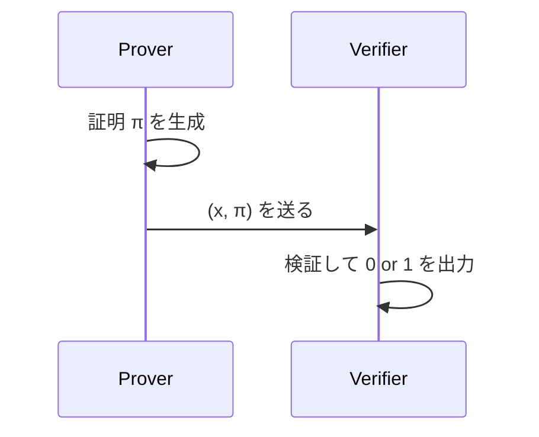
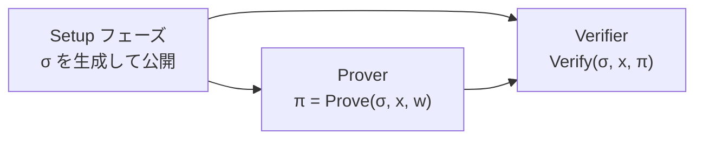
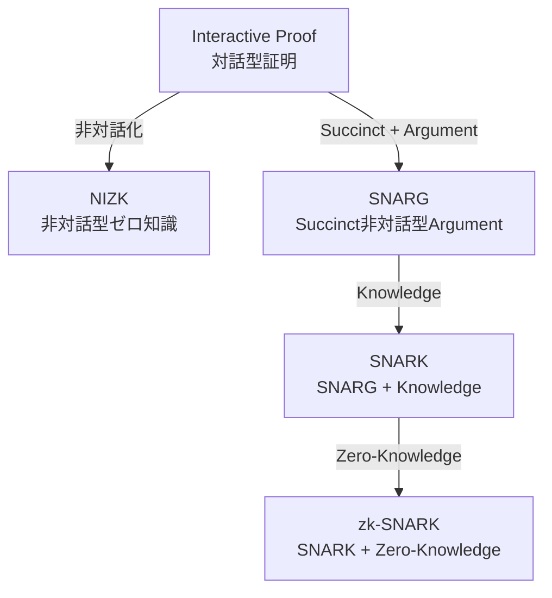
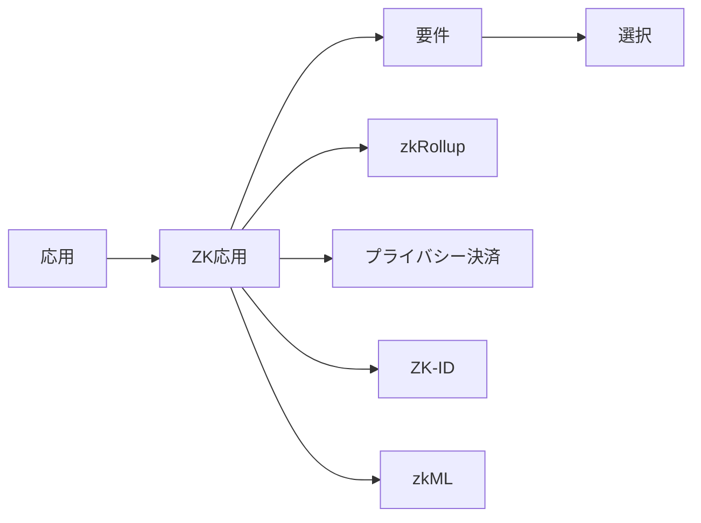

**日付**: 2026年4月22日
**学習内容**: Article 2 では対話型 ZKP の3つの性質を厳密に定義した。しかし現実の多くのシステム（ブロックチェーン、認証、画像署名など）では、Prover と Verifier が**対話**する時間がない。Prover は証明を**一発で**送りつけ、Verifier は単独で検証したい。これを実現するのが **非対話型ゼロ知識証明（NIZK: Non-Interactive Zero-Knowledge）** であり、特に現代で最も注目されている **SNARK（Succinct Non-interactive ARgument of Knowledge）** である。本記事では、対話型 → 非対話型の進化を追い、**SNARK という略語の5文字が何を意味するか**を1文字ずつ分解する。さらに **SNARG vs SNARK**、**CRS（Common Reference String）モデル**、**Random Oracle モデル** という、非対話化に不可欠な概念群を整理する。

## 0. 本記事の位置づけ

Article 1 で直感、Article 2 で形式定義を固めた。**このArticleでは、ZKP が SNARK へと進化してブロックチェーンの基盤技術になるまでの流れを掴む。**

具体的には:

- **第1章**: なぜ非対話化したいのか
- **第2章**: 非対話化の2つの道具（CRS と Random Oracle）
- **第3章**: SNARK の5文字を1字ずつ分解
- **第4章**: SNARG vs SNARK の違い
- **第5章**: zkSNARK の「zk」が何を意味するか
- **第6章**: 応用との対応関係
- **第7章**: Q&A とまとめ

## 1. なぜ非対話化したいのか

### 1.1 対話型の問題点

Article 2 で扱った対話型 ZKP は、プロトコルとして美しい。しかし実際に使おうとすると次のような問題にぶつかる。

**問題1: ブロックチェーンでは対話できない**

Ethereum のスマートコントラクトは、1つのトランザクションで完結する必要がある。「Prover がデータを送る → Verifier が乱数を返す → Prover が応答する」という対話は、**複数のブロックをまたぐ**ので現実的でない（ガス代も膨大）。

**問題2: 検証者が複数人いると矛盾が起きる**

対話型 ZKP は「1対1の対話」が基本だ。もし Verifier が2人いて別々にチャレンジを送ってきたら、Prover の応答は**相互に矛盾**し、秘密情報が漏れうる（再利用可能性の問題）。

**問題3: 証明の保存・再利用ができない**

対話型では、証明は「2者間のやりとり」としてのみ存在する。「後から他の人に見せたい」「監査のために記録したい」という要求に応えられない。

### 1.2 非対話型とはどういうことか

**非対話型証明**は、Prover が**1つのメッセージ $\pi$** を Verifier に送りつけて終わりのプロトコル。

$$
\text{Prover}(x, w) \xrightarrow{\quad \pi \quad} \text{Verifier}(x, \pi) \xrightarrow{} \{0, 1\}
$$

対話がないので上の3問題はすべて解決する。ただしそのままでは**健全性が崩れる**。なぜなら、対話型で健全性を支えていた「Verifier のランダムチャレンジ」がないため、Prover が**応答を先に作ってから $x$ を逆算する**ことが可能になる。

### 1.3 非対話化の奇跡 — 道具が必要

非対話型 ZKP を実現するには、「Verifier のランダムチャレンジ」の代わりになる**共通の信頼できる何か**が必要だ。これには大きく2つの道具がある:

1. **CRS（Common Reference String）モデル**: 事前に決まった共有文字列を、両者が信じる
2. **Random Oracle（RO）モデル**: ハッシュ関数を理想乱数として扱い、Prover が自分にチャレンジを投げる

次章で両方を見ていく。

## 2. 非対話化の2つの道具

### 2.1 CRSモデル（Common Reference String）

**CRS** とは、「Prover と Verifier の両方が信じる、事前に決まった共有ランダム文字列」のこと。たとえば:

$$
\sigma \in \{0,1\}^{\text{poly}(\lambda)} \quad \text{(信頼できる乱数列)}
$$

プロトコルは:

**誰が $\sigma$ を作るのか** が問題になる。もし Prover が作れるなら、偽の $\sigma$ を仕込んで嘘の証明を通せてしまう。Verifier が作っても、Verifier がプロトコルを設計できるので ZK 性が崩れる。

**解決策の種類**:

| CRSの生成方法 | 特徴 | 例 |
|---|---|---|
| **信頼できる第三者（TTP）** | セレモニーで1人が生成、後に破棄 | 昔のBLS署名 |
| **MPC ceremony** | 複数人で分散生成、1人でも正直ならOK | Zcash Powers of Tau |
| **Random Oracle に置き換え** | ハッシュ関数で自動生成 | FRI, STARKs |

### 2.2 Random Oracle モデル（ROM）

**Random Oracle** とは、「入力ごとに一様ランダムな出力を返す、仮想的な魔法のハッシュ関数」のこと。

$$
H: \{0,1\}^\ast \to \{0,1\}^\lambda, \quad H(x) \text{ は } x \text{ ごとに一様ランダム}
$$

現実には**SHA-3 や Poseidon** のようなハッシュ関数をこの Random Oracle だと仮定して解析する（**Random Oracle Model, ROM**）。

Fiat-Shamir 変換はこの ROM のもとで、対話型 ZKP を非対話型に変換する:

- 対話型では「Verifier がランダムチャレンジ $c$ を送る」
- 非対話型では「Prover が自分で $c := H(x, m_1)$ を計算する」

つまり「Verifier への問い合わせ」を「ハッシュ関数への問い合わせ」に置き換える。Prover は $H$ の出力を予測できない（ROの定義）ので、チャレンジの役割を果たす。

詳細は **Article 18** で扱うが、ここではこの発想があることを押さえておけばよい。

### 2.3 両者の違い

| モデル | 必要な仮定 | トラステッドセットアップ |
|---|---|---|
| **CRS モデル** | 特定の代数構造（ペアリングなど） | 必要（セレモニーで生成） |
| **ROM** | ハッシュ関数がランダムオラクルとして振る舞う | 不要（ただし ROM 自体は強い仮定） |

**Transparent Setup** とは、信頼できる第三者を必要としないセットアップのことで、ROM ベースの構成（FRI-based STARKs など）が代表例。

## 3. SNARK の5文字を分解する

現代 ZKP の主役 **SNARK** は、以下の5つの性質を同時に満たすシステムの略称。

$$
\text{SNARK} = \underbrace{\text{S}}_{\text{Succinct}} + \underbrace{\text{N}}_{\text{Non-interactive}} + \underbrace{\text{AR}}_{\text{ARgument}} + \underbrace{\text{K}}_{\text{Knowledge}}
$$

1文字ずつ分解していこう。

### 3.1 S — Succinct（簡潔）

**Succinct** とは「**証明サイズ・検証時間が、計算の複雑さに対して準線形（= 多項式より真に小さい）**」であること。

形式的には:

$$
|\pi| = \text{poly}(\lambda, \log |C|), \quad T_V = \text{poly}(\lambda, \log |C|)
$$

ここで $|C|$ は計算回路のサイズ。つまり:

- 証明サイズ $|\pi|$ は回路サイズ $|C|$ に対して**対数的**
- 検証時間 $T_V$ も $|C|$ に対して**対数的**（または $\sqrt{|C|}$ 程度）

たとえば100万ゲートの計算でも、証明は数百バイト〜数KB、検証は数ミリ秒で済む。これが SNARK の「魔法」の正体。

**非Succinctな例**: 計算そのものを再実行するだけの証明は $|\pi| = O(|C|)$ なので Succinct ではない。

### 3.2 N — Non-interactive（非対話）

**Non-interactive** は文字通り、「Prover → Verifier の一方向1回だけ」。

$$
\text{Prover}(x, w) \to \pi, \quad \text{Verifier}(x, \pi) \to \{0,1\}
$$

第2章で見たように、CRS または RO を使って実現する。

### 3.3 AR — Argument（議論）

**Argument** は「**計算量的な健全性のみ保証**」という意味。Article 2 で触れた通り:

| 種類 | 健全性の強さ | 攻撃者の計算能力 |
|---|---|---|
| **Proof** | 無限の計算能力の攻撃者にも破られない | 無制限 |
| **Argument** | 多項式時間の攻撃者にしか破られない | 多項式時間に限る |

SNARK は **Argument** なので、「量子コンピュータ + 無限の計算能力」で攻撃されたら理論的に破れる。しかし実用上はこれで十分。

**なぜ Proof ではなく Argument を使うのか**:

- Proof で Succinct にすると、情報理論的な限界に触れて不可能になる場合がある
- Argument にすることで、暗号仮定（離散対数困難性など）を利用して圧縮できる
- 実用ではほぼすべての SNARK が Argument

### 3.4 K — Knowledge（知識）

**Knowledge** は Article 2 で見た **Proof of Knowledge** の K。

> **受理される証明を作れる Prover は、実際に Witness $w$ を知っている**

形式的には、Extractor $E$ が存在して $P^\ast$ から $w$ を抽出できる。

SNARK から K を抜いた **SNARG（Succinct Non-interactive ARGument）** という概念もある（次章）。

## 4. SNARG vs SNARK

### 4.1 SNARG の定義

**SNARG** は SNARK から Knowledge を抜いたもの。

- **SNARG**: 「$x \in L$ である」ことを証明できる
- **SNARK**: 「Prover は $x \in L$ の Witness $w$ を知っている」ことを証明できる

### 4.2 なぜ K が実用で重要か

多くの応用では K がないと困る。例:

**例1: Zcash のトランザクション**

「このトランザクションは正当」だけでは不十分。「**送信者はコインの秘密鍵を知っている**」という K が必要。さもないと他人がコインを使える。

**例2: ログインシステム**

「このユーザーはパスワードを持っている」ではなく、「**このユーザー自身がパスワードを持っている**」を示したい。K がないと、1人のログイン記録を別人が流用できる。

### 4.3 SNARG / SNARK の関係図

### 4.4 zk-SNARK

**zk-SNARK** は「SNARK にさらに **zk**（ゼロ知識性）を付けたもの」。

$$
\text{zk-SNARK} = \text{SNARK} + \text{Zero-Knowledge}
$$

ここで重要な事実:

> **SNARK であっても、ZK でないことはある**

たとえば「1+1=2 という計算が正しい」ことを SNARK で証明する場合、ZK 性は不要。一方「このアカウントの残高は1000以上」を示すなら ZK 性が必要。

現代では zk-SNARK が主流だが、すべての SNARK が ZK というわけではない。

## 5. SNARK と他のシステムの比較

### 5.1 SNARKファミリーの主なメンバー

| 名前 | 設計 | CRS | ZK | 代表的応用 |
|---|---|---|---|---|
| **Groth16** | Pairing-based | 回路固有 | ✓ | Zcash, Tornado Cash |
| **PLONK** | Pairing-based | ユニバーサル | ✓ | Aztec, Mina |
| **Marlin** | Pairing-based | ユニバーサル | ✓ | 研究 |
| **Bulletproofs** | DL-based | 不要 | ✓ | Monero |
| **STARKs** | Hash-based | 不要（Transparent） | ✓ | StarkNet |
| **Halo2** | Pairing-based + Recursion | 不要 | ✓ | Zcash Orchard, Scroll |

次の記事以降で各システムを詳述する。

### 5.2 性能の直感比較

| 指標 | Groth16 | PLONK | STARKs |
|---|---|---|---|
| **証明サイズ** | ~200B | ~500B | ~100KB |
| **Prover 時間** | 中 | 中〜遅 | 速（並列化可） |
| **Verifier 時間** | 速い（数ms） | 速い（数ms） | 中（数十ms） |
| **トラステッドセットアップ** | 必要（回路ごと） | 必要（一度だけ） | 不要 |
| **PQ耐性** | ✗ | ✗ | ✓ |

PQ耐性 = Post-Quantum（量子計算機耐性）。ペアリングベースは量子に弱いが、ハッシュベース（STARK）は強い。

## 6. 応用との対応関係

### 6.1 ブロックチェーン文脈

応用別の要件:

| 応用 | 証明サイズ重視？ | Prover高速重視？ | PQ必要？ | 主な選択 |
|---|---|---|---|---|
| **zkRollup (Ethereum L2)** | ✓（L1に乗る） | △ | ○（望ましい） | PLONK / Halo2 |
| **プライバシー決済** | ✓ | ✓（UXに直結） | △ | Groth16 / Halo2 |
| **ZK-ID** | △ | ✓（モバイル） | ○ | Groth16 / BBS+ |
| **zkML** | △ | ✓✓（巨大計算） | ✓ | STARKs / Binius |

### 6.2 非ブロックチェーン応用

- **C2PA（画像の真正性）**: STARKs ベースの証明で、編集プロセスが許可された操作だけだったことを示す
- **パスポート認証**: ZKP で生体情報を漏らさずに一致を示す
- **AI の計算証明**: 巨大モデルの推論を ZK で保証（EZKL など）

## 7. 歴史的マイルストーン

対話型 ZKP から SNARK までの流れを年表で:

| 年 | 出来事 | 意義 |
|---|---|---|
| 1985 | Goldwasser-Micali-Rackoff: ZKPの誕生 | 概念 |
| 1986 | Fiat-Shamir: 対話→非対話変換 | NIZK の道を開く |
| 1988 | Blum-Feldman-Micali: CRSモデルでのNIZK | NIZK の基盤 |
| 1992 | Kilian: Succinct argument の原型 | SNARK の種 |
| 2010 | Gennaro-Gentry-Parno-Raykova: QAP | SNARK の基本構成 |
| 2013 | Pinocchio / Groth | 実用レベルのSNARK |
| 2014 | Zerocash: ZKPで匿名コイン | 実用応用の先駆 |
| 2016 | Groth16 | 最小サイズSNARK |
| 2018 | Bulletproofs | 非ペアリング型 |
| 2019 | PLONK: Universal SNARK | Setup革新 |
| 2020 | Halo / Halo2: 再帰SNARK | 無限に圧縮可能 |
| 2021 | STARKs実用化（StarkNet） | Transparent + PQ |
| 2023 | Nova / HyperNova | 軽量再帰 |
| 2024〜 | Binius, WHIR | さらに軽量化 |

## 8. Q&A

### Q1: SNARK の「Succinct」は本当に回路サイズと無関係？

**厳密にはほぼ無関係**。証明サイズ・検証時間が回路サイズ $|C|$ に対して $O(\log|C|)$ または定数である。ただし**Prover の時間**は $O(|C|)$ または $O(|C|\log|C|)$ で、Prover は重い。これは「検証は速いが証明生成は遅い」という非対称な特性。

### Q2: Fiat-Shamir 変換はなぜ Random Oracle Model が必要？

実際のハッシュ関数（SHA-3 など）は「入力ごとに一様ランダムな出力を返す」わけではなく、アルゴリズム的に計算される。したがって厳密には「理想化された Random Oracle」として扱うしかない。この仮定のもとで、Fiat-Shamir 変換が安全性を保つことが証明されている。

### Q3: Trusted Setup の「毒（toxic waste）」とは？

Setup の途中で生成される秘密の乱数のこと。これが漏れると、**誰でも偽の証明を作れる**ようになる。したがってセレモニー参加者は計算後にこの乱数を**破壊する**必要がある。Zcashの「Powers of Tau」セレモニーでは、この毒を消すために物理的にPCを破壊する儀式まで行われた。

### Q4: Transparent Setup はなぜ重要？

Trusted Setup は「**誰か1人でも毒を漏らすと全体が危険**」という致命的な問題を抱える。Transparent Setup ならこのリスクがなく、だれが設計しても信頼できる。ハッシュ関数だけで構成する STARKs が代表例。

### Q5: SNARK と SNARG の実装上の違いは？

ほとんどの実用 SNARK は SNARK（K 付き）として設計されている。**K を省くと実装が若干軽くなる**が、ブロックチェーン応用では K が必須なので、SNARG だけで済む場面は少ない。

### Q6: zk-SNARK でなくただの SNARK は実用例ある？

ある。たとえば **「計算の正当性だけ証明したい」場合** は zk 不要。Verifiable Computing、Proof-carrying data などでは ZK 性が不要なことがある。

## 9. まとめ

### 本記事の要点

1. **対話型 → 非対話型**: ブロックチェーン、監査、複数検証者という実用要件で非対話化が必須
2. **非対話化の2道具**: CRS モデル（共通乱数）と Random Oracle モデル（ハッシュで代用）
3. **SNARK = S + N + AR + K**: Succinct（簡潔）、Non-interactive（非対話）、Argument（計算量的健全性）、Knowledge（知識の証明）
4. **SNARG**: Knowledge を抜いたもの
5. **zk-SNARK**: SNARK + Zero-Knowledge
6. **ファミリー**: Groth16、PLONK、Bulletproofs、STARKs、Halo2
7. **応用別選択**: zkRollup は PLONK / Halo2、プライバシー決済は Groth16、zkML は STARKs

### 次の記事（Article 4）へ

次の記事では、**ZKP の応用マップ** を描き直す。ブロックチェーンスケーリング、プライバシー決済、ZK-ID、zkML、ZK-Bridge など、**なぜいま ZKP が熱いのか** を応用の視点から解きほぐす。実装の前に「何に使うか」をしっかり押さえる回。

### 3行サマリ

- **非対話化 = Prover がメッセージ1つを送るだけで完結する設計**
- **SNARK = 短い証明・速い検証・計算量的健全性・知識抽出を同時に満たす、暗号学の結晶**
- **選ぶSNARKは応用次第**: 証明サイズ・PQ耐性・Setupの有無で決める

---

## 参考文献

- Fiat, Shamir. *How to Prove Yourself: Practical Solutions to Identification and Signature Problems.* CRYPTO 1986.
- Blum, Feldman, Micali. *Non-Interactive Zero-Knowledge and Its Applications.* STOC 1988.
- Jens Groth. *On the Size of Pairing-Based Non-interactive Arguments.* EUROCRYPT 2016.
- ZKP MOOC Lecture 2 (UC Berkeley, 2023).
- Matter Labs. *Awesome Zero Knowledge Proofs.* GitHub, 2024.
