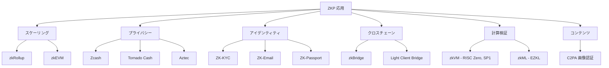
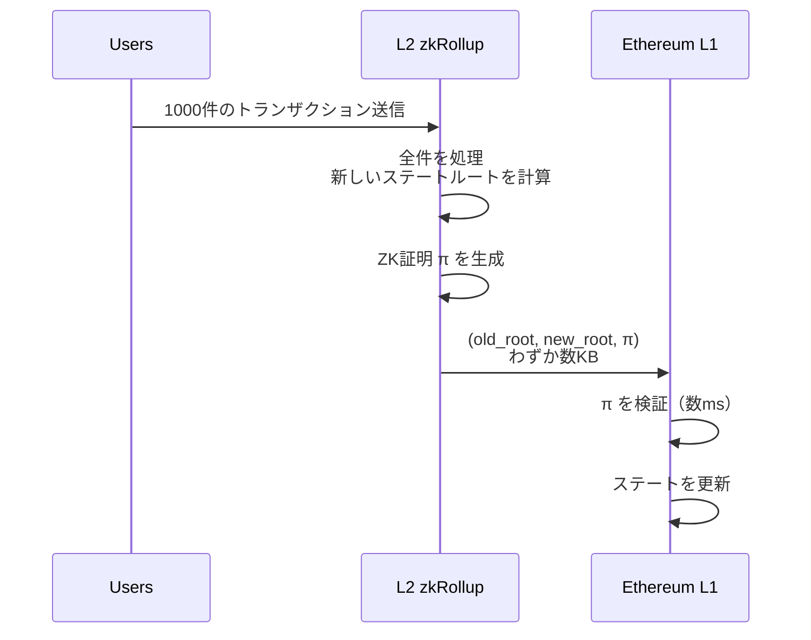
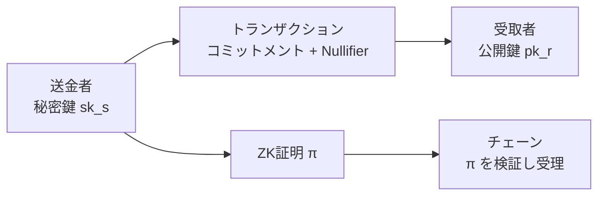
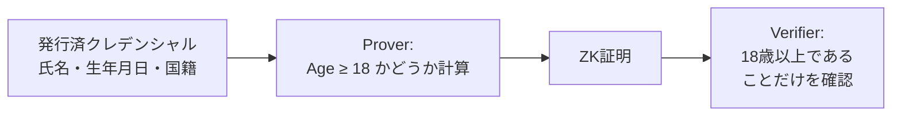
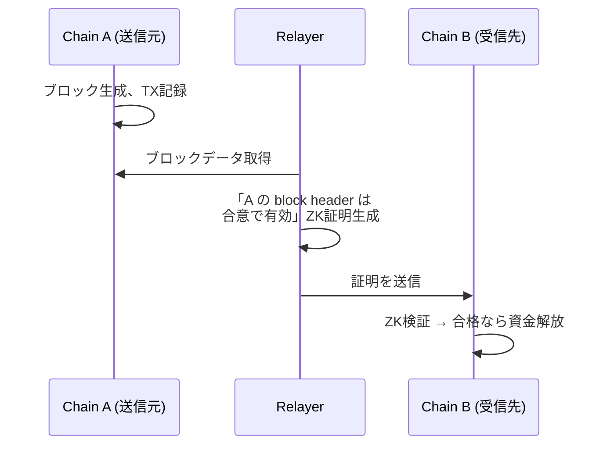
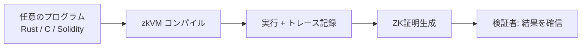
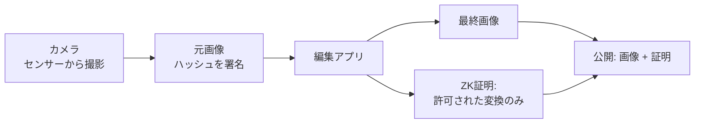
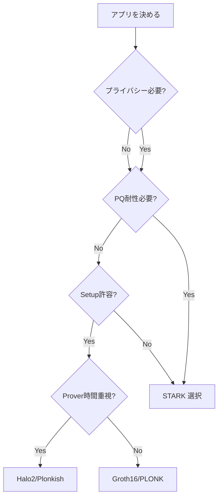

**日付**: 2026年4月22日
**学習内容**: ZKP は40年近く温められてきた理論だが、ここ数年で **実用に耐える速度・サイズ・ツール**が揃い、一気に応用フェーズに入った。本記事では実装詳細の前に「**何に使えるのか**」を俯瞰する。主要な応用領域を **(1) ブロックチェーンスケーリング（zkRollup）**、**(2) プライバシー決済（Zcash, Tornado Cash）**、**(3) アイデンティティ（ZK-KYC）**、**(4) クロスチェーン（zkBridge）**、**(5) 計算検証（zkVM, zkML）**、**(6) コンテンツ真正性（C2PA）** の6カテゴリに分解し、各応用が **どのZKPの性質** に依存しているかを明らかにする。技術選択（Groth16 / PLONK / STARK の使い分け）の直感も整理する。

## 0. 本記事の位置づけ

Article 3 で SNARK の性質 4 つ（S・N・AR・K）を見た。実は **応用ごとに求められる性質の優先順位が違う**。たとえば:

- **zkRollup**: 証明サイズ最小化（L1 に乗るガス代のため）
- **zkML**: Prover 時間最小化（巨大な計算を現実時間で証明するため）
- **ZK-KYC**: 回路サイズ最小化（モバイルで生成するため）

この違いが、「なぜ Groth16 と STARK が共存しているのか」「なぜ PLONK に移行するチームが多いのか」を決める。本記事はその**視点を提供する地図**として機能する。

構成:

- **第1章**: 応用全体マップ
- **第2章**: スケーリング — zkRollup
- **第3章**: プライバシー決済
- **第4章**: アイデンティティ
- **第5章**: クロスチェーン
- **第6章**: 計算検証（zkVM / zkML）
- **第7章**: コンテンツ真正性（C2PA）
- **第8章**: 応用 × SNARK の適合マトリクス

## 1. 応用全体マップ

まず ZKP 応用の全体像を俯瞰する。

### 1.1 応用を貫く2つの軸

ZKP 応用は、大別して以下の2つの軸のどちらかを重視する:

1. **スケーラビリティ軸**: 大量の計算を少量の証明で検証する（zkRollup, zkVM, zkML）
2. **プライバシー軸**: 秘密を隠しつつ主張を示す（Zcash, ZK-KYC, Aztec）

興味深いのは、**1つのシステムが両軸を同時に満たすことが多い**点。たとえば Aztec は「プライバシー重視」だが、裏で zkRollup のスケーリングも使っている。

## 2. スケーリング — zkRollup

### 2.1 問題: Ethereum のスループット限界

Ethereum L1 は**秒あたり約15〜30件**のトランザクションしか処理できない。Visa の1万件/秒とは桁違いに遅い。セキュリティと分散性を保つためにこれは意図的だが、ユーザー増加に追いつかない。

### 2.2 zkRollup のアイデア

大量のトランザクションを**オフチェーン（L2）** で処理し、その結果の**正しさだけを ZKP で L1 に証明**する。

**効果**:

- L1 に送るデータ = 数KB（1000件分でも）
- L1 の検証時間 = 数ミリ秒
- 実効スループット = L1 の数百〜数千倍

### 2.3 zkRollup の代表プロジェクト

| 名前 | 特徴 | 証明方式 |
|---|---|---|
| **zkSync Era** | EVM互換、Hyperscale | PLONK系 |
| **StarkNet** | Cairo言語独自、PQ耐性 | STARK |
| **Polygon zkEVM** | EVM bytecodeレベル互換 | PLONK |
| **Scroll** | Ethereumネイティブ互換重視 | Halo2 |
| **Linea** | ConsenSysが運営 | PLONK |

### 2.4 重要な技術要件

zkRollup が依存する ZKP の性質:

| ZKP の性質 | 重要度 | 理由 |
|---|---|---|
| **Succinct** | ★★★ | L1 に乗るガス代に直結 |
| **Non-interactive** | ★★★ | L1は1トランザクションで検証 |
| **Knowledge** | ★★☆ | ステート遷移の witness が必要 |
| **Zero-Knowledge** | ★☆☆ | 通常は ZK 性なし（プライバシー不要） |

多くの zkRollup は **ZK 性なしの SNARK** を使う。ステートは公開情報なので、プライバシーは目的ではない。

### 2.5 次に来る流れ

- **zkEVM の完全互換**: 既存の Solidity コントラクトがそのまま動く
- **Proof Recursion**: 複数の証明を1つに畳み込む（Article 19）
- **共有 Prover Network**: 複数ロールアップが共通の証明インフラを使う

## 3. プライバシー決済

### 3.1 問題: ブロックチェーンは透明すぎる

デフォルトでは、ブロックチェーンの全トランザクションは公開だ。誰が誰にいくら送ったかが**永続的に記録される**。これは監査性には良いが、プライバシーとしては最悪。

### 3.2 Zcash の仕組み（概観）

Zcash は ZKP を使って「誰が・いくら・誰に送ったか」を隠蔽する。

トランザクションが公開するのは:

- **コミットメント**（新しい受取枠）
- **Nullifier**（使われたコインの無効化タグ）
- **証明 $\pi$**

送信者・受取者・金額はすべて隠されている。ZKP は「送信者はそのコインを正当に使える」「金額の総和が合っている」を同時に保証する。

### 3.3 Tornado Cash のようなミキサー

Tornado Cash は**公開されたコントラクトにコインを預け、別アカウントで引き出す**ことで、送信元と送信先のリンクを切るプロトコル。ZKP は「私は以前預けた正当な預金者であり、かつその預金はまだ引き出されていない」ことを示す。

詳細は Article 28 で扱う。

### 3.4 Aztec: プライベートなスマートコントラクト

Aztec は「**プライベートな状態を持つ** スマートコントラクト」を実現する。単なる送金だけでなく、プライベートな DeFi（プライベート貸付、プライベート DAO）を可能にする。

### 3.5 必要な ZKP の性質

| ZKP の性質 | 重要度 | 理由 |
|---|---|---|
| **Zero-Knowledge** | ★★★ | 金額・アドレスを隠すため必須 |
| **Knowledge** | ★★★ | 「自分のコインだ」を示す |
| **Succinct** | ★★☆ | ガス代・UX |
| **Non-interactive** | ★★★ | ブロックチェーン固有 |

プライバシー応用では **4つすべてが必要**。

## 4. アイデンティティ（ZK-KYC）

### 4.1 問題: 身元情報の過剰開示

オンラインサービスで「18歳以上ですか？」と聞かれたとき、現状は**運転免許証を丸ごと見せる**しかない。生年月日・住所・顔写真すべてが漏れる。

### 4.2 ZKP によるミニマル開示

ZKP を使えば、**「18歳以上である」という1ビットだけ** を証明できる。具体的には:

**重要**: クレデンシャル発行は信頼できる発行者（政府、銀行）が行う。ZKP はその後の**開示の粒度**を制御する。

### 4.3 代表例

- **Polygon ID**: Iden3 プロトコルベースの ZK-KYC
- **zkEmail**: メール認証を ZK で（DKIM 署名を回路内で検証）
- **ZK-Passport**: 旅券の ICAO チップデータを ZK で利用
- **World ID**: 人間性（ユニーク性）の証明

### 4.4 必要な ZKP の性質

| ZKP の性質 | 重要度 | 理由 |
|---|---|---|
| **Zero-Knowledge** | ★★★ | 個人情報の保護 |
| **Knowledge** | ★★☆ | 本人性の証明 |
| **Succinct** | ★★★ | モバイル端末で検証するため |
| **Non-interactive** | ★★★ | 通信往復の回避 |

**モバイル向けに Prover が軽い**ことが追加要件。Groth16 や BBS+ 署名ベースが選ばれやすい。

## 5. クロスチェーン — zkBridge

### 5.1 問題: ブリッジの脆弱性

2022〜2023年だけで、クロスチェーンブリッジは**累計20億ドル以上**をハッキングで失った。主な原因は「**マルチシグキーの漏洩**」や「**信頼できる中継者の侵害**」。

### 5.2 zkBridge のアイデア

中継者を信頼する代わりに、**「送信元チェーンで本当にこのトランザクションが起きた」ことを ZKP で証明**する。

**効果**:

- Relayer が嘘をつけない（嘘なら証明が作れない）
- マルチシグ不要
- 数学的に担保される安全性

### 5.3 代表プロジェクト

- **Succinct**: イーサリアムと他チェーン間の ZK Light Client
- **zkBridge (Lightbridge)**: 学術系プロジェクト
- **Polyhedra Network**: deVirgo プロトコルベース

詳細は Article 30 で扱う。

### 5.4 必要な ZKP の性質

| ZKP の性質 | 重要度 | 理由 |
|---|---|---|
| **Knowledge** | ★★★ | ブロックヘッダの witness |
| **Succinct** | ★★★ | L1 に乗せるガス代 |
| **Prover 速度** | ★★★ | ブロック時間内に生成 |
| **Zero-Knowledge** | ★☆☆ | 通常は公開情報 |

## 6. 計算検証（zkVM / zkML）

### 6.1 zkVM — 汎用計算の ZK 証明

**zkVM（Zero-Knowledge Virtual Machine）** は、「**任意のプログラムの実行結果が正しい**」ことを ZK で証明する仕組み。

- **RISC Zero**: RISC-V アーキテクチャの zkVM
- **SP1 (Succinct Labs)**: RISC-V ベース、高速
- **Cairo**: StarkNet のカスタム VM
- **Valida / zkLLVM**: LLVM を ZK 化

**応用**: クラウド計算の検証、ブロックチェーンのオラクル、オフチェーンゲームの結果証明など。

### 6.2 zkML — AI モデルの推論を ZK で

**zkML（Zero-Knowledge Machine Learning）** は、「**このAIモデルがこの入力に対してこの出力を返した**」ことを ZK で証明する。

応用例:

- 「この画像はこの顔認識モデルで本人と一致した」
- 「この医療画像はこのAIが健康と判定した」
- 「このAIは偏見のないモデルである」（fairness proof）

**課題**: AI の計算はスケールが巨大（数十億パラメータ）。Prover 時間が数時間〜数日になることも。

### 6.3 必要な ZKP の性質

| ZKP の性質 | zkVM 重要度 | zkML 重要度 | 理由 |
|---|---|---|---|
| **Prover 並列化** | ★★☆ | ★★★ | 巨大計算を速く証明 |
| **Non-uniform 回路対応** | ★★★ | ★★★ | 複雑なプログラム |
| **Lookup Argument** | ★★★ | ★★★ | AI の非線形計算に必須 |
| **Zero-Knowledge** | ★☆☆ | ★★☆ | モデル秘匿したい場合 |

**STARKs や Plonkish が選ばれる**傾向が強い（並列化しやすく、lookup が使える）。

## 7. コンテンツ真正性 — C2PA

### 7.1 問題: 生成AIと偽画像

Stable Diffusion や Sora のような生成AIで、本物と見分けがつかない画像・動画が作れるようになった。**何が本物か**を見分けるインフラが必要。

### 7.2 C2PA と ZK の組み合わせ

**C2PA（Coalition for Content Provenance and Authenticity）** は、画像・動画に**来歴情報（出所・編集履歴）** を付ける業界規格。Adobe, Microsoft, Leica などが参加。

ZKP の役割:

> **「元の画像から、許可された編集（クロップ・縮小・色調整）のみを経て作られた」** ことを示す。元画像を見せずに。

### 7.3 プロトコルの流れ

**検証者（SNS, メディア）** は:
1. 画像のハッシュを計算
2. 証明を検証
3. 「カメラで撮影され、許可された編集だけを経た」と確認

### 7.4 必要な ZKP の性質

| ZKP の性質 | 重要度 | 理由 |
|---|---|---|
| **Prover 速度** | ★★★ | スマホで数秒で生成したい |
| **Succinct** | ★★★ | 画像に埋め込むサイズ制約 |
| **Zero-Knowledge** | ★★☆ | 元画像の非開示 |

**STARK 系** が主流（PQ耐性で長期的に画像を検証可能にするため）。

## 8. 応用 × SNARK 適合マトリクス

以上を整理すると、応用ごとに「どの SNARK が適しているか」が見えてくる。

| 応用 | 証明サイズ | Prover 時間 | Setup | ZK 性 | PQ 耐性 | 推奨 |
|---|---|---|---|---|---|---|
| **zkRollup** | ★★★ | ★★ | 許容 | - | ★★ | **PLONK / Halo2** |
| **プライバシー決済** | ★★★ | ★★ | 許容 | ★★★ | ★ | **Groth16 / Halo2** |
| **ZK-KYC (モバイル)** | ★★ | ★★★ | 許容 | ★★★ | ★ | **Groth16 / BBS+** |
| **zkBridge** | ★★★ | ★★★ | 許容 | - | ★★ | **Groth16 + deVirgo** |
| **zkVM 汎用** | ★★ | ★★★ | Transparent推奨 | - | ★★ | **STARK / Plonkish** |
| **zkML** | ★★ | ★★★ | Transparent推奨 | ★★ | ★★ | **STARK / Halo2** |
| **C2PA** | ★★★ | ★★★ | Transparent必須 | ★★ | ★★★ | **STARK** |

### 8.1 大まかな「選び方」ルール

## 9. Q&A

### Q1: ZK 性が不要な応用でも SNARK を使う意味は？

**Succinct 性が目的**。たとえば zkRollup は「計算の正しさ」を示したいだけで、プライバシーは不要。しかし「大量の計算を短い証明で示す」という SNARK の性質は必須。

### Q2: なぜ zkRollup は ZK 性を切り捨てているの？

ロールアップのステート（残高・アカウント）は基本的に**公開情報**。隠す必要がない上、ZK 性を付けると Prover 時間が増える。なので「SNARK - ZK」のモード（validity proof とも呼ばれる）で運用。

### Q3: zkML は本当に実用的？

まだ**限定的**。10億パラメータ級のLLMだと Prover 時間が数日〜数週間かかる。現実解は:

1. 小規模モデル（数百万パラメータ）に限定
2. GPU 加速や FPGA 加速
3. **部分的な証明**（Attention 層のみなど）

EZKL や Modulus Labs のようなプロジェクトが着実に進化している。

### Q4: C2PA で ZKP を使わない通常の署名ではダメ？

**編集を許すと署名が破れる**。元画像に署名 → 編集 → ハッシュ変わる → 署名無効。ZKP なら「許可された編集のみ経た」と示せるので、編集後も真正性を保てる。

### Q5: zkBridge vs マルチシグブリッジ、どっちが安全？

**zkBridge が圧倒的に安全**。マルチシグは「M 人のうち N 人のキー漏洩」で崩れるが、zkBridge は「数学的に正しい証明」しか通らない。ただし zkBridge は実装が重く、まだ実運用は限られる。

### Q6: Aztec のようなプライベートスマートコントラクトは Ethereum でも動く？

Aztec 自体は**L2 として独立**。Ethereum L1 では直接動かないが、L1 へのブリッジは存在する。「プライベートな計算は L2 で、最終的な決済は L1 で」という2層構造。

## 10. まとめ

### 本記事の要点

1. ZKP 応用は **スケーラビリティ軸**（zkRollup, zkVM, zkML）と **プライバシー軸**（Zcash, ZK-KYC, Aztec）の2軸で整理できる
2. **zkRollup**: L2 で大量処理、L1 に短い証明で集約 → 数百〜数千倍のスループット
3. **プライバシー決済**: 送信者・受取者・金額を ZK で隠す
4. **ZK-KYC**: クレデンシャルから1ビットだけ開示（18歳以上か、など）
5. **zkBridge**: マルチシグ不要のブリッジで安全性が桁違い
6. **zkVM / zkML**: 任意の計算・AI 推論を ZK で検証
7. **C2PA**: 画像の真正性を編集後も保つ
8. 応用ごとに **SNARK の選び方が違う**: PQ 耐性・Setup・Prover 時間で決まる

### 次の記事（Article 5）へ

次の記事では、SNARK / STARK / Bulletproofs / Halo2 などの **主要な ZKP 家系図** を整理する。どこで分岐しているのか、なぜこれだけ種類があるのか、どう比較すればよいのか。技術選択の基盤となる理解を固める。

### 3行サマリ

- **応用6カテゴリ**: スケーリング、プライバシー、ID、ブリッジ、計算検証、コンテンツ
- **選び方の軸**: Setup 有無・PQ 耐性・Prover 速度・証明サイズ
- **同じ SNARK でも、応用で使われ方が全く違う**

---

## 参考文献

- Vitalik Buterin. *An Incomplete Guide to Rollups.* 2021.
- Ben-Sasson et al. *Zcash Protocol Specification.* 2020.
- ZKP MOOC Lecture 2 (UC Berkeley, 2023).
- Adobe. *C2PA Technical Specification v1.3.* 2024.
- RISC Zero. *Zero-Knowledge Virtual Machine.* 2024.
