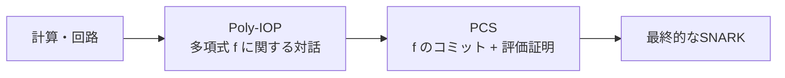
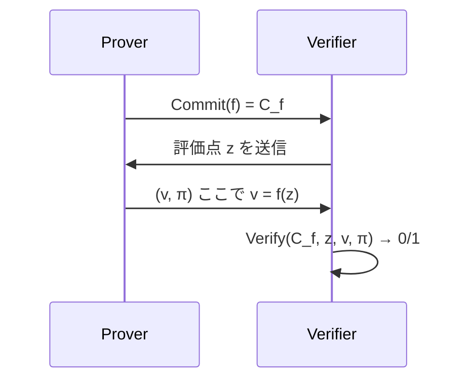
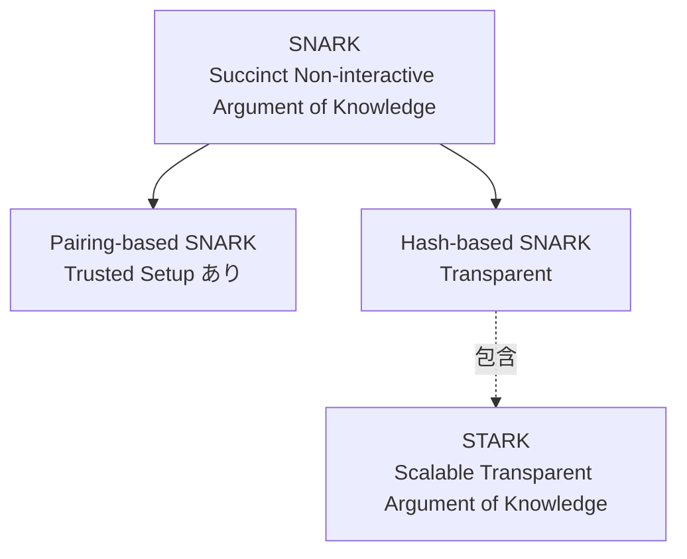
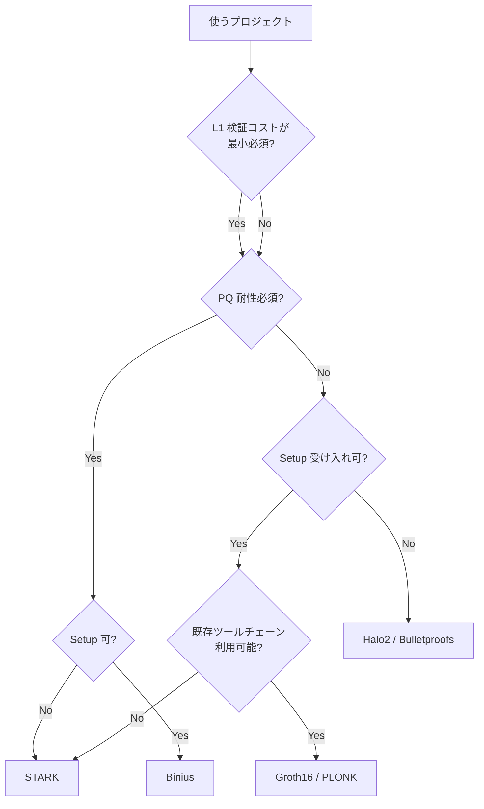

**日付**: 2026年4月22日
**学習内容**: ZKP の世界は **Groth16 / PLONK / Marlin / Bulletproofs / STARK / Halo2 / Nova / Binius** など、プロジェクト名やプロトコル名が乱立していて初学者を圧倒する。しかし実は **ほぼすべての現代 ZKP が「Poly-IOP（多項式インタラクティブオラクル証明） + PCS（多項式コミットメント方式）」** という単純な枠組みで整理できる。本記事では、この **2軸のマトリクス** で ZKP 家系図を描き直す。さらに **SNARK vs STARK** の違いが「基本は PCS の選び方」にすぎないことを示し、なぜそれだけで特性（Setup・PQ 耐性・証明サイズ）が大きく変わるかを理解する。

## 0. 本記事の位置づけ

Article 4 で応用の視点から ZKP を見た。本記事では逆に **プロトコルの側から** 整理する。目的は2つ:

1. **家系図を頭に入れる**: なぜ「Groth16 は古典、PLONK は現代、STARK は別枝」なのかが一瞬で分かるようになる
2. **設計軸を理解する**: 新しいプロトコル（たとえば Binius）が出てきたとき、それが既存のどこに位置するかを見抜けるようになる

構成:

- **第1章**: ZKP の2軸分解 — Poly-IOP + PCS
- **第2章**: Poly-IOP 側のバリエーション
- **第3章**: PCS 側のバリエーション
- **第4章**: SNARK vs STARK の本当の違い
- **第5章**: 家系図の可視化
- **第6章**: 有名プロトコルの分解一覧
- **第7章**: Q&A とまとめ

## 1. ZKP の2軸分解 — Poly-IOP + PCS

### 1.1 全プロトコルに共通する枠組み

現代 ZKP はほぼ以下の2段構成になっている:

$$
\text{ZKP プロトコル} = \underbrace{\text{Poly-IOP}}_{\text{回路 → 多項式の対話}} + \underbrace{\text{PCS}}_{\text{多項式 → 短いコミットメント}}
$$

- **Poly-IOP (Polynomial Interactive Oracle Proof)**: 
  - 回路や計算を**多項式の性質**に翻訳する対話型プロトコル
  - Prover は多項式 $f_1, f_2, \ldots$ を「持っている」体で Verifier とチャレンジを交換
  - Verifier はある点での多項式評価を「オラクル」として要求
- **PCS (Polynomial Commitment Scheme)**:
  - その多項式を**短いコミットメント**（数十バイト）にする方式
  - 後で「$f(r) = v$」を**短い証明で納得**させられる



### 1.2 分離の意義

この2段構成の良さは、**片方を差し替えれば新しいプロトコルが作れる**点。たとえば:

- **PLONK の Poly-IOP + KZG の PCS** = 一般に「PLONK」と呼ばれるもの
- **PLONK の Poly-IOP + FRI の PCS** = 「PLONK + FRI」型（Plonky2 など）
- **HyperPlonk の Poly-IOP + KZG の PCS** = HyperPlonk

この2つを「直交」に設計できるので、研究・実装がモジュール化される。

### 1.3 Article 3 との対応

Article 3 で見た SNARK の4要素（S / N / AR / K）との対応:

- **Succinct** は主に **PCS** が担う（多項式を短く圧縮するのが PCS の役割）
- **Non-interactive** は Fiat-Shamir 変換（Article 17）で実現
- **Argument** は Poly-IOP + PCS 全体の計算量仮定
- **Knowledge** は Extractor が PCS の構造を利用

## 2. Poly-IOP 側のバリエーション

### 2.1 Poly-IOP の種類

Poly-IOP はさらに以下のサブタイプに分かれる:

| 種類 | 扱う多項式 | 代表例 |
|---|---|---|
| **単変数 Poly-IOP** | 1変数多項式 $f(X)$ | PLONK, Marlin, Groth16 |
| **多変数 Poly-IOP** | 多変数多項式 $f(X_1, \ldots, X_n)$ | Spartan, HyperPlonk |
| **Multilinear-IOP** | 多重線形拡張 (MLE) | Spartan, Lasso, Libra |
| **Vector-IOP** | ベクトル（1次元配列） | Bulletproofs, Brakedown |

### 2.2 単変数 vs 多変数の直感

- **単変数**: 多項式の次数 = 回路サイズ。次数 $d$ の多項式を扱う（$d$ は非常に大きい）。高速 FFT が使える
- **多変数 (Multilinear)**: 各変数の次数は1だが変数数が $\log n$。評価点がブール立方体 $\{0,1\}^n$ の頂点

**計算コストの違い**:

| 項目 | 単変数 | 多変数 (MLE) |
|---|---|---|
| Prover 側の多項式サイズ | $d+1$ 係数 | $2^n$ 値（$n$ 変数） |
| Prover 時間 | $O(d \log d)$ (FFT) | $O(2^n)$ (線形) |
| Verifier が要求する評価 | 1点 $f(r)$ | sumcheck で多点 |
| ZK 回路の書きやすさ | ◯ | ◯（ただし発想が違う） |

### 2.3 PLONKの Poly-IOP（直感）

PLONK の Poly-IOP は次のように働く（詳細は Article 16）:

1. 回路のすべてのワイヤ（信号）を多項式 $w(X)$ で表現
2. ゲート制約を多項式恒等式 $q_L w_a + q_R w_b + q_M w_a w_b + \ldots = 0$ に翻訳
3. 配線制約（同じ値の配線）を置換引数 (permutation argument) で翻訳
4. Verifier がランダム点 $r$ を送り、Prover が $w(r)$ を答える
5. 恒等式が成り立っていれば、Schwartz-Zippel 補題により $w$ が正しい

### 2.4 Sumcheck ベースの Poly-IOP（Spartan, HyperPlonk）

多変数 Poly-IOP では **Sumcheck** プロトコル（Article 14）が主役:

$$
\sum_{x \in \{0,1\}^n} g(x) = H
$$

という総和を、変数を1つずつ潰しながら対話的に検証する。**巨大な総和を対数回の対話で検証できる**のが強み。

## 3. PCS 側のバリエーション

PCS はもっと多様で、現代 ZKP の特性の大部分を決める。

### 3.1 PCS の3大ファミリー

| ファミリー | 基礎 | 代表 PCS | Setup | PQ 耐性 |
|---|---|---|---|---|
| **Pairing-based** | 楕円曲線ペアリング | **KZG**, Dory | Trusted (回路固有 or 汎用) | ✗ |
| **Discrete-Log-based** | 楕円曲線の離散対数 | Bulletproofs (IPA), Hyrax | Transparent | ✗ |
| **Hash-based** | 衝突困難ハッシュ関数 | **FRI**, Brakedown, Ligero | Transparent | ✓ |

### 3.2 PCS の要件

どんな PCS も以下を提供する:

- **Commit(f)**: 多項式 $f$ から短いコミットメント $C_f$ を作る
- **Open(f, z)**: 点 $z$ での評価 $v = f(z)$ と、その証拠 $\pi$
- **Verify($C_f$, z, v, $\pi$)**: $C_f$ に埋め込まれた多項式が本当に $f(z) = v$ を満たすかを検証



### 3.3 KZG（ペアリングベース）

**KZG** は最も有名な PCS。短い証明（48 バイト）と超高速な検証を誇る。

**構成の概要**（Article 13 で詳述）:

- Setup で $g, g^\tau, g^{\tau^2}, \ldots, g^{\tau^d}$ を公開（$\tau$ は秘密）
- $C_f = g^{f(\tau)}$ がコミットメント
- 証拠 $\pi = g^{q(\tau)}$ ここで $q(X) = \frac{f(X) - v}{X - z}$
- 検証: $e(C_f \cdot g^{-v}, g) \stackrel{?}{=} e(\pi, g^\tau \cdot g^{-z})$

$\tau$ を誰かが知っていると偽証明を作れる → Trusted Setup が必要。

### 3.4 FRI（ハッシュベース）

**FRI** は「多項式が本当に次数 $d$ 以下か」を低次数テストで検証。

**直感**（Article 23 で詳述）:

- 多項式 $f$ を「倍長符号」として評価 $\{f(\omega^i)\}$ を Merkle ツリーに格納
- Prover は「多項式を2つに分解」するステップを $\log d$ 回繰り返す
- Verifier は少数の位置でのみチェック

**利点**: ハッシュ関数だけなので PQ 耐性、Transparent Setup  
**欠点**: 証明サイズが大きい（数十〜数百KB）

### 3.5 IPA（Bulletproofs）

**Inner Product Argument** は離散対数ベースで Transparent。Setup 不要だが検証が線形時間（$O(d)$）なので大規模回路には重い。

### 3.6 PCS 3大ファミリーの比較

| 指標 | KZG | FRI | IPA |
|---|---|---|---|
| **証明サイズ** | O(1) ~48B | O(log² d) ~100KB | O(log d) ~数KB |
| **Prover 時間** | O(d log d) | O(d log d) | O(d) |
| **Verifier 時間** | O(1) | O(log² d) | O(d) |
| **Setup** | Trusted | Transparent | Transparent |
| **PQ 耐性** | ✗ | ✓ | ✗ |
| **Aggregation (バッチ化)** | ◎ | △ | ○ |

KZG は「小・速」だが Trusted Setup 必須。FRI は「太・普通・Transparent・PQ」。IPA は中間。**応用に応じて選ぶ**。

## 4. SNARK vs STARK の本当の違い

ここで「SNARK vs STARK」という呼び名の謎を解く。

### 4.1 STARK の意味

**STARK** = **S**calable **T**ransparent **AR**gument of **K**nowledge

- **Scalable**: Prover 時間が回路サイズに対して準線形（SNARK と同等）
- **Transparent**: **Trusted Setup 不要**
- **AR**: Argument
- **K**: Knowledge

つまり SNARK のうち「**N（Non-interactive）を保ちつつ Transparent にしたもの**」が STARK。

### 4.2 SNARK / STARK の関係



**結論**: STARK ⊂ SNARK（ただし Transparent かつ PQ 耐性のサブセット）

### 4.3 なぜ STARK は FRI ベースなのか

- Trusted Setup が不要 → ペアリングベース（KZG）は除外
- PQ 耐性 → 離散対数ベース（IPA）も除外
- 残るのは **ハッシュベース（FRI, Brakedown）**

逆に言えば、**ハッシュベースの SNARK = STARK**（正確にはその中で特定の設計）。

### 4.4 「SNARK vs STARK」ではなく「KZG vs FRI」

よく「SNARK vs STARK どっちが良いか」という議論を見るが、本質は **PCS の選択**にすぎない:

| 観点 | KZG ベース (PLONK, Groth16) | FRI ベース (STARK, Plonky2) |
|---|---|---|
| **証明サイズ** | 最小 | 中〜大 |
| **検証時間** | 最小 | 中 |
| **Prover 時間** | 中 | 速 |
| **Setup** | Trusted | Transparent |
| **PQ 耐性** | ✗ | ✓ |
| **L1 ガス代** | 低 | 中〜高 |

**選び方の目安**:

- L1 に乗せる証明 → KZG（ガス代優先）
- Transparency が絶対必要 → FRI
- モバイル検証 → KZG（小さい方が有利）
- 量子計算耐性が必要 → FRI

## 5. 家系図を可視化する

以上をまとめた ZKP 家系図:

```mermaid
flowchart TB
    Root[対話型 ZKP<br/>1985]
    NIZK[NIZK<br/>1988]
    SNARK[SNARK<br/>Succinct]
    
    Root --> NIZK
    NIZK --> SNARK
    
    SNARK --> Pairing[Pairing-based<br/>KZG]
    SNARK --> DL[Discrete-log-based<br/>IPA]
    SNARK --> Hash[Hash-based<br/>FRI, Merkle]
    
    Pairing --> Groth16[Groth16 2016<br/>回路固有 Setup]
    Pairing --> PLONK[PLONK 2019<br/>Universal Setup]
    Pairing --> Marlin[Marlin 2019]
    Pairing --> HyperPlonk[HyperPlonk 2023<br/>多変数]
    
    DL --> Bulletproofs[Bulletproofs 2018]
    DL --> Hyrax[Hyrax 2018]
    DL --> Halo[Halo 2019<br/>再帰]
    DL --> Halo2[Halo2 2020<br/>Plonkish + IPA]
    
    Hash --> STARK[STARK 2018<br/>FRI ベース]
    Hash --> Plonky2[Plonky2 2022<br/>PLONK + FRI]
    Hash --> Brakedown[Brakedown 2021<br/>線形時間 Prover]
    Hash --> Binius[Binius 2024<br/>GF(2) 高速]
```

### 5.1 時系列での発展

- **2010s 前半**: GGPR, Pinocchio, Groth16 → 「使える SNARK」の確立
- **2019**: PLONK → Universal Setup で開発しやすく
- **2021〜**: Halo2, Nova → 再帰と folding で新時代
- **2023〜**: HyperPlonk, Binius → 多変数・GF(2) で高速化

## 6. 有名プロトコルの分解一覧

各プロトコルを「Poly-IOP + PCS」で分解すると:

| プロトコル | Poly-IOP | PCS | Setup | PQ |
|---|---|---|---|---|
| **Groth16** | Linear PCP (QAP) | 組み込み（専用） | Trusted (回路固有) | ✗ |
| **PLONK** | PLONK Poly-IOP | KZG | Trusted (汎用) | ✗ |
| **Marlin** | Holographic IOP | KZG | Trusted (汎用) | ✗ |
| **Plonky2** | PLONK Poly-IOP | FRI | Transparent | ✓ |
| **STARK (original)** | AIR | FRI | Transparent | ✓ |
| **Bulletproofs** | Inner Product | IPA | Transparent | ✗ |
| **Halo2** | Plonkish | IPA | Transparent | ✗ |
| **Spartan** | Sumcheck-based | Hyrax / PST | Transparent | △ |
| **HyperPlonk** | Sumcheck + Plonkish | KZG-based | Trusted (汎用) | ✗ |
| **Binius** | PLONK-like | Brakedown over GF(2) | Transparent | ✓ |
| **Nova** | Folding (R1CS) | - | - | ✗ |

### 6.1 読み方のコツ

- **「Setup: Trusted (回路固有)」**: 回路ごとにセレモニーが必要 → 実運用で大変
- **「Setup: Trusted (汎用)」**: 1回のセレモニーで複数回路に使える
- **「Setup: Transparent」**: 信頼不要 → 運用が楽
- **「PQ: ✓」**: 量子計算機への耐性あり

### 6.2 選択のフローチャート



## 7. Q&A

### Q1: 新しい「XXSnark」を覚える必要ある？

**無理に全部覚える必要はない**。新しいプロトコルが出たら「Poly-IOP 側は何？ PCS 側は何？」の2つをチェックすれば、だいたい既存の発展形として理解できる。

### Q2: KZG と FRI、どちらが「本当に」優れているか？

**ケース依存**。「L1 Ethereum に乗せる」「モバイルで検証する」なら KZG。「Transparent 必須」「PQ 必須」「巨大計算」なら FRI。両者は用途が違う。

### Q3: Halo2 は SNARK？ STARK？

**どちらでもある**。Halo2 は Plonkish + IPA の構成なので、「ハッシュベースではないが Transparent」という中間的な位置づけ。SNARK ファミリーの中で Transparent なもの。

### Q4: Universal Setup と Transparent Setup の違いは？

- **Universal Setup**: 1回セレモニーすれば複数回路に使える（トラスト仮定は残る）
- **Transparent Setup**: そもそもセレモニー不要

Universal Setup は「回路ごとに儀式しなくてよい」という実務的な改善だが、**依然として信頼前提**。Transparent は構造的に信頼不要。

### Q5: Folding Scheme (Nova) は何者？

**再帰的な証明生成を効率化する技術**（Article 19）。複数の R1CS インスタンスを1つに「畳み込む」ことで、SNARK 生成コストを分散する。これ自体は SNARK ではなく、SNARK の中に埋め込む「高速化レイヤー」。

### Q6: Binius はなぜ速いと言われる？

**GF(2) = バイナリフィールドを使う**ため、CPU の XOR / AND 命令で超高速に計算できる。従来の SNARK は $\mathbb{F}_p$（大きな素数体）を使うので1操作が重い。Binius は係数を1ビットで扱えるため桁違いに速い。

## 8. まとめ

### 本記事の要点

1. **ZKP = Poly-IOP + PCS** の2段構成で整理できる
2. **Poly-IOP** は多項式の対話（単変数・多変数・MLE・ベクトル）
3. **PCS** は3大ファミリー（Pairing / DL / Hash）で決まる性能
4. **STARK** は「Hash-based で Transparent な SNARK のサブセット」
5. 「SNARK vs STARK」は実は「**KZG vs FRI**」の議論
6. 家系図の基本路線: **Groth16 → PLONK → Halo2 → Nova → Binius**
7. **Poly-IOP と PCS を分離して考えれば**、新しいプロトコルも既存の発展形として見える

### 次の記事（Article 6）へ

いよいよ数学の準備に入る。まず**有限体 $\mathbb{F}_p$** — ZKP のすべての計算が行われる舞台。剰余演算、逆元、フェルマーの小定理、ラグランジュの基礎など、次の記事以降の土台になる数学を丁寧に整理する。

### 3行サマリ

- **Poly-IOP × PCS の直交マトリクス** が ZKP の設計空間
- **STARK = Hash-based PCS で Transparent + PQ を得た SNARK**
- **「どれを選ぶか」は PCS の特性次第**（証明サイズ・Setup・PQ 耐性）

---

## 参考文献

- Alessandro Chiesa et al. *SNARK Constructions: Survey.* 2023.
- Eli Ben-Sasson et al. *Scalable, Transparent, and Post-Quantum Secure Computational Integrity.* ePrint 2018/046. (STARK)
- Ariel Gabizon et al. *PLONK: Permutations over Lagrange-bases for Oecumenical Non-interactive Arguments of Knowledge.* ePrint 2019/953.
- Benedikt Bünz et al. *Bulletproofs: Short Proofs for Confidential Transactions and More.* IEEE S&P 2018.
- Benedikt Bünz et al. *HyperPlonk: PLONK with Linear-Time Prover.* EUROCRYPT 2023.
- ZKP MOOC Lectures 2, 6, 7, 8 (UC Berkeley, 2023).
