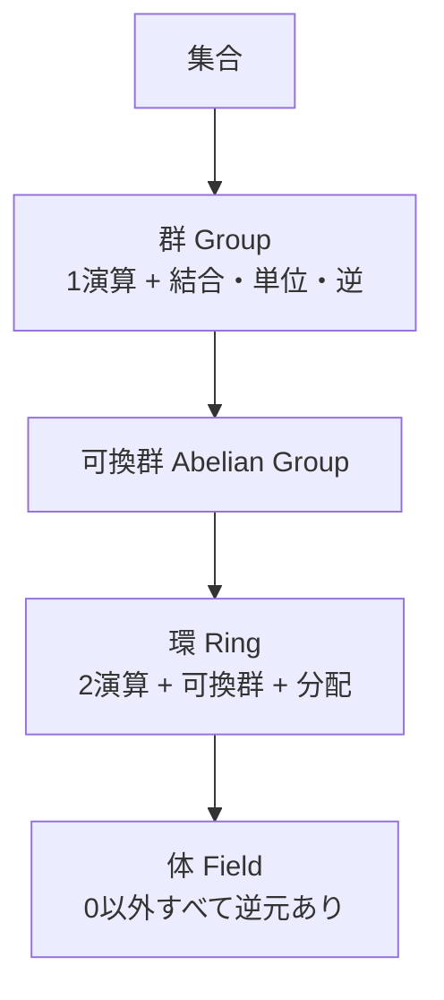

**日付**: 2026年4月22日
**学習内容**: ZKP のすべての計算は **有限体（finite field）$\mathbb{F}_p$** の上で行われる。これは「整数 $0, 1, \ldots, p-1$ だけを使って、加減乗除が閉じている世界」であり、**加算・乗算・逆元** の計算が常に $p$ 未満の整数として定義される。本記事では、この有限体を一から構築する。具体的には **(1) 群・環・体の定義**、**(2) 剰余演算 $\bmod p$ の基本**、**(3) 逆元の計算（拡張ユークリッド互除法）**、**(4) フェルマーの小定理と逆元の簡略計算**、**(5) 拡大体 $\mathbb{F}_{p^n}$**、そして**なぜ ZKP が有限体を必要とするか**、を式の展開を省かずに追う。

## 0. 本記事の位置づけ

Article 5 までで「ZKP が何に使われるか」「どう分類されるか」を見た。いよいよ数学の中身に入る。最初の山場が**有限体** $\mathbb{F}_p$ だ。

なぜ有限体が必要かというと、ZKP は「**情報を漏らさず計算の正しさを示す**」仕組みだが、実数のような無限集合上では:

- 正確な演算ができない（浮動小数点の丸め誤差）
- 表現に無限のビット数が必要
- 暗号的な「逆算困難性」を仕込めない

これを解決するのが**有限個の要素しかない体**。加減乗除が完全に閉じていて、表現は一定ビット数、そして乗算の逆演算（離散対数問題）が困難になる。ZKP の数式はすべてこの舞台の上で動く。

構成:

- **第1章**: 群・環・体の階層
- **第2章**: 剰余演算 $\bmod p$ の基本
- **第3章**: $\mathbb{F}_p$ の加減乗除
- **第4章**: 逆元と拡張ユークリッド互除法
- **第5章**: フェルマーの小定理
- **第6章**: 拡大体 $\mathbb{F}_{p^n}$
- **第7章**: ZKP で使われる典型的な素数
- **第8章**: Q&A とまとめ

## 1. 群・環・体の階層

### 1.1 3つの代数構造

代数では、集合 $S$ に演算を定義して、性質の強さで分類する。

**群（Group）**: 1つの演算 $\circ$ が定義され、以下を満たす:

1. **結合律**: $(a \circ b) \circ c = a \circ (b \circ c)$
2. **単位元**: $\exists e,\ a \circ e = e \circ a = a$
3. **逆元**: $\forall a,\ \exists a^{-1},\ a \circ a^{-1} = e$

たとえば $(\mathbb{Z}, +)$ は群（単位元は $0$、$a$ の逆元は $-a$）。

**可換群（Abelian group）**: さらに可換律 $a \circ b = b \circ a$。

**環（Ring）**: 2つの演算 $+, \times$ が定義され、

- $(S, +)$ が可換群
- $\times$ は結合律と分配律を満たす
- $\times$ の単位元 $1$ が存在

たとえば $(\mathbb{Z}, +, \times)$ は環。ただし **除算は一般に定義されない**（$2$ の逆元が整数にないから）。

**体（Field）**: 環のうち、**$0$ 以外のすべての要素に乗法逆元が存在** するもの。

$$
\forall a \neq 0,\ \exists a^{-1},\ a \times a^{-1} = 1
$$

たとえば $(\mathbb{Q}, +, \times)$ は体（$2$ の逆元は $1/2$）。

### 1.2 階層図



### 1.3 有限体 $\mathbb{F}_p$ とは

**有限体**は文字通り要素が有限個の体。$\mathbb{F}_p$（または $GF(p)$）は:

- 集合: $\{0, 1, 2, \ldots, p-1\}$
- $p$ は素数
- 演算は **$\bmod\ p$ での加減乗除**

このとき実際に体の公理を満たすことが証明できる（後述）。

## 2. 剰余演算 $\bmod p$ の基本

### 2.1 剰余の定義

整数 $a, m$ に対して、$a = qm + r$（$0 \leq r < m$）となる $q, r$ が一意に決まる。この $r$ を $a \bmod m$ と書く。

例:
- $17 \bmod 5 = 2$（$17 = 3 \cdot 5 + 2$）
- $-3 \bmod 5 = 2$（$-3 = -1 \cdot 5 + 2$）

**重要**: **負数の剰余も $\{0, 1, \ldots, m-1\}$ に入る**。これは数学の流儀で、プログラミング言語によっては負数を返すこともあるので注意。

### 2.2 合同関係

$a \equiv b \pmod m$ とは「$a - b$ が $m$ の倍数」のこと。同じく $a \bmod m = b \bmod m$ と同値。

たとえば $17 \equiv 2 \pmod 5$、$-3 \equiv 2 \pmod 5$、$17 \equiv -3 \pmod 5$。

### 2.3 合同関係の性質

合同関係は以下の演算と両立する:

$$
a \equiv a' \pmod m,\ b \equiv b' \pmod m \implies
\begin{cases}
a + b \equiv a' + b' \pmod m \\
a - b \equiv a' - b' \pmod m \\
a \cdot b \equiv a' \cdot b' \pmod m
\end{cases}
$$

### 2.4 証明例: 乗法との両立

$a \equiv a' \pmod m$ は $a = a' + km$ を意味する（$k$ は整数）。同様に $b = b' + lm$。

$$
\begin{aligned}
a \cdot b &= (a' + km)(b' + lm) \\
&= a' b' + a' l m + b' k m + k l m^2 \\
&= a' b' + m(a' l + b' k + k l m)
\end{aligned}
$$

よって $a \cdot b - a' b' = m(\ldots)$ は $m$ の倍数 → $ab \equiv a'b' \pmod m$。$\square$

### 2.5 剰余環 $\mathbb{Z}_m$

$\{0, 1, \ldots, m-1\}$ に $\bmod m$ での $+, -, \times$ を入れたものを **剰余環** $\mathbb{Z}_m$ と呼ぶ。これは常に環になる。

しかし**体になるのは $m$ が素数のときだけ**。次の第3章で理由を見る。

## 3. $\mathbb{F}_p$ の加減乗除

### 3.1 加算

$$
a + b \bmod p
$$

例: $p = 7$ で $5 + 4 = 9 \equiv 2 \pmod 7$。

### 3.2 減算

$$
a - b \bmod p = (a + (p - b)) \bmod p
$$

例: $p = 7$ で $3 - 5 \equiv 3 + 2 = 5 \pmod 7$。

### 3.3 乗算

$$
a \cdot b \bmod p
$$

例: $p = 7$ で $4 \cdot 5 = 20 \equiv 6 \pmod 7$（$20 = 2 \cdot 7 + 6$）。

### 3.4 除算（これが体の肝）

除算 $a / b$ は、「$a \cdot b^{-1}$」と定義される。つまり**$b$ の乗法逆元**が必要。

$\mathbb{F}_p$ では、$p$ が素数のとき **すべての $b \neq 0$ に逆元が存在**する。これを次の章で示す。

### 3.5 なぜ $p$ が素数でないと体にならないか

たとえば $\mathbb{Z}_6$ を考える。$2 \cdot 3 = 6 \equiv 0 \pmod 6$。

もし $2$ に逆元 $2^{-1}$ があれば、両辺に $2^{-1}$ をかけて:

$$
3 \equiv 2^{-1} \cdot 0 = 0 \pmod 6
$$

これは偽（$3 \neq 0 \pmod 6$）。矛盾するので $\mathbb{Z}_6$ では $2$ に逆元がない → **体ではない**（**零因子 zero divisor** が存在する）。

**素数 $p$ なら、$\{1, \ldots, p-1\}$ のどの数も $p$ と互いに素**なので、ユークリッドの互除法で逆元が計算できる（次章）。

## 4. 逆元と拡張ユークリッド互除法

### 4.1 ユークリッドの互除法

2つの整数 $a, b$ の最大公約数 $\gcd(a, b)$ を効率よく計算するアルゴリズム:

$$
\gcd(a, b) = \gcd(b, a \bmod b)
$$

これを $b = 0$ になるまで繰り返す。

**例**: $\gcd(48, 18)$
- $\gcd(48, 18) = \gcd(18, 48 \bmod 18) = \gcd(18, 12)$
- $\gcd(18, 12) = \gcd(12, 18 \bmod 12) = \gcd(12, 6)$
- $\gcd(12, 6) = \gcd(6, 12 \bmod 6) = \gcd(6, 0) = 6$

したがって $\gcd(48, 18) = 6$。

### 4.2 拡張ユークリッド互除法

互除法のステップを逆にたどると、次の**ベズーの等式**を満たす整数 $s, t$ が求まる:

$$
a \cdot s + b \cdot t = \gcd(a, b)
$$

特に $\gcd(a, p) = 1$（$a$ と $p$ が互いに素）なら:

$$
a \cdot s + p \cdot t = 1
$$

両辺を $\bmod p$ すると $p \cdot t \equiv 0$ なので:

$$
a \cdot s \equiv 1 \pmod p
$$

**つまり $s = a^{-1} \bmod p$**。拡張ユークリッドで逆元が求まる。

### 4.3 拡張ユークリッドの具体例

$a^{-1} \bmod 7$ を $a = 3$ で求める。

互除法:
- $7 = 2 \cdot 3 + 1$
- $3 = 3 \cdot 1 + 0$

$\gcd(7, 3) = 1$。逆にたどる:

$$
1 = 7 - 2 \cdot 3
$$

これを $\bmod 7$ すると:

$$
1 \equiv -2 \cdot 3 \pmod 7
$$

よって $3^{-1} \equiv -2 \equiv 5 \pmod 7$。

**検算**: $3 \cdot 5 = 15 = 2 \cdot 7 + 1 \equiv 1 \pmod 7$。◯

### 4.4 アルゴリズム疑似コード

```
extended_gcd(a, b):
    if b == 0:
        return (a, 1, 0)  # gcd, s, t
    (d, s', t') = extended_gcd(b, a mod b)
    s = t'
    t = s' - (a div b) * t'
    return (d, s, t)

inverse_mod(a, p):
    (d, s, _) = extended_gcd(a, p)
    if d != 1:
        raise "No inverse exists"
    return s mod p
```

計算量は $O(\log p)$ で非常に高速。

## 5. フェルマーの小定理

### 5.1 定理の主張

$p$ が素数で、$a$ が $p$ の倍数でないとき:

$$
a^{p-1} \equiv 1 \pmod p
$$

### 5.2 証明のスケッチ

$S = \{1, 2, \ldots, p-1\}$ と、$a \cdot S = \{a, 2a, \ldots, (p-1)a\} \bmod p$ を考える。

**主張**: $a \cdot S$ は $S$ の並び替えである。

**証明**: $a \cdot S$ の要素はすべて $\{1, \ldots, p-1\}$ に入る（$a \not\equiv 0$ だから $0$ にはならない）。さらに $i a \equiv j a \pmod p$ なら $(i-j)a \equiv 0$。$a$ は可逆なので $i \equiv j$。したがって $a \cdot S$ の $p-1$ 個はすべて異なる → $S$ の並び替え。

よって積を比べると:

$$
\prod_{s \in S} s \equiv \prod_{s \in S} (a \cdot s) = a^{p-1} \prod_{s \in S} s \pmod p
$$

$\prod s = (p-1)!$ は $p$ の倍数ではない（素数 $p$ より小さい数の積）ので可逆。両辺に $((p-1)!)^{-1}$ をかけて:

$$
1 \equiv a^{p-1} \pmod p
$$

$\square$

### 5.3 逆元の簡略計算

フェルマーの小定理から、$a^{p-1} \equiv 1$ なので:

$$
a \cdot a^{p-2} \equiv 1 \pmod p
$$

つまり:

$$
a^{-1} \equiv a^{p-2} \pmod p
$$

**$p$ 乗根の繰り返し二乗法** で $O(\log p)$ 時間で計算可能。拡張ユークリッドと計算量は同じだが、実装が簡単。

**例**: $3^{-1} \bmod 7$ を計算。

$$
3^{7-2} = 3^5 \pmod 7
$$

$3^1 = 3,\ 3^2 = 9 \equiv 2,\ 3^4 = 2^2 = 4 \pmod 7$。

$$
3^5 = 3^4 \cdot 3 = 4 \cdot 3 = 12 \equiv 5 \pmod 7
$$

◯（第4章で求めた $5$ と一致）。

## 6. 拡大体 $\mathbb{F}_{p^n}$

### 6.1 動機

**$\mathbb{F}_p$ のほかにも体はあるのか？**

実は「要素数 $p^n$」の有限体が一意に存在する。これを **$\mathbb{F}_{p^n}$** または **$GF(p^n)$** と書く。

ZKP でよく使う例:

- $\mathbb{F}_{2^{64}}$: バイナリフィールド、CPU 演算と相性が良い
- $\mathbb{F}_{p^{12}}$: BLS12-381 曲線のペアリングの終集合

### 6.2 構成の概要

$\mathbb{F}_{p^n}$ は「**$\mathbb{F}_p$ 係数の多項式を既約多項式 $f(X)$ で割った剰余の集合**」として構成される:

$$
\mathbb{F}_{p^n} \cong \mathbb{F}_p[X] / (f(X))
$$

ここで $f(X)$ は $\mathbb{F}_p$ 上で既約な $n$ 次多項式。

### 6.3 具体例: $\mathbb{F}_4$

$p = 2, n = 2$ の場合。既約多項式として $f(X) = X^2 + X + 1$ を選ぶ（$\mathbb{F}_2$ 上で $f(0) = 1, f(1) = 1$ なので根なし→既約）。

$$
\mathbb{F}_4 = \{0, 1, X, X+1\}
$$

加算:

| $+$ | $0$ | $1$ | $X$ | $X+1$ |
|---|---|---|---|---|
| $0$ | $0$ | $1$ | $X$ | $X+1$ |
| $1$ | $1$ | $0$ | $X+1$ | $X$ |
| $X$ | $X$ | $X+1$ | $0$ | $1$ |
| $X+1$ | $X+1$ | $X$ | $1$ | $0$ |

乗算 ($X^2 \equiv X + 1$ なので):

| $\times$ | $0$ | $1$ | $X$ | $X+1$ |
|---|---|---|---|---|
| $0$ | $0$ | $0$ | $0$ | $0$ |
| $1$ | $0$ | $1$ | $X$ | $X+1$ |
| $X$ | $0$ | $X$ | $X+1$ | $1$ |
| $X+1$ | $0$ | $X+1$ | $1$ | $X$ |

検算: $X \cdot X = X^2 = (X+1) \bmod f$。$X \cdot (X+1) = X^2 + X = (X+1) + X = 2X+1 = 1$（$\bmod 2$）。◯

### 6.4 $\mathbb{F}_{p^n}$ は体

既約多項式で割った剰余は体になる（ちょうど素数 $p$ での剰余が体になるのと同じ理由）。**有限体の分類**によれば、任意の素数べき $q = p^n$ に対し、要素数 $q$ の有限体はちょうど1つ（同型を除いて）存在する。

## 7. ZKP で使われる典型的な素数

### 7.1 よく出てくる $p$

ZKP 実装では、特定の形の素数が好まれる。以下は代表例:

| 名前 | ビット数 | 用途 |
|---|---|---|
| **BN254 scalar field** | 254 bit | Groth16 (Zcash, Tornado Cash) |
| **BLS12-381 scalar field** | 255 bit | Mina, Filecoin |
| **Goldilocks** $p = 2^{64} - 2^{32} + 1$ | 64 bit | Plonky2, STARK |
| **BabyBear** $p = 2^{31} - 2^{27} + 1$ | 31 bit | RISC Zero |
| **Mersenne 31** $p = 2^{31} - 1$ | 31 bit | Plonky3 |

### 7.2 なぜこの形の素数か

**高速な演算が可能**だから。具体的には:

**条件1**: $p - 1$ が $2$ の大きなべき乗で割り切れる → **FFT** が使える

たとえば Goldilocks では:

$$
p - 1 = 2^{64} - 2^{32} = 2^{32}(2^{32} - 1)
$$

$p - 1$ が $2^{32}$ の倍数なので、長さ $2^{32}$ までの FFT が可能。

**条件2**: $p$ が 64 bit に収まる → CPU のレジスタで高速計算

Goldilocks は 64 bit に収まるので、1 CPU サイクルで加算可能。

**条件3**: モジュロ演算が高速

たとえば $p = 2^{64} - 2^{32} + 1$ なら、$a \bmod p$ が数回のビットシフトと加減算で済む。

### 7.3 素数の選択がプロトコル全体に影響

ZKP プロトコルの性能は、実は**体の選び方で大きく変わる**:

- **ペアリングベース (Groth16, PLONK)**: ペアリング可能な曲線の scalar field に固定される（選択の自由度が低い）
- **STARK / Plonky2**: 小さい素数（32〜64 bit）で高速計算
- **Binius**: バイナリフィールド $\mathbb{F}_{2^k}$ で XOR / AND 中心の超高速計算

## 8. Q&A

### Q1: なぜ $p$ を大きな素数にするのか？

**暗号的な安全性**のため。$p$ が $256$ bit なら、全数検索は $2^{256}$ 回で実用上不可能。ZKP では $p$ の上に楕円曲線を乗せ、離散対数問題の困難性を活かす。

### Q2: $\bmod p$ と $\mathbb{F}_p$ はどう違う？

同じもの。単に「剰余を取る演算」か「集合としての体」かの視点の違い。$\mathbb{Z}_p$ という書き方もあるが、これは $p$ が素数でない場合も含む（「剰余環」）。$\mathbb{F}_p$ は $p$ 素数を前提にした体の表記。

### Q3: 浮動小数点と有限体、なぜ ZKP で有限体を選ぶ？

浮動小数点は:

- 丸め誤差が不可避 → 証明の正確性を崩す
- 逆元がすべての値に存在するわけではない (0 など)
- 結合律が厳密には成立しない

有限体は数学的に完璧に閉じているので、ZKP の「計算の正確性」を担保しやすい。

### Q4: 実装時の pitfall は？

**「負数の剰余」の処理**が代表的な落とし穴。C 言語では `(-3) % 5 == -3` となるが、数学では $2$。ZKP ライブラリは通常「正の剰余」に正規化する。

### Q5: 拡大体 $\mathbb{F}_{p^n}$ を使う利点は？

- ペアリングの結果は拡大体になる（BLS12-381 なら $\mathbb{F}_{p^{12}}$）
- **FRI など**では $\mathbb{F}_p$ が小さい素数のとき、ランダム点のエントロピー不足を補うため拡大体からサンプルする

### Q6: 演算の計算量は？

- 加算・減算: $O(\log p)$（ビット数分の加算）
- 乗算: $O((\log p)^2)$ 通常、$O(\log p \cdot \log\log p)$ 高速版
- 逆元: $O((\log p)^2)$（拡張ユークリッド or $a^{p-2}$）

実用では $p$ が 256 bit なら、これらは数百ナノ秒〜マイクロ秒オーダー。

## 9. まとめ

### 本記事の要点

1. **群 → 環 → 体** の順に構造が豊かになる。体は「0 以外すべてに逆元」がある
2. **$\mathbb{F}_p$** は $\{0, 1, \ldots, p-1\}$ に $\bmod p$ の加減乗除を入れた体（$p$ は素数）
3. **逆元**は拡張ユークリッド互除法 ($O(\log p)$) またはフェルマーの小定理 $a^{-1} \equiv a^{p-2}$ で計算
4. **フェルマーの小定理**: $p$ 素数かつ $\gcd(a, p) = 1$ なら $a^{p-1} \equiv 1 \pmod p$
5. **拡大体 $\mathbb{F}_{p^n}$** は既約多項式で割った剰余として構成され、要素数 $p^n$
6. ZKP では **BN254, BLS12-381, Goldilocks, BabyBear** などの特別な素数が選ばれる
7. 選択基準は **FFT 可能性、CPU レジスタ適合、モジュロ演算高速性**

### 次の記事（Article 7）へ

次の記事では、有限体の上に**楕円曲線**を乗せて **離散対数問題 (ECDLP)** を理解する。楕円曲線は ZKP の暗号仮定（ペアリング、KZG、Bulletproofs）すべての土台になる。

### 3行サマリ

- **$\mathbb{F}_p$ = $\bmod p$ の加減乗除が完全に閉じる世界**
- **逆元はフェルマーの小定理で $a^{p-2}$ として計算できる**
- **ZKP の体は FFT 相性・CPU 適合で選ばれる**（Goldilocks, BabyBear, BN254）

---

## 参考文献

- Douglas R. Stinson, Maura B. Paterson. *Cryptography: Theory and Practice, 4th ed.* CRC Press, 2018.
- Joachim von zur Gathen, Jürgen Gerhard. *Modern Computer Algebra, 3rd ed.* Cambridge, 2013.
- ZKTokyo Week 0 資料 (有限体・楕円曲線基礎).
- ZKP MOOC Lecture 3 資料 (UC Berkeley, 2023).
