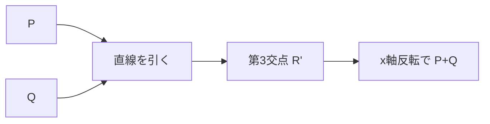

**日付**: 2026年4月22日
**学習内容**: 前回で有限体 $\mathbb{F}_p$ を構築した。本記事ではその上に **楕円曲線 (elliptic curve)** を乗せて、暗号学で最も重要な計算困難性仮定である **楕円曲線離散対数問題 (ECDLP)** を理解する。具体的には **(1) 楕円曲線の方程式とグラフ**、**(2) 曲線上の点の加算法則（chord-tangent rule）**、**(3) 有限体上の楕円曲線群 $E(\mathbb{F}_p)$**、**(4) 巡回群とスカラー倍**、**(5) 離散対数問題 (DLP) と楕円曲線版 (ECDLP)**、**(6) ZKP で使われる代表曲線 (secp256k1, BN254, BLS12-381)** を段階的に扱う。次の記事のペアリングに直接つながる内容。

## 0. 本記事の位置づけ

KZG, Groth16, PLONK, Bulletproofs など、現代 ZKP の多くは **楕円曲線暗号 (ECC)** を土台にしている。たとえば「$g^{f(\tau)}$ をコミットメントとする」という KZG の設計は、$g$ を楕円曲線のベースポイント、$f(\tau)$ をスカラーとして**楕円曲線上のスカラー倍**を使う。したがって楕円曲線を知らないと KZG の内部が理解できない。

構成:

- **第1章**: 楕円曲線の定義と直感
- **第2章**: 点の加算（chord-tangent rule）
- **第3章**: 有限体上の楕円曲線群
- **第4章**: スカラー倍と巡回群
- **第5章**: 離散対数問題 (DLP / ECDLP)
- **第6章**: 代表的な ZKP 向け曲線
- **第7章**: Q&A とまとめ

## 1. 楕円曲線の定義と直感

### 1.1 Weierstrass 形

**楕円曲線**とは、次の方程式で定義される曲線:

$$
E : y^2 = x^3 + ax + b
$$

ここで $a, b$ は体の要素で、以下の**非特異条件**を満たす:

$$
4a^3 + 27b^2 \neq 0
$$

この条件は「曲線が尖点や自己交差を持たない」ことを保証する。

### 1.2 実数上のグラフ

実数 $\mathbb{R}$ 上で $y^2 = x^3 - x + 1$（$a = -1, b = 1$）を描くと、以下のような形になる。

```
    y
    |
    |    _
    |   / \
    |  /   \_____
  ──┼─────────── x
    |  \   _____
    |   \_/
    |
```

$y = \pm\sqrt{x^3 + ax + b}$ なので、$x$ 軸に対して対称。

### 1.3 無限遠点

通常の $(x, y)$ 平面の点に加えて、**無限遠点** $\mathcal{O}$ を追加する。これは曲線の「天井」のような仮想点で、後の加算法則で単位元の役割を果たす。

曲線の点集合は:

$$
E = \{(x, y) : y^2 = x^3 + ax + b\} \cup \{\mathcal{O}\}
$$

## 2. 点の加算（chord-tangent rule）

### 2.1 加算の定義

楕円曲線上の2点 $P, Q$ に対して、その「和」$P + Q$ を**幾何学的**に定義する:

1. $P$ と $Q$ を通る直線を引く
2. その直線が曲線と交わる**第3の点** $R'$ を求める
3. $R'$ を $x$ 軸について折り返したものが $P + Q$



### 2.2 なぜ「反転」が必要なのか

これは代数的な理由（後の加算法則が群になるため）だが、直感的には「曲線が3点と交わる直線は、その3点の総和が $\mathcal{O}$ になるよう定義する」という規約。

$$
P + Q + R' = \mathcal{O} \implies P + Q = -R'
$$

ここで $-R'$ は $R'$ の $x$ 軸反転（負元）。

### 2.3 特殊ケース: $P = Q$（2倍算）

$P$ と $Q$ が同じ点のとき、「$P, Q$ を通る直線」は**$P$ での接線**と定義する。接線と曲線の交点 $R'$ を求め、反転して $2P$ を得る。

### 2.4 代数的な公式

$P = (x_1, y_1), Q = (x_2, y_2)$ の和 $P + Q = (x_3, y_3)$ は、次式で計算できる。

**Case 1: $P \neq Q$ のとき**

傾き $\lambda$:

$$
\lambda = \frac{y_2 - y_1}{x_2 - x_1}
$$

和:

$$
x_3 = \lambda^2 - x_1 - x_2, \quad y_3 = \lambda(x_1 - x_3) - y_1
$$

**Case 2: $P = Q$（2倍）**

傾き $\lambda$（接線の傾き、陰関数微分から）:

$$
\lambda = \frac{3 x_1^2 + a}{2 y_1}
$$

和:

$$
x_3 = \lambda^2 - 2 x_1, \quad y_3 = \lambda(x_1 - x_3) - y_1
$$

**Case 3: $P = -Q$ のとき**

$x_1 = x_2, y_1 = -y_2$ なら、直線は垂直で「第3の交点」は無限遠点:

$$
P + Q = \mathcal{O}
$$

### 2.5 加算公式の導出

接線の傾きが $\lambda = \frac{3x_1^2 + a}{2y_1}$ になる理由を追う。

曲線 $y^2 = x^3 + ax + b$ を両辺 $x$ で微分:

$$
2y \frac{dy}{dx} = 3x^2 + a
$$

$$
\frac{dy}{dx} = \frac{3x^2 + a}{2y}
$$

これが $P = (x_1, y_1)$ での接線の傾き。$\square$

$x_3 = \lambda^2 - x_1 - x_2$ の導出は、曲線の方程式 $y = \lambda(x - x_1) + y_1$ を $y^2 = x^3 + ax + b$ に代入:

$$
(\lambda(x - x_1) + y_1)^2 = x^3 + ax + b
$$

左辺を展開すると $x$ について3次式。この3次式の根は $x_1, x_2, x_3$（Vieta の公式より根の総和が主係数比）:

$$
x_1 + x_2 + x_3 = \lambda^2 \implies x_3 = \lambda^2 - x_1 - x_2
$$

$\square$

### 2.6 群の公理の検証

これらの加算法則で、楕円曲線の点集合 $E$ は**可換群**になる:

1. 閉性: 任意の2点の和も曲線上の点
2. 結合律: $(P + Q) + R = P + (Q + R)$（証明は代数的、煩雑だが真）
3. 単位元: $\mathcal{O}$ が単位元（$P + \mathcal{O} = P$）
4. 逆元: $P = (x, y)$ の逆元は $-P = (x, -y)$
5. 可換律: $P + Q = Q + P$（加算定義が対称）

したがって **楕円曲線は群構造を持つ**。これが暗号に使える理由。

## 3. 有限体上の楕円曲線群

### 3.1 $\mathbb{F}_p$ 上の楕円曲線

実数のかわりに $\mathbb{F}_p$ を使う:

$$
E(\mathbb{F}_p) = \{(x, y) \in \mathbb{F}_p^2 : y^2 \equiv x^3 + ax + b \pmod p\} \cup \{\mathcal{O}\}
$$

グラフは**点の散らばり**になるが、加算公式は $\bmod p$ で解釈すればそのまま適用できる。

### 3.2 具体例: $y^2 = x^3 + 2x + 3$ over $\mathbb{F}_5$

すべての $x \in \{0, 1, 2, 3, 4\}$ について $x^3 + 2x + 3 \bmod 5$ を計算し、$y^2$ になる $y$ を探す:

| $x$ | $x^3 + 2x + 3 \bmod 5$ | $y$ (もし $y^2$ が一致) |
|---|---|---|
| $0$ | $3$ | なし ($y^2 \in \{0, 1, 4, 4, 1\}$) |
| $1$ | $1$ | $y \in \{1, 4\}$ |
| $2$ | $0$ | $y = 0$ |
| $3$ | $1$ | $y \in \{1, 4\}$ |
| $4$ | $0$ | $y = 0$ |

**注**: $\mathbb{F}_5$ での平方 $y^2 \bmod 5$ は $0^2=0, 1^2=1, 2^2=4, 3^2=4, 4^2=1$。したがって平方剰余は $\{0, 1, 4\}$。

点集合:

$$
E(\mathbb{F}_5) = \{(1,1), (1,4), (2,0), (3,1), (3,4), (4,0), \mathcal{O}\}
$$

要素数 $|E(\mathbb{F}_5)| = 7$（Hasseの定理により $p+1 \pm 2\sqrt{p}$ の範囲に入る、ここでは範囲 $[2, 10]$）。

### 3.3 加算の具体例

$P = (1, 1), Q = (3, 1)$ の和を計算する（$\mathbb{F}_5$ 上、$a = 2$）。

$P \neq Q$ なので:

$$
\lambda = \frac{1 - 1}{3 - 1} = 0 \pmod 5
$$

$$
x_3 = 0^2 - 1 - 3 = -4 \equiv 1 \pmod 5
$$

$$
y_3 = 0 \cdot (1 - 1) - 1 = -1 \equiv 4 \pmod 5
$$

したがって $P + Q = (1, 4)$。

検算: $(1, 4) \in E(\mathbb{F}_5)$。また $P + Q = (1, 4) = -P$ つまり $2P + Q = \mathcal{O}$ → $Q = -2P$。

### 3.4 Hasse の定理

曲線の要素数について、**Hasse**が次を示した:

$$
|E(\mathbb{F}_p)| = p + 1 - t, \quad |t| \leq 2\sqrt{p}
$$

ここで $t$ は**Frobenius トレース**と呼ばれる整数。このバウンドは非常に厳しく、$|E(\mathbb{F}_p)| \approx p$ と考えてよい。

## 4. スカラー倍と巡回群

### 4.1 スカラー倍の定義

整数 $n$ に対して、$n$ 倍算を以下で定義:

$$
nP := \underbrace{P + P + \cdots + P}_{n \text{ 個}}
$$

($n < 0$ なら $nP = -((-n)P)$、$n = 0$ なら $\mathcal{O}$)

### 4.2 Double-and-Add アルゴリズム

$nP$ を素朴に $n-1$ 回加算するのは遅い。バイナリ展開で $O(\log n)$ 回の加算・2倍算で計算できる:

$$
n = \sum_{i=0}^{k-1} b_i 2^i
$$

すると:

$$
nP = \sum_{i=0}^{k-1} b_i (2^i P)
$$

アルゴリズム:

```
scalar_mul(n, P):
    result = O
    current = P
    while n > 0:
        if n & 1:
            result = result + current
        current = current + current  // 2 倍算
        n = n >> 1
    return result
```

たとえば $n = 13 = 1101_2$ なら:

- $13P = 8P + 4P + P$
- $8P = 2 \cdot 4P$、$4P = 2 \cdot 2P$、$2P = P + P$
- 加算3回、2倍算3回で完了

### 4.3 巡回群

ある点 $G \in E(\mathbb{F}_p)$ について、$\{G, 2G, 3G, \ldots\}$ を考える。群の位数が有限なので、どこかで一周して $\mathcal{O}$ に戻る。このとき $G$ が生成する部分群:

$$
\langle G \rangle = \{0G = \mathcal{O}, G, 2G, \ldots, (r-1)G\}
$$

が **巡回群 (cyclic group)**。$r$ を $G$ の **位数 (order)** と呼ぶ。

### 4.4 暗号では大きな素位数部分群を使う

暗号プロトコルでは、$r$ が**大きな素数**である部分群を使う。理由:

- 位数 $r$ が合成数だと、Pohlig-Hellman 攻撃で分解できる
- 素位数なら攻撃は $O(\sqrt{r})$ の Pollard's $\rho$ アルゴリズムにしか頼れない

たとえば secp256k1 では $r \approx 2^{256}$ の素位数。

## 5. 離散対数問題 (DLP / ECDLP)

### 5.1 DLP の定義（一般の群）

有限巡回群 $G = \langle g \rangle$ があるとき、次を求める問題が **離散対数問題 (Discrete Logarithm Problem, DLP)**:

> **与えられた $h \in G$ に対して、$g^x = h$ となる $x \in \{0, 1, \ldots, r-1\}$ を求めよ**

単純に $g, g^2, g^3, \ldots$ と試せば $r$ 回で見つかるが、$r$ が $2^{256}$ なら現実的ではない。

### 5.2 ECDLP の定義

楕円曲線版 DLP:

> **$G, H \in E(\mathbb{F}_p)$ が与えられ、$H = xG$ となる $x$ を求めよ**

加法で書くのが楕円曲線の流儀。指数 $x$ を**スカラー**と呼ぶ。

### 5.3 計算困難性

ECDLP を解く最良既知アルゴリズムは **Pollard's $\rho$** で、計算量は $O(\sqrt{r})$。$r = 2^{256}$ なら $2^{128}$ ステップ必要で、現実的に解けない。

これに対して、$\mathbb{F}_p^\ast$ 上の通常の DLP には **Index Calculus** という攻撃があり、サブ指数時間で解ける。そのため同じ安全性を得るには $p$ を大きくする必要がある（3072 bit 程度）。**楕円曲線は小さいパラメータで同じ強度**。

| プリミティブ | パラメータ | 安全性 |
|---|---|---|
| RSA / 通常の DLP | 3072 bit | 128 bit |
| 楕円曲線 (ECDLP) | 256 bit | 128 bit |

### 5.4 DLP の応用

ECDLP の困難性を利用した暗号プリミティブ:

- **ECDSA**: 楕円曲線デジタル署名（Bitcoin, Ethereum）
- **EdDSA**: Ed25519 署名（SSH, Signal）
- **ECDH**: 楕円曲線 Diffie-Hellman 鍵交換
- **Schnorr 署名**: Bitcoin Taproot
- **Pedersen commitment**: ブラインドなコミットメント
- **KZG コミットメント**: ZKP（次記事）

### 5.5 ZKP における ECDLP の役割

KZG コミットメントで $C = g^{f(\tau)}$ と書くとき:

- $C$ から $f(\tau)$ を逆算しようとする = ECDLP を解く
- つまり攻撃者は $C$ を見ても $f(\tau)$ を知れない（= Hiding）
- Prover だけが $f$ を知っていて、$C$ を作れる（= Binding）

このように ECDLP の困難性が **ZKP の安全性の数学的根拠** になっている。

## 6. 代表的な ZKP 向け曲線

### 6.1 secp256k1

**Bitcoin, Ethereum が使う曲線**:

$$
y^2 = x^3 + 7 \pmod p
$$

$p = 2^{256} - 2^{32} - 977 \approx 2^{256}$

特徴:

- $a = 0, b = 7$ のシンプル形
- ペアリングに向かない（ペアリング親和性が低い）
- 署名には最適だが、ZKP の KZG 等には使えない

### 6.2 BN254 (alt_bn128)

**Zcash v1, Tornado Cash, Ethereum precompile で使う曲線**:

$$
y^2 = x^3 + 3 \pmod p
$$

$p$ は 254 bit の素数。

特徴:

- **ペアリング可能**
- セキュリティレベルは当時 128 bit だったが、後の攻撃進歩で約 100 bit 程度に
- Ethereum EVM に precompile あり（EIP-196, EIP-197）
- 歴史的に広く使われるが、近年は BLS12-381 に移行中

### 6.3 BLS12-381

**Zcash Sapling, Ethereum 2.0, Filecoin, Mina で使う曲線**:

$$
y^2 = x^3 + 4
$$

$p$ は 381 bit の素数。

特徴:

- **ペアリング可能**
- 128 bit 安全性
- スカラー体 $\mathbb{F}_r$ は 255 bit
- $r - 1$ が $2^{32}$ で割れる → **FFT が長さ $2^{32}$ まで可能**
- 現代 ZKP の事実上の標準曲線

### 6.4 Pasta (Pallas / Vesta)

**Mina, Halo2 で使う曲線ペア**:

$$
E_{\text{Pallas}}/\mathbb{F}_p, \quad E_{\text{Vesta}}/\mathbb{F}_q
$$

ここで $|E_{\text{Pallas}}(\mathbb{F}_p)| = q$ かつ $|E_{\text{Vesta}}(\mathbb{F}_q)| = p$。**互いに埋め込み合える**性質があり、**再帰SNARK**（Article 19）に必須。

### 6.5 曲線選択のまとめ

| 曲線 | ペアリング | サイズ | 用途 |
|---|---|---|---|
| **secp256k1** | ✗ | 256 bit | Bitcoin, Ethereum 署名 |
| **BN254** | ✓ | 254 bit | Zcash v1, Tornado, Ethereum precompile |
| **BLS12-381** | ✓ | 381 bit | Zcash Sapling, Ethereum 2.0, Mina |
| **Pasta** | ✗ | 255 bit | Halo2, 再帰 SNARK |
| **BW6-761** | ✓ | 761 bit | BLS12-377 の外側で使う再帰用 |

## 7. Q&A

### Q1: なぜ楕円曲線を使うのか？ 通常の $\mathbb{F}_p^\ast$ ではダメ？

**パラメータサイズと安全性のトレードオフ**のため。通常の DLP には index calculus 攻撃があるため、$p$ を 3072 bit 以上にしないと 128 bit 安全性が出ない。楕円曲線ではこれが 256 bit で済むので、**通信サイズ・計算時間が一桁小さい**。

### Q2: ECDLP が破れたら ZKP はどうなる？

**多くの pairing-based SNARK が崩壊**する（Groth16, PLONK など）。ただし hash-based STARK や FRI は影響を受けない。量子計算機は ECDLP を多項式時間で解く（Shor のアルゴリズム）ので、**PQ 耐性のある ZKP は STARK/FRI 系**。

### Q3: Weierstrass 形以外の表現は？

- **Montgomery form**: $By^2 = x^3 + Ax^2 + x$（Curve25519 など）
- **Edwards form**: $x^2 + y^2 = 1 + dx^2 y^2$（Ed25519）

これらは加算公式が一様（$P = Q$ と $P \neq Q$ で場合分け不要）で、サイドチャネル攻撃に強い。

### Q4: なぜ BN254 から BLS12-381 に移行したのか？

**BN254 曲線への攻撃進歩**により、当時想定していた 128 bit 安全性が 100 bit 程度まで低下することが判明（2016年）。BLS12-381 はより保守的な設計で 128 bit 安全性を確保。現在の新規 ZKP プロジェクトはほぼ BLS12-381 を採用。

### Q5: なぜペアリング「可能」と「不可能」があるのか？

ペアリングが実用的な効率で計算できるには、**埋め込み次数 (embedding degree)** と呼ばれるパラメータが小さい必要がある。secp256k1 は $k \approx 2^{256}$ で絶望的に大きい。一方 BN254 や BLS12-381 は設計上 $k$ が小さい（12）。詳細は次の記事。

### Q6: 曲線の「ceremony」で何を生成するの？

KZG の場合、**秘密のスカラー $\tau$** を使って $\{g, g^\tau, g^{\tau^2}, \ldots, g^{\tau^d}\}$ を計算する。$\tau$ が誰かに知られると偽証明を作られるので、**分散セレモニー**で $\tau = \tau_1 + \tau_2 + \ldots + \tau_n$ と秘密分散し、**1人でも $\tau_i$ を破棄すれば安全**という仕組みを使う。

## 8. まとめ

### 本記事の要点

1. **楕円曲線** $y^2 = x^3 + ax + b$ は非特異なら曲線上の点が群をなす
2. **加算法則** (chord-tangent rule): 2点を通る直線の第3交点を反転
3. **有限体上** $E(\mathbb{F}_p)$ は Hasse の定理で $|E| \approx p$
4. **スカラー倍** $nP$ は Double-and-Add で $O(\log n)$
5. **ECDLP**: $H = xG$ の $x$ を求める問題、$O(\sqrt{r})$ で困難
6. ZKP の Hiding/Binding 安全性は ECDLP に依存
7. 主要曲線: **secp256k1 (署名), BN254 (旧ZKP), BLS12-381 (現代ZKP), Pasta (再帰)**

### 次の記事（Article 8）へ

次の記事では、楕円曲線の上に**ペアリング**という双線形写像を導入する。ペアリングは KZG や Groth16 の検証の核心であり、「$e(P^x, Q^y) = e(P, Q)^{xy}$」という驚くべき性質を使って **多項式の乗算を群の等式として検証**できるようになる。

### 3行サマリ

- **楕円曲線 = 点の集合 + 幾何的加算 = 群**
- **ECDLP = スカラー倍の逆操作、暗号の基盤**
- **BLS12-381 が現代 ZKP の主役**（128 bit 安全性、ペアリング可能、FFT 相性良）

---

## 参考文献

- Lawrence Washington. *Elliptic Curves: Number Theory and Cryptography, 2nd ed.* CRC Press, 2008.
- Neal Koblitz. *A Course in Number Theory and Cryptography, 2nd ed.* Springer, 1994.
- Ben Lynn. *On the Implementation of Pairing-Based Cryptosystems.* PhD Thesis, Stanford, 2007.
- ZKTokyo Week 0 資料 (楕円曲線).
- ZKP MOOC Lecture 6 資料 (UC Berkeley, 2023).
