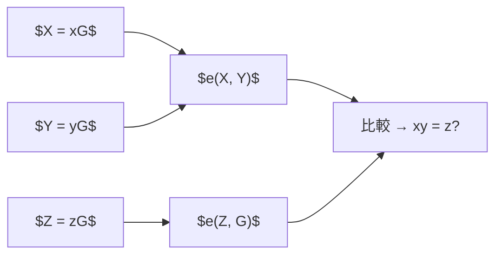
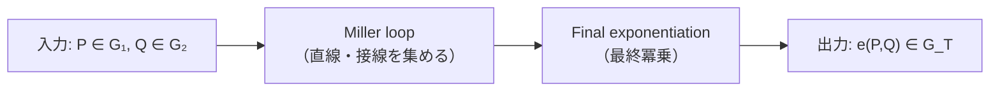

**日付**: 2026年5月17日
**学習内容**: ペアリング（pairing）は「2つの楕円曲線点を入力にして、拡大体の要素を出力する双線形写像」であり、KZG コミットメントや Groth16 の検証の核心となる数学的道具。本記事では **(1) 双線形写像の定義と性質**、**(2) なぜペアリングが魔法のように見えるか（多項式乗算を群等式に落とせる）**、**(3) Type I/II/III ペアリングの違い**、**(4) Miller's algorithm の直感**、**(5) BLS 署名というペアリングの代表応用**、**(6) ZKP での使われ方（KZG verify, Groth16 verify）**、**(7) 計算困難性仮定 (SXDH, q-SBDH)** を順に追う。ペアリングは最初とっつきにくいが、入出力と双線形性の3式だけ押さえれば大半の ZKP が読めるようになる。

## 0. 本記事の位置づけ

Article 7 までで楕円曲線と ECDLP を理解した。しかし KZG コミットメントの検証式:

$$
e(C - g^v, g) = e(\pi, g^\tau - g^z)
$$

は楕円曲線の加法・スカラー倍だけでは書けない。**2つの楕円曲線点を掛け合わせて新しい要素を生む**演算、それがペアリング $e(\cdot, \cdot)$。

本記事では、抽象度が高い部分には **$\bmod 13$ の簡略ペアリング**（第1章）や **具体的多項式**（第2・6章）を使い、式の意味を数値で追えるように説明する。

構成:

- **第1章**: 双線形写像の定義
- **第2章**: ペアリングがなぜ魔法か
- **第3章**: Type I/II/III ペアリングの分類
- **第4章**: Miller's algorithm（概念のみ）
- **第5章**: BLS 署名（ペアリングの定番応用）
- **第6章**: ZKP での使用例
- **第7章**: 計算困難性仮定
- **第8章**: Q&A とまとめ

## 1. 双線形写像の定義

### 1.1 形式的定義

3つの巡回群 $\mathbb{G}_1, \mathbb{G}_2, \mathbb{G}_T$ があり、いずれも**同じ位数** $r$（素数）とする。写像

$$
e : \mathbb{G}_1 \times \mathbb{G}_2 \to \mathbb{G}_T
$$

が以下を満たすとき、**双線形写像 (bilinear map)** と呼ぶ。

**(B1) 双線形性 (Bilinearity)**:

任意の $P \in \mathbb{G}_1$、$Q \in \mathbb{G}_2$、スカラー $a, b \in \mathbb{Z}$ に対して:

$$
e(aP, bQ) = e(P, Q)^{ab}
$$

**(B2) 非退化性 (Non-degeneracy)**:

$e(G_1, G_2) \neq 1_{\mathbb{G}_T}$（ここで $G_1, G_2$ はそれぞれの**生成元**）。

**生成元**とは、「その群のどの要素も、生成元を何倍（または何乗）すれば作れる」という特別な1点のこと。

たとえば第1.5章の簡略例では、$\mathbb{Z}_{13}^*$ の生成元は $g = 2$。この群の要素は

$$
2^1 = 2,\ 2^2 = 4,\ 2^3 = 8,\ \ldots,\ 2^{12} = 1
$$

のように、$g$ を $1, 2, 3, \ldots$ 乗していくと全部現れる。

楕円曲線では、生成元 $G$ に対して

$$
G,\ 2G,\ 3G,\ \ldots,\ (r-1)G
$$

が群 $\mathbb{G}_1$ のすべての非自明な点になる（$rG = \mathcal{O}$）。

非退化性は、「生成元同士をペアリングしても、結果が単位元 $1_{\mathbb{G}_T}$ にはならない」という条件。つまりペアリングが**全部 1 になる退化した写像**ではない、という意味。

**(B3) 効率的計算性**:

$e(P, Q)$ が多項式時間で計算できる。

### 1.2 群の役割

ペアリングは3つの世界を行き来する。ここで混乱しやすいのが、「加法」と「乗法」が**別の世界で使われている**こと。

#### $\mathbb{G}_1, \mathbb{G}_2$: 楕円曲線上の点（加法）

Article 7 で学んだように、楕円曲線上の点は**足し算**で扱う。

- 2点 $P, Q$ の和: $P + Q$
- 点 $P$ を $a$ 回足す: $aP = P + P + \cdots + P$

たとえば $\mathbb{F}_5$ 上の曲線で $P = (1, 1)$ なら、$2P = P + P$ のように計算する。これは「点同士を chord-tangent rule で足す」操作。

$\mathbb{G}_1$ と $\mathbb{G}_2$ は、この楕円曲線上の点の集まり。記号は**加法**（$+$）を使う。

#### $\mathbb{G}_T$: ペアリングの出力先（乗法）

ペアリング $e(P, Q)$ の結果は、楕円曲線上の点ではなく、もっと大きな有限体 $\mathbb{F}_{p^k}$ の中の値になる。

この世界では、整数のように**掛け算**で扱う。

- 2つの値 $u, v$ の積: $u \cdot v$
- 値 $u$ を $a$ 乗: $u^a$

簡略例（$\bmod 13$）で言えば、$e(g^3, g^4) = g^{12} = 1$ のように、出力は $g$ の**べき乗**として表される。ここでは「足す」のではなく「掛ける」。

#### なぜ記号が違うのか

歴史的・慣習的な理由が大きい。楕円曲線の点は幾何学的に「足し算」、体の要素は代数学的に「掛け算」で書くのが自然だから。

重要なのは、ペアリングがこの2つの世界をつなぐこと:

$$
e(P_1 + P_2, Q) = e(P_1, Q) \cdot e(P_2, Q)
$$

左辺: $\mathbb{G}_1$ では点を**足す**（$P_1 + P_2$）  
右辺: $\mathbb{G}_T$ では値を**掛ける**（$\cdot$）

つまり「入力側の足し算」が「出力側の掛け算」に変換される。これが双線形性の核心。

#### まとめ

| 記号 | 中身 | 演算 | 例 |
|---|---|---|---|
| $\mathbb{G}_1$ | 楕円曲線上の点 | 加法 $P + Q$, $aP$ | BLS 署名の $H$, $\sigma$ |
| $\mathbb{G}_2$ | 別の楕円曲線上の点 | 加法 $P + Q$, $aP$ | 公開鍵 $X = xG_2$ |
| $\mathbb{G}_T$ | $\mathbb{F}_{p^k}$ 上の値 | 乗法 $u \cdot v$, $u^a$ | $e(P, Q)$ の結果 |

- $k$: **埋め込み次数 (embedding degree)**。$\mathbb{G}_T$ がどれだけ大きな体 $\mathbb{F}_{p^k}$ の中にあるか。BLS12-381 では $k = 12$。

### 1.3 双線形性の言い換え

**$\mathbb{G}_1$ 側の線形性**:

$$
e(P_1 + P_2, Q) = e(P_1, Q) \cdot e(P_2, Q)
$$

**$\mathbb{G}_2$ 側の線形性**:

$$
e(P, Q_1 + Q_2) = e(P, Q_1) \cdot e(P, Q_2)
$$

これらから、冒頭の $e(aP, bQ) = e(P, Q)^{ab}$ が導出できる:

$$
\begin{aligned}
e(aP, bQ) &= e(P, bQ)^a \quad (\mathbb{G}_1 \text{ 線形}) \\
&= (e(P, Q)^b)^a \quad (\mathbb{G}_2 \text{ 線形}) \\
&= e(P, Q)^{ab}
\end{aligned}
$$

### 1.4 表記の注意

$\mathbb{G}_1, \mathbb{G}_2$ は加法で、$\mathbb{G}_T$ は乗法で書くのが標準。

- $\mathbb{G}_1, \mathbb{G}_2$: $P + Q, aP$
- $\mathbb{G}_T$: $u \cdot v, u^a$

ペアリングの出力は $\mathbb{G}_T$ なので乗法的。

### 1.5 簡略例: 小さな数で双線形性を確認する

本物の楕円曲線ペアリングは計算が複雑なので、まず**性質だけ**を小さな数で確認する。ここでは $\mathbb{Z}_{13}^*$（13 で割った余りの世界、0 以外）を使う。

生成元として $g = 2$ を取る。$\mathbb{Z}_{13}^*$ では $2^1 = 2, 2^2 = 4, 2^3 = 8, \ldots$ とべき乗していく。

群の点を $g^a$ と表す（$a$ は指数）。簡略ペアリングを次のように定義する:

$$
e(g^a, g^b) = g^{ab} \pmod{13}
$$

たとえば $a = 3, b = 4$ なら:

$$
e(g^3, g^4) = g^{12} \pmod{13}
$$

$2^{12} \pmod{13}$ を計算する:

$$
2^2 = 4,\quad 2^4 = 4^2 = 16 \equiv 3,\quad 2^8 = 3^2 = 9,\quad 2^{12} = 2^8 \cdot 2^4 = 9 \cdot 3 = 27 \equiv 1 \pmod{13}
$$

よって $e(g^3, g^4) = 1$。

双線形性を確認する。$a = 3, b = 4$ なら:

$$
e(3 \cdot g^1, 4 \cdot g^1) = e(g^3, g^4) = 1
$$

一方、

$$
e(g, g)^{3 \cdot 4} = e(g, g)^{12} = g^{12} \pmod{13} = 1
$$

左辺と右辺が一致する。これが $e(aP, bQ) = e(P, Q)^{ab}$ の具体例。

**注意**: これは本物の楕円曲線ペアリングではない。あくまで「2つの入力の指数が掛け算される」という双線形性のイメージ用。BLS12-381 では $\mathbb{G}_1, \mathbb{G}_2$ が楕円曲線上の点、$\mathbb{G}_T$ が $\mathbb{F}_{p^{12}}$ 上の値になる。

## 2. ペアリングがなぜ魔法か

### 2.1 多項式の乗算を群等式に落とす

ペアリングの最大の魅力は、**「$ab$」という掛け算を、ECDLP を破ることなく群の中で検証できる**こと。

たとえば「$z = xy$」を3人 A, B, C が検証したいとする:

- A は $X = xG$（$x$ を知る）
- B は $Y = yG$（$y$ を知る）
- C は $Z = zG$（$z$ を知る）

「$Z = xyG$ か？」を全員が $x, y, z$ を知らずに検証したい。ペアリングを使えば:

$$
e(X, Y) \stackrel{?}{=} e(Z, G)
$$

**両辺を計算して比較**するだけ。これが双線形性から:

$$
e(xG, yG) = e(G, G)^{xy}, \quad e(zG, G) = e(G, G)^z
$$

なので $xy = z$ なら両辺が等しい。

#### 具体例: $x = 3, y = 4, z = 12$

位数 $r = 13$ の群で、秘密値 $x = 3, y = 4, z = 12$ とする。$3 \times 4 = 12$ なので $z = xy$ が成り立つ。

公開情報だけ:

$$
X = 3G, \quad Y = 4G, \quad Z = 12G
$$

検証者は $x, y, z$ を知らない。簡略ペアリング $e(g^a, g^b) = g^{ab} \pmod{13}$ で:

$$
e(X, Y) = e(g^3, g^4) = g^{12} \equiv 1 \pmod{13}
$$

$$
e(Z, G) = e(g^{12}, g^1) = g^{12} \equiv 1 \pmod{13}
$$

両辺一致 → $xy = z$ だったと判断できる。

逆に $z = 11$（$3 \times 4 = 12 \neq 11$）なら $Z = 11G$ となり:

$$
e(g^{11}, g) = g^{11} \pmod{13}
$$

$2^{11} = 2^8 \cdot 2^2 \cdot 2 = 9 \cdot 4 \cdot 2 = 72 \equiv 7 \pmod{13}$。$g^{12} = 1$ なので $g^{11} = g^{-1} = 7$。一方 $e(g^3, g^4) = 1$ なので不一致 → 検証失敗。

### 2.2 ECDLP は依然困難

重要なのは、**$X = xG$ から $x$ を逆算はできない**（ECDLP）こと。ペアリングは $x$ を明かさずに $xy = z$ を検証する。

### 2.3 多項式乗算への応用

$f(X) = g(X) \cdot h(X)$ という等式を検証するとき、KZG コミットメントでは:

$$
e(C_g, C_h) \stackrel{?}{=} e(C_f, G_2)
$$

のような等式で検証する（厳密には商多項式と剰余式を使う。Article 13 で詳述）。

#### 具体例: 多項式の評価をペアリングで検証する流れ

KZG では、Prover が「多項式 $f$ の、ある点 $z$ での値は $v$ です」と主張し、Verifier がそれを検証する。ここで:

- $f(X)$: 検証対象の多項式（全体は長いが、ある1点の値だけ知りたい）
- $z$: **評価点**。$f$ に「どの $X$ を代入するか」
- $v$: **主張する値**。$v = f(z)$ であると Prover が言う

たとえば中学校の関数 $f(x) = x^2 + 1$ で「$x = 2$ のとき $f(2)$ はいくつ？」と聞くのと同じ。$z = 2$ が代入する点、$v = f(2) = 5$ が答え。

ZKP では、Prover が多項式全体を見せずに「$f(2) = 5$ です」と証明したい。$z = 2$ は Verifier も Prover も知っている公開パラメータ（「2 で評価してください」という指定）。

多項式 $f(X) = X^2 + 1$、評価点 $z = 2$ とする。この点での値は:

$$
f(2) = 2^2 + 1 = 5
$$

「$f(2) = 5$ である」ことを、多項式の係数を全部見せずに証明したい。ここで **$\tau$（タウ）** が登場する。

#### $z$ と $\tau$ の違い

| 記号 | 誰が知るか | 役割 |
|---|---|---|
| $z = 2$ | 全員（公開） | 「ここで評価して」と指定する点。$v = f(z)$ を検証したい |
| $\tau = 7$（例） | **誰も知らない**（秘密） | 多項式を「隠してコミット」するための秘密の点 |

$z$ は検証の**質問**（「$f(2)$ は 5 か？」）。  
$\tau$ は KZG の**仕組み**（多項式全体を1つのコミットメントに圧縮するための秘密）。

イメージ:

- $z = 2$: 多項式 $f(X)$ に**代入する値**そのもの。$f(2)$ の「2」は第2問という意味ではなく、$X = 2$ を $f$ に入れる、という意味
- $\tau$: 多項式全体をコミットするための**別の秘密の代入値**。$f(\tau)$ で多項式を1つの値に要約するが、$\tau$ 自体は公開しない

たとえば $f(X) = X^2 + 1$ なら、$z = 2$ は「$X$ のところに 2 を入れる」指定。計算すると $f(2) = 2^2 + 1 = 5$。Verifier が確認したいのは「本当に $X=2$ のとき 5 になるか」ということ。

KZG の Setup（準備段階）で、$\tau$ をランダムに1つ選び、

$$
g,\ g^\tau,\ g^{\tau^2},\ \ldots
$$

のような値だけを全員に配る。$\tau$ そのものは破棄され、誰も知らないまま使う。

Prover は多項式 $f(X) = X^2 + 1$ を、$\tau$ に代入した値 $f(\tau)$ を使ってコミットする（楕円曲線上では $C_f = [f(\tau)]G_1$ のような形）。Verifier は $\tau$ を知らないが、$f(2)=5$ が正しいかどうかは検証できる。

#### 商多項式が必要な理由

$f(2) = 5$ が正しいとき、多項式 $f(X) - 5$ は $X - 2$ で割り切れる（$X=2$ が根になる）。だから商 $q(X)$ が存在する:

商多項式:

$$
q(X) = \frac{f(X) - 5}{X - 2} = \frac{X^2 + 1 - 5}{X - 2} = \frac{X^2 - 4}{X - 2} = X + 2
$$

展開を確認: $(X + 2)(X - 2) = X^2 - 4 = X^2 + 1 - 5$。◯

この関係は $X$ が何であっても成り立つ。特に **秘密の $\tau$ に代入しても** 成り立つ:

$$
f(X) - v = q(X)(X - z)
$$

に $X = \tau$ を代入すると（例では $\tau = 7, z = 2, v = 5$）:

$$
f(\tau) = 7^2 + 1 = 50, \quad q(\tau) = 7 + 2 = 9, \quad \tau - z = 7 - 2 = 5
$$

重要な等式:

$$
f(\tau) - 5 = 50 - 5 = 45 = 9 \times 5 = q(\tau)(\tau - z)
$$

**読み方**: 左辺は「秘密点 $\tau$ での $f$ の値」から主張値 $v$ を引いたもの。右辺は商と $(\tau - z)$ の積。$f(2)=5$ が正しければ、この等式が $\tau$ でも成り立つ。

Verifier は $\tau$ を知らないが、Setup で配られた $g^\tau, g^{q(\tau)}$ などとペアリングを使い、上の等式が成り立つか確認できる。

ペアリングの双線形性により、指数世界では

$$
e(G_1, G_2)^{f(\tau) - 5} = e(G_1, G_2)^{q(\tau)(\tau - z)}
$$

が成り立つ。KZG 検証式（第6章）は、この等式を楕円曲線上の点として書いたもの。



## 3. Type I/II/III ペアリングの分類

ペアリング $e(P, Q)$ は、2つの入力 $P, Q$ が**どの群から来るか**で3種類に分類される。

第1章では $\mathbb{G}_1, \mathbb{G}_2, \mathbb{G}_T$ と3つの世界を紹介した。ここで問題になるのは、**$\mathbb{G}_1$ と $\mathbb{G}_2$ が同じ曲線なのか、別の曲線なのか**。

| 型 | $\mathbb{G}_1$ と $\mathbb{G}_2$ の関係 | 現代 ZKP |
|---|---|---|
| Type I | 同じ群 | ほぼ使わない |
| Type II | 別の群だが、相互に変換できる | 減少中 |
| Type III | 別の群で、変換もできない | **主流**（BLS12-381 など） |

### 3.1 Type I: Symmetric（対称型）

$\mathbb{G}_1 = \mathbb{G}_2$。つまり**同じ楕円曲線上の点**を、ペアリングの両方の入力に使う。

$$
e : \mathbb{G} \times \mathbb{G} \to \mathbb{G}_T
$$

第1.5章の簡略例がまさにこれ。$g^a$ と $g^b$ はどちらも同じ $\mathbb{Z}_{13}^*$ から来る:

$$
e(g^3, g^4) = g^{12}
$$

左右どちらも「同じ世界の要素」。

**メリット**: 記述が簡単。$P, Q$ どちらも同じ曲線なので考えやすい。

**デメリット**: 安全かつ高速な Type I 曲線が少ない。必要な曲線（超特異曲線）は、近年の攻撃研究で安全性が疑われるようになった。新しい ZKP ではほとんど採用されない。

### 3.2 Type II: 別の群だが、準同型で変換できる

$\mathbb{G}_1 \neq \mathbb{G}_2$。2つの入力は**別の楕円曲線**（または別の部分群）から来る。

ただし、$\mathbb{G}_2$ の点を $\mathbb{G}_1$ の点に**効率よく写せる**写像 $\psi$ が存在する:

$$
\psi : \mathbb{G}_2 \to \mathbb{G}_1
$$

**準同型**とは、群の構造を保つ写像のこと。直感的には「$\mathbb{G}_2$ の点 $Q$ を、計算コスト小で $\mathbb{G}_1$ の点 $\psi(Q)$ に変換できる」という意味。

Type II では、必要に応じて $\mathbb{G}_2$ 側の点を $\mathbb{G}_1$ 側に寄せて計算できる。柔軟だが、Type III より効率面で不利なことが多く、近年は新規採用が減っている。

### 3.3 Type III: 別の群で、準同型もない

**現代 ZKP で使う主流型**。$\mathbb{G}_1 \neq \mathbb{G}_2$ で、かつ $\mathbb{G}_2 \to \mathbb{G}_1$ の効率的な準同型**が存在しない**。

つまり $\mathbb{G}_1$ と $\mathbb{G}_2$ は**本当に別物**。一方を他方に無理やり変換できない。

BLS12-381 では:

- $\mathbb{G}_1$: 曲線 $E$ 上の点。座標は $\mathbb{F}_p$（Article 6 の素数体）
- $\mathbb{G}_2$: **別の曲線** $E'$（twist）上の点。座標は $\mathbb{F}_{p^2}$（1つ拡張した体）

同じ「楕円曲線の点」に見えても、住んでいる座標の世界が違う。だから $\mathbb{G}_1$ の点と $\mathbb{G}_2$ の点は、簡単には入れ替えられない。

**メリット**: 最も効率的で、暗号学的にも最も安全とされる。

**デメリット**: 実装で $\mathbb{G}_1$ と $\mathbb{G}_2$ を常に区別する必要がある。KZG 検証式のように、第1引数は $\mathbb{G}_1$、第2引数は $\mathbb{G}_2$ と決まっている。

BLS12-381 は Type III。Groth16, PLONK なども Type III を前提にしている。

#### なぜ Type III が主流なのか

Type I は曲線の選択肢が限られ、安全性の懸念がある。Type II は $\mathbb{G}_2 \to \mathbb{G}_1$ の変換がある分、攻撃面が増える。Type III は2つの群が独立しているため、パラメータ設計の自由度が高く、128 bit 安全性を保ちながら高速なペアリングが可能。

### 3.4 $\mathbb{G}_1$ と $\mathbb{G}_2$ のサイズ

Type III（BLS12-381）では、2つの群で**点の表現サイズが違う**。

| | 座標の世界 | 圧縮サイズ | 理由 |
|---|---|---|---|
| $\mathbb{G}_1$ | $\mathbb{F}_p$ | 48 bytes | 1つの有限体の要素だけで座標を表せる |
| $\mathbb{G}_2$ | $\mathbb{F}_{p^2}$ | 96 bytes | 拡大体の要素が2つ必要（$x, y$ それぞれがより大きい） |

Article 6 で学んだように、$\mathbb{F}_{p^2}$ は $\mathbb{F}_p$ より情報量が多い。$\mathbb{G}_2$ の点はその世界に住んでいるので、データサイズも約2倍になる。

**実務上の最適化**:

- **証明データ**（ユーザーが送るもの）は $\mathbb{G}_1$ に集める → 通信量を小さく
- **Setup データ**（事前配布、1回だけ）は $\mathbb{G}_2$ に置いてもよい → 検証時の計算を効率化

Groth16 では証明 $(A, B, C)$ のうち $A, C \in \mathbb{G}_1$、$B \in \mathbb{G}_2$ のように、役割分担している。

## 4. Miller's algorithm（概念のみ）

第1〜3章では、ペアリング $e(P, Q)$ が**何をする写像か**を学んだ。しかし実際にコンピュータで $e(P, Q)$ を計算するには、別のアルゴリズムが必要。**Miller's algorithm** がその中心。

### 4.0 何のために Miller アルゴリズムがあるか

KZG や BLS の検証では、毎回 $e(P, Q)$ を計算する。2つの楕円曲線上の点を入力して、$\mathbb{G}_T$ の1つの値を出力する。

素朴な方法（すべての組み合わせを試す）は不可能。Miller アルゴリズムは、Article 7 で学んだ**点の2倍算・加算**を使い、$O(\log r)$ ステップでペアリングを計算する。

全体は2段階:

1. **Miller loop**: 点 $P$ を $r$ 倍する経路を追いながら、途中の直線・接線の情報を集める
2. **Final exponentiation（最終冪乗）**: 集めた値を $\mathbb{G}_T$ の正しい代表元に整える



### 4.1 Weil pairing と Tate pairing

歴史的に最初の効率的ペアリングは **Weil pairing**（1940年頃）と **Tate pairing**（1950年代）。どちらも Miller アルゴリズムの考え方を使う。

ZKP 実装で使うのは **Optimal Ate pairing**（2010年代）で、Tate の改良版。計算が最も速い。ライブラリ（`arkworks`, `mcl` など）は内部で Optimal Ate を実装している。

本節では、Weil/Tate/Ate の違いより **Miller loop の直感** を押さえる。

### 4.2 Miller 関数: 何を集めているか

Miller アルゴリズムの核心は **Miller 関数** $f_{n, P}(Q)$。これは:

> 点 $P$ を $n$ 倍する途中で出てくる**接線と直線**を、すべて掛け合わせた関数を、点 $Q$ で評価した値

Article 7 では、2点 $P, Q$ を結ぶ**直線**や、点 $P$ における**接線**を使って $P+Q$ や $2P$ を求めた。Miller アルゴリズムは、その直線・接線を「捨てずに記録」する。

たとえば $2P$ を求めるとき:

1. $P$ における**接線**を引く（$P$ を2倍するため）
2. その接線と曲線の第3交点を $x$ 軸反転 → $2P$

Miller では、この**接線の方程式**を $f$ に掛け込む。同様に $P+Q$ のときは $P$ と $Q$ を結ぶ**直線**を $f$ に掛け込む。

#### 「$f$ に掛け込む」とは

$f$ は最初 $1$ から始まる**累積の積**。各ステップで出てくる直線（または接線）について、その直線を**点 $Q$ で評価した値**を求め、$f$ に**掛け算**する:

$$
f \leftarrow f \times \text{line}(A, B, Q)
$$

「掛け込む」=「今まで集めた $f$ に、新しい直線の値を1因子として掛ける」という意味。

中学校の因数分解に近いイメージ:

$$
f = \ell_1 \times \ell_2 \times \ell_3 \times \cdots
$$

ここで $\ell_i$ は、$i$ 番目の2倍算・加算ステップで使った直線（または接線）を $Q$ に代入した値。

**具体例**（普通の $x, y$ 平面で、計算の流れだけ見る）:

$P, Q$ を結ぶ直線が $y = x + 1$、つまり $\ell(x, y) = y - x - 1$（直線上では $\ell = 0$）とする。

点 $Q = (3, 5)$ を代入:

$$
\ell(3, 5) = 5 - 3 - 1 = 1
$$

このステップの前に $f = 4$ だったなら、掛け込み後は:

$$
f = 4 \times 1 = 4
$$

次の接線が $Q$ で評価すると $2$ なら:

$$
f = 4 \times 2 = 8
$$

Miller loop 全体では、$5P$ を求める5〜6本の直線・接線それぞれについてこの操作を繰り返し、最終的な $f$ を得る。Article 7 では直線・接線は「点を求めるため」に使って捨てていたが、Miller では**捨てずに $f$ に積み上げる**。

`line(A, B, Q)` の意味:

- $A, B$ を通る直線（$A = B$ なら接線）の方程式を求める
- その直線に、**別の点 $Q$ の座標を代入**した値を返す

$Q$ は直線上にある必要はない。ペアリングは $\mathbb{G}_1$ の $P$ と $\mathbb{G}_2$ の $Q$ を入力するので、$Q$ は別の曲線上の点。

#### 補足: $\text{div}(f_{n,P})$ の式は何を言っているか（読み飛ばしてよい）

上の「$f$ に掛け込む」だけで Miller loop の実像は掴める。以下は、数学的に**なぜ直線の積でうまくいくか**を説明する式。初見では難しいので、最初はスキップしてよい。

$$
\text{div}(f_{n, P}) = n(P) - (nP) - (n-1)(\mathcal{O})
$$

**$\text{div}(f)$ とは**: 関数 $f$ が、曲線上の**どの点で 0 になるか**（零点）、**どの点で発散するか**（極）を、地点と重数のリストとして書いたもの。代数幾何の**除子**という記法。

式の右辺 $n(P) - (nP) - (n-1)(\mathcal{O})$ は、**関数の値ではない**。$(P)$ や $(nP)$ は「その点が除子に現れる」ことを表す**形式記号**で、前の係数 $n$ や $-$ が**重数**（何重の零点か、何重の極か）を表す:

| 記号 | 意味 |
|---|---|
| $n(P)$ | 点 $P$ に **$n$ 重の零点**（$f$ が $P$ で $n$ 回 0 になる） |
| $-(nP)$ | 点 $nP$ に **1 重の零点**（式では $(nP)$ の前に $-$ が付いている） |
| $-(n-1)(\mathcal{O})$ | 無限遠点 $\mathcal{O}$ に **$n-1$ 重の極**（$f$ が $\mathcal{O}$ で発散する） |

**何のための式か**: $P$ を $n$ 倍する double-and-add で使う直線・接線を全部掛け合わせると、ちょうどこの零点・極のパターンを持つ関数 $f_{n,P}$ ができる、ということを言っている。

**具体例** ($n = 5$): $5P$ を求めるとき、接線・直線を $f$ に掛け合わせる（次の表では 2 本の接線と 1 本の直線）。作られた $f_{5,P}$ の零点・極は次のとおり。

- **点 $P$ で 5 重零点**（$5(P)$ に対応）

  $P$ における**接線**は、$P$ で曲線に接するので **2 重零点**を持つ（接点で 2 回 0 になる）。2 倍のたびに $f \leftarrow f^2 \times (\text{接線})$ とするので、$P$ での重数は 1 段階で 2 倍される。$5 = 101_2$ の経路では:

  1. 最初の 2 倍: $P$ の接線を $\ell_P$ とすると $f = \ell_P$ → $P$ で **2 重**
  2. 次の 2 倍: $f = \ell_P^2 \cdot \ell_{2P}$ → $P$ で **4 重**
  3. 加算: $4P$ と $P$ を結ぶ直線を掛ける → $P$ で **+1 重** → 合計 **5 重**

  加算の直線は $P$ を通るが 1 重零点にとどまる。接線の 2 重性と $f^2$ の組み合わせで、最終的に $n = 5$ 重になる。

- **点 $5P$ で 1 重零点**

  最終加算 $4P + P = 5P$ のとき、$4P$ と $P$ を結ぶ**直線**は $4P$ でも $P$ でも 0 になる。スカラー倍の**結果点** $5P$ にも 1 重零点が残る。$\text{div}$ 式の $(5P)$ 項がこれに対応する。

- **無限遠 $\mathcal{O}$ で 4 重極**（$n - 1 = 4$）

  楕円曲線上の直線 $\ell(x, y) = ax + by + c$ は、プロジェクティブ座標では $\mathcal{O}$（無限遠）で**極**（発散）を持つ。Miller loop で掛けた関数全体では、$\mathcal{O}$ に **$n - 1$ 重**の極が残る。$P$ で 5 重・$5P$ で 1 重の零点と、$\mathcal{O}$ で 4 重の極は**除子として次数 0**（零点と極が釣り合う）になり、有理関数として well-defined になる。

この釣り合いがあるから、$f_{n,P}(Q)$ を別の点 $Q$ で評価した値が、ペアリング計算に使える正しい情報になる。

**まとめ**: 実装・検証の理解には「$nP$ の経路の直線・接線を $f$ に掛け込む」で十分。この $\text{div}$ の式は、その裏付けを代数幾何で書いたもの。

#### 簡略例: $n = 5$ のとき Miller ループのイメージ

$5P$ を **double-and-add**（2進展開）で求める。$n = 5 = 101_2$（MSB から処理）。表の **2進桁** 列は、Miller loop が $n$ の2進表現を**上の桁（bit 2）から下の桁（bit 0）へ**1桁ずつ読む順番を表す。

| 2進桁 | 操作 | $T$ の状態 | $f$ に掛けるもの |
|---|---|---|---|
| 初期 | — | $T = \mathcal{O}$ | $f = 1$ |
| bit 2 (=1) | 最初の 1 | $T = P$ | — |
| bit 1 (=0) | 2倍 | $T = 2P$ | $P$ における**接線** |
| bit 0 (=1) | 2倍 | $T = 4P$ | $2P$ における**接線** |
| bit 0 (=1) | 加算 | $T = 4P + P = 5P$ | $4P$ と $P$ を結ぶ**直線** |

MSB から bit を読む。**bit が 0** なら 2倍だけ、**bit が 1** なら 2倍してから $P$ を足す（最初の 1 だけは $T = P$ から開始）。各 2倍・加算のたびに、対応する接線または直線を $f$ に掛ける。下の疑似コードは、この表と同じ手順を書いたもの。

Miller 関数 $f$ は、2倍・加算の各ステップで「$f$ に掛けるもの」をすべて掛け合わせ、最後に $Q$ の座標を代入して評価した値。これだけではまだペアリングの最終値ではない。**最終冪乗**が必要。

### 4.3 疑似コード: Miller loop

Miller 関数を $n$ の2進展開で計算する:

```
miller(n, P, Q):
    f = 1          # 集めている直線・接線の積
    T = None       # まだ点を置いていない
    for i = (log n)-1 down to 0:
        if bit_i(n) == 0:
            if T is not None:
                f = f^2 * line(T, T, Q)   # 2倍: 接線を f に追加
                T = 2T
        else:  # bit_i(n) == 1
            if T is None:
                T = P                     # 先頭の 1: ここから追跡開始
            else:
                f = f^2 * line(T, T, Q)
                T = 2T
                f = f * line(T, P, Q)     # 加算: 直線を f に追加
                T = T + P
    return f
```

各行の意味:

| 行 | 何をしているか | なぜ |
|---|---|---|
| `T = None` → 最初の 1 で `T = P` | MSB から読み、先頭の 0 はスキップ | $101_2$ なら最初に $T = P$、その後 2倍→加算で $5P$ |
| `f = f^2` | 前の段階の直線情報を2乗 | 2倍算の各段階を反映 |
| `line(T, T, Q)` | $T$ における接線を $Q$ で評価 | $2T$ を求める幾何 |
| `line(T, P, Q)` | $T$ と $P$ を結ぶ直線を $Q$ で評価 | $T+P$ を求める幾何 |

**$O(\log n)$** の加算・2倍算で済む。$r \approx 2^{256}$ でも約 256 ステップ。

### 4.4 Final Exponentiation: なぜ最後に冪乗するか

Miller loop だけでは、値が $\mathbb{G}_T$ の「正しい代表元」にならない。同じペアリング値でも、Miller 関数の出力は $r$ 倍の周期性などで曖昧な部分が残る。

そこで**最終冪乗**を施して、$\mathbb{G}_T$ 内で一意の値に整える:

$$
e(P, Q) = f_{r, P}(Q)^{(p^k - 1)/r}
$$

直感的には:

- Miller loop: 直線・接線の情報を集めた「下ごしらえ」
- Final exponentiation: それを $\mathbb{G}_T$ の正式な元素 $e(P, Q)$ に変換する「仕上げ」

BLS12-381 では $k = 12$。この冪乗の計算が、ペアリング全体の**約半分**のコストを占める。

### 4.5 実用ペアリングの計算時間

BLS12-381 Optimal Ate pairing（良い実装）:

| 段階 | 時間 | 内容 |
|---|---|---|
| Miller loop | 約 0.5 ms | 点の2倍算・加算 + 直線評価 |
| Final exponentiation | 約 0.5 ms | $\mathbb{F}_{p^{12}}$ 上の大きな冪乗 |
| **合計** | **約 1 ms** | 1 CPU |

KZG 検証は1〜2回、Groth16 検証は3回のペアリング → いずれもミリ秒オーダーで完了する。

**実装の注意**: ペアリングは実装が複雑で、バグが致命的（偽証明を通してしまう）。通常は `arkworks-rs`, `mcl`, `blst` などの実装済みライブラリを使う（Q6 参照）。

## 5. BLS 署名 — ペアリングの代表応用

### 5.1 BLS 署名の仕組み

**BLS (Boneh-Lynn-Shacham)** 署名は、ペアリング応用の最も有名な例。

**鍵生成**:

- 秘密鍵: $x \in \mathbb{F}_r$ （ランダム）
- 公開鍵: $X = xG_2 \in \mathbb{G}_2$

**署名**:

- メッセージ $m$ をハッシュで曲線点に: $H = \text{HashToCurve}(m) \in \mathbb{G}_1$
- 署名: $\sigma = xH \in \mathbb{G}_1$

**検証**:

$$
e(\sigma, G_2) \stackrel{?}{=} e(H, X)
$$

### 5.2 検証の正当性

$$
\begin{aligned}
e(\sigma, G_2) &= e(xH, G_2) \\
&= e(H, G_2)^x \\
&= e(H, xG_2) \\
&= e(H, X)
\end{aligned}
$$

途中で $\mathbb{G}_1$ 側の線形性と $\mathbb{G}_2$ 側の線形性を入れ替えている。

#### 具体例: 簡略ペアリングで BLS 検証を追う

簡略モデル（$\bmod 13$、$g = 2$、位数 12）で追う。

**鍵生成**:
- 秘密鍵 $x = 5$
- 公開鍵 $X = 5 G_2$。指数で $X = g^5 = 2^5 = 32 \equiv 6 \pmod{13}$

**署名**（メッセージ $m$ のハッシュを $H = g^3$ と仮定）:
- 署名 $\sigma = 5H = 5 \cdot g^3$。指数は $5 \times 3 = 15 \equiv 3 \pmod{12}$ なので $\sigma = g^3 = 8$

**検証** $e(\sigma, G_2) \stackrel{?}{=} e(H, X)$:

左辺:
$$
e(g^3, g) = g^3 = 2^3 = 8
$$

右辺:
$$
e(g^3, g^5) = g^{15} = 2^{15} = 2^{12} \cdot 2^3 = 1 \cdot 8 = 8
$$

$8 = 8$ で一致 → 検証成功。

検証者は $x = 5$ を知らなくてよい。$H$ と $X$ だけから「正しい秘密鍵で署名された」と判断できる。

### 5.3 BLS 署名の強み

- **集約可能**: 多数の署名を1つに集約できる
- **短い**: $\sigma \in \mathbb{G}_1$ は 48 bytes
- **決定的**: 同じメッセージは常に同じ署名（ECDSA は乱数に依存）

Ethereum 2.0 のバリデータ集約署名、Filecoin で採用。

### 5.4 署名集約の仕組み

$n$ 人がそれぞれ $\sigma_i = x_i H_i$ を生成したとき:

$$
\sigma_{\text{agg}} = \sum_{i} \sigma_i
$$

検証:

$$
e(\sigma_{\text{agg}}, G_2) \stackrel{?}{=} \prod_i e(H_i, X_i)
$$

1 人の署名でも 100 万人の署名でも、署名サイズは同じ（48 bytes）。**これは通常の署名では不可能な特性**。

#### 具体例: 2人分の署名を1つに集約

簡略モデルで、2人が同じメッセージ $H = g^3$ に署名すると仮定する。

- Alice: 秘密鍵 $x_1 = 5$、公開鍵 $X_1 = g^5 = 6$、署名 $\sigma_1 = 5H = g^3 = 8$
- Bob: 秘密鍵 $x_2 = 7$、公開鍵 $X_2 = g^7$、署名 $\sigma_2 = 7H$

$\sigma_2$ の指数: $7 \times 3 = 21 \equiv 9 \pmod{12}$ なので $\sigma_2 = g^9$。$2^9 = 512 \equiv 5 \pmod{13}$。

集約署名 $\sigma_{\text{agg}} = \sigma_1 + \sigma_2$（群の加法 = 指数の加法）:
$$
\sigma_{\text{agg}} = g^3 \cdot g^9 = g^{12} = 1
$$

検証 $e(\sigma_{\text{agg}}, G_2) \stackrel{?}{=} e(H, X_1) \cdot e(H, X_2)$:

左辺: $e(g^{12}, g) = g^{12} = 1$

右辺: $e(g^3, g^5) \cdot e(g^3, g^7) = g^{15} \cdot g^{21} = g^3 \cdot g^9 = g^{12} = 1$

一致。2人分の署名を1つの値 $\sigma_{\text{agg}}$ にまとめて検証できた。

## 6. ZKP での使用例

### 6.1 KZG 検証

KZG コミットメント $C_f = g^{f(\tau)}$ と評価証明 $\pi = g^{q(\tau)}$ から、$f(z) = v$ を検証:

$$
e(C_f - v \cdot G_1, G_2) \stackrel{?}{=} e(\pi, \tau G_2 - z \cdot G_2)
$$

左辺 = $e(G_1, G_2)^{f(\tau) - v}$  
右辺 = $e(G_1, G_2)^{q(\tau) \cdot (\tau - z)}$

$q(X) = (f(X) - v)/(X - z)$ なので $f(\tau) - v = q(\tau)(\tau - z)$。左右一致。◯

#### 具体例: 第2章の多項式を KZG 検証式で追う

第2章で使った多項式 $f(X) = X^2 + 1$、評価点 $z = 2$、値 $v = 5$、秘密 $\tau = 7$ をそのまま使う。

| 量 | 値 | 意味 |
|---|---|---|
| $f(X)$ | $X^2 + 1$ | コミットする多項式 |
| $z$ | $2$ | 評価点 |
| $v = f(z)$ | $5$ | 主張する評価値 |
| $q(X)$ | $X + 2$ | 商多項式 |
| $\tau$ | $7$ | 秘密（Setup で使う） |

Setup で公開されるもの（$\tau$ 自体は秘密）:
- $C_f = [\tau^2 + 1]G_1$（$f(\tau) = 50$ 倍）
- $\pi = [q(\tau)]G_1 = [9]G_1$
- $\tau G_2$（$G_2$ 上の $\tau$ 倍点）

Prover が「$f(2) = 5$」と主張するとき、Verifier は次を計算する:

**左辺** $e(C_f - 5G_1, G_2)$:
- 指数は $f(\tau) - 5 = 50 - 5 = 45$

**右辺** $e(\pi, \tau G_2 - 2 G_2)$:
- 指数は $q(\tau) \cdot (\tau - z) = 9 \times 5 = 45$

両辺とも $e(G_1, G_2)^{45}$ になるので一致。

もし Prover が $v = 6$ と嘘をつくと、左辺の指数は $50 - 6 = 44$ になり、右辺の $45$ と一致しない → 検証失敗。

**ポイント**: Verifier は $\tau$ を知らなくてよい。$C_f, \pi, \tau G_2$ など Setup で配られた点だけで、多項式の評価が正しいか確認できる。

### 6.2 Groth16 検証

Groth16 の最終検証は**3つのペアリング積**:

$$
e(A, B) \stackrel{?}{=} e(\alpha G_1, \beta G_2) \cdot e(L, \gamma G_2) \cdot e(C, \delta G_2)
$$

ここで $A, B, C$ は証明の3要素、$\alpha, \beta, \gamma, \delta$ は CRS の要素、$L$ は公開入力への線形結合。

詳細は Article 16。**重要なのは、証明はわずか 3 点（$\sim 200$ bytes）で、検証は 3 回のペアリングで完了する**こと。

#### 簡略例: Groth16 検証式の形

Groth16 の検証式は「3つのペアリングの積が等しいか」という形。簡略モデルで指数だけ追う。

Setup から $\alpha, \beta, \gamma, \delta$ が与えられ、証明 $(A, B, C)$ が届く。検証式:

$$
e(A, B) \stackrel{?}{=} e(\alpha G_1, \beta G_2) \cdot e(L, \gamma G_2) \cdot e(C, \delta G_2)
$$

簡略モデルで、すべての値が $g$ のべき乗だと仮定する。正しい証明なら指数が一致する:

| 記号 | 指数 |
|---|---|
| $A$ | $a = 7$ |
| $B$ | $b = 5$ |
| $C$ | $c = 3$ |
| $\alpha$ | $2$ |
| $\beta$ | $3$ |
| $L$ | $4$ |
| $\gamma$ | $5$ |
| $\delta$ | $3$ |

左辺 $e(A, B) = g^{7 \cdot 5} = g^{35}$

右辺:
$$
e(g^2, g^3) \cdot e(g^4, g^5) \cdot e(g^3, g^3) = g^6 \cdot g^{20} \cdot g^9 = g^{35}
$$

$35 = 35$ で一致。指数世界では $ab = \alpha\beta + \gamma l + \delta c$、つまり $7 \times 5 = 2 \times 3 + 5 \times 4 + 3 \times 3 = 6 + 20 + 9 = 35$。

**読み方**: 左辺 $e(A, B)$ は「証明2要素のペアリング」、右辺は「Setup 要素とのペアリングの積」。双線形性で、指数の等式を点のペアリングだけで検証している。

### 6.3 PLONK 検証

PLONK も KZG コミットメントのペアリング検証を使う。複数の評価点をバッチで検証する技法により、数回のペアリングで全体を検証できる。

## 7. 計算困難性仮定

ペアリングを使うプロトコルは、以下のような仮定のもとで安全性を証明する。

### 7.1 DDH (Decisional Diffie-Hellman)

$(g, g^a, g^b, g^{ab})$ と $(g, g^a, g^b, g^c)$（$c$ ランダム）を区別するのが困難。

**ペアリングのある群**では DDH は**自明に解ける**（$e(g^a, g^b) \stackrel{?}{=} e(g^{ab}, g)$）ので、$\mathbb{G}_1$ の DDH に依存するプロトコルはペアリング群では動かない。

#### 具体例: ペアリングで DDH が解ける

簡略モデル（$g = 2 \pmod{13}$）で $a = 3, b = 4$ とする。

**本物の DH 四つ組**:
- $g^a = 2^3 = 8$
- $g^b = 2^4 = 3$
- $g^{ab} = g^{12} = 1$

**ランダムな第4要素**（$c = 7$ とする）:
- $g^c = 2^7 = 128 \equiv 11 \pmod{13}$

区別方法: ペアリングで $e(g^a, g^b)$ と $e(g^{ab}, g)$ を比較する。

$$
e(g^3, g^4) = g^{12} = 1
$$

本物の四つ組なら $e(g^{ab}, g) = e(g^{12}, g) = g^{12} = 1$ → **一致**。

偽物（$g^c = g^{11}$）なら $e(g^{11}, g) = g^{11} = 7$ → **不一致**。

ペアリングがあれば、第4要素が「本物の $g^{ab}$」か「ランダムな $g^c$」かを即座に判定できる。だからペアリング群では DDH 仮定は成り立たない。

### 7.2 SXDH (Symmetric eXternal Diffie-Hellman)

Type III ペアリングでは、$\mathbb{G}_1$ と $\mathbb{G}_2$ 間に準同型がないため、それぞれの中での DDH はまだ困難と信じられる。これが SXDH 仮定。

### 7.3 q-SBDH (q-Strong Bilinear Diffie-Hellman)

KZG コミットメントの binding の根拠:

> **$\{g, g^\tau, g^{\tau^2}, \ldots, g^{\tau^q}\}$ が与えられたとき、ある $z$ に対して $(z, e(g,g)^{1/(\tau - z)})$ を出力するのが困難**

KZG のバインディングがこの仮定に帰着される。

### 7.4 Knowledge of Exponent (KoE)

「$g^x$ を知っている誰かは、実際に $x$ も知っている」という仮定。Groth16 の knowledge soundness の根拠。厳密には Generic Group Model や AGM（Algebraic Group Model）で正当化される。

## 8. Q&A

### Q1: ペアリングはどの曲線でもあるの？

**いいえ**。ペアリングを効率的に計算するには、**埋め込み次数 $k$ が小さい**曲線が必要。secp256k1 は $k \approx 2^{256}$ で絶望的。BLS12-381 は $k = 12$ で実用的。特別に設計された**ペアリングフレンドリー曲線**のみ使える。

### Q2: $\mathbb{G}_T$ は楕円曲線の点？

**違う**。$\mathbb{G}_T$ は拡大体 $\mathbb{F}_{p^k}^\ast$ の部分群（乗法群）で、楕円曲線上の点ではない。BLS12-381 では $\mathbb{F}_{p^{12}}$ の一部。要素サイズは約 576 bytes と大きい。

### Q3: ペアリングベースと量子耐性の関係は？

**量子計算機にペアリングベース SNARK は弱い**。Shor のアルゴリズムで ECDLP が解けるため、KZG も Groth16 も崩壊する。量子耐性が必要なら **STARK (FRI)** を使う。

### Q4: 埋め込み次数 $k$ を大きくすると何が起きる？

- セキュリティは向上する傾向
- $\mathbb{F}_{p^k}$ の計算が重くなり、ペアリング計算が遅くなる
- 実用では $k = 12$（BLS12-381）がスイートスポット

### Q5: ペアリングを使わない SNARK はあるか？

**ある**。Bulletproofs（IPA ベース）、STARK（FRI）、Halo2（IPA）、Nova（folding）など。ペアリング不要なので **universal setup** や **transparent** にしやすい。

### Q6: Miller's algorithm を自分で実装する？

**通常しない**。`arkworks-rs/algebra`, `zcash/pairing`, `mcl` などの実装済みライブラリを使う。ペアリングは実装が複雑でバグが致命的なので、自作は避ける。

## 9. まとめ

### 本記事の要点

1. **ペアリング** $e : \mathbb{G}_1 \times \mathbb{G}_2 \to \mathbb{G}_T$ は双線形・非退化・効率的な写像
2. **双線形性** $e(aP, bQ) = e(P, Q)^{ab}$ が「掛け算を群内で検証できる」魔法の源
3. **Type III** ペアリングが現代主流（BLS12-381 が標準）
4. **Miller's algorithm** で $O(\log r)$ 時間で計算
5. **BLS 署名**: 集約可能・短い・決定的。Ethereum 2.0 で採用
6. **KZG, Groth16, PLONK** の検証式はすべてペアリングで書かれる
7. **量子計算機には弱い** → PQ 耐性が必要なら STARK を選ぶ

### 次の記事（Article 9）へ

次の記事では、SNARK の中核で使われる **多項式**、特に **ラグランジュ補間** と **Schwartz-Zippel 補題** を扱う。なぜ「多項式が2点で同じ値 → ほぼ確実に同じ多項式」と言えるのか、これが全 SNARK の健全性の基盤。

### 3行サマリ

- **ペアリングは $e(P^x, Q^y) = e(P, Q)^{xy}$ で掛け算を群等式に変換する双線形写像**
- **KZG, Groth16, BLS 署名** などの検証は、すべてペアリングで書ける
- **BLS12-381 が事実上の標準曲線**（ペアリング可能、128 bit 安全）

---

## 参考文献

- Dan Boneh, Ben Lynn, Hovav Shacham. *Short Signatures from the Weil Pairing.* ASIACRYPT 2001.
- Victor Miller. *The Weil Pairing, and Its Efficient Calculation.* J. Cryptology, 2004.
- Paulo S. L. M. Barreto, Michael Naehrig. *Pairing-Friendly Elliptic Curves of Prime Order.* SAC 2005.
- Ben Lynn. *On the Implementation of Pairing-Based Cryptosystems.* PhD Thesis, Stanford, 2007.
- ZKP MOOC Lecture 6 資料 (UC Berkeley, 2023).
