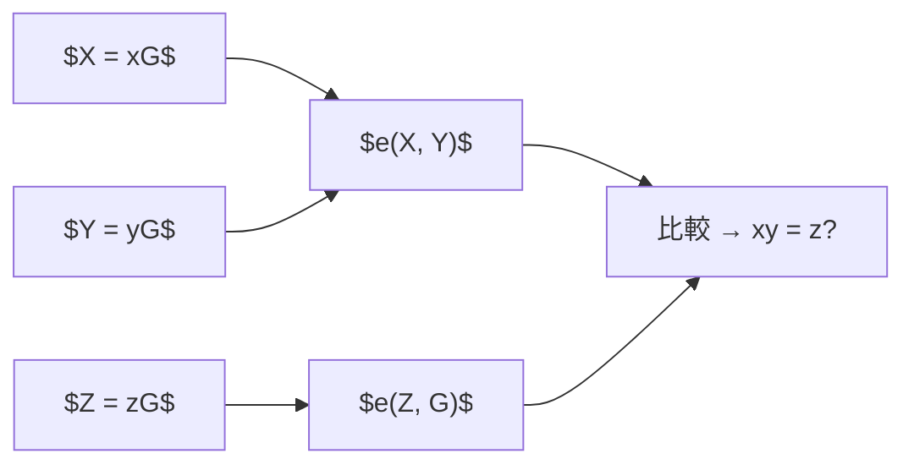

**日付**: 2026年5月18日
**学習内容**: ペアリング（pairing）は「2つの楕円曲線点を入力にして、拡大体の要素を出力する双線形写像」であり、KZG コミットメントや Groth16 の検証の核心となる数学的道具。本記事では **(1) 双線形写像の定義と性質**、**(2) なぜペアリングが魔法のように見えるか（多項式乗算を群等式に落とせる）**、**(3) Type I/II/III ペアリングの違い**、**(4) Miller's algorithm の直感**、**(5) BLS 署名というペアリングの代表応用**、**(6) ZKP での使われ方（KZG verify, Groth16 verify）**、**(7) 計算困難性仮定 (SXDH, q-SBDH)** を順に追う。ペアリングは最初とっつきにくいが、入出力と双線形性の3式だけ押さえれば大半の ZKP が読めるようになる。

## 0. 本記事の位置づけ

Article 7 までで楕円曲線と ECDLP を理解した。しかし KZG コミットメントの検証式:

$$
e(C - g^v, g) = e(\pi, g^\tau - g^z)
$$

は楕円曲線の加法・スカラー倍だけでは書けない。**2つの楕円曲線点を掛け合わせて新しい要素を生む**演算、それがペアリング $e(\cdot, \cdot)$。

本記事では、抽象度が高い部分には **$\bmod 13$ の玩具ペアリング**（第1章）や **具体的多項式**（第2・6章）を使い、式の意味を数値で追えるように説明する。

構成:

- **第1章**: 双線形写像の定義
- **第2章**: ペアリングがなぜ魔法か
- **第3章**: Type I/II/III ペアリングの分類
- **第4章**: Miller's algorithm（概念のみ）
- **第5章**: BLS 署名（ペアリングの定番応用）
- **第6章**: ZKP での使用例
- **第7章**: 計算困難性仮定
- **第8章**: Q&A とまとめ

## 1. 双線形写像の定義

### 1.1 形式的定義

3つの巡回群 $\mathbb{G}_1, \mathbb{G}_2, \mathbb{G}_T$ があり、いずれも**同じ位数** $r$（素数）とする。写像

$$
e : \mathbb{G}_1 \times \mathbb{G}_2 \to \mathbb{G}_T
$$

が以下を満たすとき、**双線形写像 (bilinear map)** と呼ぶ。

**(B1) 双線形性 (Bilinearity)**:

任意の $P \in \mathbb{G}_1$、$Q \in \mathbb{G}_2$、スカラー $a, b \in \mathbb{Z}$ に対して:

$$
e(aP, bQ) = e(P, Q)^{ab}
$$

**(B2) 非退化性 (Non-degeneracy)**:

$e(G_1, G_2) \neq 1_{\mathbb{G}_T}$（ここで $G_1, G_2$ はそれぞれの生成元）。

**(B3) 効率的計算性**:

$e(P, Q)$ が多項式時間で計算できる。

### 1.2 群の役割

- $\mathbb{G}_1, \mathbb{G}_2$: 楕円曲線の部分群（加法で書く）
- $\mathbb{G}_T$: 拡大体 $\mathbb{F}_{p^k}^\ast$ の部分群（乗法で書く）
- $k$: **埋め込み次数 (embedding degree)**、BLS12-381 では $k = 12$

### 1.3 双線形性の言い換え

**$\mathbb{G}_1$ 側の線形性**:

$$
e(P_1 + P_2, Q) = e(P_1, Q) \cdot e(P_2, Q)
$$

**$\mathbb{G}_2$ 側の線形性**:

$$
e(P, Q_1 + Q_2) = e(P, Q_1) \cdot e(P, Q_2)
$$

これらから、冒頭の $e(aP, bQ) = e(P, Q)^{ab}$ が導出できる:

$$
\begin{aligned}
e(aP, bQ) &= e(P, bQ)^a \quad (\mathbb{G}_1 \text{ 線形}) \\
&= (e(P, Q)^b)^a \quad (\mathbb{G}_2 \text{ 線形}) \\
&= e(P, Q)^{ab}
\end{aligned}
$$

### 1.4 表記の注意

$\mathbb{G}_1, \mathbb{G}_2$ は加法で、$\mathbb{G}_T$ は乗法で書くのが標準。

- $\mathbb{G}_1, \mathbb{G}_2$: $P + Q, aP$
- $\mathbb{G}_T$: $u \cdot v, u^a$

ペアリングの出力は $\mathbb{G}_T$ なので乗法的。

### 1.5 玩具例: 小さな数で双線形性を確認する

本物の楕円曲線ペアリングは計算が複雑なので、まず**性質だけ**を小さな数で確認する。ここでは $\mathbb{Z}_{13}^*$（13 で割った余りの世界、0 以外）を使う。

生成元として $g = 2$ を取る。$\mathbb{Z}_{13}^*$ では $2^1 = 2, 2^2 = 4, 2^3 = 8, \ldots$ とべき乗していく。

群の点を $g^a$ と表す（$a$ は指数）。玩具ペアリングを次のように定義する:

$$
e(g^a, g^b) = g^{ab} \pmod{13}
$$

たとえば $a = 3, b = 4$ なら:

$$
e(g^3, g^4) = g^{12} \pmod{13}
$$

$2^{12} \pmod{13}$ を計算する:

$$
2^2 = 4,\quad 2^4 = 4^2 = 16 \equiv 3,\quad 2^8 = 3^2 = 9,\quad 2^{12} = 2^8 \cdot 2^4 = 9 \cdot 3 = 27 \equiv 1 \pmod{13}
$$

よって $e(g^3, g^4) = 1$。

双線形性を確認する。$a = 3, b = 4$ なら:

$$
e(3 \cdot g^1, 4 \cdot g^1) = e(g^3, g^4) = 1
$$

一方、

$$
e(g, g)^{3 \cdot 4} = e(g, g)^{12} = g^{12} \pmod{13} = 1
$$

左辺と右辺が一致する。これが $e(aP, bQ) = e(P, Q)^{ab}$ の具体例。

**注意**: これは本物の楕円曲線ペアリングではない。あくまで「2つの入力の指数が掛け算される」という双線形性のイメージ用。BLS12-381 では $\mathbb{G}_1, \mathbb{G}_2$ が楕円曲線上の点、$\mathbb{G}_T$ が $\mathbb{F}_{p^{12}}$ 上の値になる。

## 2. ペアリングがなぜ魔法か

### 2.1 多項式の乗算を群等式に落とす

ペアリングの最大の魅力は、**「$ab$」という掛け算を、ECDLP を破ることなく群の中で検証できる**こと。

たとえば「$z = xy$」を3人 A, B, C が検証したいとする:

- A は $X = xG$（$x$ を知る）
- B は $Y = yG$（$y$ を知る）
- C は $Z = zG$（$z$ を知る）

「$Z = xyG$ か？」を全員が $x, y, z$ を知らずに検証したい。ペアリングを使えば:

$$
e(X, Y) \stackrel{?}{=} e(Z, G)
$$

**両辺を計算して比較**するだけ。これが双線形性から:

$$
e(xG, yG) = e(G, G)^{xy}, \quad e(zG, G) = e(G, G)^z
$$

なので $xy = z$ なら両辺が等しい。

#### 具体例: $x = 3, y = 4, z = 12$

位数 $r = 13$ の群で、秘密値 $x = 3, y = 4, z = 12$ とする。$3 \times 4 = 12$ なので $z = xy$ が成り立つ。

公開情報だけ:

$$
X = 3G, \quad Y = 4G, \quad Z = 12G
$$

検証者は $x, y, z$ を知らない。玩具ペアリング $e(g^a, g^b) = g^{ab} \pmod{13}$ で:

$$
e(X, Y) = e(g^3, g^4) = g^{12} \equiv 1 \pmod{13}
$$

$$
e(Z, G) = e(g^{12}, g^1) = g^{12} \equiv 1 \pmod{13}
$$

両辺一致 → $xy = z$ だったと判断できる。

逆に $z = 11$（$3 \times 4 = 12 \neq 11$）なら $Z = 11G$ となり:

$$
e(g^{11}, g) = g^{11} \pmod{13}
$$

$2^{11} = 2^8 \cdot 2^2 \cdot 2 = 9 \cdot 4 \cdot 2 = 72 \equiv 7 \pmod{13}$。$g^{12} = 1$ なので $g^{11} = g^{-1} = 7$。一方 $e(g^3, g^4) = 1$ なので不一致 → 検証失敗。

### 2.2 ECDLP は依然困難

重要なのは、**$X = xG$ から $x$ を逆算はできない**（ECDLP）こと。ペアリングは $x$ を明かさずに $xy = z$ を検証する。

### 2.3 多項式乗算への応用

$f(X) = g(X) \cdot h(X)$ という等式を検証するとき、KZG コミットメントでは:

$$
e(C_g, C_h) \stackrel{?}{=} e(C_f, G_2)
$$

のような等式で検証する（厳密には商多項式と剰余式を使う。Article 13 で詳述）。

#### 具体例: 多項式の評価をペアリングで検証する流れ

多項式 $f(X) = X^2 + 1$ を考える。点 $z = 2$ での値は:

$$
f(2) = 2^2 + 1 = 5
$$

「$f(2) = 5$ である」ことを、秘密の $\tau$ を明かさず検証したい。

商多項式:

$$
q(X) = \frac{f(X) - 5}{X - 2} = \frac{X^2 + 1 - 5}{X - 2} = \frac{X^2 - 4}{X - 2} = X + 2
$$

展開を確認: $(X + 2)(X - 2) = X^2 - 4 = X^2 + 1 - 5$。◯

秘密の $\tau = 7$ として（実際は誰も知らない）:

$$
f(\tau) = 7^2 + 1 = 50, \quad q(\tau) = 7 + 2 = 9, \quad \tau - z = 7 - 2 = 5
$$

重要な等式:

$$
f(\tau) - 5 = 50 - 5 = 45 = 9 \times 5 = q(\tau)(\tau - z)
$$

ペアリングの双線形性により、指数世界では

$$
e(G_1, G_2)^{f(\tau) - 5} = e(G_1, G_2)^{q(\tau)(\tau - z)}
$$

が成り立つ。KZG 検証式（第6章）は、この等式を楕円曲線上の点として書いたもの。



## 3. Type I/II/III ペアリングの分類

ペアリングは $\mathbb{G}_1, \mathbb{G}_2$ の関係で3種類に分類される。

### 3.1 Type I: Symmetric

$\mathbb{G}_1 = \mathbb{G}_2$ の対称型。

$$
e : \mathbb{G} \times \mathbb{G} \to \mathbb{G}_T
$$

**メリット**: 記述が簡単  
**デメリット**: 効率的な安全な曲線が少ない。超特異曲線が必要で、近年は攻撃の進歩で危険視されている

### 3.2 Type II: $\mathbb{G}_1 \neq \mathbb{G}_2$、準同型あり

$\mathbb{G}_2 \to \mathbb{G}_1$ の効率的な準同型 $\psi$ が存在する。

**メリット**: 柔軟だが、Type III の方が効率的で近年は減少

### 3.3 Type III: $\mathbb{G}_1 \neq \mathbb{G}_2$、準同型なし

**現代 ZKP で使う主流型**。$\mathbb{G}_2 \to \mathbb{G}_1$ の準同型が存在しない。

- **メリット**: 最も効率的、最も安全
- **デメリット**: $\mathbb{G}_1$ と $\mathbb{G}_2$ を区別する必要あり

BLS12-381 は Type III。Groth16, PLONK などは Type III を前提にしている。

### 3.4 $\mathbb{G}_1$ と $\mathbb{G}_2$ のサイズ

Type III で通常:

- $\mathbb{G}_1$: 基底体 $\mathbb{F}_p$ 上の点。サイズ小さい（BLS12-381 で 48B 圧縮）
- $\mathbb{G}_2$: 拡大体 $\mathbb{F}_{p^2}$ 上の点。サイズ大きい（BLS12-381 で 96B 圧縮）

**最適化**: 証明を $\mathbb{G}_1$ に集める、Setup の重いデータを $\mathbb{G}_2$ に置く、など。

## 4. Miller's algorithm（概念のみ）

### 4.1 Weil pairing と Tate pairing

歴史的に最初の効率的ペアリングは **Weil pairing**（1940年頃）と **Tate pairing**（1950年代）。ZKP で使うのは **Optimal Ate pairing**（2010年代）で、Tate の派生。

### 4.2 Miller 関数の定義

ペアリングの計算は **Miller's algorithm** で行う。中心概念は **Miller 関数** $f_{n, P}(Q)$:

$$
\text{div}(f_{n, P}) = n(P) - (nP) - (n-1)(\mathcal{O})
$$

（ここで $(P)$ は曲線の因子の記法）。

直感的には、$f_{n, P}$ は「$P$ を $n$ 倍したときの経路上の直線の積」。

#### 玩具例: $n = 5$ のとき Miller ループのイメージ

$n = 5 = 101_2$（2進: 101）として、$P$ を5倍する経路を追う。

| ステップ | 操作 | $T$ の状態 | 直線/接線 |
|---|---|---|---|
| 初期 | — | $T = P$ | $f = 1$ |
| bit 2 (=1) | 2倍 | $T = 2P$ | 接線 at $P$ |
| | 加算 | $T = 2P + P = 3P$ | 直線 $P$ to $2P$ |
| bit 1 (=0) | 2倍 | $T = 6P$ | 接線 at $3P$ |
| bit 0 (=1) | 2倍 | $T = 12P$ | 接線 at $6P$ |
| | 加算 | $T = 12P + P = 13P = 5P$ | 直線 $P$ to $12P$ |

Article 7 の $\mathbb{F}_5$ 上の楕円曲線で $P = (1, 1)$ なら、前章の加算公式で $5P = (1, 4)$ になる（位数 7 の群で $5P = -P$）。

Miller 関数 $f$ は、この各ステップで出てくる直線・接線の値を掛け合わせたもの。最後に final exponentiation を施してペアリング $e(P, Q)$ が得られる。

### 4.3 Double-and-Add 的計算

Miller 関数を $n$ のバイナリ展開で再帰的に計算:

```
miller(n, P, Q):
    T = P, f = 1
    for i = (log n)-1 down to 0:
        f = f^2 * line(T, T, Q)   # 接線
        T = 2T
        if bit_i(n) == 1:
            f = f * line(T, P, Q)  # 直線
            T = T + P
    return f
```

ここで `line(A, B, Q)` は「$A, B$ を通る直線を $Q$ で評価」した値。**$O(\log n)$ の乗算と楕円加算**で計算可能。

### 4.4 Final Exponentiation

Miller 関数の値をそのまま使うと群 $\mathbb{G}_T$ の代表元として一意でないので、**最終冪乗**を施す:

$$
e(P, Q) = f_{r, P}(Q)^{(p^k - 1)/r}
$$

この最終冪乗が計算コストの半分を占める。

### 4.5 実用ペアリングの計算時間

BLS12-381 Optimal Ate pairing:

- Miller loop: 約 0.5 ms（良い実装）
- Final exponentiation: 約 0.5 ms
- 合計: 約 1 ms（1CPU）

マルチコアや SIMD 最適化でさらに速い。

## 5. BLS 署名 — ペアリングの代表応用

### 5.1 BLS 署名の仕組み

**BLS (Boneh-Lynn-Shacham)** 署名は、ペアリング応用の最も有名な例。

**鍵生成**:

- 秘密鍵: $x \in \mathbb{F}_r$ （ランダム）
- 公開鍵: $X = xG_2 \in \mathbb{G}_2$

**署名**:

- メッセージ $m$ をハッシュで曲線点に: $H = \text{HashToCurve}(m) \in \mathbb{G}_1$
- 署名: $\sigma = xH \in \mathbb{G}_1$

**検証**:

$$
e(\sigma, G_2) \stackrel{?}{=} e(H, X)
$$

### 5.2 検証の正当性

$$
\begin{aligned}
e(\sigma, G_2) &= e(xH, G_2) \\
&= e(H, G_2)^x \\
&= e(H, xG_2) \\
&= e(H, X)
\end{aligned}
$$

途中で $\mathbb{G}_1$ 側の線形性と $\mathbb{G}_2$ 側の線形性を入れ替えている。

#### 具体例: 玩具ペアリングで BLS 検証を追う

玩具モデル（$\bmod 13$、$g = 2$、位数 12）で追う。

**鍵生成**:
- 秘密鍵 $x = 5$
- 公開鍵 $X = 5 G_2$。指数で $X = g^5 = 2^5 = 32 \equiv 6 \pmod{13}$

**署名**（メッセージ $m$ のハッシュを $H = g^3$ と仮定）:
- 署名 $\sigma = 5H = 5 \cdot g^3$。指数は $5 \times 3 = 15 \equiv 3 \pmod{12}$ なので $\sigma = g^3 = 8$

**検証** $e(\sigma, G_2) \stackrel{?}{=} e(H, X)$:

左辺:
$$
e(g^3, g) = g^3 = 2^3 = 8
$$

右辺:
$$
e(g^3, g^5) = g^{15} = 2^{15} = 2^{12} \cdot 2^3 = 1 \cdot 8 = 8
$$

$8 = 8$ で一致 → 検証成功。

検証者は $x = 5$ を知らなくてよい。$H$ と $X$ だけから「正しい秘密鍵で署名された」と判断できる。

### 5.3 BLS 署名の強み

- **集約可能**: 多数の署名を1つに集約できる
- **短い**: $\sigma \in \mathbb{G}_1$ は 48 bytes
- **決定的**: 同じメッセージは常に同じ署名（ECDSA は乱数に依存）

Ethereum 2.0 のバリデータ集約署名、Filecoin で採用。

### 5.4 署名集約の仕組み

$n$ 人がそれぞれ $\sigma_i = x_i H_i$ を生成したとき:

$$
\sigma_{\text{agg}} = \sum_{i} \sigma_i
$$

検証:

$$
e(\sigma_{\text{agg}}, G_2) \stackrel{?}{=} \prod_i e(H_i, X_i)
$$

1 人の署名でも 100 万人の署名でも、署名サイズは同じ（48 bytes）。**これは通常の署名では不可能な特性**。

#### 具体例: 2人分の署名を1つに集約

玩具モデルで、2人が同じメッセージ $H = g^3$ に署名すると仮定する。

- Alice: 秘密鍵 $x_1 = 5$、公開鍵 $X_1 = g^5 = 6$、署名 $\sigma_1 = 5H = g^3 = 8$
- Bob: 秘密鍵 $x_2 = 7$、公開鍵 $X_2 = g^7$、署名 $\sigma_2 = 7H$

$\sigma_2$ の指数: $7 \times 3 = 21 \equiv 9 \pmod{12}$ なので $\sigma_2 = g^9$。$2^9 = 512 \equiv 5 \pmod{13}$。

集約署名 $\sigma_{\text{agg}} = \sigma_1 + \sigma_2$（群の加法 = 指数の加法）:
$$
\sigma_{\text{agg}} = g^3 \cdot g^9 = g^{12} = 1
$$

検証 $e(\sigma_{\text{agg}}, G_2) \stackrel{?}{=} e(H, X_1) \cdot e(H, X_2)$:

左辺: $e(g^{12}, g) = g^{12} = 1$

右辺: $e(g^3, g^5) \cdot e(g^3, g^7) = g^{15} \cdot g^{21} = g^3 \cdot g^9 = g^{12} = 1$

一致。2人分の署名を1つの値 $\sigma_{\text{agg}}$ にまとめて検証できた。

## 6. ZKP での使用例

### 6.1 KZG 検証

KZG コミットメント $C_f = g^{f(\tau)}$ と評価証明 $\pi = g^{q(\tau)}$ から、$f(z) = v$ を検証:

$$
e(C_f - v \cdot G_1, G_2) \stackrel{?}{=} e(\pi, \tau G_2 - z \cdot G_2)
$$

左辺 = $e(G_1, G_2)^{f(\tau) - v}$  
右辺 = $e(G_1, G_2)^{q(\tau) \cdot (\tau - z)}$

$q(X) = (f(X) - v)/(X - z)$ なので $f(\tau) - v = q(\tau)(\tau - z)$。左右一致。◯

#### 具体例: 第2章の多項式を KZG 検証式で追う

第2章で使った多項式 $f(X) = X^2 + 1$、評価点 $z = 2$、値 $v = 5$、秘密 $\tau = 7$ をそのまま使う。

| 量 | 値 | 意味 |
|---|---|---|
| $f(X)$ | $X^2 + 1$ | コミットする多項式 |
| $z$ | $2$ | 評価点 |
| $v = f(z)$ | $5$ | 主張する評価値 |
| $q(X)$ | $X + 2$ | 商多項式 |
| $\tau$ | $7$ | 秘密（Setup で使う） |

Setup で公開されるもの（$\tau$ 自体は秘密）:
- $C_f = [\tau^2 + 1]G_1$（$f(\tau) = 50$ 倍）
- $\pi = [q(\tau)]G_1 = [9]G_1$
- $\tau G_2$（$G_2$ 上の $\tau$ 倍点）

Prover が「$f(2) = 5$」と主張するとき、Verifier は次を計算する:

**左辺** $e(C_f - 5G_1, G_2)$:
- 指数は $f(\tau) - 5 = 50 - 5 = 45$

**右辺** $e(\pi, \tau G_2 - 2 G_2)$:
- 指数は $q(\tau) \cdot (\tau - z) = 9 \times 5 = 45$

両辺とも $e(G_1, G_2)^{45}$ になるので一致。

もし Prover が $v = 6$ と嘘をつくと、左辺の指数は $50 - 6 = 44$ になり、右辺の $45$ と一致しない → 検証失敗。

**ポイント**: Verifier は $\tau$ を知らなくてよい。$C_f, \pi, \tau G_2$ など Setup で配られた点だけで、多項式の評価が正しいか確認できる。

### 6.2 Groth16 検証

Groth16 の最終検証は**3つのペアリング積**:

$$
e(A, B) \stackrel{?}{=} e(\alpha G_1, \beta G_2) \cdot e(L, \gamma G_2) \cdot e(C, \delta G_2)
$$

ここで $A, B, C$ は証明の3要素、$\alpha, \beta, \gamma, \delta$ は CRS の要素、$L$ は公開入力への線形結合。

詳細は Article 16。**重要なのは、証明はわずか 3 点（$\sim 200$ bytes）で、検証は 3 回のペアリングで完了する**こと。

#### 玩具例: Groth16 検証式の形

Groth16 の検証式は「3つのペアリングの積が等しいか」という形。玩具モデルで指数だけ追う。

Setup から $\alpha, \beta, \gamma, \delta$ が与えられ、証明 $(A, B, C)$ が届く。検証式:

$$
e(A, B) \stackrel{?}{=} e(\alpha G_1, \beta G_2) \cdot e(L, \gamma G_2) \cdot e(C, \delta G_2)
$$

玩具モデルで、すべての値が $g$ のべき乗だと仮定する。正しい証明なら指数が一致する:

| 記号 | 指数 |
|---|---|
| $A$ | $a = 7$ |
| $B$ | $b = 5$ |
| $C$ | $c = 3$ |
| $\alpha$ | $2$ |
| $\beta$ | $3$ |
| $L$ | $4$ |
| $\gamma$ | $5$ |
| $\delta$ | $3$ |

左辺 $e(A, B) = g^{7 \cdot 5} = g^{35}$

右辺:
$$
e(g^2, g^3) \cdot e(g^4, g^5) \cdot e(g^3, g^3) = g^6 \cdot g^{20} \cdot g^9 = g^{35}
$$

$35 = 35$ で一致。指数世界では $ab = \alpha\beta + \gamma l + \delta c$、つまり $7 \times 5 = 2 \times 3 + 5 \times 4 + 3 \times 3 = 6 + 20 + 9 = 35$。

**読み方**: 左辺 $e(A, B)$ は「証明2要素のペアリング」、右辺は「Setup 要素とのペアリングの積」。双線形性で、指数の等式を点のペアリングだけで検証している。

### 6.3 PLONK 検証

PLONK も KZG コミットメントのペアリング検証を使う。複数の評価点をバッチで検証する技法により、数回のペアリングで全体を検証できる。

## 7. 計算困難性仮定

ペアリングを使うプロトコルは、以下のような仮定のもとで安全性を証明する。

### 7.1 DDH (Decisional Diffie-Hellman)

$(g, g^a, g^b, g^{ab})$ と $(g, g^a, g^b, g^c)$（$c$ ランダム）を区別するのが困難。

**ペアリングのある群**では DDH は**自明に解ける**（$e(g^a, g^b) \stackrel{?}{=} e(g^{ab}, g)$）ので、$\mathbb{G}_1$ の DDH に依存するプロトコルはペアリング群では動かない。

#### 具体例: ペアリングで DDH が解ける

玩具モデル（$g = 2 \pmod{13}$）で $a = 3, b = 4$ とする。

**本物の DH 四つ組**:
- $g^a = 2^3 = 8$
- $g^b = 2^4 = 3$
- $g^{ab} = g^{12} = 1$

**ランダムな第4要素**（$c = 7$ とする）:
- $g^c = 2^7 = 128 \equiv 11 \pmod{13}$

区別方法: ペアリングで $e(g^a, g^b)$ と $e(g^{ab}, g)$ を比較する。

$$
e(g^3, g^4) = g^{12} = 1
$$

本物の四つ組なら $e(g^{ab}, g) = e(g^{12}, g) = g^{12} = 1$ → **一致**。

偽物（$g^c = g^{11}$）なら $e(g^{11}, g) = g^{11} = 7$ → **不一致**。

ペアリングがあれば、第4要素が「本物の $g^{ab}$」か「ランダムな $g^c$」かを即座に判定できる。だからペアリング群では DDH 仮定は成り立たない。

### 7.2 SXDH (Symmetric eXternal Diffie-Hellman)

Type III ペアリングでは、$\mathbb{G}_1$ と $\mathbb{G}_2$ 間に準同型がないため、それぞれの中での DDH はまだ困難と信じられる。これが SXDH 仮定。

### 7.3 q-SBDH (q-Strong Bilinear Diffie-Hellman)

KZG コミットメントの binding の根拠:

> **$\{g, g^\tau, g^{\tau^2}, \ldots, g^{\tau^q}\}$ が与えられたとき、ある $z$ に対して $(z, e(g,g)^{1/(\tau - z)})$ を出力するのが困難**

KZG のバインディングがこの仮定に帰着される。

### 7.4 Knowledge of Exponent (KoE)

「$g^x$ を知っている誰かは、実際に $x$ も知っている」という仮定。Groth16 の knowledge soundness の根拠。厳密には Generic Group Model や AGM（Algebraic Group Model）で正当化される。

## 8. Q&A

### Q1: ペアリングはどの曲線でもあるの？

**いいえ**。ペアリングを効率的に計算するには、**埋め込み次数 $k$ が小さい**曲線が必要。secp256k1 は $k \approx 2^{256}$ で絶望的。BLS12-381 は $k = 12$ で実用的。特別に設計された**ペアリングフレンドリー曲線**のみ使える。

### Q2: $\mathbb{G}_T$ は楕円曲線の点？

**違う**。$\mathbb{G}_T$ は拡大体 $\mathbb{F}_{p^k}^\ast$ の部分群（乗法群）で、楕円曲線上の点ではない。BLS12-381 では $\mathbb{F}_{p^{12}}$ の一部。要素サイズは約 576 bytes と大きい。

### Q3: ペアリングベースと量子耐性の関係は？

**量子計算機にペアリングベース SNARK は弱い**。Shor のアルゴリズムで ECDLP が解けるため、KZG も Groth16 も崩壊する。量子耐性が必要なら **STARK (FRI)** を使う。

### Q4: 埋め込み次数 $k$ を大きくすると何が起きる？

- セキュリティは向上する傾向
- $\mathbb{F}_{p^k}$ の計算が重くなり、ペアリング計算が遅くなる
- 実用では $k = 12$（BLS12-381）がスイートスポット

### Q5: ペアリングを使わない SNARK はあるか？

**ある**。Bulletproofs（IPA ベース）、STARK（FRI）、Halo2（IPA）、Nova（folding）など。ペアリング不要なので **universal setup** や **transparent** にしやすい。

### Q6: Miller's algorithm を自分で実装する？

**通常しない**。`arkworks-rs/algebra`, `zcash/pairing`, `mcl` などの実装済みライブラリを使う。ペアリングは実装が複雑でバグが致命的なので、自作は避ける。

## 9. まとめ

### 本記事の要点

1. **ペアリング** $e : \mathbb{G}_1 \times \mathbb{G}_2 \to \mathbb{G}_T$ は双線形・非退化・効率的な写像
2. **双線形性** $e(aP, bQ) = e(P, Q)^{ab}$ が「掛け算を群内で検証できる」魔法の源
3. **Type III** ペアリングが現代主流（BLS12-381 が標準）
4. **Miller's algorithm** で $O(\log r)$ 時間で計算
5. **BLS 署名**: 集約可能・短い・決定的。Ethereum 2.0 で採用
6. **KZG, Groth16, PLONK** の検証式はすべてペアリングで書かれる
7. **量子計算機には弱い** → PQ 耐性が必要なら STARK を選ぶ

### 次の記事（Article 9）へ

次の記事では、SNARK の中核で使われる **多項式**、特に **ラグランジュ補間** と **Schwartz-Zippel 補題** を扱う。なぜ「多項式が2点で同じ値 → ほぼ確実に同じ多項式」と言えるのか、これが全 SNARK の健全性の基盤。

### 3行サマリ

- **ペアリングは $e(P^x, Q^y) = e(P, Q)^{xy}$ で掛け算を群等式に変換する双線形写像**
- **KZG, Groth16, BLS 署名** などの検証は、すべてペアリングで書ける
- **BLS12-381 が事実上の標準曲線**（ペアリング可能、128 bit 安全）

---

## 参考文献

- Dan Boneh, Ben Lynn, Hovav Shacham. *Short Signatures from the Weil Pairing.* ASIACRYPT 2001.
- Victor Miller. *The Weil Pairing, and Its Efficient Calculation.* J. Cryptology, 2004.
- Paulo S. L. M. Barreto, Michael Naehrig. *Pairing-Friendly Elliptic Curves of Prime Order.* SAC 2005.
- Ben Lynn. *On the Implementation of Pairing-Based Cryptosystems.* PhD Thesis, Stanford, 2007.
- ZKP MOOC Lecture 6 資料 (UC Berkeley, 2023).
