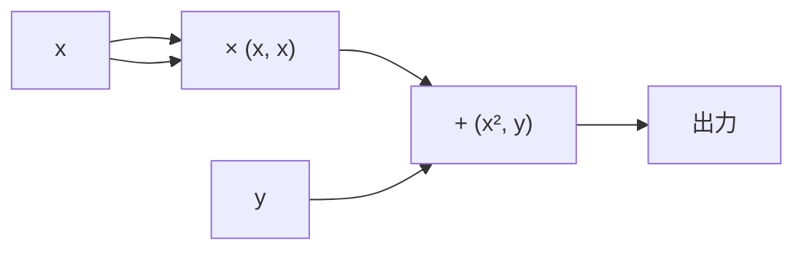
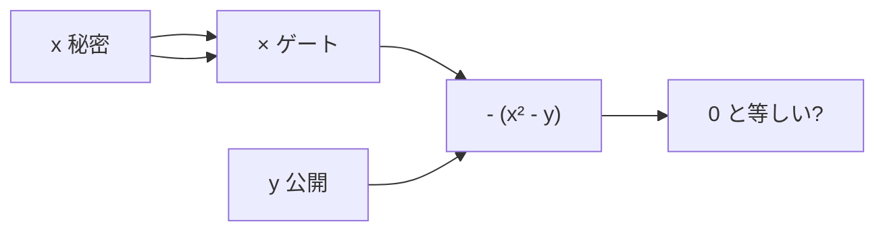
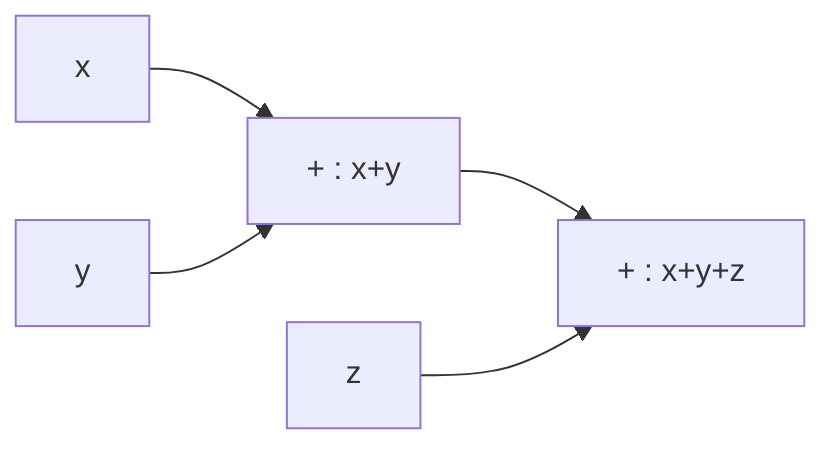

**日付**: 2026年4月22日
**学習内容**: SNARK は「**任意の計算を ZKP で検証する**」のが目的だが、任意の計算をそのまま扱うのは難しい。そこで **算術回路 (arithmetic circuit)** という中間表現に翻訳する。算術回路は「$+$ ゲートと $\times$ ゲート」だけからなる有向非巡回グラフで、**有限体 $\mathbb{F}_p$ 上の任意の計算** を表現できる。本記事では **(1) 算術回路の定義**、**(2) 具体例（二乗根証明、ハッシュ計算）**、**(3) 回路サイズと深さ**、**(4) 実行トレース (execution trace)**、**(5) ブール論理の算術化**、**(6) 一般の計算の算術化**、**(7) 回路の効率化** を追う。次の記事の R1CS の土台。

## 0. 本記事の位置づけ

Article 3 で SNARK が「回路サイズ $|C|$ に対して対数的な証明を作る」と学んだ。ではその「回路」とは何か。それが本記事の主題、算術回路。

ZKP の実装の全体像は:

今回は Code → Circuit の部分、次回が Circuit → R1CS、その次が R1CS → QAP。

構成:

- **第1章**: 算術回路の定義
- **第2章**: 最初の具体例
- **第3章**: 回路サイズ・深さ・ファンアウト
- **第4章**: 実行トレース
- **第5章**: ブール回路の算術化
- **第6章**: 複雑な計算の算術化（ハッシュ、比較、範囲検証）
- **第7章**: 回路の効率化
- **第8章**: Q&A とまとめ

## 1. 算術回路の定義

### 1.1 形式的定義

**算術回路 $C$** は、次のような有向非巡回グラフ (DAG):

- **入力ノード**: 変数 $x_1, x_2, \ldots, x_n$ または定数
- **ゲートノード**: 種類 $\{+, \times\}$ のいずれか、入次数2、出次数は任意
- **出力ノード**: 計算結果

すべての値は体 $\mathbb{F}_p$ の要素。

### 1.2 回路の計算

入力に値が与えられると、ゲートごとに:

- $+$ ゲート: 入力の和
- $\times$ ゲート: 入力の積

を計算し、出力ノードに値が定まる。

### 1.3 回路の例: $f(x, y) = x^2 + y$

ゲート数: 2 (1 × + 1 ×)。

### 1.4 関数との関係

算術回路は、$\mathbb{F}_p^n \to \mathbb{F}_p$ の関数を計算する。厳密には多項式関数を計算:

$$
C(x_1, \ldots, x_n) = f(x_1, \ldots, x_n) \in \mathbb{F}_p[x_1, \ldots, x_n]
$$

## 2. 最初の具体例

### 2.1 例1: 平方根証明

「**$x$ は $y$ の平方根である**」すなわち $x^2 = y$ を証明する回路。

出力が 0 なら Prover が正しい $x$ を持つ。$x$ は Verifier に明かさずに検証できる（ZKP の出番）。

### 2.2 例2: 3つの数の和が0

「$x + y + z = 0$」を検証する回路。

$$
\text{Output} = x + y + z
$$

### 2.3 例3: 多項式評価

$f(x) = 3x^2 + 5x + 7$ を計算する回路。

- $x^2 = x \times x$
- $3x^2 = 3 \times x^2$
- $5x = 5 \times x$
- $3x^2 + 5x$
- $(3x^2 + 5x) + 7$

ゲート数: 乗算 3、加算 2、合計 5。

### 2.4 例4: ハッシュの1ラウンド（Poseidon 風）

Poseidon ハッシュの1ラウンド（詳細は Article 25）:

1. **Add constant**: $x \to x + c$
2. **S-box**: $y \to y^5$（= $y \cdot y \cdot y \cdot y \cdot y$）
3. **Linear layer**: 行列乗算

S-box の $y^5$ は:

$$
y^2 = y \cdot y, \quad y^4 = y^2 \cdot y^2, \quad y^5 = y^4 \cdot y
$$

乗算 3 回で計算可能（$y^5$ を素朴に 4 回で書くより効率的）。

## 3. 回路サイズ・深さ・ファンアウト

### 3.1 サイズ (size)

**ゲート数**。回路の複雑さの主な指標。

- 小さい回路 → Prover 時間・証明サイズが小さい
- SNARK では **乗算ゲート数** が特に重要（加算は「ほぼ無料」な場合が多い）

### 3.2 深さ (depth)

**入力から出力までの最長経路**。並列計算の深さに相当。

- 浅い回路 → 並列化しやすい
- STARK では深さが Prover 時間に影響

### 3.3 ファンアウト (fanout)

**あるノードから出ていくエッジの数**。ファンアウト1のものを「ツリー」、そうでないものを「DAG」と呼ぶ。

ZKP の多くはファンアウト2以上の回路（DAG）を扱える。コピー制約（Article 11）で同じ値を複数箇所で使う。

### 3.4 サイズと深さのトレードオフ

同じ関数でも、回路の書き方でサイズ・深さが変わる:

- **$x^{2^k}$ の計算**: 
  - 素朴: 乗算 $2^k - 1$ 回（サイズ $2^k$、深さ $2^k$）
  - 反復二乗: 乗算 $k$ 回（サイズ $k$、深さ $k$）

反復二乗が圧倒的に効率的。

## 4. 実行トレース (Execution Trace)

### 4.1 定義

**実行トレース**は、回路の各ゲートの入出力値の記録:

| ゲート | 左入力 | 右入力 | 出力 |
|---|---|---|---|
| Gate 1 | $x$ | $y$ | $x + y$ |
| Gate 2 | $x + y$ | $z$ | $(x + y) \cdot z$ |
| ... | ... | ... | ... |

これが後の R1CS で "witness" と呼ばれるもの。

### 4.2 トレースの長さ

ゲート数 $|C|$ のときトレースの行数 $|C|$。

### 4.3 ZKP における役割

Prover はトレース全体を知っている。Verifier は **各ゲートの計算が正しい** ことを確認する。これを多項式制約として符号化するのが次の段階。

## 5. ブール回路の算術化

### 5.1 問題: ブール論理はどう表すか

通常のコードには `if`, `and`, `or` などが含まれる。これらを $\mathbb{F}_p$ 上の算術に変換する必要がある。

### 5.2 ブール値の表現

ブール $\{0, 1\}$ は $\mathbb{F}_p$ の $\{0, 1\}$ として表せる。**ただし「実際にブール値である」制約**が必要:

$$
x \cdot (x - 1) = 0 \iff x \in \{0, 1\}
$$

### 5.3 論理ゲートの算術化

$a, b \in \{0, 1\}$ のとき:

| 論理演算 | 算術表現 |
|---|---|
| $a \land b$ (AND) | $a \cdot b$ |
| $a \lor b$ (OR) | $a + b - a \cdot b$ |
| $\lnot a$ (NOT) | $1 - a$ |
| $a \oplus b$ (XOR) | $a + b - 2ab$ |

### 5.4 証明例

$a \lor b = a + b - ab$ の検証:

| $a$ | $b$ | $a + b - ab$ |
|---|---|---|
| $0$ | $0$ | $0$ |
| $0$ | $1$ | $1$ |
| $1$ | $0$ | $1$ |
| $1$ | $1$ | $1 + 1 - 1 = 1$ |

◯ すべて一致。

### 5.5 ビット分解

$32$ ビット整数 $x$ を扱うには、まずビット分解:

$$
x = \sum_{i=0}^{31} b_i \cdot 2^i
$$

ここで各 $b_i \in \{0, 1\}$ をブール制約で保証。これで整数演算を $\mathbb{F}_p$ 上で模倣可能。

## 6. 複雑な計算の算術化

### 6.1 範囲検証 (range check)

「$x \in [0, 2^{32})$」を示したい。

**方法1: ビット分解**

$x = \sum_{i=0}^{31} b_i \cdot 2^i$ と、各 $b_i$ のブール制約。

- 制約数: 32 個のブール制約 + 1 個の線形制約 = 33

**方法2: Lookup Argument (Article 18)**

テーブル $\{0, 1, \ldots, 2^{32} - 1\}$ を用意し、$x$ がその中にあることを示す。制約数はほぼゼロだが、lookup 対応の SNARK（Plonkish）が必要。

### 6.2 比較 ($x < y$?)

$z = y - x$ を計算し、$z$ が特定の範囲にあれば $x < y$。

- $x, y \in [0, 2^{32})$ なら $z \in [-2^{32}, 2^{32})$
- $z + 2^{32} \in [0, 2^{33})$ かつ $z \neq 0$ で「$x < y$」を検証

### 6.3 整数除算 ($q = x / y, r = x \bmod y$)

Prover が $q, r$ を提出。制約:

- $x = qy + r$
- $0 \leq r < y$（range check）

### 6.4 ハッシュ関数

SHA-256 のようなビット操作中心のハッシュは、算術化すると回路が巨大になる（数万ゲート）。そこで **ZK-friendly hash**（Poseidon, MiMC, Pedersen）が設計されている:

| ハッシュ | 1回の制約数 |
|---|---|
| SHA-256 | ~27,000 制約 |
| Keccak-256 | ~150,000 制約 |
| Poseidon | ~200 制約 |
| Pedersen | ~2,000 制約 |

**Poseidon は SHA の 100 倍以上効率的**。詳細は Article 25。

### 6.5 署名検証

ECDSA / EdDSA の検証を回路に入れると:

- 楕円曲線スカラー倍: $\sim 2 \times 256 = 512$ 回の点加算
- 点加算: $\sim 20$ 制約
- 合計: $\sim 10{,}000$ 制約/署名

**集約署名 BLS なら**、1 署名 $\sim 5{,}000$ 制約 + ペアリング $\sim 50{,}000$ 制約。

## 7. 回路の効率化

### 7.1 制約を減らす原則

SNARK のコストはほぼ**乗算ゲート数に比例**。

1. **定数乗算は無料**: $3x$ は乗算ゲート不要（線形組み合わせ）
2. **加算は（しばしば）無料**: $a + b + c$ は 1 制約
3. **ブール check の最小化**: 同じビットを複数回使う場合は再計算せず共有

### 7.2 Karatsuba 型の工夫

$(a + b)(c + d) = ac + ad + bc + bd$。素朴に 4 乗算だが、$(a + b)(c + d) - ac - bd = ad + bc$ で 3 乗算に減らせる。

### 7.3 多項式評価の Horner 法

$f(x) = a_d x^d + \cdots + a_1 x + a_0$ を:

$$
f(x) = (\cdots((a_d x + a_{d-1}) x + a_{d-2}) x + \cdots) x + a_0
$$

素朴な $d$ 乗算ではなく、$d$ 乗算 + $d$ 加算で済む。

### 7.4 カスタムゲート（Plonkish, Article 18）

PLONK 系では「2入力 × ではなく、特殊な5入力のゲート」のような**カスタムゲート**を使える。これにより頻出パターン（ビット分解、範囲検証）を1ゲートで済ませる。

## 8. Q&A

### Q1: 分岐（if 文）はどう算術化する？

**条件付き選択**:

$$
\text{if } c \text{ then } a \text{ else } b = c \cdot a + (1 - c) \cdot b
$$

ここで $c \in \{0, 1\}$。両枝の計算をどちらも実行する必要がある（ブランチ予測しない、分岐なし）ので、制御フローが重い分岐は ZKP の天敵。

### Q2: ループはどう扱う？

**完全に展開 (unroll)**。$n$ 回のループなら回路に $n$ 回ゲートを並べる。**ループ上限が静的に決まっていなければ書けない**のが制約。

### Q3: 再帰関数は？

**展開できない**（ループ深さが動的）。**再帰 SNARK (Article 19)** で対応する。

### Q4: 浮動小数点は？

基本的に扱えない。代わりに**固定小数点**（たとえば「$2^{16}$ でスケールした整数」）を使う。AI 推論の zkML ではこのテクニックを多用。

### Q5: C / Rust からの自動生成は？

**zkVM** (RISC Zero, SP1) が自動化する。CPU 命令セットを ZK 回路に翻訳することで、任意のプログラムを算術化できる。**ただし直接書いた回路より重い**（汎用 CPU のオーバーヘッド）。

### Q6: 回路サイズと Prover 時間の関係は？

おおむね **Prover 時間 ∝ 回路サイズ × $\log$ 回路サイズ**（FFT のコスト）。100万制約なら数秒〜数十秒。10億制約なら数時間〜数日。

## 9. まとめ

### 本記事の要点

1. **算術回路**: $+$ と $\times$ ゲートの DAG で、$\mathbb{F}_p$ 上の任意計算を表現
2. **実行トレース**: 各ゲートの入出力値の記録、Prover の Witness に対応
3. **サイズ・深さ・ファンアウト**: 回路の3大メトリクス
4. **ブール論理の算術化**: $x(x-1) = 0$ と論理演算の対応表
5. **範囲検証・比較・除算・ハッシュ**: すべて算術化可能
6. **ZK-friendly hash (Poseidon)**: SHA の 100 倍効率的
7. **効率化**: 乗算ゲート数を減らす、カスタムゲート、lookup argument

### 次の記事（Article 11）へ

次の記事では、算術回路をさらに標準化した形式 **R1CS (Rank-1 Constraint System)** を扱う。R1CS は「$\vec{a} \cdot \vec{w} \times \vec{b} \cdot \vec{w} = \vec{c} \cdot \vec{w}$」という制約の集合で、多くの SNARK ツール (Circom, libsnark, Arkworks) の標準入力形式。

### 3行サマリ

- **算術回路 = + と × のゲートによる DAG**、$\mathbb{F}_p$ 上の計算を表現
- **任意の計算を算術化できる**（分岐・ループ・比較・ハッシュ）
- **乗算ゲート数** が SNARK のコストを決める最重要指標

---

## 参考文献

- Justin Thaler. *Proofs, Arguments, and Zero-Knowledge.* Chapter 6, 2022.
- Vitalik Buterin. *Quadratic Arithmetic Programs: from Zero to Hero.* Medium, 2016.
- ZKP MOOC Lecture 3 & 4 (UC Berkeley, 2023).
- Ariel Gabizon. *PLONK by Hand.* 2019.
