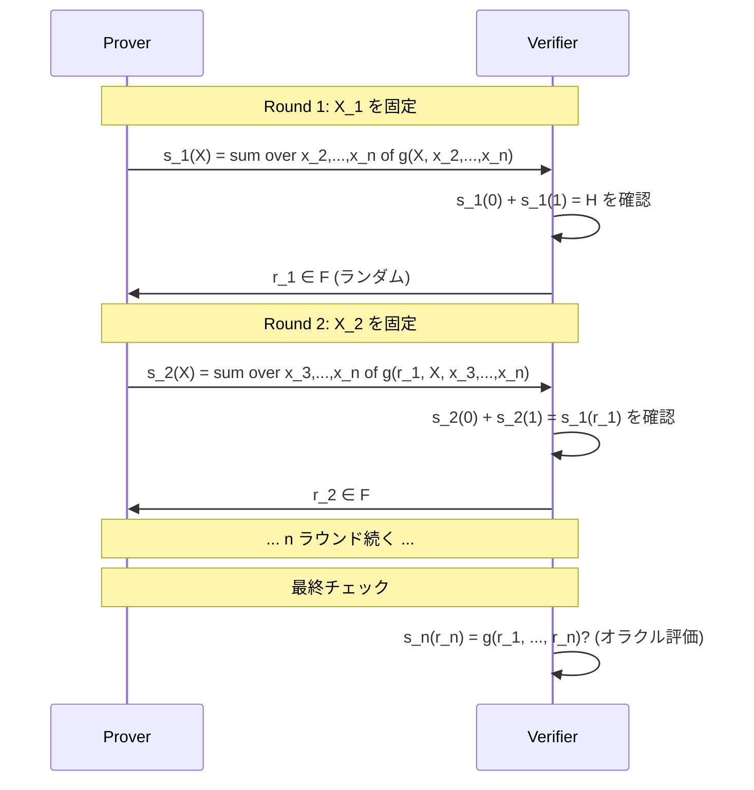

**日付**: 2026年4月22日
**学習内容**: **Sumcheck プロトコル**は「多変数多項式の **$2^n$ 項の総和** を **$n$ 回の対話で検証する**」インタラクティブプロトコルで、現代 ZKP の多くで使われる強力な道具。本記事では **(1) Sumcheck の目的**、**(2) プロトコルの厳密な記述**、**(3) 1 ラウンドごとの状態遷移の式展開**、**(4) 健全性の証明**、**(5) 多重線形拡張 (MLE) の定義と計算**、**(6) GKR プロトコル**、**(7) Spartan / HyperPlonk への応用** を追う。sumcheck は直感的だが、なぜ健全性が $d \cdot n / |\mathbb{F}|$ で済むかの厳密な議論は勘どころが多い。

## 0. 本記事の位置づけ

Article 12-13 で単変数多項式を扱う Poly-IOP + KZG を見た。一方で**多変数多項式**を扱うと、次のような魅力が出る:

- 回路を「多次元キューブ」として扱える
- FFT を使わなくても Prover が線形時間で動く (MLE 版)
- STARK / Spartan / HyperPlonk で活用

核となる道具が Sumcheck。これは次の等式を効率的に検証する:

$$
H = \sum_{x \in \{0,1\}^n} g(x_1, \ldots, x_n)
$$

$2^n$ 項の総和を、**$n$ 回の対話**で検証。

構成:

- **第1章**: Sumcheck の問題設定
- **第2章**: プロトコルの流れ
- **第3章**: 各ラウンドの式展開
- **第4章**: 健全性の証明
- **第5章**: 多重線形拡張 (MLE)
- **第6章**: GKR プロトコル
- **第7章**: Spartan / HyperPlonk 応用
- **第8章**: Q&A とまとめ

## 1. Sumcheck の問題設定

### 1.1 問題

Prover が多変数多項式 $g(X_1, \ldots, X_n)$ を持っている。ある値 $H$ について:

$$
H = \sum_{x_1 \in \{0,1\}} \sum_{x_2 \in \{0,1\}} \cdots \sum_{x_n \in \{0,1\}} g(x_1, x_2, \ldots, x_n)
$$

を主張する。Verifier は:

- $g$ の総次数 $d$ を知る
- $g(r_1, \ldots, r_n)$ をオラクル（または PCS）で評価可能
- $H$ を検証したい

素朴には $2^n$ 項すべて評価する必要があるが、Sumcheck は対話 **$n$ ラウンド** + **最後に1 回の $g$ 評価** で済む。

### 1.2 前提: Oracle access

Verifier は $g$ の点評価を 1 回だけ行える（最後に）。これは KZG のような PCS でコミットメントを開けて実現。

## 2. プロトコルの流れ

### 2.1 ラウンド構造

$n$ ラウンドで変数を 1 つずつ固定していく。

### 2.2 各ラウンドの内容

**Round $j$**:

- Prover が**1 変数多項式** $s_j(X)$ を送る:

$$
s_j(X) := \sum_{x_{j+1}, \ldots, x_n \in \{0,1\}} g(r_1, r_2, \ldots, r_{j-1}, X, x_{j+1}, \ldots, x_n)
$$

- Verifier が $s_j(0) + s_j(1) \stackrel{?}{=} c_{j-1}$ を確認（$c_{j-1}$ は前ラウンドの期待値）
- Verifier がランダム $r_j \in \mathbb{F}$ を送る
- $c_j := s_j(r_j)$ を次ラウンドの期待値とする

### 2.3 最終チェック

$n$ ラウンド後、Verifier は:

$$
c_n = s_n(r_n) \stackrel{?}{=} g(r_1, r_2, \ldots, r_n)
$$

を**オラクル 1 回**で確認する。

## 3. 各ラウンドの式展開

### 3.1 開始時の等式

$$
H = \sum_{x_1} \sum_{x_2, \ldots, x_n} g(x_1, x_2, \ldots, x_n)
$$

$s_1(X) := \sum_{x_2, \ldots, x_n} g(X, x_2, \ldots, x_n)$ と定義すると:

$$
H = \sum_{x_1 \in \{0,1\}} s_1(x_1) = s_1(0) + s_1(1)
$$

Verifier はこれを確認。次に $r_1$ を送って、問題を以下に縮小:

$$
s_1(r_1) = \sum_{x_2, \ldots, x_n} g(r_1, x_2, \ldots, x_n)
$$

### 3.2 ラウンド 2 以降

同じ論理で:

$$
s_1(r_1) = \sum_{x_2} s_2(x_2) = s_2(0) + s_2(1)
$$

ここで $s_2(X) := \sum_{x_3, \ldots, x_n} g(r_1, X, x_3, \ldots, x_n)$。

以下繰り返し。各ラウンドで「和の変数が1個減る」。

### 3.3 次数の管理

$g$ の各変数における次数を $d_i$ とすると、$s_j(X)$ の次数は $d_j$。**つまり Prover は係数 $d_j + 1$ 個を送れば $s_j$ を完全に記述できる**。

多重線形 ($d_i = 1$) の場合、$s_j$ は 1 次多項式 = 2 個の係数。超軽量。

### 3.4 Verifier の計算量

- 各ラウンド: $s_j(0) + s_j(1) = c_{j-1}$ の 1 加算、$s_j(r_j)$ の評価 $O(d_j)$
- 合計: $O(\sum d_j) + O(n)$
- 最後: $g(r_1, \ldots, r_n)$ を 1 回オラクル評価

### 3.5 Prover の計算量

各ラウンドで $2^{n-j}$ 項の和を計算 → 合計 $O(2^n)$ とナイーブには見えるが、**MLE** の場合は $O(2^n)$ のキャッシュ管理で全ラウンド合計 $O(2^n)$。

## 4. 健全性の証明

### 4.1 健全性誤差

**定理**: Sumcheck の健全性誤差は $\leq n \cdot d / |\mathbb{F}|$ ($d$ は $g$ の各変数次数の最大)。

### 4.2 証明

Prover が偽の $H' \neq H$ を通そうとするケースを考える。

**帰納法**: $n$ ラウンドの Sumcheck で偽を通せる確率 $\leq nd/|\mathbb{F}|$ を示す。

**Base case ($n = 0$)**: Sumcheck 不要、$H = g()$ の直接比較。偽なら確率 0 で受理。

**帰納ステップ**: $n$ ラウンド Sumcheck で Prover が $H' \neq H$ を通そうとする。

Prover は $s_1(X) = s_1^{\text{true}}(X)$ を送ると、$s_1(0) + s_1(1) = H \neq H'$ でバレる。したがって $s_1 \neq s_1^{\text{true}}$（偽の 1 次多項式）を送るしかない。

このとき $s_1 - s_1^{\text{true}}$ は非ゼロ次数 $d$ 以下の多項式。Verifier がランダム $r_1$ を引いて $s_1(r_1) = s_1^{\text{true}}(r_1)$ が成立する確率 $\leq d/|\mathbb{F}|$（Schwartz-Zippel）。

この確率を引かなければ、ラウンド 2 以降で Prover は別の偽主張 $c_1 \neq s_1^{\text{true}}(r_1)$ を通す必要があり、$(n-1)$ ラウンドの帰納法で $\leq (n-1) d/|\mathbb{F}|$。

合計: $d/|\mathbb{F}| + (n-1)d/|\mathbb{F}| = nd/|\mathbb{F}|$。$\square$

### 4.3 数値例

- $n = 20$（$2^{20} \approx 10^6$ 項）
- $d = 2$
- $|\mathbb{F}| = 2^{256}$

健全性誤差 $\leq 20 \cdot 2 / 2^{256} \approx 2^{-251}$。無視可能。

## 5. 多重線形拡張 (MLE)

### 5.1 MLE の定義

$f : \{0, 1\}^n \to \mathbb{F}$ という関数があるとき、これを**多項式** $\tilde f(X_1, \ldots, X_n)$ に拡張する:

- **条件**: 各変数の次数は $\leq 1$（「多重線形」）
- **境界条件**: $\tilde f(x) = f(x)$ for all $x \in \{0,1\}^n$

このような $\tilde f$ は**一意に存在**する。

### 5.2 明示的な式

ラグランジュ基底で書ける:

$$
\tilde f(X_1, \ldots, X_n) = \sum_{x \in \{0,1\}^n} f(x) \prod_{i=1}^{n} \chi_{x_i}(X_i)
$$

ここで $\chi_0(X) = 1 - X$、$\chi_1(X) = X$。

$$
\chi_{x_i}(X_i) = \begin{cases}
1 - X_i & (x_i = 0) \\
X_i & (x_i = 1)
\end{cases}
$$

### 5.3 例

$n = 2$、$f(0,0) = 1, f(0,1) = 2, f(1,0) = 3, f(1,1) = 5$ の場合。

$$
\tilde f(X_1, X_2) = 1 \cdot (1-X_1)(1-X_2) + 2 \cdot (1-X_1) X_2 + 3 \cdot X_1 (1-X_2) + 5 \cdot X_1 X_2
$$

展開:

$$
= 1 - X_1 - X_2 + X_1 X_2 + 2 X_2 - 2 X_1 X_2 + 3 X_1 - 3 X_1 X_2 + 5 X_1 X_2
$$

$$
= 1 + 2 X_1 + X_2 + X_1 X_2
$$

**検算**:
- $\tilde f(0,0) = 1$ ◯
- $\tilde f(0,1) = 1 + 0 + 1 + 0 = 2$ ◯
- $\tilde f(1,0) = 1 + 2 + 0 + 0 = 3$ ◯
- $\tilde f(1,1) = 1 + 2 + 1 + 1 = 5$ ◯

### 5.4 MLE の意義

$2^n$ 個の関数値を 1 つの多項式に封じる。ZKP では:

- 回路の witness を MLE にして、**任意のランダム点で評価**
- 対話型 Sumcheck で検証

### 5.5 MLE の評価計算

$\tilde f(r_1, \ldots, r_n)$ を計算するには $O(2^n)$ 時間（定義通り）。**これは Prover の主コスト**。大きな回路では $2^n \sim 10^6$ 程度。

## 6. GKR プロトコル

### 6.1 回路の階層構造

**GKR (Goldwasser-Kalai-Rothblum)** は、**層状の回路**を効率的に検証するプロトコル。

回路の各レイヤー $i$ に対して:

$$
W_i(\text{gate index}) = \text{そのゲートの出力値}
$$

を多重線形拡張 $\tilde W_i$ として扱う。

### 6.2 GKR の基本等式

レイヤー $i$ とレイヤー $i+1$ の関係:

$$
\tilde W_i(z) = \sum_{x, y \in \{0,1\}^*} \tilde{\text{add}}_i(z, x, y) (\tilde W_{i+1}(x) + \tilde W_{i+1}(y)) + \tilde{\text{mul}}_i(z, x, y) \tilde W_{i+1}(x) \tilde W_{i+1}(y)
$$

これを Sumcheck で検証していく。

### 6.3 メリット

- Verifier の計算量が回路のレイヤー数 $d$ に対して $O(d \log |C|)$
- Prover は線形時間 $O(|C|)$
- Trusted setup 不要

### 6.4 応用

- **Thaler の GKR**: より効率的な線形時間 Prover
- **Libra / Virgo**: zkVM、zkBridge
- **Avail (Polygon)**: データ可用性のための ZK

## 7. Spartan / HyperPlonk 応用

### 7.1 Spartan

Spartan は **R1CS 用の sumcheck ベース SNARK**。主なアイデア:

- R1CS 制約を MLE 化: $\tilde A(x, y), \tilde B(x, y), \tilde C(x, y), \tilde Z(x)$ (witness)
- 制約式を次のように書く:

$$
\sum_{y} \tilde A(x, y) \tilde Z(y) \cdot \sum_{y'} \tilde B(x, y') \tilde Z(y') = \sum_{y''} \tilde C(x, y'') \tilde Z(y'')
$$

- 両辺を Sumcheck で検証

### 7.2 HyperPlonk

PLONK の多変数版。**$n$ 変数 boolean hypercube $\{0,1\}^n$** で制約を管理。

- **FFT 不要**（従来 PLONK は FFT コストが大きい）
- **Prover が線形時間**
- 既存の Plonkish 回路をそのまま使える

### 7.3 現実的な採用

- **Spartan**: 研究用途、EVM 検証でも使われる
- **HyperPlonk**: Aztec や一部の L2 が採用検討
- **Lasso / Jolt**: 2024 年の大きな進展、zkVM で高速

## 8. Q&A

### Q1: Sumcheck は本当に対話型のみ？

**対話型が基本**。Fiat-Shamir でハッシュから $r_j$ を生成すれば非対話化できる。

### Q2: Prover のコストは本当に線形？

**MLE のレイアウトと注意深いアルゴリズム**で $O(2^n)$ 総計算。変数を 1 つずつ潰すので、キャッシュを上手く使えば無駄がない。

### Q3: GKR と通常の SNARK の違いは？

- GKR: **レイヤー型回路専用**、Prover 線形、Transparent
- SNARK (PLONK): **一般の回路**、Prover $O(n \log n)$ (FFT)、Trusted or Transparent

GKR は適切な構造の回路なら速い。

### Q4: MLE と単変数多項式、どちらが SNARK に向く？

- **MLE 長所**: Prover 線形、FFT 不要
- **単変数長所**: KZG と相性、証明サイズ小さい
- **用途で使い分け**。Mina は KZG、Spartan は MLE。

### Q5: Binius との関係は？

Binius は GF(2) 上の Sumcheck + MLE。**さらに計算が高速**（XOR/AND が効く）。2024 年以降注目の新アーキテクチャ。

### Q6: 実装で気をつける点は？

- Prover の各ラウンドで **表をスライス**していく実装（メモリ効率）
- Verifier 側の $r_j$ は **cryptographically random**（Fiat-Shamir）
- 最終 $g$ 評価は **PCS で 1 回**で済ませる

## 9. まとめ

### 本記事の要点

1. **Sumcheck** は $2^n$ 項総和を $n$ ラウンドで検証するプロトコル
2. **各ラウンド**で 1 変数を固定、Prover が 1 変数多項式 $s_j$ を送る
3. **健全性誤差** $\leq n \cdot d / |\mathbb{F}|$（Schwartz-Zippel ベース）
4. **MLE**: $\{0,1\}^n$ 上の関数を一意な多重線形多項式に拡張
5. **GKR**: 層状回路を Sumcheck で効率検証
6. **Spartan / HyperPlonk**: MLE + Sumcheck ベースの SNARK

### 次の記事（Article 15）へ

次の記事は **Groth16**、最も有名な SNARK の1つを詳細に。QAP + KZG 的な仕組みを組み合わせ、わずか **3 点の証明で任意の計算を証明** する驚異的な効率。

### 3行サマリ

- **Sumcheck = $2^n$ 総和を $n$ 対話で検証**、健全性は Schwartz-Zippel
- **MLE = boolean hypercube 上の関数を多重線形多項式に拡張**
- **GKR / Spartan / HyperPlonk** の心臓部、Prover が線形時間で動く

---

## 参考文献

- Carsten Lund, Lance Fortnow, Howard Karloff, Noam Nisan. *Algebraic Methods for Interactive Proof Systems.* FOCS 1990.
- Shafi Goldwasser, Yael Tauman Kalai, Guy Rothblum. *Delegating Computation: Interactive Proofs for Muggles.* STOC 2008.
- Justin Thaler. *Proofs, Arguments, and Zero-Knowledge.* Chapter 4.
- Srinath Setty. *Spartan: Efficient and general-purpose zkSNARKs.* CRYPTO 2020.
- Benedikt Bünz et al. *HyperPlonk: PLONK with Linear-Time Prover.* EUROCRYPT 2023.
- ZKP MOOC Lecture 4 (UC Berkeley, 2023).
