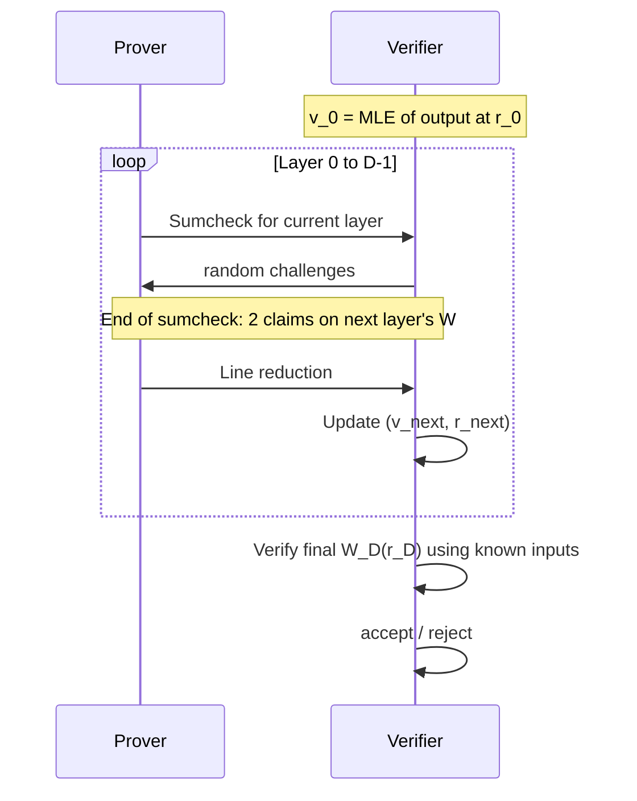
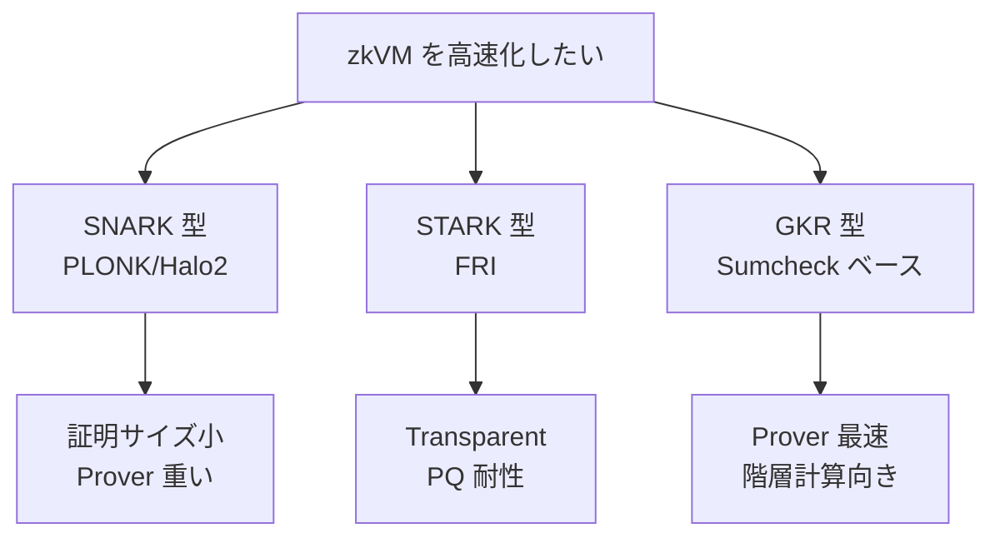

**日付**: 2026年4月23日
**学習内容**: **GKR (Goldwasser-Kalai-Rothblum)** プロトコルは2008年に提案された古典的対話型証明だが、2024〜2025年に **超高速 zkVM / zk-prover の中核**として劇的に復権した。Vitalik Buterin の2025年10月のブログ「Understanding GKR」は、この古典プロトコルが「**50台の GPU で Ethereum L1 の全実行を prove できる**」レベルの性能を叩き出していることを紹介している。本記事では **(1) GKR の基本的発想**、**(2) 階層回路と多重線形拡張 (MLE)**、**(3) GKR の数式展開: add/mul gate predicate**、**(4) Sumcheck との関係**、**(5) なぜ GKR が2025年に速いのか**、**(6) Jolt / Lasso / SP1 での採用**、**(7) GKR vs SNARK/STARK の使い分け** を追う。Article 14 の Sumcheck・MLE を前提知識とする。

## 0. 本記事の位置づけ

Article 14 で Sumcheck プロトコルと多重線形拡張 (MLE) を扱った。GKR はその Sumcheck を**繰り返し積み上げて階層回路全体を検証する**構造を持つ。

GKR は 2008 年の論文だが、長らく「理論的に面白いが実装は重い」とされてきた。しかし 2024〜2025 年に以下が揃って**復権**した:

- **Sumcheck の実装最適化**（GPU/FPGA 並列化）
- **小さな素数体** (Goldilocks, BabyBear, M31) との相性
- **Lookup argument との統合**（Lasso, Jolt）
- **LLM 推論の zk 化需要**（階層計算の典型）

Vitalik の 2025 年10月ブログが指摘する通り、GKR は今「**構造化された巨大計算を証明する**」際の第一選択肢になりつつある。

構成:

- **第1章**: GKR の問題設定
- **第2章**: 階層回路のモデル化
- **第3章**: MLE でゲートを表現
- **第4章**: GKR の中心等式と Sumcheck 連鎖
- **第5章**: 1レイヤーの具体展開
- **第6章**: なぜ2025年に速いのか
- **第7章**: Jolt / Lasso / SP1 / Ceno での採用
- **第8章**: GKR vs SNARK/STARK
- **第9章**: Q&A とまとめ

## 1. GKR の問題設定

### 1.1 「階層回路」を想定する

GKR が得意とする計算は **階層 (layered) 回路**:

- 入力: $n$ 個の要素 $\vec{w} = (w_0, \ldots, w_{n-1})$
- 層 $D$, $D-1$, $\ldots$, $1$, $0$ に並んだゲート群
- 各層は**同じ種類のゲート**（加算または乗算）の並び
- 層 $i$ の出力 $\tilde{W}_i$ は層 $i+1$ の入力から計算される

例: Poseidon ハッシュの permutation は `ARC → S-box → MixLayer` を 60 ラウンド積み重ねる、典型的な階層構造。

### 1.2 何を証明するか

Prover は以下を主張:

> **入力 $\vec{w}$ から回路を実行すると、出力 $\vec{y} = (y_0, \ldots, y_m)$ になる**

Verifier は入力・出力・回路構造を知り、**中間計算を一切再実行せずに**正当性を検証したい。

### 1.3 素朴な方法 vs GKR

| 方法 | Verifier 時間 | Prover 時間 | 通信量 |
|---|---|---|---|
| 素朴再実行 | $O(|C|)$ | $O(|C|)$ | $O(|C|)$ |
| SNARK (PLONK/Groth16) | $O(1)$ | $O(|C| \log |C|)$ | $O(1)$ |
| **GKR** | $O(D \cdot \log S + n)$ | $O(|C|)$ | $O(D \cdot \log S)$ |

$D$ は回路深さ、$S$ は各層の幅。Verifier は回路深さの対数オーダーで検証できる。**Prover は線形時間**で、SNARK より高速。

### 1.4 特徴

- **Trusted Setup 不要**（ハッシュベースで Transparent）
- **Prover が線形時間**（FFT 不要）
- **再帰と相性が良い**
- **対話型だが Fiat-Shamir で非対話化可能**

## 2. 階層回路のモデル化

### 2.1 記号

- 層 $i$ のゲート数を $S_i = 2^{s_i}$（2のべきに揃える）
- 層 $i$ のゲート $j$ の値を $W_i(j) \in \mathbb{F}$
- ゲート数を 2 進インデックスで扱うため、$j \in \{0, 1\}^{s_i}$ のブール立方体の頂点

### 2.2 層の値を MLE にする

Article 14 で学んだ多重線形拡張 (MLE):

$$
\tilde W_i(x_1, \ldots, x_{s_i}) = \sum_{z \in \{0,1\}^{s_i}} W_i(z) \prod_{k=1}^{s_i} \chi_{z_k}(x_k)
$$

ここで $\chi_0(x) = 1-x, \chi_1(x) = x$。

$\tilde W_i$ は**ブール立方体上で $W_i$ と一致**し、それ以外の点では多変数多項式として連続的に拡張される。

### 2.3 ゲート predicate

層 $i$ のゲート $z$ が、層 $i+1$ の 2 つのゲート $x, y$ から計算されるとする。

加算ゲート述語:

$$
\mathrm{add}_i(z, x, y) = \begin{cases} 1 & \text{ゲート } z \text{ が } x, y \text{ の加算} \\ 0 & \text{そうでない} \end{cases}
$$

乗算ゲート述語:

$$
\mathrm{mul}_i(z, x, y) = \begin{cases} 1 & \text{ゲート } z \text{ が } x, y \text{ の乗算} \\ 0 & \text{そうでない} \end{cases}
$$

これらも MLE で多変数多項式 $\widetilde{\mathrm{add}}_i, \widetilde{\mathrm{mul}}_i$ に拡張する。

**これらは回路構造のみに依存**（Prover/Verifier の両者が事前に知る）。

## 3. GKR の中心等式

### 3.1 層間の基本関係

層 $i$ の出力ゲート値 $W_i(z)$ は、層 $i+1$ の値から以下で計算される:

$$
W_i(z) = \sum_{x, y \in \{0,1\}^{s_{i+1}}} \big[ \mathrm{add}_i(z, x, y) \cdot (W_{i+1}(x) + W_{i+1}(y)) + \mathrm{mul}_i(z, x, y) \cdot W_{i+1}(x) W_{i+1}(y) \big]
$$

### 3.2 MLE 版の等式

MLE で書き直すと:

$$
\tilde W_i(z) = \sum_{x, y} \big[ \widetilde{\mathrm{add}}_i(z, x, y) (\tilde W_{i+1}(x) + \tilde W_{i+1}(y)) + \widetilde{\mathrm{mul}}_i(z, x, y) \tilde W_{i+1}(x) \tilde W_{i+1}(y) \big]
$$

$z$ がブール立方体上の頂点のときこれは元の等式と一致。任意の $z \in \mathbb{F}^{s_i}$ でも意味を持つ（MLE の連続拡張）。

### 3.3 Sumcheck を適用できる形

右辺は**$x, y$ に関する総和**の形をしている。これがまさに **Sumcheck が得意とする形**。

各層 $i$ で:

1. Verifier が「$\tilde W_i(r_i) = v_i$ を主張する」（$r_i$ はランダム点）
2. 右辺の総和を Sumcheck で検証
3. 最後に $\tilde W_{i+1}(r_{i+1}), \tilde W_{i+1}(r'_{i+1})$ の 2 値の主張に帰着
4. これを**層 $i+1$ の Sumcheck の入力**として再帰

### 3.4 2主張を1主張にまとめる (line reduction)

前段の Sumcheck で $\tilde W_{i+1}$ に関して2つの主張が出る。これを1つにまとめる技法:

$r_{i+1}$ と $r'_{i+1}$ を通る直線 $\ell(t)$ を考え、$g(t) := \tilde W_{i+1}(\ell(t))$ を多項式として扱う。

- $t = 0$ で $g(0) = \tilde W_{i+1}(r_{i+1})$
- $t = 1$ で $g(1) = \tilde W_{i+1}(r'_{i+1})$
- ランダムな $t^\ast$ での $g(t^\ast) = \tilde W_{i+1}(\ell(t^\ast))$ が、次の層の「1点での主張」となる

これにより**各層を Sumcheck 1回+1点reduction**で処理できる。

## 4. 1レイヤーの具体展開

最終層 $D$ から入力層へ向かって層ごとに Sumcheck を走らせる。

### 4.1 初期化

Verifier は出力 $\vec{y}$ を知っている。ランダム点 $r_0$ を選び:

$$
v_0 := \tilde W_0(r_0) = \sum_{z \in \{0,1\}^{s_0}} y_z \prod_k \chi_{z_k}(r_{0,k})
$$

を自分で計算（これは**入力依存のみで高速**）。

### 4.2 層 0 の Sumcheck

Prover が:

$$
v_0 \stackrel{?}{=} \sum_{x, y} \big[ \widetilde{\mathrm{add}}_0(r_0, x, y) (\tilde W_1(x) + \tilde W_1(y)) + \widetilde{\mathrm{mul}}_0(r_0, x, y) \tilde W_1(x) \tilde W_1(y) \big]
$$

を主張し、この右辺を Sumcheck で対話的に検証する。Article 14 の手順通り、各変数を1つずつ固定していく。

### 4.3 最終点での評価

Sumcheck が終わると、Verifier は以下を確認する必要:

- $\widetilde{\mathrm{add}}_0(r_0, r_x, r_y), \widetilde{\mathrm{mul}}_0(r_0, r_x, r_y)$ → **Verifier が自分で計算** (回路構造のみに依存)
- $\tilde W_1(r_x), \tilde W_1(r_y)$ → **未知**

この 2 つの未知を Prover が主張 → Line reduction で 1 点主張 $\tilde W_1(r_1) = v_1$ に集約。

### 4.4 再帰

$v_1, r_1$ を新しい入力として、層 1 の Sumcheck を実行。これを**層 $D$ まで $D$ 回繰り返す**。

### 4.5 終端

層 $D$ に達すると、**$\tilde W_D$ は入力のMLE**。Verifier は入力 $\vec{w}$ を知っているので、$\tilde W_D(r_D)$ を**自力で計算**して主張値と照合。合えば受理。

### 4.6 計算量

- **Verifier**: $O(D \cdot s_{\max})$ ここで $s_{\max} = \max \log S_i$（層の対数幅）
- **Prover**: $O(\sum_i S_i) = O(|C|)$（回路サイズに線形）
- **通信**: $O(D \cdot s_{\max})$

**Prover が線形時間**なのが他のSNARKに対する決定的優位。FFT なし。

## 5. なぜ2025年に速いのか

### 5.1 Sumcheck 自体の高速化

GKR の主コストは**各層の Sumcheck**。近年の最適化:

- **等差部分の事前計算**: 書き換えなしに $\tilde W$ の評価を $O(n)$ でキャッシュ
- **並列化**: 各ラウンドで変数固定を GPU に載せる
- **小素数体**: Goldilocks / BabyBear / Mersenne31 で 1 演算が数 ns

### 5.2 SNARK との「重さ」の違い

| ステージ | SNARK (PLONK) | GKR |
|---|---|---|
| コミットメント | 全 witness を KZG でコミット（重い） | 入力のみ（軽い） |
| Prover 主コスト | FFT + MSM | Sumcheck |
| Trusted Setup | 必要 (PLONK) / 不要 (STARK) | 不要 |

GKR は**コミット対象が小さい**ので、メモリ・時間ともに節約できる。

### 5.3 Gate predicate が回路固有で軽い

$\widetilde{\mathrm{add}}_i, \widetilde{\mathrm{mul}}_i$ は**回路構造のみ**から来るので、同じ回路を何度も証明する場合、Verifier 側の計算は**ほぼキャッシュ可能**。

### 5.4 Data parallel 計算で圧倒的に有利

同じ回路を $N$ 個の入力に並列適用する「**data parallel**」ケースでは:

- SNARK: $N$ 倍の重い処理
- GKR: $N$ を $\log$ 内に吸収、事実上 $N$ 回ほぼ無料

LLM推論、マークルツリー、Poseidon連鎖などはすべて data parallel。

### 5.5 ベンチマーク例

Vitalik のブログが引用する 2025 年の実装ベンチマーク:

- **Poseidon2 ハッシュ**: 消費者 GPU で 1M hashes/sec 超え
- **Ethereum L1 実行**: 50 GPU で mainnet 全ブロック prove 可能
- **LLM 推論**: 数十億パラメータモデルでも数時間内

これは **PLONK/Halo2 より一桁以上速い**ケースが多い。

## 6. Jolt / Lasso / SP1 / Ceno での採用

### 6.1 Jolt (a16z crypto, 2023)

**Jolt** = Just One Lookup Table。

- RISC-V zkVM
- **Lasso lookup argument** と GKR を組み合わせ
- 「巨大な lookup table に対する GKR」で全命令を処理
- 汎用プログラムを RISC-V バイナリとして prove

### 6.2 Lasso

Jolt の心臓部。**decomposable table** と Sumcheck (GKR 的構造) で、**$2^{128}$ サイズの仮想 lookup table** を実現。

### 6.3 SP1 (Succinct Labs, 2024)

- Plonky3 + GKR ハイブリッド
- プロダクション品質の RISC-V zkVM
- GKR を適用することで Prover 時間を大幅短縮

### 6.4 Ceno (2024-2025)

- **non-uniform GKR zkVM**
- 命令ごとに異なる小回路を用意 (Non-uniform IVC 的)
- **分岐ごとに最適化された GKR サブ回路**

### 6.5 実装選択の構図

## 7. GKR vs SNARK/STARK

### 7.1 使い分けの指針

| 用途 | 推奨 | 理由 |
|---|---|---|
| L1 検証コスト最小化 | SNARK (Groth16/PLONK) | 証明 200 B〜数KB |
| Transparent + PQ 耐性 | STARK (FRI) | ハッシュのみ |
| **巨大階層計算 / data parallel** | **GKR** | **Prover 線形、並列向き** |
| zkVM / zkML | GKR + 再帰 | 階層性と相性 |
| プライバシー決済 | SNARK + zk 化 | 証明サイズ重視 |

### 7.2 GKR の弱点

- **証明サイズが比較的大きい**（各層で Sumcheck のやり取りが残る）
- **L1 直接 verify は高コスト**（最終的に SNARK で再圧縮が必要）
- **非階層的な回路 (不規則な DAG)** には向かない

### 7.3 ハイブリッドが主流

現代の最先端は**GKR + SNARK のハイブリッド**:

1. 中心計算を GKR で高速 prove
2. GKR 証明を SNARK 内部で verify
3. L1 に送る最終証明は SNARK （小さい）

これで「Prover 速い + 証明小さい」の両取りができる。Jolt, SP1 はこの構造。

## 8. 実装上の注意点

### 8.1 Fiat-Shamir

全ラウンドのチャレンジはハッシュで生成（Article 17）。Transcript 管理が正確でないと**健全性が崩れる**。

### 8.2 Gate predicate の表現

$\widetilde{\mathrm{add}}_i, \widetilde{\mathrm{mul}}_i$ は回路ごとに異なる。**回路記述からこれを自動生成する**のが実装の肝。

### 8.3 Layer間での MLE の整合性

前層の 2 主張を Line reduction で 1 主張に集約する際、実装バグで 2 主張の関係を破ると健全性が崩れる。

### 8.4 小素数体との相性

GKR は小素数体で効率が上がるが、**セキュリティ確保のため拡大体 ($\mathbb{F}_{p^2}, \mathbb{F}_{p^4}$)** でチャレンジを取る。エントロピー確保が必要。

## 9. Q&A

### Q1: GKR と PLONK、どちらを選ぶべき？

計算の**構造**で決める。階層的で data parallel な計算なら GKR、汎用的な DAG なら PLONK。Jolt/SP1 のように**両方組み合わせる**ことも一般的。

### Q2: GKR の Verifier は本当に $O(\log)$？

回路深さ $D$ × 各層の $O(\log S)$ で合計 $O(D \log S)$。$D$ が回路サイズの多項式対数なら全体も対数。

### Q3: GKR は Post-Quantum？

ハッシュ関数と Sumcheck の健全性が PQ 耐性を持てば OK。Merkle tree と Poseidon の組み合わせは **PQ 安全**とみなせる。

### Q4: Sumcheck と GKR の違いは？

Sumcheck は「**1つの総和を検証するプリミティブ**」、GKR は「**Sumcheck を階層回路の各層で連鎖させる枠組み**」。GKR は Sumcheck の応用。

### Q5: Jolt と SP1 の違い？

- **Jolt**: lookup 中心、新しい数学アプローチ、研究寄り
- **SP1**: 実運用重視、Plonky3 ベース、コミュニティが大きい

2025 年時点で SP1 が商用採用で先行、Jolt は次世代候補。

### Q6: Ethereum L1 を 50 GPU で prove とは？

Vitalik が紹介するベンチマーク。Ethereum のブロック実行（約1500万gas）を 50 台の consumer GPU (e.g., RTX 4090) で数秒で prove 可能。GKR + 効率的な lookup で実現。従来の PLONK だと 500 台級 GPU が必要だった。

### Q7: 学習の順序は？

1. Sumcheck を完全理解 (Article 14)
2. MLE の計算を手で追う
3. GKR の gate predicate の感覚を掴む
4. Justin Thaler『Proofs, Arguments, and Zero-Knowledge』Chapter 4-5 を読む
5. a16z crypto の Jolt 論文を読む

## 10. まとめ

### 本記事の要点

1. **GKR** は階層回路を **Sumcheck の連鎖** で検証する 2008 年の古典プロトコル
2. 各層で `W_i(z) = Σ add(z,x,y)(W_{i+1}(x) + W_{i+1}(y)) + mul(z,x,y) W_{i+1}(x) W_{i+1}(y)` の関係を Sumcheck
3. **Prover が線形時間** $O(|C|)$、FFT 不要
4. **Verifier は $O(D \log S)$**、Transparent setup
5. **Data parallel 計算** で圧倒的に有利（LLM、ハッシュ連鎖）
6. **2024〜2025 年の復権**: Jolt, Lasso, SP1, Ceno が GKR を採用し、消費者 GPU 50 台で Ethereum L1 を prove
7. 証明サイズは大きめ → **最終的に SNARK で再圧縮するハイブリッド**が主流

### 次の記事（Article 16）へ

次の記事から**主要 SNARK プロトコル編**に入る。まずは **Groth16** — 2016 年に Jens Groth が提案した、**わずか 3 点（約 200 バイト）の最小サイズ証明**を実現する pairing-based SNARK。Zcash、Tornado Cash が採用した歴史的プロトコル。

### 3行サマリ

- **GKR = 階層回路を Sumcheck 連鎖で検証、Prover が線形時間の古典プロトコル**
- **2025年復権**: Jolt/Lasso/SP1/Ceno が採用、50 GPU で Ethereum L1 prove
- **構造化された巨大計算**（LLM、ハッシュ連鎖、RISC-V VM）の第一選択肢

---

## 参考文献

- Shafi Goldwasser, Yael Tauman Kalai, Guy Rothblum. *Delegating Computation: Interactive Proofs for Muggles.* STOC 2008.
- Justin Thaler. *Time-Optimal Interactive Proofs for Circuit Evaluation.* CRYPTO 2013.
- Vitalik Buterin. *Understanding GKR.* https://vitalik.eth.limo/general/2025/10/19/gkr.html, 2025.
- Arasu Arun, Srinath Setty, Justin Thaler. *Jolt: SNARKs for Virtual Machines via Lookups.* ePrint 2023/1217.
- Srinath Setty et al. *Customizable constraint systems for succinct arguments.* 2023.
- Succinct Labs. *SP1: A performant, general-purpose, open-source zkVM.* 2024.
- Justin Thaler. *Proofs, Arguments, and Zero-Knowledge.* Chapter 4, 2022.
