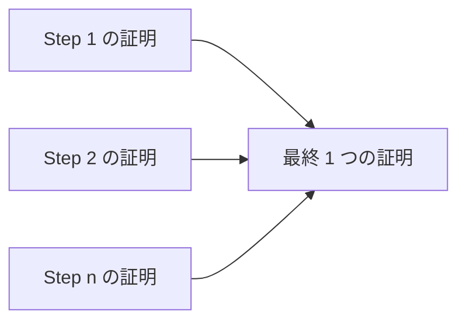

**日付**: 2026年4月22日
**学習内容**: **Recursive SNARK** は「SNARK の検証回路を別の SNARK の回路の中で走らせる」技術。これにより**無限に長い計算を固定サイズの証明に圧縮**でき、zkRollup や zkVM の基盤となる。2020 年以降の大きな革新が **Folding Scheme**（Nova, SuperNova, HyperNova）で、再帰コストを劇的に下げた。本記事では **(1) 再帰 SNARK の動機**、**(2) 素朴な再帰の問題**、**(3) 楕円曲線サイクル (Pallas/Vesta)**、**(4) Folding Scheme の発想**、**(5) Nova の relaxed R1CS**、**(6) SuperNova (複数命令)**、**(7) HyperNova / ProtoStar の発展**、**(8) zkRollup / IVC への応用** を扱う。

## 0. 本記事の位置づけ

これまでの記事で「1 つの計算の証明」を学んだ。しかし実用では以下の要求がある:

- **zkRollup**: 何千件ものトランザクションを 1 つの証明で
- **zkVM**: 100 万ステップのプログラム実行を 1 つの証明で
- **zkBridge**: 数年分のブロックチェーン履歴を 1 つの証明で

これらを**同じ回路で強引に**証明すると、Prover が膨大なメモリと時間を消費する。解決が **再帰 (recursion)** と **folding**。



構成:

- **第1章**: 再帰 SNARK の動機
- **第2章**: 素朴な再帰の問題
- **第3章**: 楕円曲線サイクル
- **第4章**: Folding の発想
- **第5章**: Nova の仕組み
- **第6章**: SuperNova / HyperNova
- **第7章**: zkRollup / IVC
- **第8章**: Q&A とまとめ

## 1. 再帰 SNARK の動機

### 1.1 IVC (Incremental Verifiable Computation)

計算を「ステップごとに分割」し、各ステップで**前ステップまでの証明を引き継いで更新**する。

$$
\text{step}_0 \to \text{step}_1 \to \text{step}_2 \to \ldots \to \text{step}_n
$$

各ステップで:

- 前ステップまでの証明 $\pi_{i-1}$
- 新しい状態遷移 $s_{i-1} \to s_i$
- 新しい証明 $\pi_i$（「$\pi_{i-1}$ が正しく、$s_{i-1} \to s_i$ が正しい」）

これが **IVC**。

### 1.2 実世界の例

**Ethereum のライトクライアント**:
- 1 年分のブロックチェーンヘッダの正当性を 1 つの証明で
- 毎ブロック、前の証明を取り込んで新しい証明を生成

**zkVM**:
- プログラムの各命令を 1 ステップ
- 100 万命令 = 100 万回の folding

**zkML**:
- ニューラルネットの各層を 1 ステップ
- 深層モデルでも一定サイズの証明

### 1.3 Proof Composition vs Folding

- **Proof Composition (古典的再帰)**: 前の SNARK を verify する回路を SNARK で証明
- **Folding (Nova 以降)**: 2 つのインスタンスを「畳み込んで」新しいインスタンスにする

Folding の方が桁違いに軽い。

## 2. 素朴な再帰の問題

### 2.1 素朴な構成

SNARK の Verify アルゴリズム $V$ を、**別の SNARK の回路 $C$** として実装:

$$
C_{\text{recursive}}(x_{\text{new}}, x_{\text{old}}, \pi_{\text{old}}) = \begin{cases}
1 & V(x_{\text{old}}, \pi_{\text{old}}) = 1 \text{ and 遷移が正しい} \\
0 & \text{その他}
\end{cases}
$$

Prover は $C_{\text{recursive}}$ に対して新しい証明 $\pi_{\text{new}}$ を作る。

### 2.2 問題1: 回路サイズ

Verify アルゴリズムは楕円曲線演算とペアリングを含む。これを算術回路で実装すると:

- KZG verify: ペアリング 1 回 = 数十万〜数百万制約
- **Prover コストが劇的に増える**

### 2.3 問題2: 楕円曲線の不整合

SNARK は特定の楕円曲線（scalar field $\mathbb{F}_r$）上で動く。Verify 回路内部では「曲線点を表す座標 ($\mathbb{F}_p$ 要素)」を扱う必要。$\mathbb{F}_r \neq \mathbb{F}_p$ のため、**回路が巨大化**。

### 2.4 解決策

- **楕円曲線サイクル (Pallas/Vesta)**: 2 つの曲線を交互に使う
- **Folding Scheme**: 再帰コストを $O(1)$ に

## 3. 楕円曲線サイクル

### 3.1 2-Cycle of Curves

**Pallas** と **Vesta** という 2 つの曲線:

- Pallas: 基底体 $\mathbb{F}_p$、scalar field $\mathbb{F}_q$
- Vesta: 基底体 $\mathbb{F}_q$、scalar field $\mathbb{F}_p$
- **$|E_{\text{Pallas}}(\mathbb{F}_p)| = q$ かつ $|E_{\text{Vesta}}(\mathbb{F}_q)| = p$**

2 つの曲線が「互いに相手の scalar field を自分の基底体にする」関係。

### 3.2 なぜ嬉しいか

Pallas 上の SNARK の Verify には Pallas の曲線演算が必要。Verify 回路の基底体は $\mathbb{F}_q$（Pallas の scalar field）。これは Vesta の基底体に一致。

したがって:

- Pallas 上で証明 → Vesta の回路で verify
- Vesta 上で証明 → Pallas の回路で verify
- 両曲線を**交互に使う**と再帰がスムーズ

### 3.3 Pasta (Pallas + Vesta)

Zcash が設計、Mina や Halo2 で採用。近年の再帰 SNARK の多くが Pasta を利用。

### 3.4 BN254 / Grumpkin (Aztec)

Aztec も独自のサイクル曲線 Grumpkin を使用。同様の仕組み。

## 4. Folding の発想

### 4.1 Kothapalli-Setty-Tzialla (2021)

Nova の原論文。革命的発想:

> **「2 つの R1CS インスタンスを代数的に畳み込んで 1 つにする」**

各ステップで「1 つの小さな instance」を「これまでの累積 instance」に折り畳む。**完成した累積 instance だけ SNARK で証明すればよい**。

### 4.2 Relaxed R1CS

通常の R1CS:

$$
(A \vec{w}) \odot (B \vec{w}) = C \vec{w}
$$

Relaxed R1CS:

$$
(A \vec{w}) \odot (B \vec{w}) = u \cdot C \vec{w} + \vec{E}
$$

- $u$: スカラー（normalized form で 1）
- $\vec{E}$: エラーベクトル（normalized form で 0）

通常の R1CS は $u = 1, \vec{E} = 0$ の特殊形。

### 4.3 Folding の手順

2 つの Relaxed R1CS インスタンス $(\vec{w}_1, u_1, \vec{E}_1)$ と $(\vec{w}_2, u_2, \vec{E}_2)$ を折り畳む:

1. ランダムチャレンジ $r$ を生成
2. **新しい witness**: $\vec{w}' = \vec{w}_1 + r \vec{w}_2$
3. **新しい $u$**: $u' = u_1 + r u_2$
4. **新しい $\vec{E}$**: $\vec{E}' = \vec{E}_1 + r \vec{T} + r^2 \vec{E}_2$

ここで $\vec{T}$ は「cross term」で、両インスタンスの積項から来る。

### 4.4 なぜ folding が成立するか

R1CS 等式の両辺を $r$ でスケール:

$$
(A \vec{w}_1 + r A \vec{w}_2) \odot (B \vec{w}_1 + r B \vec{w}_2) = (u_1 + r u_2)(C \vec{w}_1 + r C \vec{w}_2) + \text{(cross)}
$$

左辺展開:

$$
A\vec{w}_1 \odot B\vec{w}_1 + r(A\vec{w}_1 \odot B\vec{w}_2 + A\vec{w}_2 \odot B\vec{w}_1) + r^2 A\vec{w}_2 \odot B\vec{w}_2
$$

対応する右辺項と比較し、適切に $\vec{E}'$ を定義すれば relaxed R1CS が成立。

### 4.5 Folding Verify の軽さ

Folding ステップの検証は**楕円曲線点の線形結合のみ**。通常の SNARK verify の**ペアリングや MSM を使わない** → 回路が劇的に小さい。

## 5. Nova の仕組み

### 5.1 アーキテクチャ

```mermaid
flowchart LR
    Init[初期状態]
    Fold1[Fold step 1]
    Fold2[Fold step 2]
    FoldN[Fold step n]
    Final[最終SNARK]
    
    Init --> Fold1
    Fold1 --> Fold2
    Fold2 -. ... .-> FoldN
    FoldN --> Final
```

- 各 fold step は小さな「increment circuit」
- 最後に 1 回だけ通常の SNARK で Folded インスタンスを証明

### 5.2 インクリメント回路

各ステップの増分回路 $F$ は:

- 前の状態 $z_{i-1}$
- 新しい遷移 $F(z_{i-1}) = z_i$
- Folding verifier の1ステップ

これが入った R1CS。Verifier 回路は小さい（Nova で数千制約）。

### 5.3 Relaxed → 通常 R1CS への zero-knowledgefiable SNARK

最後のステップで、累積された Relaxed R1CS を通常の SNARK (Groth16 や PLONK) で証明:

1. Relaxed R1CS → 通常 R1CS に変換
2. 通常 SNARK の Prover を走らせる

これで最終証明は普通の SNARK と同サイズ。

### 5.4 性能

- **Prover step time**: 2ms/step (小さな回路なら)
- **Total proving for 1M steps**: 数分
- **Final proof size**: 通常 SNARK 相当（数KB）

### 5.5 限定事項

- Nova はサイクル曲線 (Pallas/Vesta) 前提
- **Non-uniform IVC** (多命令 zkVM) は Nova だけでは非効率 → SuperNova

## 6. SuperNova / HyperNova

### 6.1 SuperNova (2022)

**複数の instruction** を扱える folding。

- Instruction set $\{f_1, f_2, \ldots, f_k\}$
- 各ステップで 1 命令 $f_{j_i}$ を実行
- 1 ラウンドで実行された命令の回路だけを folding

### 6.2 zkVM への応用

- 各 opcode (ADD, MUL, JUMP, ...) を別の関数に
- CPU の 1 サイクル = 1 fold step
- 100 万命令のプログラムを 100 万 fold で処理

### 6.3 HyperNova (2023)

Sumcheck ベースの folding。MLE とサムチェックで高速化。

- MLE を使うことで**並列化**しやすい
- さらに軽い fold step

### 6.4 ProtoStar (2023)

CCS (Customizable Constraint System、R1CS + Plonkish の一般化) 上の folding。

### 6.5 比較

| Scheme | 発想 | 適用 |
|---|---|---|
| **Nova** | Relaxed R1CS | 単一関数 IVC |
| **SuperNova** | Non-uniform IVC | zkVM |
| **HyperNova** | Sumcheck + MLE | 高速化 |
| **ProtoStar** | Plonkish folding | 汎用 |

## 7. zkRollup / IVC への応用

### 7.1 zkRollup での Folding

トランザクション$t_1, t_2, \ldots, t_n$ を 1 つずつ folding:

```
State_0 → [t_1] → State_1 → [t_2] → State_2 → ... → State_n
```

最終 State の SNARK 証明を L1 に送信。各 fold は小さいので、Prover は連続的にバッチ処理可能。

### 7.2 zkEVM での Folding

zkEVM は各 opcode を fold step にする。**100 万トランザクション**の実行を Prover が継続的に folding → ブロック生成時に累積 instance を SNARK 化。

### 7.3 Proof-of-Innocence (AZTEC)

Aztec の new proof-of-innocence は、**過去 N ブロック**のプライベートトランザクション履歴から「自分は汚染された資金に触れていない」を証明。Nova/HyperNova ベースで動く。

### 7.4 Lightclient bridge (zkBridge)

受信チェーンが送信チェーンの何千ブロックものヘッダを一気に検証する。各ブロックヘッダを fold step にする。

## 8. Q&A

### Q1: Folding は SNARK と何が違う？

**Folding 自体は「主張を圧縮する手続き」**。最終的に通常 SNARK が 1 回走るが、各 fold step は極めて軽い。**SNARK = proof の完成、folding = proof の途中圧縮**。

### Q2: Folding の健全性は？

2 つの instance を folding するとき、ランダム $r$ を使うので Schwartz-Zippel で確率 $\leq$ 次数 / $|\mathbb{F}|$ で安全。

### Q3: Nova の実装はある？

- **microsoft/nova** (Rust): Microsoft の実装
- **espressosystems/hyperplonk**: HyperNova ベース
- **arecibo**: 最適化されたフォーク

### Q4: Folding は Transparent？

Nova はサイクル曲線 (Pasta) を使うが、Trusted Setup は不要。**Transparent**。

### Q5: 量子耐性は？

Nova は離散対数ベースなので、**量子には弱い**。PQ 耐性のある folding は研究中。Binius-based folding などが候補。

### Q6: IVC と PCD の違いは？

- **IVC (Incremental Verifiable Computation)**: 1 本の計算列
- **PCD (Proof-Carrying Data)**: 木構造、複数の入力を 1 つに集約

PCD は分散計算（複数ノードで並列）、IVC は順序のある計算列。

## 9. まとめ

### 本記事の要点

1. **Recursive SNARK** は SNARK の verify を SNARK の中に入れる
2. 素朴な再帰はコスト大（ペアリングなど）
3. **楕円曲線サイクル (Pallas/Vesta)** で非整合を解消
4. **Nova Folding**: Relaxed R1CS を使った軽量な代替
5. Folding step は数千制約だけ（SNARK verify より桁違いに軽い）
6. **SuperNova, HyperNova, ProtoStar** で非一様計算に拡張
7. **IVC / zkRollup / zkVM / zkBridge** の基盤技術

### 次の記事（Article 20）へ

次の記事は、ここまで登場した**Proof Gadgets** を総まとめ。ZeroTest, ProdCheck, Permutation Check, Prescribed Permutation Check, Lookup, Range Check など、SNARK の構成要素を一覧化する。

### 3行サマリ

- **再帰 SNARK = SNARK の verify を SNARK で証明**、無限計算を圧縮
- **Nova Folding**: Relaxed R1CS と楕円曲線サイクルで軽量再帰
- **IVC / zkRollup / zkVM の基盤技術**、2020 年以降の最重要進歩

---

## 参考文献

- Abhiram Kothapalli, Srinath Setty, Ioanna Tzialla. *Nova: Recursive Zero-Knowledge Arguments from Folding Schemes.* CRYPTO 2022.
- Srinath Setty, Justin Thaler, Riad Wahby. *Unlocking the lookup singularity with Lasso.* ePrint 2023/1216.
- Benedikt Bünz, Binyi Chen. *ProtoStar: Generic Efficient Accumulation/Folding for Special-sound Protocols.* ASIACRYPT 2023.
- Abhiram Kothapalli, Srinath Setty. *HyperNova: Recursive Arguments for Customizable Constraint Systems.* CRYPTO 2024.
- ZKP MOOC Lecture 10 (UC Berkeley, 2023).
