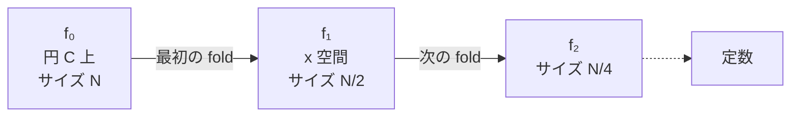

**日付**: 2026年4月23日
**学習内容**: **Circle STARKs** (Haböck, Levit, Papini 2024) は、**Mersenne31 素数体** $p = 2^{31} - 1$ 上で FRI を効率的に走らせるための画期的な特殊化。Article 22/23 で学んだ通り、FRI は「$p - 1$ が $2$ の大きなべき乗で割れる」ことに依存するが、Mersenne31 は $p - 1 = 2 \cdot (2^{30} - 1)$ で $2$ の因子が 1 つしかなく通常 FRI が動かない。Circle STARKs は「**円群 $x^2 + y^2 = 1$**」という代わりの群を使い、Mersenne31 で高速STARKを実現する。Starkware は M3 MacBook で **62万 Poseidon2 ハッシュ/秒** を記録。本記事では **(1) Mersenne31 の魅力と障壁**、**(2) 円群の構造**、**(3) Circle FRI の folding**、**(4) Riemann-Roch 空間と 2 点除算**、**(5) 消滅多項式の再帰定義**、**(6) 実装との対応**、**(7) Binius との比較** を追う。

## 0. 本記事の位置づけ

Article 23 で FRI を学んだ。その健全性と効率は以下 2 点に依存:

1. **評価ドメインが2のべき乗サイズ**: 半減を $\log$ 回繰り返すため
2. **小さな素数体で高速計算**: CPU/GPU で1操作が数ns

(2) のためには $p = 2^{31} - 1$ (Mersenne31) や $p = 2^{31} - 2^{27} + 1$ (BabyBear) のような**31-bit 素数**が望ましい。特に Mersenne31 は:

- **$p = 2^{31} - 1$ が完全に特殊な形**で、reduction が `x + (x >> 31)` の 1 命令で済む
- 通常の 32-bit CPU レジスタに完全に収まる

しかし問題: $p - 1 = 2 \cdot (2^{30} - 1)$ で **$2$ の因子が 1 つしかない**。長さ 2 以上の FFT ができない → 通常 FRI が動かない。

Circle STARKs はこの Mersenne31 限定の問題を**円群**で解決する。

構成:

- **第1章**: 小さな素数体の魅力
- **第2章**: Mersenne31 の障壁
- **第3章**: 円群の導入
- **第4章**: 2-to-1 doubling map
- **第5章**: Circle FRI の folding
- **第6章**: Riemann-Roch 空間と 2 点除算
- **第7章**: 消滅多項式の再帰定義
- **第8章**: 実装と性能
- **第9章**: Binius との比較
- **第10章**: Q&A とまとめ

## 1. 小さな素数体の魅力

### 1.1 なぜ Mersenne31 を使いたいか

ZKP の prove 時間の多くは**フィールド演算**で消費される。

- BN254 スカラー体 (254 bit) で 1 乗算 ≈ 100 ns
- Mersenne31 (31 bit) で 1 乗算 ≈ 3 ns

**30 倍以上の差**。フィールド演算が1兆回程度発生する大規模 prove では、この差が勝負を決める。

### 1.2 Mersenne31 の reduction トリック

$p = 2^{31} - 1$ なので、$2^{31} \equiv 1 \pmod p$。したがって任意の 62-bit 整数 $x$ を $\bmod p$ するには:

$$
x = x_{\text{hi}} \cdot 2^{31} + x_{\text{lo}} \equiv x_{\text{hi}} + x_{\text{lo}} \pmod p
$$

CPU 命令で `(x >> 31) + (x & ((1<<31) - 1))` の1サイクル。**モジュロ演算がほぼ無料**。

### 1.3 類似素数との比較

| 素数 | ビット数 | $p-1$ の因子2 | FFT 可能性 |
|---|---|---|---|
| **Mersenne31** $2^{31} - 1$ | 31 | $2^1$ のみ | 通常 FRI 不可 |
| **BabyBear** $2^{31} - 2^{27} + 1$ | 31 | $2^{27}$ | $2^{27}$ まで FFT OK |
| **Goldilocks** $2^{64} - 2^{32} + 1$ | 64 | $2^{32}$ | $2^{32}$ まで FFT OK |
| **BN254** Scalar field | 254 | $2^{28}$ | OK だが遅い |

Mersenne31 は reduction 最速だが FFT 不可。BabyBear は妥協案 (reduction 少し遅いが FFT 可)。

## 2. Mersenne31 の障壁

### 2.1 通常 FRI の前提

通常 FRI は:

- 評価ドメイン $L = \{1, \omega, \omega^2, \ldots, \omega^{N-1}\}$（$N$ 乗根）
- $x \mapsto x^2$ という 2-to-1 map で $\log N$ 回 folding

これには **$\mathbb{F}_p$ に $N$ 乗根が存在**する必要。乗法群 $\mathbb{F}_p^\ast$ のサイズが $p - 1$ なので、$N | p - 1$。

### 2.2 Mersenne31 での障害

Mersenne31: $p - 1 = 2 \cdot (2^{30} - 1)$。$2^{30} - 1$ は**奇数**。

したがって:
- $N = 2$ の乗根は OK
- $N = 4, 8, 16, \ldots$ は**存在しない**

→ **通常 FRI の folding が動かない**。

### 2.3 拡大体を使う案

$\mathbb{F}_{p^2}$ なら $p^2 - 1 = (p-1)(p+1)$ で $(p+1) = 2 \cdot 2^{30} = 2^{31}$ の要素を含む。

- Pros: 従来 FRI がそのまま動く
- Cons: 演算が複雑化して、せっかくの Mersenne31 の軽さが半減する

Circle STARKs は**拡大体を使わずに**解決する。

## 3. 円群の導入

### 3.1 円群 $C$ の定義

$\mathbb{F}_p$ 上の**円 (circle)**:

$$
C = \{(x, y) \in \mathbb{F}_p^2 : x^2 + y^2 = 1\}
$$

これは**加法群**の構造を持つ。点の「加算」は幾何学的な**円上の角度の足し算**に対応。

### 3.2 円群の位数

$|C| = p + 1$。

これがキモ。Mersenne31 では:

$$
|C| = p + 1 = 2^{31}
$$

**$2^{31}$ という完璧な 2 のべき乗!** FFT / FRI に必要な「大量の 2 の因子」が得られる。

### 3.3 円群の演算

点 $(x_1, y_1), (x_2, y_2) \in C$ の和:

$$
(x_1, y_1) + (x_2, y_2) = (x_1 x_2 - y_1 y_2, x_1 y_2 + y_1 x_2)
$$

これは**複素数の乗算**と同じ構造（$x + iy$ と見立てて乗算、$i^2 = -1$）。実際、$\mathbb{F}_p(i)$ の単位円は位数 $p + 1$ の巡回部分群。

### 3.4 Doubling (2倍算) の公式

$P = (x, y)$ の2倍 $2P$:

$$
2P = (x^2 - y^2, 2xy) = (2x^2 - 1, 2xy)
$$

最後の等式は $x^2 + y^2 = 1$ より $y^2 = 1 - x^2$ なので $x^2 - y^2 = 2x^2 - 1$。

**$2P$ の $x$ 座標だけ** 見ると:

$$
x_{2P} = 2x_P^2 - 1
$$

これが後の folding map になる。

## 4. 2-to-1 doubling map

### 4.1 $x$ 座標に注目

円群の各点 $P = (x, y)$ に対して、$-P = (x, -y)$ も円上にある（$x^2 + (-y)^2 = 1$）。

$P$ と $-P$ は**同じ $x$ 座標**を持つ。したがって map:

$$
\pi_x: C \to \mathbb{F}_p, \quad (x, y) \mapsto x
$$

は **2-to-1** (無限遠等の特殊点を除く)。

### 4.2 Doubling が $x$ の関数

$2P$ の $x$ 座標は $2P = (2x^2 - 1, 2xy)$ なので:

$$
x_{2P} = 2 x_P^2 - 1
$$

これは **$x$ 座標だけで計算可能**。$y$ 座標は不要。

### 4.3 Folding map の定義

Circle FRI では**$x$ 座標空間での folding**を使う:

$$
\phi(x) = 2x^2 - 1
$$

これが通常 FRI における $x \mapsto x^2$ の代替。

### 4.4 Domain が半減する

$\phi$ は 2-to-1 なので、適用するたびにドメインサイズが半減:

- 元ドメイン $D_0 \subset C$: サイズ $N$
- $\phi$ 後 $D_1 = \phi(D_0)$: サイズ $N/2$
- ...
- $\log N$ 回で 1 要素

**まさに FRI が必要とする構造**。

## 5. Circle FRI の folding

### 5.1 多項式の分解

関数 $f : C \to \mathbb{F}_p$ を $x, y$ 両方を使って表す:

$$
f(x, y) = f_0(x) + y \cdot f_1(x)
$$

$f_0, f_1$ は $x$ のみの関数。

これは通常 FRI の「偶奇分解」$f(X) = f_e(X^2) + X f_o(X^2)$ の類比。

### 5.2 $-P$ での評価

$P = (x, y), -P = (x, -y)$:

$$
f(P) = f_0(x) + y f_1(x)
$$

$$
f(-P) = f_0(x) - y f_1(x)
$$

和・差で分離:

$$
f_0(x) = \frac{f(P) + f(-P)}{2}
$$

$$
y \cdot f_1(x) = \frac{f(P) - f(-P)}{2}
$$

### 5.3 Random Folding

ランダムチャレンジ $\alpha$ を使って新しい関数 $g$ を定義:

$$
g(\phi(x)) = f_0(x) + \alpha \cdot f_1(x)
$$

これで**次数が半分になった新しい関数**を得る。ドメインも $\phi(D)$ で半分。

### 5.4 繰り返して $\log N$ 回

通常 FRI と同じく**$\log N$ ラウンド**で定数まで縮める:

最初の fold だけ円 → $x$ 空間で、それ以降は $x$ 空間内で $\phi$ による fold。

### 5.5 各ラウンドの通信量

通常 FRI と同じで、1 ラウンドに:

- コミットメント (Merkle root)
- チャレンジ $\alpha$
- クエリ応答 (Merkle proof)

合計 $O(\log^2 N)$。

## 6. Riemann-Roch 空間と 2 点除算

### 6.1 多項式の取り扱い

円 $C$ 上の多項式は $\mathbb{F}_p[x, y]/(x^2 + y^2 - 1)$ という **Riemann-Roch 空間** (2変数多項式を $x^2 + y^2 - 1$ で割った剰余) に属する。

- 通常の多項式: 次数 $d$ の係数で $d+1$ 次元
- 円上の多項式: **$2d$ 次元** (余分に $y$ があるため)

### 6.2 実装上のシンプル化

この数学的精度は**実装では隠される**ことが多い。実装では:

- 関数を**評価点の値の配列**として保持
- 係数表現に戻る必要がない限り計算

### 6.3 単一点除算ができない

通常 FRI では「$f(z) = v$ を示す」のに $q(X) = \frac{f(X) - v}{X - z}$ という**1 点での quotient** を使う。

円上ではこれができない。**円上には「1 点でのみゼロ」となる多項式が存在しない** (1 点しかゼロでない多項式はこの Riemann-Roch 空間には入らない)。

### 6.4 2 点除算

代わりに **2 点同時に評価**する必要。点 $P = (p_x, p_y)$ と別の点 $Q = (q_x, q_y)$ で評価し、quotient を作る:

$$
q(x, y) = \frac{f(x, y) - (\text{P, Q 間の線形補間})}{(\text{P, Q で同時にゼロな円上多項式})}
$$

実装は複雑だが、数学的には整合する。

### 6.5 健全性への影響

2 点除算が必要なため、Verifier のクエリも**常にペアで**行う。これは通常 FRI とわずかに異なるが、全体の健全性誤差は同程度。

## 7. 消滅多項式の再帰定義

### 7.1 通常 FRI の消滅多項式

通常: $Z_H(X) = X^N - 1$ が単位根集合 $H$ 上でゼロ。

### 7.2 Circle STARKs の消滅多項式

Circle 上の消滅多項式は**再帰的**に定義:

$$
Z_1(x, y) = y, \quad Z_2(x, y) = x
$$

$$
Z_{n+1}(x, y) = 2 \cdot Z_n(x, y)^2 - 1
$$

この再帰は**folding map $\phi(x) = 2x^2 - 1$** を反映している。

### 7.3 ゼロ集合

$Z_n$ は「$n$ 段 folding で最終的に $y$ 軸または $x$ 軸上の点になる」点集合上でゼロ。

これがドメイン $D_0$ の構造そのもの。

### 7.4 AIR 制約との関係

通常の STARK では AIR 制約を:

$$
C(X) = Z_H(X) \cdot T(X)
$$

の形で検証。Circle STARKs でも:

$$
C(x, y) = Z_n(x, y) \cdot T(x, y)
$$

の形で検証する (2 変数化)。

## 8. 実装と性能

### 8.1 Bit-reverse ordering の調整

通常 FRI では評価値を **bit-reverse 順序**で Merkle ツリーに格納し、folding 時の隣接性を確保。

Circle STARKs では「**最下位ビットを除く全ビットを reverse**」する。これで folding 時に $P, -P$ が隣接して配置される → Merkle proof が効率化。

### 8.2 評価ドメインの生成

Mersenne31 で $2^{31}$ 要素の円群を使う。実際には大きすぎるので、部分群:

- $|D_0| = 2^{20}$ 程度（100 万要素）
- 次数 $2^{19}$ の多項式に対応
- ブローアップ $\rho = 1/2$

### 8.3 ベンチマーク

Starkware の Stwo (2024) 実装:

- **M3 MacBook Pro (Apple Silicon)**: 620,000 Poseidon2 hashes/sec
- GPU (RTX 4090): 数百万 hashes/sec
- 100 万 Poseidon の proof 生成: 数秒オーダー

これは現時点で**世界最速の部類**。

### 8.4 Stwo プロジェクト

**Stwo = STARKware + M31**。Starkware が開発中の Circle STARK 実装。

- Rust ベース
- オープンソース (Apache 2.0)
- StarkNet の新世代 prover として 2025 年に本格投入予定

### 8.5 Plonky3 との統合

**Plonky3** (Polygon Zero) も Circle STARKs をサポート。field-agnostic 設計なので Mersenne31 / BabyBear / Goldilocks を切り替え可能。

## 9. Binius との比較

### 9.1 Binius とは

**Binius** (Ulvetanna, 2024) は **GF(2^k)** (バイナリ拡大体) を使う STARK。

- XOR / AND 演算のみ → CPU/GPU で圧倒的に高速
- Mersenne31 よりさらに軽い
- Tower field 構造

### 9.2 Circle STARKs vs Binius

| 項目 | Circle STARKs | Binius |
|---|---|---|
| フィールド | Mersenne31 | $GF(2^{128})$ |
| 基本演算 | 31-bit 加算・乗算 | XOR・AND |
| 成熟度 | 高 (Stwo 進行中) | 中 (研究寄り) |
| Prover 速度 | 超高速 | さらに高速 (理論) |
| 表現力 | 高 | やや特殊 (ビット演算向き) |
| Lookup argument | 既存と同様 | 新しい工夫が必要 |

### 9.3 使い分け

- **既存の回路記述をそのまま高速化**: Circle STARKs (arithmetization が Plonkish と互換)
- **ビット演算が大半の計算** (ハッシュ、ビット操作): Binius
- **2025 年の実用**: Circle STARKs が先行
- **将来**: Binius がさらに伸びる可能性

### 9.4 両者の関係

Binius と Circle STARKs は**独立の発展**で、どちらが勝つかはまだ決着していない。Vitalik のブログでは「**Circle STARKs は Binius への stepping stone**」と位置づけている。

## 10. Q&A

### Q1: Circle STARKs は既存の STARK ライブラリを書き直す必要？

**数学基盤が大きく異なる**ので、FRI 実装は新規が必要。ただし高レベル API (AIR 定義、trace 構築) は既存と大差ない。Stwo、Plonky3 ではこのレイヤー分離が徹底されている。

### Q2: BabyBear と Circle STARKs、どちらが速い？

**Mersenne31 (Circle STARKs) の方が高速**。Reduction が 1 CPU サイクルで済み、ドメインサイズ $2^{31}$ まで取れる。BabyBear は reduction が数サイクル、$2^{27}$ まで。

### Q3: 学術的に読むべき論文は？

- **Haböck, Levit, Papini (2024)**: "Circle STARKs" ePrint 2024/278
- **Ulrich Haböck et al.**: Stwo 実装ノート
- Vitalik Buterin のブログ (2024/07/23)

### Q4: Circle STARKs は Ethereum L1 で使える？

直接は使えない (PQ 署名 precompile がない)。しかし**証明を PLONK/Groth16 に圧縮すれば L1 で verify 可能**。典型的な recursive flow。

### Q5: Mersenne31 以外の Mersenne 素数で使える？

理論的には Mersenne 素数 (= $2^k - 1$ 形) なら $p + 1 = 2^k$ が 2 のべきで有効。しかし:
- $2^{13} - 1 = 8191$: サイズ不足
- $2^{17} - 1$: 小さい
- $2^{31} - 1$: スイートスポット
- $2^{61} - 1$: 次の候補だが 64-bit で reduction 効率が落ちる

現状 $2^{31} - 1$ が圧倒的に採用されている。

### Q6: 実装の難易度は？

高い。Circle geometry + Riemann-Roch の理解が必要。**自前実装はお勧めしない**、Stwo や Plonky3 を使う。

## 11. まとめ

### 本記事の要点

1. **Mersenne31** $p = 2^{31} - 1$ は CPU 最速だが通常 FRI が動かない (2 の因子が 1)
2. **円群** $C = \{x^2 + y^2 = 1\}$ は位数 $p + 1 = 2^{31}$ で完璧な 2 のべき
3. **Doubling map** $\phi(x) = 2x^2 - 1$ が FRI の folding を代替
4. **Riemann-Roch 空間** $\mathbb{F}_p[x,y]/(x^2+y^2-1)$ で多項式を扱う
5. **2 点除算** が必要 (円上に 1 点のみ消える多項式がない)
6. **消滅多項式**は $Z_{n+1} = 2 Z_n^2 - 1$ の再帰
7. **Bit-reverse の変種**で Merkle proof を効率化
8. 実装は **Stwo (Starkware)** / **Plonky3 (Polygon Zero)**
9. **M3 MacBook で 62 万 Poseidon2/秒**、業界最速級
10. **Binius への stepping stone** としての位置づけ

### 次の記事（Article 26）へ

次の記事は **Circom** で実際に ZKP 回路を書く実装編。Circom は R1CS を生成するドメイン特化言語で、Tornado Cash や多くの L2 で事実上の標準。シンタックス・セキュリティ・snarkjs 連携を扱う。

### 3行サマリ

- **Circle STARKs = Mersenne31 + 円群で実現する超高速 STARK**
- **$p+1 = 2^{31}$ の完璧な 2 のべき** を活用した新しい FRI 変種
- **Starkware Stwo** で実用化進行中、業界最速級の Prover 性能

---

## 参考文献

- Ulrich Haböck, David Levit, Shahar Papini. *Circle STARKs.* ePrint 2024/278.
- Vitalik Buterin. *Exploring circle STARKs.* https://vitalik.eth.limo/general/2024/07/23/circlestarks.html, 2024.
- StarkWare. *Stwo: A Rust implementation of Circle STARKs.* GitHub, 2024-2025.
- Plonky3. *Field-agnostic STARK framework.* GitHub, 2024.
- Justin Thaler. *Proofs, Arguments, and Zero-Knowledge.* Chapter 10, 2022.
