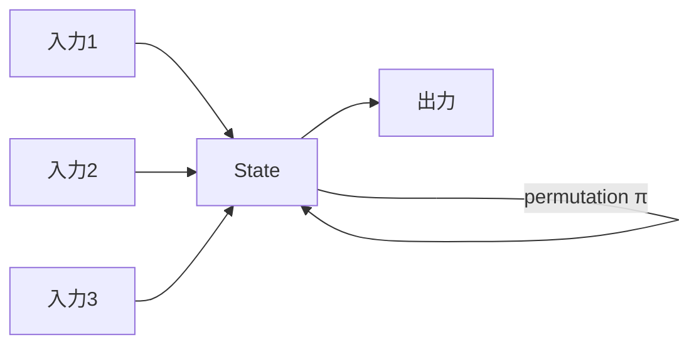
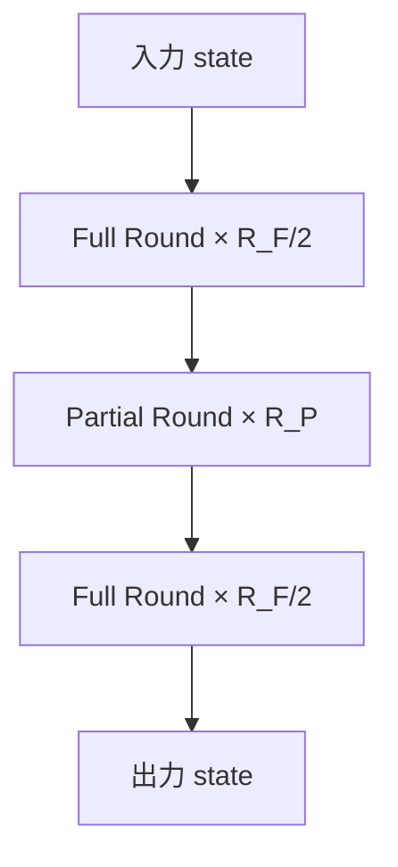

**日付**: 2026年4月22日
**学習内容**: **Poseidon** は Grassi, Khovratovich ら (2019) が設計した **ZK-friendly な暗号学的ハッシュ関数**。SHA-256 や Keccak が ZKP 回路で **数万制約** かかるのに対し、Poseidon は **数百制約**で済む。本記事では **(1) 設計動機**、**(2) Sponge 構造**、**(3) S-box と Mix Layer**、**(4) 完全アルゴリズム ($x^5$ ベース)**、**(5) 定数の役割**、**(6) セキュリティ仮定**、**(7) 実装 (circomlib, zkSync)**、**(8) 他の ZK-friendly hash との比較** を扱う。

## 0. 本記事の位置づけ

ZKP 応用では**ハッシュ関数を大量に計算**する:

- Merkle tree: 数十回のハッシュ
- Nullifier 計算: 毎トランザクションで数回
- Commitment scheme: 複数回

SHA-256 を回路で計算すると 1 回 27,000 制約。Merkle path 20 レベルなら 54 万制約。**実用的でない**。

そこで誕生したのが Poseidon。設計の根本哲学:

> **CPU やハードウェアで速いことより、算術回路 (multiplications mod p) で軽いことを優先**

結果、制約数が 100 倍以上削減される。

構成:

- **第1章**: SHA vs Poseidon の違い
- **第2章**: Sponge 構造
- **第3章**: Poseidon の全体アーキテクチャ
- **第4章**: S-box
- **第5章**: Mix Layer (MDS 行列)
- **第6章**: Round Constants
- **第7章**: セキュリティ仮定
- **第8章**: 実装
- **第9章**: 他の ZK-friendly hash
- **第10章**: Q&A とまとめ

## 1. SHA vs Poseidon の違い

### 1.1 ビット操作 vs 算術

- **SHA-256**: XOR, AND, OR, 右回転などの**ビット操作**中心
  - CPU で速い（1 cycle/op）
  - ZK 回路では**ビット分解**が必要 → 制約爆発
- **Poseidon**: **$\mathbb{F}_p$ 上の加算・乗算**のみ
  - CPU では少し遅い（$\mathbb{F}_p$ 演算）
  - ZK 回路では**1 制約 / 1 乗算**

### 1.2 制約数の比較

| ハッシュ | 1 回の制約数 |
|---|---|
| SHA-256 | 27,000 |
| Keccak-256 | 150,000 |
| Blake2b | 12,000 |
| **Poseidon (1 permutation)** | **~200** |
| Pedersen | 2,000 |
| Rescue / Rescue-Prime | ~400 |
| MiMC | ~600 |

Poseidon は圧倒的。

### 1.3 適用範囲

Poseidon は**ハッシュ出力が $\mathbb{F}_p$ 要素**。32 バイトのランダムビット列が欲しい場合は SHA 等を使う。ZKP 内部のハッシュは Poseidon。

## 2. Sponge 構造

### 2.1 Sponge のアイデア

Sponge は「**吸収 (absorb)** → **絞り出し (squeeze)**」の 2 フェーズ構造。SHA-3 (Keccak) の設計にも使われる。



### 2.2 状態分割

内部状態を 2 分割:

- **Rate** 部分: 外部と IO する
- **Capacity** 部分: 内部秘密として保持（セキュリティの源泉）

状態サイズ $t = r + c$。

### 2.3 Absorb フェーズ

入力を $r$ ワードずつ分割し、state の rate 部分に XOR（Poseidon では**加算**）:

```
for each block m_i:
    state[0..r] += m_i
    state = permutation(state)
```

### 2.4 Squeeze フェーズ

必要なだけ state の rate 部分を取り出す:

```
while output not filled:
    append state[0..r] to output
    state = permutation(state)
```

### 2.5 Poseidon の典型パラメータ

- $t = 3$ (state 3 要素、rate 2、capacity 1): 2 要素ハッシュ
- $t = 5$: 4 要素ハッシュ
- $t = 9$: より大きなハッシュ

## 3. Poseidon の全体アーキテクチャ

### 3.1 Permutation Function

Poseidon permutation $\pi$ は $R$ ラウンドから成る:

- **$R_F$**: **Full Round**（全要素に S-box 適用）
- **$R_P$**: **Partial Round**（1 要素だけ S-box 適用）
- **総ラウンド数**: $R_F + R_P$（通常 $R_F = 8, R_P = 55 \sim 65$）



### 3.2 1 ラウンドの構造

1. **ARC (Add Round Constants)**: 定数を各要素に加算
2. **S-box**: 非線形変換 $x \mapsto x^\alpha$
3. **M (Mix Layer)**: MDS 行列による線形変換

### 3.3 Full vs Partial

- **Full Round**: 全要素に S-box
- **Partial Round**: 1 要素だけ S-box、他は恒等

Partial round は制約を減らす最適化。**セキュリティに影響しないと示されている**。

## 4. S-box

### 4.1 $x \mapsto x^\alpha$

Poseidon の非線形要素は **$x^\alpha$**、ここで $\alpha$ は小さな奇数。

一般的な選択:

- $\alpha = 5$: BN254, BLS12-381 など
- $\alpha = 3$: 特定のフィールドで使用

### 4.2 $\alpha = 5$ の計算

$x^5$ は $\mathbb{F}_p$ で**単射**（$\gcd(5, p-1) = 1$ が必要）。

計算:

$$
x^2 = x \cdot x
$$

$$
x^4 = x^2 \cdot x^2
$$

$$
x^5 = x^4 \cdot x
$$

**乗算 3 回で $x^5$**。

### 4.3 なぜ $x^5$ か

- $x^3$ は「小さすぎて」近似されうる（多項式の次数が低い）
- $x^7$ は乗算 4 回
- $x^5$ が**安全性と効率のスイートスポット**

### 4.4 Inverse

$x^5$ の逆関数 $x^{1/5}$ は、$\mathbb{F}_p$ で $x^k$ の形で書ける（$k = (4p + 1)/5$ など）。複雑なので単方向として使う。

## 5. Mix Layer (MDS 行列)

### 5.1 MDS 行列

**MDS (Maximum Distance Separable)** 行列 $M \in \mathbb{F}_p^{t \times t}$:

- どの部分行列も可逆
- 入力のわずかな変化が出力全体に拡散

状態 $\vec{s}$ に対して:

$$
\vec{s}' = M \cdot \vec{s}
$$

### 5.2 Cauchy 行列での構成

典型的な選択は **Cauchy 行列**:

$$
M_{ij} = \frac{1}{x_i - y_j}
$$

$\{x_i\} \cup \{y_j\}$ が相異なるなら MDS。

例 ($t = 3$):

$$
M = \begin{pmatrix}
\frac{1}{x_0 - y_0} & \frac{1}{x_0 - y_1} & \frac{1}{x_0 - y_2} \\
\frac{1}{x_1 - y_0} & \frac{1}{x_1 - y_1} & \frac{1}{x_1 - y_2} \\
\frac{1}{x_2 - y_0} & \frac{1}{x_2 - y_1} & \frac{1}{x_2 - y_2}
\end{pmatrix}
$$

### 5.3 計算コスト

$M \cdot \vec{s}$ は **$t^2$ 回の乗算 + $t^2 - t$ 回の加算**。

$t = 3$ なら 9 乗算。しかし**定数との乗算は「定数倍算」**で制約に含まれない（線形演算）。

### 5.4 Circuit cost

Poseidon のゲート数は主に **S-box の乗算** で決まる。MDS は加算のみで**ほぼ無料**。

## 6. Round Constants

### 6.1 ARC (Add Round Constants)

各ラウンドで、固定の定数ベクトル $\vec{RC}^{(i)}$ を state に加算:

$$
\vec{s} \leftarrow \vec{s} + \vec{RC}^{(i)}
$$

### 6.2 定数の生成

定数は**疑似ランダム**に生成（grain-based PRG や SHAKE256）。スペックで**完全に決定的**に指定される。

Circuit では定数は「wire の定数セレクタ」で表現できるので、**制約数ゼロ**で扱える。

### 6.3 定数の数

- Full round: $t$ 個/ラウンド × $R_F$ ラウンド
- Partial round: $t$ 個/ラウンド × $R_P$ ラウンド

全体で $t (R_F + R_P)$ 個の定数。通常数百個。

## 7. セキュリティ仮定

### 7.1 Classical Security

Poseidon は以下の攻撃に対する安全性を主張:

- **Linear / Differential cryptanalysis**: 定型的な暗号解析
- **Gröbner Basis attack**: 代数的な方程式系を解く
- **Algebraic Countdown**: $x^\alpha$ の冪乗性の弱み

各攻撃に対してラウンド数が十分設定されている。

### 7.2 保証水準

- Preimage resistance: $2^{\lambda}$
- Collision resistance: $2^{\lambda/2}$
- Second preimage resistance: $2^{\lambda}$

$\lambda = 128$ が典型。

### 7.3 なぜラウンド数が多いか

Gröbner Basis 攻撃に備えて、**冪乗の多重化**による安全性を稼ぐ。特に Partial Round は安全性を保ちつつ制約を減らせる。

### 7.4 Cryptanalysis の進展

Poseidon は 2019 以降多くの解析を受け、大きな弱点は見つかっていない。**NIST PQ 標準では採用外** だが、ZKP 内部では広く使われる。

### 7.5 Poseidon2

2023 年の **Poseidon2** は MDS を改良しさらに高速化。互換性は失われるが、新規採用が進む。

## 8. 実装

### 8.1 circomlib の Poseidon

```circom
include "node_modules/circomlib/circuits/poseidon.circom";

template HashTwo() {
    signal input a;
    signal input b;
    signal output out;

    component h = Poseidon(2);
    h.inputs[0] <== a;
    h.inputs[1] <== b;
    out <== h.out;
}
```

### 8.2 JavaScript/Node.js

```javascript
const { buildPoseidon } = require("circomlibjs");
const poseidon = await buildPoseidon();
const hash = poseidon([12345, 67890]);
console.log(poseidon.F.toString(hash));
```

### 8.3 Rust (arkworks)

```rust
use ark_crypto_primitives::sponge::poseidon::{PoseidonSponge, PoseidonConfig};
use ark_bn254::Fr;

let config = poseidon_config();
let mut sponge = PoseidonSponge::<Fr>::new(&config);
sponge.absorb(&vec![Fr::from(12345u64), Fr::from(67890u64)]);
let hash: Fr = sponge.squeeze_field_elements(1)[0];
```

### 8.4 zkSync の Poseidon2

zkSync は Poseidon2 を採用。**Arithmetization 最適化**で制約数をさらに削減。

### 8.5 gnark (Go)

```go
import "github.com/consensys/gnark-crypto/ecc/bn254/fr/poseidon"

h := poseidon.NewHash(...)
h.Write(data)
hash := h.Sum(nil)
```

## 9. 他の ZK-friendly hash

### 9.1 MiMC

**$x \mapsto x^3$** の繰り返し（複数ラウンド）。Poseidon より設計が古い。

- Pros: シンプル
- Cons: ラウンド数多い、制約数やや多い

### 9.2 Rescue / Rescue-Prime

**$x \mapsto x^\alpha$ と $x \mapsto x^{1/\alpha}$ を交互に**。双方向対称で解析しやすい。

### 9.3 Reinforced Concrete

**小さいテーブル参照**を使う。Plonkish の lookup と相性良い。

### 9.4 Griffin

Poseidon の改良版。特定の用途で高速。

### 9.5 Monolith

2023 年、lookup と組み合わせた超高速ハッシュ。Plonky2 で採用候補。

### 9.6 比較

| ハッシュ | 1 回の制約 (BN254) | 特徴 |
|---|---|---|
| Poseidon (α=5) | ~200 | 業界標準 |
| Poseidon2 | ~150 | 最新改良 |
| Rescue-Prime | ~400 | 対称構造 |
| MiMC | ~600 | シンプル |
| Reinforced Concrete | ~50 (lookup 込み) | 特殊用途 |
| Griffin | ~150 | 改良版 |

## 10. Q&A

### Q1: Poseidon のハッシュ出力サイズは？

**$\mathbb{F}_p$ 要素**。BN254 なら約 254 bit（32 bytes）、BLS12-381 なら 255 bit。

### Q2: Poseidon を EVM の外で使える？

**使えるが非推奨**。通常の用途（パスワードハッシュ、署名）は SHA-2 や Blake2 の方が標準的。Poseidon は **ZKP 回路内部**のために設計。

### Q3: Collision はある？

理論上 $2^{128}$ ハッシュで衝突する（生年月日攻撃）。実用で衝突を起こすのは不可能。

### Q4: Poseidon は PQ 耐性？

**ハッシュとしては PQ 耐性あり**（Grover 攻撃で $\sqrt{N}$ になるが $2^{64}$ でも十分）。

### Q5: 定数を書き間違えるとどうなる？

完全に別のハッシュになる。検証も失敗。**仕様準拠の定数**を必ず使う（コピペミス厳禁）。

### Q6: Lookup と組み合わせられる？

可能。特に **Reinforced Concrete** や **Monolith** は lookup ベース。Plonkish SNARK でさらに効率化。

## 11. まとめ

### 本記事の要点

1. **Poseidon**: ZK-friendly ハッシュの標準、SHA-256 の 100 倍軽い制約数
2. **Sponge 構造**: absorb → squeeze の 2 フェーズ
3. **ラウンド**: ARC → S-box → Mix Layer の 3 段
4. **S-box**: $x^5$ が多くの曲線で採用、乗算 3 回
5. **MDS 行列**: Cauchy 行列で構成、制約ほぼゼロ
6. **Full + Partial Round**: 安全性と効率のバランス
7. **実装**: circomlib (Circom), arkworks (Rust), gnark (Go)
8. **後継**: Poseidon2, Monolith

### 次の記事（Article 28）へ

次の記事は **回路のセキュリティ**。**Under-Constrained バグ**という ZKP 特有の致命的なバグと、その検出手法（Vanguard, Picus, SemaphoreZK）を扱う。

### 3行サマリ

- **Poseidon = ZK 回路で制約数 ~200 の高速ハッシュ**
- **Sponge + S-box ($x^5$) + MDS**の 3 要素
- **circomlib / arkworks で標準実装**、Merkle tree/Nullifier の必需品

---

## 参考文献

- Lorenzo Grassi, Dmitry Khovratovich, Christian Rechberger, Arnab Roy, Markus Schofnegger. *Poseidon: A New Hash Function for Zero-Knowledge Proof Systems.* USENIX Security 2021.
- Lorenzo Grassi et al. *Poseidon2: A Faster Version of the Poseidon Hash Function.* AFRICACRYPT 2023.
- Iden3. *circomlib/circuits/poseidon.circom.*
- ZKTokyo Week 5 資料 (Poseidon).
- ZKP MOOC Lecture 3 (UC Berkeley, 2023).
