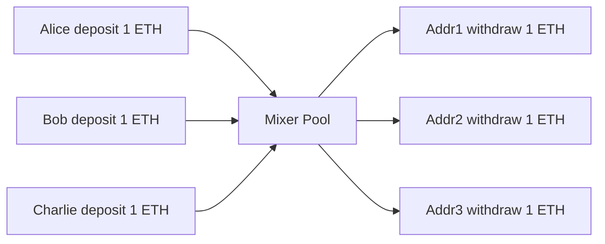

**日付**: 2026年4月22日
**学習内容**: **Tornado Cash** は Ethereum 上で動く**非対称 mixer**。ユーザーが固定額を deposit し、ZKP を使って**別のアドレスから withdraw** することで送信元と送信先のリンクを切る。シンプルな設計で 2022 年の OFAC 制裁まで広く使われた。本記事では **(1) Mixer の一般設計**、**(2) Tornado Cash のアーキテクチャ**、**(3) Deposit / Withdraw 回路**、**(4) Merkle tree と Nullifier**、**(5) ガバナンスとフロントエンド**、**(6) 制裁と Privacy Pools の登場**、**(7) Mixer の限界と進化** を扱う。Zcash（Article 27）との技術的な違いも確認する。

## 0. 本記事の位置づけ

Article 27 の Zcash は**プライバシー専用ブロックチェーン**。しかし Ethereum ユーザーは既存のチェーン上でプライバシーが欲しい。そこで生まれたのが**Mixer**プロトコル。

Tornado Cash は 2019 年にローンチし、ZKP を使った L1 上の最初の成功した mixer。**シンプル、監査可能、$4B 以上の総預託**を集めた。しかし 2022 年 8 月、米国 OFAC により**制裁対象**に。

本記事は純粋な技術解説。制裁議論は第 6 章で扱うが、技術と規制は分離して理解する。

構成:

- **第1章**: Mixer の一般設計
- **第2章**: Tornado Cash のアーキテクチャ
- **第3章**: Deposit / Withdraw 回路
- **第4章**: Merkle Tree と Nullifier
- **第5章**: コントラクト構造
- **第6章**: OFAC 制裁と Privacy Pools
- **第7章**: Mixer の進化
- **第8章**: Q&A とまとめ

## 1. Mixer の一般設計

### 1.1 基本アイデア

$n$ 人が**同じ金額** (たとえば 1 ETH) を mixer に預け、その後**別の（匿名の）アドレス**で引き出す。誰がどの預入者か分からない。



### 1.2 Trusted Mixer の問題

素朴な mixer は「中央サーバーが ETH を預かって、後で別のアドレスに送る」。問題:

- サーバーが資金を持ち逃げできる
- サーバーが誰が誰かを知っている
- サーバー側の漏洩リスク

### 1.3 Trustless Mixer

ZKP を使えば**信頼できる第三者なし**で実現:

- 預入時: 「預けた」という証明を匿名で生成
- 引き出し時: 「過去の預入者の 1 人である」を ZKP で証明
- コントラクトが自動で ETH を引き出しアドレスに送る

**誰もどの deposit と withdraw が対応するか分からない**。

### 1.4 Tornado Cash の独自性

- **Non-custodial**: コントラクトが預金を保管、誰も引き出せない（正当な引き出しのみ）
- **Permissionless**: 誰でも使える
- **Transparent**: コードが公開

## 2. Tornado Cash のアーキテクチャ

### 2.1 コンポーネント

- **Smart contract (Solidity)**: deposit / withdraw ロジック
- **Circom 回路**: ZKP 証明の生成
- **snarkjs / rapidsnark**: 証明生成エンジン
- **Web UI**: ユーザーインターフェース

### 2.2 固定額プール

各プールは**固定額**:

- 0.1 ETH
- 1 ETH
- 10 ETH
- 100 ETH
- ERC-20 トークン版も同様

**なぜ固定額か**: 可変額だと**金額でトラッキング**されてしまう。「A が 13.7 ETH deposit → Addr_X が 13.7 ETH withdraw → 高確率で同一」と分析できる。

### 2.3 匿名集合 (Anonymity Set)

各プールでの deposit 数 = anonymity set のサイズ。

- deposit 10 件 → 1/10 の確率で特定
- deposit 10,000 件 → 1/10,000 の確率

**大きい方が匿名性が高い**。Tornado Cash の大きなプールでは数万〜数十万 deposit があった。

### 2.4 Relayer

Withdraw には**ガス代を払う**必要。ガス代の出所で匿名性が崩れる（新しいアドレスにガスを送った時点でリンクされる）。

**Relayer** がこの問題を解決:

1. ユーザーが Relayer に ZKP を送る
2. Relayer が自分のガス代で引き出しトランザクションを送信
3. ユーザーは「引き出し額から Relayer 手数料」を受け取る

Relayer は任意の第三者で、誰でもなれる。

## 3. Deposit / Withdraw 回路

### 3.1 Deposit の流れ

1. ユーザーが乱数 $r$ と secret $s$ を生成
2. **Commitment** $\text{cm} = H(s, r)$ を計算
3. コントラクトに 1 ETH 送金、$\text{cm}$ を記録
4. コントラクトが Merkle tree に $\text{cm}$ を追加

**ユーザーは $(s, r)$ を大切に保管**。これが後で引き出しの鍵になる。

### 3.2 Withdraw の流れ

1. ユーザーが $(s, r)$ と任意の新しいアドレス $addr$ を使って:
   - **Nullifier** $\text{nf} = H(s)$ を計算
   - Merkle path を構築
   - ZKP $\pi$ を生成
2. $(\pi, \text{nf}, \text{addr})$ を Relayer またはコントラクトに送信
3. コントラクトが:
   - $\pi$ を検証
   - $\text{nf}$ が未使用か確認
   - OK なら $addr$ に 1 ETH 送金

### 3.3 Circom 回路

簡略化した Withdraw 回路:

```circom
pragma circom 2.0.0;
include "node_modules/circomlib/circuits/poseidon.circom";
include "node_modules/circomlib/circuits/merkletree.circom";

template Withdraw(levels) {
    signal input root;             // public
    signal input nullifierHash;    // public
    signal input recipient;        // public (but not used in constraints)
    signal input relayer;          // public
    signal input fee;              // public
    
    signal input nullifier;        // private
    signal input secret;           // private
    signal input pathElements[levels];
    signal input pathIndices[levels];
    
    // 1. commitment = Poseidon(nullifier, secret)
    component commitmentHasher = Poseidon(2);
    commitmentHasher.inputs[0] <== nullifier;
    commitmentHasher.inputs[1] <== secret;
    signal commitment;
    commitment <== commitmentHasher.out;
    
    // 2. nullifierHash = Poseidon(nullifier)
    component nullifierHasher = Poseidon(1);
    nullifierHasher.inputs[0] <== nullifier;
    nullifierHasher.out === nullifierHash;
    
    // 3. Merkle path verification
    component tree = MerkleTreeChecker(levels);
    tree.leaf <== commitment;
    tree.root <== root;
    for (var i = 0; i < levels; i++) {
        tree.pathElements[i] <== pathElements[i];
        tree.pathIndices[i] <== pathIndices[i];
    }
    
    // 4. recipient, fee への依存（ハッシュで binding）
    // これがないと Relayer に証明を盗まれる
    signal recipientSquared;
    recipientSquared <== recipient * recipient;  // 任意の制約
}

component main { public [root, nullifierHash, recipient, relayer, fee] } = Withdraw(20);
```

### 3.4 回路が保証すること

1. **Commitment が Merkle tree に存在**（過去の deposit の 1 つ）
2. **Nullifier が正しく計算**
3. **ユーザーが secret を知る**（knowledge soundness）
4. **Recipient, fee への binding**（malleability 防止）

## 4. Merkle Tree と Nullifier

### 4.1 Merkle Tree の更新

Deposit のたびに Merkle tree が更新される。levels = 20 なら最大 $2^{20} \approx 100$ 万 deposit。

各 leaf = commitment $\text{cm}_i$。Root がチェーン上に保存。

### 4.2 Merkle Path の構築

Withdraw 時、ユーザーは**自分の commitment から root までのパス**を計算:

- leaf index: deposit された順番
- path elements: 各レベルの sibling hash
- path indices: 左右の情報 (bit vector)

これをすべて回路に入力し、root を再計算して一致を確認。

### 4.3 History of Roots

Merkle tree は deposit ごとに更新される。同じ root を長期保持すると:

- ユーザー A が tx1 で X を deposit
- Root が変わる
- ユーザー A の withdraw tx の root = tx1 直後の root → A の deposit を特定

Tornado Cash は**過去の root を 30 個保持**し、ユーザーは古い root で withdraw 可能。匿名性が保たれる。

### 4.4 Nullifier Set

既に使われた nullifier はコントラクトのマッピングで記録:

```solidity
mapping(bytes32 => bool) public nullifierHashes;
```

新しい withdraw が来たら、`nullifierHashes[nf]` が false なら通す、true なら reject。

## 5. コントラクト構造

### 5.1 Tornado.sol 主要関数

```solidity
contract Tornado {
    mapping(bytes32 => bool) public commitments;
    mapping(bytes32 => bool) public nullifierHashes;
    IVerifier public verifier;
    
    function deposit(bytes32 commitment) external payable {
        require(msg.value == denomination);
        require(!commitments[commitment]);
        commitments[commitment] = true;
        _insert(commitment);  // Merkle tree update
    }
    
    function withdraw(
        bytes calldata proof,
        bytes32 root,
        bytes32 nullifierHash,
        address payable recipient,
        address payable relayer,
        uint256 fee
    ) external {
        require(!nullifierHashes[nullifierHash]);
        require(isKnownRoot(root));
        require(verifier.verifyProof(proof, ...));
        
        nullifierHashes[nullifierHash] = true;
        _processWithdraw(recipient, relayer, fee);
    }
}
```

### 5.2 Verifier コントラクト

snarkjs で自動生成された Verifier.sol。Groth16 の 3 ペアリング検証を実装。ガスコスト ~230K。

### 5.3 フロントエンド

- React UI
- snarkjs で WASM 内で証明生成
- ブラウザで 10〜30 秒

### 5.4 Classic vs Nova

- **Tornado Cash Classic**: 固定額プール
- **Tornado Cash Nova**: 可変額、AZTEC 的。より複雑だが柔軟

## 6. OFAC 制裁と Privacy Pools

### 6.1 2022 年 8 月の制裁

米国財務省 OFAC が Tornado Cash の**スマートコントラクトアドレス**を制裁リストに追加:

- 米国人は使用禁止
- 関連アドレスへの送金も禁止
- GitHub コード公開者も一時逮捕（後に解放）

### 6.2 影響

- Dependabot 等が Tornado Cash 関連リポジトリを削除
- Circle (USDC) が制裁対象アドレスをフリーズ
- 開発者 Alexey Pertsev がオランダで逮捕（後に有罪判決）

### 6.3 技術 vs 法律の議論

- コード = 表現の自由か、武器輸出か
- Immutable なコントラクトは止められない
- プライバシーの権利 vs マネーロンダリング防止

### 6.4 Privacy Pools (Buterin et al. 2023)

Vitalik Buterin らの「Blockchain Privacy and Regulatory Compliance」論文で**Privacy Pools** を提案:

- 同じ mixer 設計
- ただし**自分が特定の "association set" に属する**ことを ZKP で追加証明
- ユーザーが「制裁対象ではない」subset に自発的にコミットできる

たとえば:

- 全 Tornado Cash deposit の subset のうち、「Chainalysis でラベルなし」のものだけを association set に選ぶ
- これで善良なユーザーは規制対応できる

### 6.5 実装

- Privacy Pools プロトコル（実装中）
- Aztec の privacy solution
- Railgun (Ethereum 上の商用 mixer)

## 7. Mixer の進化

### 7.1 Variable Amount Mixers

- **Tornado Nova**: 可変額、高度な UI
- **Aztec Connect**: DeFi 連携可能な shielded pool

### 7.2 Cross-Chain Mixers

- **Railgun**: 複数チェーン対応
- **Nocturne**: Ethereum 上のプライベート wallet

### 7.3 Compliant Privacy

- **Privacy Pools + proof of innocence**
- **zkKYC**: KYC 済みを ZKP で示し、特定の subset に制限

### 7.4 Application-Specific Privacy

- **Aztec**: プライベートスマートコントラクト全体
- **Namada**: MASP (Multi-Asset Shielded Pool)
- **Penumbra**: Cosmos 上のプライベートDeFi

## 8. Q&A

### Q1: Tornado Cash は本当に追跡不可能？

**高匿名性**だが完全ではない:

- Deposit と withdraw のタイミング相関
- 同じ時期の少人数プールは特定されやすい
- Off-chain 情報（IP、TX 時刻）で縮小される

大きいプール + ランダムな withdraw timing で実用的な匿名性。

### Q2: なぜ L1 で mixer が動く？

Ethereum のスマートコントラクトでコインの預かりと配分ができ、ZKP 検証も precompile で効率実行できる。L2 は必須ではない。

### Q3: Mixer のガス代は？

- Deposit: ~100K gas
- Withdraw: ~300K gas (ZKP verify が大部分)

L1 で 1 ETH pool を使うなら、数十ドルのコストで匿名送金。

### Q4: 使い方を誤ると？

- 同じアドレスで deposit と withdraw: 匿名性ゼロ
- 短時間で deposit → withdraw: タイミング相関で特定
- ガス代の出所で特定: Relayer を使う

ドキュメントで「適切な使い方」が案内されていた。

### Q5: 規制されたプロトコルを学ぶ意味は？

**技術は中立**。Tornado Cash のアーキテクチャは Privacy Pools や Aztec の前身。学ぶことで:

- ZKP 応用の実装を理解
- コンプライアンスとプライバシーの両立設計を考察
- 次世代プロトコルの改善点を把握

### Q6: Privacy Pools の実用性は？

理論的には美しいが、**association set の決め方**が社会的・政治的問題。誰が「良い subset」を決めるかで利害が対立。実装中のプロトコルでは、ユーザーが自由に subset を選べる設計を模索。

## 9. まとめ

### 本記事の要点

1. **Tornado Cash**: Ethereum L1 上の固定額 mixer
2. **Commitment + Nullifier + Merkle tree + ZK-SNARK** が基本構造
3. **Circom で回路記述、Groth16 で証明**
4. **Relayer** でガス代の漏れを防ぐ
5. **OFAC 制裁 (2022)** で法的問題化、技術と規制の緊張
6. **Privacy Pools** は「association set による selective privacy」の提案
7. 後継プロトコル: Aztec, Railgun, Nocturne, Namada, Penumbra

### 次の記事（Article 31）へ

次の記事は **zkEVM と zkRollup**。L2 スケーリングの中心技術を詳細に。EVM 命令を回路化する難しさと、Scroll, Polygon zkEVM, zkSync, Linea などの実装の違いを比較する。

### 3行サマリ

- **Tornado Cash = Ethereum L1 上の匿名送金プロトコル**
- **Commitment + Nullifier + Merkle + ZK-SNARK** の古典構造
- **OFAC 制裁で規制圧力**、後継は Privacy Pools と Aztec で技術が続く

---

## 参考文献

- Alexey Pertsev et al. *Tornado Cash Whitepaper.* 2019.
- Vitalik Buterin, Jacob Illum, Ameen Soleimani et al. *Blockchain Privacy and Regulatory Compliance: Towards a Practical Equilibrium.* 2023.
- Tornado Cash. *tornado-core GitHub.* Archived, 2022.
- 0xPARC. *Privacy Pools Research Notes.* 2023.
- Aztec. *Aztec Connect Documentation.* 2022.
