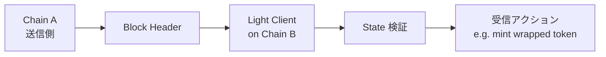

**日付**: 2026年4月22日
**学習内容**: ZKP 応用編の締めくくり。前半で **zkBridge**（ZKP による trust-minimized なクロスチェーンブリッジ）を詳述し、後半で ZKP の**未来フロンティア**を展望する。**zkBridge** の設計は **(1) ブリッジの脆弱性**、**(2) Light client + ZKP**、**(3) deVirgo と分散証明**、**(4) 代表プロジェクト (Polyhedra, Succinct)**。未来セクションでは **zkML, zkID, C2PA, Verifiable Compute, zkVM 商用化, Post-Quantum ZKP** を扱う。最後に ZKP 応用の全体像と次の学習ステップを示す。次の Article 33 が連載の真の最終回（Plinko PIR と ZKP の隣接技術）。

## 0. 本記事の位置づけ

ここまでの 31 記事で、ZKP の**理論・実装・応用**を俯瞰してきた。本記事は応用編の締めくくりとして:

1. **zkBridge**: ZKP の新しい応用領域（前半）
2. **未来展望**: 次の 5 年で何が起きるか（後半）

を扱う。続く最終 Article 33 では ZKP の隣接技術 (PIR, FHE, ORAM, MPC) を俯瞰し、ZKP が暗号学全体のどこに位置するかを見る。

構成:

- **第1章**: ブリッジの脆弱性と zkBridge の必要性
- **第2章**: Light Client Bridge の仕組み
- **第3章**: zkBridge の技術詳細
- **第4章**: 代表的な zkBridge プロジェクト
- **第5章**: zkML — AI × ZKP
- **第6章**: zkID — 次世代アイデンティティ
- **第7章**: C2PA とコンテンツ真正性
- **第8章**: Post-Quantum ZKP
- **第9章**: 連載の総括
- **第10章**: 次の学習ステップ

## 1. ブリッジの脆弱性

### 1.1 クロスチェーンブリッジの重要性

異なるブロックチェーン間で資産・メッセージを転送する仕組み:

- Ethereum → Polygon / BSC / Arbitrum
- Bitcoin → Ethereum (wrapped)
- 任意のチェーン間のメッセージング

DeFi TVL の数十%がブリッジに依存。

### 1.2 大規模ハッキング

2021-2023 年のブリッジ被害は**累計 $2B+**:

- Ronin (Axie Infinity): $625M (2022)
- Poly Network: $600M (2021)
- Wormhole: $325M (2022)
- Nomad: $190M (2022)
- Harmony: $100M (2022)

いずれもマルチシグキー漏洩や検証ミス。

### 1.3 従来のブリッジの仕組み

- **Multi-sig bridge**: $M/N$ の署名者が検証
- **Trusted relayer**: 中央組織が検証
- **Optimistic bridge**: challenge period 付き
- **Light client bridge**: 受信チェーンが送信チェーンのブロックヘッダを検証

マルチシグが最も一般的だが**最も脆弱**。

## 2. Light Client Bridge

### 2.1 基本アイデア

**Light Client**: ブロックチェーンの全データを保持せず、ヘッダ情報だけで state を検証する軽量ノード。

**Light Client Bridge**: 受信チェーンの上で送信チェーンの light client を動かす:

### 2.2 検証の問題

Light client は Chain A のブロックヘッダを検証するが、これには:

- PoW/PoS の consensus 検証
- 多数の署名検証
- Merkle proof の計算

**Chain B で実行すると膨大なガス代**。Ethereum の light client を BSC 上で動かすと、1 ブロックあたり数百万ガス。

### 2.3 ZKP での圧縮

Light client の検証ロジックを**ZKP で圧縮**:

- Chain B 上の EVM で直接検証 → 数百万ガス
- ZKP で検証 → **数十万ガス**

これが **zkBridge**。

## 3. zkBridge の技術詳細

### 3.1 証明する内容

zkBridge の ZKP が証明するのは典型的に:

1. **Block header が正当**:
   - Consensus (PoS) の署名が N/M 集まっている
   - PoW なら nonce が difficulty を満たす
2. **State Merkle path が正当**: 特定のトランザクション・状態が含まれる
3. **Finality が確保**: 十分なブロック数を経過

### 3.2 署名集約の証明

Ethereum PoS では各ブロックに数百〜数千の validator 署名。これを ZKP で集約検証:

- 各 BLS 署名が正当
- 署名者が active validator set に属する
- 総ステーク weight が 2/3 超

これは大量の BLS ペアリング検証で、素朴には膨大。

### 3.3 deVirgo (Polyhedra)

**deVirgo**（distributed Virgo）は、zkBridge 向けに設計された SNARK:

- 署名検証を**並列で分散 prove**
- 各 prover が 1 つの署名を担当
- 最終的に 1 つの ZKP に集約

ブロック時間（12 秒）以内に証明生成可能。

### 3.4 Recursive composition

zkBridge では**複数ブロックを 1 証明**にしたい:

- 各ブロック: 基本証明
- 再帰的に集約
- 最終 1 つの証明

Plonky2 や Nova で実装。

### 3.5 Verify コストの最適化

L1 verify コストを下げるには:

- PLONK / Halo2 ベースで verify ~230K gas
- EIP-1962 など新しい precompile の議論
- **On-chain verifier をさらに圧縮**

## 4. 代表的な zkBridge プロジェクト

### 4.1 Polyhedra Network

- **ZK-ISA**: ZK 専用命令セット
- **deVirgo**: 分散証明
- **広範なチェーン対応**: Ethereum, BSC, Polygon, Aptos, Sui, ...
- **2023 年メインネット**

### 4.2 Succinct (Telepathy)

- **ZK Light Client on Ethereum for other chains**
- **Telepathy**: Solidity で light client verify コントラクト
- **General messaging**: 任意のメッセージングが可能

### 4.3 Axiom

- **ZK Coprocessor**: Ethereum の過去ブロックに対する ZK 計算
- On-chain で historical data に基づく計算（オラクル代替）

### 4.4 zkLink

- **ZK-rollup for cross-chain DEX**
- L2 でのマルチチェーン流動性

### 4.5 Lightweight Bridges

- **BlobStream (Celestia)**: DA レイヤとの ZK 接続
- **EigenDA + ZK bridge**: Restaking ベースの DA

## 5. zkML — AI × ZKP

### 5.1 問題

AI モデルの結果を信頼できるか？

- AI が偏見のあるモデルを使っていないか
- 推論結果が改竄されていないか
- プライベートなモデル（医療診断）で結果だけ示したい

### 5.2 zkML の仕組み

AI モデルの**順伝播 (inference)** を ZKP で証明:

- 入力 $x$ と出力 $y$ を公開
- 重み $W$ を秘密にして「$y = \text{Model}_W(x)$」を証明

### 5.3 課題

- **モデルサイズが巨大**: LLM で数十億パラメータ、数百億回の乗算
- **Prover 時間**: 数時間〜数日
- **固定小数点演算**: 浮動小数点を整数に近似

### 5.4 実装

- **EZKL**: Halo2 ベースの zkML ライブラリ
- **Modulus Labs**: ML inference の ZK
- **Giza**: StarkNet 上の zkML
- **RISC Zero + PyTorch**: RISC-V zkVM 上の AI

### 5.5 応用

- **医療 AI**: 患者データを漏らさず診断結果だけ証明
- **Federated learning**: 各ノードの貢献を ZKP で証明
- **AI fairness**: モデルに偏見がないことを公開証明
- **Deepfake 対策**: AI 生成物の来歴を ZK で記録

## 6. zkID — 次世代アイデンティティ

### 6.1 Self-Sovereign Identity

**自己主権型アイデンティティ (SSI)**:

- ユーザーが自分の資格情報を管理
- 開示を選択的に
- プラットフォームに依存しない

### 6.2 zkID の実装

- **Verifiable Credentials (W3C)**: 標準化された VC フォーマット
- **ZKP で選択的開示**: 「18 歳以上」「有資格者」など 1 ビットだけ

### 6.3 代表プロジェクト

- **Polygon ID**: Iden3 ベースの ZK-KYC
- **World ID**: 人間性証明（Proof of Personhood）
- **zkEmail**: DKIM 署名を回路内で検証
- **Anon Aadhaar**: インド Aadhaar の ZK 利用

### 6.4 zkEmail の仕組み

メールの DKIM 署名を ZKP で検証:

1. ユーザーが `@gmail.com` からのメールを受信
2. DKIM 署名（RSA）を ZK 回路で検証
3. メール本文の一部（例: 送信者）だけ公開

「私は特定ドメインからのメールを受信した」を匿名で示せる。

### 6.5 Passport / ICAO

電子パスポートの ICAO チップには国家署名がある。これを ZK で検証すれば、**パスポートを見せずに国籍や年齢を証明**できる。

- **ZK Passport**: 現在実用化進行中

## 7. C2PA とコンテンツ真正性

### 7.1 生成 AI の挑戦

Stable Diffusion, Sora などで本物と見分けがつかない画像・動画が作れる。**何が本物か**を証明するインフラが必要。

### 7.2 C2PA 規格

Adobe, Microsoft, Leica など主要企業の連合。画像・動画に**来歴 (provenance)** を付与する規格。

### 7.3 ZKP との統合

C2PA + ZKP で:

- カメラセンサー → 元画像 → 編集 → 公開画像
- 各ステップで署名 + ZKP
- **元画像を見せずに**「許可された編集のみ」を証明

### 7.4 編集が許される変換

- クロップ
- リサイズ
- 色調整
- Brightness / contrast

これらを回路化し、「入力画像 I と出力画像 O の間に許可された変換のみ適用された」を ZKP で証明。

### 7.5 STARK ベースの実装

画像の変換は大きな配列操作 → STARK ベースで並列化可能。長期保存のためにも PQ 耐性が望ましい。

## 8. Post-Quantum ZKP

### 8.1 量子計算機の脅威

Shor のアルゴリズムで:

- ECDLP が多項式時間
- RSA が多項式時間
- 離散対数ベース SNARK (KZG, Bulletproofs) が崩壊

Grover のアルゴリズムで:

- ハッシュの衝突が $2^{n/2}$ で発見
- 対称暗号が半分の安全性

### 8.2 PQ 耐性のある ZKP

- **STARK (FRI)**: ハッシュのみに依存、PQ 安全
- **Binius**: GF(2) + FRI、PQ 安全
- **Lattice-based SNARKs**: LWE / MLWE ベース（研究中）

### 8.3 Lattice-based ZKP

- **Banquet**: Aurora 的 + lattice
- **zkLLM**: LWE ベース、小さいパラメータ
- **MP-SPDZ**: 実装あり

まだ実用レベルではないが、将来の本命候補。

### 8.4 実用移行のタイムライン

- **今すぐ PQ 必須**: C2PA 長期保存、国家安全保障
- **5-10 年**: 量子計算機進歩次第
- **現実解**: STARK/FRI ベース + PQ 研究継続

## 9. 連載のここまでの総括（Article 33 で最終総括）

### 9.1 連載 33 記事の全体像

| 部 | 記事 | トピック |
|---|---|---|
| 第1部 | 01-05 | ZKP 入門と直感 |
| 第2部 | 06-09 | 数学の準備 |
| 第3部 | 10-14 | SNARK の構成要素 |
| 第4部 | 15-21 | 主要 SNARK プロトコル（GKR 含む） |
| 第5部 | 22-25 | STARK 系（Circle STARKs 含む） |
| 第6部 | 26-28 | 実装とセキュリティ |
| 第7部 | 29-32 | 応用と実例（**この記事がここ**） |
| 第8部 | 33 | 隣接技術（PIR・FHE・ORAM・MPC） |

### 9.2 読者が学んだこと

- **ZKP の直感**: 洞窟の例えから完全性・健全性・ゼロ知識性へ
- **数学的土台**: 有限体・楕円曲線・ペアリング・多項式
- **SNARK 構成**: R1CS → QAP → KZG、Groth16、PLONK
- **STARK**: Reed-Solomon、FRI、AIR
- **実装**: Circom、Poseidon、snarkjs、Halo2
- **応用**: Zcash、Tornado Cash、zkEVM、zkBridge

### 9.3 ZKP の現在地

- **技術**: 実用レベルに達した
- **応用**: L2 スケーリング、プライバシー、zkML、zkID
- **限界**: Prover コスト、モバイル対応、監査

### 9.4 課題

- **Prover 高速化**: ハードウェア支援（GPU/FPGA/ASIC）
- **Formal verification**: 監査自動化
- **Developer UX**: 書きやすい言語・デバッグ支援
- **規制対応**: プライバシー vs コンプライアンス

## 10. 次の学習ステップ

### 10.1 実装を動かす

1. **Circom** で最初の回路を書く（Article 26）
2. **snarkjs** で証明生成
3. **Hardhat + Solidity** で L1 検証デプロイ

### 10.2 深掘り読書

- Justin Thaler. *Proofs, Arguments, and Zero-Knowledge.* 2022.（無料公開、必読）
- Oded Goldreich. *Foundations of Cryptography.* 古典理論書
- ZKP MOOC (UC Berkeley, YouTube): 無料の講義動画

### 10.3 コミュニティ

- **zkSummit**, **zkWeek**: 年次カンファレンス
- **0xPARC**: ZKP 研究・教育コミュニティ
- **Privacy & Scaling Explorations (PSE)**: Ethereum Foundation 支援の R&D
- **ZK Research Twitter**: 最新研究のリアルタイム動向

### 10.4 実装プロジェクトへの参加

- **Zcash, Aztec, Scroll, Polygon zkEVM, RISC Zero** などのオープンソースコントリビューション
- **Gitcoin** のハッカソン（ZK カテゴリあり）
- **Ethereum Foundation grants**

### 10.5 将来展望

次の 5 年で起きうること:

- **L2 の主流化**: ほぼすべての tx が L2 に移行
- **zkVM の商用化**: RISC Zero / SP1 の普及
- **zkML の実用**: 医療・金融 AI で応用開始
- **zkID の普及**: 政府発行 ID の ZK 利用
- **Post-Quantum 移行**: 量子計算機の進歩次第

## 11. 3 行サマリ

- **zkBridge** は trust-minimized なクロスチェーン通信の鍵、$2B のハック被害から脱却する手段
- **zkML, zkID, C2PA** は次のフロンティア、現実世界と暗号学の接続点
- **ZKP は理論から実用フェーズへ**、今後 5 年で Web3 だけでなく AI・アイデンティティ・メディアに広がる

## 12. 次の記事（Article 33）へ

本記事までで ZKP そのものの技術地図はほぼ完成した。しかし連載の真の締めくくりとして、**ZKP だけでは解けない盲点** を扱う。

次の記事は **Plinko PIR と ZKP の隣接技術**。「計算の正当性」は ZKP が扱えるが、「**どの情報を読んだか**」というクエリのプライバシーは ZKP ではカバーできない。これを解決するのが **PIR (Private Information Retrieval)**。Vitalik Buterin の 2025 年11月ブログで紹介された **Plinko PIR** は単一サーバーで実用的な PIR を実現した画期的プロトコル。さらに **FHE / ORAM / MPC** との複合アーキテクチャを見ることで、ZKP が暗号学全体のどこに位置するかの地図が完成する。

---

## 参考文献

- Tiancheng Xie et al. *zkBridge: Trustless Cross-chain Bridges Made Practical.* CCS 2022.
- Polyhedra Network. *ZK-ISA and deVirgo Documentation.* 2024.
- Succinct Labs. *SP1 Documentation.* 2024.
- EZKL. *ZKML Framework.* 2024.
- World. *World ID / Proof of Personhood.* 2024.
- Justin Thaler. *Proofs, Arguments, and Zero-Knowledge.* 2022.
- Dan Boneh, Shafi Goldwasser, Dawn Song, Justin Thaler, Yupeng Zhang. *ZKP MOOC.* UC Berkeley, 2023.
- Adobe. *C2PA Technical Specification v1.3.* 2024.
