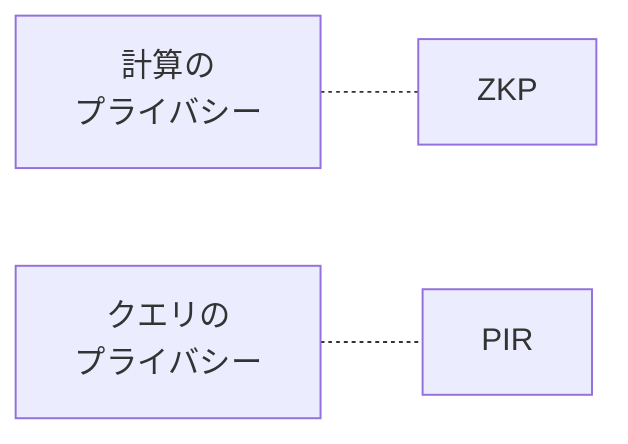
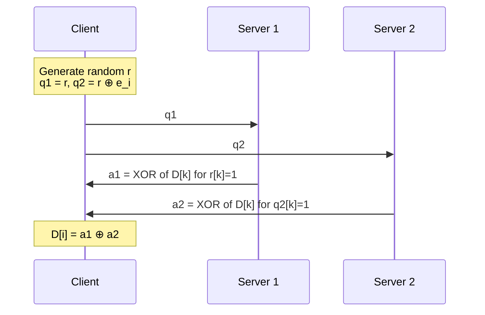
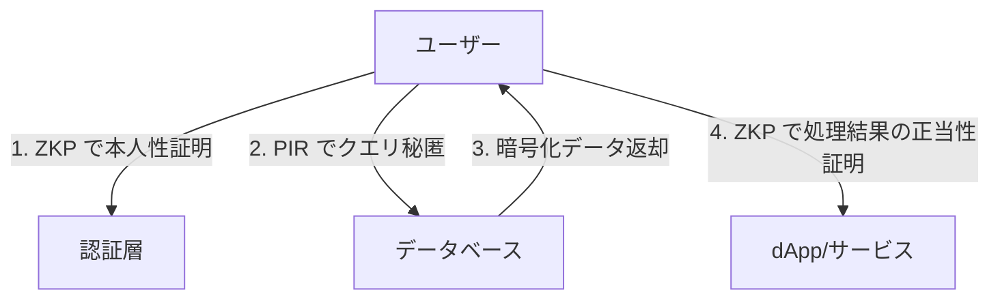

**日付**: 2026年4月23日
**学習内容**: 連載最終回。これまで ZKP の「**計算の正当性を秘密情報を隠したまま示す**」という軸を追ってきたが、ZKP だけではカバーできない「**プライベート読み取り**」という暗号学の大きな盲点がある。これを解決するのが **PIR (Private Information Retrieval)**。本記事では **(1) ZKP で解けない問題**、**(2) PIR の基本**、**(3) 2 サーバー PIR と単一サーバー PIR**、**(4) Plinko PIR (Vitalik 2025/11) の革新**、**(5) 他の隣接プリミティブ (FHE, ORAM, MPC)**、**(6) ZKP + PIR の複合アーキテクチャ**、**(7) 実応用 (プライベート RAG, ブロックチェーン検索)** を扱う。ZKP の世界の地図を完成させる。

## 0. 本記事の位置づけ

連載を通して ZKP の理論・実装・応用を見てきた。しかし ZKP だけでは**どうしても解けない問題**がある:

> **「データベースを検索した事実・クエリ内容を、サーバーに一切漏らさずに結果を取得したい」**

たとえば:

- Wikipedia で「HIV 治療」を検索 → サーバーに検索履歴が残る
- ブロックチェーンRPCで「自分の残高」を問い合わせ → RPC運営者が知る
- LLMのRAGで個人情報を検索 → サーバー運営者に漏洩

ZKP は「**計算の正当性**」を証明する道具であって、「**情報検索のプライバシー**」を守る道具ではない。これを補うのが **PIR (Private Information Retrieval)** であり、2025 年に Vitalik が紹介した **Plinko PIR** は、単一サーバーで実用的な PIR を実現した重要な進展。

構成:

- **第1章**: ZKP の限界とプライベート読み取り問題
- **第2章**: PIR の定義と要件
- **第3章**: 2 サーバー PIR の原理
- **第4章**: 単一サーバー PIR の困難
- **第5章**: Plinko PIR の核心
- **第6章**: 他の隣接プリミティブ
- **第7章**: ZKP + PIR 複合設計
- **第8章**: 実応用と今後
- **第9章**: Q&A とまとめ

## 1. ZKP の限界とプライベート読み取り問題

### 1.1 ZKP が解ける問題

- **計算の正当性**: 「私は数独を解いた」「この送金は正当」
- **知識の所持**: 「私はパスワードを知っている」
- **所属の証明**: 「私はこのグループに属している」

### 1.2 ZKP が解けない問題

- **クエリプライバシー**: 「私が何を検索したか」を守る
- **データへのアクセスパターン**: 「どの行を読んだか」を隠す
- **大量データからの絞り込み**: 対応するデータ自体は public でも良いが、どれを選んだか秘密にしたい

これらを**データアクセスプライバシー**と呼ぶ。

### 1.3 具体例: ブロックチェーン RPC

dApp はユーザーのアドレスの残高を RPC に問い合わせる:

```
GET /eth_getBalance?address=0xABC...
```

この RPC コールで、運営者は:
- どのアドレスが問い合わせたか
- いつ問い合わせたか
- IP アドレス等
を記録できる。ZK で送金した直後でも、**RPC への問い合わせで誰が送ったか推定**されうる。

### 1.4 ZKP と PIR の役割分担



両方を組み合わせて**完全なプライバシー**が実現される。

## 2. PIR の定義と要件

### 2.1 形式的定義

**PIR** は以下のプロトコル:

- サーバー: データベース $D = (D[0], D[1], \ldots, D[n-1])$ を持つ
- クライアント: インデックス $i$ を秘密に持つ
- クライアントが $D[i]$ を取得したい

**要件**:
1. **正当性**: クライアントは確実に $D[i]$ を復元できる
2. **プライバシー**: サーバーは $i$ について何も学べない
3. **効率**: 通信量 $\ll n$

### 2.2 素朴な解 (不可)

**解法A**: 全データベース $D$ をダウンロード → 通信量 $O(n)$、サイズが大きいと非現実的

**解法B**: クライアントが $i$ を送る → プライバシーゼロ

中間の解が PIR。

### 2.3 2 種類の PIR

**Information-Theoretic PIR (IT-PIR)**:
- 複数サーバーを使い、**計算能力無限の敵にも安全**
- Chor-Goldreich-Kushilevitz-Sudan (1995)

**Computational PIR (CPIR)**:
- 単一サーバーで可能
- **多項式時間の敵にのみ安全**（暗号仮定に依存）

### 2.4 PIR の通信量理論

**定理 (Beimel et al.)**: 情報理論的な PIR で通信量 $< n$ にするには、**少なくとも 2 サーバー必要**。

1 サーバーでは暗号仮定を使わざるを得ない。

## 3. 2 サーバー PIR の原理

### 3.1 最もシンプルな構成

データベース $D = (D[0], \ldots, D[n-1])$、ビットベクトルとする。

クライアントは乱数ベクトル $r \in \{0,1\}^n$ を生成し:

- サーバー 1 へ: $q_1 = r$ (ランダム)
- サーバー 2 へ: $q_2 = r \oplus e_i$ (where $e_i$ は第 $i$ 要素のみ 1)

サーバー j は以下を計算して返す:

$$
a_j = \bigoplus_{k : q_j[k] = 1} D[k]
$$

### 3.2 結果の復元

$$
a_1 \oplus a_2 = \bigoplus_{k : r[k] = 1} D[k] \oplus \bigoplus_{k : (r \oplus e_i)[k] = 1} D[k]
$$

$r$ と $r \oplus e_i$ は**第 $i$ 要素でのみ異なる**ので、XOR すると:

$$
a_1 \oplus a_2 = D[i]
$$

### 3.3 プライバシー

- サーバー 1 から見た $q_1 = r$ は完全ランダム → $i$ が隠れる
- サーバー 2 から見た $q_2 = r \oplus e_i$ も完全ランダム → $i$ が隠れる
- **2 つのサーバーが結託しない限り** 安全

### 3.4 効率

- 通信量: $O(n)$ ビット（各サーバーへ $n$ ビットのクエリ）
- 改善版 (Kushilevitz-Ostrovsky 1997): $O(n^{1/3})$ ビット



### 3.5 2 サーバー PIR の限界

- **信頼前提**: サーバーが結託しない
- **インフラの手間**: 独立した 2 サーバーを用意
- **現実的に難しい**: 多くのアプリで単一サーバーが望ましい

## 4. 単一サーバー PIR の困難

### 4.1 暗号仮定の必要性

1 サーバー + 情報理論的な安全性 = **データベース全体送信**しかない。
1 サーバーで効率的 PIR → 必ず暗号仮定が必要。

### 4.2 古典的アプローチ

- **homomorphic encryption (FHE) ベース**: 暗号化インデックスをサーバーで処理
- **LWE (Learning With Errors) ベース**: 格子暗号
- Kushilevitz-Ostrovsky (1997): O(n^ε) 通信量 PIR

### 4.3 計算量の問題

古典的単一サーバー PIR は:
- 通信量は少なく ($O(\log n)$ ビットレベル)
- **計算量が $O(n)$ 以上**: サーバーが DB 全体を processing

これで大規模 DB に対して実用が難しかった。

### 4.4 近年の進展

2022〜2024 年の研究で大幅改善:

- **SimplePIR, DoublePIR** (Henzinger et al. 2023): preprocessing + hint で実用化
- **SparsePIR**: sparse data に特化
- **Plinko PIR** (2025): 階層型 tree 構造で効率化

Vitalik のブログが解説しているのがこの **Plinko PIR**。

## 5. Plinko PIR の核心

### 5.1 Plinko とは

「**Plinko**」は米国のTVゲーム番組「The Price Is Right」の**パチンコ類似ゲーム**が由来。玉が枝分かれしながら下へ落ちていく構造を想起させる。

**Plinko PIR** はこの構造を PIR に応用:

- データベースを**二分木状に組織**
- クエリを**階層を下る経路**として表現
- 各レベルで効率的な計算

### 5.2 基本アイデア

従来の PIR: 「$n$ 要素の DB から 1 つ抽出」 → 計算 $O(n)$

Plinko: 「**$n$ 要素を木構造に配置し、$\log n$ の深さを効率的に降りる**」 → 各レベルで効率的

### 5.3 Preprocessing + Hint

クライアントが**事前計算 (preprocessing)** して**hint** を保持:

- DB の一部分について、効率的なクエリに使えるメタデータ
- クエリ時、hint を使って通信・計算を節約

この preprocessing は時間のかかる処理だが、**多数のクエリ間で償却**される。

### 5.4 単一サーバーで実用的

Plinko PIR の特徴:
- **1 サーバーで動く**
- **オンラインクエリが $O(\sqrt{n})$** 程度
- **Preprocessing は $O(n)$**
- Throughput が実用レベル（数百〜数千 QPS）

### 5.5 技術的詳細（簡略）

実装は複雑。主要要素:

- **PRF (Pseudo-Random Function)**: DB のランダム化
- **hint table**: クライアント側の preprocessing 結果
- **tree traversal**: クエリの経路を暗号化
- **再 hint 更新**: DB 更新に追従

### 5.6 性能の目安

Vitalik のブログより:

| 項目 | 値 |
|---|---|
| DB サイズ | 最大数百 GB |
| オンラインクエリ | 数十ms |
| Throughput | 数百 QPS |
| クライアント保存 | 数MB〜数十MB (hint) |

これは従来の FHE ベース PIR より**桁違いに高速**。

## 6. 他の隣接プリミティブ

### 6.1 FHE (Fully Homomorphic Encryption)

**暗号化したまま計算可能**な暗号。

- **FHE-based PIR**: クエリを暗号化して送り、暗号化したまま DB を処理
- Pros: 最強のプライバシー
- Cons: 非常に遅い (数秒〜分)
- 代表: Microsoft SEAL, OpenFHE

### 6.2 ORAM (Oblivious RAM)

**メモリアクセスパターンを隠す**技術。

- 読み書きを**ランダム化**して、どの番地を触ったか分からなくする
- Pros: 読み書き両対応
- Cons: $O(\log n)$ 程度のオーバーヘッド
- 代表: Path ORAM

### 6.3 MPC (Multi-Party Computation)

**複数当事者が秘密を持ち寄って計算**。

- 各当事者は自分の秘密しか知らない
- 計算結果だけが全員に見える
- Pros: 柔軟
- Cons: 通信量が多い、当事者の結託で崩れる
- 代表: SPDZ, ABY, MP-SPDZ

### 6.4 比較まとめ

| 技術 | 主な機能 | 性能 | 信頼前提 |
|---|---|---|---|
| **ZKP** | 計算正当性 + ZK | 高速 (ms〜s) | なし |
| **PIR** | クエリ秘匿 | 中〜高速 | PIR 種別 |
| **FHE** | 暗号計算 | 遅い (s〜分) | なし |
| **ORAM** | アクセスパターン秘匿 | 中 | なし |
| **MPC** | 分散秘密計算 | 中〜遅 | 非結託 |

## 7. ZKP + PIR 複合設計

### 7.1 合わせ技が強い

ZKP だけ / PIR だけでは不十分なシナリオも、組み合わせれば解決:

**例1: プライベート RAG 付きLLM**

ユーザーがローカル LLM で Wikipedia を検索:

1. **PIR**: 検索クエリを秘匿 (「HIV」を検索した事実をサーバーに漏らさない)
2. **ZKP**: LLM の推論結果が正当 (改竄されていない)

両者を組み合わせて「**プライベートかつ信頼できる AI 検索**」。

**例2: ブロックチェーン dApp**

ユーザーが匿名で DeFi dApp を使用:

1. **ZKP (Aztec 等)**: 送金がプライベート
2. **PIR**: 残高・状態確認のクエリもプライベート
3. **ZK-SNARK コントラクト**: 状態遷移が正当

**完全プライバシー dApp** がこの組み合わせで実現。

**例3: 医療データ連携**

患者データを医師が参照:

1. **PIR**: 医師がどの患者を検索したかプライベート
2. **ZKP**: 医師が正当な資格を持つことを証明
3. **FHE**: データを暗号化したまま diagnosis AI を走らせる

### 7.2 アーキテクチャのパターン



### 7.3 開発者の視点

実装上の注意:

- **ZKP ライブラリと PIR ライブラリは別**
- 統合は自前で設計する必要
- 性能はボトルネックを見極める (ZKP と PIR の遅い方が律速)

## 8. 実応用と今後

### 8.1 2025 年時点の実装

**PIR ライブラリ**:

- **SimplePIR** (Henzinger et al.): シンプルな実装
- **OnionPIR**: FHE ベース
- **Plinko PIR**: 最新の実用実装（論文発表 2025、実装進行中）
- **Microsoft's Pung**: プライベートメッセージング用

**応用プロジェクト**:

- **Nym**: mixnet + PIR でプライバシー通信
- **Penumbra**: プライベート DeFi
- **Obscuro**: TEE ベースだが PIR 的発想
- **Mobile Wikipedia (研究)**: プライベート記事閲覧

### 8.2 ブロックチェーン応用

PIR は RPC の次世代プライバシー層として注目:

- **Private RPC**: dApp が RPC を PIR 経由で叩く
- **Private state access**: Ethereum state の private 読み取り
- **zkOracle**: ZKP + PIR でオラクルの秘匿クエリ

### 8.3 LLM / AI 応用

- **Private RAG**: 企業内で LLM に個人情報を含む文書を検索させる際、インデックスを PIR で秘匿
- **Private inference**: モデルを FHE で暗号化、入力を PIR で秘匿

### 8.4 研究方向

- **Symmetric PIR**: DB 側も特定のエントリ以外を秘匿
- **PIR + Updates**: DB 動的更新に追従する PIR
- **Distributed PIR**: 複数サーバー分散型
- **PIR + Proofs**: PIR の結果に対する正当性証明

### 8.5 実用化のタイムライン

| 年 | 予測 |
|---|---|
| 2025 | Plinko PIR の実用実装、研究プロダクト |
| 2026-2027 | 商用 PIR サービス登場 |
| 2028-2030 | dApp での標準的プライバシー層 |

## 9. Q&A

### Q1: PIR は ZKP の一部？

**独立した暗号プリミティブ**。ZKP は計算の正当性、PIR はクエリの秘匿を扱う。両者は相補的で、同じ「プライバシー」を違う切り口から解く。

### Q2: PIR は高価？

2 サーバー PIR は通信量 $O(n^{1/3})$ レベルで実用的。単一サーバーの古典 PIR は計算量 $O(n)$ で大規模 DB には不向き。**Plinko PIR** 以降で実用レベルに。

### Q3: FHE があれば PIR 不要？

FHE は暗号演算を可能にするが、**遅い**。PIR は検索に特化していて、FHE より桁違いに高速。用途別に使い分け。

### Q4: ZKP を使う DApp に PIR を追加する意味は？

ZKP だけだと、**クエリパターンから情報が漏れる**。例: トランザクションが ZKP で隠されていても、ユーザーが特定のステートを頻繁に読めば、行動パターンが漏れる。PIR でこれを防ぐ。

### Q5: Plinko PIR のオープン実装はある？

2025 年 11 月現在、**研究コードレベル**。完全なプロダクション実装は 2026 年以降の見込み。Vitalik ブログが執筆を促したので、コミュニティ実装が加速すると予想。

### Q6: PIR と Tor の違いは？

Tor は**ネットワークレベル**で通信経路を隠す。PIR は**アプリケーションレベル**でクエリ内容を隠す。相補的で、両方使えばより強固。

### Q7: 連載の締めくくりとして PIR を選んだ理由？

ZKP を深く学ぶと、**ZKP だけでは解けない問題** に気づく。PIR はその代表。「暗号学は広い世界で、ZKP はその一部」という視点を持てると、実応用の設計が一段深くなる。

## 10. まとめ

### 本記事の要点

1. **ZKP** は計算の正当性を扱うが、**クエリパターン** は隠せない
2. **PIR (Private Information Retrieval)** が「どの情報を読んだか」を秘匿
3. **2 サーバー PIR** は情報理論的に安全だが、2 つの独立サーバーが必要
4. **単一サーバー PIR** は暗号仮定 (FHE, LWE 等) を使う、従来は遅い
5. **Plinko PIR** (Vitalik 2025/11 紹介) は単一サーバーで実用的な性能を実現
6. **他の隣接プリミティブ**: FHE, ORAM, MPC 各々特徴あり
7. **ZKP + PIR 複合**で初めて完全プライバシー dApp が可能
8. **プライベート RAG, ブロックチェーン RPC, 医療データ** などで応用進行中

### 連載の総括

本連載を通じて、ゼロ知識証明を以下の流れで学んできた:

1. 直感 (Articles 1-5): アリババの洞窟から応用マップまで
2. 数学基礎 (Articles 6-9): 有限体・楕円曲線・ペアリング・多項式
3. SNARK の構成要素 (Articles 10-14): 算術回路・R1CS・QAP・KZG・Sumcheck
4. 主要プロトコル (Articles 15-21): GKR・Groth16・PLONK・Fiat-Shamir・Lookup・Nova・Gadgets
5. STARK 系 (Articles 22-25): STARK・Reed-Solomon・FRI・Circle STARKs
6. 実装とセキュリティ (Articles 26-28): Circom・Poseidon・セキュリティ
7. 応用 (Articles 29-32): Zcash・Tornado・zkEVM・zkBridge
8. **隣接技術 (Article 33)**: PIR

最後に PIR を扱ったのは、**ZKP はプライバシーの一部にすぎない**という視野を持って頂くため。暗号学の世界は広く、ZKP は重要な柱ではあるが、唯一の解ではない。

### 3行サマリ

- **ZKP だけではクエリプライバシーは守れない**、PIR が隣接技術として必須
- **Plinko PIR** (2025) が単一サーバーで実用的な PIR を実現した重要な進展
- **ZKP + PIR + FHE + ORAM** の組み合わせで、次世代プライバシーインフラが完成する

### 読者へのメッセージ

33 記事を最後までお読みいただき、ありがとうございます。

ZKP は今もなお急速に発展している分野です。本連載が「地図」として機能し、読者それぞれが次のステップ（独自の実装、研究論文、商用プロダクト）へ進む助けとなれば幸いです。

学び続けましょう。そして、**自分の手でプライバシーと信頼を実装する側に回りましょう**。

---

## 参考文献

- Benny Chor, Oded Goldreich, Eyal Kushilevitz, Madhu Sudan. *Private Information Retrieval.* FOCS 1995.
- Eyal Kushilevitz, Rafail Ostrovsky. *Replication is not needed: single database, computationally-private information retrieval.* FOCS 1997.
- Alexandra Henzinger et al. *One Server for the Price of Two: Simple and Fast Single-Server Private Information Retrieval.* USENIX Security 2023.
- Vitalik Buterin. *Plinko PIR.* https://vitalik.eth.limo/general/2025/11/25/plinko.html, 2025.
- Craig Gentry. *Fully homomorphic encryption using ideal lattices.* STOC 2009.
- Elaine Shi, T-H. Hubert Chan, Emil Stefanov, Mingfei Li. *Oblivious RAM with O((logN)^3) Worst-Case Cost.* ASIACRYPT 2011.
